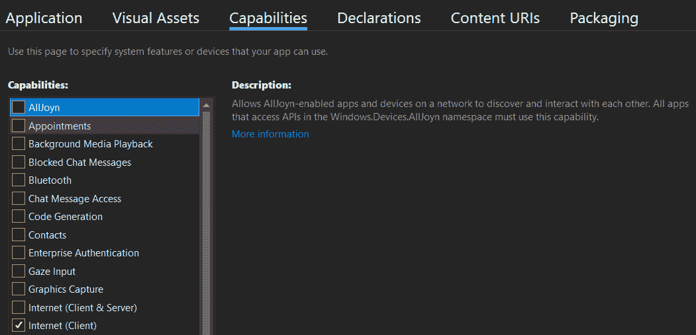
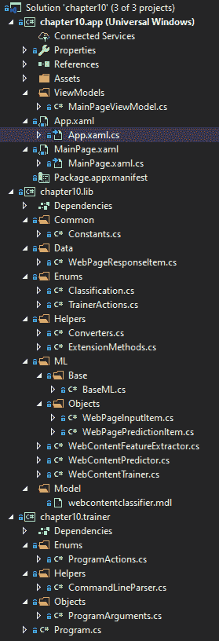
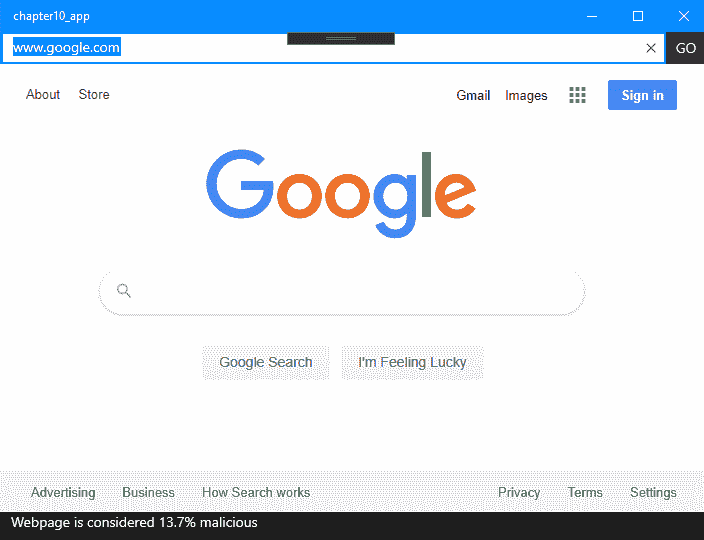
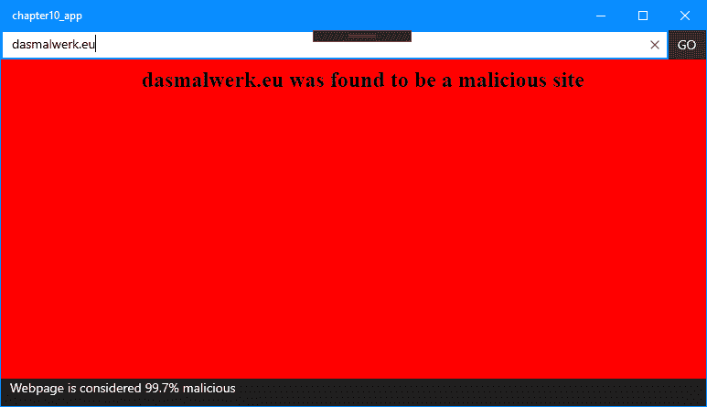

# 利用 ML.NET 和 UWP

既然我们已经确定了如何创建生产级。NET 核心控制台应用程序，在这一章中，我们将深入探讨使用**通用 Windows 平台** ( **UWP** )框架创建一个全功能的 Windows 10 应用程序。这个应用程序将利用 ML.NET 二进制分类模型来对网页内容进行分类，以确定内容是良性的还是恶意的。此外，我们将探索将您的代码分解为基于组件的架构，使用. NET 标准库在我们的桌面应用程序和将训练我们的模型的控制台应用程序之间共享。到本章结束时，你应该已经牢牢掌握了用 ML.NET 设计和编码一个生产级 UWP 桌面应用程序。

本章将涵盖以下主题:

*   分解 UWP 应用程序
*   创建 web 浏览器分类应用程序
*   探索其他生产应用程序增强功能


# 打破 UWP 的建筑

从高层次来看，UWP 提供了一个简单的框架来为 Windows 10 创建丰富的桌面应用程序。如前所述。NET Core，UWP 允许针对 x86、x64、**高级 RISC 机** ( **ARM** )。在撰写本文时，ML.NET 还不支持 ARM。此外，UWP 应用程序也可以用 JavaScript 和 HTML 编写。

典型的 UWP 桌面应用程序包括以下核心代码元素:

*   视图
*   模型
*   查看模型

这些组件形成了**模型** - **视图** - **视图模型**的通用 app 架构原理，又称 **MVVM** 。除了代码组件之外，图像和音频也很常见，这取决于您的应用程序或游戏的性质。

与 Android 和 iOS 平台上的移动应用程序类似，每个应用程序都有特定的权限，开发者在安装时会请求这些权限。因此，当您开发自己的 UWP 应用程序时，只请求您的应用程序绝对需要的访问权限。

对于我们将在本章中创建的示例应用程序，我们只需要作为客户端访问 internet，这可以在标记为 Internet (Client)的 Capabilities 选项卡中找到，如下面的屏幕截图所示:



互联网(客户端)和其他权限在 UWP 应用程序根目录下的`Package.appxmanifest` 文件中定义。这个文件显示在后面的*探索项目架构*部分的 Visual Studio 解决方案浏览器截图中。

为了准备深入研究将 ML.NET 集成到 UWP 应用程序中，让我们深入研究一下 UWP 应用程序中的三个核心组件。


# 视图

正如我们在前一章 Blazor 讨论中所定义的，视图包含应用程序的**用户界面** ( **UI** )组件。UWP 开发中的视图，例如在**Windows Presentation Foundation**(**WPF**)和 Xamarin 中找到的视图。表单，使用**可扩展应用程序标记语言** ( **XAML** )语法。那些熟悉 Bootstrap 网格模式的现代 web 开发的人，将会很快发现其中的相似之处，因为我们在本章的后面会深入探讨这一点。

web 开发和 UWP 开发之间最大的区别是当与 MVVM 原则一起使用时，强大的双向绑定 XAML 视图。正如您将在深入探讨中看到的，XAML 绑定消除了在代码中手动设置和获取值，而以前您可能会在 Windows 窗体或 web 窗体项目中执行这些操作。

对于使用 web 方法的应用程序，HTML 会像我们的 Blazor 项目一样在第 9 章中定义你的视图，在 ASP.NET 核心中使用 ML.NET*。*


# 模型

模型提供了视图和视图模型之间的数据容器。将模型视为纯粹的视图和视图模型之间的数据传输。例如，如果你有一个电影列表，那么在你的`MovieListingModel`类中会定义一个`MovieItems`的`List`集合。这个容器类将在视图模型中被实例化和填充，然后在视图中被绑定。


# 查看模型

视图模型为填充模型提供了业务逻辑层，从而间接地填充了视图。如前所述，UWP 开发中提供的 MVVM 绑定简化了触发点的管理，以确保您的 UI 层是最新的。这是通过在我们的视图模型中实现`INotifyPropertyChanged`接口来实现的。对于我们想要绑定到 UI 的每个属性，我们简单地调用`OnPropertyChanged`。这背后的强大之处在于，您可以在其他属性的 setter 中拥有带有触发器的复杂表单，而无需使用条件和无尽的代码来处理这些复杂性。

如果你想更深入地了解 UWP 开发，微软的 Channel9 有一个名为*Windows 10 Development for Absolute 初学者*的系列，它涵盖了 UWP 开发的所有主要方面:[https://channel 9 . msdn . com/Series/Windows-10-Development-for Absolute-初学者](https://channel9.msdn.com/Series/Windows-10-development-for-absolute-beginners)。


# 创建 web 浏览器分类应用程序

如前所述，我们将要创建的应用程序是一个 web 浏览器分类应用程序。使用在逻辑分类章节中获得的知识，我们将使用`SdcaLogisticRegression`算法来获取网页的文本内容，特征化文本，并提供恶意的置信度。此外，我们将把这项技术集成到一个 Windows 10 UWP 应用中，该应用模拟了一个网页浏览器——有效地导航到一个页面——运行该模型，并确定该页面是否是恶意的。如果发现是恶意的，我们会重定向到一个警告页面。虽然在现实世界的场景中，这可能证明在每个页面上运行太慢，但是高度安全的 web 浏览器的好处(取决于环境要求)可能远远超过运行我们的模型所产生的轻微开销。

和前面的章节一样，完整的项目代码、样本数据集和项目文件可以从[https://github . com/packt publishing/Hands-On-Machine-Learning-With-ML 下载。网/树/主人/第 10 章](https://github.com/PacktPublishing/Hands-On-Machine-Learning-With-ML.NET/tree/master/chapter10)。


# 探索项目架构

通过本章，我们将深入了解一个原生的 Windows 10 桌面应用程序。正如本章第一节提到的，我们将使用 UWP 框架来创建我们的应用程序。

这个示例应用程序不需要额外的 ML.NET nu get 包。然而，我们将使用`HtmlAgilityPack` NuGet 包来提供一种从给定网页中提取文本的快速方法。在撰写本文时，版本 1.11.18 是最新版本，也是本例中使用的版本。

在下面的屏幕截图中，您将找到该解决方案的 Visual Studio 解决方案资源管理器视图。假设这个例子包含三个独立的项目(更类似于一个生产场景)，那么新的和显著修改的文件的数量是相当大的。在这一部分的后面，我们将详细查看解决方案屏幕截图中显示的每个新文件:



`sampledata.csv`文件(在代码存储库的`Data`文件夹中)包含从`trainingURLList.csv`文件(也在`Data`文件夹中)中找到的 URL 中提取的八行文本。请随意调整 URL 列表文件，以测试您经常访问的网站。以下是其中一行的片段:

```
False|BingImagesVideosMapsNewsShoppingMSNOfficeOutlookWordExcelPowerPointOneNoteSwayOneDriveCalendarPeopleSigninRewardsDownloadtoday’simagePlaytoday'squizTheTajMahalinAgraforIndia'sRepublicDay©MicheleFalzone/plainpictureIt'sRepublicDayinIndiaImageofthedayJan26,2020It'sRepublicDayinIndia©MicheleFalzone/plainpictureForIndia's70thRepublicDay
```

除了`sampledata.csv`文件之外，我们还添加了`testdata.csv`文件，该文件包含额外的数据点，用于测试新训练的模型并对其进行评估。下面是`testdata.csv`中数据的一个示例行片段:

```
True|USATODAY:LatestWorldandUSNews-USATODAY.comSUBSCRIBENOWtogethomedeliveryNewsSportsEntertainmentLifeMoneyTechTravelOpinionWeatherIconHumidityPrecip.WindsOpensettingsSettingsEnterCityNameCancelSetClosesettingsFullForecastCrosswordsInvestigationsAppsBest-SellingBooksCartoons
```

由于示例项目的规模，在运行本节末尾的应用程序之前，我们将按照以下顺序深入研究每个不同组件的代码:

*   。NET 标准库，用于两个应用程序之间的公共代码
*   Windows 10 UWP 浏览器应用程序
*   。用于特征提取和训练的. NET 核心控制台应用程序


# 潜入图书馆

由于这种应用程序的性质和生产应用程序的性质，其中有多个平台和/或执行共享代码的方法，所以在本章的示例应用程序中使用了一个库。使用库的好处是所有公共代码都可以以可移植和无依赖性的方式存在。与在实际应用程序中复制或保留代码相比，使用 Xamarin 扩展这个示例应用程序的功能以包含其他平台(如 Linux 或 Mac 应用程序)要容易得多。

库中更改或添加的类和枚举如下:

*   `Constants`
*   `WebPageResponseItem`
*   `Converters`
*   `ExtensionMethods`
*   `WebPageInputItem`
*   `WebPagePredictionItem`
*   `WebContentFeatureExtractor`
*   `WebContentPredictor`
*   `WebContentTrainer`

`Classification`、`TrainerActions`、**、**和`BaseML` 职业保持不变，从[第 9 章](5f67e3b8-56bd-47ab-8a72-4f00b239d517.xhtml)、*使用 ML.NET 与 ASP.NET 核心*。


# 常量类

到目前为止，在我们的所有示例中使用的`Constants`类是一个公共类，它包含我们在库、训练器和 UWP 应用程序中使用的常量值。对于这一章，添加了`MODEL_NAME`和`MALICIOUS_THRESHOLD`属性来保存我们模型的名称和一个任意的阈值，分别用于决定何时将我们的预测分类为恶意的或不恶意的。如果您发现您的模型过于敏感，请尝试调整此阈值，如下所示:

```
public static class Constants
{
    public const string MODEL_NAME = "webcontentclassifier.mdl";

    public const string SAMPLE_DATA = "sampledata.csv";

    public const string TEST_DATA = "testdata.csv";

    public const double MALICIOUS_THRESHOLD = .5;
}
```


# WebPageResponseItem 类

`WebPageResponseItem`类是预测器和应用程序之间的容器类。该类包含我们在运行预测器后设置的属性，然后用于在我们的桌面应用程序中显示，如以下代码块所示:

```
public class WebPageResponseItem
{
    public double Confidence { get; set; }

    public bool IsMalicious { get; set; }

    public string Content { get; set; }

    public string ErrorMessage { get; set; }

    public WebPageResponseItem()
    {
    }

    public WebPageResponseItem(string content)
    {
        Content = content;
    }
}
```


# 转换器类

对`Converters`类进行了调整，以提供一个扩展方法来将我们的容器类转换成我们的模型所期望的类型。在这个例子中，我们有`Content`属性，它简单地映射到`WebPageInputItem`类中的`HTMLContent`变量，如下所示:

```
public static WebPageInputItem ToWebPageInputItem(this WebPageResponseItem webPage)
{
    return new WebPageInputItem
    {
        HTMLContent = webPage.Content
    };
}
```


# ExtensionMethods 类

如之前在第 9 章[中讨论的`ExtensionMethods`类，使用 ML.NET 和 ASP.NET 内核*，已经被扩展到包括`ToWebContentString`扩展方法。在这个方法中，我们传入我们想要从中检索 web 内容的 URL。使用前面提到的`HtmlAgilityPack`，我们创建一个`HtmlWeb`对象并调用`Load` 方法，然后遍历**文档对象模型** ( **DOM** )。考虑到大多数网站都有大量的脚本和样式表，我们在这个例子中的目的只是检查页面中的文本，也就是我们代码中脚本和样式节点的过滤器。一旦节点被遍历并添加到一个`StringBuilder`对象，我们将该对象的类型转换返回到一个字符串，如下面的代码块所示:*](5f67e3b8-56bd-47ab-8a72-4f00b239d517.xhtml)

```
public static string ToWebContentString(this string url)
{
    var web = new HtmlWeb();

    var htmlDoc = web.Load(url);

    var sb = new StringBuilder();

    htmlDoc.DocumentNode.Descendants().Where(n => n.Name == "script" || n.Name == "style").ToList().ForEach(n => n.Remove());

    foreach (var node in htmlDoc.DocumentNode.SelectNodes("//text()[normalize-space(.) != '']"))
    {
        sb.Append(node.InnerText.Trim().Replace(" ", ""));
    }

    return sb.ToString();
}
```


# WebPageInputItem 类

`WebPageInputItem`类是我们模型的输入对象，包含我们网页的标签和提取内容，如下面的代码块所示:

```
public class WebPageInputItem
{
    [LoadColumn(0), ColumnName("Label")]
    public bool Label { get; set; }

    [LoadColumn(1)]
    public string HTMLContent { get; set; }
}
```


# WebPagePredictionItem 类

`WebPagePredictionItem`类是我们模型的输出对象，包含对网页是恶意还是良性的预测，以及预测准确的概率得分和在我们模型创建的评估阶段使用的`Score`值，如下面的代码块所示:

```
public class WebPagePredictionItem
{
    public bool Prediction { get; set; }

    public float Probability { get; set; }

    public float Score { get; set; }
}
```


# WebContentFeatureExtractor 类

`WebContentFeatureExtractor`类包含我们的`GetContentFile`和`Extract`方法，操作如下:

1.  首先，我们的`GetContentFile`方法采用`inputFile`和`outputFile`值(分别是 URL 列表 CSV 和特征提取 CSV)。然后，它读取每个 URL，获取内容，然后输出到`outputFile`字符串，如下所示:

```
private static void GetContentFile(string inputFile, string outputFile)
{
    var lines = File.ReadAllLines(inputFile);

    var urlContent = new List<string>();

    foreach (var line in lines)
    {
        var url = line.Split(',')[0];
        var label = Convert.ToBoolean(line.Split(',')[1]);

        Console.WriteLine($"Attempting to pull HTML from {line}");

        try
        {
            var content = url.ToWebContentString();

            content = content.Replace('|', '-');

            urlContent.Add($"{label}|{content}");
        }
        catch (Exception)
        {
            Console.WriteLine($"Failed to pull HTTP Content from {url}");
        }
    }

    File.WriteAllText(Path.Combine(AppContext.BaseDirectory, outputFile), string.Join(Environment.NewLine, urlContent));
}     
```

2.  接下来，我们使用`Extract`方法调用训练和测试提取，传递两者的输出文件名，如下所示:

```
public void Extract(string trainingURLList, string testURLList, string trainingOutputFileName, string testingOutputFileName)
{
    GetContentFile(trainingURLList, trainingOutputFileName);

    GetContentFile(testURLList, testingOutputFileName);
}
```


# WebContentPredictor 类

`WebContentPredictor`类使用重载的`Predict`方法为我们的命令行和桌面应用程序提供接口，如下所述:

1.  第一个`Predict`方法是为我们的命令行应用程序准备的，它在调用`ToWebContentString`扩展方法之后，简单地接受 URL 并在*步骤 3* 中调用重载，就像这样:

```
public WebPageResponseItem Predict(string url) => Predict(new WebPageResponseItem(url.ToWebContentString()));
```

2.  然后，我们创建了`Initialize`方法，在这个方法中，我们从嵌入的资源中加载我们的模型。如果成功，该方法返回`true`；否则，它返回`false`，如下面的代码块所示:

```
public bool Initialize()
{
    var assembly = typeof(WebContentPredictor).GetTypeInfo().Assembly;

    var resource = assembly.GetManifestResourceStream($"chapter10.lib.Model.{Constants.MODEL_NAME}");

    if (resource == null)
    {
        return false;
    }

    _model = MlContext.Model.Load(resource, out _);

    return true;
}
```

3.  最后，我们调用创建预测引擎的`Predict`方法。然后，我们调用预测器的`Predict`方法，然后在返回更新后的`WebPageResponseItem`对象之前更新`Confidence`和`IsMalicious`属性，如下所示:

```
public WebPageResponseItem Predict(WebPageResponseItem webPage)
{
    var predictionEngine = MlContext.Model.CreatePredictionEngine<WebPageInputItem, WebPagePredictionItem>(_model);

    var prediction = predictionEngine.Predict(webPage.ToWebPageInputItem());

    webPage.Confidence = prediction.Probability;
    webPage.IsMalicious = prediction.Prediction;

    return webPage;
}
```


# WebContentTrainer 类

`WebContentTrainer` 类包含了训练和评估我们模型的所有代码。和前面的例子一样，这个功能包含在一个名为`Train`的方法中:

1.  第一个变化是使用`WebPageInputItem`类将 CSV 读入由`|`分隔的`dataView`对象，如下面的代码块所示:

```
var dataView = MlContext.Data.LoadFromTextFile<WebPageInputItem>(trainingFileName, hasHeader: false, separatorChar: '|');
```

2.  接下来，我们映射文件数据特征来创建管道。在本例中，我们简单地特征化了`HTMLContent`属性，并将其传递给`SdcaLogisticRegression`训练器，如下所示:

```
var dataProcessPipeline = MlContext.Transforms.Text
    .FeaturizeText(FEATURES, nameof(WebPageInputItem.HTMLContent))
    .Append(MlContext.BinaryClassification.Trainers.SdcaLogisticRegression(labelColumnName: "Label", featureColumnName: FEATURES));
```

3.  然后，我们拟合模型，并将模型保存到磁盘，如下所示:

```
var trainedModel = dataProcessPipeline.Fit(dataView);

MlContext.Model.Save(trainedModel, dataView.Schema, Path.Combine(AppContext.BaseDirectory, modelFileName));
```

4.  最后，我们加载测试文件，并调用`BinaryClassification`评估，如下所示:

```
var testingDataView = MlContext.Data.LoadFromTextFile<WebPageInputItem>(testingFileName, hasHeader: false, separatorChar: '|');

IDataView testDataView = trainedModel.Transform(testingDataView);

var modelMetrics = MlContext.BinaryClassification.Evaluate(
    data: testDataView);

Console.WriteLine($"Entropy: {modelMetrics.Entropy}");
Console.WriteLine($"Log Loss: {modelMetrics.LogLoss}");
Console.WriteLine($"Log Loss Reduction: {modelMetrics.LogLossReduction}");
```


# 深入 UWP 浏览器应用程序

库代码已经检查过了，下一个组件是桌面应用程序。正如在开始部分所讨论的，我们的桌面应用程序是一个 UWP 应用程序。就本例而言，我们使用标准的方法来处理应用程序架构，遵循本章开头部分讨论的 MVVM 方法。

我们将在这一部分深入研究的文件如下:

*   `MainPageViewModel`
*   `MainPage.xaml`
*   `MainPage.xaml.cs`

UWP 项目中的其他文件，如图块图像和 app 类文件，与默认的 Visual Studio UWP 应用程序模板没有任何变化。


# MainPageViewModel 类

`MainPageViewModel`类的目的是包含我们的业务逻辑并控制视图:

1.  我们做的第一件事是实例化我们之前讨论过的用于运行预测的`WebContentPredictor`类，如下所示:

```
private readonly WebContentPredictor _prediction = new WebContentPredictor();
```

2.  下一个代码块为我们的 **GO** 按钮、web 服务 URL 字段和 web 分类属性处理 MVVM 的能力。对于这些属性中的每一个，我们在值发生变化时调用`OnPropertyChanged`，这将触发视图的绑定，以刷新绑定到这些属性的任何字段，如下面的代码块所示:

```
private bool _enableGoButton;

public bool EnableGoButton
{
    get => _enableGoButton;

    private set
    {
        _enableGoButton = value;
        OnPropertyChanged();
    }
}

private string _webServiceURL;

public string WebServiceURL
{
    get => _webServiceURL;

    set
    {
        _webServiceURL = value;

        OnPropertyChanged();

        EnableGoButton = !string.IsNullOrEmpty(value);
    }
}

private string _webPageClassification;

public string WebPageClassification
{
    get => _webPageClassification;

    set
    {
        _webPageClassification = value;
        OnPropertyChanged();
    }
}
```

3.  接下来，我们定义`Initialize`方法，它调用预测器的`Initialize`方法。如果无法加载或找到模型，该方法将返回 false，如下所示:

```
public bool Initialize() => _prediction.Initialize();
```

4.  然后，我们获取用户通过`WebServiceURL`属性输入的 URL。根据该值，我们验证了前缀是`http`还是`https`。否则，在将 URL 转换为 URI 之前，会将`http://`作为前缀，如下所示:

```
public Uri BuildUri()
{
    var webServiceUrl = WebServiceURL;

    if (!webServiceUrl.StartsWith("http://", StringComparison.InvariantCultureIgnoreCase) &&
        !webServiceUrl.StartsWith("https://", StringComparison.InvariantCultureIgnoreCase))
    {
        webServiceUrl = $"http://{webServiceUrl}";
    }

    return new Uri(webServiceUrl);
}
```

5.  现在，我们的`Classify`方法获取用户输入的 URL。这个方法调用我们的`Predict`方法，构建我们的状态栏文本，如果发现是恶意的，构建 HTML 响应发送回我们的`WebView`对象，如下所示:

```
public (Classification ClassificationResult, string BrowserContent) Classify(string url)
{
    var result = _prediction.Predict(url);

    WebPageClassification = $"Webpage is considered {result.Confidence:P1} malicious";

    return result.Confidence < Constants.MALICIOUS_THRESHOLD ? 
        (Classification.BENIGN, string.Empty) : 
        (Classification.MALICIOUS, $"<html><body bgcolor=\"red\"><h2 style=\"text-align: center\">Machine Learning has found {WebServiceURL} to be a malicious site and was blocked automatically</h2></body></html>");
}
```

6.  最后，我们实现了`OnPropertyChanged`事件处理程序和方法，它们是`INotifyPropertyChanged`接口的标准实现，正如本章开始部分所讨论的和下面的代码块所示:

```
public event PropertyChangedEventHandler PropertyChanged;

protected virtual void OnPropertyChanged([CallerMemberName] string propertyName = null)
{
    PropertyChanged?.Invoke(this, new PropertyChangedEventArgs(propertyName));
}
```


# MainPage.xaml

正如在描述 UWP 开发的开始部分所讨论的，XAML 标记用于定义用户界面。对于这个应用程序的范围，我们的 UI 相对简单:

1.  我们首先定义的是我们的`Grid`。在 XAML，`Grid`是一个容器，类似于 web 开发中的`div`元素。然后我们定义我们的行。类似 Bootstrap，(但在我看来更容易理解)就是预定义每行的高度。将一行设置为`Auto`会自动将高度调整为内容的高度，而星号则转换为使用基于主容器高度的所有剩余高度，如下面的代码块所示:

```
<Grid>
  <Grid.RowDefinitions>
     <RowDefinition Height="Auto" />
     <RowDefinition Height="*" />
     <RowDefinition Height="Auto" />
  </Grid.RowDefinitions>
```

2.  类似于*步骤 1* 中的行定义，我们预定义了列。`"Auto"`和`"*"`的原理与它们对行的原理相同，只是宽度不同于高度，如下面的代码块所示:

```
<Grid.ColumnDefinitions>
    <ColumnDefinition Width="*" />
    <ColumnDefinition Width="Auto" />
</Grid.ColumnDefinitions>
```

3.  然后，我们为 URL 条目定义了我们的`TextBox`对象。注意`Binding` 调用中的`Text`值。这将文本框的文本字段绑定到视图模型中的`WebServiceURL`属性，如下所示:

```
<TextBox Grid.Row="0" Grid.Column="0" KeyUp="TxtBxUrl_KeyUp" Text="{Binding WebServiceURL, Mode=TwoWay, UpdateSourceTrigger=PropertyChanged}" />
```

4.  然后，我们添加一个按钮来模仿浏览器的 **GO** 按钮，该按钮触发导航。另外，请注意使用`Binding`来启用或禁用按钮本身(根据输入到 URL 文本框中的文本进行绑定)，如下面的代码块所示:

```
<Button Grid.Row="0" Grid.Column="1" Content="GO" Click="BtnGo_Click" IsEnabled="{Binding EnableGoButton}" />
```

5.  然后我们添加 UWP 附带的`WebView`控件，如下所示:

```
<WebView Grid.Row="1" Grid.Column="0" Grid.ColumnSpan="2" x:Name="wvMain" NavigationStarting="WvMain_OnNavigationStarting" />
```

6.  最后，我们添加状态栏网格和`TextBlock`控件来显示窗口底部的分类，如下所示:

```
<Grid Grid.Column="0" Grid.ColumnSpan="2" Grid.Row="2" Background="#1e1e1e" Height="30">
    <TextBlock Text="{Binding WebPageClassification, Mode=OneWay}" Foreground="White" Margin="10,0,0,0" />
</Grid>
```


# MainPage.xaml.cs

`MainPage.xaml.cs`文件包含前面讨论过的 XAML 视图背后的代码:

1.  我们定义的第一件事是内置在基类`Page`中的`DataContext`属性的包装属性，如下所示:

```
private MainPageViewModel ViewModel => (MainPageViewModel) DataContext;
```

2.  接下来，我们定义`MainPage`的构造函数来初始化`DataContext`到我们的`MainPageViewModel`对象，如下所示:

```
public MainPage()
{
    InitializeComponent();

    DataContext = new MainPageViewModel();
}
```

3.  然后，我们覆盖基本的`OnNavigatedTo`方法来初始化我们的视图模型，并验证模型被正确加载，如下所示:

```
protected override async void OnNavigatedTo(NavigationEventArgs e)
{
    var initialization = ViewModel.Initialize();

    if (initialization)
    {
        return;
    }

    await ShowMessage("Failed to initialize model - verify the model has been created");

    Application.Current.Exit();

    base.OnNavigatedTo(e);
}
```

4.  接下来，我们添加我们的`ShowMessage`包装器来提供一个简单的一行程序在我们的应用程序中调用，就像这样:

```
public async Task<IUICommand> ShowMessage(string message)
{
    var dialog = new MessageDialog(message);

    return await dialog.ShowAsync();
}
```

5.  然后，我们通过调用`Navigate`方法来处理 **GO** 按钮点击，如下所示:

```
private void BtnGo_Click(object sender, RoutedEventArgs e) => Navigate();
```

6.  然后我们创建我们的`Navigate`包装器方法，它构建 URI 并将其传递给`WebView`对象，如下所示:

```
private void Navigate()
{
    wvMain.Navigate(ViewModel.BuildUri());
}
```

7.  我们还想处理键盘输入，以监听用户在输入 URL 后按下 *Enter* 键的情况，为用户提供按下 *Enter* 或点击 **GO** 按钮的能力，如下所示:

```
private void TxtBxUrl_KeyUp(object sender, KeyRoutedEventArgs e)
{
    if (e.Key == VirtualKey.Enter && ViewModel.EnableGoButton)
    {
        Navigate();
    }
}
```

8.  最后，我们阻止导航，直到可以通过挂钩 WebView 的`OnNavigationStarting`事件获得分类，如下所示:

```
private void WvMain_OnNavigationStarting(WebView sender, WebViewNavigationStartingEventArgs args)
{
    if (args.Uri == null)
    {
        return;
    }

    var (classificationResult, browserContent) = ViewModel.Classify(args.Uri.ToString());

    switch (classificationResult)
    {
        case Classification.BENIGN:
            return;
        case Classification.MALICIOUS:
            sender.NavigateToString(browserContent);
            break;
    }
}
```


# 深入教练应用程序

既然我们已经查看了共享库和桌面应用程序，那么让我们深入研究一下 trainer 应用程序。由于在第 8 章的例子中执行了主要的架构变化，训练器应用程序在设计上只有很小的变化来处理本章例子中使用的特定类对象。

我们将查看以下文件:

*   `ProgramArguments`
*   `Program`


# ProgramArguments 类

在第 9 章`ProgramArguments`课程的基础上，我们只增加了三个课程。前两个增加的内容包括了`Training`和`Testing`输出文件名，为我们示例的基础设施提供了更好的灵活性。此外，`URL`属性保存了您可以使用命令行传递到 trainer 应用程序以获得预测的 URL，如下面的代码块所示:

```
public string TrainingOutputFileName { get; set; }

public string TestingOutputFileName { get; set; }

public string URL { get; set; }
```


# 程序类

在`Program`类中，我们现在将修改`switch case`语句以使用来自[第 10 章](9c105516-7e4f-4f99-b70f-8b0d6165d8c5.xhtml)、*使用 ML.NET 和 UWP* 的类/方法，如下所示:

```
switch (arguments.Action)
{
    case ProgramActions.FEATURE_EXTRACTOR:
        new WebContentFeatureExtractor().Extract(arguments.TrainingFileName, arguments.TestingFileName, 
            arguments.TrainingOutputFileName, arguments.TestingOutputFileName);
        break;
    case ProgramActions.PREDICT:
        var predictor = new WebContentPredictor();

        var initialization = predictor.Initialize();

        if (!initialization)
        {
            Console.WriteLine("Failed to initialize the model");

            return;
        }

        var prediction = predictor.Predict(arguments.URL);

        Console.WriteLine($"URL is {(prediction.IsMalicious ? "malicious" : "clean")} with a {prediction.Confidence:P2}% confidence");
        break;
    case ProgramActions.TRAINING:
        new WebContentTrainer().Train(arguments.TrainingFileName, arguments.TestingFileName, arguments.ModelFileName);
        break;
    default:
        Console.WriteLine($"Unhandled action {arguments.Action}");
        break;
}
```


# 运行教练应用程序

要开始运行 trainer 应用程序，我们需要首先运行`chapter10.trainer`应用程序，在模型训练之前执行特征提取。要运行训练器应用程序，其过程与第 9 章的示例应用程序几乎相同，只是在训练时增加了传递测试数据集文件名路径:

1.  运行训练器应用程序，传递训练和测试 URL 列表 CSV 的路径来执行特征提取，如下所示:

```
PS chapter10\trainer\bin\Debug\netcoreapp3.0> .\chapter10.trainer.exe TrainingFileName ..\..\..\..\Data\trainingURLList.csv TestingFileName ..\..\..\..\Data\testingURLList.csv
Attempting to pull HTML from https://www.google.com, false
Attempting to pull HTML from https://www.bing.com, false
Attempting to pull HTML from https://www.microsoft.com, false
Attempting to pull HTML from https://www8.hp.com/us/en/home.html, false
Attempting to pull HTML from https://dasmalwerk.eu, true
Attempting to pull HTML from http://vxvault.net, true
Attempting to pull HTML from https://www.tmz.com, true
Attempting to pull HTML from http://openmalware.org, true
Failed to pull HTTP Content from http://openmalware.org
Attempting to pull HTML from https://www.dell.com, false
Attempting to pull HTML from https://www.lenovo.com, false
Attempting to pull HTML from https://www.twitter.com, false
Attempting to pull HTML from https://www.reddit.com, false
Attempting to pull HTML from https://www.tmz.com, true
Attempting to pull HTML from https://www.cnn.com, true
Attempting to pull HTML from https://www.usatoday.com, true
```

2.  根据*步骤 1* 的样本和测试数据导出，运行应用程序来训练模型，如下所示:

```
PS chapter10\trainer\bin\Debug\netcoreapp3.0> .\chapter10.trainer.exe ModelFileName webcontentclassifier.mdl Action TRAINING TrainingFileName ..\..\..\..\Data\sampledata.csv TestingFileName ..\..\..\..\Data\testdata.csv
Entropy: 0.9852281360342516
Log Loss: 0.7992317560011841
Log Loss Reduction: 0.18878508766684401
```

根据模型所依据的数据集，您可以随意修改这些值并查看预测如何变化。从这一点来看，一些实验领域可能是:

*   调整**随机对偶坐标上升** ( **SDCA** )算法的`Trainer`类中复习的超参数，比如`MaximumNumberOfIterations`，看看精度是如何受到影响的。
*   除了简单地使用 HTML 内容之外，还要添加新的特性——可能是连接类型或脚本数量。
*   向训练和样本集添加更多变体，以便更好地对良性和恶意内容进行采样。

为了方便起见，GitHub 存储库在`Data`文件夹中包含了以下所有数据文件:

*   `testdata.csv`和`sampledata.csv`特征提取的 CSV 文件
*   `testingURLList.csv`和`trainingURLList.csv` URL 列出了 CSV 文件


# 运行浏览器应用程序

既然我们的模型已经被训练好了，我们可以运行我们的桌面应用程序并测试模型的功效。要运行该示例，请确保`chapter10_app`是启动应用程序，并点击 *F5* 。在启动我们的浏览器应用程序时，输入`www.google.com`，如下面的屏幕截图所示:



注意前面截图中网页内容下面的状态栏，指示运行模型后的恶意百分比。接下来，在您的浏览器中键入`dasmalwerk.eu`(这是一个默认训练 URL 列表预分类为恶意的网站)，并注意强制重定向，如以下截图所示:



请随意在您的机器上尝试各种文件来查看置信度得分，如果您收到一个误报，也许可以向模型添加额外的特征来纠正分类。


# 改进的其他想法

现在我们已经完成了我们的深入研究，有几个额外的元素可以进一步增强应用程序。这里讨论几个想法。


# 单次下载优化

目前，当在`WebView` UWP 控件中输入一个新的 URL 或者改变页面时，导航会暂停，直到可以进行分类。当这种情况发生时——正如我们之前详述的——使用`HtmlAgilityPack`库，我们下载并提取文本。如果页面被认为是干净的(大多数情况下很可能会遇到)，我们将有效地下载内容两次。这里的一个优化是在分类完成后将文本存储在应用程序的沙盒存储中，然后将`WebView`对象指向存储的内容。此外，如果使用这种方法，添加一个清除后台工作程序来删除旧数据，这样您的最终用户就不会得到几千兆字节的网页内容。


# 记录

正如我们上一章对日志记录的深入探讨，添加日志记录对于远程理解桌面应用程序何时发生错误至关重要。与上一章中我们的 web 应用程序不同，在 web 应用程序中，您的错误很可能发生在服务器端，并可能被远程访问，您的桌面应用程序可以安装在任何数量的 Windows 10 配置上，几乎有无限数量的排列。如前所述，强烈推荐使用 NLog([https://nlog-project.org/](https://nlog-project.org/))或类似的开源项目进行日志记录，再加上 Loggly 之类的远程日志记录解决方案，这样就可以从用户的机器上获取错误数据。考虑到**通用数据保护条例** ( **GDPR** )和最近的**加州消费者隐私法案** ( **CCPA** )，请确保传达该数据正在离开最终用户机器的事实，并且不要在这些日志中包含个人数据。


# 利用数据库

用户通常会相当频繁地访问相同的网站，因此将特定网站 URL 的分类存储在本地数据库中，如 LiteDB([http://www.litedb.org/](http://www.litedb.org/))将显著提高最终用户的性能。一种实现方法是在本地存储 URL 的 SHA256 散列作为键，以分类作为值。从长远来看，您可以提供一个 web URL 信誉数据库，将 URL 的 SHA256 哈希发送到一个可扩展的云存储解决方案，如微软的 Cosmos DB。存储 URL 的 SHA256 哈希可以避免最终用户对个人身份信息和匿名性的任何疑问。


# 摘要

在本章的过程中，我们已经深入探讨了生产就绪型 Windows 10 UWP 应用架构的内容，并以前几章中所做的工作为基础。我们还利用 ML.NET 的`SdcaLogisticRegression`算法创建了一个全新的网页分类 Windows 10 应用程序。最后，我们还讨论了进一步增强示例应用程序(以及一般的生产应用程序)的一些方法。

本章结束后，实际应用部分也就结束了。本书的下一部分包括敏捷生产团队中的一般机器学习实践，以及用 TensorFlow 和**开放神经网络交换** ( **ONNX** )模型扩展 ML.NET。在下一章中，我们将重点讨论前者。