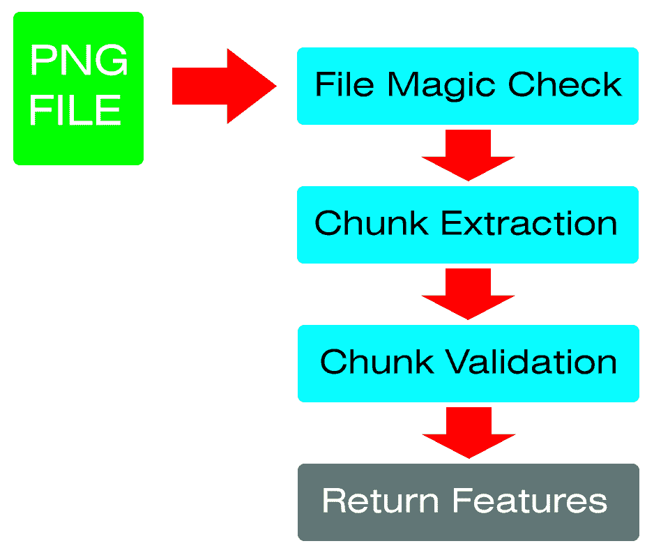
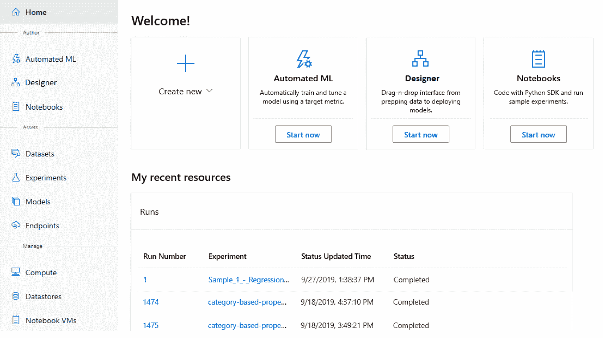
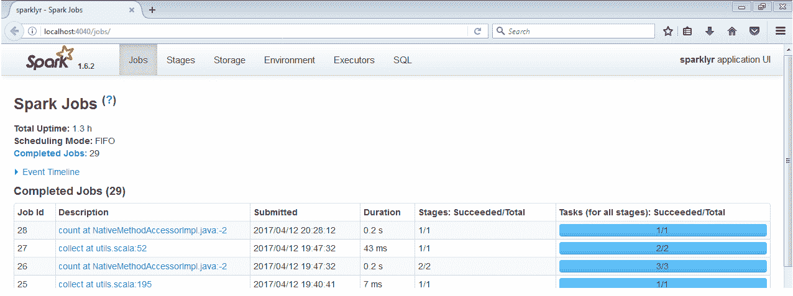

# 十五、训练和构建生产模型

当我们进入本书的最后一部分时，本章提供了在生产环境中使用机器学习的概述。至此，您已经学习了 ML.NET 提供的各种算法，并且创建了一套三个生产应用。有了所有这些知识，你的第一个想法可能会是:我如何才能立即创建下一个杀手级机器学习应用？在开始回答这个问题之前，本章将帮助你为这个旅程的下一步做好准备。如前几章所讨论和利用的，训练模型有三个主要部分:特征工程、样本收集和创建训练管道。在本章中，我们将重点关注这三个组成部分，扩展您如何成功创建生产模型的思维过程，并提供一些建议工具，以便能够通过生产级训练渠道重复这一成功。

在本章中，我们将讨论以下内容:

*   调查特征工程
*   获取训练和测试数据集
*   创建您的模型构建管道


# 调查特征工程

正如我们在前面章节中所讨论的，特征是模型构建过程中最重要的组成部分之一，客观上也是最重要的组成部分。当处理一个新问题时，出现的主要问题是:你将如何解决这个问题？例如，网络安全领域的一个常见漏洞是隐写术的使用。隐写术可以追溯到公元前 440 年，是一种将数据隐藏在容器中的做法。这个容器包括绘画、填字游戏、音乐和图片等等。在网络安全领域，隐写术用于隐藏文件中的恶意有效载荷，否则这些文件会被忽略，如图像、音频和视频文件。

以下面一篮子食物为例。这张使用在线隐写工具创建的图像中嵌入了信息；看看你是否能在下图中发现任何不寻常的模式:


今天的大多数工具可以屏蔽复杂和纯色图像中的内容，以至于您作为最终用户甚至不会注意到—如前面的示例所示。

继续这个场景，您现在可能需要回答的一个快速问题是:文件中是否包含另一种文件格式？另一个要考虑的因素是你的问题的范围。试图回答上述问题会导致深入分析递归解析器使用的每一种文件格式，这是非常耗时的——这不是马上就能解决的事情。一个更好的选择是将问题的范围扩大到分析音频文件或图像文件。进一步思考这个过程，让我们将问题的范围扩大到特定的图像类型和有效负载类型。


# 嵌入可执行文件的 PNG 图像文件

让我们深入这个更具体的问题:我们如何在**便携式网络图形** ( **PNG** )文件中检测 Windows 可执行文件？对于那些好奇的人来说，特别选择 PNG 文件背后的原因是，由于其良好的图像质量与文件大小的比率，它们是视频游戏和互联网中使用的一种非常常见的无损图像格式。这种程度的使用为攻击者在你的机器上获取 PNG 文件创造了一个接口，作为最终用户的你对此毫不犹豫，而专有格式或 Windows **可执行文件** ( **EXE** )可能会引起最终用户的警觉。

在下一节中，我们将把 PNG 文件分解为以下步骤:



为了更深入地研究 PNG 文件格式，PNG 的规范可以在这里找到:[http://libpng.org/pub/png/spec/1.2/PNG-Contents.html](http://libpng.org/pub/png/spec/1.2/PNG-Contents.html)


# 创建 PNG 解析器

现在让我们深入剖析 PNG 文件格式的特性，以便驱动一个潜在的模型来检测隐藏的有效载荷。PNG 文件由连续的块构成。每个数据块由一个标题描述字段组成，后面跟着一个数据有效载荷。一个 PNG 文件需要的组块有 **IHDR** 、 **IDAT、**和 **IEND** 。根据规范，各部分必须按此顺序出现。下面将对每一部分进行解释。

块前面的第一个元素是实现检查，以确保文件实际上是一个 PNG 图像文件。这种检查一般被称为**文件魔法检查**。在我们的数字世界中使用的大多数文件都有独特的签名，这使得解析和保存这些文件变得更加容易。

对于那些对其他文件格式的签名感兴趣的人，可以在这里找到一个详细的列表:[https://www.garykessler.net/library/file_sigs.html](https://www.garykessler.net/library/file_sigs.html)

PNG 文件特别以下列字节开头:

```
137, 80, 78, 71, 13, 10, 26, 10
```

通过使用这些文件魔术字节，我们可以利用`SequenceEqual`。NET 方法来比较文件数据的第一个字节序列，如下面的代码所示:

```
using var ms = new MemoryStream(data);

byte[] fileMagic = new byte[FileMagicBytes.Length];

ms.Read(fileMagic, 0, fileMagic.Length);

if (!fileMagic.SequenceEqual(FileMagicBytes))
{
     return (string.Empty, false, null);
}
```

如果`SequenceEqual`方法检查了`FileMagicBytes`属性并且不匹配，我们返回 false。在这种情况下，该文件不是 PNG 文件，因此，我们希望停止进一步解析该文件。

从这一点，我们现在将迭代文件的块。在任何时候，如果字节设置不正确，都应该注意到这一点，因为 Microsoft Paint 或 Adobe PhotoShop 会按照 PNG 文件格式的规范保存文件。另一方面，恶意生成器可能会违反 PNG 文件格式的规范，如下所示:

```
while (ms.Position != data.Length)
{
    byte[] chunkInfo = new byte[ChunkInfoSize];

    ms.Read(chunkInfo, 0, chunkInfo.Length);

    var chunkSize = chunkInfo.ToInt32();

    byte[] chunkIdBytes = new byte[ChunkIdSize];

    ms.Read(chunkIdBytes, 0, ChunkIdSize);

    var chunkId = Encoding.UTF8.GetString(chunkIdBytes);

    byte[] chunk = new byte[chunkSize];

    ms.Read(chunk, 0, chunkSize);

    switch (chunkId)
    {
        case nameof(IHDR):
            var header = new IHDR(chunk);

            // Payload exceeds length
            if (data.Length <= (header.Width * header.Height * MaxByteDepth) + ms.Position)
            {
                break;
            }

            return (FileType, false, new[] { "SUSPICIOUS: Payload is larger than what the size should be" });
        case nameof(IDAT):
            // Build Embedded file from the chunks
            break;
        case nameof(IEND):
            // Note that the PNG had an end
            break;
    }
}
```

对于每个块，我们读取`ChunkInfoSize`变量，它被定义为 4 个字节。这个`ChunkInfoSize`数组一旦被读取，就包含要读取的块的大小。除了确定我们要读取的块类型之外，我们还读取 4 个字符的字符串(`IHDR`、`IDAT`、`IEND`)的 4 字节块。

一旦我们有了块的大小和类型，我们就可以构建每个块的类对象表示。对于这个代码示例的范围，我们将只查看 IHDR 类的一个片段，它包含高级图像属性，如尺寸、位深度和压缩:

```
public class IHDR
{
    public Int32 Width;

    public Int32 Height;

    public byte BitDepth;

    public byte ColorType;

    public byte Compression;

    public byte FilterMethod;

    public byte Interlace;

    public IHDR(byte[] data)
    {
        Width = data.ToInt32();

        Height = data.ToInt32(4);
    }
}
```

我们将只提取`Width`和`Height`属性，它们是前 8 个字节(每个 4 个字节)。对于这个例子，我们也利用一个扩展方法将一个字节数组转换成一个 **`Int32`** 数组。在大多数情况下，BitConverter 将是理想的场景，但是，对于这个代码示例，我希望简化数据的顺序访问，例如在检索前面提到的`Height`属性时，偏移 4 个字节。

前面提到的 IDAT 块是实际的图像数据，也是包含嵌入式有效负载的潜在块。顾名思义，IEND 只是告诉 PNG 解析器文件是完整的，也就是说，IEND 块中没有有效载荷。

一旦文件被解析，我们返回文件类型(**PNG**)——无论它是否是一个有效结构化的 PNG 文件——我们注意到任何可疑的事情，比如文件大小是否比它应该的大得多，给定宽度、高度和最大位深度(24)。对于这些注释中的每一个，它们都可以被规范化，以及生产模型中的有效/无效标志。此外，这些可以有一个简单枚举的数字表示。

对于那些对完整应用的源代码感兴趣的人，请参考[https://github.com/jcapellman/virus-tortoise](https://github.com/jcapellman/virus-tortoise)，它利用了在[第 9 章](5f67e3b8-56bd-47ab-8a72-4f00b239d517.xhtml)、*中的*创建文件分类应用*部分中显示的许多相同的原理，使用具有 ASP.NET 内核的 ML.NET*。

进一步看这个例子，遍历包含实际图像数据和潜在可执行有效载荷的 IDAT 块，将完成生产应用中的提取器。

现在，我们已经了解了构建生产级别的要素所需的工作量，让我们开始构建生产训练数据集。


# 获取训练和测试数据集

现在我们已经完成了对特征工程的讨论，下一步是获取数据集。对于某些问题，这可能非常困难。例如，当试图预测别人没有做过的事情或新兴领域的事情时，拥有一个训练集来进行训练会比我们前面的例子中找到恶意文件更困难。

另一个要考虑的方面是多样性和数据是如何分解的。例如，考虑你如何使用 ML.NET 提供的异常检测训练器，基于行为分析预测恶意的 Android 应用。当考虑建立你的数据集时，我认为大多数 Android 用户并没有一半的应用是恶意的。因此，即使是恶意的和良性的(50/50)训练和测试集的分解也可能过度适合恶意的应用。弄清楚并分析你的目标用户将会遇到的实际表现是至关重要的，否则你的模型可能会出现误报或漏报，这两种情况你的最终用户都不会满意。

训练和测试数据集时要考虑的最后一个因素是如何获取数据集。由于您的模型在很大程度上基于训练和测试数据集，因此找到代表您的问题集的真实数据集至关重要。使用前面的隐写术示例，如果您未经验证就提取了随机的 PNG 文件，则有可能在坏数据上训练模型。对此的缓解是检查 IDAT 组块中隐藏的有效载荷。同样，PNG 示例中对实际文件的验证也很关键。当您在生产应用中只运行 PNG 文件时，对混合在 PNG 文件中的 JPG、BMP 或 GIF 文件的训练也可能导致误报或漏报。因为其他图像格式的二进制结构不同于 PNG，所以这种不具代表性的数据会使训练集偏向不支持的格式。

对于网络安全领域的人来说，如果很难获得各种文件类型的本地数据源，virus total([https://www.virustotal.com](https://www.virustotal.com))和 Reversing Labs([https://www.reversinglabs.com](https://www.reversinglabs.com))提供大量的文件数据库供付费下载。


# 创建您的模型构建管道

创建要素提取器并获得数据集后，下一个要建立的元素是模型构建管道。下图可以更好地显示模型构建管道的定义:


对于每个步骤，我们将在下一节讨论它们如何与您选择的管道相关联。


# 讨论在管道平台中要考虑的属性

有相当多的管道工具可用于内部部署，无论是在云中还是作为 **SaaS** ( **软件作为** **a** **服务**)服务。我们将回顾行业中几个比较常用的平台。但是，无论您选择哪种平台，以下几点都是需要记住的几个要素:

*   速度很重要，原因有几个。在构建初始模型时，迭代的时间非常重要，因为您很可能会调整训练集和超参数，以便测试各种组合。在流程的另一端，当您处于预生产或生产阶段时，与测试人员或客户(他们正在等待一个新的模型来解决问题或添加特性)进行迭代的时间在大多数情况下是至关重要的。
*   **可重复性**对于确保在给定相同数据集、特征和超参数的情况下每次都能重建完美模型也很重要。尽可能利用自动化是避免训练模型中人为错误的一种方法，同时也有助于提高可重复性。下一节将介绍的所有平台都提倡在启动新的训练课程后，在没有任何人工输入的情况下定义管道。
*   **版本控制和跟踪比较**很重要，这样可以确保在进行更改时，可以对它们进行比较。例如，无论是超参数(如快速树模型中树的深度)还是添加的额外样本，在迭代时跟踪这些变化都是至关重要的。假设，如果你做了一个记录在案的改变，而你的效率显著下降，你总是可以回去评估那个改变。如果您没有版本化或记录您的个人变化以供比较，这个简单的变化可能很难准确指出功效的下降。跟踪的另一个要素是跟踪一段时间内的进展，例如每季度或每年。这种级别的跟踪有助于描绘一幅画面，也有助于推动后续步骤或跟踪功效趋势，以便获得更多样本或添加更多功能。
*   最后，**质量保证**很重要，原因有几个，而且几乎在所有情况下，对项目的成败都至关重要。想象一下，一个模型被直接部署到生产环境中，而没有任何额外的检查，由专门的质量保证团队执行手动和自动测试。自动化测试——简单到一组单元测试，以确保从发布前的模型到模型，再到生产，样本测试相同或更好——可能是一个很好的权宜之计，而不是一整套具有特定功效范围的自动化测试。

在执行上一节中讨论的模型构建管道中的每个步骤时，应该考虑所有这四个元素。交付的最后一步取决于前面三个要素是否正确完成。实际交付取决于您的应用。例如，如果您正在创建一个 ASP.NET 应用，比如我们在第九章第一节中创建的应用，使用 ML.NET 和 ASP.NET 内核第三节中创建的应用，将 ML.NET 模型添加到您的 Jenkins 管道中是一个很好的方法，这样它会自动与您的部署捆绑在一起。


# 探索机器学习平台

以下是我个人使用过的平台，和/或同事用来解决各种问题的平台。每个平台都有其优点和缺点，特别是考虑到我们试图解决的每个问题的独特性。


# Azure 机器学习

微软的 Azure 云平台除了提供机器学习平台之外，还为 Kubernetes、虚拟机和数据库提供了完整的平台。这个平台提供了到 Azure SQL 数据库、Azure 文件存储和公共 URL 的直接连接，这只是训练和测试集的一部分。Visual Studio Community 2019 内部免费提供了一个不可伸缩的轻量级版本。下面的截图显示了完整的用户界面:



此外，非。NET 技术，如 TensorFlow、PyTorch 和 scikit-learn 都是完全支持的。流行的 Jupyter Notebook 和 Azure Notebook 等工具也完全支持。

类似于 Apache Airflow，在 Azure Machine Learning 中也很容易检查运行历史以比较版本。

支持上述模型构建管道的所有阶段。以下是 Azure 机器学习的一些利弊:

**优点:**

*   广泛集成到多个数据源中
*   ML.NET 本地支持
*   可以根据您的需求进行伸缩
*   不需要基础设施设置

**缺点:**

*   训练时可能会很贵


# 阿帕奇气流

Apache Airflow 是一个开源软件，它提供了创建几乎无限复杂的管道的能力。虽然不是本机支持的框架。NET 核心应用——如我们在本书中创建的那些——可以运行，只要。NET 核心运行时是用自包含标志安装或编译的。虽然学习曲线高于微软的 Azure 机器学习平台，但在某些情况下免费，特别是在简单的实验中，可能更有益。下面的截图是气流的 UI:


就像 Azure 机器学习一样，管道的可视化确实使特定管道的配置比 Apache Spark 更容易。然而，与 Apache Spark 非常相似，安装和配置(取决于您的技能水平)可能会令人望而生畏，尤其是在 pip 安装之后。启动和运行的一个更简单的方法是使用预构建的 Docker 容器，比如 Puckel 的 Docker 容器([https://hub.docker.com/r/puckel/docker-airflow](https://hub.docker.com/r/puckel/docker-airflow))。

以下是阿帕奇气流的一些利弊:

**优点:**

*   免费和开源
*   4 年多来的文档和示例
*   在 Windows、Linux 和 macOS 上运行

**缺点:**

*   设置复杂(尤其是使用官方 pip 说明)
*   。NET 本身不受支持


# 阿帕奇火花

Apache Spark 是另一个开源工具，虽然通常用于大数据管道，但也可以配置用于特征提取、训练和大规模模型生产。当内存和 CPU 限制阻碍您构建模型的能力时，例如，使用大规模数据集进行训练时，我个人看到 Apache Spark 扩展到利用多个 64C/128T AMD 服务器，最大化超过 1tb 的 ram。我发现这个平台比 Apache Airflow 或 Azure 的机器学习平台更难建立，但是，一旦建立起来，它会非常强大。下面的截图展示了 Apache Spark 的 UI:



在微软的 Apache Spark 页面([https://dot net . Microsoft . com/learn/data/Spark-tutorial/intro](https://dotnet.microsoft.com/learn/data/spark-tutorial/intro))上可以找到一个很好的分步安装指南，适用于 Windows 和 Linux。该指南确实消除了一些未知因素，但是，与 Azure 或 Airflow 相比，它仍然不容易启动和运行。以下是 Apache Spark 的一些优点和缺点:

**优点:**

*   免费和开源
*   。微软的. NET 绑定
*   由于其悠久的历史(> 5 年)，有大量的文档
*   在 Windows、macOS 和 Linux 上运行

**缺点:**

*   可能很难配置、启动和运行
*   对 IT 基础设施变化敏感

微软为 Apache Spark 编写了一个. NET 绑定，并免费发布:[https://dotnet.microsoft.com/apps/data/spark](https://dotnet.microsoft.com/apps/data/spark)。这些绑定可用于 Windows、macOS 和 Linux。


# 摘要

在本章的课程中，我们深入探讨了生产就绪模型训练的内容，从最初的目的问题到经过训练的模型。通过这次深入研究，我们已经检查了通过生产思维过程和特征工程来创建详细特征所需的努力程度。然后，我们回顾了挑战、解决训练问题的方法以及如何测试数据集问题。最后，我们还深入探讨了使用完全自动化的流程来构建实际模型管道的重要性。

在下一章中，我们将利用 WPF 应用中预先构建的 TensorFlow 模型来确定提交的图像是否包含某些对象。本次深度探索将探索 ML.NET 如何为 TensorFlow 模型提供易于使用的界面。