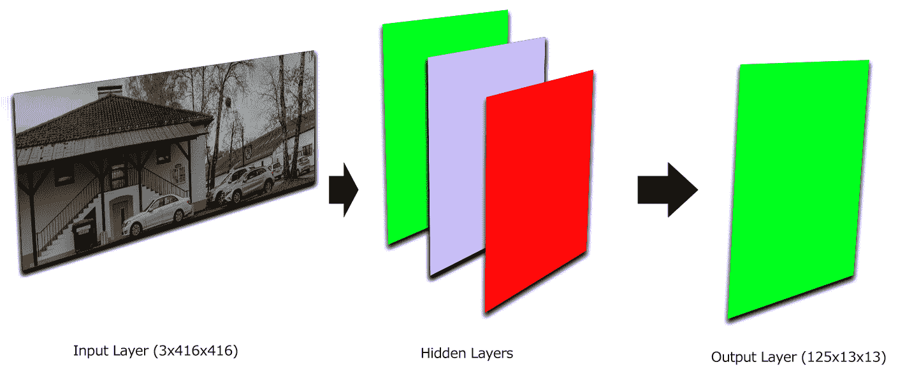
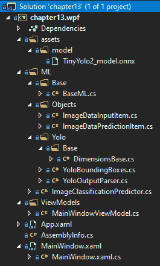
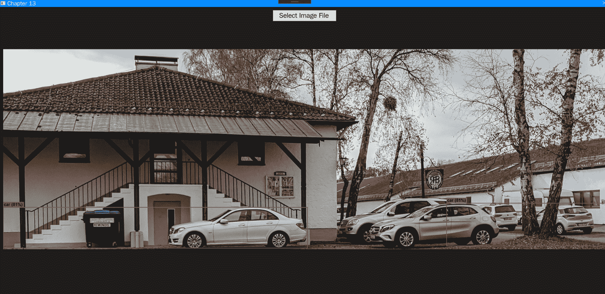

# 十三、将 ONNX 与 ML.NET 一起使用

既然我们已经完成了使用 TensorFlow 和一个**Windows Presentation Foundation**(**【WPF】**)应用和 ML.NET 的深入研究，现在是时候开始使用**和 ML.NET 的开放神经网络交换** ( **ONNX** )了。具体来说，在这最后一章中，我们将回顾 ONNX 是什么，此外还将使用一个名为 **YOLO** 的预训练 ONNX 模型创建一个新的示例应用。这个应用将建立在前一章的基础上，并显示模型检测到的对象的边界框。此外，我们将在本章的结尾给出改进示例的建议，使其成为生产级应用或集成到生产应用中。

在本章中，我们将讨论以下主题:

*   分解 ONNX 和 YOLO
*   创建 ONNX 对象检测应用
*   探索其他生产应用增强功能


# 分解 ONNX 和 YOLO

正如在[第 1 章](b8d873e1-9234-4f11-ad94-76df5ffbb228.xhtml)、*机器学习入门和*中提到的，ONNX 标准在业内被广泛认为是跨机器学习框架的真正通用格式。在接下来的两节中，我们将回顾 ONNX 提供了什么，以及将在本章中驱动我们的示例的 YOLO 模型。


# ONNX 简介

创建 ONNX 是为了在使用预训练模型或跨框架训练模型时，减少流程的束缚，实现流程的自由流动。通过为框架提供一个开放的导出格式，ONNX 允许了互操作性，从而促进了实验，否则由于几乎每个框架中使用的专有格式的性质，实验将被禁止。

目前，受支持的框架包括 TensorFlow、XGBoost 和 py torch——当然还有 ML.NET。

如果你想进一步深入 ONNX，请查看他们的网站:[https://onnx.ai/index.h](https://onnx.ai/index.html)[tml](https://onnx.ai/index.html)。


# YOLO ONNX 模型

在[第 12 章](049e90c4-05b0-466d-af93-d56df861a843.xhtml)、*和 ML.NET*所做工作的基础上，我们使用了预训练的初始模型，在本章中，我们将使用预训练的 YOLO 模型。该模型提供了非常快速和准确的对象检测，这意味着它可以以一定的置信度在图像中找到多个对象。这与上一章的模型不同，上一章的模型提供了纯图像分类，例如水或食物。

为了帮助形象化这两个模型之间的差异，请将前一章对水进行分类的 TensorFlow 模型与本章对汽车的对象检测进行比较，如下图所示:


由于互联网上图像数量的显著增加和对安全性的需要，图像(和视频)中的对象检测的需求一直在增加。想象一个拥挤的环境，如足球场，尤其是前门附近。保安巡逻和监控这个区域；然而，和你一样，他们也只是人类，只能以一定的准确度扫视这么多人。应用实时机器学习的对象检测来拾取武器或大包，然后可以用来提醒保安人员去追捕嫌疑人。

YOLO 模型本身有两种主要形式——微型模型和完整模型。对于这个例子的范围，我们将使用较小的模型(大约 60 MB ),它可以对一个图像中的 20 个对象进行分类。微型模型由九个卷积层和六个最大池层组成。完整的模型可以分类成千上万的物体，如果有合适的硬件(即**图形处理单元**(**GPU**))，可以比实时运行更快。

下图描述了 YOLO 模型的工作原理(在某种程度上，还有神经网络):



实际上，图像被转换成 3×416×416 的图像。3 分量代表**红绿蓝** ( **RGB** )值。这 416 个值表示调整后的图像的宽度和高度。这个输入层然后被输入到模型的隐藏层。对于我们在本章中使用的微型 YOLO v2 模型，在输出图层之前总共有 15 个图层。

要深入了解 YOLO 模式，请阅读本文:[https://arxiv.org/pdf/1612.08242.pdf](https://arxiv.org/pdf/1612.08242.pdf)。


# 创建 ONNX 对象检测应用

如前所述，我们将创建的应用是一个使用预训练 ONNX 模型的对象检测应用。使用我们在[第 12 章](049e90c4-05b0-466d-af93-d56df861a843.xhtml)、*中开发的应用，使用 TensorFlow 和 ML.NET*作为起点，当模型对它知道的对象进行分类时，我们将添加对覆盖在图像顶部的边界框的支持。这对公众的有用之处在于图像对象检测提供的各种应用。想象一下，你正在为警察或情报部门做一个项目，他们有图像或视频，想要检测武器。正如我们将要展示的那样，将 YOLO 模型应用于 ML.NET，将会使这一过程变得非常容易。

与前面的章节一样，完整的项目代码、预先训练的模型和项目文件可以在这里下载:[https://github . com/packt publishing/Hands-On-Machine-Learning-With-ML。网/树/主人/第 13 章](https://github.com/PacktPublishing/Hands-On-Machine-Learning-With-ML.NET/tree/master/chapter13)。


# 探索项目架构

基于我们在前几章中创建的项目体系结构和代码，我们将审查的体系结构得到了增强，变得更加结构化，更便于最终用户使用。

与前面的一些章节一样，如果您想要利用 ONNX 模型并执行对象检测，则需要以下两个额外的 NuGet 包:

*   `Microsoft.ML.ImageAnalytics`
*   `Microsoft.ML.OnnxTransformer`

这些 NuGet 包已经在包含的示例代码中被引用。这些包的 1.3.1 版本在 GitHub 上的示例和本章的深入探讨中都有使用。

在下面的屏幕截图中，您将找到该项目的 Visual Studio 解决方案资源管理器视图。该解决方案新增了几项功能，以促进我们的目标生产用例。我们将在本章后面的以下解决方案屏幕截图中详细查看每个新文件:



由于撰写本文时的当前 model 限制，ONNX 支持仅针对使用现有模型的评分提供。本例中包含的预训练模型可以在`assets/model`文件夹中找到。


# 钻研代码

对于此应用，如前一节所述，我们使用 TensorFlow 和 ML.NET 构建在第[章第 12](049e90c4-05b0-466d-af93-d56df861a843.xhtml) 、*中完成的工作的基础上。虽然**用户界面** ( **UI** )没有太大变化，但是运行 ONNX 模型的底层代码发生了变化。对于每个更改过的文件——如前几章所述——我们将回顾所做的更改以及更改背后的原因。*

更改或添加的类如下:

*   `DimensionsBase`
*   `BoundingBoxDimensions`
*   `YoloBoundingBox`
*   `MainWindow.xaml`
*   `ImageClassificationPredictor`
*   `MainWindowViewModel`

还有一个附加文件，其中包含了`YoloOutputParser`类。这个类来源于**麻省理工学院** ( **麻省理工学院**)为`TinyYOLO` ONNX 模型授权的接口。由于这节课时间较长，我们就不复习了；然而，代码读起来确实很容易，如果您希望逐步完成一个预测，流程将很容易理解。


# DimensionsBase 基类

`DimensionsBase`类包含坐标以及`Height`和`Width`属性，如下面的代码块所示:

```
public class DimensionsBase
{
    public float X { get; set; }

    public float Y { get; set; }

    public float Height { get; set; }

    public float Width { get; set; }
}
```

这个基类被`YoloOutputParser`和`BoundingBoxDimensions`类用来减少代码重复。


# YoloBoundingBox 类

`YoloBoundingBox`类提供了容器类，用于在为覆盖图生成边界框时填充边界框，如下面的代码块所示:

```
public class YoloBoundingBox
{
    public BoundingBoxDimensions Dimensions { get; set; }

    public string Label { get; set; }

    public float Confidence { get; set; }

    public RectangleF Rect => new RectangleF(Dimensions.X, Dimensions.Y, Dimensions.Width, Dimensions.Height);

    public Color BoxColor { get; set; }
}
```

此外，在这个类文件中还定义了我们的`BoundingBoxDimensions`类，如下面的代码块所示:

```
public class BoundingBoxDimensions : DimensionsBase { }
```

同样，这种继承用于减少代码重复。


# MainWindow.xaml 文件

我们的应用的**可扩展应用标记语言** ( **XAML** )视图已经简化为只有按钮和图像控件，如下面的代码块所示:

```
<Grid>
    <Grid.RowDefinitions>
        <RowDefinition Height="Auto" />
        <RowDefinition Height="*" />
    </Grid.RowDefinitions>

    <Button Grid.Row="0" Margin="0,10,0,0" Width="200" Height="35" Content="Select Image File" HorizontalAlignment="Center" Click="btnSelectFile_Click" />

    <Image Grid.Row="1" Margin="10,10,10,10" Source="{Binding SelectedImageSource}" />
</Grid>
```

此外，由于您可能选择的边界框和图像的性质，窗口默认为`Maximized`，如以下代码块所示:

```
<Window x:Class="chapter13.wpf.MainWindow"

        xmlns:x="http://schemas.microsoft.com/winfx/2006/xaml"
        xmlns:d="http://schemas.microsoft.com/expression/blend/2008"
        xmlns:mc="http://schemas.openxmlformats.org/markup-compatibility/2006"
        xmlns:local="clr-namespace:chapter13.wpf"
        mc:Ignorable="d"
        ResizeMode="NoResize"
        WindowStyle="SingleBorderWindow"
        WindowState="Maximized"
        WindowStartupLocation="CenterScreen"
        Background="#1e1e1e"
        Title="Chapter 13" Height="450" Width="800">
```

XAML 的变化已经过去，现在让我们进入修改后的`ImageClassificationPredictor`类。


# ImageClassificationPredictor 类

`ImageClassificationPredictor`类，很像[第 12 章](049e90c4-05b0-466d-af93-d56df861a843.xhtml)、*与 ML.NET*一起使用 TensorFlow，包含了运行我们的图像预测的方法。在本章中，我们将需要创建几个额外的类对象来支持 ONNX 模型的运行，如下所示:

1.  首先，我们定义了定义网络高度和宽度的`ImageNetSettings`结构。YOLO 模型要求使用 416 像素乘 416 像素，如下面的代码块所示:

```
public struct ImageNetSettings
{
    public const int imageHeight = 416;
    public const int imageWidth = 416;
}   
```

2.  接下来，我们定义用于 ONNX 模型的`TinyYoloModelSettings`结构，如下所示:

```
public struct TinyYoloModelSettings
{
    public const string ModelInput = "image";

    public const string ModelOutput = "grid";
}
```

3.  与前一章不同，在第一次运行时，TensorFlow 模型被导入，然后作为 ML.NET 模型导出，在撰写本文时，ONNX 不支持这种方式。因此，我们每次都必须在`Initialize`方法中加载 ONNX 模型，如下面的代码块所示:

```
public (bool Success, string Exception) Initialize()
{
    try
    {
        if (File.Exists(ML_NET_MODEL))
        {
            var data = MlContext.Data.LoadFromEnumerable(new List<ImageDataInputItem>());

            var pipeline = MlContext.Transforms.LoadImages(outputColumnName: "image", imageFolder: "", 
                    inputColumnName: nameof(ImageDataInputItem.ImagePath))
                .Append(MlContext.Transforms.ResizeImages(outputColumnName: "image", 
                    imageWidth: ImageNetSettings.imageWidth, 
                    imageHeight: ImageNetSettings.imageHeight, 
                    inputColumnName: "image"))
                .Append(MlContext.Transforms.ExtractPixels(outputColumnName: "image"))
                .Append(MlContext.Transforms.ApplyOnnxModel(modelFile: ML_NET_MODEL, 
                    outputColumnNames: new[] { TinyYoloModelSettings.ModelOutput }, 
                    inputColumnNames: new[] { TinyYoloModelSettings.ModelInput }));

            _model = pipeline.Fit(data);

            return (true, string.Empty);
        }

        return (false, string.Empty);
    }
    catch (Exception ex)
    {
        return (false, ex.ToString());
    }
}
```

4.  接下来，我们广泛地修改`Predict`方法来支持`YoloParser`调用，调用`DrawBoundingBox`方法来覆盖边界框，然后返回更新图像的字节，如下所示:

```
public byte[] Predict(string fileName)
{
    var imageDataView = MlContext.Data.LoadFromEnumerable(new List<ImageDataInputItem> { new ImageDataInputItem { ImagePath = fileName } });

    var scoredData = _model.Transform(imageDataView);

    var probabilities = scoredData.GetColumn<float[]>(TinyYoloModelSettings.ModelOutput);

    var parser = new YoloOutputParser();

    var boundingBoxes =
        probabilities
            .Select(probability => parser.ParseOutputs(probability))
            .Select(boxes => parser.FilterBoundingBoxes(boxes, 5, .5F));

    return DrawBoundingBox(fileName, boundingBoxes.FirstOrDefault());
}
```

为了简洁起见，这里没有显示`DrawBoundingBox`方法。在高层次上，原始图像被加载到内存中，然后模型的边界框与标签和置信度一起被绘制在图像的顶部。然后，更新后的图像被转换为字节数组并返回。


# MainWindowViewModel 类

在`MainWindowViewModel`类中，由于这个例子的性质，需要做一些改变。我们在这里看它们:

1.  首先，`LoadImageBytes`方法现在简单地将解析后的图像字节转换成一个`Image`对象，就像这样:

```
private void LoadImageBytes(byte[] parsedImageBytes)
{
    var image = new BitmapImage();

    using (var mem = new MemoryStream(parsedImageBytes))
    {
        mem.Position = 0;

        image.BeginInit();

        image.CreateOptions = BitmapCreateOptions.PreservePixelFormat;
        image.CacheOption = BitmapCacheOption.OnLoad;
        image.UriSource = null;
        image.StreamSource = mem;

        image.EndInit();
    }

    image.Freeze();

    SelectedImageSource = image;
}
```

2.  最后，我们修改`Classify`方法以在成功运行模型时调用`LoadImageBytes`方法，如下所示:

```
public void Classify(string imagePath)
{
    var result = _prediction.Predict(imagePath);

    LoadImageBytes(result);
}
```

对`Classify`方法进行修改后，本章示例所需的代码修改就结束了。现在，让我们运行应用！


# 运行应用

要运行该应用，流程与第 12 章【ML.NET 使用 TensorFlow】中的示例应用相同。要在 Visual Studio 中运行应用，只需单击工具栏中的*播放*图标，如下图所示:


启动应用后，就像在[第十二章](049e90c4-05b0-466d-af93-d56df861a843.xhtml)、【model】使用 TensorFlow】一样，选择一个图像文件，模型就会运行。例如，我选择了一张去德国度假时拍的照片(注意汽车的边框)，如下图所示:



请随意尝试选择您硬盘上的图像，以查看检测的可信度以及对象周围的边界框形成得如何。


# 探索其他生产应用增强功能

现在我们已经完成了我们的深入研究，有几个额外的元素来进一步增强应用。在接下来的章节中，我们将讨论一些想法。


# 记录

如前所述，在桌面应用中，日志的重要性怎么强调都不为过。随着应用复杂性的增加，强烈推荐使用 NLog([https://nlog-project.org/](https://nlog-project.org/))或类似的开源项目进行日志记录。这将允许您以不同的级别登录到文件、控制台或第三方日志解决方案，如 Loggly。例如，如果您将此应用部署给客户，那么在远程调试问题时，将错误级别分解为至少调试、警告和错误将会很有帮助。


# 图像缩放

您可能已经注意到，对于非常大的图像(超过屏幕分辨率的图像)，图像预览中边界框的文本标签和大小调整不像 640 x 480 图像那样容易阅读。这里需要改进的一个地方是提供悬停功能，根据窗口大小调整图像大小或者动态增加字体大小。


# 利用完整的 YOLO 模型

此外，此示例的另一个改进之处是在应用中使用完整的 YOLO 模型。正如前面提到的示例应用中使用的微型 YOLO 模型，只提供了 20 个标签。在生产应用或您希望构建的应用中，使用更大、更复杂的模型将是一个不错的选择。

你可以在这里下载完整的 YOLO 模型:[https://github . com/onnx/models/tree/master/vision/object _ detection _ segmentation/yolo v3](https://github.com/onnx/models/tree/master/vision/object_detection_segmentation/yolov3)。


# 摘要

在本章的过程中，我们深入探讨了 ONNX 格式的内容以及它为社区提供了什么。此外，我们还创建了一个全新的检测引擎使用预先训练的微小的 ML.NET YOLO 模型。

至此，你对 ML.NET 的深度探索就此结束。在这本书的第一页和这一页之间，你有望理解 ML.NET 在一个非常简单的功能丰富的抽象中提供的能力。随着 ML.NET 的不断发展(很像。NET)，ML 的进化就不会有疑问了。NET 的功能集和部署目标，从嵌入式**物联网** ( **物联网**)设备到移动设备。我希望这本书对你深入研究 ML.NET 和机器学习有所帮助。此外，我希望你们在今后处理问题时，首先考虑利用 ML.NET 来更有效地解决问题是否会对问题有所助益，而且总体上可能会更好。鉴于世界上的数据持续以指数速度增长，使用非暴力/传统方法的必要性只会继续增长，因此从本书中获得的技能应该在未来几年内对你有所帮助。