# 机器学习模型的实践示例

监督学习是教授一个关于世界是什么样子的模型的最简单的方法。显示输入变量的给定组合如何导致某种输出，即使用标记数据，使计算机有可能预测另一个从未见过的类似数据集的输出。无监督学习处理发现模式和对未标记数据的有用见解。

我们将研究不同类型的机器学习模型，试图理解细节并实际执行必要的计算，以便这些模型的内部工作是清晰和可重复的。

本章将涵盖以下主题:

*   用多元线性回归理解监督学习
*   用决策树理解监督学习
*   通过聚类理解无监督学习

# 技术要求

本章没有技术要求。我们只需要在 Excel 表格的每个部分输入表格中显示的值，以便更好地理解解释。

# 用多元线性回归理解监督学习

在前一章中，我们用两个变量进行了线性回归。有趣的是，我们如何将回归应用于两个以上的变量(称为**多元线性回归**)并从结果中提取有用的信息。

假设你被要求测试一家公司是否存在性别歧视的隐性政策。你可能正在为一家领导针对这家公司的诉讼的律师事务所工作，他们需要基于数据的证据来支持他们的主张。

您将从公司的工资单样本开始，包括描述每个员工和最近一次加薪金额的几个变量。以下屏幕截图显示了一组输入 Excel 工作表后的值:

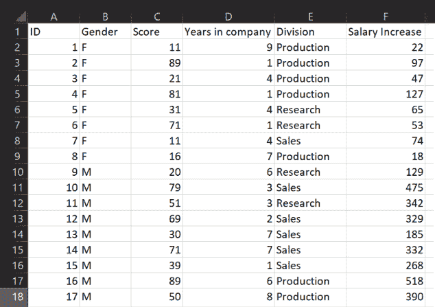

数据集中有四个数字特征:

*   `ID`:员工标识，与我们的分析无关
*   `Score`:最后一名员工的绩效评估结果
*   `Years in company`:员工在公司工作的年限
*   `Salary increase`:最后一次加薪的金额(美元)

剩下的两个是绝对的:

*   `Gender`:男性(`M`)或女性(`F`)
*   `Division`:员工在公司的哪个部门工作

在模型中使用分类值之前，需要对其进行编码。最终的数据表如下:

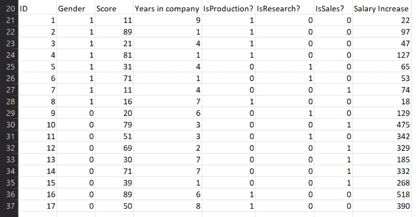

通过应用标准的 Excel 函数，可以很容易地获得一键编码。假设 *B2* 是第一个包含性别分类的单元格，我们可以输入*= IF(B2 = " F "；1;0)* 并把这个值复制到所有单元格直到 *B37* 。

根据 Windows 列表分隔符选项中定义的字符，您应该使用逗号(*、*)或分号(*)；*)在公式中。

为了对员工的部门进行编码，我们使用了一键编码(参见[第一章](b0dde0bb-32ef-4535-9e19-7999e8e9a631.xhtml)、*实现机器学习算法*，以获得详细解释)并创建了三个新变量:`IsProduction?`、`IsResearch?`、*、*和`IsSales?` *。*如果 *E2* 是包含`Division`数据的第一行，那么我们可以使用*= IF(E2 = Production)；1;0)* ，*= IF(E2 = " Research "；1;0)、*和*= IF(E2 = " Sales "；1;0)* 分别在单元格 *E21* 、 *F21、*和 *G21* 中起作用，然后按列向下复制到单元格 *E37* 、 *F37、*和 *G37* 。

在尝试对整个数据集使用回归之前，我们可以尝试一些特征工程。让我们看看，根据每个员工的工作情况，我们能多好地预测工资增长。这将使我们了解`Salary Increase` 目标变量与`Division`的相关程度(在[第 5 章](0da64bd8-0bc9-491b-875c-7ec7c35c6165.xhtml)、*相关性和变量的重要性*中会有更多关于变量之间相关性的细节)。

让我们按照一些简单的步骤来使用内置的回归工具:

1.  导航到数据。
2.  点击数据分析，如下截图所示:

3.  选择回归，如下图所示:

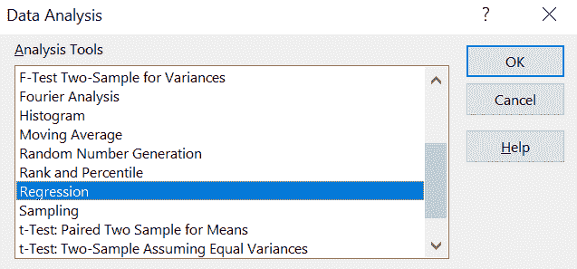

4.  选择`Salary`数据作为输入 Y 范围，选择三个`Division`列作为输入 X 范围:

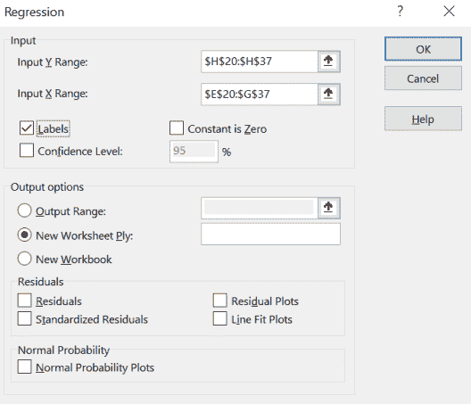

结果显示 *R* 因此，我们可以放弃这些列作为输入，而专注于其余的列。

我们重复回归，现在选择 X 值作为列`Gender`、`Score`和`Years in company`。

现在的结果大不一样了，R ² 接近 0.85，意味着 85%的加薪值是由所选变量解释的。

`Gender`有多重要？看一看 Excel 给我们的 P 值系数，在下表中，我们可以看到，根据与输入变量相关联的 P 值，最重要的是性别，其次是分数和在公司的年数。很明显，性别在决定加薪时起着重要的作用，我们有证据证明公司政策不是性别中立的:

|  | **系数** | **P 值** |
| **拦截** | 141.72775 | 0.083481944 |
| **性别** | -221.9209346 | 6.47796E-05 |
| **分数** | 2.697512241 | 0.004201513 |
| **在公司的年数** | 8.118352407 | 0.332588988 |

回归的输出结果告诉我们如何解释数据样本，但不能给我们一个准确的衡量模型将如何预测工资增长。为了探索这一点，我们应该做到以下几点:

*   获取不同的工资单样本(在我们的例子中，我们可以手工生成新数据)
*   使用上表中的系数构建表达式，并在给定输入变量的情况下计算预测的工资增长
*   使用均方根误差比较预测值和实际值，如[第 1 章](b0dde0bb-32ef-4535-9e19-7999e8e9a631.xhtml)、*实施机器学习算法*中所述

让我们看看你是否能完成这个练习；我希望提供给你的基本信息已经被理解。

我们已经展示了如何在数据中执行多元线性回归，以从中提取有趣的见解。让我们继续另一个重要的机器学习模型:决策树。

# 用决策树理解监督学习

决策树算法使用树状决策模型。其名称源自对记录进行分区的级联过程的图形表示。该算法选择能够更好地将数据集划分为目标变量更纯的子集的输入变量，理想情况下，子集仅包含该变量的一个值。决策树是一些使用最广泛且易于理解的分类算法。

树算法计算的结果是一组简单的规则，这些规则解释了输入值的哪些值或区间可以更好地分割原始数据。事实上，结果和获得结果的路径可以清楚地显示出来，这使得决策树比其他算法更有优势。**可解释性**对于一些机器学习和人工智能系统来说是一个严重的问题——它们大多被用作黑匣子——并且本身就是一个研究课题。

在复杂的问题中，我们需要决定何时停止树的发展。大量的特征可以导致非常大和复杂的树，因此分支的数量和树的长度通常由用户限制。

熵是决策树中一个非常重要的概念，也是量化每个子样本纯度的方法。它测量每片树叶中包含的信息量。熵越低，信息量越大。零熵意味着一个子集只包含目标变量的一个值，而一个值代表包含相同数量的两个值的子集。这个概念后面会举例说明。

熵是你的数据有多乱的一个指标。

使用在每一步中计算的熵，算法选择最佳变量来分割数据，并递归地重复相同的过程。用户可以决定如何停止计算，或者当所有子集的熵为零时，或者当不再有特征要分割时，或者在最小熵水平时。

最适合在决策树中使用的输入特征是分类特征。在连续的数值变量的情况下，应该首先通过将它分成范围来将其转换成类别；例如，A > 0.5 将是 A1，A ≤ 0.5 将是 A2。

让我们看一个解释决策树算法概念的例子。

# 根据天气情况决定是否进行户外训练

让我们假设我们有一位经验丰富的足球教练关于户外训练(体育馆外)或不与她的团队一起训练的决策的历史数据，包括做出决策当天的天气情况。

典型的数据集可能如下所示:

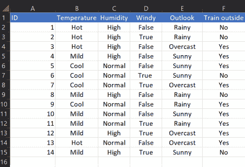

数据集是专门为这个例子创建的，当然，可能不代表任何真实的决策。

在本例中，目标变量是`Train outside`，其余变量是模型特征。

根据数据表，可能的决策树如下所示:

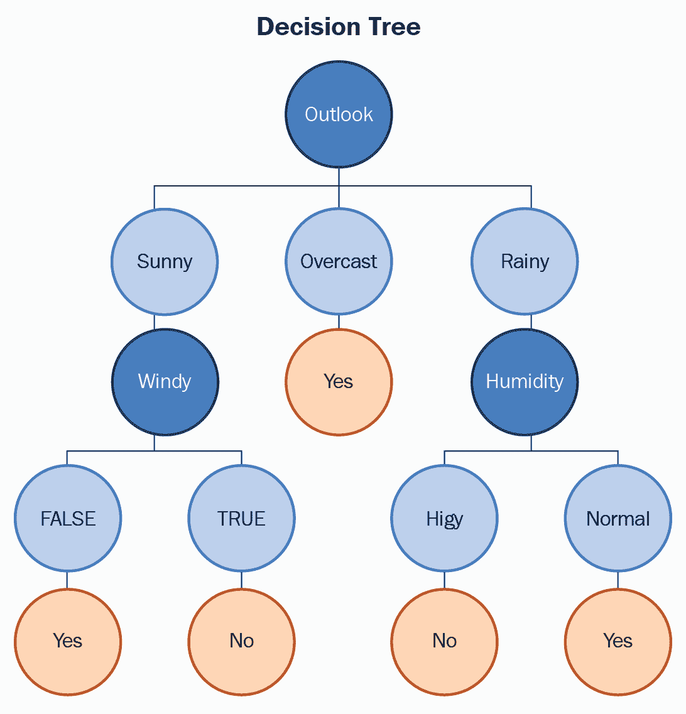

我们选择按照 **Outlook** 特性的值开始拆分数据。我们可以看到，如果值是**，那么决定在外面训练总是**是** 并且不依赖于其他特性的值。**晴天**和**雨天**可以进一步拆分得到答案。**

 **我们如何决定首先使用哪个特性，以及如何继续？我们将使用熵的值*、*来衡量在考虑不同输入特征时其值的变化。

# 目标变量的熵

查看单个属性时，熵的定义如下:

这里， *c* 是特征 *f* ， *p [i]* 是每个值的概率，*log*[*2*]*(p[I])*[是同一个概率的以两个为底的对数。计算细节如下:]

1.  我们需要计算数据集中“是”和“否”决策的数量。在我们的简单示例中，可以手动计数，但是如果数据集较大，我们可以使用 Excel 函数:

*COUNTIF(F2:F15；“是”)*和*COUNTIF(F2:F15；【否】)*

然后我们得到的计算结果是 *Yes = 9* 和 *No = 5* 。

2.  当将熵公式应用于目标变量时，我们得到以下结果:

在这里，概率的计算方法是将*是* ( *9* )或*否* ( *5* )的数量除以总数( *14* )。

使用*I3/(I3+JBOY3 乐队)* LOG(I3/(I3+JBOY3 乐队)，也可以在 Excel 表中轻松完成这个计算；2)-JBOY3 乐队/(I3+JBOY3 乐队)* LOG(JBOY3 乐队/(I3+JBOY3 乐队)；2)* 与 *I3=9* 和*JBOY3 乐队=5* 。

# 每个特征相对于目标变量的熵

两个变量 *f* [*1*] 和 *f [2]* 的熵定义如下:

这里， *v* 代表*f[2]T5、 *P(v)* 的每一个可能值的概率， *S(v)* 在前面的等式中定义。*

# 频率表

让我们建立一个频率表，这是统计变量之间组合总数的常用方法。在我们的例子中，我们用它来决定哪个变量的选择会导致熵的更大减少:

1.  计算特征值的不同组合，将每个特征与`Train outside`目标变量进行比较。在这个特定的示例中，您可以手动对它们进行计数，但是在我们处理更大的数据集的情况下，有一个通用的方法来这样做是很有用的。
2.  为了计算特性组合的数量，我们首先将数据表中的值成对连接起来。例如，*串联(B2；"_";F2)* 给了我们`Hot_No`。
3.  如果我们将公式向下复制以完成总行数，我们将得到`Temperature`和`Train outside`变量的所有可能组合。
4.  如果我们对其余的特征重复相同的计算，结果将如下:

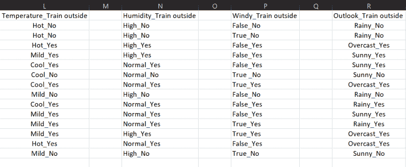

5.  创建数据透视表以计算每列中唯一值的数量，即唯一组合的数量。这可以通过选择列中的整个范围，右键单击选择中的任意位置，然后左键单击快速分析来完成。将弹出以下对话框:

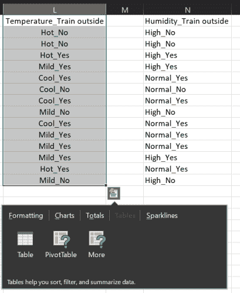

6.  选择表|数据透视表创建一个如下所示的表:

7.  对所有列重复相同的过程，构建所有频率表和双变量熵。产生的表格和熵计算在下面的小节中显示。

# 熵计算

展望-列车外部组合的频率表如下:

| **展望** | **列车外** |
|  | 是 | 不 |
| 快活的 | three | Two |
| 遮蔽 | four | Zero |
| 下雨的 | Two | three |

使用这些值，我们得到两个变量的熵，如下详细所示:

*p(晴)。晴天+阴天。S(阴)+p(雨)*S(雨)=*

*5/14 *(3/5 * log2(3/5)-2/5 * log2(2/5))+*

*4/14 *(4/4 * log2(4/4)-0/4 * log2(0/4))+*

*5/14 *(2/5 * log2(2/5)-3/5 * log2(3/5))=*

*0.693*

这里， *p(晴)=(#是+#否)/总条目= (2+3)/14，p(阴)=(#是+#否)/总条目= (4+0)/14，*和 *p(雨)=(#是+#否)/总条目= (2+3)/14* 。熵值 *S(v)* 使用相应的概率计算，即 *#Yes* 或 *#No* 超过总数 *#Yes+#No* 。

室外组合温度列车的频率表如下:

| **温度** |  | **列车外** |
|  | **是** | **否** |
| **热** | Two | Two |
| **轻微** | four | Two |
| **冷却** | three | one |

使用这些值和类似的计算，熵详细显示如下:

*p(热)。s(热)+p(温和)。S(温和)+p(凉爽)*S(凉爽)=*

*4/14 *(2/4 *对数[2](2/4)-2/4 *对数 [2] (2/4)) +*

*6/14 *(4/6 *对数[2](4/6)-2/6 *对数 [2] (2/6))+*

*4/14 *(3/4 *对数[2](3/4)-1/4 *对数 [2] (1/4)) =*

*0，911*

室外湿度组合列车的频率表如下:

| **湿度** |  | **列车外** |
| **是** | **否** |
| **高** | three | four |
| **正常** | six | one |

使用这些值，我们得到熵如下:

*p(高)。s(高)+p(正常)。s(正常)=*

*7/14 *(3/7 *对数[2](3/7)-4/7 *对数 [2] (4/7)) +*

*7/14 *(6/7 *对数[2](6/7)-1/7 *对数 [2] (1/7))=*

*0，788*

室外风力列车组合的频率表如下:

| **刮风** |  | **列车外** |
|  | **是** | **否** |
| **真** | six | Two |
| **假** | three | three |

使用这些值，我们得到熵如下:

*p(真)。s(真)+p(假)。S(False)=*

*8/14 *(6/8 *对数[2](6/8)-2/8 *对数 [2] (2/8)) +*

*6/14 *(3/6 *对数[2](3/6)-3/6 *对数 [2] (3/6))*

*=0，892*

# 比较熵差(信息增益)

为了知道为第一次分裂选择哪个变量，我们计算从原始数据到相应子集时的信息增益 *G* 作为熵值之间的差:

这里， *S(f [1] )* 是目标变量的熵， *S(f [1] ，f2)* 是每个特征相对于目标变量的熵。熵值是在前面的小节中计算的，所以我们在这里使用它们:

*   如果我们选择 *Outlook* 作为分割树的第一个变量，信息增益如下:

*G(列车外，瞭望)= S(列车外)- S(列车外，瞭望)* *= 0.94-0.693 = 0.247*

*   如果我们选择*温度*，信息增益如下:

*G(列车外，温度)= S(列车外)- S(列车外，温度)* *= 0.94-0.911 = 0.029*

*   如果我们选择*湿度*，信息增益如下:

*G(列车外，湿度)= S(列车外)- S(列车外，湿度)* *= 0.94-0.788 = 0.152*

*   最后，选择 *Windy* 给出以下信息增益:

*G(列车外，有风)= S(列车外)- S(列车外，有风)
= 0.94-0.892=0.048*

所有这些计算都可以使用 Excel 公式在工作表中轻松完成。

为树的第一次分裂选择的变量是显示最大信息增益的变量，即 *Outlook* 。如果我们这样做，我们会注意到分裂后的结果子集之一具有零熵，因此我们不需要进一步分裂它。

要按照类似的过程继续构建树，要采取的步骤如下:

1.  计算 *S(晴)*、 *S(晴，温度)*、 *S(晴，湿度)*、 *S(晴，有风)。*
2.  计算 *G* *(晴天，气温)*， *G(晴天，湿度)*， *G(晴天，有风)。*
3.  较大的值将告诉我们使用什么特征来分割 *Sunny。*
4.  计算其他增益，用 *S(多雨)*、 *S(多雨，温度)*、 *S(多雨，湿度)*和 *S(多雨，多风)。*
5.  较大的值将告诉我们使用什么特征来分割 *Rainy。*
6.  继续迭代，直到没有可用的特征。

正如我们将在本书后面看到的，树从来不是手工建造的。理解它们是如何工作的以及涉及哪些计算是很重要的。使用 Excel，很容易跟踪整个过程和每个步骤。遵循同样的原则，我们将在下一节中完成一个无监督学习的例子。

# 通过聚类理解无监督学习

聚类是一种统计方法，它尝试根据距离度量(通常是欧几里德距离)对数据集中的点进行分组，欧几里德距离计算一对点的坐标之间的平方差的根。简而言之，被分类在同一聚类中的那些点彼此之间的距离(根据定义的距离)比它们与属于其他聚类的点之间的距离更近。同时，两个集群之间的距离越大，我们就越能区分它们。这类似于说，我们试图建立这样的群体，其中的成员与其他群体的成员更相似，而更不同。

显然，聚类算法最重要的部分是定义和计算两个给定点之间的距离，并迭代地将这些点分配给定义的聚类，直到聚类组成没有变化。

在尝试聚类分析之前，有几点需要考虑。并非每种类型的数据都适合聚类。例如，我们不能使用二进制数据，因为它不可能定义距离。值不是`1`就是`0`，中间没有值。这不包括一次性编码生成的数据类型。只有显示某种顺序或规模的数据对聚类有用。即使数据值是真实的(例如，客户的支出金额或年收入)，最好将它们按范围进行分组。

集群用例的一些例子如下:

*   自动对 IT 警报进行分组，以分配优先级并相应地解决它们
*   通过不同渠道分析客户沟通(按时间段细分)
*   犯罪侧写
*   城市流动性分析
*   欺诈检测(寻找异常值)
*   运动员成绩分析
*   按地理划分的犯罪分析
*   交付物流
*   文件的分类

现在，让我们看一些解释聚类算法概念的例子。

# 按月购买量对客户进行分组

现在，我们将遵循从客户数据生成集群所需的完整计算和分析。这是典型聚类算法的简化版本，显示了所有步骤，但减少了迭代次数，使其易于理解。聚类通常是自动完成的，但是理解计算背后的逻辑很重要。

要使用的数据集包含 20 个不同的客户在网上商店每月消费的总额，对应于给定年份的`May`、`June`和`July`。在 Excel 表格中输入后，数据如下所示:

对于每个月，我们可以计算描述数据的主要参数:最小值、最大值、中值和平均值:

|  | **五月** | **六月** | **七月** |
| **最小值** | Three hundred and sixteen point eight nine | Five hundred point six six | One hundred and eighty-five point six three |
| **最大值** | Eleven thousand eight hundred and eighty-nine point six six | Twelve thousand two hundred and fourteen point four one | Eleven thousand nine hundred and eighty-two point six four |
| **中位数** | Eight thousand three hundred and eighty-eight point six three | Eight thousand one hundred and fifty-six point one six | Seven thousand seven hundred and eight point two seven |
| **平均值** | Six thousand one hundred and eighty-two point two | Six thousand two hundred and twenty-nine point two four | Six thousand two hundred and twenty-seven point eight one |

我们简单使用 Excel 内置函数 *MIN()* 、 *MAX()* 、 *MEDIAN()* 、 *AVERAGE()* ，包括每一列的全部范围。

在聚类分析中，*归一化*数据集是有用的，也就是说，转换所有值，使它们落入区间[0，1]。这有助于我们处理**异常值**数据点，其值与大多数点非常不同，这可能会影响聚类定义。标准化后，这些点与其他点的距离不会太远，可以很容易地进行分组。显然，如果聚类分析的目标是找到这些异常值，那么最好保持数据集不变，并突出显示异常值与数据集其余部分之间的差异。

标准化数据的最简单方法是将每个值除以相应列中的最大值。为此，请按照下列步骤操作:

1.  在单元格 *G2、*中键入`=B2/$B$24`。我们假设 *B2* 是`May`列中的第一个值，最大值在 *B24* 中。
2.  将此公式复制到整个列中。回想一下，在将内容复制到另一个单元格时，将 *$* 添加到 Excel 中的单元格 ID 会固定该值。标准化的表格如下:

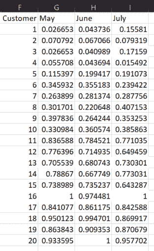

让我们花一点时间将数据形象化，并多理解一点。如果我们将列成对，则可以生成散点图，并按照以下步骤尝试直观地找到聚类:

1.  选择`May`和`June`数据。
2.  单击插入|散布。

生成的图表如下:

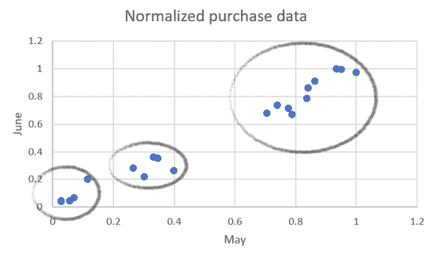

可以确定三个集群，并在前面的屏幕截图中圈出。它们对应于每月花费相似金额的客户群。

3.  对`May`和`July`做同样的处理，我们得到下面的图表:

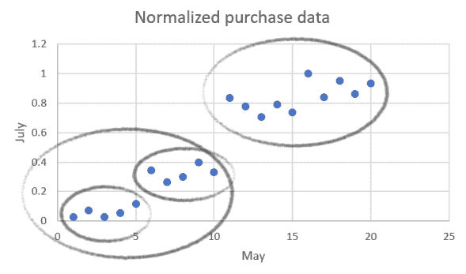

在这种情况下，我们可以说有两个大的集群，或者其中一个可以进一步一分为二。这种区分并不明显，选择将取决于其他变量(记住，最好的模型总是最适合业务需求的模型)。

4.  最后，我们绘制`June`和`July`:

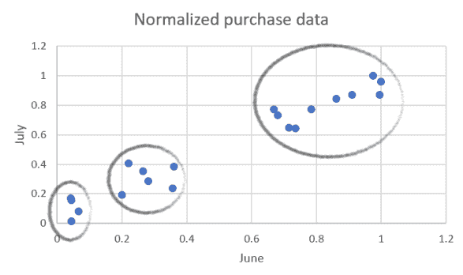

星团的划分在这里看起来更加清晰，我们可以圈出三组点。

如果我们要同时考虑三个月呢？有一个迭代过程来实现这一点，这是称为 **K-means** 的聚类算法的基础。让我们详细了解一下这个算法的步骤:

1.  决定要将数据分成多少个聚类。总的来说，这不是一个容易的决定。这在很大程度上取决于数据集，并且在某些情况下，将需要测试不同的值，直到您获得大量能够对数据提供有用见解的聚类。
2.  考虑到前面的视觉分析，我们决定选择 3 作为集群的数量。

3.  取任意三个点作为聚类的中心。起点的选择并不重要，因为我们将重复整个过程，直到产生的集群成员没有变化。然后，我们选择列表中的前三个点，如下表所示:

|  | **五月** | **六月** | **七月** |
| **Random1** | 0.055568104 | 0.043735522 | 0.15581034 |
| **Random2** | 0.07079235 | 0.067065974 | 0.079319396 |
| **Random3** | 0.026652635 | 0.040988882 | 0.171590079 |

4.  找出离它们最近的点，计算所有其他点到这些聚类中心的距离。定义了两点之间的欧氏距离， *P [1] =(x [1] ，y [1]* *，z [1] )* 和[*P[2]=(x[2]，y [2]* *，z [2] ，*]

使用 Excel 内置的*sum xmy 2(【array 1】)；[array2})* 函数计算关于聚类中心的每个点的 *(DE) ²* 。

5.  对于每个数据点，您将获得三个距离值。选择最小的一个来决定该点属于哪个聚类。例如，对于客户 ID = 4，我们得到以下信息:

| **D1** | **D2** | **D3** | **集群** |
| 0.019689391 | 0.004847815 | 0.025218271 | Two |

这里， *D1* ， *D1，*和 *D3* 是点到各自聚类中心的距离。最小的距离告诉我们这个点属于星团二。例如，客户 ID = 4 的 *D1* 计算为*= sumxmy 2(B5:D5；$B$23:$D$23)* ，假设 Random1 `May`和 Random1 `June`分别在单元格 *$B$23* 和 *$D$23* 中。

6.  完整的结果数据表如下:

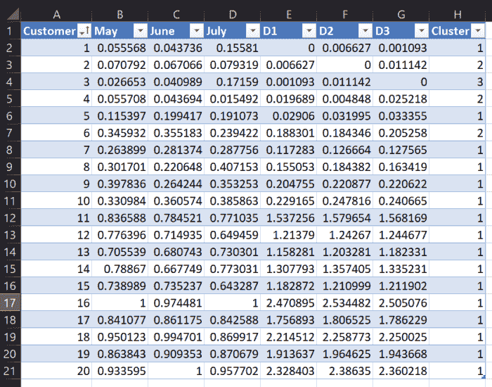

最后一列可以通过在第一行中键入以下公式，然后向下复制来创建:*= IF(E2 = MIN(E2:G2)；1;IF(F2 = MIN(E2:G2)；2;3))* 。

根据表格，我们的第一个结果真的很不平衡。大多数点属于第一类，少数点属于第二类，只有一个点属于第三类。我们需要继续计算，看看结果如何演变。请遵循以下步骤:

1.  我们现在将使用获得的聚类的平均值，而不是选择随机点。

2.  按簇号对表格进行排序。现在生成的表略有不同，如下所示:

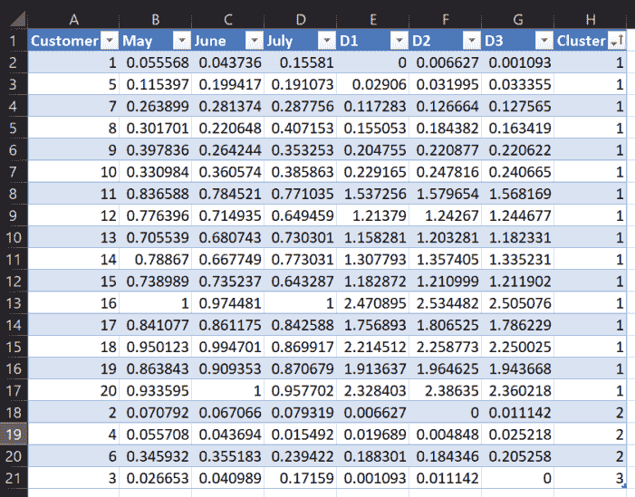

3.  使用 *MEAN()* 函数计算每个月每个分类的平均值。您应该会得到与下表所示相同的结果:

|  | **五月** | **六月** | **七月** |
| **表示 1** | 0.618762809 | 0.605805489 | 0.618056642 |
| **表示 2** | 0.157477363 | 0.155314048 | 0.111411008 |
| **表示 3** | 0.026652635 | 0.040988882 | 0.171590079 |

举个例子，**的含义 1** 对应`May`计算为*平均值(B2:B17)* 。

4.  使用与之前相同的公式并计算所有其他点到平均值的距离，您会得到一个与此类似的表格:

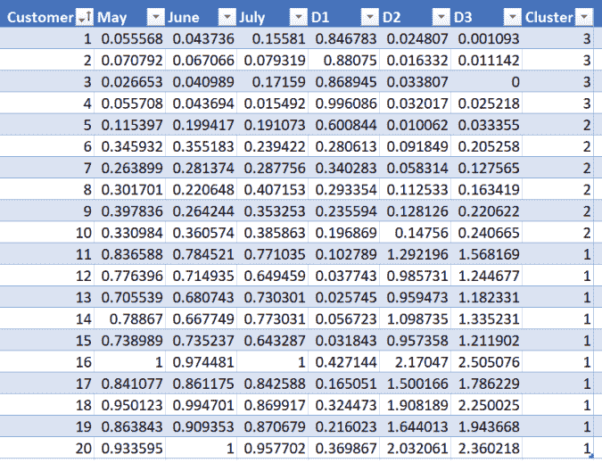

在第二次迭代之后，更多的点，当从聚类 1 移开时，现在属于聚类 2 和 3。

5.  再重复一次计算。根据上表，新的平均值如下:

|  | **五月** | **六月** | **七月** |
| **表示 1** | 0.843481911 | 0.832289469 | 0.810799822 |
| **表示 2** | 0.292624962 | 0.280240044 | 0.310753303 |
| **表示 3** | 0.052180197 | 0.048870976 | 0.105552835 |

6.  包含距离和群集号的表可以给出如下:

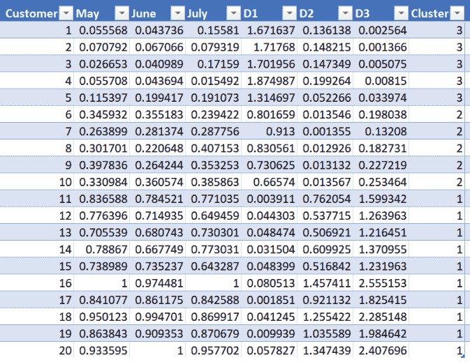

第三次迭代后，只有一个点改变了聚类，从两个变为三个；所以，我们已经接近最终结果了。您应该能够按照相同的步骤再执行一次迭代，证明它不会改变聚类标签，并且意味着计算收敛到稳定数量的聚类。

现实生活中的数据集可能不会这么快收敛。我们展示的是一个简化的例子，足以展示迭代的每一步，理解它们，并得到一个合理的结果。聚类通常不是手动计算的，而是由预先构建的算法执行的。

在下一章中，您将学习如何将不同来源的数据导入 Excel，因此您不需要手动键入值。这将给你一个分析真实数据的起点，真实数据通常包含比本章中的例子更多的变量和值。

# 摘要

在这一章中，我们描述了应用于解决问题的监督和非监督机器学习模型的真实例子。我们讨论了多元回归、决策树和聚类。我们还展示了如何选择和转换输入变量或特征，以供模型使用。

本章只展示每种算法的基本原理。在使用机器学习的真实数据分析和预测中，模型已经被编程，可以用作黑盒。因此，理解每个模型的基础并知道我们是否正确地使用它是极其重要的。

在接下来的章节中，我们将重点介绍如何从不同的来源提取数据，根据我们的需要对其进行转换，并使用之前构建的模型进行分析。

# 问题

1.  为什么对分类特征进行编码很重要？
2.  停止决策树计算的不同方法有哪些？
3.  在本例中,`Temperature_hot`的熵值为 1。为什么？
4.  根据*了解使用决策树进行监督学习*部分开头的决策树图表，决定是否进行外部培训的途径是什么？考虑使用`IF`语句。
5.  如果我们选择不同的起点，集群分布会改变吗？你可以在推荐文章里读到这方面的内容。
6.  通过迭代分析获得的聚类与直观确定的聚类相同吗？为什么？

# 进一步阅读

*   *如何解释回归分析结果:P 值和系数*:[http://blog . minitab . com/blog/adventures-in-statistics-2/How-to-Interpret-Regression-Analysis-Results-P 值和系数](http://blog.minitab.com/blog/adventures-in-statistics-2/how-to-interpret-regression-analysis-results-p-values-and-coefficients)
*   *使用微软 Excel 的教学决策树分类通知教育事务* 11(3)，第 123-131 页，作者卡安·阿塔曼、乔治·库利克、萨德斯·西姆:【https://pubsonline.informs.org/doi/10.1287/ited.1100.0060】T2
*   *K 均值算法综述*，《国际工程趋势与技术杂志》(IJETT)-第 4 卷第 7 期-2013 年 7 月:[http://www . IJETT Journal . org/Volume-4/Issue-7/IJETT-v4i7p 139 . pdf](http://www.ijettjournal.org/volume-4/issue-7/IJETT-V4I7P139.pdf)**