<title>Importing Data into Excel from Different Data Sources</title> 

# 将数据从不同的数据源导入 Excel

严肃的数据分析和机器学习是无法通过使用手写数据来完成的。数据源有不同的风格和大小，Excel 可以处理其中的许多。本章讨论如何从不同来源导入数据，这是任何分析的第一步。

Get & Transform(在 2016 年之前的 Excel 版本中称为 **Power Query** )是一个强大的工具，可以用来加载不同来源的数据并进行转换。这些转换是必要的，以便您有一个干净的数据样本，然后可以用来训练和测试任何机器学习模型。

如果您运行的是 Excel 2010 SP1 或 Excel 2013，您需要下载并安装 Power Query。参考链接[https://www.microsoft.com/en-us/download/details.aspx?id=39379](https://www.microsoft.com/en-us/download/details.aspx?id=39379) 获取如何安装的说明。

在本章中，我们将讨论以下主题:

*   从文本文件导入数据
*   从另一个 Excel 工作簿导入数据
*   从网页导入数据
*   从脸书导入数据
*   从 JSON 文件导入数据
*   从数据库导入数据

<title>Technical requirements</title> 

# 技术要求

您需要从本书的 GitHub 资源库下载`homes.csv`、`homes.txt`、`titanic.xls`和`azure_text_analytics.json`文件，该资源库位于[https://GitHub . com/packt publishing/Hands-On-Machine-Learning-with-Microsoft-Excel-2019/tree/master/chapter 03](https://github.com/PacktPublishing/Hands-On-Machine-Learning-with-Microsoft-Excel-2019/tree/master/Chapter03)。

<title>Importing data from a text file</title> 

# 从文本文件导入数据

比较常用的数据文本文件是**逗号分隔值** ( **CSV** )。顾名思义，值是按行写入文件的，对于每一行，逗号分隔属于每一列的值。打开一个新工作簿，并按照下列步骤操作:

1.  点击数据。
2.  导航到*从文件中获取数据*|*|*从文本/CSV* :*

 *

3.  导航到文件的位置并打开`homes.csv`文件。

4.  将弹出一个窗口，显示文件内容的预览，如下面的屏幕截图所示:

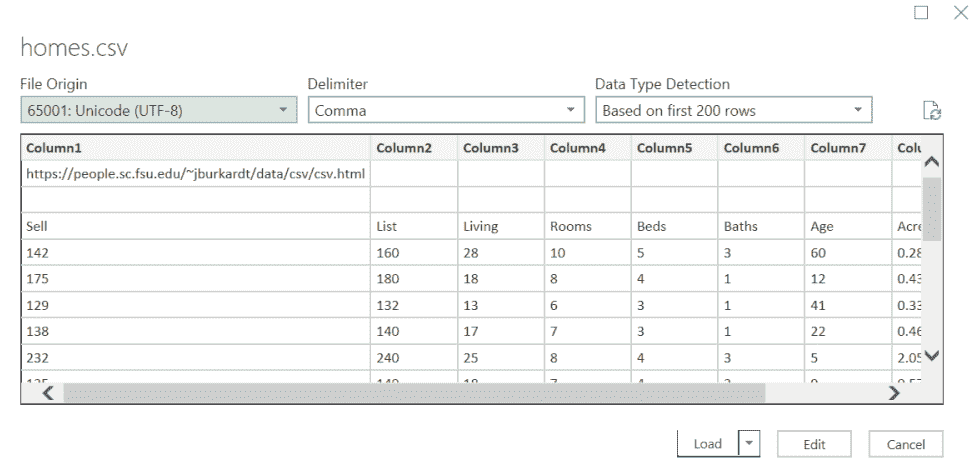

我们可以看到，Excel 通过使用正确的分隔符(逗号)正确地标识了不同的列。它还试图自动检测数据类型。不过，有一个小问题。这个文件不是纯粹的 CSV，在开头有一行额外的内容，告诉我们它最初是从哪里下载的。这有利于证明原作者，但会使加载过程有点混乱。幸运的是，这种情况已经被考虑到了。要解决此问题，请单击编辑。

5.  将弹出一个窗口，包含许多选项来处理这些文件格式差异:

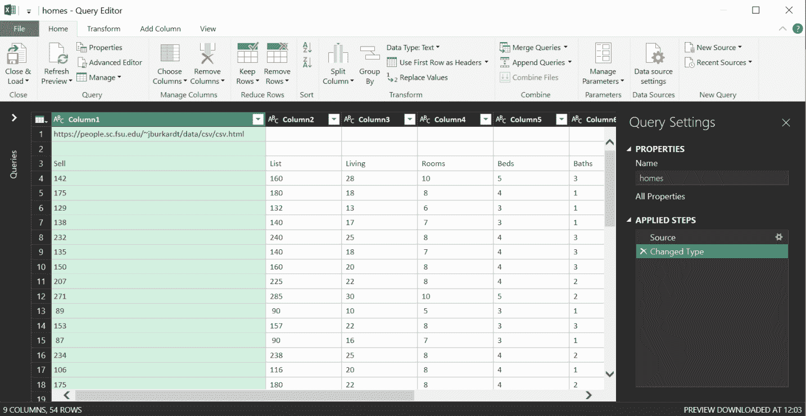

6.  导航到*移除行* | *移除顶行。*
7.  您将看到指定要跳过多少行的选项。在这个文件中，我们需要跳过`2`行，如下面的截图所示:

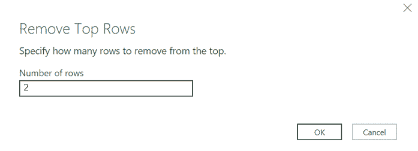

删除行后，我们只保留感兴趣的数据。您会注意到文件头还没有被用作列名，这是最理想的。要更正这一点，请单击“将第一行用作标题”。

8.  这样做的结果如下图所示:

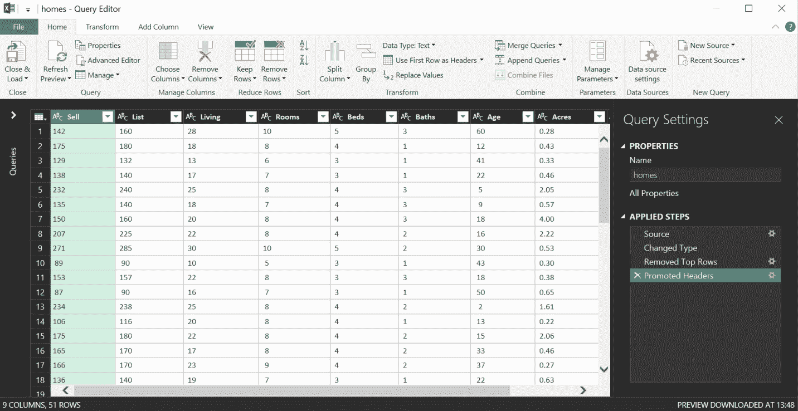

请注意，表格右侧的步骤列表已经应用于输入数据。这允许你撤销你的任何操作，并且有助于跟踪你做了什么，特别是如果你做了更复杂的转换，就像我们将在下一章向你展示的。

除了每一列的数据类型之外，流程已经基本就绪。最初，它被自动设置为 text，因为我们稍后跳过的前两行被评估为不包含数字数据。列有两种:`Acres`显示小数，其余显示整数或整数。要正确定义数据类型，请执行以下步骤:

1.  选择`Acres`。
2.  导航到“转换”菜单中的“数据类型”。
3.  将类型更改为十进制数。
4.  选择其余的列，并将类型更改为整数以修复其他列。

5.  最后，点击关闭和加载。您将看到下面的数据表:

这个表看起来像任何 Excel 表，除了我们总是可以双击查询(称为`homes`)并执行更多的转换，甚至撤销我们已经做的转换。

如果文件不是 CSV 文件，而只是一个使用不同分隔符的文本文件，我们仍然可以使用类似的过程加载它。我们只需重复导入 CSV 文件的步骤:

1.  点击数据。
2.  导航到*从文件中获取数据*|*|*从文本/CSV* 。*
**   导航到文件的位置并打开`homes.txt`。您将看到以下预览:*

 *

在这种情况下，开头没有多余的行，但我们可以看到 Excel 未能识别列分隔符，即`|`字符。要解决此问题，请从下拉菜单中选择自定义。

4.  类型`|`。
5.  结果是数据现在被正确地分成列。使用文件头自动标记这些列，并且正确猜测数据类型，如下面的屏幕截图所示:

最终的结果是一个与我们从`homes.csv`加载的表相同的表，但是由于文件结构更简单，所以需要的步骤更少。

在本节中，我们学习了如何将文本文件导入 Excel，这是最简单的情况。让我们继续一些更复杂的例子。

<title>Importing data from another Excel workbook</title> 

# 从另一个 Excel 工作簿导入数据

如果我们可以打开 Excel 工作簿，为什么还要从其中导入数据呢？主要原因是利用我们可以使用 Get & Transform 进行的转换。我们将通过使用一个包含泰坦尼克号乘客真实数据的文件来展示这一点，该文件通常用于测试机器学习分类模型，并预测给定乘客是否在悲剧中幸存。

让我们遵循一些简单的步骤来加载和转换数据。在新工作簿中，请按照下列步骤操作:

1.  点击数据。
2.  导航到从文件|从工作簿获取数据，如下面的屏幕截图所示:

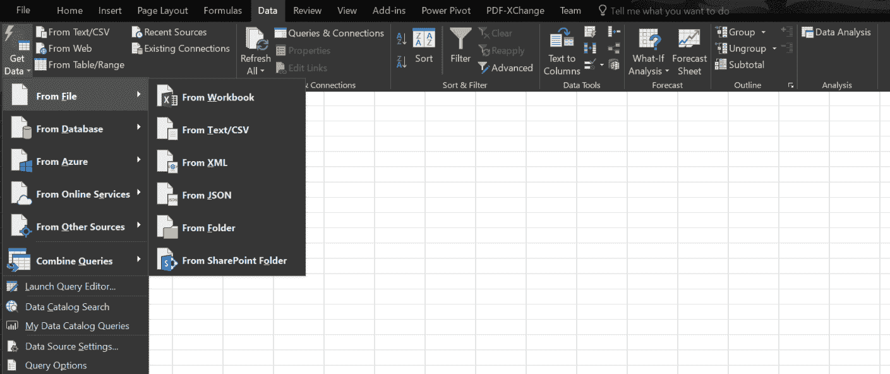

预览窗口与我们打开 CSV 文件时看到的窗口略有不同，如下图所示:

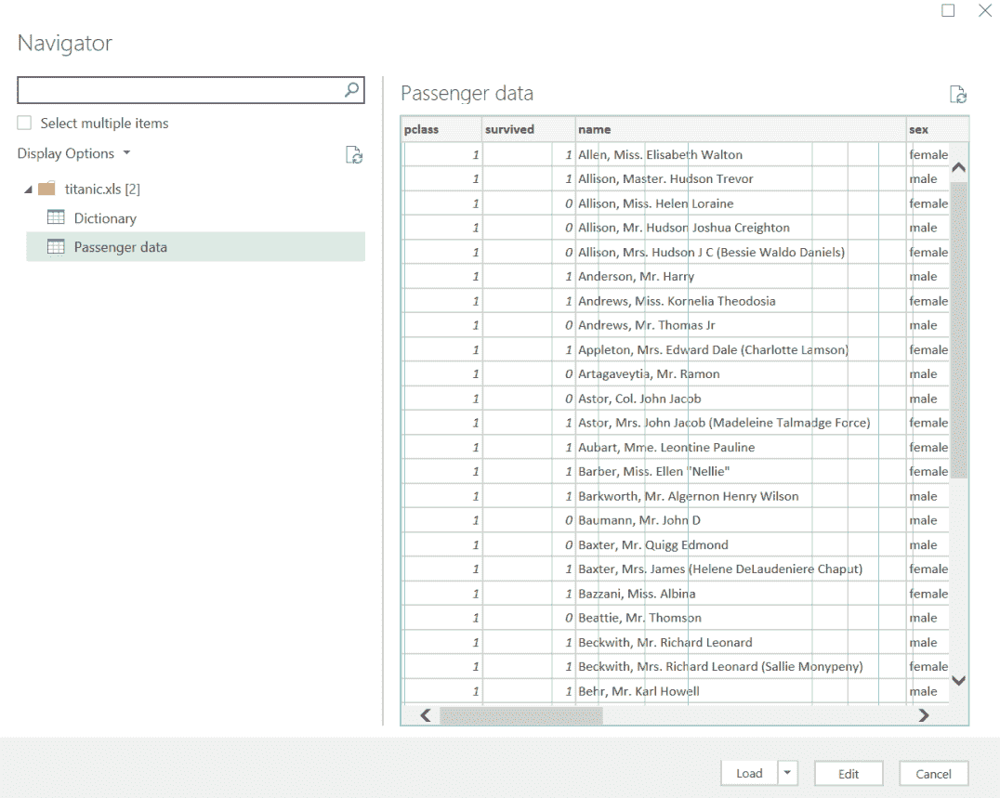

在预览的左侧，您可以看到一个名为`titanic.xls`的文件夹，它代表文件，下面是包含在其中的工作表。`Dictionary`只是对变量的简短描述；数据包含在`Passenger data`表中。

选中此项后，我们将看到一个包含数据的表格。我们可以点击 Load，将数据放入工作表中，但首先我们将尝试一种转换，我们将在下一章详细讨论。为此，单击 Edit 并进入查询编辑器，如下面的屏幕截图所示:

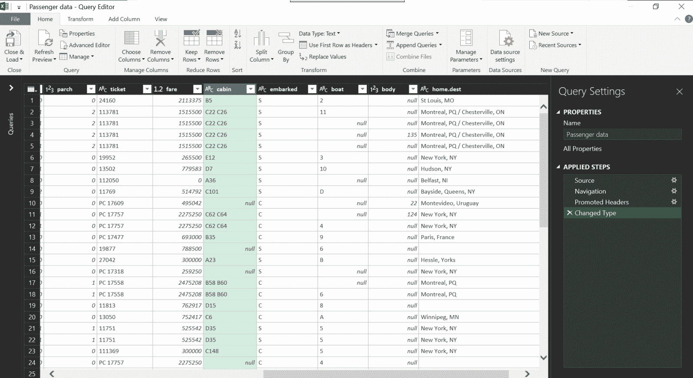

列被正确标识，从列名中提取的名称被放入输入文件中。您可以看到其中一列`cabin`包含缺失值，标识为`null`。这意味着，对于那些乘客来说，没有关于他们在船上哪个船舱的信息。一些机器学习模型不接受空值，因此我们需要通过选择列来解决这个问题，如前面的截图所示。

3.  点击变换菜单中的替换值。
4.  您将得到一个弹出对话框，在这里您可以告诉 Excel 用`Unknown`替换`null`，如下面的截图所示:

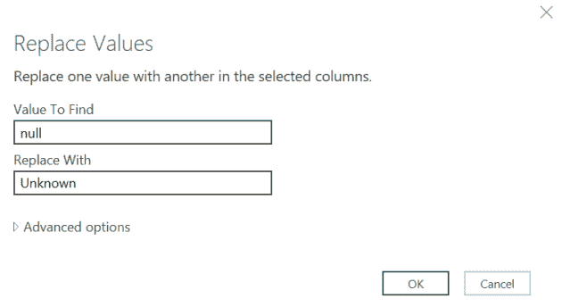

结果就是你在下面的截图中看到的，所有的`null`值都被替换成了`Unknown`。这更优雅，也更容易通过机器学习模型来管理:

使用查询编辑器可以对数据执行许多不同的转换。我们将在下一章展示其他例子。您也应该尝试测试不同的选项。

<title>Importing data from a web page</title> 

# 从网页导入数据

如果网页包含表格形式的数据，则 Excel 能够自动导入这些表格。例如，我们将从关于 Excel 的维基百科页面导入一个表格。我们将这样做:

1.  单击数据，然后导航至获取数据|来自其他来源|来自 Web，如以下屏幕截图所示:

2.  在弹出的对话框中，我们键入提到的网页的 URL，然后单击 OK，如下面的截图所示:

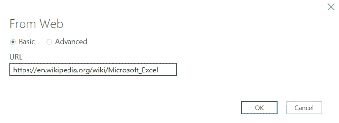

3.  现在，我们将能够看到可用表的列表。选择一个显示 Excel 版本历史的。表格预览显示在右侧，如以下屏幕截图所示:

4.  正如我们之前所做的，我们可以只加载数据或编辑它，根据我们的需要转换值。最终结果是一个 Excel 表格。

我们还可以选择切换到 web 视图，像在 Internet Explorer 中一样查看目标网页，这可以帮助我们确定哪些信息对我们的分析有用。

我们已经看到从网页导入数据是多么容易。现在，让我们探索从最流行的网站之一:脸书导入数据。

<title>Importing data from Facebook</title> 

# 从脸书导入数据

可以直接从脸书个人资料或页面导入数据。例如，如果我们想登记新帖子出现的日期和时间，我们可以遵循以下步骤:

1.  点击数据。
2.  导航至获取数据|从在线服务|从脸书，如以下屏幕截图所示:

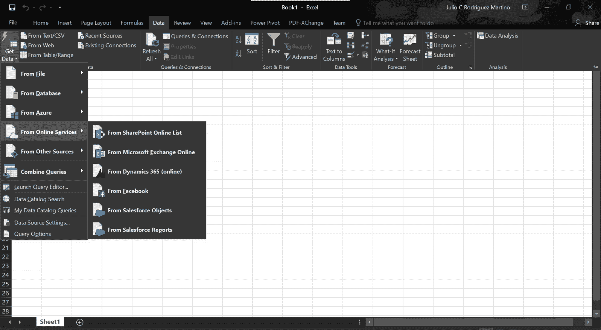

3.  您需要指定用户名或页面名，这是页面 URL 的最后一部分。例如，我将使用我自己的脸书页面，这是默认选项。首次连接时，您必须使用您的用户名和密码登录(要从 Excel 连接到脸书，您需要一个脸书配置文件)。将出现以下对话框:

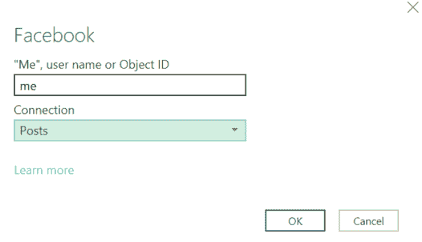

4.  我们将选择获取有关帖子的信息。单击 OK 后，我们会看到以下屏幕(为了保护我的隐私，我将只显示一部分):

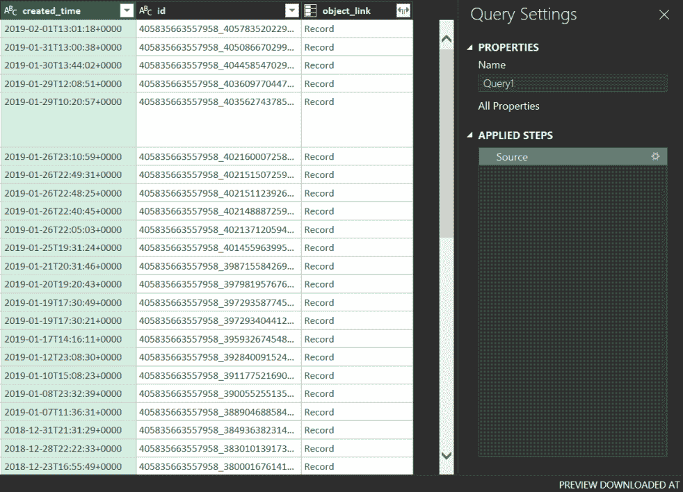

5.  正如我们所看到的，文章的日期和时间被连接在一个单独的列中。要拆分此列，请单击编辑。
6.  选择列，然后在查询编辑器中拆分列。
7.  在该对话框中，指定要按字符`T`拆分列，如下面的屏幕截图所示:

8.  结果，您得到两个新列，一个用于日期，另一个用于时间，如下面的屏幕截图所示:

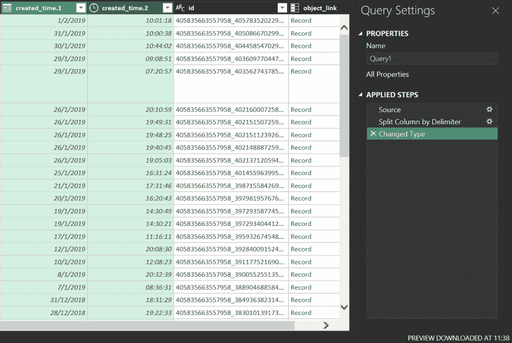

您已经成功地从您的脸书页面中提取了信息，现在您可以使用这些信息来分析您发布的频率、您发布的内容类型以及其他有用的信息。这在您查看商业简介时尤其有用，因为您可能希望调整内容以改进您的服务或产品的营销。

<title>Importing data from a JSON file</title> 

# 从 JSON 文件导入数据

JSON 是共享数据的标准格式，因为它使用人类可以阅读的文本字段。它被大多数 web 应用程序用于数据输入和输出。

在我们的例子中，我们将使用 Azure 文本分析 API。给定一个句子，该服务可以识别文本情感和语言，并提取关键词等。

输入的句子是`I had a wonderful trip to Seattle and enjoyed seeing the Space Needle!`。API 正确地将语言识别为英语，提取主要关键字，并告诉我们情感是积极的(分配大于 0.5 的值)。所有这些信息都以 JSON 格式显示在窗口的右侧，并且可以在我们将要导入的文件中找到。以下截图摘自 Azure 文本分析演示页面:

要加载输入 JSON 文件，请遵循以下步骤:

1.  点击数据。
2.  导航到*从文件* | *从 JSON* 获取数据 | *，如下截图所示:*

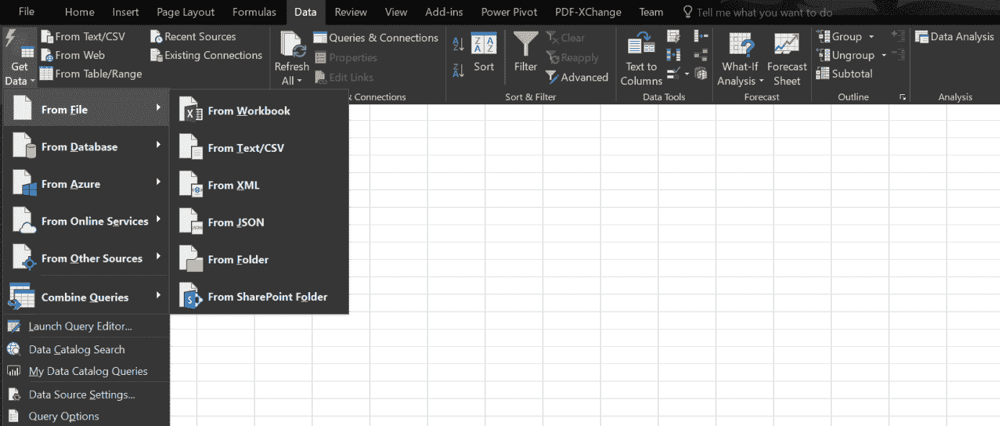

3.  您将获得一个预览，显示 JSON 结构中的主要字段，如下面的屏幕截图所示:

4.  单击 Into Table 将条目转换为常规的 Excel 表格，如下面的屏幕截图所示:

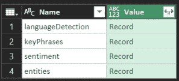

`Value`列是包含嵌套值的特殊表列。要导航到所需的变量，我们需要点击符号，并在连续出现的列中重复该操作。通过这样做，我们可以，例如，得到情感值，0.97。一旦没有更多要扩展的列，我们就可以加载数据并创建一个包含 JSON 结构中所有值的常规 Excel 表，该表将用于进一步的分析。

<title>Importing data from a database</title> 

# 从数据库导入数据

有许多不同的数据库可用，Excel 可以连接到其中的大多数。它们的连接过程都是相似的。我们将使用一个例子:MS SQL Server Express 数据库，它是免费的，可以在任何计算机上下载。它有一些限制，但是对于用少量数据进行学习和测试非常有用。假设您的计算机中有一个本地数据库，请执行以下步骤来连接数据库:

1.  点击数据。
2.  导航到*获取数据|从数据库|从 SQL Server 数据库*，如以下截图所示:

3.  弹出对话框将要求数据库服务器的名称。在这种情况下，它是本地计算机名和 SQL Express 服务器。可选地，我们可以添加数据库名称，但是如果我们将其留空，我们将能够看到服务器中所有数据库的列表。这些细节显示在下面的截图中:

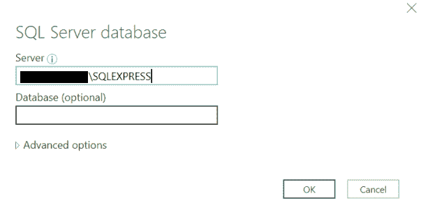

4.  使用您的凭据连接到数据库。可能您可以使用您的 Windows 用户名和密码登录(如下面的屏幕截图所示),或者您有一个特殊的数据库用户名和密码对:

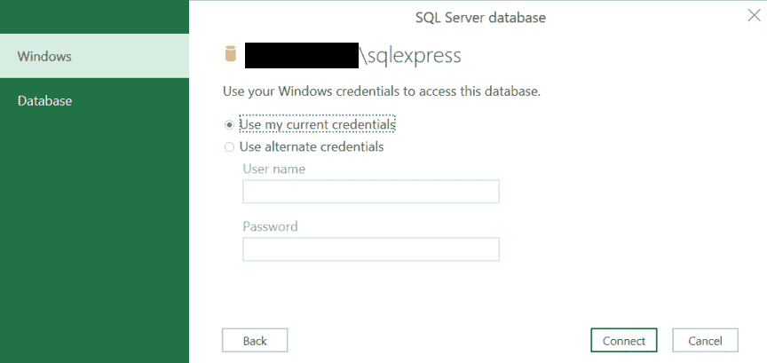

5.  如果连接成功，您将看到服务器上所有数据库的列表以及每个数据库中包含的表。

6.  选择其中一个表并获得通常的预览，如下面的屏幕截图所示:

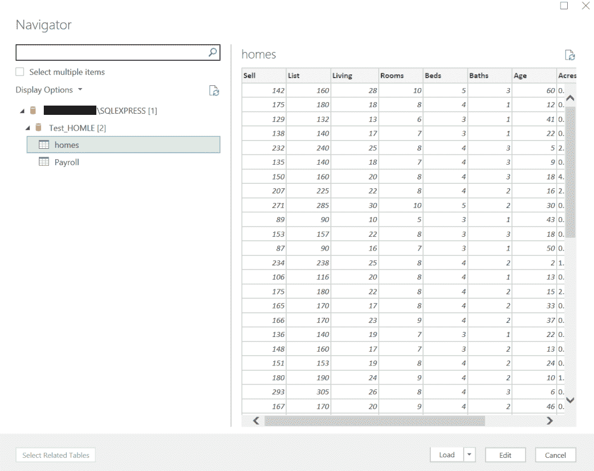

与前面的情况一样，您可以选择编辑数据或加载数据。最终结果将始终是一个 Excel 表格。

现在，您知道了如何将 Excel 表连接到数据库，这是最常用的数据存储方式。现在我们已经有了数据，下一步就是为分析做准备。这将在下一章中详细说明。

<title>Summary</title> 

# 摘要

在本章中，我们描述了将信息输入 Excel 电子表格的不同方法，超出了手工输入数据的范围。通过使用超级查询和查询编辑器提取、转换和加载数据，可以在 Excel 中分析各种文件类型、web 数据源和数据库。我鼓励您探索其他数据源，因为加载过程非常相似。

到目前为止，我们已经看到了一些非常简单的数据转换在数据加载之前被应用到数据上。在下一章，我们将讨论更高级的数据清理技术。

<title>Questions</title> 

# 问题

1.  哪些字符可以在文本文件中用作分隔符？
2.  为什么在加载数据之前预处理数据如此重要？
3.  打开 Excel 文件和导入有什么区别？
4.  什么类型的信息可以从网页导入？
5.  JSON 是用来交换信息的结构化格式之一。还存在哪些其他格式？
6.  做一些在线研究，以了解使用数据库相对于单个数据文件的优势。

<title>Further reading</title> 

# 进一步阅读

*   *电力查询文档*:【https://docs.microsoft.com/en-us/power-query/ 
*   *查询编辑器介绍(电力查询)*:[https://support . office . com/en-us/article/Introduction-to-the-Query-Editor-Power-Query-1 D6 CDB 63-bf70-4ae 8-a7 D5-6ae 9547004d 9](https://support.office.com/en-us/article/introduction-to-the-query-editor-power-query-1d6cdb63-bf70-4ae8-a7d5-6ae9547004d9)
*   *介绍 JSON*:【https://www.json.org/ **