# 数据清理和初步数据分析

在获得正确的数据后，最困难和最耗时的任务是为分析做好准备。在使用任何模型之前，第一步是了解对于给定的数据集可以做什么和不可以做什么。本章演示了如何使用 Excel 函数来搜索和替换模式，以及如何找到错误的数据类型和丢失的数据。它还包含一些有用的图表，以便我们可以从数据中获得洞察力，并了解不同的变量。

在本章中，我们将讨论以下主题:

*   清理数据
*   可视化数据以进行初步分析
*   了解不平衡的数据集

# 技术要求

您将需要从 GitHub 资源库下载`titanic.xls`文件，网址为[https://GitHub . com/packt publishing/Hands-On-Machine-Learning-with-Microsoft-Excel-2019/tree/master/chapter 04](https://github.com/PacktPublishing/Hands-On-Machine-Learning-with-Microsoft-Excel-2019/tree/master/Chapter04)。

# 清理数据

数据从来都不是干净的——它总是包含缺失值、错误、不正确的格式和其他问题，这些问题使得不经过预处理就无法输入到机器学习模型中。这就是数据清理的意义所在——在开始真正的分析之前纠正所有这些问题。

作为如何清理数据集的示例，我们将使用泰坦尼克号乘客数据集。我们将重复上一章*从另一个 Excel 工作簿*导入数据一节中描述的程序，从 Excel 工作簿导入数据。我们将使用泰坦尼克号乘客的真实数据，并演示如何准备数据进行分析。

要清理数据集，请执行必要的步骤，如下所示:

1.  导航到数据|来自文件|来自工作簿，如以下屏幕截图所示:

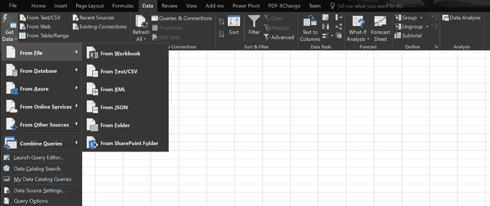

2.  在选择了`titanic.xlsx`文件和`Passenger data`工作表之后，我们得到了文件内容的预览，如下面的屏幕截图所示:

3.  单击编辑并开始数据清理过程。我们注意到的第一件事是，我们不需要包含乘客姓名的列；它没有给我们的分析提供任何有用的信息。事实上，在大多数情况下，由于隐私政策，我们将被要求从我们的数据中删除个人信息。
4.  选择`name`栏。
5.  点击删除列*；*结果表将如下所示:

6.  将`cabin`栏中的所有`nulls`替换为`unknown`:

还有另外两列包含缺失值:`boat`和`body`。根据数据字典，它们告诉我们乘客所在的救生艇(如果他们幸存)，以及在他们死亡的情况下，他们的尸体被分配了哪个 ID。有缺失的值，但也有一些情况我们不能有一个值；显然，一名死亡乘客没有使用船只，一名幸存乘客的尸体没有被确认。我们将使用一些函数来说明这些选项。

7.  在查询编辑器中，选择“添加列”选项卡。
8.  选择自定义列。
9.  该对话框向我们显示了一个选项，用于命名新列并定义其内容。在文本框中键入`boat_corrected`。

10.  定义一个计算列内容的函数，如下所示:

*如果[幸存]=1 且[船]=空，则“未知”否则[船]*

这意味着，如果乘客幸存并且船名丢失，我们将值设置为`unknown`。否则，我们只需将值复制到原始列中，如下面的屏幕截图所示:

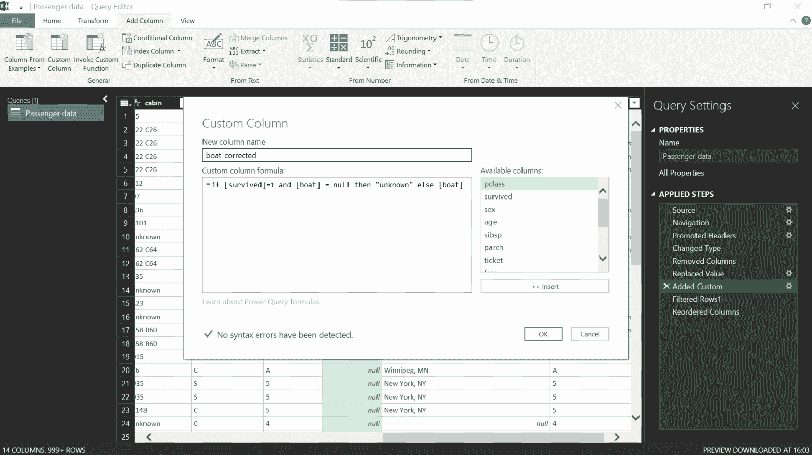

11.  添加另一个新列，以修正`body`中的值，并为该列定义不同的值:

*如果[幸存]=0 且[正文]=空，则“未恢复”否则[正文]*

在这种情况下，我们想说，如果乘客没有在海难中幸存，也没有尸体 id，那么它很可能没有从水中打捞上来。

对列重新排序后的结果如下:

新列中仍有`null`值；它们对应于前面的情况(即没有船的死亡乘客，或没有尸体 ID 的幸存者)。用`N/A`替换这些值；生成的表格如下面的屏幕截图所示:

最后一个要修改的列是`age`。我们将简化这一过程，将乘客按年龄范围分组，并替换缺失的值。

12.  用`-1`替换所有缺少的值(`null`)。我们可以通过选择该列并单击“替换值”来轻松做到这一点。
13.  导航到添加列选项卡。

14.  单击条件列，根据年龄范围定义几个组，如下面的屏幕截图所示:

结果是一个新列(`Age group`)，它包含不同的年龄组而不是年龄值，并且用`unknown`替换了`null`值。结果表如下所示:

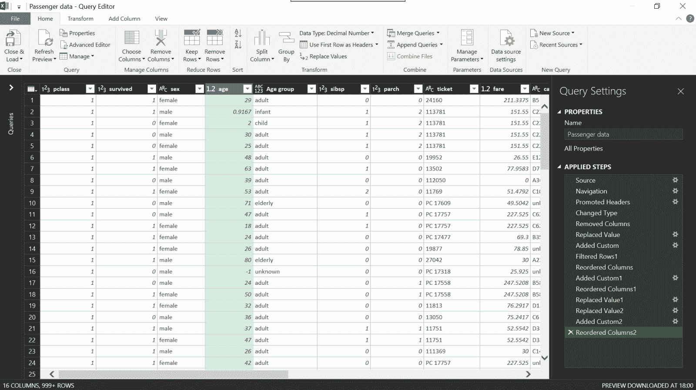

我们的数据集现在是干净的，可以进行一些初步的分析，我们将在下一节中展示。

# 可视化数据以进行初步分析

清理数据集后，总是建议将其可视化。这有助于我们理解不同的变量，它们的值是如何分布的，以及它们之间存在的相关性(我们将在下一章更详细地探讨相关性)。我们可以确定哪些变量对我们的分析是重要的，哪些给了我们更多的信息，哪些是多余的可以丢弃。

我们将从查看几个条形图开始，其中我们将计算每个值出现的次数(使用直方图)，或者显示每个值相对于总数的百分比(使用条形图)。为此，请执行以下步骤:

1.  右键单击表格中的任意单元格以访问快速分析选项:

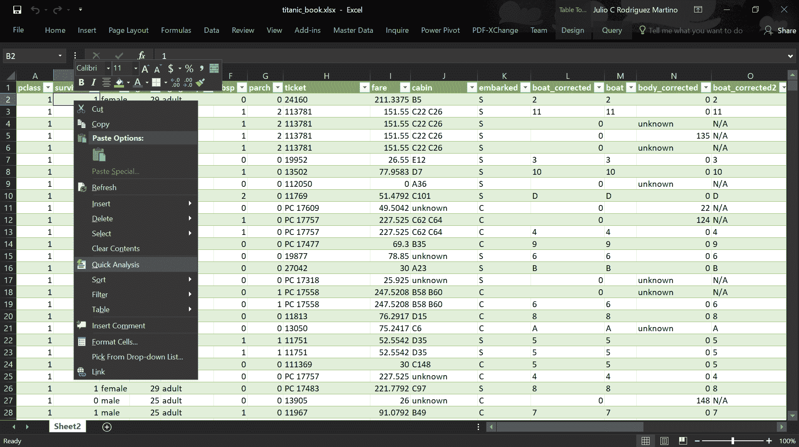

2.  在弹出的窗口中，我们可以选择图表类型。选择集群列，如下面的屏幕截图所示:

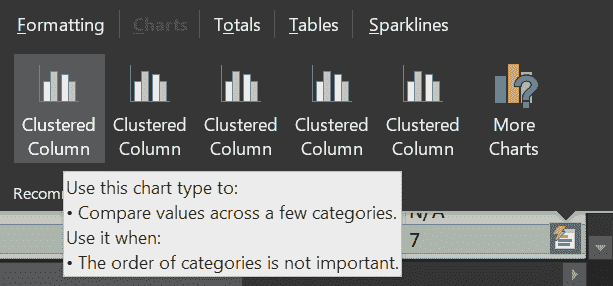

默认情况下，Excel 会创建一个显示一些变量的数据透视表；我们需要改变变量和分组操作来反映我们所需要的。

3.  在右下角，我们会看到一个标有σ的窗口。在其中，我们可以单击变量并显示菜单，如下面的屏幕截图所示:

4.  单击值字段设置；您将看到一个弹出窗口，类似于下面的屏幕截图，您可以在其中从 Sum 更改为 Count，因为我们希望对值进行计数，然后计算它们的总和:

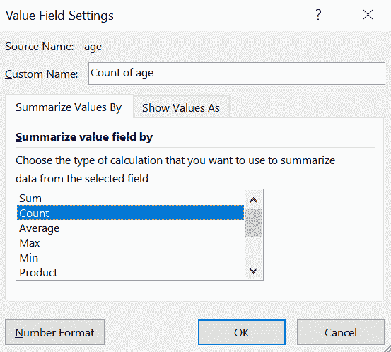

我们将`Age`变量转换成了`Age group`，所以这就是我们现在想要使用的变量。也就是说，我们想要计算给定年龄组中有多少乘客。

5.  将数据透视图字段中的选择更改为`Age group`。
6.  现在，更改图表标题并移动它，使其看起来类似于下面的屏幕截图:

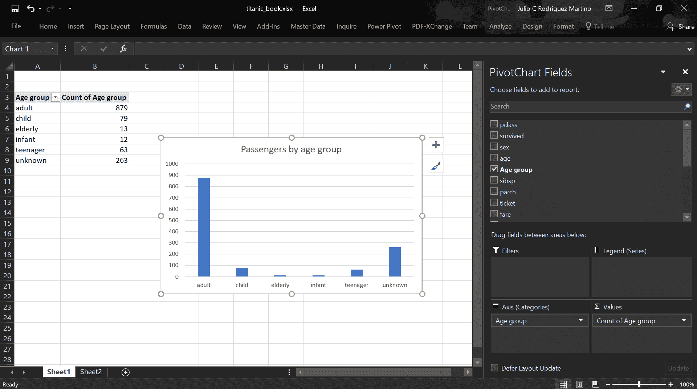

我们可以看到大部分的乘客都是成年人。我们丢失了列表中许多乘客的信息，而其余组共享少量乘客的信息。图表中使用的表格可以在左上角看到。

一个有趣的问题要问，*不同年龄段的生存概率有区别吗？*为了回答这个问题，我们需要将`survived`变量添加到 Axis (Categories)窗口，该窗口位于工作表的右下角。我们通过将变量从“数据透视图表字段”窗口拖放到 Axis 中来实现这一点。生成的图表如下:

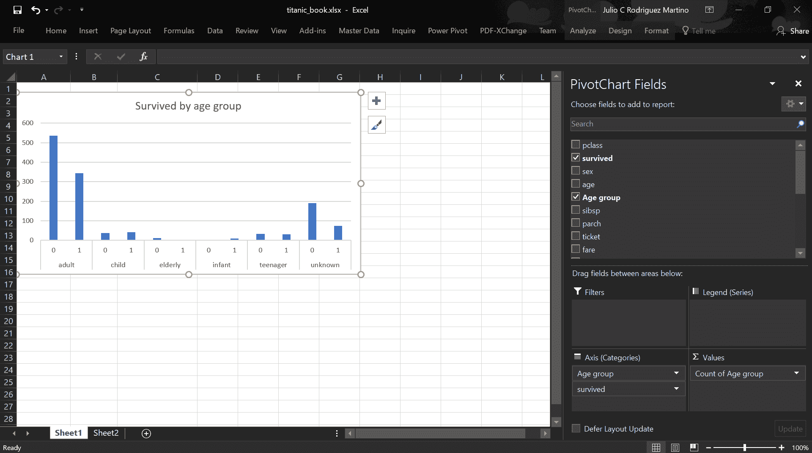

这张图表有一个值得注意的问题——我们不容易比较年龄组，因为他们的成员在数量上非常不同。解决方案是引用每个年龄组的乘客总数，并显示百分比。看前面的图表，我们可以看到数据先按`Age group`分组，再按`survived`分组。第一个是父变量。重复我们之前描述的步骤，导航到值字段设置菜单；您将看到一个弹出窗口，如下图所示:

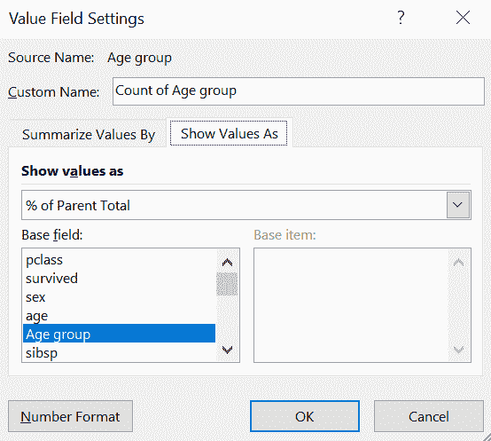

7.  单击 Show Values As 选项卡，如前面的屏幕截图所示。
8.  选择父项合计的百分比选项，并将`Age group`字段作为父项；结果如以下截图所示:

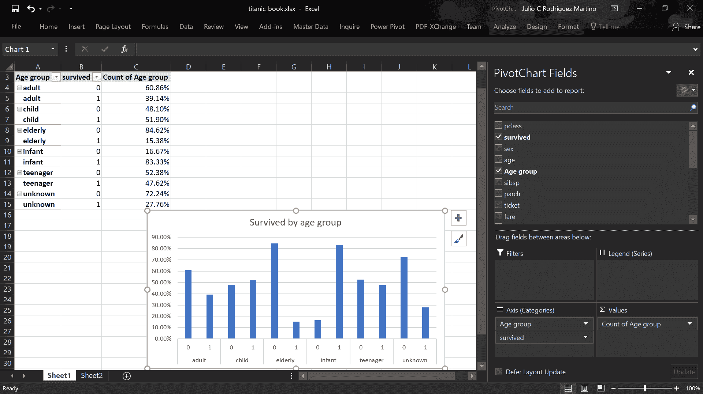

该百分比是相对于每个年龄组的乘客总数而言的，现在比较起来更容易了。很大比例的老年人没有在海难中幸存，大多数成年人遭受了同样的命运，儿童和青少年的人数似乎持平。同样清楚的是，大多数婴儿都活了下来，可能是因为他们优先登上了救生艇。

重复同样的步骤，我们可以假设，与其他乘客相比，乘坐头等舱的乘客更有可能幸存；考虑下面的图表:

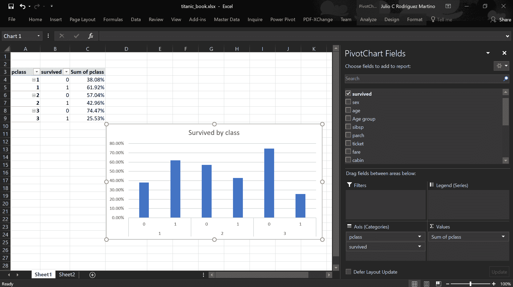

是的，如果你坐头等舱比坐三等舱更容易生存。这是一个关于泰坦尼克号悲剧的已知事实，我们可以看到它反映在数据中。不同舱位的旅行条件以及安全措施大相径庭。

那么，性别呢？乘客是男是女有关系吗？让我们建立一个幸存男女人数的直方图，并用它来回答我们的问题。生成的图表如下面的屏幕截图所示:

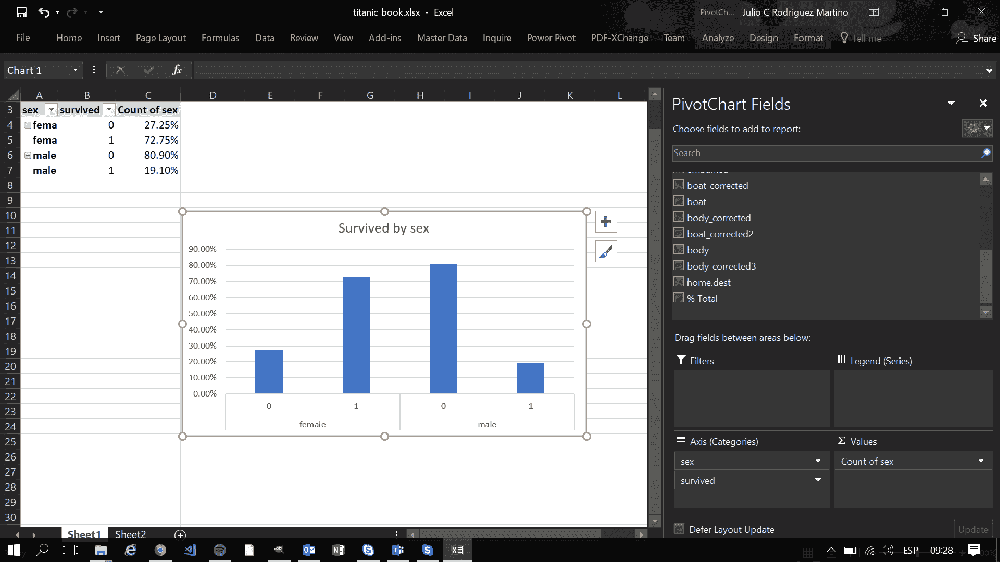

如你所见，性别显然很重要。女性幸存者的概率比男性高，至少一般来说是这样。这可能是因为女性优先登上救生艇，而男性，尤其是年轻的男性，为了帮助其他乘客而被推迟，所以他们不能及时登上救生艇。

我们结合了以前对数据集的了解和来自数据的信息，以更好地理解我们可以做什么和不可以做什么。鼓励你为其他变量和组合创建图表，并尝试理解结果。为了理解我们从机器学习模型中获得的结果是否有意义，理解数据集的基本细节是极其重要的。

# 了解不平衡的数据集

为了能够比较不同变量的结果，我们需要考虑到每类样本的不同数量。让我们假设，我们想要训练一个机器学习模型，根据年龄组、性别和阶级来预测给定乘客是否会幸存。如果我们在`survived`变量中绘制值的分布，我们将看到以下内容:

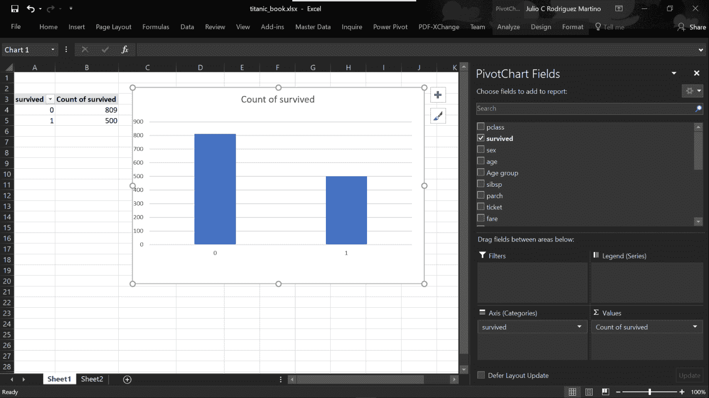

从前面的图表可以清楚地看出，非幸存者几乎是幸存者的两倍。如果我们按原样使用这个数据集，我们会给数据集引入一个偏差，这会影响结果。对生存变量的预测`0`比预测`1`的概率大约高两倍。这种说法的一个例外是决策树及其相关的预测模型(如随机森林和 XGBoost)，它们可以正确地处理不平衡的数据集。其他模型，尤其是神经网络，对不均匀的数据集非常敏感。种族、性别和算法中的其他偏见引发了人们对广泛使用**人工智能** ( **AI** )在各个层面做出决策的担忧。这是将 AI 应用于现实生活时的一个严重问题，防止它的可能解决方案仍在研究中。

给定足够的数据条目，平衡数据集的一个简单方法是从多数类中随机选择一定数量的条目，这些条目与少数类中的条目相等。在这种情况下，我们可以从将`survivor`显示为`0`的行中选择 500 行。让我们通过以下步骤来实现这一点:

1.  过滤条目，如下面的屏幕截图所示:

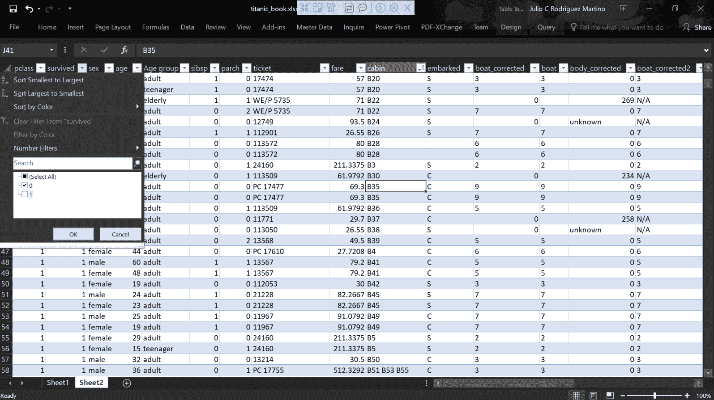

2.  复制条目并将其粘贴到新的工作表中。
3.  在开头插入一个新列，命名为`ID`。
4.  将数据转换成表格(插入|表格，保留第一行作为标题)。
5.  在第一个单元格中输入以下公式，并将其复制到该列的其余部分:

*=兰德()*

6.  确保自动计算已关闭。为此，导航至公式|计算选项并选中手动。这将防止随机数自动改变:

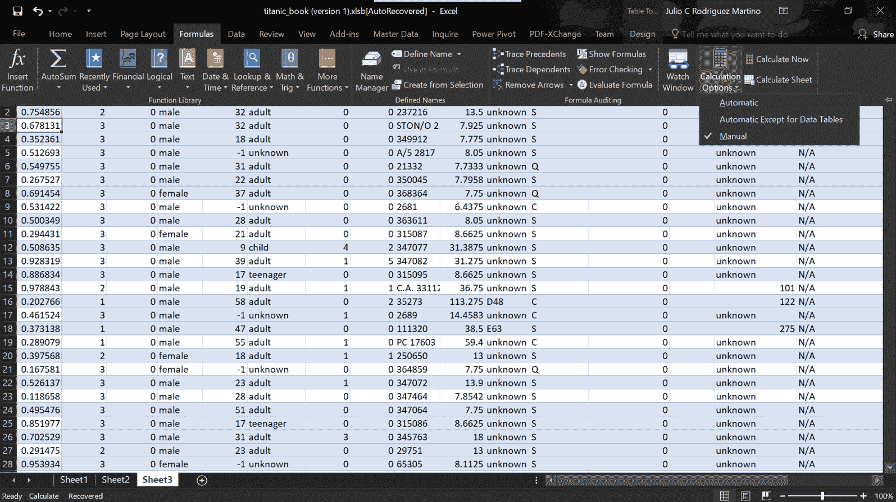

7.  按 ID 对数据进行排序(可以选择升序或降序，没有任何区别)。
8.  选择前 500 行作为您的随机样本。
9.  将这些行复制到新的工作表中。
10.  添加带有`survived`的 500 行作为`1`。

你现在有一个包含 1000 个条目的完美平衡的数据集，你现在可以用它来训练你的机器学习模型。

# 摘要

在本章中，我们探讨了处理缺失数据的不同方法，并学习了如何对其进行分组或汇总。我们已经向您展示了清理后可视化数据的重要性，以便能够理解和解释结果，从基本到更高级的模型预测。这是任何特征工程的开始，因为我们基于它们的值转换和/或丢弃特征。太多的缺失值将意味着我们不能使用那个变量(或特性)，或者高相关性将意味着我们可以丢弃其中一个相关变量。我们将在下一章更深入地探讨相关性，向您展示如何使用不同的方法定量地测量它们。

即使在应用机器学习模型之后，初步的数据可视化对于理解数据属性和解释我们获得的结果也是极其重要的。

# 问题

1.  回顾上一章解释的内容，使用`class`、`gender`和`Age group`作为特征，使用`survived`作为目标变量，构建一个决策树。你应该能够定义一些乘客生存的条件。
2.  你认为数据集中哪些变量是高度相关的？
3.  假设数据集包含一个只有少量缺失值的数值变量。有没有可能用数值代替这些缺失值？你会用什么值？
4.  解释偏见的含义以及避免偏见的重要性。
5.  哪些其他类型的图表可用于初步数据分析？在给定的数据集中尝试其中的一些。

# 进一步阅读

*   *数据清理最佳实践:收集数据前后需要做的所有事情的完整指南*，*第一版*，作者 Jason W. Osborn
*   *塔夫茨数据实验室使用微软 Excel 2013 &基于网络的工具*介绍数据可视化技术
*   *a . fernández、V. López、M. Galar、M.J. del Jesus 和 F. Herrera 分析多类不平衡数据集的分类:预处理和成本敏感学习的二值化技术和特别方法*