# 六、相关性和变量的重要性

一般来说，变量之间的相关性意味着一个变量的变化会反映到另一个变量上。然而，这并不意味着一个变量的变化是由相关变量的变化引起的。例如，一种产品的销售价格与其制造成本相关，但价格上涨并不完全是由制造成本引起的，因为还有运输和通货膨胀等其他因素需要考虑。

并非数据集中的每个变量或特征都对我们计划的分析有用，有时，它们中的许多是多余的。变量对之间的强相关性告诉我们哪些可以被丢弃，哪些对于预测或解释目标变量是重要的。

可以在 Excel 中执行不同的相关性计算，并用于确定输入要素的相对重要性。我们将在这一章中展示其中的一些方法，以及图形方法。

本章将使用的数据集来自卡内基梅隆大学维护的 StatLib 库，该库将汽车的不同变量与其油耗相关联。

在本章中，我们将讨论以下主题:

*   构建散点图
*   计算协方差
*   计算皮尔逊相关系数
*   研究斯皮尔曼相关性
*   了解最小二乘法
*   关注特征选择

# 技术要求

你需要从 GitHub 仓库的[https://GitHub . com/packt publishing/Hands-On-Machine-Learning-with-Microsoft-Excel-2019/tree/master/chapter 05](https://github.com/PacktPublishing/Hands-On-Machine-Learning-with-Microsoft-Excel-2019/tree/master/Chapter05)[下载`auto-mpg.xlsx`文件。](https://github.com/PacktPublishing/Hands-On-Machine-Learning-with-Microsoft-Excel-2019/tree/master/Chapter05)

# 构建散点图

首先，加载`auto-mpg.xlsx`文件。我们将使用其中的数据来说明本章的不同方面。Excel 文件及其参考资料中描述了变量的含义。

评估变量之间相关性的最简单方法是创建一个散点图，将所有特征成对。例如，如果我们绘制 *x* 轴中的`Cylinders`变量与 *y* 轴中的`Displacement`变量，我们将看到一个*正* *相关性*(即气缸数量越多，排量值越高)。这是可以预料的，因为发动机排量的计算(这里用立方英寸表示)线性地依赖于气缸的数量。

散点图如下图所示:

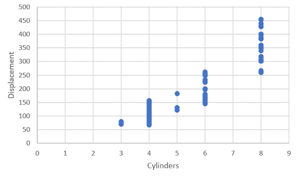

相反，如果我们看看油耗和车重之间的关系，图表将类似于下图:

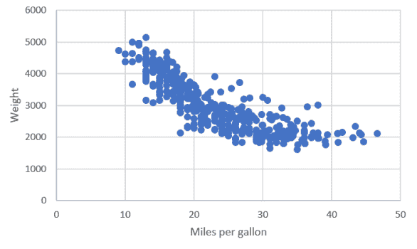

在这种情况下，汽车的重量与每加仑燃油行驶的里程数成负相关(即汽车越重，一加仑燃油能行驶的里程数越少)。我们还注意到相关性是非线性的，这意味着直线不能描述这些变量之间的关系。

那么，如果我们画两个不相关的变量呢？举例来说，发动机中的气缸数和汽车的制造年份之间会有什么关联吗？让我们来看看下图:

在这里，我们注意到装有 **3** 或 **5** 气缸的汽车在我们分析的时间段内并不常见，因为它们的例子很少。年 **78** 到 **80** 似乎是 **5** 缸发动机时期，但是，除了这些事实之外，还有 **4** -、 **6** -、以及 **8** 缸发动机在我们的数据集中每年都有生产。这两个变量之间没有明确的相关性，其中一个不能给我们任何关于另一个的信息。

如果我们有几个变量，这种在散点图中寻找相关性的方法是很好的，但是图的数量需要快速缩放。实际上，如果变量的个数是*N[v]，那么要看到所有相关性所需的组合个数如下:*

*N[v]*(N[v]-1)*

即使像我们这样的小数据集，要包含 8 个数字变量，我们需要 28 个图表来涵盖所有可能的组合。如果我们有数百个变量，那么用肉眼找出哪些变量相关的任务是根本不可能的。在下一节中，我们将介绍自动计算相关性的方法，这使得处理大型数据集和大量要素成为可能。

# 计算协方差

我们需要定义一种统计方法来定量测量两个特征之间的关联程度。两个变量的协方差就是这样做的，所以让我们看看它是如何计算的。如果有两个变量， *x* 和 *y* ，我们首先把它们的值集中在它们的平均值，和；然后，我们将新值相乘并取乘积的平均值:

这个定义意味着，如果两个变量同时增加或减少，那么协方差是正的，而如果它们以相反的方向移动，那么协方差是负的。如果没有相关性，协方差值就会很小，也就是接近于零。

从定义中还可以清楚地看出，由于变量保持它们的标度，因此很难比较具有非常不同的平均值的特征，也不可能比较两个协方差。

使用数据分析加载项(我们在附录中解释了如何激活它)可以很容易地在 Excel 中计算协方差。

要计算协方差，请执行以下步骤:

1.  打开数据文件。
2.  导航至数据|数据分析。
3.  在弹出的窗口中，选择协方差，如下图所示:

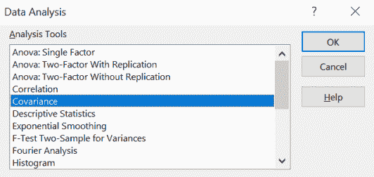

4.  选择数据区域；在这种情况下，它是除最后一列之外的整个表，最后一列包含汽车名称并且是非数字的:

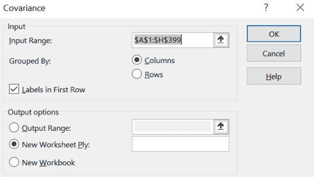

结果如下表所示:

我们可以看到`displacement`和`cylinders`之间的正协方差值，以及`weight`和`mpg`之间的负值。我们不能说太多，因为比较这些值是不可能的，正如我们之前解释的那样。这里最大的变化是我们同时计算所有的值，所以我们不需要一个接一个地看图表。矩阵是对称的，所以只显示一半。

有一种方法可以量化相关性并进行比较，这是卡尔·皮尔逊在 19 世纪 80 年代发明的。让我们在下一节更详细地探讨它。

# 计算皮尔逊相关系数

皮尔逊系数在比较两个变量时最常用，它通过测量变量之间的线性关系来工作。皮尔逊给出的原始定义如下:

分子与协方差成比例，分母是居中变量的标准差(σ)的乘积。这种标准化确保了 *ρ* 的可能值的极限是 *-1* 和 *1* 。

我们可以重复*计算协方差*一节中概述的步骤，通过在弹出窗口中选择相关性来计算 Excel 中的皮尔逊相关性。

结果表如下所示:

包含值`1`的单元格表示其自身与每个变量之间的线性关系。负相关意味着一个变量增加而另一个变量减少，而正相关意味着两个变量的变化方向相同。

皮尔逊系数适用于比较特征关系。例如，我们可以看到`cylinders`和`displacement`比`weight`和`mpg`更线性相关(事实上，根据位移的定义)，即使第二对中的两者相关。

皮尔逊系数的另一个定义如下:

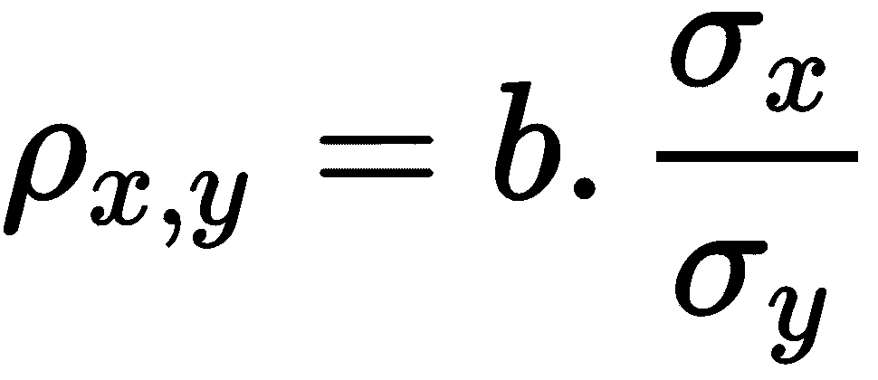

这里， *b* 是最符合 *x* 对 *y* 的线性回归的斜率， *σ [i]* 是 *x* 和 *y* 的标准差。这个定义清楚地表明，系数衡量关系的线性度，同时也衡量两个特征可以变化的程度。

那么，如果关系不是线性的呢？在下一节中，我们可以讨论另一个系数，它将帮助我们计算非线性相关性。

# 研究斯皮尔曼相关性

要计算斯皮尔曼系数，我们需要先对每个变量的值进行排序，也就是我们从最高到最低排序时值的顺序。一旦我们有了新的表格，我们将在上面计算皮尔逊的 *ρ* 。

在新工作表中，我们在单元格中定义了以下公式:

*=等级。AVG(数据！a2；auto_mpg[mpg])*

这里，我们要求 Excel 在该单元格中写入与数据表中第一个单元格`mpg`列相对应的排名，并考虑到该列的整个范围。我们将公式复制到右边的单元格，直到完成数据表的列数(8 列)。如果您将公式复制到一个额外的单元格也没关系，因为您超出了数据表的范围，所以您只会得到一条错误消息。以类似的方式，我们可以将公式复制到剩余的行，直到我们到达行 **399** (数据表的垂直范围)。我们甚至可以使用以下公式为新列添加标题:

*= CONCAT(" Rank _ "；auto _ mpg[[# Headers]；[mpg]])*

然后，我们将它复制到第一行的所有单元格中。

我们获得的表格示例如下:

因为`horsepower` 缺少了一些值，无法进行排名，所以显示为`#N/A` *。*由于只有几个，我们可以手动删除。这将避免在下一步计算皮尔逊系数时出现错误，正如我们之前所做的那样；结果如下:

我们得到的值与皮尔逊系数的值相似，但是当存在非线性但强相关时，它们略高。

只有当相关性单调增加或减少时，Spearman 才接近于 **1** 。下面的截图更好地展示了这一点:

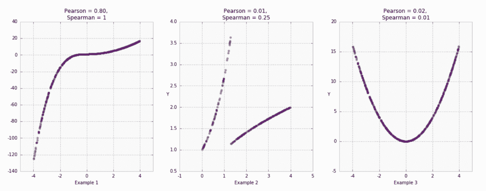

在第一张图中，Pearson 值很高，因为这种关系可以用一条直线来调整，即使它不是最佳拟合。Spearman 是 **1** 因为有关系，而且是单调递增的。第二张图显示了与突变的关系，给出了两个系数的小值。第三张图显示了变量之间的二次关系，它既不是线性的，也不是单调的。看一下这三个例子，我们可以理解，系数并不总是给出关于变量之间相关性的所有必要信息，但它们对于获得一个总体概念是有用的。

# 了解最小二乘法

在某些情况下，我们可能想要证明两个变量之间存在函数关系，因此，在我们的模型中只使用其中一个，因为另一个可以很容易地用表达式来近似。在这种情况下，依靠最小二乘法是有用的。给定一组点( *x [i] ，y [i]* )和一个函数如*y '[I]= f(x[I])*，该方法使 *y' [i]* 和 *y [i]* 之差的平方最小化。我们正在计算的最小化的一般表达式如下:

我们将使用数据表中的两列，即`weight`和`mpg`:

1.  在新工作表中创建新表格。
2.  复制`weight`和`mpg`列的值。

3.  按照`weight`的值对行进行排序；结果表如下所示:

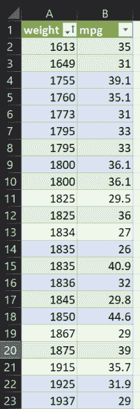

4.  插入折线图以查看函数关系，如下所示:

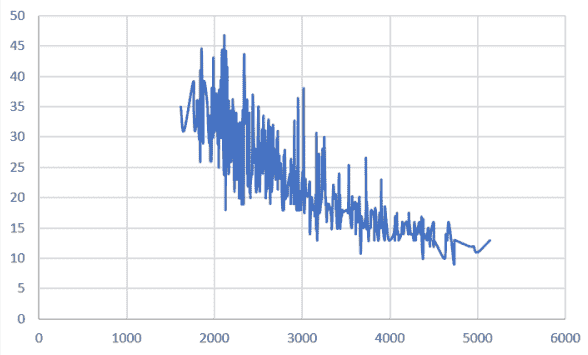

假设我们假设 *mpg = A*weight^(-b)* 并试图找出常数 *a* 和 *b* 。

5.  使用以下公式创建新列`prediction`:

*= $ H $ 2 *幂([@ weight]；$H$3)*

结果表如下所示:

6.  为了填表，我们选择初始值 *a = 60* (在单元格 *H2* )和 *b = -0.5* (在单元格 *H3* )。这些将是最小二乘法的起点。
7.  要最小化的量是误差的平方和。为了计算它，我们用下面的公式创建了一个新列`Squared error`:

*=([@mpg]-[@prediction])^2*

8.  然后，使用以下公式对单元格中该列的所有值求和:

*=总和(表 9[平方误差])*

9.  导航到数据|规划求解；如果您看不到此选项，请参考附录中有关如何激活规划求解的说明。您将看到屏幕上弹出以下窗口:

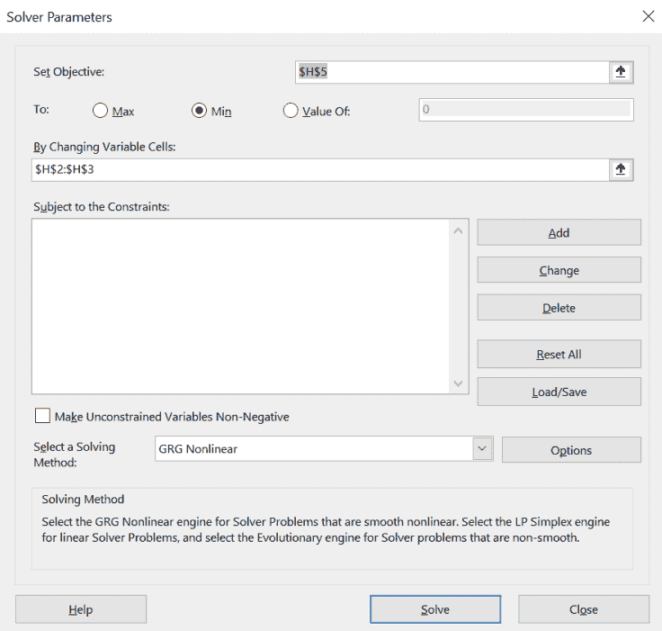

10.  “设置目标”选项由我们计算误差平方和的单元格 ID 填充，“通过改变可变单元格”选项由包含值 *a* 和 *b* 的两个单元格的 ID 填充。我们可以将其余的参数保留为默认值设置。
11.  点击求解；如果回归收敛，您将看到以下窗口:

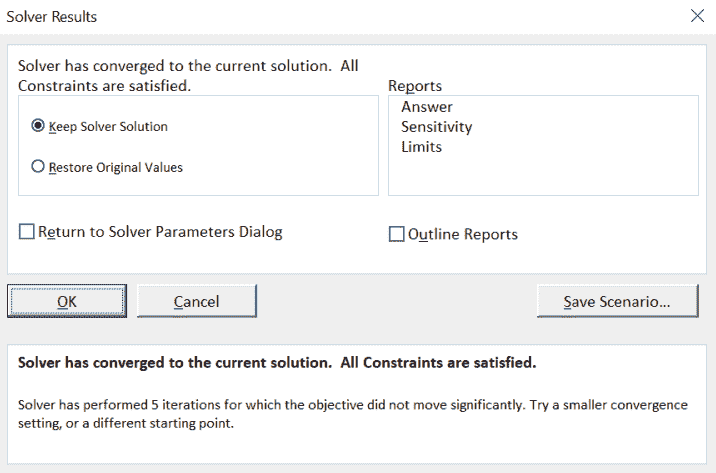

12.  选择保留规划求解解，用计算出的值替换 *a* 和 *b* 的值，并获得所有预测的新值。

如果我们在同一个图表中包含实际值和预测值，您应该会看到类似于下面的屏幕截图:

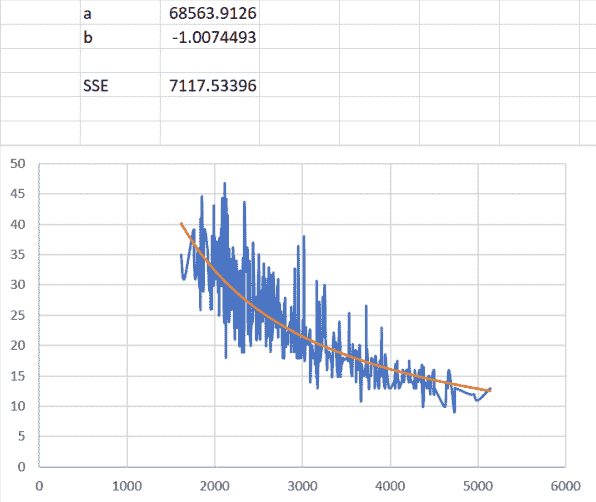

因此，数据点的调整函数大约为 *mpg = 68564/weight* 。

这种调整并不精确，因为 y 变量的离差很大，但在给定汽车重量的情况下，它可以用来快速估计油耗。

我们探索了许多寻找相关变量的方法。这对于理解哪些是相关的，哪些是冗余的很有用。下一节将解释如何使用这些知识来简化我们的机器学习模型的输入。

# 关注特征选择

正如我们前面提到的，这些描述的方法没有一个能准确地告诉我们如何自己选择输入特征。的确，在某些特定情况下，如果相关性足够强，我们可以丢弃一个或多个特征，只保留那些通过相关性代表它们的特征。一般来说，特征工程是一项漫长而耗时的任务，几乎成为机器学习中的一个独立研究领域。

有自动技术来执行特征工程，这是一般称为**自动机器学习** ( **AutoML** )的一部分。该方法包括让计算机尝试不同的功能集，包括它们的组合，并测试结果，直到找到最佳集。尽管如此，在选择特征方面并没有通用的方法，必须对每个问题进行分析，特别是要找到能够带来更好的模型训练和预测能力的特征集。

# 摘要

在这一章中，我们描述了在变量之间建立相关性的最广泛使用的方法，这些方法稍后将被用作机器学习模型中的特征。这是一项长期而艰巨的任务，但却是一个好的预测模型的基础。

没有一种方法可以单独用来确定哪些特征是重要的，哪些是可以丢弃的。方法的组合，加上对数据集的深入了解，是完成这项任务的基础。

在下一章，我们将离开初步任务，开始关注机器学习模型的一些真实用例。

# 问题

1.  什么方法可以更好地找到数值变量和分类变量之间的相关性？
2.  在一对变量之间建立一些其他曲线图，并研究它们背后的相关性和逻辑。
3.  负的皮尔逊系数值是否意味着其中一个变量有负值？
4.  为了更好地比较不同的值，皮尔逊系数的表格可以是彩色的或者添加了横条。在快速分析|格式中浏览这些选项。
5.  最小二乘回归的质量通常用 R ² 的值来衡量。相对于`weight`数据值，计算在`mpg`列中调整的函数的该值(提示:您只需要再计算一个值的和-请参考文献以了解更多信息)。
6.  上一个问题中计算出的值应该接近 0.7，这不足以证明该函数很好地再现了数据。尝试不同的功能，看看结果如何。

# 进一步阅读

*   弗雷德里克·l·柯立芝写的《统计学:一个温和的介绍》