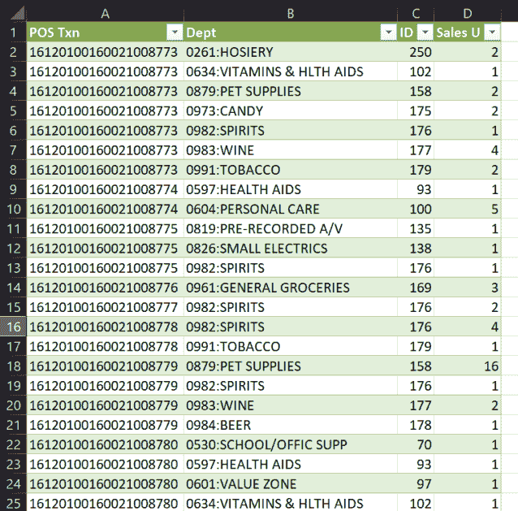
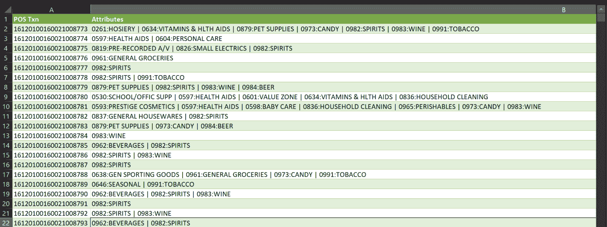
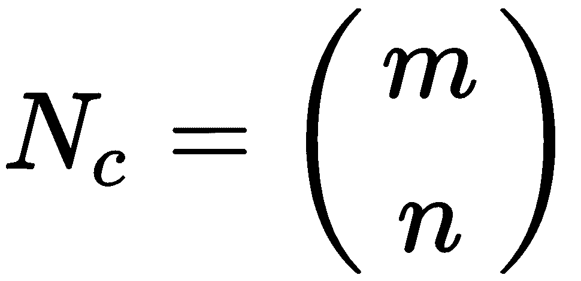
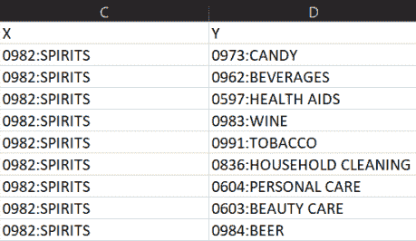
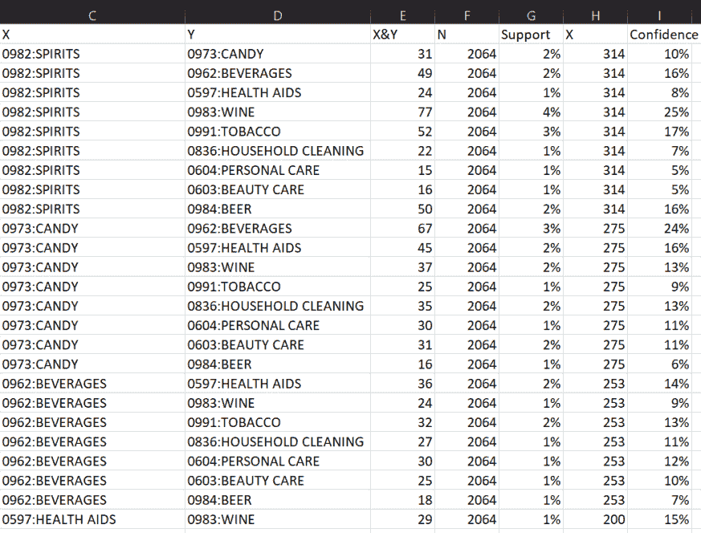
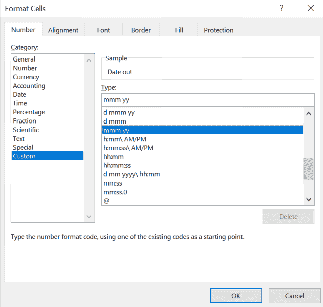
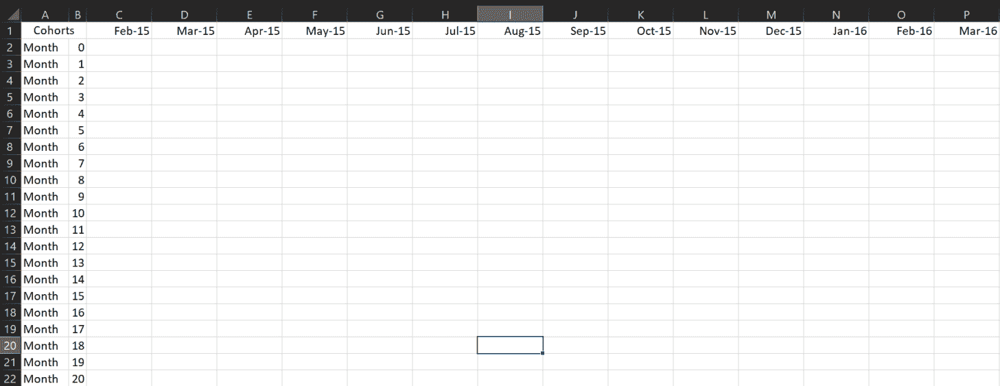
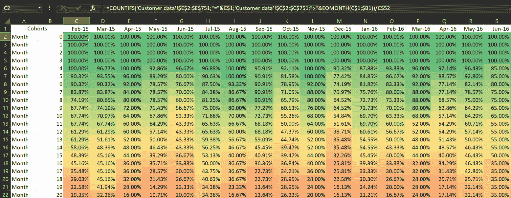
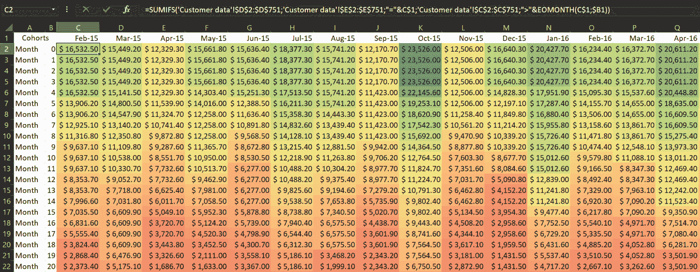

# Excel 中的数据挖掘模型实践示例

数据挖掘是关于发现数据中隐藏的模式和关联。如果数据量很小，只能由人在合理的时间内完成的大量分析，可以由计算机在很短的时间内完成。在 Excel 2016 之前，可以安装一个加载项(称为**数据挖掘**)，该加载项打包了不同的方法和模型，可以使用这些方法和模型，主要作为黑盒，以获得洞察力并发现任何数据集中的信息。微软随后改变了政策，开始将这种能力迁移到云上，首先是 Office 365，最近是 Azure。也可以在 Excel 中计算很多东西，内置函数，甚至借助 **Visual Basic 应用** ( **VBA** )中编程的宏。这里，我们将展示两个案例，数据挖掘可以帮助我们找到隐藏在数据中的重要信息。

在本章中，我们将讨论以下主题:

*   通过实例学习:市场篮子分析
*   通过实例学习:客户群组分析

市场购物篮分析研究顾客经常一起购买哪一对产品/服务。客户群分析分析哪些客户在一段时间后仍在购买产品/服务，哪些客户*流失*。


# 技术要求

为了完成这一部分，读者需要从位于[https://GitHub . com/packt publishing/Hands-On-Machine-Learning-with-Microsoft-Excel-2019/tree/master/chapter 06](https://github.com/PacktPublishing/Hands-On-Machine-Learning-with-Microsoft-Excel-2019/tree/master/Chapter06)的 GitHub 库下载`transactions_by_dept.csv`和`cohort_input_data.csv`文件。


# 通过实例学习——市场篮子分析

我们都在几乎每一个网上商店里读到过这样一句话:*买了这个产品的人也买了...*。这一切都始于 20 世纪 90 年代的亚马逊，如今已广为流传。同样的原则甚至正在实体店进行测试，顾客可以根据他们的购物历史和与其他产品的相似性，获得关于购买哪些商品的个性化建议。这些技巧通常被称为交叉销售，它们非常有用，因为向现有客户销售额外的产品通常比获得新的产品更容易。

在本节中，我们将展示一个简化的购物篮分析示例，这是这些推荐系统背后的数据挖掘技术。结果可能不如用更高级的方法获得的结果准确，但仍然有助于解释该方法并教授如何升级该方法。

我们将使用从[https://data.world/](https://data.world/)下载的商业交易列表。以通常的方式加载`transactions_by_dept.csv`文件。导航到数据|来自文本/CSV 并选择文件。

您需要在 Power Query 中编辑该表，以将第一列的数据类型更改为文本，因为它包含事务 ID，并且可能会被解释为数字并被 Excel 截断。

生成的表格如下所示:



在这个特殊的例子中，我们将只关注前两列。`POS Txn` 包含交易 ID，而`Dept`显示发生交易的部门的描述。我们的目标是找出同一顾客在一次交易中在不同部门购物的频率。

在我们的发现中，我们会看到明显的、无趣的组合；可以解释和利用的意外组合(例如，在一个相关部门购物时提供在一个部门销售的产品)，以及我们无法解释的组合(可能是偶然发生的，或者只是需要进一步调查)。

要开始我们的分析，我们需要做以下工作:

1.  按交易记录编号对所有交易记录进行分组。
2.  列出每一次购买中去过的所有部门。

要执行这些任务，我们将按照以下步骤使用电源查询功能:

1.  导航到数据|来自表/区域。
2.  在继续之前，确保`POS Txn`列的数据类型设置为文本。
3.  点击分组依据*。*您将看到以下弹出窗口:


4.  通过`POS Txn`、*、*选择分组，将新列的名称改为有意义的名称，比如`Concat_dept`(因为我们试图将一次购买中访问的所有部门连接成一个字符串)，并选择任意操作*。*点击窗口右下角的 OK 按钮，类似于前面截图所示。
5.  手动更改计算公式以获得我们想要的数据转换。导航到视图并确保选择了公式栏。如果没有，请选择它，您将看到以下公式:

*=表。Group(#"Changed Type "，{"POS Txn"}，{{"Concat_dept "，每个表。RowCount(_)，type number}})*

前面的公式如下面的屏幕截图所示:


6.  该公式必须替换为以下内容:

*=表。Group(#"Changed Type "，{"POS Txn"}，{{"Concat_dept "，每个文本。Combine([Dept]，" | "，type text}})*

不同的是，不是在表( *Table)中计算行数。RowCount* ，我们将它们连接起来，使用*“|”*作为分隔符(*文本)。组合*。我们还将输出类型改为*文本。*输出应该如下所示:



对于每个事务 ID，我们现在有一个字符串表示涉及的部门列表。我们将使用此表来计算部门的组合，但首先，我们将其转换为一个范围:

1.  右键单击表格中的任何单元格，然后转到表格|转换为范围。
2.  将工作表重命名为`Concat depts` (使用相同的名称，以便将来函数中的引用是正确的)。

在现实生活的例子中，我们可能必须限制我们正在分析的时间段，以减少所需的计算量并清理数据，忽略不寻常的事务(异常值)。在我们的例子中，我们将限制所研究的组合的数量。我们可以两人一组，三人一组，甚至更多。问题是，组合的数量会随着部门的数量迅速增加。事实上，这个数字可以计算如下:



这里， *m* 是元素的总数， *n* 是每个组合中的元素数。这种计算考虑到了元素不能重复(一个部门和自己比没有意义)，顺序无关。

我们将根据交易数量选择前 10 个部门，并使用 Excel 函数计算组合。为此，请执行以下步骤:

1.  创建一个数据透视表，如下图所示:


2.  根据事务计数对行进行排序，以获得前 10 名:

```
0982:SPIRITS
0973:CANDY
0962:BEVERAGES
0597:HEALTH AIDS
0983:WINE
0991:TOBACCO
0836:HOUSEHOLD CLEANING
0604:PERSONAL CARE
0603:BEAUTY CARE
0984:BEER
```

如何才能轻松构建两个部门所有可能的组合？如果我们正确定义单元格内容并使用 Excel 内置的复制功能，事情就简单了。

让我们假设这 10 个部门列在单元格 *A1:A10* 中。然后按照以下步骤操作:

1.  创建两个新列，可以标记为`X`和`Y`。
2.  将列`X`中的第一个单元格定义为 *=$A$1* ，将列`Y`中的第一个单元格定义为 *=A2。*
3.  选择两个单元格并向下复制，直到列`Y`显示空值。请记住， *$* 符号在复制时固定单元格的值。
4.  您将获得如下图所示的列表，其中包含所有可能的`X-Y`对部门:



5.  在该列表中最后一个单元格之后的单元格中，将`X`定义为 *= $A$2* ，将`Y`定义为 *= A3* 。
6.  重复复制操作。如果你继续定义`X`为 *= $A$9* 和`Y`为 *= A10* ，你将得到完整的组合列表。
7.  元素的总数应如下所示:


回到我们的`Cancat depts`表，我们需要计算每一对出现在同一事务中的事务数(`X`和`Y`)以及每个部门出现的次数。我们将定义两个函数:

1.  这里，我们假设串接的部门名称在`Concat depts`表的 *B* 列中(这就是为什么需要这样命名；如果你理解这个函数，你可以改变名字)，列 *C* 和 *D* 分别包含`X`和`Y`列表。两个 *COUNTIF* 函数说明了部门名称可以以不同的顺序出现，如下式所示:

*X&Y = = COUNTIF(' Concat depts '！$ B $ 2:B $ 2065；" * "&C2&" * "&D2&" *)+COUNTIF(' Concat depts)！$ B $ 2:B $ 2065；“*”&D2&“*”&C2&“*”)*

2.  我们复制以下公式，直到到达最后一个元素，即编号`45`:

*X = COUNTIF('Concat depts '！$ B $ 2:B $ 2065；“*”&C2&“*”)*

3.  我们将计算如下:

*支持= X & Y/N*

*置信度= X & Y/X*

这里， *N* 是交易的总数。*支持度*代表规则(部门组合)在数据中出现的频率，*置信度*是对同时涉及`X`和`Y`部门的交易的条件概率的估计。将这两列相加，我们得到一个如下图所示的表格，显示了计算结果:



我们刚刚执行的计算是 Apriori 算法的基础，该算法由 R. Agrawal 和 R. Srikant 于 1994 年发表，用于在布尔关联规则的数据集中查找频繁项目集，这样命名是因为它使用了频繁项目集属性的先验知识。Apriori 算法在挖掘频繁项目集和相关的关联规则方面也很有用。通常，该算法用于对包含大量交易的数据库进行操作，例如客户在超市购买的商品。它有助于顾客轻松购物，并提高商店的销售业绩。重要的是要注意，项目之间的相关性并不意味着因果关系；例如，购买一件商品会导致某人购买另一件商品。

在现实世界的场景中，我们会选择具有最大*支持度*和*置信度*超过某个阈值的组合，并研究这些见解。除了显而易见的规则，比如人们在同一次购买中在烈酒和葡萄酒部门购物，我们会发现其他我们没有预料到的组合。要点是找到可操作的见解；也就是说，我们可以做些什么。我们可以提供新的文章，将它们组合在促销活动中，并在不同的地方做广告。

有大量的可能性。重要的是，机器已经学会了隐藏的关联，并给了我们关于自己业务的有用信息。极其重要的是，不仅机器学习专家参与这些分析，而且参与业务的人也应该给出他们的印象，并利用他们的经验和知识将这些信息转化为经济利益。

可以在 Excel 中进行全面的分析吗？如果我们没有更先进的工具，我们应该把自己限制在玩具模型上吗？当然不是！Excel 非常强大，能够用于高级分析，但我们需要知道如何用宏编写一点 VBA 代码。

市场购物篮分析的概念现在应该清楚了，我们可以前进到另一个客户行为分析的例子。


# 通过实例学习——客户群组分析

了解公司客户及其行为的一个很好的方法是进行细分分析。这些细分市场是具有相同特征的客户群，通常被称为**群组**。它们的定义在很大程度上取决于我们正在处理的业务类型。

我们将分析的数据集包含一系列客户 id、他们第一次从我们这里购买商品的日期、他们离开我们的日期以及每月平均花费的金额。“离开我们*”*在这个上下文中是什么意思？这主要是一个定义问题。例如，如果我们提到一张信用卡，我们可以认为客户在注销该卡时离开了，或者我们可能想进一步说，如果客户两三个月没有花钱，我们认为他们已经离开了。

我们的分组将基于开始日期。我们将研究在特定时期内有多少客户抛弃了我们。

客户 ( **LTV** )的**终身价值通常是指该客户在与我们相处的整个期间所产生的毛利。这两种分析共同帮助我们决定我们必须留住哪些客户，以及在每月消费和忠诚度方面，哪些行动在获得更有价值的客户方面更有效。**

该分析包括以下步骤:

1.  读取`cohort_input_data.csv`输入文件，导航到 Data | From Text/CSV 并选择它。
2.  如果我们为两个日期列`Date in`和`Date out`选择*月-年*格式，它们看起来更好，也更容易理解。选择列，右键单击它们，然后单击格式化单元格。将出现一个弹出窗口，如下图所示:



3.  添加两列:`Cohort`，在这种情况下等于`Date in`和`Active months`，我们可以计算如下:

*= DATEDIF(B2；C2；*【m】

假设列 *B* 包含`Data in`值，列 *C* 包含`Data out`值。

4.  将此公式复制到其余单元格。按`Date in`排序的结果表如下:


5.  重命名该工作表`Customer data`以备将来参考。

首先，我们将研究在特定人群的一生中，我们如何留住客户。每个小组将告诉我们，为了防止客户流失，应该重复哪些行为，应该避免哪些行为。我们将使用 *COUNTIFS* Excel 函数来计算每个群组中每月活跃客户的数量:

1.  创建一个 48 行的矩阵，从零到我们数据集中最大的月差(48 个月)，每个月一列，从`Feb-15`到`Jan-19`。该矩阵的一个示例可以在下面的屏幕截图中看到:



2.  在表的末尾添加一行，使用以下公式计算每个群组中的客户总数:

*=COUNTIF('客户*数据'！$ E $ 2:E $ 751；" =" & C$1)

这是因为`Customer data`表中的列 *E* 包含了队列列表，而第一行包含了我们矩阵中的队列列表。

3.  将单元格内容复制到表格右侧的所有单元格中，由于行是固定的，因此会为每列计算正确的值，如以下屏幕截图所示:


4.  在矩阵的第一个单元格中，写出以下公式:

*=COUNTIFS('客户数据'！$ E $ 2:E $ 751；" = "&C $ 1；客户数据！加元 2 美元:751 加元；>&EOMONTH(C $ 1；$B1))/C$52*

我们来详细看看这意味着什么:

5.  将公式复制到整个矩阵中。
6.  将单元格格式化为百分比。
7.  使用三色标有条件地格式化单元格。结果看起来像下面的截图:



例如，我们可以看到，20 个月后，在`Feb-15`获得的客户中只有 19%还在。色标还显示，一些群组显示出比其他群组更快的流失。现在，业务专家有必要评估在每个时间段内采取了哪些行动，并重复或更改这些行动。

我们现在知道我们能够留住多少客户，但是他们的价值是什么？他们花的钱不一样，所以我们需要在分析中包括这个变量。请遵循以下步骤:

1.  创建一个类似的矩阵，包含月份数和分组，但现在我们将使用不同的公式:

*=SUMIFS('客户*数据')！$ D $ 2:D $ 751；客户数据！$ E $ 2:E $ 751；" = "&C $ 1；客户数据！加元 2 美元:751 加元；>&EOMONTH(C $ 1；$B1))

这个公式意味着，如果满足两个条件，我们只对 *D* 列中的`Customer data`的值求和:

2.  将单元格值复制到整个矩阵中。
3.  按照与前面类似的方式格式化表格，以获得彩色矩阵，如下面的屏幕截图所示:



在这种情况下，我们可以看到每个群组的花费金额是如何随时间变化的，它与原始客户数量略有不同。


# 摘要

在本章中，我们学习了两种数据挖掘技术:购物篮分析和客户群组分析。第一个告诉我们基于顾客行为的商店部门或产品之间的隐藏关系。第二个显示了客户数量的时间演变，揭示了不同客户群之间的差异。

有大量的数据挖掘分析可以帮助我们挖掘数据集并找到隐藏的信息，这对我们了解我们的业务并做出正确的决策极其重要。

在下一章，我们将详细研究一种特殊的数据集:时间序列。我们将会看到它需要一种不同的建模和分析。


# 问题

1.  在购物篮分析中，如何避免无法解释的随机关联？
2.  如果我们在给定的商店中发现两种产品或两个部门之间的相关性，这可以推广到其他地方吗？
3.  群组矩阵中的一些列显示从给定日期开始的零。这在当前数据集的上下文中意味着什么？
4.  群组矩阵中的最后几行始终显示为零。这在当前数据集的上下文中意味着什么？
5.  你如何最大限度地提高久而久之顾客的消费金额？


# 进一步阅读

*   数据库营销:分析和管理客户
*   *商业数据科学:你需要了解的数据挖掘和数据分析思维，第一版*，作者:福斯特·普罗沃斯特，汤姆·福西特