# 八、在图表、直方图和地图中可视化数据

如果说的是机器学习，为什么要关心可视化？答案很简单:如果你不能向没有任何技术知识的人展示你所分析的东西和你的模型的结果，那么你就不能展示任何附加价值。我们已经展示了数据可视化对于理解数据集和决定哪些特征对训练我们的模型最有用是多么重要。我们现在要研究哪种类型的图表最适合讲述我们的数据和从中获得的新信息。

本章将涵盖以下主题:

*   显示变量之间的基本比较和关系
*   使用直方图构建数据分布
*   在地图中表示数据的地理分布
*   显示随时间变化的数据

# 技术要求

为了完成本章，读者需要从位于[https://GitHub . com/packt publishing/Hands-On-Machine-Learning-with-Microsoft-Excel-2019/tree/master/chapter 08](https://github.com/PacktPublishing/Hands-On-Machine-Learning-with-Microsoft-Excel-2019/tree/master/Chapter08)的 GitHub 库下载`1976USpresident.xlsx`和`subte.xlsx`文件。

# 显示变量之间的基本比较和关系

在数据分析和机器学习的背景下，数据可视化极其重要。其中的一些原因如下:

*   讲述您的数据并帮助决策者开展工作。
*   预测一些变量的未来演变。
*   发现数据中隐藏的趋势和模式。
*   发现异常值，即数据中的异常。
*   了解分布、组成和关系。
*   建立群组和类别。

我们将展示用于显示不同类型数据的不同类型的图表。示例图表中使用的数据如下:

| **年** | **销售额** | **成本** | **利润** | **ROI** |
| Two thousand and fifteen | Twenty-three thousand four hundred and fifty-five | Eighteen thousand two hundred and ninety-four point nine | Five thousand one hundred and sixty point one | 28.21% |
| Two thousand and sixteen | Nineteen thousand two hundred and twenty-six | Twelve thousand eight hundred and eighty-one point four two | Six thousand three hundred and forty-four point five eight | 49.25% |
| Two thousand and seventeen | Thirty-four thousand five hundred and fifty-seven | Twenty-four thousand eight hundred and eighty-one point zero four | Nine thousand six hundred and seventy-five point nine six | 38.89% |
| Two thousand and eighteen | Twenty thousand one hundred and thirty-four | Fourteen thousand six hundred and ninety-seven point eight two | Five thousand four hundred and thirty-six point one eight | 36.99% |
| Two thousand and nineteen | Twenty-two thousand three hundred and fourteen | Fourteen thousand and fifty-seven point eight two | Eight thousand two hundred and fifty-six point one eight | 58.73% |

还要考虑以下数据:

Twenty thousand one hundred and thirty-four

| **年** | **SalesA** | 科斯塔 | **利润 A** | **SalesB** | **CostB** | **利润 B** |
| Two thousand and fifteen | Twenty-three thousand four hundred and fifty-five | Eighteen thousand two hundred and ninety-four point nine | Five thousand one hundred and sixty point one | Twenty-three thousand four hundred and fifty-five | Eighteen thousand two hundred and ninety-four point nine | Five thousand one hundred and sixty point one |
| Two thousand and sixteen | Nineteen thousand two hundred and twenty-six | Twelve thousand eight hundred and eighty-one point four two | Six thousand three hundred and forty-four point five eight | Nineteen thousand two hundred and twenty-six | Twelve thousand eight hundred and eighty-one point four two | Six thousand three hundred and forty-four point five eight |
| Two thousand and seventeen | Thirty-four thousand five hundred and fifty-seven | Twenty-four thousand eight hundred and eighty-one point zero four | Nine thousand six hundred and seventy-five point nine six | Thirty-four thousand five hundred and fifty-seven | Twenty-four thousand eight hundred and eighty-one point zero four | Nine thousand six hundred and seventy-five point nine six |
| Two thousand and eighteen | Twenty thousand one hundred and thirty-four | Fourteen thousand six hundred and ninety-seven point eight two | Five thousand four hundred and thirty-six point one eight | Fourteen thousand six hundred and ninety-seven point eight two | Five thousand four hundred and thirty-six point one eight |
| Two thousand and nineteen | Twenty-two thousand three hundred and fourteen | Fourteen thousand and fifty-seven point eight two | Eight thousand two hundred and fifty-six point one eight | Twenty-two thousand three hundred and fourteen | Fourteen thousand and fifty-seven point eight two | Eight thousand two hundred and fifty-six point one eight |

将这些数据输入到 Excel 工作表中，这样您就可以创建以下部分中显示的图表。

# Excel 图表的基本部分

Excel 图表有不同的部分，知道它们的名称很重要，这样我们可以随意修改图表。下图详细显示了它们:

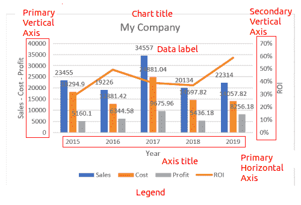

*x* 轴代表数据类别， *y* 轴代表数据系列。

以下小节中显示的所有图表都可以通过选择数据区域并导航到插入|推荐图表来创建。在那里，我们看到预览，并选择一个更好地讲述我们的数据的故事。

# 柱形图

当您想要在同一个图表中显示两到四个不同的数据系列时，可以使用簇状柱形图。只绘制一个系列是没有意义的，超过四个系列会显得杂乱。请看下面的例子:

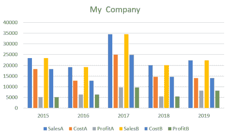

在这种情况下，如果我们拆分数据，看起来肯定会更好，例如，显示一个较小的年份组，并切换时间序列和类别(见下图):

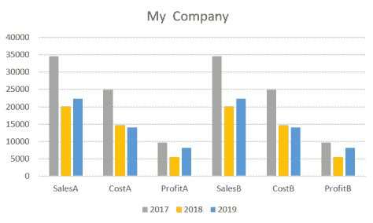

柱形图中的系列应该用相同的单位表示，否则它们无法进行比较，或者它们的比较可能会产生误导。

# 组合图表

如果我们需要显示用不同单位表示的数据系列，我们可以使用组合图表。基本区别在于，这些图表有两个垂直轴，测量单位不同。下图显示了这方面的一个示例:

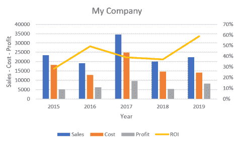

在这种情况下，主垂直轴(左)以货币单位表示，次垂直轴以百分比表示。

# 堆叠图表

当需要指出数据系列中相对值的重要性时，可以使用这种类型的图表。比如*成本+利润=销售额*。我们可以看到，乍看起来比较这些值很容易，如下图所示:

这个图表可以通过首先包括**成本**和**利润**变量，然后加上**销售额**来创建。

# 饼图和条形图

饼图对于比较多个系列非常有用。作为一个例子，我们将使用下表中列出的俄勒冈州 2016 年美国总统选举的结果:

| **候选人** | **票数** |
| 希拉里·克林顿 | One million two thousand one hundred and six |
| 唐纳德·特朗普 | Seven hundred and eighty-two thousand four hundred and three |
| 加里·约翰逊 | Ninety-four thousand two hundred and thirty-one |
| 其他的 | Seventy-two thousand five hundred and ninety-four |
| 吉尔·斯坦 | Fifty thousand and two |

生成的饼图如下所示:

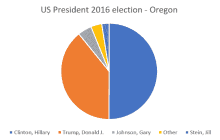

同样的结果可以用条形图显示，票数的差异更容易比较。

右键单击图表的任何部分，将图表类型更改为条形图。

条形图将类似于下图:

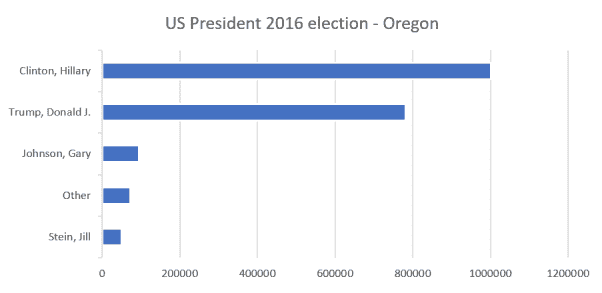

我们现在知道如何为每种类型的数据选择最佳的图表。在下一节中，我们将研究使用直方图预览数据时最重要和最常用的图表之一。

# 使用直方图构建数据分布

我们在第五章、*相关性和变量重要性*中使用了直方图，但没有正式介绍它们。这种类型的图表显示数值或类别的计数。为了显示数字数据，我们可以建立类别，就像我们对泰坦尼克号乘客的年龄所做的那样:

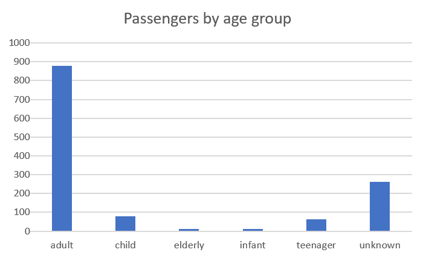

或者，我们可以使用年龄变量作为一个数字，并将这些值分布在条块中(落在相同数值范围内的数据点组):

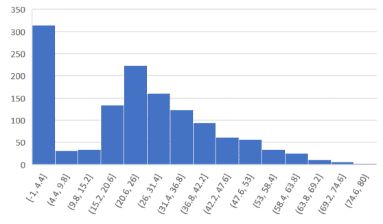

前面的直方图是按照以下步骤创建的:

1.  导航到插入|直方图。
2.  双击 *x* 轴，将箱数设置为`15`。

我们可以立即看到第一个 bin 中有大量条目对应于缺失的年龄值，我们将其定义为`-1`以便于识别它们。我们还注意到，大部分乘客年龄在 20 至 26 岁之间，而且分布不对称；它似乎显示出随着年龄的增长呈指数下降，而在年轻人中下降速度更快。这可以通过思考一个事实来解释，即没有多少小孩乘坐过横渡大西洋的船(至少在泰坦尼克号沉没的时候)。

你还会注意到直方图是发现异常值***的极好的图形化方法；*即不遵循与其余相同分布的数据点。在我们当前的例子中，缺失值也是异常值。**

 **直方图的另一个有用的应用是在有大量项目要比较时比较值。让我们假设我们使用机器学习模型进行了预测。我们正在预测一个数值，我们希望将其与真实值进行比较，以测试我们的模型。然后，对于每组特征值，我们可以绘制出真实值和预测值之间的差异。如果我们的模型是一个很好的预测器，我们应该会看到类似下面的图表:

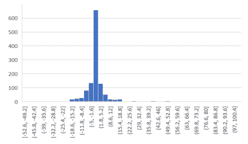

分布以 **0** 为中心，大部分是对称的，有几个大值向右。显然，这些都是糟糕的预测。

我们已经看到直方图是识别数据集不同特征的有价值的工具。现在让我们关注更复杂的数据表示。

# 在地图中表示数据的地理分布

在地图中定位信息对于理解空间维度的数据非常有用，而这通常是通过其他方式难以理解的。Excel 提供了不同的选项，我们将展示其中的几个。我们将从包含地理坐标(即纬度和经度)的数据开始。如今全球定位系统的广泛使用使得获取这一信息变得容易。无论如何，如果没有这种精确的信息，我们将看到 Excel 中内置的信息仍然会使绘制地图变得简单，并向我们显示有用的信息。

在我们的第一个例子中，我们将使用来自*麻省理工学院选举数据和科学实验室*的关于 1976 年美国总统选举的数据。除了其他信息之外，`1976USpresident.xlsx`文件还包含了美国各州的名单和每位总统候选人的投票数。我们希望将这些信息放在一个地图中，类似于新闻中显示的红色共和党州和蓝色民主党州。

输入数据表如下:

从这个表中，我们需要提取每个州的获胜政党，即拥有更多选票的政党。我们将使用 Power Query 及其 Group By 函数。

1.  导航到数据|来自表/区域。
2.  打开电源查询窗口。您应该会看到类似于以下截图的内容:

3.  选择分组依据|高级，然后为分组依据选项选择状态。
4.  然后，我们将添加一个名为`Winner`的新列，在这里我们将对 party *的值求和。*这将给出一个错误，但将为我们提供一个基本函数，以便稍后获得获胜方的名称。
5.  我们将添加的第二列名为`Votes`，在这里我们选择 candidatevotes *的最大值。*这将显示每个州更多的选票。

以下屏幕截图显示了选择详细选项后窗口的外观:

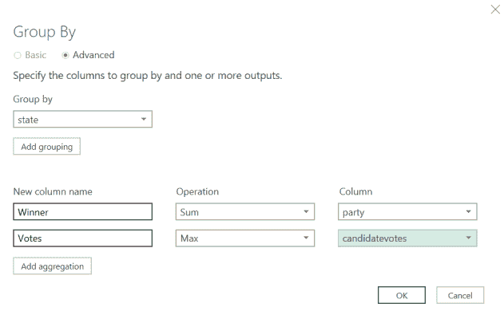

单击“确定”后，生成的表格如下:

6.  为了修复错误并在`Winner`列中获得参与方名称，我们替换了函数:

*=表。组(#“变型”、{“状态”}、{{“胜者”，各列表。 **Sum** (【党】)，type text}，{“票数”，各列表。max([候选人票数])，类型号}})*

我们用下面的函数替换前面的函数:

*=表。组(#“变型”、{“状态”}、{{“胜者”，各列表。**第一个**(【党】)，键入文字}，{“票数”，各列表。max([候选人票数])，类型号}})*

这将显示获胜方，如下表所示:

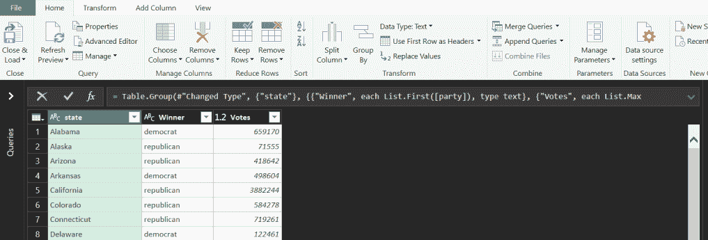

7.  点击关闭并加载。
8.  使用生成的表创建地图。选择表格中的任意单元格，然后导航至插入|推荐图表。第一个建议将是一个像我们想要的地图。
9.  单击确定。
10.  双击图例更改标题和颜色。生成的地图如下:

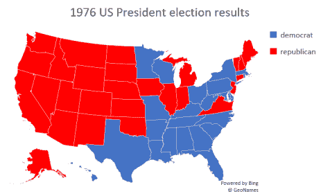

我们的第二个例子将使用来自阿根廷政府公共数据库(`datos.gob.ar`)的数据。列出了布宜诺斯艾利斯所有地铁站的纬度和经度，以及它们的名称和所属的线路。

布宜诺斯艾利斯地铁的昵称是 **Subte** ，是单词 **subterráneo(地下)**的缩写，因此得名。

常规 Excel 地图不接受地理坐标作为输入，因此我们将展示 3D 地图功能，这也有其他优点。

执行以下步骤:

1.  加载`subte.xlsx`文件，您将看到下表(部分显示):

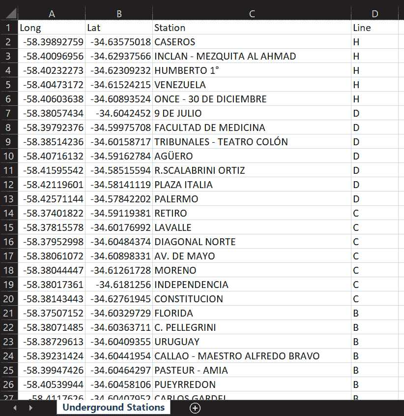

2.  选择完整的数据范围。
3.  导航至插入| 3D 地图。您应该会看到类似于以下截图的内容:

如果图标变灰，请参考 link[https://support . office . com/en-ie/article/get-started-with-3d-Maps-6b 56 a50d-3c3e-4a9e-a527-EEA 62 a 387030](https://support.office.com/en-ie/article/get-started-with-3d-maps-6b56a50d-3c3e-4a9e-a527-eea62a387030)获取激活 3D 地图的分步说明。

4.  单击新旅程，如下图所示:

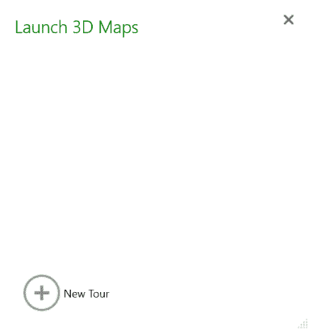

将打开 3D 地图窗口，显示地球的默认视图，如以下屏幕截图所示:

5.  在位置窗口中添加两个字段:`Long`和`Lat`。它们应该被自动分配给相应的变量。如果没有，请从名称右侧的菜单中选择它们(参见下面的屏幕截图)。
6.  地图现在应该以布宜诺斯艾利斯市为中心，但缩放比例可能仍然太大。
7.  用鼠标滚动或使用+按钮放大。
8.  在“类别”字段中，添加“线”,因为我们想要区分不同的桩号组。
9.  该地图将类似于此屏幕截图:

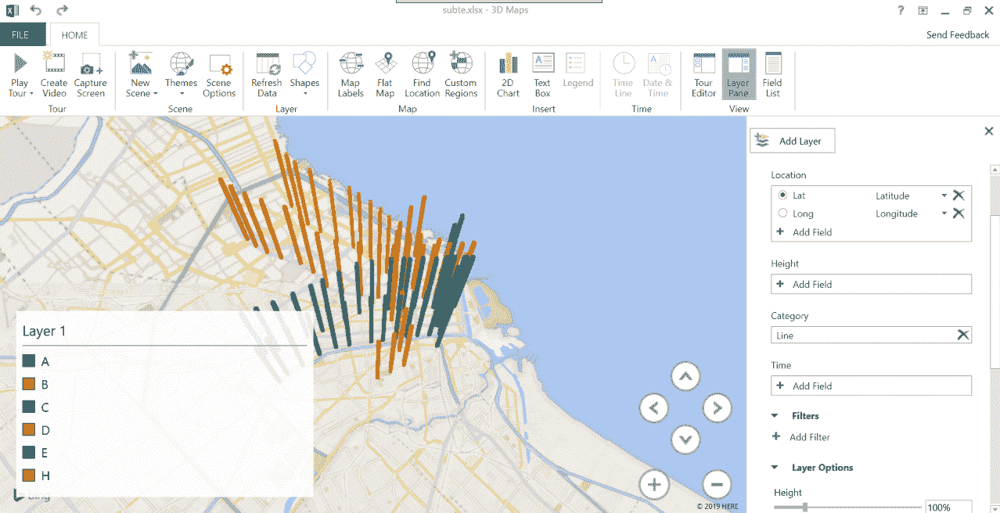

我们稍微改进一下吧。代替那些代表每个站的大柱子，我们想要小的符号。为此，请执行以下步骤:

1.  点击图层选项。
2.  将高度设置为 0%，厚度设置为 50%到 70%之间。
3.  您还可以更改每条线(类别)的颜色。和许多其他城市一样，地铁线是用颜色来标识的。a 是浅蓝色，B 是红色，C 是蓝色，D 是绿色，E 是紫色，H 是黄色(F 和 G 怎么了？他们，还有我，都还没建好)。最终结果如以下截图所示:

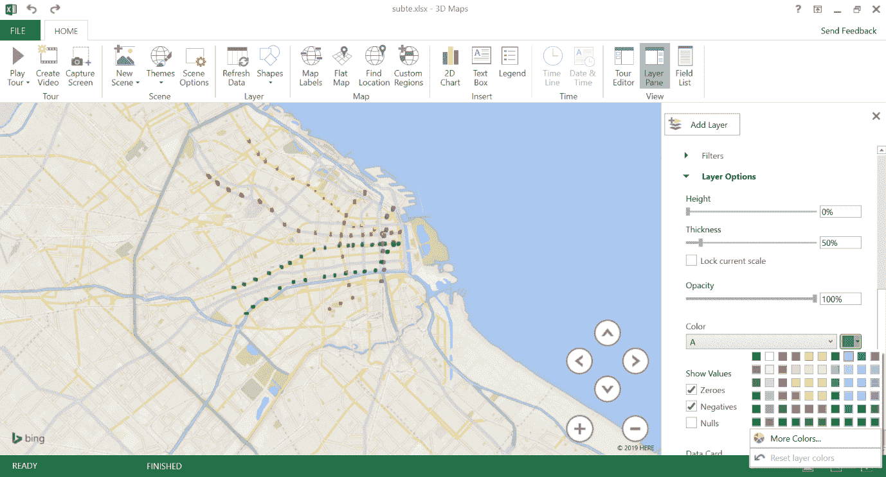

由于 3D 地图可以交互使用，我们可以做的最后一件事是向数据卡(或工具提示，通常在可视化中称为工具提示)添加有用的信息。为此，请执行以下步骤:

1.  单击 Customize 按钮(在数据卡下面)，您可以看到，默认情况下，目前包含的三个变量都在这里(参见下面的示例截图):

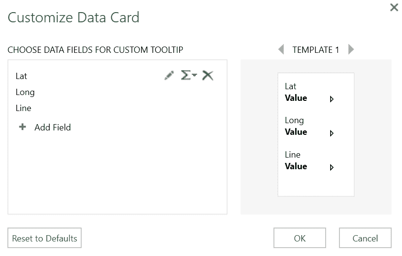

2.  点击红色的 x，删除纬度和经度。
3.  添加电台。

在此之后，如果我们将鼠标移动到代表地铁站的任何符号上，我们将看到它的名称和它所属的线路，如下面的屏幕截图所示:

我们现在知道如何使用 Excel 来有效地表示地理数据，使用地名或 GPS 坐标。

在我们的最后一个例子中，我们将再次讨论时间序列，以展示表示它们的不同方式。

# 显示随时间变化的数据

在前几章中，我们详细分析了时间序列。我们主要使用折线图来表示数据的演变。时间演化可以用不同的方式来表示吗？我们从经验中知道，当我们想要比较两个值时，线可能会产生误导，其他方法更好。

回到美国选举数据，假设我们想比较一个州的两大政党民主党和共和党在几年内的时间演变。执行以下步骤:

1.  在 Excel 中加载`1976_2016USpresident.xlsx`文件，你会看到我们在上一节中使用的表格中的相同信息，只是我们现在可以看到从 1976 年到 2016 年每个州的每次选举对应的结果。
2.  随机选择一个州(在我们的例子中是加利福尼亚),试着比较每个政党的票数如何随时间变化。
3.  导航到数据|来自表/区域。
4.  在超级查询窗口中，单击选择列。
5.  只选择我们感兴趣的列:`year`、`state`、`party`、`candidatevotes`、`totalvotes`，如下截图所示:

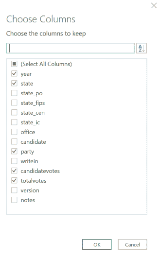

6.  通过单击添加列|自定义列来添加一个新列，以计算政党的投票百分比，即*【候选人投票数】/【总投票数】*。
7.  将该列的类型更改为百分比(在主页|数据类型中)。结果类似于下面的屏幕截图:

8.  过滤这些行，只留下作为`California`的`state`和作为`republican`或`democrat`的`party`。

我们需要以一种有意义的方式来比较这两个时间序列。为此，请执行以下步骤:

1.  选择`party`栏。
2.  导航到变换。
3.  单击透视列。在单击“确定”之前，弹出窗口应该类似于下面的屏幕截图:

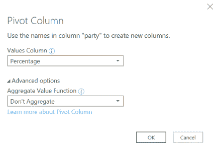

结果如下表所示:

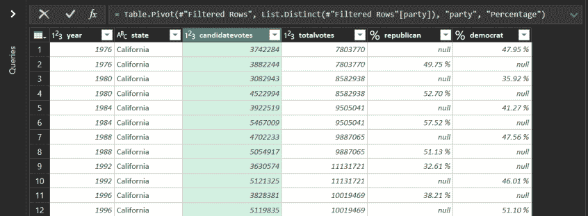

我们现在将重复一些我们以前使用过的步骤，所以我将快速解释一下:

1.  选择两个`%`列。
2.  导航到转换|替换值。
3.  将所有`nulls`更改为零。
4.  使用主页|分组依据按州分组。
5.  选择 Sum 作为汇总。
6.  最后一步是创建另一列来说明民主党和共和党的投票百分比与总数之间的差异:

*100%- %共和党- %民主党*

这将告诉我们其他党派的投票比例。我们将用于创建图表的表格如下:

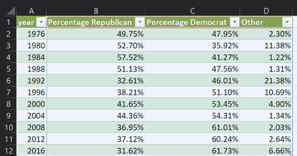

7.  单击图表中的任意单元格。
8.  导航到插入|推荐图表。
9.  选择堆积条形图。

结果将类似于下图:

很明显，这种类型的图表更适合于比较每个政党获得的票数和其他数据细节。例如，我们立即看到，在 1992 年，两党，但尤其是共和党，失去了其他非传统政党的选票。

提示:在谷歌搜索`Ross Perot`。

我们已经展示了除了折线图之外，还有其他方法来显示时间序列中包含的信息。现在，根据您需要显示的信息，您可以尝试其他类型的图表。

# 摘要

我们已经讨论了 Excel 中不同类型的图表，这些图表可用于比较变量并以有意义的方式显示数据，帮助我们从结果中提取价值。

我们现在可以回到纯粹的机器学习模型，并向前跃进到神经网络的高级世界。

# 问题

1.  图表中可以表示哪些类型的数据？列一个清单，考虑在每种情况下使用的最佳图表。
2.  当您尝试使用饼图显示五个或六个以上的数据系列时，会发生什么情况？
3.  哪种类型的图表是堆积条形图的良好替代品？
4.  尝试使用其他地理数据(例如，街道地址)来创建图表。
5.  可以用美国总统选举数据预测 2020 年的结果吗？原则上，预测时间序列的值应该是可能的。试试看，想想预测的准确性和可能的解释。

# 进一步阅读

*   *量化信息的可视化显示*，作者 Edward R.Tufte
*   Cole Nussbaumer Knaflic 著*用数据讲故事:商务人士数据可视化指南***