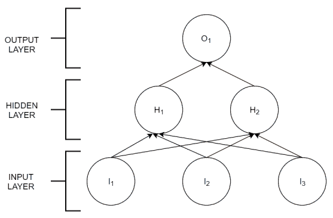
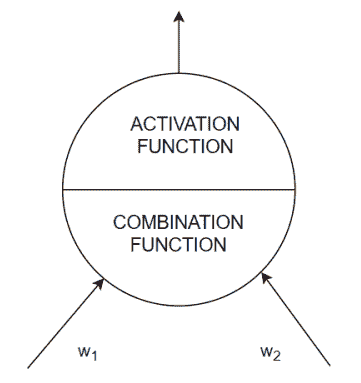
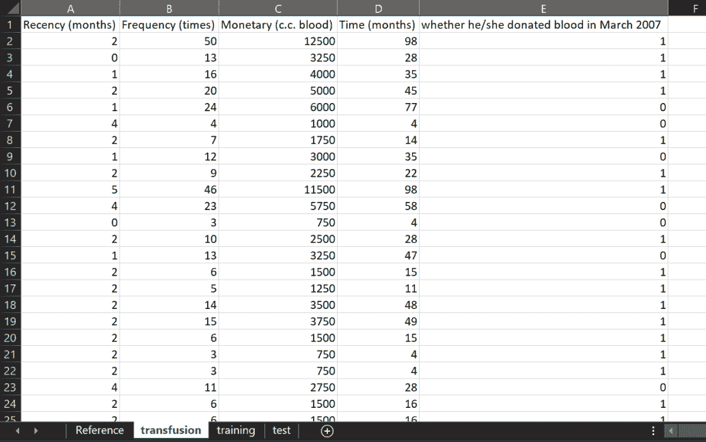
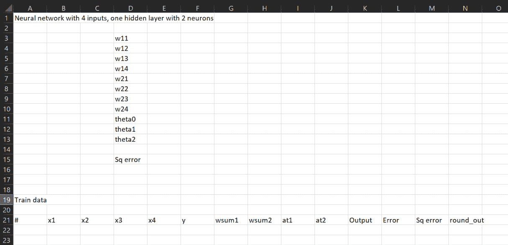
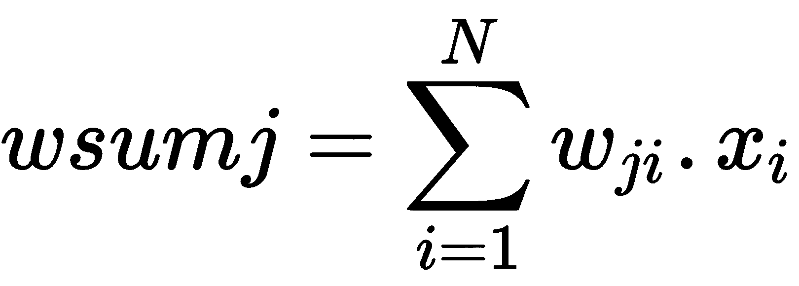
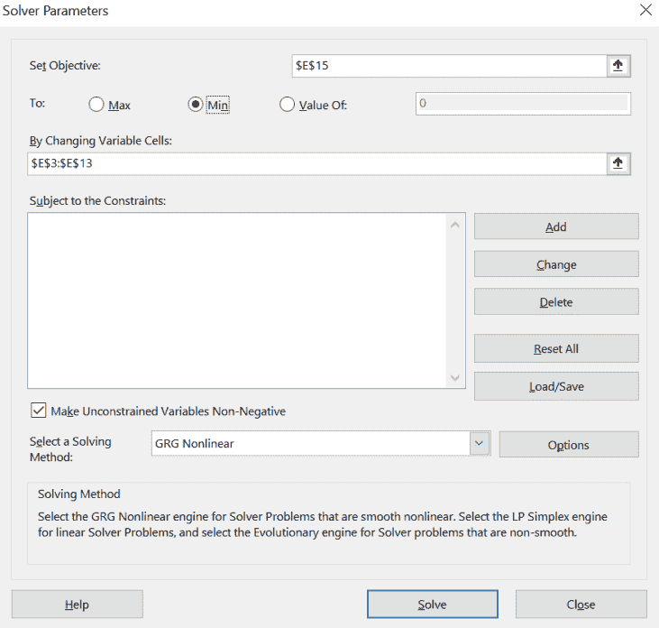
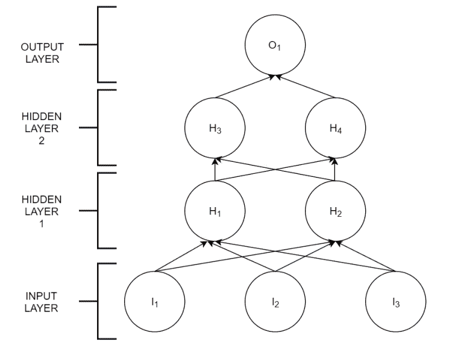
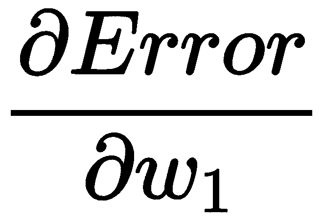
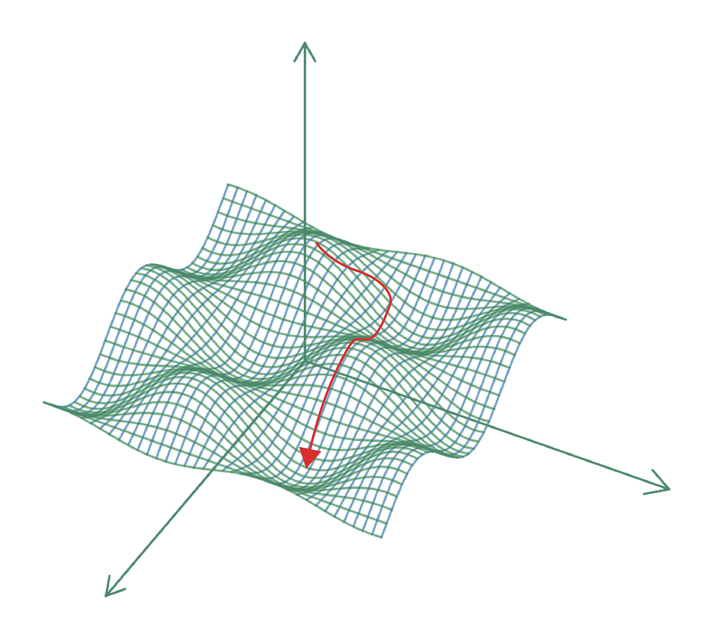

# 十三、人工神经网络

人工神经网络试图模仿人脑的工作方式。它们被用来解决一些困难的问题，例如理解书面或口头语言，识别图像中的物体，或驾驶汽车。

您将学习人工神经网络如何工作的基础知识，了解训练它所需的步骤和数学计算，并对复杂的神经网络有一个大致的了解。

本章将涵盖以下主题:

*   介绍感知器——最简单的神经网络
*   构建深度网络
*   了解反向传播算法

# 技术要求

要完成本章，您需要从位于[https://GitHub . com/packt publishing/Hands-On-Machine-Learning-with-Microsoft-Excel-2019/tree/master/chapter 09](https://github.com/PacktPublishing/Hands-On-Machine-Learning-with-Microsoft-Excel-2019/tree/master/Chapter09)[的 GitHub 资源库下载`transfusion.xlsx`文件。](https://github.com/PacktPublishing/Hands-On-Machine-Learning-with-Microsoft-Excel-2019/tree/master/Chapter09)

# 介绍感知器——最简单的神经网络

神经网络的灵感来自人脑，更具体地说，来自组成它的神经元细胞。事实上，自从第一个人工神经元被设计出来后，神经科学已经有了很大的进步，可以说它们是受到了几年前对大脑的了解的启发。

感知器是建立人工神经网络的第一次尝试(弗兰克·罗森布拉特，1959)。它实际上是一个单个神经元的模型，有多个输入和一个输出。输出值计算为输入值的加权和，这些权重迭代调整。这种简单的实现有许多缺点和限制，所以它后来被多层感知器所取代。这种人工神经网络的最基本模型具有下图所示的结构:

输入和输出层取自感知器，但现在添加了一个隐藏的节点层。这一层中的每个节点实际上充当一个神经元。为了理解每个神经元的输入和输出是如何工作的，以及信息是如何通过网络发送的，我们需要知道每个神经元是如何构建的细节。人工神经元的示意图可以表示如下:

组合函数将结果输入计算为 w [i] 加权的输入之和。激活功能使用该输入计算输出。输出范围通常限制在[0；1]，使用不同的功能。通常情况下，只有当输入值高于某个阈值时，神经元才传输信号。

人工神经网络是如何学习的？使用输出已知的训练数据集。将输入值输入网络，将预测输出与实际输出进行比较，并在每一步迭代调整 w [i] 权重。这意味着神经网络是一个监督学习模型。

问题越复杂，调整权重所需的训练样本数量就越大。我们还将看到，隐藏层和神经元的数量也根据问题进行调整。微调这些参数是一个复杂的问题，几乎本身就是一个研究领域。

人工神经网络是有用的，因为它们可以模拟任何数学函数。因此，即使输入值之间的关系未知，我们也可以使用网络来重现它并进行预测。

由于训练过程可能很复杂，并且在训练时调整的参数数量很大，因此通常很难理解为什么人工神经网络能够正确预测给定值。基于神经网络的人工智能模型的可解释性也是一个广泛研究的问题。

神经网络的一些应用如下:

*   图像分析—面部、物体、颜色、表情和手势
*   声音分析—声音、语音转文本和情感
*   文本分类—垃圾邮件、文档内容中的欺诈和情感
*   硬件故障—预测和/或诊断
*   健康风险和/或诊断
*   客户或员工流失

让我们通过一个例子来看看训练在实践中是如何工作的。

# 训练神经网络

我们将使用来自台湾新竹市输血服务中心的公共数据集(由 Yeh，I-Cheng，Yang，King-Jang 和 Ting，Tao-Ming 著，*使用伯努利序列对 RFM 模型的知识发现*，专家系统与应用，2008)。该集合包含献血者的信息，概括为五个变量:

*   r(最近——自上次捐赠以来的月数)
*   f(频率——捐赠总数)
*   m(货币——捐献的血液总量，单位:毫升)
*   t(时间-自首次捐赠后的月数)
*   代表他们是否在 2007 年 3 月献血的二元变量(1 代表献血；零代表不献血)

我们希望证明人工神经网络可以从前面的前四个特征中学习到多好，并预测目标变量五。按照以下步骤重现并学习已经在`transfusion.xlsx`文件中显示的计算:

1.  将`transfusion.xlsx`文件加载到 Excel 中。

2.  在名为`transfusion` *，*的工作表中你会找到输入的数据。它应该类似于下面的截图:

3.  由于数据没有任何特定的顺序，我们可以使用前 500 个条目来训练神经网络。打开一个新的工作表，并将其重命名为`training1`(请记住，我们正在重复这些步骤来创建文件中已经存在的工作表，以便您可以比较您的结果)。

4.  创建一组变量，如下图所示。如果您使用相同的单元格，则更容易执行以下步骤:

如果我们建立一个具有四个输入(输入数据中的四个特征)和一个包含两个神经元的隐含层的人工神经网络，我们需要八个权重参数:隐含神经元 1 的`w[11]`、`w[12]`、`w[13]`和`w[14]`，隐含神经元 2 的`w[2][1]`、`w[21]`、`w[23]`和`w[24]`。其余参数将在后面解释。

5.  从名为`transfusion`、*、*的工作表中复制第 500 个数据行(不包括表头)。
6.  在`training1`工作表中，单击单元格 *B22。*
7.  粘贴复制的单元格。
8.  您现在有一个包含输入值的表，称为 x [1] ，x [2] ，x [3] ，[和] x [4] ，加上输出二进制值 y。表中的列 *#* 仅显示行号。

隐藏神经元 *j* 的组合函数是输入的加权和，如下式所示:

在我们的例子中， *N=4* ，这给出了下面两个表达式:

9.  考虑到这些表达式，在单元格 *G22* 中写出以下公式:

*= $ E $ 3 * B22+$ E $ 4 * C22+$ E $ 5 * D22+$ E $ 6 * E22*

在单元格 *H22* 中，写下以下内容:

*= $ E $ 7 * B22+$ E $ 8 * C22+$ E $ 9 * D22+$ E $ 10 * E22*

10.  将这些表达式向下复制到 G 列和 h 列的其余单元格中。最简单且最常用的激活函数是以下 sigmoid 函数:

在我们的例子中，x 是为每个隐藏神经元和用于训练的每个条目计算的组合函数:

11.  定义单元格 I22 为 *=1/(1+EXP(-G22))* ，单元格 J22 为 *=1/(1+EXP(-H22))。*
12.  将这些公式向下复制到 I 列和 j 列的其余行。最后的计算是神经网络输出，它是隐藏神经元输出的加权和，加上一个作为阈值的常数值；如果总输入小于该值，则输出为零，网络不会激活。这可以用下面的公式来表示:

13.  然后，您可以在单元格 *K22* 中写入以下内容:

*= $ E $ 11+$ E $ 12 * I22+$ E $ 13 * J22*

14.  将公式复制到 k 列的其余单元格中。因为 *E11* 、 *E12* 和 *E13* 分别是我们为θ1、θ2 和θ3 保存的单元格。我们在计算中使用所有定义的权重和参数，但是我们没有它们的值。训练神经网络意味着找到使输出尽可能接近目标值的这些参数的值，例如，对于 *x [1]* 、 *x* *、 2* 、 *x [3]* 和 *x [4]* 的每个组合，*输出*的值与我们需要计算三个值:输出误差(Output-y)、平方误差(Error ² )和平方误差之和，这是要最小化的值。

我们正在最小化的函数，误差平方和，只是一个可能的**损失函数** *。*还有其他函数用于比较神经网络的输出和训练值。研究何时应用每个函数在更高级的机器学习书籍中有所展示。

15.  定义单元格 L22 为 *=K22-F22。*
16.  将公式向下复制到 l 列的其余行。
17.  将单元格 M22 定义为 *=L22^2* 。
18.  将公式向下复制到 m 列的其余行。
19.  定义单元格 E15 为 *=SUM(M22:M521)。*这是误差平方和。

我们现在可以使用 Excel 的求解器将值设置为 w [11] 、w [12] 、w [13] 、w [14] 、w [2] 、w[1]、w [21] 、w [23] 、w [24] 、θ [o] 、θ [1 【T21]

1.  导航到数据。
2.  单击规划求解。

3.  如下面的截图所示，填写详细信息:

目标是 E15，在这里我们存储误差平方和，以及可变单元格 E3 到 E13。

4.  点击求解。
5.  最佳结果如下表所示:

| **参数** | **值** |
| w11 | -3.915205816 |
| w12 | 0.055009315 |
| w13 | 0.016855755 |
| w14 | -0.301397506 |
| w21 | -0.016701972 |
| w22 | 0.451221978 |
| w23 | -0.001645853 |
| w24 | -0.011395209 |
| theta0 | -0.349977457 |
| theta1 | 0.247932886 |
| θ2 | 1.256803829 |
| **平方误差** | 77.02669809 |

根据规划求解中使用的回归类型和初始值，结果可能会有所不同。梯度下降算法搜索(在*理解反向传播算法*一节中解释)可能陷入局部最小值，该值大于全局最小值。

6.  将单元格 N22 定义为 *=round(K22)* 以将神经网络的输出转换为二进制值。
7.  比较预测值和线性值，您可以构建混淆矩阵:

|  |  | 真实的 |  |
|  |  | one | Zero |
| 预测 | one | Thirty-two | Twenty-two |
|  | Zero | Eighty-six | Three hundred and sixty |

使用混淆矩阵来衡量神经网络训练的准确性。

# 测试神经网络

一旦您对训练感到满意，您就可以使用获得的参数值来**预测**其余数据的 y 值(这在训练中从未使用过，然后可以用于测试网络输出)。

按照以下步骤使用测试数据集预测目标变量:

1.  复制名为`training1`的工作表。将新工作表命名为`test1`。
2.  删除单元格区域 *B22:F521。*
3.  从单元格 B22 开始，将名为`transfusion`的工作表中的最后 248 行复制到新工作表中。
4.  所有的计算都应该工作，并且您应该能够看到使用测试数据作为输入的结果。

我们现在已经开发了一个简单的练习，展示了人工神经网络如何从输入数据中学习。我们所做的计算是**反向传播**算法的基础，这将在本章的最后一节详细解释。

# 构建深度网络

我们的人工神经网络的例子非常简单，只包含一个隐藏层。我们能增加更多的层吗？我们当然可以！复杂性的下一步可能类似于下图:

我们添加了一个新的隐藏层，有两个神经元，但我们可以添加更多的层和每层更多的神经元。网络的架构取决于我们赋予它的特定用途。多层人工神经网络通常被称为**深度神经网络** *。*

深层网络的输出计算类似于单层网络，考虑到每个神经元的所有输入、激活函数以及输出神经元的所有输入的相加。从上图可以清楚地看出，网络中的每一层都受到前一层的影响。通常情况下，为了解决复杂的问题，每一层都学习一组特定的特征。例如，在识别图像时，第一层可以训练颜色，第二层训练形状，第三层训练对象，依此类推，随着我们向输出前进，复杂性会增加。

随着我们向网络中添加更多的神经元，我们需要调整更多的参数。这在实践中的实现方式将在下面描述反向传播算法的部分中变得清楚。

# 了解反向传播算法

深度神经网络的训练过程有两个阶段:前向和反向传播。我们已经详细了解了前进阶段:

1.  计算输入的加权和:

2.  将激活函数应用于结果:

在本章末尾的建议阅读中找到不同的激活函数。sigmoid 函数是最常见的，也更容易使用，但不是唯一的函数。

3.  通过将最后一层(N 个神经元)的所有结果相加来计算输出:

在正向阶段之后，我们将误差计算为输出与已知目标值之间的差值:*误差=(输出-y) ² 。*

在前向阶段开始时，所有权重都被分配了随机值。

输出以及误差是权重*w[I]和*θ[I]的函数。这意味着我们可以从误差中回溯，看看每个重量的微小变化是如何影响结果的。这用数学术语表示为导数或梯度:**

每当我们稍微改变 w [1] 时，这个等式测量误差的变化。我们实际上在每个神经元内部应用了一个激活函数，因此误差的变化转化为以下等式(称为链式法则):

我们希望在减小误差的方向上改变所有的权重值。这就是优化方法被称为**梯度下降**的原因。如果我们把误差想象成两个权重的函数(当然不止两个，但是我们人类很难超越三维去思考！)，我们可以将这种优化描述如下:

什么时候调整重量？有三种方法:

*   **在线**:对于每个新的训练样本，所有权重都要重新计算。这非常耗时，如果数据集有太多异常值，可能会导致问题。
*   **Batch** :计算整个训练数据集的权重，计算累积误差，并用其进行修正。
*   **随机**:批量模式用于获取训练数据的小样本。这加快了整个过程，并使该方法对局部最优值更具鲁棒性。

我们现在已经熟悉了人工神经网络是如何构建的，以及它们的输出是如何计算的。随着网络规模的增长，执行这些计算通常是不切实际的，这在所有实际和有用的实现中经常发生。

# 摘要

我们已经研究了人工神经网络如何构建以及它们如何从输入数据中学习的基本原理。即使在实践中，使用神经网络的实际方法与我们在示例中所做的不同，我们的方法对于理解细节和超越神经网络是神奇地解决问题的神秘黑盒的想法是有用的。

在下一章中，我们将看到如何使用 Azure 中可用的预建机器学习模型，将它们连接到 Excel 来解决我们到目前为止提出的问题。

# 问题

1.  使用感知器测试的结果，构建混淆矩阵并评估预测的质量。
2.  我们用人工神经网络解决的二元分类问题中缺少一个重要步骤，如果我们实现它，可能会改善结果。我们错过了什么？提示:建立一个二进制变量的直方图，指示 2007 年 3 月是否有献血。

# 进一步阅读

*   *神经网络简介*作者大卫·克里塞尔*，*可在[网上查阅 http://www . dkriesel . com/_ media/science/neuronalenetze-en-zeta 2-1 col-dkrieselcom . pdf](http://www.dkriesel.com/_media/science/neuronalenetze-en-zeta2-1col-dkrieselcom.pdf)
*   *神经网络和深度学习*作者迈克尔·a·尼尔森*，*可在 http://neuralnetworksanddeeplearning.com/[在线获得](http://neuralnetworksanddeeplearning.com/)
*   *Deep Learning: Using Algorithms to Make Machines Think*, [https://opensourceforu.com/2017/12/deep-learning-using-algorithms-to-make-machines-think/](https://opensourceforu.com/2017/12/deep-learning-using-algorithms-to-make-machines-think/)