# 十四、Azure 和 Excel——云中的机器学习

如今，一个明显的趋势是将所有的分析、存储和可视化活动转移到云中。在这一章中，你会找到关于如何使用 Azure 服务的信息，并获得免费订阅来测试它们。深度学习似乎是通向通用人工智能的道路，即能够像人类一样思考的机器。我们甚至还没有接近这一点，但人工神经网络被用于计算机视觉，文本和语音分析，以及许多其他高级应用。有许多人工智能的用例是在 Azure 内部预先构建的，可以通过构建一个实验来使用，如本章中详细所示。

本章将涵盖以下主题:

*   Azure 云简介
*   免费使用 Azure ML Studio——一步一步的指南
*   将您的数据加载到 Azure Machine Learning Studio
*   在 Azure Machine Learning Studio 中创建和运行实验

# 技术要求

要完成本章，您需要一个 Microsoft 帐户。如果你没有，你可以在[https://signup.live.com/](https://signup.live.com/)免费得到一个。

您还需要从 GitHub 资源库下载`titanic_small.csv`文件，网址为[https://GitHub . com/packt publishing/Hands-On-Machine-Learning-with-Microsoft-Excel-2019/tree/master/chapter 10](https://github.com/PacktPublishing/Hands-On-Machine-Learning-with-Microsoft-Excel-2019/tree/master/Chapter10)。

# Azure 云简介

云计算是计算机系统资源的按需可用性，尤其是数据存储和计算能力，而无需用户的直接主动管理。该术语通常用于描述许多用户通过互联网使用的数据中心。以下是使用云而不是本地计算机的一些优势:

*   **成本**:云模式不需要购买和维护昂贵的硬件和软件，而是提供按需付费。
*   **速度**:一般几分钟就可以获得大量的资源，只需要在一个网站中配置一些设置。
*   **全局规模**:资源的大小和位置可以根据用户需求动态变化。
*   **生产力** : IT 员工可以节省时间，专注于有助于业务发展的任务，而不是亲自维护本地设备。
*   **性能**:云服务器经常升级，提供最新的可用技术。
*   **安全性**:尽管人们通常担心在云中存储和移动敏感数据，但大多数提供商都有足够的政策来保护用户的数据。

在写这本书的时候，最重要的云提供商是 AWS、MS-Azure 和 GCP。我们将重点关注 Azure，并描述一些与使用机器学习进行数据分析相关的服务。

像所有的云提供商一样，微软在 Azure 中包含了所有类型的服务。我们的兴趣将主要集中在 **Azure ML Studio** ( **AMLS** )，它旨在轻松创建和测试机器学习项目和实验。

# 免费使用 AMLS——一步一步的指南

微软 AMLS 是一个提供拖放界面的工具，用于构建、测试和部署机器学习模型和分析解决方案。可以将模型发布为可以从 Excel(以及其他工具)中使用的 web 服务。

我们将首先使用您的 Microsoft 帐户在 AMLS 主页注册:

1.  打开[https://studio.azureml.net/](https://studio.azureml.net/)。您将看到以下首页:

2.  点击此处注册，您将进入下一页:

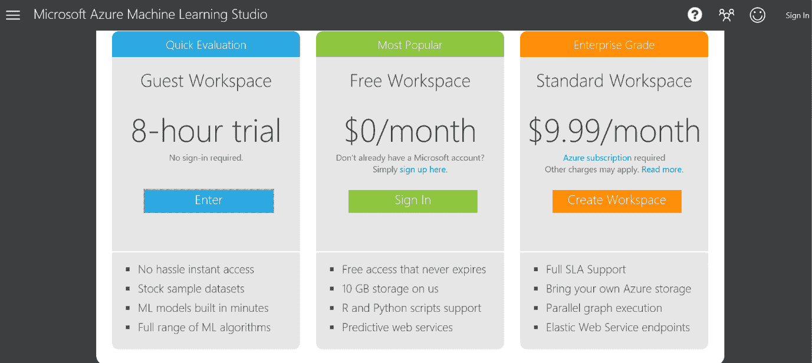

3.  选择第二个选项(即免费工作区)，这要求您拥有 Microsoft 帐户。好处是这个选项是免费的，你可以无限制的使用。单击自由工作区选项后，您将进入以下登录屏幕:

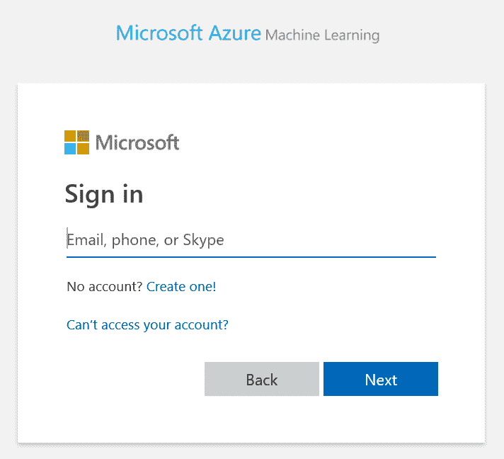

4.  输入您创建 Microsoft 帐户时选择的用户名，然后单击“下一步”。然后，您将看到密码输入屏幕:

5.  键入您的 Microsoft 帐户的密码，然后单击登录。
6.  您将被带到 AMLS 主页:

现在您已经准备好开始了，我们将介绍如何将您的数据集加载到 ALMS 中。

# 将您的数据加载到 AMLS

没有数据就没有机器学习项目，所以我们分析的第一步是将输入文件(`titanic_small.csv`)加载到 AMLS 中。这是 Titanic 数据集的简化版本，包含三个特征和一个目标变量:

*   特点:
    *   **pclass** :乘客乘坐的等级(值 1、2 或 3 对应于一等、二等和三等)
    *   **性别**:乘客的性别(女性或男性)
    *   **年龄组**:婴儿、儿童、青少年、成人、老年人或未知
*   目标变量:
    *   **幸存** : 1 如果乘客在海难中幸存，0 如果没有。

要加载文件，请按照下列步骤操作:

1.  在主页上，单击数据集。您将看到数据集的空列表:

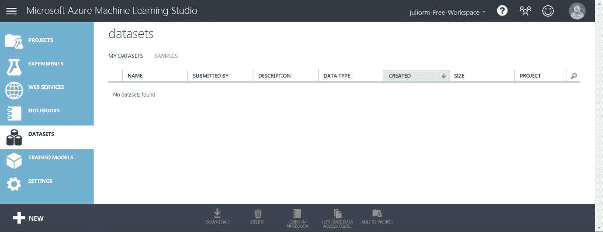

2.  点击+NEW，获取上传本地数据文件的链接:

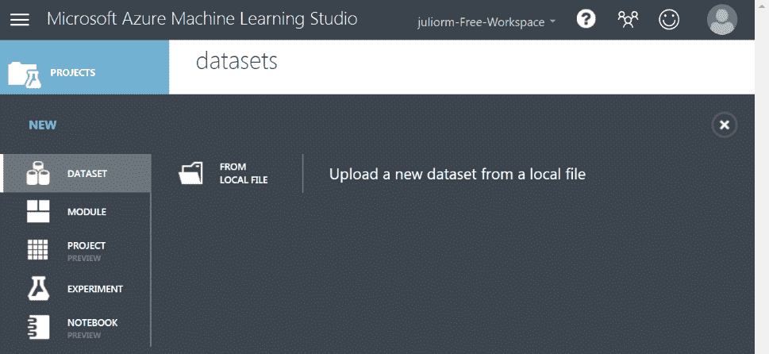

3.  单击从本地文件，您将看到以下对话框:

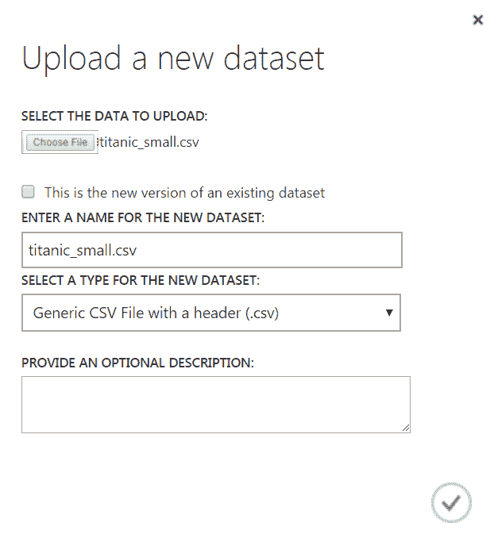

4.  点击选择文件并导航至计算机中的输入文件(`titanic_small.csv`)位置。
5.  在相应字段中输入数据集的任意名称。
6.  选择文件的类型，在这种情况下是带有头文件的通用 CSV 文件。csv)。
7.  或者，描述数据集的内容以供将来参考。
8.  单击确定。

9.  您将在列表中看到您最近上传的数据集:

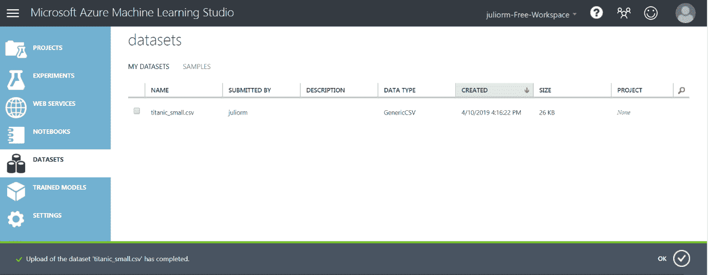

现在，您已经拥有了在 AMLS 开始构建第一个实验所需的一切。我们将在下一节中一起完成。

# 在 AMLS 创建和运行一个实验

AMLS 的基本组成部分是实验。它们是通过将预定义的模块拖放到工作区中来构建的。每个模块都有一些定义好的任务、运行时可以选择的给定数量的参数，以及定义好数量的输入和输出节点。以下是 AMLS 模块的屏幕截图:

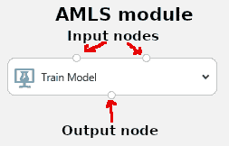

它们可以连接起来建立一个分析工作流，从数据输入和转换到机器学习模型训练和结果。我们将一步一步地创建一个机器学习实验，训练一个决策树来预测泰坦尼克号乘客的存活率。

# 创造新的实验

执行以下步骤创建新环境:

1.  从主页中，选择实验。您将看到空的实验列表:

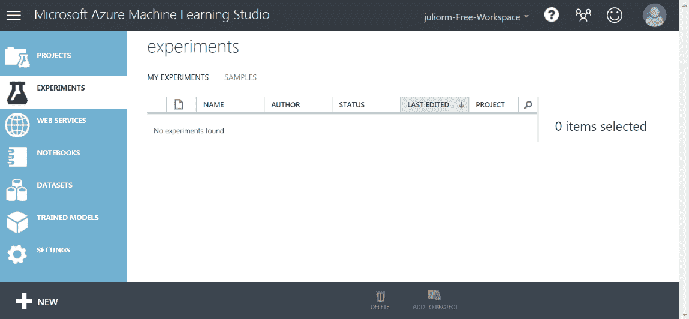

2.  单击+NEW 创建一个新实验。您将看到可以从 Azure 目录加载的可用实验列表:

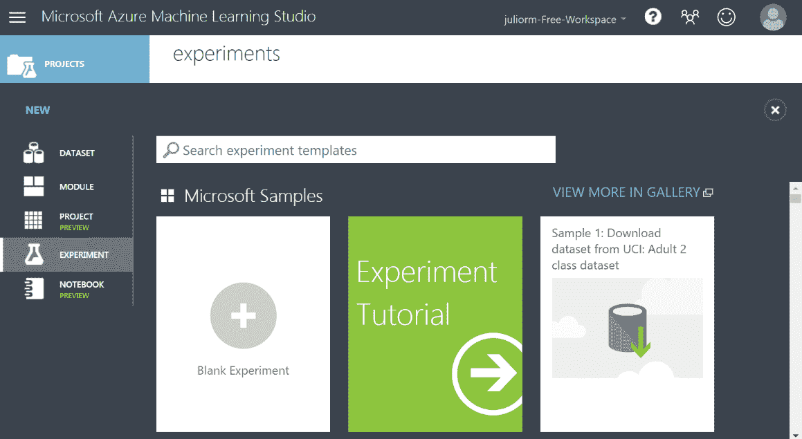

3.  单击空白实验创建一个空实验。下面的屏幕截图显示了在开始添加模块之前，实验的情况:

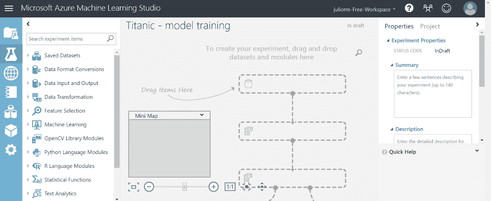

左边部分是模块目录，按功能分组。中间(灰色)区域是工作区，我们将在这里放下模块，右边部分显示了实验摘要。在工作区的左上角，您可以看到实验名称。你可以点击它并编辑文本。在我们的例子中，文本被编辑以显示泰坦尼克号-模型训练。

一旦你熟悉了 AMLS，探索目录中的实验。它们很好地展示了 AMLS 可以提供的功能以及您可以用它解决的问题类型。

这个第一个实验将仅使用输入数据来训练决策树，并使其准备好在稍后的另一个实验中使用，该实验将是预测乘客生存的实验。我们将实验分成两部分，因为我们只想训练树一次，以后再用它进行预测。我们将在下一节展示训练决策树模型的逐步指南。

# 训练决策树模型

1.  在模块目录中，转到保存的数据集|我的数据集，将“titanic_small.csv”拖到包含我们输入数据的右侧工作空间模块中。它包含以前从文件中读取的数据。放下数据模块后，您应该会看到类似下面的屏幕截图:

将模块拖放到工作区后，单击它会在屏幕的右侧显示有关它的信息。

2.  拖放另外两个模块，它们代表我们将要训练的决策树和一个通用训练模块。第一个位于机器学习|初始化模型|分类|两类提升决策树。第二个位于机器学习|训练|训练模型。
3.  一旦所有模块都被放入工作区，您需要连接它们来构建数据流。要连接两个模块，请执行以下操作:
    1.  单击第一个模块的输出节点。
    2.  按住鼠标键，将指针移动到第二个模块的输入节点。
    3.  释放鼠标按钮。您应该会看到连接两个模块的曲线。
4.  最终的连接模块集应该类似于下面的屏幕截图:

您需要在标有 Train Model 的模块中选择目标变量。为此，请执行以下步骤:

1.  点击模块。
2.  单击右侧面板上的启动列选择器。
3.  在弹出窗口中，单击按名称。
4.  从可用列列表中，单击幸存。
5.  单击向右箭头(>)。这将使幸存的变量向右移动。您应该会看到类似于以下截图的内容:

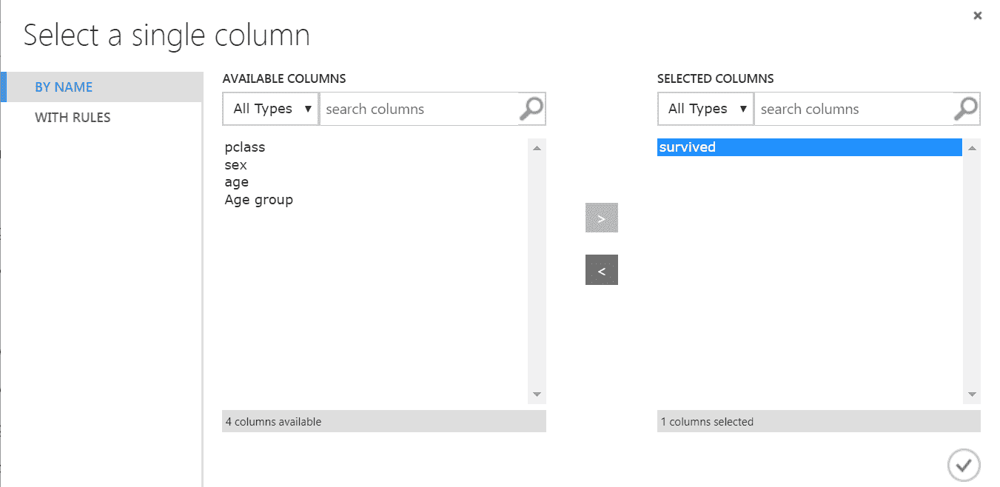

6.  在底部菜单中，单击运行:

7.  等到运行结束。应该只需要几分钟时间，您就会在所有模块上看到绿色波浪符号。

您可以将您训练的模型可视化。在这种情况下，默认为训练 100 个决策树。要查看它们的详细信息，请按照下列步骤操作:

1.  右键单击火车模型模块。
2.  导航到训练模型|可视化:

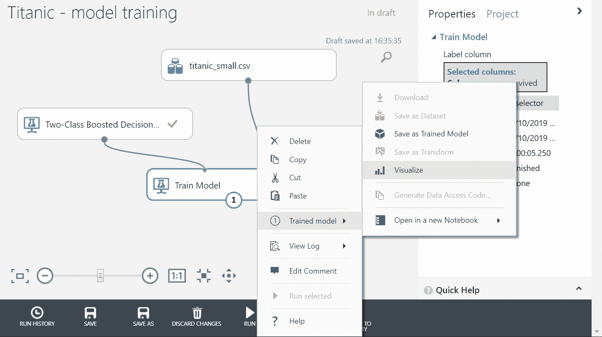

3.  选择左侧缩图中显示的任何一棵树，查看详细信息。您可以跟踪在树的每个节点上做出决策的方式，并跟踪分支值直到目标变量的最终值。以下截图说明了这一点:

4.  单击标有两类提升决策树的模块，在右侧面板显示模型参数列表。这些参数影响决策树的训练。您可以更改这些参数并再次运行实验:

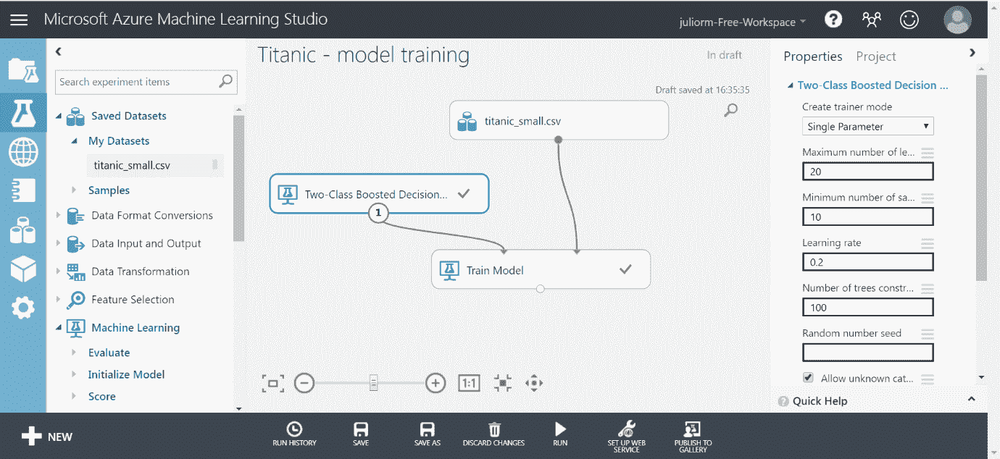

5.  单击底部菜单中的 Save 保存实验。

最后，我们将保存该模型以备将来使用，无论何时我们想要预测给定乘客的生存机会。为此，请按照下列步骤操作:

1.  右键单击火车模型模块。
2.  导航到已训练模型|另存为已训练模型:

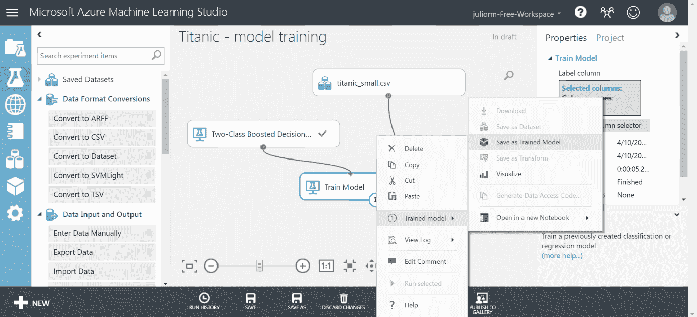

现在，该模型已使用输入数据集进行了训练，并准备在新的实验中使用。我们将在下一小节中构建这样一个实验，然后展示如何在 Excel 工作簿中使用它。

# 使用 Excel 中的模型进行预测

我们现在将使用经过训练的决策树创建一个 web 服务。Web 服务用于允许不同应用和不同来源之间的通信，并且不依赖于操作系统或特定的编程语言。然后，我们将使用 Excel 与这个 web 服务进行通信，向它发送输入数据，并接收带有生存预测值的输出数据。

如果您按照说明仔细创建了一个实验，现在您应该能够在一些一般指导下自己完成该实验，如下所示:

1.  创建一个新实验，并将其名称改为`Titanic - Web Service`。
2.  将五个模块拖放到工作区:
    *   保存的数据集|我的数据集| `titanic_small.csv`:我们加载并用于训练决策树的数据集。
    *   已训练模型|泰坦尼克模型-已训练:我们保存的已训练模型，以备将来使用。
    *   机器学习|评分|评分模型:将用于根据模型训练预测目标变量。
    *   Web 服务| Web 服务输入和 Web 服务输出:这将处理与 Excel 之间的数据通信。
3.  连接模块，使实验看起来像下面的截图:

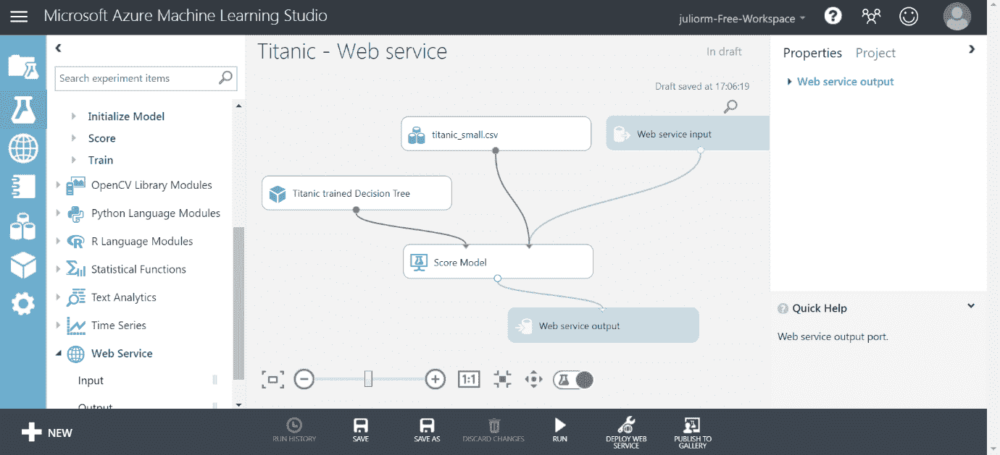

4.  保存实验并运行它。

实验中并不真正使用输入数据，因为用于预测的数据最终将从使用 web 服务的应用中发送。尽管如此，输入数据模块需要作为数据格式的引用(变量的名称和总列数)包含在内。

5.  运行成功后，单击底部菜单中的 DEPLOY WEB SERVICE。您将进入以下屏幕:

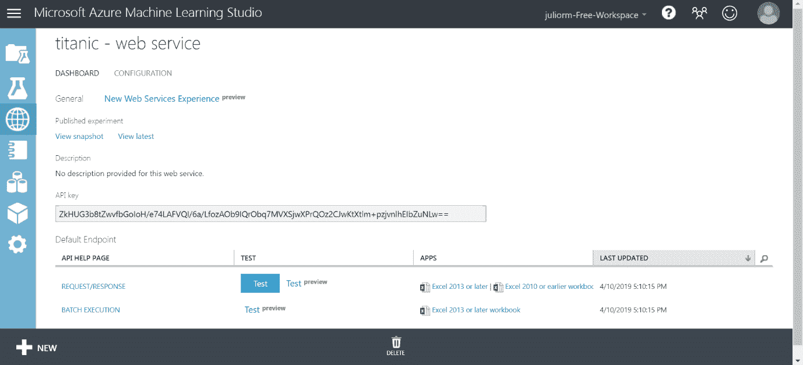

web 服务现在创建好了，AMLS 让您下载一个已经连接到它的 Excel 文件。

6.  从屏幕最后一行的链接下载文件(批处理执行、Excel 2013 或更高版本的工作簿)。
7.  打开计算机上的 Excel 文件。您应该会在工作簿的右侧看到一个菜单:

这意味着该文件已经连接到我们创建的 web 服务。

8.  点击泰坦尼克号-网络服务。您将在右侧看到数据输入菜单:

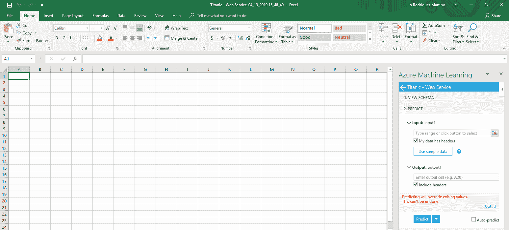

9.  单击“使用样本数据”获得几行用于预测的数据。您现在有一个类似于下面的表:

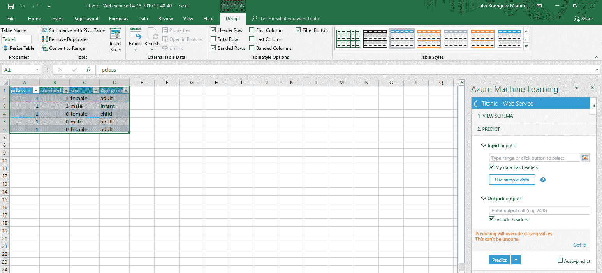

10.  在输入对话框中，写下 *A1:D6* 。
11.  在“输出”对话框中，写下希望输出数据开始的单元格的坐标。在这个例子中，我们使用了 *G1* :

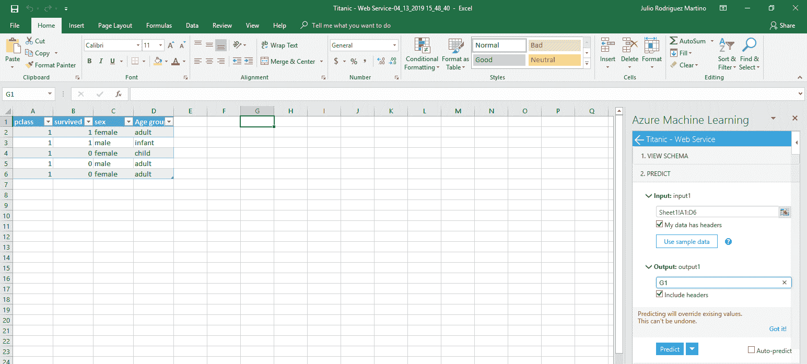

12.  点击预测。原始表加上预测值将出现在工作表中:

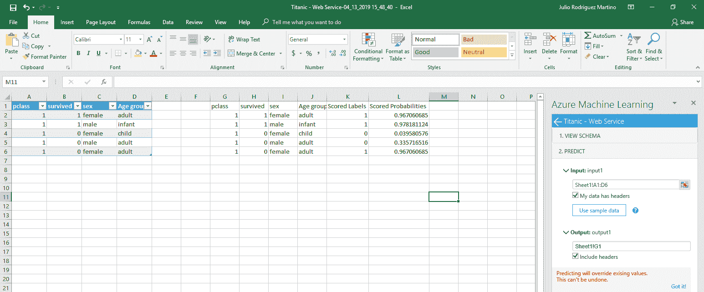

因为是目标变量，所以`survived`列中的数据不考虑在预测中。它必须符合训练数据格式。

注意五个预测值中的四个(在`Scored Labels`栏中)与用于训练的值一致。预测从来都不是完美的，这就是为什么微调模型参数和仔细研究预测误差如此重要。

您现在知道如何在 AMLS 构建一个实验，并通过 Excel 与它通信，发送和接收数据。所以，当你听到*云计算*这个词的时候，你就知道它是关于什么的了。

# 摘要

我们完成了所有必要的步骤，在 AMLS 开了一个账户，这是微软 Azure 云的一部分，帮助我们建立简单的数据和分析流程。我们还建立了两个实验:其中一个训练决策树，另一个预测目标变量。然后，我们学习了如何创建一个 web 服务并将 Excel 连接到它，发送和接收数据。

在下一章中，我们将展示机器学习的现状，它几乎完全将操作移至云，使数据流完全自动化，并使用自动化来微调预测模型。

# 问题

1.  使用云计算的主要优势是什么？
2.  云计算只对机器学习有用吗？
3.  什么是 web 服务，为什么它有用？
4.  如果模型已经定型，为什么我们需要在用于预测的分析流中包含输入数据模型？
5.  为什么我们把训练和预测分成两个不同的流程？

# 进一步阅读

查看以下资源，了解本章所涵盖主题的更多信息:

*   *了解云计算基础知识*:【https://www.lucidchart.com/blog/cloud-computing-basics 
*   *Azure ML Studio文档*:[https://docs . Microsoft . com/en-us/Azure/Machine-Learning/Studio/](https://docs.microsoft.com/en-us/azure/machine-learning/studio/)
*   *决策树浅显易懂*:[https://medium . com/@ chiragsehra 42/决策树-浅显易懂-28f23241248](https://medium.com/@chiragsehra42/decision-trees-explained-easily-28f23241248)