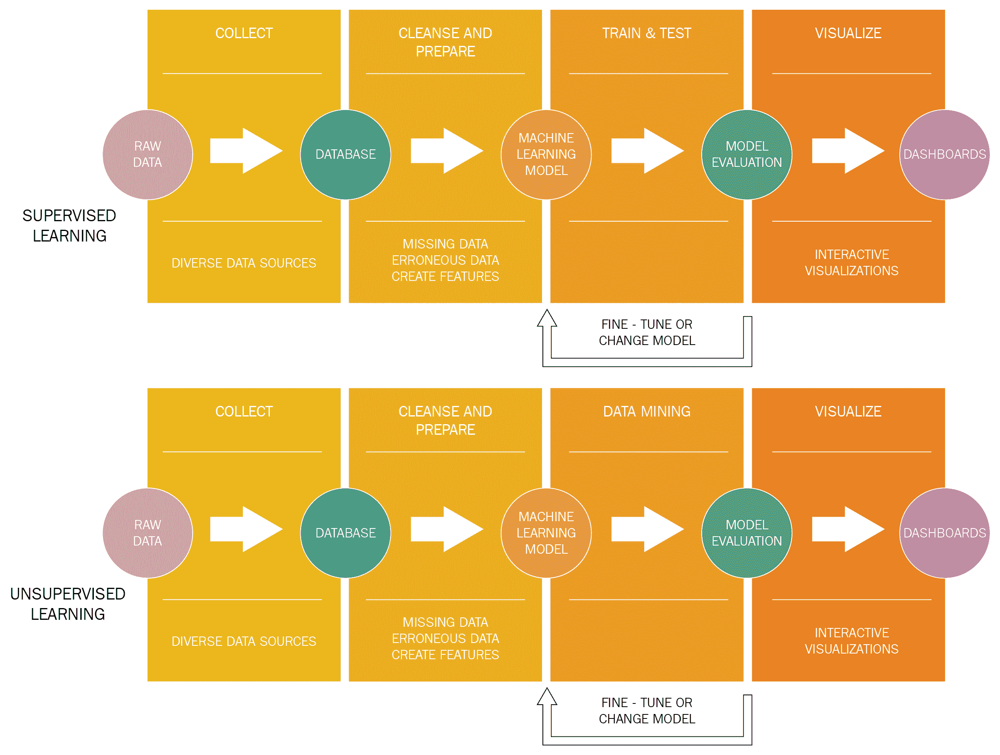
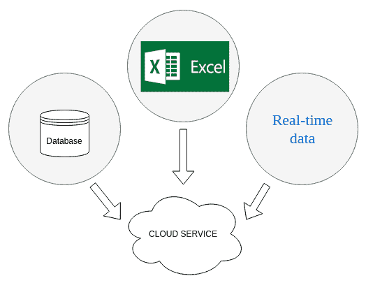
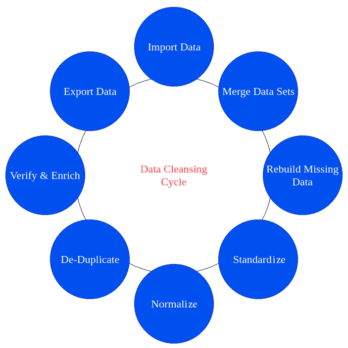
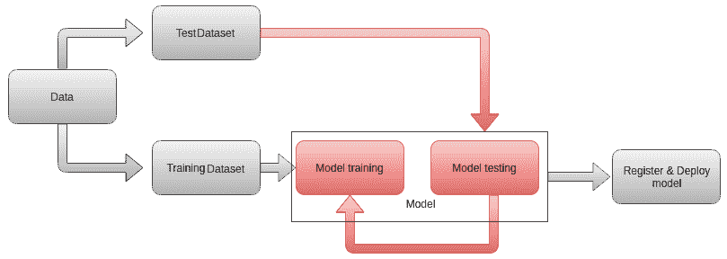
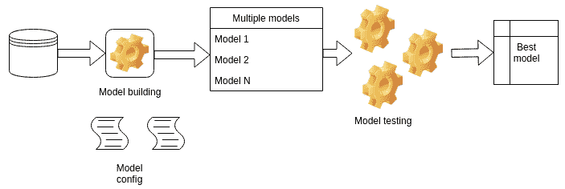

<title>The Future of Machine Learning</title> 

# 机器学习的未来

将数据分析转移到云中只是机器学习项目在过去几年中发生变化的一部分。由于将自动化、**人工智能、** ( **AI** )和机器学习添加到业务运营的许多不同部分的好处现在已经很明显，不需要进一步证明，公司现在专注于更持久的解决方案。事实上，自然的后续是思考可以完成整个数据周期的成品，从数据收集到可视化。

有许多方法可以创建数据分析流程，这些流程可以在创建数据时使用数据，并在应用机器学习模型后返回结果和可视化效果。云服务让这项任务变得更简单、更高效。

自动机器学习是数据分析的当前趋势，其中几个机器学习模型可以在同一个数据集上自动测试。优化模型参数，直到找到最佳模型。这就产生了*公民数据科学家*的概念，这是一个在大数据工具和技术的帮助下分析数据并为其公司创建数据和业务模型的角色。公民数据科学家不一定需要成为数据科学或商业智能专家。该角色授予组织中能够使用大数据工具和技术创建数据模型的员工。

本章将涵盖以下主题:

*   自动数据分析流程
*   机器学习模型的再训练
*   自动机器学习
*   未来我们能期待什么？

<title>Automatic data analysis flows</title> 

# 自动数据分析流程

在这本书问世的几年前，企业用一句话来接近机器学习:*让我们看看这东西能做什么...*铭记在心。情况不再是这样了。使用分析、机器学习模型、人工智能和高级可视化来理解、简化和预测许多不同情况的结果的价值是显而易见的。这种价值是根据节省的金钱、时间和精力来衡量的，从而导致更好、更快的业务决策。

作为我们在本书中学到的内容的总结，我们可以列出数据分析流程的不同部分:

*   数据收集，通常来自不同的来源
*   数据清理和准备，包括探索性可视化
*   选择适合我们数据的机器学习模型
*   用历史数据训练模型(如果我们在讨论监督学习的话)
*   挖掘隐藏或未知模式的数据(如果我们谈论的是无监督学习)
*   测试模型预测的准确性
*   如果结果不令人满意，微调模型参数或改变模型
*   可视化结果
*   使用新数据定期重新训练模型

以下模式说明了这些步骤:

在下面的小节中，我们将详细讨论这些步骤是如何自动化的。

<title>Data collection</title> 

# 数据收集

一旦确定了不同的数据源(本地文件和数据库)，就可以定期将数据上传到云存储服务。这通常由定期运行的流程自动完成，只需最少的人工干预。主要云服务提供商提供了许多不同的存储选项。

下图说明了这一概念:

下一步是准备将数据输入到模型中，即数据准备。

<title>Data preparation</title> 

# 数据准备

完整的数据周期如下图所示:

将数据导入云服务后，数据循环步骤如下:

1.  将数据集合并到单个表或一组连接的表中。这可能需要对数据进行一些处理，将其转换为合适的格式。
2.  通过替换丢失的值或决定丢弃不完整的条目来重建丢失的数据。
3.  标准化度量单位、小数精度和其他数据特征。
4.  规范化数据，特别是如果机器学习模型需要这样做的话。
5.  去重，即删除冗余条目。
6.  使用预定义的标准验证数据质量，并通过添加计算来丰富数据。
7.  将数据导出到下一个分析阶段，通常是机器学习模型。

所有云提供商都提供内置或第三方的数据准备解决方案。一些替代产品是 Amazon QuickSight、Azure 机器学习数据准备 SDK、Google Cloud 中的 Cloud Dataprep 以及许多其他产品。

<title>Model training</title> 

# 模特培训

监督机器学习模型的训练周期可以总结如下:

准备好的数据被分成训练集和测试集。测试结果给出了修改模型超参数和模型类型的反馈，并给出了获得良好精度所需的数据量的提示。

最后一步是部署模型使其可用(例如，作为一个 web 服务)，但是也要注册特定训练运行的所有特征。模型的类型，所有的超参数，甚至使用的数据都应该保存为元数据。

有许多预构建的模型可用于云中，还有注册和管理不同模型的方法。

<title>Unsupervised learning</title> 

# 无监督学习

每当我们不确定我们将在数据中找到什么，或者我们需要处理大量无法人工管理的条目时，我们就会使用无监督的机器学习。一般图表如下所示:

通过模型后，数据被排序，并显示可能有助于做出明智决策的模式。我们可以应用云中所有可用的模型，然后选择更适合我们知识和理解需求的模型。

<title>Visualizations</title> 

# 形象化

数据流的最后一步是**可视化**。当向非技术观众展示我们的结果时，强调我们分析的益处对于展示我们所做工作的价值至关重要。交互式仪表盘是实现这一点的常用方式，它配有高级工具，如 **Tableau** 、 **Power BI** 或 **QlikView** 。可以在以下网址找到一些例子:[https://www . clearpoint strategy . com/executive-dashboard-examples/](https://www.clearpointstrategy.com/executive-dashboard-examples/)。

每个仪表板工具既可以在线使用，也可以连接到云来显示分析结果。

<title>Re-training of machine learning models</title> 

# 机器学习模型的再训练

由于新数据随时可用，业务条件也在变化，机器学习模型需要定期重新训练。云服务提供了以最少的干预做到这一点的方法，而不需要重建数据流的任何部分。您只需要加载新数据，并指定您不是在构建新模型，而是在重新训练现有模型。完成后，模型将可以照常使用。

在本节中，我们展示了可以完全托管在云中的完整数据分析流程。这一节作为书的内容的详细总结也是有用的。下一部分概述了机器学习的真正未来，那时编码和手工工作将被减少到绝对最低限度。

<title>Automated machine learning</title> 

# 自动化机器学习

当应用机器学习模型来解决给定的业务问题时，有几个任务对于机器学习模型的成功至关重要，例如:

*   数据预处理
*   特征工程
*   型号选择
*   模型超参数的优化
*   模型结果分析

这些任务通常由该领域的专家或多或少地手工完成。近年来，人们对*民主化*机器学习越来越感兴趣，允许非专家(有时称为*公民* *数据* *科学家*)使用、改进和应用机器学习解决具体问题。**自动化机器学习** ( **AutoML** )针对的就是那种特定的需求。

一般来说，新模型的构建过程可以描述如下图所示:

下面是建立新模型的过程:

*   输入数据经过预处理，用于构建最佳模型特征
*   基于用户完成的一些配置，构建并测试一组给定的模型
*   基于一些标准对模型进行评估和测试

开发、微调和评估模型的大部分工作都是自动完成的。根据输入数据和用户给定的条件，结果是可能的最佳模型。

亚马逊、谷歌和微软都有 AutoML 功能，要么使用专有代码，要么使用外部包。替代方案是存在的，比如 **TPOT** 和 **H2O.ai** 。

机器学习的未来已经到来。不需要编写代码，只需了解最少的工具集知识，任何人都可以构建完整的数据分析流程。这既是优势也是风险:熟练的分析师可以更快地测试不同的选项，优化他们的工作；不熟练的人可以在没有完全理解它们如何工作的情况下使用黑盒等解决方案，可能会误解结果并做出错误的决定。与任何业务工具一样，最终的责任属于感兴趣的用户。

<title>Summary</title> 

# 摘要

这本书的最后一章被认为是所有章节的总结，也是超越 Excel 和未来可以做什么的一个窗口。自动化数据流和机器学习模型生成简化了分析师的工作，并加快了决策过程。

希望你现在对什么是机器学习，如何在各行各业中使用它，以及在阅读本书之前有什么最先进的替代方法有了广泛的了解。

<title>Questions</title> 

# 问题

1.  监督学习和非监督学习的分析流程的哪个部分不同？
2.  为什么数据清洗是一个持续的循环？
3.  简要解释什么是模型超参数。
4.  哪些步骤可以由 AutoML 自动执行？

<title>Further reading</title> 

# 进一步阅读

*   *Azure 机器学习服务文档*:[https://docs . Microsoft . com/en-us/Azure/Machine-Learning/Service/](https://docs.microsoft.com/en-us/azure/machine-learning/service/)
*   *AWS 上的机器学习*:【https://aws.amazon.com/machine-learning/ 
*   *AI 和机器学习产品*:【https://cloud.google.com/products/ai/】T2
*   *宣布 Azure 机器学习中的自动化 ML 能力*:[https://Azure . Microsoft . com/en-us/blog/announding-automated-ML-capability-in-Azure-Machine-Learning/](https://azure.microsoft.com/en-us/blog/announcing-automated-ml-capability-in-azure-machine-learning/)
*   *H2O . ai*:【https://www.h2o.ai/】T2
*   *云汽车*:【https://cloud.google.com/automl/ 
*   *汽车*:【http://www.ml4aad.org/automl/】T2