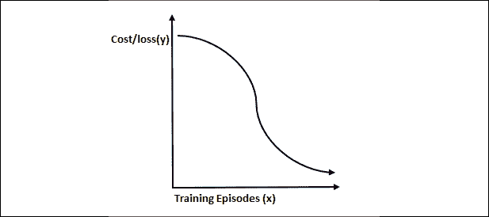
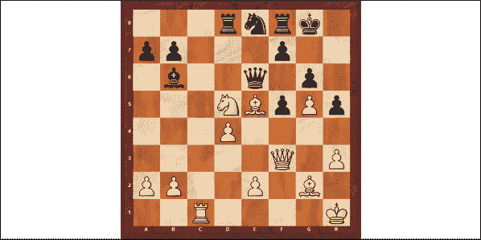

<title>Chapter_3</title>

# 3

# 机器智能——评估函数和数值收敛

当奖励矩阵( *R* )驱动的 MDP 产生结果时，会出现两个问题。这些问题可以归结为两个原则。

**原理 1** : AI 算法往往在分类、预测、决策领域超越人类。

人类智能的关键执行功能，即决策，依赖于评估情况的能力。不衡量利弊，不考虑各种因素，就无法做出决定。

人类对自己的评估能力引以为豪。然而，在许多情况下，机器可以做得更好。国际象棋代表了我们对自己思维能力的骄傲。电影中经常出现棋盘来象征人类的智慧。

今天，没有一个棋手能打败最好的象棋引擎。象棋引擎非凡的核心能力之一是评估功能；它比人类更精确地考虑了许多参数。

**原则二**:原则一导致非常棘手的后果。人类有时可能，有时不可能验证人工智能算法产生的结果，更不用说集成元算法了。

由于媒体对人脸和物体识别的大肆宣传，原则 1 一直难以检测。人类很容易检查 ML 算法应该分类的面部或物体是否被正确分类。

然而，在涉及许多特征的决策过程中，原则 2 迅速出现。在这一章中，我们将确定测量什么结果和收敛，并决定如何测量。我们还将探索测量和评估方法。

本章涵盖以下主题:

*   评估学习课程的情节
*   数值收敛测量
*   数值梯度下降引论
*   决策树监督学习作为一种评估方法

首先是设定评价目标。为此，我们将决定衡量什么以及如何衡量。

# 追踪测量什么，并决定如何测量

我们现在将着手解决寻找导致系统出错的因素这一艰巨任务。

前几章建立的模型可以总结如下:


从 *l* [v] ，可用性向量(例如，仓库中的容量)，到 *R* ，该过程从原始数据创建奖励矩阵(*第 2 章*、*构建奖励矩阵-设计您的数据集*)，这是 MDP 强化学习计划(*第 1 章*、*通过强化学习开始下一代人工智能*)所需的。如前一章所述，一个 soft max(*l*v)函数被应用于*l*v。进而应用一个 one-hot(soft max(*l*[v]))，然后转换成奖励值 *R* ，将用于 *Q* (Q-learning)算法。

MDP 驱动的贝尔曼方程然后从阅读 *R* (奖励矩阵)到结果。γ是学习参数， *Q* 是 Q 学习函数，结果代表过程状态的最终值。

要测量的参数如下:

*   公司的输入数据。现成的数据集(如 MNIST)旨在提高勘探阶段的效率。这些现成的数据集通常包含一些噪声(不可靠的数据)以使它们变得真实。必须用原始公司数据实现相同的过程。唯一的问题是，你不能从某个地方下载企业数据集。你必须建立耗时的数据集。
*   将应用的权重和偏差。
*   激活功能(逻辑功能或其他功能)。
*   一步到位后要做的选择。
*   学习参数。
*   通过融合进行剧集管理。
*   通过交互式随机检查和监督学习等独立算法来控制非监督算法的验证过程。

在现实生活中的公司项目中，一个系统直到产生了成千上万个结果才会被批准。在某些情况下，只有在测试了数百个数据集和数百万个数据样本以确保所有场景都准确无误之后，公司才会批准该系统。每个数据集代表一个场景，顾问可以使用参数脚本进行工作。顾问介绍由系统测试和测量的参数场景。在拥有多达 200 个参数的决策系统中，一名顾问在工业环境中需要工作数月。强化学习程序将独立计算事件。然而，即使这样，仍然需要顾问来管理超参数。在现实生活的系统中，有着很高的财务风险，质量控制总是必不可少的。

因此，测量应适用于一般化，而不是简单地应用于单个或几个数据集。否则，您将有一种控制参数的自然倾向，并在一个好得难以置信的场景中过度拟合您的模型。

例如，假设你某天早上醒来，看着天空。天气晴朗，阳光明媚，万里无云。第二天，你醒来，你看到同样的天气。你把它写在一个数据集中，然后发给一个客户进行天气预报。每次客户运行这个程序，它都会预测晴朗的天空！过度拟合会导致什么！这解释了为什么我们需要大型数据集来完全理解如何使用算法或说明机器学习程序如何工作。

除了奖励矩阵，第一章中的强化程序还有一个学习参数，如`mdp03.py`所示，用于本节:

```
# Gamma: It's a form of penalty or uncertainty for learning

# If the value is 1, the rewards would be too high.

# This way the system knows it is learning.

gamma = 0.8 
```

学习参数本身需要密切监控，因为它会给系统带来不确定性。这意味着学习过程将永远是一种可能性，而不是确定性。有人可能会问，为什么不直接去掉这个参数。矛盾的是，这将导致更多的全球不确定性。学习参数越趋向于 1，你过度拟合结果的风险就越大。过度适应意味着你在推动系统认为它学习得很好，而事实并非如此。这就跟一个老师一直给班上所有人打高分一模一样。老师将会过度调整学生的成绩评估过程，没有人会知道学生们是否学到了什么。

强化计划的结果需要在他们经历各阶段时进行测量。必须衡量学习过程本身的范围。

所有这些测量都会对所获得的结果产生重大影响。

最好的开始方式是测量系统的收敛质量。

如果系统提供了良好的收敛性，您可能会避免不得不返回并检查一切的头痛。

## 趋同；聚集

收敛测量训练课程的当前状态和训练课程的目标之间的距离。在强化学习程序中，例如 MDP，没有训练数据，所以没有可以比较的目标数据。

但是，有两种方法可用:

1.  **隐式收敛**:在这种情况下，我们运行大集数的训练，例如 50，000。通过反复试验，我们知道到那时程序会找到解决方案。
2.  **数控梯度下降**:我们测量每一集的训练进度并在安全时停止。

### 隐式收敛

在第一章`mdp01.py`的最后部分，实现了 5 万的范围。在本章中，我们将运行`mdp03.py`。

在`mdp01.py`的最后一部分，想法是将集数设置在这样一个水平，这意味着收敛是肯定的。在下面的代码中，范围(`50000`)是一个常数:

```
for i in range(50000):

    current_state = ql.random.randint(0, int(Q.shape[0]))

    PossibleAction = possible_actions(current_state)

    action = ActionChoice(PossibleAction)

    reward(current_state,action,gamma) 
```

在这种情况下，收敛将被定义为无论系统运行多长时间,`Q`结果矩阵都不会再改变的点。

通过将范围设置为`50000`，您可以对此进行测试和验证。只要回报矩阵保持一致，这种方法就会奏效。如果奖励矩阵在不同的场景中有很大的差异，这个模型将会产生不稳定的结果。

尝试用不同的范围运行程序。降低范围，直到您看到结果不是最佳的。

### 数控梯度下降收敛

在本节中，我们将使用`mdp03.py`，这是在*第 1 章*中探索的`mdp01.py`的修改版本，具有额外的功能:数控梯度下降。

让 MDP 训练 50，000 将产生一个好的结果，但消耗不必要的 CPU。用数控梯度下降评价函数会省很多集。让我们看看有多少。

首先，我们需要定义基于导数的梯度下降函数。让我们快速回顾一下什么是导数。


*h* 是函数的步的值。假设 *h* 代表银行账户对账单的每一行。如果我们逐行阅读语句， *h* = 1。如果我们一次读两行， *h* = 2。

读取银行对账单当前行= *f* ( *x* ) = *一定金额*。

当你读到银行账户的下一行时，函数是(*f*+*h*)=*f*后的金额( *x* )。如果你在 *f* ( *x* )的银行账户里有 100 单位的货币，花了 10 单位的货币，在下一行 *x* + *h* ，你就会剩下*f*(*x*+*h*)=*90 单位的货币*。

坡度提供了坡度的方向:向上、向下或恒定。在这种情况下，我们可以说斜率，即**坡度**正在向下，如下图所示，该图说明了随着 *x* 增加(训练集)时 *y* (成本、损失)的下降值:



图 3.1:随着培训次数的增加，成本/损失值逐渐降低

我们还需要知道你的银行账户变化了多少——衍生产品值多少钱。在这种情况下，衍生工具指的是在你的银行对账单的每一行上，你的银行账户余额的变化。在这种情况下，您在一个银行对账单行中花费了 10 个货币单位，因此这个值的导数为 *x* (您银行账户中的行)=–10。

在*第一章*、*通过强化学习开始下一代人工智能*中看到的贝尔曼方程的以下代码中，循环的步长也是 1:

```
for i in range(sec): 
```

由于 *i* = 1，我们的梯度下降计算中的 *h* = 1 可以简化为:


我们现在在下面的代码中定义 *f* ( *x* ):

```
conv=Q.sum() 
```

`conv`是 6×6 `Q`矩阵的总和，随着 MDP 训练的进行，这个矩阵慢慢变大。这样 *f* ( *x* ) = `conv=Q.sum()` =和`Q`。该函数将`Q`中的所有值相加，得到每个 *i* 处系统状态的精确值。

*f* ( *x* ) =系统在*I*–1 时的状态

*f* ( *x* + 1)是系统在 *i* 的值:

```
Q.sum() 
```

我们必须记住，`Q`矩阵是随着 MDP 进程的继续训练而逐渐增加的。我们测量两个台阶之间的距离。这个距离会减小。现在我们有:

*f*(*x*+1)–*f*(*x*)=`-Q.sum()+conv`

*   首先，我们为我们的评估函数实现额外的变量，在`mdp01.py` :

    ```
    ci=0          # convergence counter which counts the number of episodes  conv=0        # sum of Q at state 1 and then every x episodes  nc=1          # numerical convergence activated to perform numerical-controlled gradient descent  xi=100        # xi episode optimizer: stop as soon as convergence reached + xi-x(unknown)  sec=2500      # security number of episodes for this matrix size brought down from 50,000 to 2,500  cq=ql.zeros((2500, 1)) 
    ```

    的第 83 行使用梯度下降
*   `nc=1`激活评价功能，`ci`开始统计使用该功能将拍摄的剧集:

    ```
    for i in range(sec):      current_state = ql.random.randint(0, int(Q.shape[0]))      PossibleAction = possible_actions(current_state)      action = ActionChoice(PossibleAction)      reward(current_state,action,gamma)      ci+=1                          # convergence counter incremented by 1 at each state      if(nc==1):                      # numerical convergence activated 
    ```

*   在第一集，`i==1`， *f* ( *x* )= `Q.sum()`按计划:

    ```
     if(i==1):               # at state one, conv is activated              conv=Q.sum()    # conv= the sum of Q 
    ```

*   *f* ( *x* + 1) = `-Q.sum()+conv`适用:

    ```
     print("Episode",i,"Local derivative:",-Q.sum()+conv,... 
    ```

*   距离，即导数的绝对值，被显示和存储，因为我们将使用它用 Matplotlib:

    ```
     print(... "Numerical Convergence value estimator",              Q.sum()-conv)                  cq[i][0]=Q.sum()-conv 
    ```

    绘制图形
*   `xi=100`在该数控梯度下降功能中起着关键作用。每隔`xi`，程序停止检查训练程序的状态:

    ```
     if(ci==xi):   # every 100 episodes the system checks to see... 
    ```

有两种可能的情况: **a)** 和 **b)** 。

**情况 a)** 只要每一集的局部导数为> 0，MDP 就继续其训练过程:

```
 if(conv!=Q.sum()): # if the sum of Q changes...

                conv=Q.sum()   # ...the training isn't over, conv is updated

                ci=0           # ...the convergence counter is set to O 
```

输出将显示不同的局部导数:

```
Episode 1911 Local derivative: -9.094947017729282e-13 Numerical Convergence value estimator 9.094947017729282e-13

Episode 1912 Local derivative: -9.094947017729282e-13 Numerical Convergence value estimator 9.094947017729282e-13

Episode 1913 Local derivative: -1.3642420526593924e-12 Numerical Convergence value estimator 1.3642420526593924e-12 
```

**情况 b)** 当导数值达到`xi`事件的恒定值时，MDP 已被训练，训练现在可以停止:

```
 if(conv==Q.sum()):        # ...if the sum of Q has changed

                print(i,conv,Q.sum()) # ...if it hasn't the training is over

                break                 # ...the system stops training 
```

在训练停止之前，输出将显示恒定的导数`xi`:

```
Episode 2096 Local derivative: 0.0 Numerical Convergence value estimator 0.0

Episode 2097 Local derivative: 0.0 Numerical Convergence value estimator 0.0

Episode 2098 Local derivative: 0.0 Numerical Convergence value estimator 0.0

Episode 2099 Local derivative: 0.0 Numerical Convergence value estimator 0.0 
```

训练结束时，会显示训练集数:

```
number of episodes: 2099 
```

2099 比 50000 隐式收敛集少很多，证明了这种数控梯度下降法的效率。

在学习过程结束时，您可以显示 Matplotlib 图，其中包含我们存储在`cq=ql.zeros((2500, 1))`中的每集的收敛水平:

```
 cq[i][0]=Q.sum()-conv 
```

该图显示了几行代码:

```
import matplotlib.pyplot as plt

plt.plot(cq)

plt.xlabel('Episodes')

plt.ylabel('Convergence Distances')

plt.show() 
```


图 3.2:展示数值收敛的图

此图显示了数值收敛。正如你在图表中看到的，成本或损失随着训练次数的增加而减少，正如本章前面所解释的。

请注意这种梯度下降法的以下特性:

*   由于 MDP 是一个随机的过程，所以每次训练的次数会有所不同。
*   由于训练过程的随机性，局部发作时的训练曲线有时是不稳定的。有时候，曲线会局部上升而不是下降。最终会达到 0，并停留在那里。
*   如果训练曲线局部增加，那就没办法了。MDP 不会通过反向传播来修改权重、参数或策略，我们将在研究人工神经网络(ann)时看到这一点，例如，在第 8 章的*中，*用前馈神经网络解决 XOR 问题*。MDP 过程中不需要任何操作。你可以尝试改变学习率，或者回过头来检查你的奖励矩阵和在原始数据集上实现的预处理阶段。*
*   如果训练曲线没有达到 0 并停留在那里，检查学习参数、奖励矩阵和在原始数据集上实现的预处理阶段。您甚至可能不得不回过头来检查初始数据集中的噪声(有缺陷的数据或丢失的数据)。

一旦 MDP 培训结束，使用第 145 行提供的功能进行一些随机测试，如第 1 章中的*所述:*

```
origin=int(input("index number origin(A=0,B=1,C=2,D=3,E=4,F=5): ")) 
```

例如，当提示输入时，输入`1`并查看结果是否正确，如以下输出所示:

```
index number origin(A=0,B=1,C=2,D=3,E=4,F=5): 1

…/…

print("Path:")

-> B

-> D

-> C 
```

这种随机测试验证方法将在相对较小的奖励矩阵下高效工作。

然而，举例来说，对于 25×25 大小的奖励矩阵，这种方法将被证明是困难的。这台机器很容易得出结果。但是怎么评价呢？在这种情况下，我们已经达到了人类分析能力的极限。在前面的代码中，我们输入了一个起点并获得了一个答案。有了一个小的奖励矩阵，很容易直观地检查答案是否正确。当分析 25 × 25 = 625 个细胞时，需要几天时间来验证结果。请记住，当安德烈·马尔科夫在 100 多年前发明他的方法时，他用的是纸和笔！然而，我们有计算机，所以我们必须使用评估算法来评估我们的 MDP 过程的结果。

全球化世界中不断增长的数据和参数使得人类不可能超越不断增长的机器智能。

# 超出人类分析能力的评估

一个高效的管理者有很高的评价商。在越来越多的领域里，一台机器往往有更好的。人类的问题是理解机器智能产生的评估。

有时，人类会说“这是一个好的机器思考结果”或“这是一个坏的结果”，而无法解释为什么或确定是否有更好的解决方案。

评估是所有领域高效决策的关键之一:从国际象棋、生产管理、火箭发射和自动驾驶汽车到数据中心校准、软件开发和机场时刻表。

我们将探索一个象棋场景来说明人类评估的局限性。

象棋引擎不是基于高级深度学习的软件。他们非常依赖评估和计算。他们的评价比人类好得多，有很多东西要向他们学习。现在的问题是要知道是否有人能打败象棋机器。答案是否定的。

要评估国际象棋中的一个位置，你需要检查所有的棋子，它们的数量值，它们的质量值，棋子之间的合作，64 个方格中每个方格的所有者，国王的安全，主教对，骑士定位，以及许多其他因素。

评估一盘棋中的位置显示了为什么机器在相当多的决策领域超越了人类。

以下场景是在 Kramnik-Bluebaum 2017 游戏中的 move 23 之后。人类无法正确评价。它包含了太多需要分析的参数和太多的可能性。



图 3.3:象棋示例场景

轮到白棋出牌了，仔细分析一下，这一点两个棋手都输了。在这样的锦标赛中，他们每个人都必须保持面无表情。他们常常带着自信的表情看着自己的位置，以掩饰自己的沮丧。有些人甚至缩短思考时间，让对手认为他们知道自己要去哪里。

这些人类无法解决的位置可以毫不费力地用国际象棋引擎解决，即使是智能手机上廉价、高质量的国际象棋引擎。这可以推广到所有变得越来越复杂、不可预测和混乱的人类活动。决策者将越来越依赖人工智能来帮助他们做出正确的选择。

没有人能像象棋引擎那样简单地通过计算棋子的位置、它们的自由方格和许多其他参数来下棋和评估。国际象棋引擎生成一个有数百万次计算的评估矩阵。

下表是对许多职位(实际职位和潜在职位)中的一个职位的评估结果。

| **评估位置** | **0，3** | **白色** | **34** |  |  |  |
| **White** | **34** |  | **初始位置** | **位置** | **值** |  |
| **质量值** | **总值** | **卒** | 主动脉第二声 | 主动脉第二声 | 一 | a2-b2 小卒岛 |
| 0,05 | 1,05 | **卒** | b2 | b2 | 一 | a2-b2 小卒岛 |
| 0,05 | 1,05 | **卒** | c2 | x | 0 | 捕获 |
| 0 | 0 | **卒** | d2 | d4 | 一 | 占据中锋，防守 Be5 |
| 0,25 | 1,25 | **卒** | e2 | e2 | 一 | 保卫 Qf3 |
| 0,25 | 1,25 | **卒** | 第二子代 | x | 0 | 捕获 |
| 0 | 0 | **卒** | 栅级Ⅱ | g5 | 一 | 未被攻击，攻击 2 格 |
| 0,3 | 1,3 | **卒** | 氘 | h3 | 一 | 未被攻击，防御 g4 |
| 0,1 | 1,1 | **车** | 第一等的 | c1 | 5 | 占领 c 档，用 Nd5-Be5 攻击 b7 |
| 一 | 6 | **骑士** | b1 | d5 | 3 | 攻击 Nb6，8 格 |
| 0,5 | 3,5 | **主教区** | c1 | e5 | 3 | 中央位置，10 格，进攻 c7 |
| 0,5 | 3,5 | **女王** | d1 | 第三子代 | 9 | 带 Bg2、防护 Ne5、X 射线 b7 的电池 |
| 一 | 11 | **王者** | e1 | 氕 | 0 | 由 Bb6 在 a7-g1 对角线上进行 x 射线检测 |
| -0,5 | -0,5 | **主教团** | 第一子代 | 栅级Ⅱ | 3 | 支持 Qf3 防御和攻击 |
| 0,5 | 3,5 | **骑士** | g1 | x | 0 | 捕获 |
| 0 | 0 | **车** | 氕 | x | 0 | 捕获 |
| 0 | 0 | x | 0 | Captured | 29 | 0 |
| 5 | 34 |  | 29 |  | 5 | 34 |
|  | 白人:34 岁 | 白色的位置的值为 34。 | **白色** | **34** |  | White: 34 |

The value of the position of white is 34.

| **White** | **34** | **黑色** | **33，7** |  |  |  |
| **Black** | **33,7** |  | **初始位置** | **位置** | **值** |  |
| **质量值** | **总值** | **卒** | a7 | a7 | 一 | a7-b7 小卒岛 |
| 0,05 | 1,05 | **卒** | b7 | b7 | 一 | a7-b7 小卒岛 |
| 0,05 | 1,05 | **卒** | c7 | x | 0 | 捕获 |
| 0 | 0 | **卒** | d7 | x | 0 | 捕获 |
| 0 | 0 | **卒** | e7 | f5 | 一 | 加倍，2 个方块 |
| 0 | 一 | **卒** | f7 | f7 | 一 | 1 |
| 0 | 一 | **卒** | 七国集团 | g6 | 一 | 捍卫 f5 却抛弃 Kg8 |
| 0 | 一 | **卒** | h7 | h5 | 一 | f5 和 g6 的先进技术 |
| 0,1 | 1,1 | **车** | a8 | d8 | 5 | 攻击 Nd5 的半开放 d 文件 |
| 2 | 七 | **骑士** | b8 | x | 0 | 捕获 |
| 0 | 0 | **主教团** | c8 | b6 | 3 | 攻击 d4，3 格 |
| 0,5 | 3,5 | **女王** | d8 | e6 | 9 | 进攻 d4，e5，有点局促 |
| 1,5 | 10,5 | **王者** | e8 | 八国集团 | 0 | f6、h6、g7、h8 受到攻击 |
| -1 | -1 | **主教座堂** | f8 | x | 0 | 被俘，白色丢失的主教对 |
| 0,5 | 0,5 | **骑士** | 八国集团 | e8 | 3 | 防守 c7，f6，g7 |
| 一 | 四 | **车** | h8 | f8 | 5 | 死球 |
| -2 | 3 | f8 | 5 | Out of play | 31 | 3 |
| 2,7 | 黑人:33.7 人 | 黑色的值是 33.7。 | 所以白棋以 34 比 33.7 = 0.3 领先。 | 评估系统可以很容易地用两个麦卡洛克-皮茨神经元来表示，一个用于黑色，一个用于白色。每个神经元会有 30 个权重= { *w* [1] ，*w*[2]…*w*[30]}，如上表所示。两个神经元的总和需要一个激活函数，将评估转换为棋子的 1/100，这是国际象棋中的标准测量单位。每个重量都是平方和计件计算的结果。然后，可以使用可能位置的随机生成器将 MDP 应用于贝尔曼方程。 | 当今的国际象棋引擎包含这种类型的蛮力计算方法。他们不需要更多就能打败人类。 | 没有人，即使是世界冠军，能够如此精确地计算这些位置。每当他们到达这样的位置时，要考虑的参数的数量就会使他们不知所措。然后他们或多或少随机地玩，脑子里可能有一个好主意。对抗象棋引擎的成功几率有时就像彩票一样。国际象棋专家在用强大的国际象棋引擎运行人类玩的游戏来观察游戏结果时发现了这一点。现在，当被问及为何做出有问题的举动时，玩家自己往往会透露出他们没有能力提供深入的分析。通常要花几个小时来浏览一个游戏，它的组合，并找到一个坏棋的原因。最后，玩家通常会使用一台机器来帮助他们理解发生了什么。 |

这里分析的位置仅代表一种可能性。国际象棋引擎将测试数百万种可能性。人类只能测试少数。

像这样衡量一个结果，与人类的自然思维无关。只有机器才能这样思考。象棋引擎不仅解决了问题，而且也是不可能被打败的。

*原则 1:在某一点上，人类面临的问题只有机器才能解决。*

*原则 2:有时，验证 ML 系统的结果是可能的，有时则不可能。然而，我们必须设法找到检查结果的方法。*

解决原则 2 问题的一个解决方案是通过随机样本用监督算法验证非监督算法。

使用监督学习来评估超出人类分析能力的结果

通常情况下，人工智能解决方案超出了人类详细分析情况的能力。对于一个人来说，理解一台机器所做的数百万次计算来得出一个结论并解释它通常太难了。为了解决这个问题，另一种人工智能、ML 或 DL 算法将提供辅助人工智能能力。

让我们假设以下情况:

通过第 2 章*构建奖励矩阵——设计数据集*的神经方法预处理的原始数据工作良好。奖励矩阵看起来不错。

MDP 驱动的贝尔曼方程提供了良好的强化训练结果。

# 收敛函数和值起作用。

该数据集上的结果看起来令人满意，但结果受到质疑。

一个管理者或用户总会提出一个杀手级的问题:你如何证明这在未来可以用于其他数据集，并 100%确认结果是可靠的？

*   确保整个系统正常运行的唯一方法是运行数千个数据集和数十万个产品流。
*   现在的想法是使用监督学习来创建一种独立的检查结果的方法。一种方法是使用决策树来可视化解决方案的一些关键方面，并且能够让用户和您自己确信系统是可靠的。
*   决策树提供了功能强大的白盒方法。在这一节中，我们将把探索限制在直观的方法上。在*第 5 章*、*如何使用决策树增强 K-Means 聚类*中，我们将深入探讨决策树和随机树的理论，并探索更复杂的例子。
*   在该模型中，分析输入的特征，以便我们可以对它们进行分类。可以根据实时数据将分析转换为决策树，以创建分布表示来预测未来结果。

对于此部分，您可以运行以下程序:

`Decision_Tree_Priority_classifier.py`

或者谷歌联合实验室上的以下 Jupyter 笔记本:

`DTCH03.ipynb`

Google 联合实验室可能安装了以下两个软件包:

这可以帮助您避免在本地安装它们，如果您收到 Graphviz 需求消息，这可能需要一些时间。

两个程序生成相同的决策树图像:

`warehouse_example_decision_tree.png`

这种决策树方法的直观描述分为 5 个步骤:

**第 1 步**:表示入库订单的特征，例如:

```
import collections       # from Python library container datatypes

import pydotplus         # a Python Interface to Graphviz's Dot language.(dot-V command line 
```

在这种情况下，我们将模型限制为三个属性:

优先级/位置，这是该模型中仓库流中最重要的属性

要运输的体积

优化优先级-财务和客户满意度属性

**步骤 2** :为学习数据集提供优先级标签:

```
features = [ 'Priority/location', 'Volume', 'Flow_optimizer' ] 
```

**步骤 3** :提供数据集输入矩阵，这是强化学习程序的输出矩阵。这些值是近似值，但足以运行模型。它们模拟决策过程中发生的一些中间决策和转换(应用的比率、添加的不确定性因素和其他参数)。输入矩阵是`X`:

*   步骤 1 中的功能适用于每一列。
*   步骤 2 中的值适用于每一行。
*   第三列[0，1]的值是训练期的离散指示符。

**步骤 4** :运行标准决策树分类器。该分类器将表示(分布式表示)分为两类:

```
Y = ['Low', 'Low', 'High', 'High', 'Low', 'Low'] 
```

高优先级订单的属性

```
X = [[256, 1,0],

     [320, 1,0],

     [500, 1,1],

     [400, 1,0],

     [320, 1,0],

     [256, 1,0]] 
```

低优先级订单的属性

算法有很多种。在这种情况下，调用一个标准的`sklearn`函数来完成这项工作，如下面的源代码所示:

**步骤 5** :可视化将订单分成优先级组。可视化树是可选的，但提供了一种时髦的白盒方法。您必须使用:

`import collections`，一个 Python 容器库。

*   `import pydotplus`，Graphviz 的点语言的 Python 接口。您可以选择将 Graphviz 直接用于该源代码的其他变体。
*   源代码将获取决策树的节点和边，绘制它们，并将图像保存在文件中，如下所示:

该文件将包含这个直观的决策树:

```
classify = tree.DecisionTreeClassifier()

classify = classify.fit(X,Y) 
```

图 3.3:决策树

*   该图像产生以下信息:
*   决策树表示为具有节点(方框)和边(线条)的图形。

当 *gini* =0 时，此框为**叶**；树不会再长了。

```
info = tree.export_graphviz(classify,feature_names=features,

    out_file=None, filled=True,rounded=True)

graph = pydotplus.graph_from_dot_data(info)

edges = collections.defaultdict(list)

for edge in graph.get_edge_list():

    edges[edge.get_source()].append(int(edge.get_destination()))

for edge in edges:

    edges[edge].sort()

    for i in range(2):

        dest = graph.get_node(str(edges[edge][i]))[0]

graph.write_png(<your file name here>.png) 
```

*基尼*意为**基尼杂质**。在直观的层面上，基尼系数杂质将集中在基尼系数杂质的最高值上来对样本进行分类。我们将在*第 5 章*、*如何使用决策树增强 K-Means 聚类*中深入探讨基尼不纯理论。


*样本* = 6。训练数据集中有六个样本:

优先级/位置<=360.0 is the largest division point that can be visualized: 【

*   The false arrow points out the two values that are not <=360\. The ones that are classified as 【 are considered as low-priority values.
*   After a few runs, the user will get used to visualizing the decision process as a white box and trust the system.
*   Each ML tool suits a special need in a specific situation. In the next chapter, *用 K-Means 聚类*优化你的解决方案，我们将探索另一种机器学习算法: *k-means 聚类*。
*   摘要
    *   这一章区分了机器智能和人类智能。像机器一样解决问题意味着使用一连串的数学函数和性质。机器智能在很多领域超越人类。
    *   你在机器学习和深度学习上走得越远，你就会发现越多解决核心问题的数学函数。与令人震惊的大肆宣传相反，依赖 CPU 的数学正在取代人类，而不是某种形式的神秘意识智能。

机器学习的力量超越了人类的数学推理。这使得 ML 更容易推广到其他领域。一个数学模型，没有人类纠结于情绪的复杂性，更容易在很多领域部署相同的模型。本书前三章的模型可以用于自动驾驶车辆、无人机、仓库中的机器人、调度优先级等等。试着想象尽可能多的领域你可以应用这些。

评估和测量是机器学习和深度学习的核心。关键因素是不断监测系统产生的结果和它必须达到的目标之间的一致性。为了达到目标，算法的参数是可以不断调整的。

# 当一个人被无监督的强化学习算法超越时，例如，决策树可以为人类智能提供宝贵的帮助。

下一章，*用 K 均值聚类*优化你的解决方案，进一步深入机器智能。

问题

人类能打败象棋机器吗？(是|否)

当涉及到大量数据时，人类可以凭借直觉比机器更好地评估决策。(是|否)

用 Q 函数构建强化学习程序本身就是一项壮举。事后使用这些结果是没有用的。(是|否)

监督学习决策树函数可用于验证无监督学习过程的结果将产生可靠的、可预测的结果。(是|否)

# 通过提供优先级，强化学习程序的结果可以用作调度系统的输入。(是|否)

1.  人工智能软件能像人类一样思考吗？(是|否)
2.  进一步阅读
3.  关于决策树的更多信息:[https://youtu.be/NsUqRe-9tb4](https://youtu.be/NsUqRe-9tb4)
4.  如需了解佐兰·彼得罗尼耶维奇等专家的象棋分析，我曾与他们讨论过这一章:[https://chesbookreviews . WordPress . com/tag/佐兰-彼得罗尼耶维奇/](https://chessbookreviews.wordpress.com/tag/zoran-petronijevic/) ，[https://www.chess.com/fr/member/zoranp](https://www.chess.com/fr/member/zoranp)
5.  关于人工智能象棋程序的更多信息:[https://deep mind . com/blog/article/alpha zero-shedding-new-light-grand-games-chess-shogi-and-go](https://deepmind.com/blog/article/alphazero-shedding-new-light-grand-games-chess-shogi-and-go)
6.  Can artificial intelligence software think like humans? (Yes | No)

# Further reading

*   For more on decision trees: [https://youtu.be/NsUqRe-9tb4](https://youtu.be/NsUqRe-9tb4)
*   For more on chess analysis by experts such as Zoran Petronijevic, with whom I discussed this chapter: [https://chessbookreviews.wordpress.com/tag/zoran-petronijevic/](https://chessbookreviews.wordpress.com/tag/zoran-petronijevic/), [https://www.chess.com/fr/member/zoranp](https://www.chess.com/fr/member/zoranp)
*   For more on AI chess programs: [https://deepmind.com/blog/article/alphazero-shedding-new-light-grand-games-chess-shogi-and-go](https://deepmind.com/blog/article/alphazero-shedding-new-light-grand-games-chess-shogi-and-go)