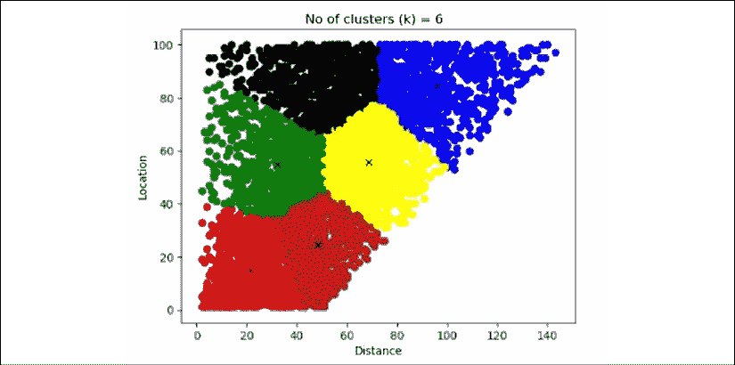
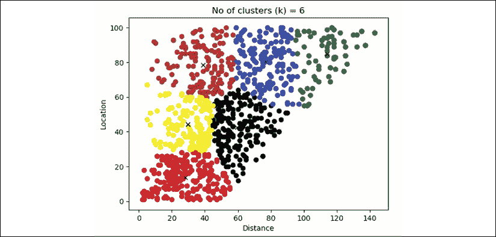
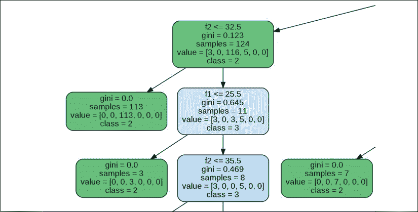

<title>Chapter_5</title>

# 5

# 如何使用决策树增强 K-Means 聚类

本章讨论了两个关键问题。首先，我们将探索如何使用超过给定算法容量的数据集来实现 k-means 聚类。其次，我们将实现决策树来验证超越人类分析能力的 ML 算法的结果。我们还将探索随机森林的使用。

当面对如此困难的问题时，为任务选择正确的模型通常被证明是 ML 中最困难的任务。当我们被给予一组不熟悉的特征来表示时，这可能是一个有点令人困惑的前景。然后我们就要把手弄脏，尝试不同的模式。一个有效的评估者需要好的数据集，这可能会改变项目的进程。

本章基于在*第 4 章*、*使用 K 均值聚类*优化您的解决方案中开发的 K 均值聚类(或 KMC)程序。大数据集的问题得到解决。这个探索将带领我们进入大数定律(LLN)、中心极限定理(CLT)、蒙特卡罗估计、决策树和随机森林的世界。

在像本章所描述的过程中，人工干预不仅是不必要的，而且是不可能的。由于现实生活系统的复杂和不断变化的性质，不仅机器智能在许多情况下超过了人类，而且给定问题本身的复杂性也经常超过人类的能力。由于机器智能，人类可以处理越来越多的数据，否则这些数据是不可能管理的。

使用我们的工具包，我们将构建一个解决方案，在没有人工干预的情况下分析算法的结果。

本章涵盖以下主题:

*   KMC 无监督学习
*   决定是否必须使用人工智能
*   数据量问题
*   定义 KMC 的 NP-hard 特性
*   关于 LLN、CLT 和蒙特卡罗估计量的随机抽样
*   混洗训练数据集
*   决策树和随机森林的监督学习
*   将 KMC 链接到决策树

本章从 KMC 的无监督学习开始。我们将探索避免通过随机抽样运行大型数据集的方法。KMC 算法的输出将为监督决策树算法提供标签。决策树将验证 KMC 过程的结果，这是一项没有人能够在处理大量数据时完成的任务。

本章中所有的 Python 程序和文件都可以在[https://github . com/packt publishing/Artificial-Intelligence-By-Example-Second-Edition/tree/master/CH05](https://github.com/PacktPublishing/Artificial-Intelligence-By-Example-Second-Edition/tree/master/CH0)中找到。

还有一个名为`COLAB_CH05.ipynb`的 Jupyter 笔记本，它包含了一次运行中的所有 Python 程序。你可以使用你的谷歌账户将它直接上传到谷歌合作实验室([https://colab.research.google.com/](https://colab.research.google.com/))。

# 基于 KMC 的大数据集无监督学习

KMC 获取未标记的数据，而形成数据点的聚类。这些聚类的名称(整数)为运行监督学习算法(如决策树)提供了基础。

在本节中，我们将了解如何对大型数据集使用 KMC。

当面对一个具有大型未标记数据集的项目时，第一步包括评估机器学习是否可行。在一本关于人工智能的书中试图避开人工智能似乎有些自相矛盾。然而，在 AI 中，就像在现实生活中一样，你应该在正确的时间使用正确的工具。如果人工智能不是解决问题所必需的，就不要使用它。

使用**概念验证** ( **POC** )方法来查看给定的人工智能项目是否可行。POC 的成本远低于项目本身，并且有助于建立一个相信结果的团队。或者，POC 可能会表明继续采用 ML 解决方案风险太大。棘手的问题是存在的。最好避免花几个月的时间去做一些不会起作用的事情。

第一步是探索将要使用的数据量和最大似然估计模型。

如果 POC 证明某个特定的 ML 算法可以解决手头的问题，那么接下来要做的就是解决数据量问题。概念验证表明，该模型适用于一个样本数据集。现在，实施过程可以开始了。

任何在笔记本电脑上运行过带有大型数据集的机器学习算法的人都知道，机器学习程序需要一些时间来训练和测试这些样本。机器学习程序或深度学习卷积神经网络消耗大量的机器能力。即使你使用**GPU**(**图形处理单元**的简称)运行 ANN ，希望获得比使用 CPU 更好的性能，训练过程仍然需要花费大量时间来贯穿所有的学习时期。例如，一个时期意味着我们已经尝试了一组权重来测量结果的准确性。如果精度不够，我们运行另一个时期，尝试其他权重，直到精度足够。

例如，如果您想要在超过 1，000，000 个数据点的数据集上训练您的程序，您将消耗大量的本地机器功率。

假设您需要在一家公司中使用 KMC 算法，该公司拥有来自多个 SQL Server 实例、Oracle 数据库和一个大数据源的数亿到数十亿条数据记录。例如，假设您在一家领先的电话公司从事电话运营活动。您必须将 KMC 计划应用于一年内世界各地的通话时长。这意味着每天有数百万条记录，一年加起来有数十亿条记录。

一个运行数十亿条记录的机器学习 KMC 训练程序，即使能工作，也会消耗太多 CPU/GPU，花费太多时间。最重要的是，十亿条记录可能只代表数量不足的特性。添加更多要素将显著增加此类数据集的大小。

现在的问题是弄清楚 KMC 是否会处理这样大的数据集。KMC 的一个问题是 **NP 难**。 **P** 代表**多项式**，而 **N** 代表**非确定性**。

解决我们的体积问题需要一些理论上的考虑。我们需要确定我们面临的问题的难度。

## 识别问题的难度

我们首先需要了解我们正在处理的困难程度。其中一个派上用场的概念是 NP-hard。

### NP-hard——P 的意思

NP-hard 中的 P 表示求解或验证一个 P 问题的解的时间是多项式的(poly=many，nomial=terms)。例如，*x*3 就是一个多项式。N 表示问题是不确定的。

一旦 *x* 已知，那么*x*3 就会被计算出来。对于 *x* = 3，000，000，000 并且只有 3 个基本计算，这总计为:

log*x*3= 28.43

计算这个特殊问题需要 10 次 ^(28.43 次)计算。

这看起来很可怕，但也没那么可怕，原因有二:

*   在大数据的世界里，这个数字可以进行大规模随机抽样。
*   KMC 可以在小批量(数据集的子集)中训练，以加快计算速度。

多项式时间意味着这个时间将或多或少地与输入的大小成比例。即使训练 KMC 算法所需的时间仍然有点模糊，只要由于输入的批量大小，验证解决方案所需的时间保持成比例，问题就仍然是多项式。

指数算法随着数据量而增加，而不是计算次数。该示例的指数函数将是*f*(*x*)= 3^x= 3^(30 亿次计算。这样的函数通常可以分解成多个经典算法。这种类型的功能存在于企业界，但它们超出了本书的范围。)

### NP-hard——非确定性的含义

不确定性问题需要启发式方法，这意味着某种形式的启发式，如试错法。例如，我们尝试一组权重，评估结果，然后继续下去，直到找到满意的解决方案。

#### 努力的意思

NP-hard 可以通过一些优化转换成 NP 问题。这意味着 NP-hard 和一个 NP 问题一样难或者更难。

例如，我们可以使用批处理来控制输入的大小、计算时间和输出的大小。这样，我们可以把一个 NP 难问题归结为一个 NP 问题。

创建批处理以避免在数据集上运行算法会被证明太大的一种方法是使用随机抽样。

## 用小批量实施随机抽样

机器学习和深度学习很大一部分包含了各种形式的随机抽样。在这种情况下，如果没有随机抽样，数十亿个元素的训练集将很难实现，如果不是不可能的话。

随机抽样被用在许多方法中:蒙特卡罗、随机梯度下降、随机森林和许多算法。无论采样取什么名字，它们都在不同程度上共享相同的概念，这取决于数据集的大小。

对大型数据集进行随机采样可以产生良好的结果，但这需要依赖 LLN，我们将在下一节探讨这一点。

## 使用 LLN

在概率上， LLN 指出，当处理非常大量的数据时，重要的样本可以有效地代表整个数据集。例如，我们都熟悉使用小数据集的民意调查。

这个原则，像所有的原则一样，有它的优点和局限性。但不管有什么限制，这条定律适用于日常的机器学习算法。

在机器学习中，采样类似于轮询。更少的个体代表更大的整体数据集。

只要采用科学方法，对小批量数据进行采样并求平均值可以证明与计算整个数据集一样有效:

*   使用小批量数据或数据子集进行训练
*   使用一种或另一种形式的评估器来测量训练课程的进度，直到达到目标

你可能会惊讶地读到“直到达到一个目标”，而不是“直到达到最佳解决方案”

最优解不一定代表最佳解。所有的特征和所有的参数通常都没有表达出来。找到一个好的解决方案通常足以有效地进行分类或预测。

LLN 解释了为什么随机函数被广泛用于机器学习和深度学习。如果符合 CLT，随机样本会提供有效的结果。

## CLT

应用于 KMC 项目的示例的 LLN 必须使用随机采样提供一组合理的质心。如果质心是正确的，那么随机样本是可靠的。

质心是一组数据集的几何中心，如*第 4 章*、*使用 K 均值聚类优化您的解决方案*中所述。

这种方法现在可以扩展到 CLT，即当训练大数据集时，小批量样本的子集就足够了。以下两个条件定义了 CLT 的主要属性:

*   子集(小批量)的数据点之间的差异保持合理。
*   具有小批量方差的正态分布模式仍然接近于整个数据集的方差。

例如，蒙特卡罗估计器可以提供一个很好的基础来查看样本是否符合 CLT。

### 使用蒙特卡罗估计器

蒙特卡洛这个名字来源于蒙特卡洛的赌场和博彩业。赌博是一个极好的无记忆随机例子。无论赌徒在玩之前发生了什么，先验知识都不能提供洞察力。例如，赌徒玩 10 场游戏，输了一些，赢了一些，创建了概率分布。

计算 *f* ( *x* )的分布之和。然后从一个数据集中抽取随机样本，例如， *x* [1] ， *x* [2] ， *x* [3] ，...，*x*n。

*f* ( *x* )可以通过下式估算:


估计器代表 KMC 算法或任何实现的模型的预测结果的平均值。

我们已经看到一个数据集的样本可以代表一个完整的数据集，就像选举投票时一群人可以代表一个群体一样。

知道了我们可以安全地使用随机样本，就像在选举中对人口进行民意测验一样，我们现在可以直接处理完整的大型数据集，或者最好使用随机样本。

## 尝试训练完整的训练数据集

在*第 4 章*、*使用 K-Means 聚类*优化您的解决方案中，具有六个聚类配置的 KMC 算法产生了六个质心(几何中心)，如下所示:



图 5.1:六个质心

现在的问题是，在处理大型数据集时，如何避免昂贵的机器资源来训练这个 KMC 数据集。例如，解决方案是从的数据集中随机抽取样本，就像为选举对人口进行投票一样。

## 训练训练数据集的随机样本

`sampling/k-means_clustering_minibatch.py`程序提供了一种验证小批量解决方案的方法。

程序从加载以下代码行中的数据开始:

```
dataset = pd.read_csv('data.csv')

print (dataset.head())

print(dataset) 
```

加载数据集可能会产生两个问题:

*   **数据集太大，首先无法加载。**在这种情况下，批量加载数据集。使用这种方法，您可以在许多批次上测试模型，以微调您的解决方案。
*   **可以加载数据集，但选择的 KMC 算法无法吸收大量数据。**小批量规模的良好选择将解决这个问题。

一旦数据集被加载，程序将开始训练过程。

将使用蒙特卡罗的大数据量原理随机创建一个名为`dataset1`的小批量数据集，小批量大小为 1000。蒙特卡罗方法的许多变体适用于机器学习。对于我们的示例，使用随机函数创建小批量就足够了:

```
n=1000

dataset1=np.zeros(shape=(n,2))

for i in range (n):

    j=randint(0,4998)

    dataset1[i][0]=dataset.iloc[j,0]

    dataset1[i][1]=dataset.iloc[j,1] 
```

最后，KMC 算法在标准基础上运行，如下面的代码片段所示:

```
#II.Hyperparameters

# Features = 2 :implicit through the shape of the dataset (2 columns)

k = 6

kmeans = KMeans(n_clusters=k)

#III.K-means clustering algorithm

kmeans = kmeans.fit(dataset1) #Computing k-means clustering

gcenters = kmeans.cluster_centers_ # the geometric centers or centroids

print("The geometric centers or centroids:")

print(gcenters) 
```

下面的截图显示了产生的结果，类似于 KMC 在*第 4 章*、*使用 K 均值聚类优化您的解决方案*中训练的完整数据集:



图 5.2:产出(KMC)

获得的质心是一致的，如下所示:

```
The geometric centers or centroids:

[[ 19.6626506 14.37349398]

 [ 49.86619718 86.54225352]

 [ 65.39306358 54.34104046]

 [ 29.69798658 54.7852349 ]

 [ 48.77202073 23.74611399]

 [ 96.14124294 82.44067797]] 
```

由于这是一个随机过程，每次运行的输出都会略有不同。在本节中，我们将数据集分解为随机样本，以优化训练过程。执行随机采样的另一种方法是在训练数据集之前对其进行洗牌。

## 随机抽样是执行随机抽样的另一种方式

`sampling/k-means_clustering_minibatch_shuffling.py`程序提供了另一种解决随机抽样方法的方法。

KMC 是一种无监督的训练算法。因此，它训练*未标记的*数据。单个随机计算不会消耗大量的机器资源，但是一行中的几个随机选择会。

洗牌可以降低机器消耗成本。在开始训练之前对数据进行适当的洗牌，就像在玩扑克游戏之前洗牌一样，可以避免重复和随机的小批量计算。在此模型中，加载数据阶段和训练阶段保持不变。然而，在开始训练之前，我们对整个数据集进行了一次洗牌，而不是对小批量数据集`dataset1`进行一次或几次随机选择。以下代码显示了如何混洗数据集:

```
sn=4999

shuffled_dataset=np.zeros(shape=(sn,2))

for i in range (sn):

    shuffled_dataset[i][0]=dataset.iloc[i,0]

    shuffled_dataset[i][1]=dataset.iloc[i,1] 
```

然后，我们选择前 1，000 条混洗记录进行训练，如下面的代码片段所示:

```
n=1000

dataset1=np.zeros(shape=(n,2))

for i in range (n):

    dataset1[i][0]=shuffled_dataset[i,0]

    dataset1[i][1]=shuffled_dataset[i,1] 
```

以下屏幕截图中的结果对应于具有完整数据集和随机小批量数据集样本的结果:


图 5.3:完整和随机小批量数据集样本

产生的质心可以提供一级结果来确认模型，如下图输出所示。

几何中心或质心:

```
[[ 29.51298701 62.77922078]

 [ 57.07894737 84.21052632]

 [ 20.34337349 15.48795181]

 [ 45.19900498 23.95024876]

 [ 96.72262774 83.27737226]

 [ 63.54210526 51.53157895]] 
```

使用洗牌而不是随机小批量有两个优点:限制小批量计算的数量和防止两次训练相同的样本。如果你的混洗算法有效，你只需要混洗数据集一次。如果没有，您可能必须返回并使用随机抽样，如前一节所述。

随机采样和洗牌帮助解决了数据集容量问题的一部分。

然而，现在我们必须探索大数据集 ML 算法实现的另一个方面:验证结果。

## 链接监督学习以验证无监督学习

本节探讨如何用有监督的算法:决策树来验证无监督的 KMC 算法的输出。

KMC 接受没有标签的输入，产生有标签的输出。无人监管的过程从混乱的输入数据中理出了头绪。

本章中的示例关注两个相关的特征:位置和距离。生成的聚类是数据集中数据的位置距离子集。输入文件包含两列:距离和位置。输出文件包含三列:距离、位置和标签(簇号)。

因此，输出文件可以链接到监督学习算法，如决策树。决策树将使用标记的数据产生一个可视化的白盒机器思维过程。此外，可以训练决策树来验证 KMC 算法的结果。该过程从预处理原始数据开始。

### 预处理原始数据

早些时候，已经表明对于大型数据集，小批量是必要的。在内存中加载数十亿条数据记录是不可行的。作为 KMC 算法的一部分，在`sampling/k-means_clustering_minibatch.py`中应用了随机选择。

然而，由于我们是在流水线中链接我们的算法，并且由于我们不是在训练模型，我们可以从`sampling/k-means_clustering_minibatch.py`中提取随机采样函数并将其分离出来:

```
n=1000

dataset1=np.zeros(shape=(n,2))

li=0

for i in range (n):

    j=randint(0,4999)

    dataset1[li][0]=dataset.iloc[j,0]

    dataset1[li][1]=dataset.iloc[j,1]

    li+=1 
```

例如，该代码可以应用于在预处理阶段从大数据环境中检索的数据包中提取的数据集。预处理阶段将循环重复。我们现在将探索从原始数据到链式 ML 算法输出的管道。

## 脚本和 ML 算法的管道

ML **管道**将获取原始数据并执行降维或其他预处理任务，这不在本书的讨论范围内。数据的预处理有时不仅仅需要 ML 算法，比如 SQL 脚本。我们的探索就在 KMC 等人工智能算法接管之后开始。然而，也可以使用传统的非人工智能脚本从原始数据到 ML 运行管道。

以下部分中描述的管道可以分为三个主要步骤，前面是经典的预处理脚本:

*   **步骤 0** :在运行 KMC 程序之前，一个标准过程使用经典预处理脚本对**训练数据集**进行随机采样。这方面超出了 ML 过程和本书的范围。通过这样做，我们避免了 ML Python 程序的过载。训练数据将首先由 KMC 算法处理，然后发送到决策树程序。
*   **步骤 1**:KMC 的一个多 ML 程序`kmc2dt_chaining.py`，使用*第 4 章*、*用 K-Means 聚类优化你的解决方案*中的**保存的模型**读取步骤 0 产生的训练数据集。KMC 程序获取未标记的数据，进行预测，并在一个名为`ckmc.csv`的文件中产生一个已标记的输出。输出标注是包含距离和位置的数据集的线的聚类数。
*   步骤 2 :决策树程序`decision_tree.py`读取 KMC 预测的输出`ckmc.csv`。决策树算法对其模型进行训练，并将训练好的模型保存在名为`dt.sav`的文件中。
    *   **步骤 2.1** :训练阶段结束。管道现在接受由连续的相等大小的数据集检索的原始数据。这个**批处理**进程将提供固定数量的数据。计算时间可以计划和掌握。这一步超出了 ML 过程和本书的范围。
    *   **步骤 2.2** :随机采样脚本处理批次，并为**预测**生成预测数据集。
*   **步骤 3** : `kmc2dt_chaining.py`现在将运行一个 KMC 算法，该算法链接到一个决策树，该决策树将验证 KMC 的结果。KMC 算法产生预测。决策树根据这些预测做出预测。决策树还将为用户和管理员提供一个可视化的 PNG 图形。

步骤 2.1 到 3 可以在连续过程中全天候运行。

值得注意的是，随机森林是决策树组件的一个有趣的替代方案。可以替代`kmc2dt_chaining.py`中的决策树算法。在下一节中，我们将使用`random_forest.py`在这个上下文中探索随机森林。

### 步骤 1–从无监督的 ML 算法中训练和导出数据

`kmc2dt_chaining.py`可以被认为是将 KMC 程序链接到将验证结果的决策树程序。每个程序都是链条中的一环。

从决策树项目的角度来看，`kmc2dt_chaining.py`可以被认为是一个**流水线**，它获取未标记的数据，并为受监督的决策树程序进行标记。管道获取原始数据，并使用多个 ML 程序对其进行转换。

在链式模型的训练阶段，`kmc2dt_chaining.py`运行，为决策树的训练提供数据集。参数`adt=0`将过程限制在 KMC 函数，这是链的第一个环节。因此，该程序中的决策树在此阶段不会被激活。

`kmc2dt_chaining.py`将加载数据集，加载保存的 KMC 模式，进行预测，并导出标注结果:

*   **加载数据集** : `data.csv`，数据集文件与*第 4 章*、*使用 K-Means 聚类优化您的解决方案*中使用的相同。两个特征，`location`和`distance`，被加载:

    ```
    dataset = pd.read_csv('data.csv') 
    ```

*   **加载 KMC 模型**:K 均值聚类模型`kmc_model.sav`，由`k-means_clustering_2.py`保存在*第 4 章*，*使用 K 均值聚类优化您的解决方案*。现在使用`pickle`模块加载并保存它:

    ```
    kmeans = pickle.load(open('kmc_model.sav', 'rb')) 
    ```

*   **Make predictions**: No further training of the KMC model is required at this point. The model can run predictions on the mini-batches it receives. We can use an **incremental** process to verify the results on a large scale.

    如果数据没有充分缩放，可以应用其他算法。在这种情况下，数据集不需要额外的缩放。KMC 算法将对样本进行预测，并为决策树生成一个输出文件。

    对于此示例，预测将逐行生成:

    ```
     for i in range(0,1000):

            xf1=dataset.at[i,'Distance']

            xf2=dataset.at[i,'location']

            X_DL = [[xf1,xf2]]

            prediction = kmeans.predict(X_DL) 
    ```

    结果存储在 NumPy 数组中:

    ```
     p=str(prediction).strip('[]')

            p=int(p)

            kmcpred[i][0]=int(xf1)

            kmcpred[i][1]=int(xf2)

            kmcpred[i][2]=p; 
    ```

*   **Export the labeled data**: The predictions are saved in a file:

    ```
    np.savetxt('ckmc.csv', kmcpred, delimiter=',', fmt='%d') 
    ```

    这个输出文件是特殊的；它现在被标记为:

    ```
    80,53,5

    18,8,2

    55,38,0 
    ```

    输出文件包含三列:

    *   列 1 =特征 1 =位置；`80`例如，在第一行
    *   列 2 =特征 2 =距离；`53`例如，在第一行
    *   第 3 列=标签=聚类计算；`5`例如，在第一行

    在我们的链式 ML 算法中，这个输出数据将成为下一个 ML 算法，即决策树的输入数据。

### 步骤 2–训练决策树

在*第 3 章*、*机器智能-评估函数和数值收敛*中，描述了一个决策树，并用于可视化一个优先级流程。`Decision_Tree_Priority.py`制作了如下图形:


图 5.4:决策树优先级

该树从具有高基尼值的节点开始。节点被一分为二，下面的每个节点都是“叶子”,因为 Gini=0。

本书实现的决策树算法使用了基尼杂质。

基尼系数代表一个数据点被错误分类的概率。

决策树将从最高杂质开始。在计算阈值后，它会将概率分成两个分支。

当一个分支达到 Gini 杂质 0 时，它到达它的**叶**。

假设 *k* 是一个数据点被错误分类的概率。

数据集 *X* 来自*第 3 章*、*机器智能-评估函数和数值收敛*，包含六个数据点。四个数据点为低，两个数据点为高:

*X*= {低，低，高，高，低，低}

基尼系数公式计算每个特征出现的概率，并将结果乘以 1(每个特征在剩余值上出现的概率)，如下式所示:


应用于六个中有四个低和六个中有两个高的 *X* 数据集，结果将是:

*G*(*k*)=(4/6)*(1–4/6)+(2/6)*(1–2/6)

*G*(*k*)=(0.66 * 0.33)+(0.33 * 0.66)

*G*(*k*)= 0.222+0.222 = 0.444

数据点被错误预测的概率是 0.444，如图所示。

决策训练建立在**包含最高基尼系数杂质值的特征的信息增益**上。

我们现在将探索决策树的 Python 实现，以准备将其链接到 KMC 程序。

#### 训练决策树

为了训练决策树，`decision_tree.py`将加载数据集，训练模型，进行预测，并保存模型:

*   **加载数据集**:在加载数据集之前，您需要导入以下模块:

    ```
    import pandas as pd #data processing  from sklearn.tree import DecisionTreeClassifier #the dt classifier  from sklearn.model_selection import train_test_split #split the data into training data and testing data  from sklearn import metrics #measure prediction performance  import pickle #save and load estimator models 
    ```

模块的版本会随着编辑的制作而变化，也取决于你更新版本和代码的频率。例如，在使用版本 0.21.2 时，当您尝试从版本 0.20.3 中取消选取 KMC 模型时，可能会收到警告。只要管用，出于教育目的是没问题的。但是，在生产中，管理员应该有一个数据库，其中包含所使用的包及其版本的列表。

数据集被加载、标记并分成训练和测试数据集:

```
#loading dataset

col_names = ['f1', 'f2','label']

df = pd.read_csv("ckmc.csv", header=None, names=col_names)

print(df.head())

#defining features and label (classes)

feature_cols = ['f1', 'f2']

X = df[feature_cols] # Features

y = df.label # Target variable

print(X)

print(y)

# splitting df (dataset) into training and testing data

X_train, X_test, y_train, y_test = train_test_split(

    X, y, test_size=0.3, random_state=1) # 70% training and 30% test 
```

本例中的数据将包含由 KMC 算法的输出提供的两个要素(位置和距离)和一个标注(聚类数)。以下标题显示了数据集的结构:

```
 f1  f2  label

0  80  53      5

1  18   8      2

2  55  38      0

3  74  74      5

4  17   4      2 
```

*   **训练模型**:一旦数据集准备好，决策树分类器就被创建，模型被训练:

    ```
    # create the decision tree classifier  dtc = DecisionTreeClassifier()  # train the decision tree  dtc = dtc.fit(X_train,y_train) 
    ```

*   **Making predictions**: Once the model is trained, predictions are made on the test dataset:

    ```
    #predictions on X_test

    print("prediction")

    y_pred = dtc.predict(X_test)

    print(y_pred) 
    ```

    预测使用这些功能来预测测试数据集中的分类数，如以下输出所示:

    ```
    prediction

    [4 2 0 5 0...] 
    ```

*   **Measuring the results with metrics**: A key part of the process is to measure the results with metrics. If the accuracy approaches 1, then the KMC output chained to the decision tree algorithm is reliable:

    ```
    # model accuracy

    print("Accuracy:",metrics.accuracy_score(y_test, y_pred)) 
    ```

    在本例中，精度为 0.97。该模型可以以 0.97 的概率预测距离和位置的聚类，这证明了它的有效性。链式 ML 解的训练结束，预测周期开始。

您可以使用`decision_tree.py`生成决策树的 PNG 文件。取消程序最后一段的注释，该段包含导出函数:

```
from sklearn import tree

import pydotplus

graph=1

if(graph==1):

    # Creating the graph and exporting it

    dot_data = tree.export_graphviz(dtc, out_file=None,

                                    filled=True, rounded=True,

                                    feature_names=feature_cols,

                                    class_names=['0','1','2',

                                                 '3','4','5'])

    #creating graph

    graph = pydotplus.graph_from_dot_data(dot_data)

    #save graph

    image=graph.create_png()

    graph.write_png("kmc_dt.png") 
```

请注意，一旦您实现了该功能，您可以使用`graph`参数激活或禁用它。

下面的例子可以帮助你理解整个链式解决方案的思维过程(KMC 和决策树)。



图 5.5:代码示例的图像输出

图像文件`dt_kmc.png`可以在 GitHub 的`CH05`中找到。

### 第三步——连接到决策树的 KMC 的连续循环

链接到决策树算法的链式 KMC 算法的训练已经结束。

使用经典大数据批量检索方法的预处理阶段将持续提供带有脚本的随机采样数据集。

`kmc2dt_chaining.py`可以专注于运行 KMC 预测，并将它们传递给决策树预测进行白盒检查。这个连续的过程在决策树级别导入数据集、加载保存的模型、预测和度量结果。

如有必要，链式流程可以全天候运行。

培训计划中实施的 KMC 和决策树都需要使用这些模块:

```
from sklearn.cluster import KMeans

import pandas as pd

from matplotlib import pyplot as plt

import pickle

import numpy as np

from sklearn.tree import DecisionTreeClassifier

from sklearn.model_selection import train_test_split

from sklearn import metrics 
```

让我们来看一下这个过程:

*   **加载 KMC 数据集和模型**:KMC 数据集在预处理阶段已经准备好。已训练的模型先前已保存。数据集加载了熊猫，模型加载了`pickle` :

    ```
    #I.KMC. The prediction dataset and model  dataset = pd.read_csv('data.csv')  kmeans = pickle.load(open('kmc_model.sav', 'rb')) 
    ```

*   **Predicting and saving**: The goal is to predict the batch dataset line by line and save the result in an array in a white-box approach that can be verified by the administrator of the system:

    ```
     for i in range(0,1000):

            xf1=dataset.at[i,'Distance']

            xf2=dataset.at[i,'location']

            X_DL = [[xf1,xf2]]

            prediction = kmeans.predict(X_DL)

            #print (i+1, "The prediction for",X_DL," is:",

                str(prediction).strip('[]'))

            #print (i+1, "The prediction for",

                str(X_DL).strip('[]'), " is:",

                str(prediction).strip('[]'))

            p=str(prediction).strip('[]')

            p=int(p)

            kmcpred[i][0]=int(xf1)

            kmcpred[i][1]=int(xf2)

            kmcpred[i][2]=p

    np.savetxt('ckmc.csv', kmcpred, delimiter=',', fmt='%d') 
    ```

    生成的`ckmc.csv`文件是链的下一个链接的入口点:决策树。

    包含`print`指令的两行被注释为标准运行。但是，如果您的代码需要维护，您可能希望详细研究输出。这就是为什么我建议在代码中添加维护行。

*   **Loading the dataset for the decision tree**: The dataset for the decision tree is loaded in the same way as in `decision_tree.py`. A parameter activates the decision tree part of the code: `adt=1`. The white-box quality control approach can thus be activated or deactivated.

    该程序加载数据集、加载模型并拆分数据:

    ```
    if adt==1:

        #I.DT. The prediction dataset and model

        col_names = ['f1', 'f2','label']

        # load dataset

        ds = pd.read_csv('ckmc.csv', header=None,

                         names=col_names)

        #split dataset in features and target variable

        feature_cols = ['f1', 'f2']

        X = ds[feature_cols] # Features

        y = ds.label # Target variable

        # Split dataset into training set and test set

        X_train, X_test, y_train, y_test = train_test_split(

            X, y, test_size=0.3, random_state=1) # 70% training and 30% test

        # Load model

        dt = pickle.load(open('dt.sav', 'rb')) 
    ```

    尽管数据集已被分割，但只有测试数据用于验证决策树的预测和 KMC 输出的质量。

*   **Predicting and measuring the results**: The decision tree predictions are made and the accuracy of the results is measured:

    ```
     #Predict the response for the test dataset

        y_pred = dt.predict(X_test)

        # Model Accuracy

        acc=metrics.accuracy_score(y_test, y_pred)

        print("Accuracy:",round(acc,3)) 
    ```

    同样，在本例中，如`decision_tree.py`所示，精度为 0.97。

*   **Double-checking the accuracy of the predictions**: In the early days of a project or for maintenance purposes, double-checking is recommended. The function is activated or deactivated with a parameter named `doublecheck`.

    对照原始标签逐行检查并测量预测结果:

    ```
    #Double Check the Model's Accuracy

        doublecheck=1 #0 deactivated, 1 activated

        if doublecheck==1:

            t=0

            f=0

            for i in range(0,1000):

                xf1=ds.at[i,'f1']

                xf2=ds.at[i,'f2']

                xclass=ds.at[i,'label']

                X_DL = [[xf1,xf2]]

                prediction =clf.predict(X_DL)

                e=False

                if(prediction==xclass):

                    e=True

                    t+=1

                if(prediction!=xclass):

                    e=False

                    f+=1

                print (i+1,"The prediction for",X_DL," is:",

                    str(prediction).strip('[]'),

                    "the class is",xclass,"acc.:",e)

            print("true:", t, "false", f, "accuracy",

                round(t/(t+f),3)) 
    ```

    程序将逐行打印出预测值，说明它们是`True`还是`False`:

    ```
    995 The prediction for [[85, 79]]  is: 4 the class is 4 acc.: True

    996 The prediction for [[103, 100]]  is: 4 the class is 4 acc.: True

    997 The prediction for [[71, 82]]  is: 5 the class is 1 acc.: False

    998 The prediction for [[50, 44]]  is: 0 the class is 0 acc.: True

    999 The prediction for [[62, 51]]  is: 5 the class is 5 acc.: True 
    ```

在本例中，精度为 0.99，很高。1000 个预测中只有 9 个是`False`。这个结果与度量函数不同，因为它是一个简单的计算，没有考虑平均误差或其他因素。然而，它表明 KMC 对这个问题产生了良好的结果。

决策树为 KMC 提供了一种很好的方法。然而，随机森林将机器学习带到了另一个层面，并在必要时提供了一种有趣的替代决策树的使用。

## 作为决策树替代方案的随机森林

随机森林打开令人兴奋的 ML 视野。它们是集合元算法。作为一个整体，它们包含几个决策树。作为元算法，它们不仅仅是用一棵决策树来做预测。

要将集成(几个决策树)作为元算法(几个训练和预测相同数据的算法)运行，需要以下模块:

```
from sklearn.ensemble import RandomForestClassifier 
```

为了理解随机森林如何作为元算法工作，让我们关注以下分类器中的三个关键参数:

```
clf = RandomForestClassifier(n_estimators=25, random_state=None, bootstrap=True) 
```

*   `n_estimators=25`: This parameter states the number of **trees** in the **forest**. Each tree will run its prediction. The main method to reach the final prediction is obtained by averaging the predictions of each tree.

    在每棵树的每次分裂中，特征被随机置换。这些树使用不同的特征方法。

*   `bootstrap=True`:启动自举时，从提供的样本中自举较小的样本。因此，每棵树都有自己的样本，增加了更多种类。
*   `random_state=None`: When `random_state=None` is activated, the random function uses `np.random`.

    您也可以通过查阅 scikit-learn 文档来使用其他方法(参见本章末尾的*进一步阅读*)。我倾向于使用`np.random`。注意，为了分割训练状态，我使用 scikit-learn 的默认随机生成器示例和`random_state=0`。

    这显示了这些参数微小变化的重要性。经过多次测试，这是我的首选。但也许，在其他情况下，其他`random_state`值更可取。

除了这些关键概念和参数，`random_forest.py`可以用一种清晰、直接的方式构建。

`random_forest.py`与 KMC 或决策树程序的结构相同。它加载数据集，准备特征和目标变量，将数据集分成训练和测试子数据集，进行预测和测量。`random_forest.py`还包含一个自定义的双重检查功能，该功能将显示每个预测及其状态(`True`或`False`)，并提供一个独立的准确率。

*   **Loading the dataset**: `ckmc.csv` was generated by the preceding KMC program. This time, it will be read by `random_forest.py` instead of `decision_tree.py`. The dataset is loaded, and the features and target variables are identified. Note the `pp` variable, which will trigger the `print` function or not. This is useful for switching from production mode to maintenance mode with a single variable change. Change `pp=0` to `pp=1` if you wish to switch to maintenance mode. In this case `pp` is activated:

    ```
    pp=1 # print information

    # load dataset

    col_names = ['f1', 'f2','label']

    df = pd.read_csv("ckmc.csv", header=None, names=col_names)

    if pp==1:

        print(df.head())

    #loading features and label (classes)

    feature_cols = ['f1', 'f2']

    X = df[feature_cols] # Features

    y = df.label # Target variable

    if pp==1:

        print(X)

        print(y) 
    ```

    程序打印带标签的数据:

    ```
     f1  f2  label

    0  80  53      5

    1  18   8      2

    2  55  38      0

    3  74  74      5

    4  17   4      2 
    ```

    程序打印目标聚类数以预测:

    ```
    [1 5 5 5 2 1 3 3…] 
    ```

*   **Splitting the data, creating the classifier, and training the model**: The dataset is split into training and testing data. The random forest classifier is created with 25 estimators. Then the model is trained:

    ```
    #Divide the data into training and testing sets

    X_train, X_test, y_train, y_test = train_test_split(

        X, y, test_size=0.2, random_state=0)

    #Creating Random Forest Classifier and training

    clf = RandomForestClassifier(n_estimators=25,

        random_state=0)

    clf.fit(X_train, y_train) 
    ```

    程序已经可以预测了。

*   **Predicting and measuring the accuracy of the trained model**:

    ```
    #Predictions

    y_pred = clf.predict(X_test)

    if pp==1:

        print(y_pred)

    #Metrics

    ae=metrics.mean_absolute_error(y_test, y_pred)

    print('Mean Absolute Error:', round(ae,3)) 
    ```

    输出结果和指标令人满意:

    ```
    predictions:

    [1 5 5 5 2 1 3 3 0 5 3 5 3 2 2 4 3 1 3 2 2 …]

    Mean Absolute Error: 0.165 
    ```

    接近 0 的平均误差是有效的结果。

*   **双重检查**:在 ML 项目的早期阶段，出于维护目的，建议使用双重检查功能。该功能由`doublecheck`参数激活，如`kmc2dt_chaining.py`所示。如果您希望激活维护模式，请设置`doublecheck=1`。事实上，这是同一个模板:

    ```
    #Double Check the Model's Accuracy  doublecheck=0  # 1=yes, 0=no  if doublecheck==1:      t=0      f=0      for i in range(0,1000):          xf1=df.at[i,'f1']          xf2=df.at[i,'f2']          xclass=df.at[i,'label']          X_DL = [[xf1,xf2]]          prediction =clf.predict(X_DL)          e=False          if(prediction==xclass):              e=True              t+=1          if(prediction!=xclass):              e=False              f+=1          if pp==1:              print (i+1,"The prediction for",X_DL," is:",                  str(prediction).strip('[]'),"the class is",                  xclass,"acc.:",e)      acc=round(t/(t+f),3)      print("true:",t,"false",f,"accuracy",acc)      print("Absolute Error",round(1-acc,3)) 
    ```

随机森林的准确性是高效的。测量的输出是:

```
Mean Absolute Error: 0.085

true: 994 false 6 accuracy 0.994

Absolute Error 0.006 
```

绝对误差是一种简单的算术方法，不考虑平均误差或其他因素。由于算法的随机性，每次运行的得分会有所不同。然而，在这种情况下，1000 个预测中有 6 个错误是好结果。

像随机森林这样的集合元算法只用几行代码就可以取代`kmc2dt_chaining.py`中的决策树，正如我们刚刚在本节中看到的，极大地促进了整个链式 ML 过程。

使用集成元算法的链式最大似然算法是非常强大和有效的。在本章中，我们使用了链式 ML 解决方案来处理大型数据集，并对机器智能预测执行自动质量控制。

# 摘要

虽然这看起来有些矛盾，但在跳入一个涉及数百万到数十亿条数据记录的项目(如 SQL、Oracle 和大数据)之前，要尽量避免 AI。尝试更简单的经典解决方案，如大数据方法。如果人工智能项目获得通过，LLN 将导致对数据集的随机采样，这要感谢 CLT。

经典和 ML 过程的流水线将解决体积问题，以及人类分析极限问题。随机取样功能不需要运行 KMC 程序中包含的小批量功能。可以使用经典程序在预处理阶段生成批处理。这些程序将产生与 KMC NP-hard 问题大小相等的随机批次，将其转换成 NP 问题。

KMC 是一种无监督的训练算法，它将未标记的数据转换为包含分类编号作为标签的标记数据输出。

反过来，链接到 KMC 程序的决策树将使用 KMC 的输出来训练它的模型。该模型将像 KMC 模型一样被保存。如果随机森林算法在流水线的训练阶段提供更好的结果，它可以代替决策树算法。

在生产模式中，包含 KMC 训练模型和决策树训练模型的链式 ML 程序可以对固定的随机抽样批次进行分类预测。实时指标将监控流程的质量。连续的链式程序可以全天候运行，无需人工干预即可提供可靠的实时结果。

下一章探讨了另一个 ML 挑战:全球商业和社会交流产生的越来越多的语言翻译。

# 问题

1.  k 个簇的数量并不重要。(是|否)
2.  小型批处理和批处理包含相同数量的数据。(是|否)
3.  K-means 可以在没有小批量的情况下运行。(是|否)
4.  质心必须被优化以接受结果吗？(是|否)
5.  优化超参数不需要很长时间。(是|否)
6.  训练一个大型数据集有时需要数周时间。(是|否)
7.  决策树和随机森林是无监督的算法。(是|否)

# 进一步阅读

*   决策树:[https://scikit-learn.org/stable/modules/tree.html](https://scikit-learn.org/stable/modules/tree.html)
*   随机森林:[https://sci kit-learn . org/stable/modules/generated/sk learn . ensemble . randomforestclassifier . html](https://scikit-learn.org/stable/modules/generated/sklearn.ensemble.RandomForestClassifier.html)