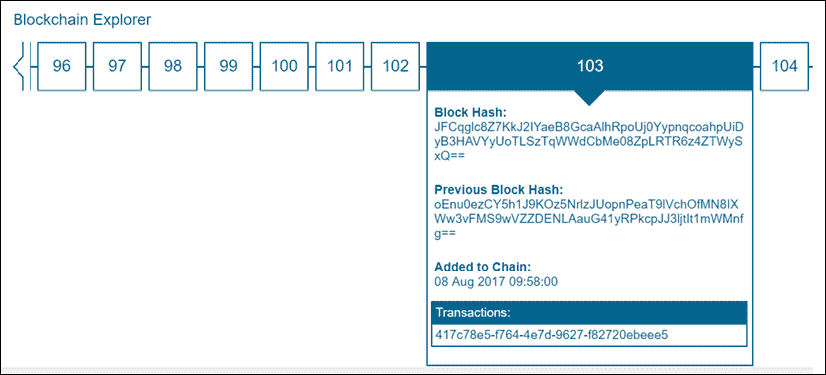
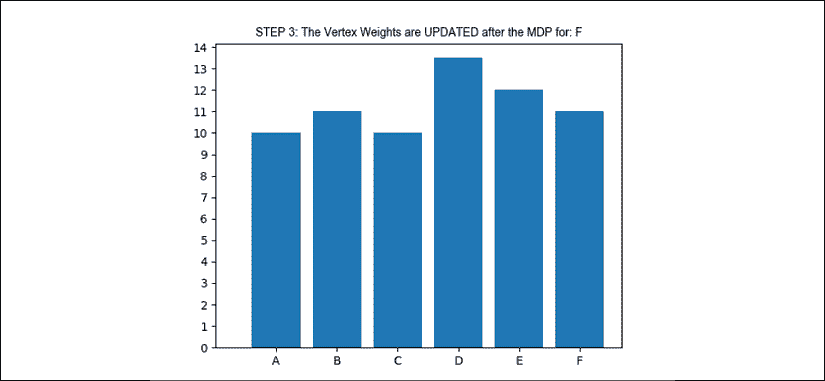
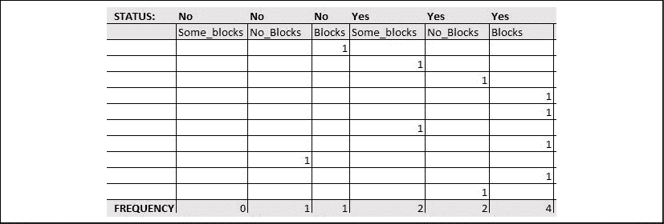

# 七、使用朴素贝叶斯优化区块链

在这个由三部分组成的章节中，我们将使用区块链通过朴素贝叶斯优化供应链。为了实现这一目标，我们将首先以理解如何使用加密货币生成区块链为例。

区块链已经进入公司，并在这里呆了下来。数百家大公司已经实现了 IBM Hyperledger。这些公司的供应商将逐渐加入网络。由于有数百万行代码需要更新新功能和维护，区块链公司将在未来许多年继续工作。

开采加密货币是区块链最广为人知的用途。加密货币正在世界各地发展。本章首先以比特币为例，解释了区块链的矿业是如何运作的。

然后，我们将继续分析如何将区块链用于不同于生成加密货币的目的。例如，公司使用区块链记录公司之间的交易。

IBM 成立于 1911 年，是当今该领域最有经验的公司。谷歌、亚马逊和微软也提供创造历史的机器学习平台。然而，IBM 提供了机器学习平台，这些平台得到了该公司 100 多年经验的支持。

IBM 在计算机和软件市场的多年经历有些坎坷。一些糟糕的决定给公司带来了很多世界范围的问题。IBM 从这些错误中吸取了教训，现在提供了强大的解决方案，包括 IBM Hyperledger for 区块链解决方案。IBM 提倡在公司交易中使用区块链。

我们将最终转向本章的第三部分，这一部分解释了区块链对世界各地的公司意味着什么，以及如何使用信息区块链来提供具有人工智能的优化算法。朴素贝叶斯将应用于区块链样本，以优化库存水平。

本章将涵盖以下主题:

*   区块链的背景
*   利用区块链挖掘比特币
*   使用区块链进行商业交易
*   区块链的块如何提供在公司之间共享信息的独特方式
*   将人工智能应用于区块链的区块，以预测和建议交易
*   朴素贝叶斯
*   如何对区块链的块使用朴素贝叶斯来预测进一步的事务和块

让我们先简单介绍一下区块链。

# 第一部分-区块链技术的背景

在本节中，我们将和区块链一起探讨加密货币挖掘。用区块链生产比特币使这项技术具有了颠覆性。本节的目的是在继续区块链技术的后续应用之前，理解区块链探险是如何开始的。

区块链技术将改变每个领域的交易。区块链出现在 2008 年。没有人确切知道是谁发明了它们。每个块都包含其前身(前一个块)的加密散列、日期时间(时间戳)数据和有关事务的信息。

1000 多年来，交易大多是本地簿记系统。在过去的 100 年里，尽管计算机时代改变了信息管理的方式，但事情并没有改变太多。每家公司继续对自己的交易保密，只是通过繁琐的系统分享一些信息。

**区块链**使交易**区块**对产生交易的全球网络可见。

要记住的基本概念是**共享**和**隐私控制**。这两种想法似乎造成了认知上的不一致，这是无法解决的。然而这个问题已经解决了，它将改变世界。

当一个块(任何种类的事务)被生成时，它被整个网络共享。如果该块的监管者希望该信息保持私有，则读取该块内的信息的许可仍然是可管理的，因此是私有的。

无论目标是通过区块挖掘比特币，还是使用区块进行交易，人工智能都会很快增强这种创新。

在接下来的章节中，我们将更详细地讨论区块链及其应用。了解如何生产加密货币的区块将使我们能够掌握区块链技术。一旦我们理解了区块链技术，就更容易理解这种安全的加密方法如何应用于加密货币之外的任何类型的商业交易。我们先去挖矿吧！

## 挖掘比特币

在区块链创建一个区块并不一定会产生比特币，这是一种与其他交易形式一样的交易形式。但了解如何挖掘加密货币为了解区块链以及如何将它们应用到许多其他领域提供了一个很好的方法。

挖掘一个比特币意味着为一个有效的交易创建一个数学块，并将这个块添加到链中；区块链:

*区块链* = { *区块* [1] ，*区块* [2] ，*区块刚加了* … *区块* [n] }

区块链不能回到过去。这就像生活中的时间约会功能。在第*分钟 m* 时，你做某件事，在第*分钟 m* 时+ 1 件事，在第*分钟 m* + *n* 件事，以此类推。你不能回到过去。木已成舟。

当一个区块被添加到比特币链中时，就没有办法撤销交易。

比特币挖矿的全球网络由**个节点**组成。使用适当的软件，您可以打开一个端口，分配大约 150+ GB 的磁盘空间，并生成新的数据块。这些节点相互通信，并将信息转发给整个网络中的其他节点。

一个节点要成为矿工，它必须解决复杂的数学难题，这是比特币程序的一部分。

要解决这个难题，软件必须找到一个与生成的块中的数据相结合的特定范围内的数字。该数字通过哈希函数传递。

你可以把这个数叫做 **nonce** ，它只使用一次。例如，必须为比特币生成一个介于 0 和 4，294，967，296 之间的整数。

这个过程是随机的。软件生成一个数字，通过哈希函数传递，然后发送到网络。第一个**挖掘器**产生预期范围内的数字，通知整个网络该特定块已经生成。网络的其余部分停止在该块上工作，并转移到另一个块上。

矿工的报酬自然是用比特币支付的。考虑到网络中的竞争和产生正确结果所需的成本(CPU、电力、磁盘空间和时间),它代表了很多钱，但很难获得。

开采比特币或任何其他加密货币的成本与开采所得之间必须保持恒定的平衡。

谈过了挖掘比特币，我们就简单讨论一下实际使用加密货币。

## 使用加密货币

小心使用加密货币。现在有 1500 多种加密货币。这个概念听起来很吸引人，但结果仍然是货币。货币可能会波动，如果发生崩盘，你可能会在不到一小时内失去一生的积蓄。

**黄金法则**:如果你无法抗拒投资加密货币，就不要投资超过你承受得起的损失。

也就是说，要使用加密货币，首先要设置一个钱包来存储你的比特币。钱包可以是在线的，通过提供商，或者甚至是离线的。

一旦完成，你就可以随心所欲地用现金或使用信用卡、借记卡和转账来购买比特币。

请记住，你购买这些货币就像购买任何其他货币一样，既有潜力，也有风险。

在本节中，我们看到了区块链时代如何从比特币生产开始，以了解如何使用区块链通过比特币挖掘加密货币。记住了区块链被创造的最初方式，我们可以将区块链应用到许多其他领域。

在我们的三部分章节的第二部分，我们将了解如何在加密货币之外使用区块链。我们将把它们应用到供应链中。

# 第二部分——利用区块链共享供应链中的信息

在*第一部分——区块链技术的背景*中，我们看到了如何使用区块链挖掘加密货币。进入区块链世界的先决条件已经实现，本节将展示如何在供应链中使用区块链。这将不涉及加密货币。它开启了用人工智能创新区块链的道路。

供应链是一个生产和服务链，将产品从起点送到消费者手中。例如，从印度运到突尼斯的一卷布料。在突尼斯，布料被裁剪成图案，然后组装成衣服。然后衣服被运到法国，在那里被包装在一个印有品牌的盒子里。然后，它被储存在仓库里，运送到实体店或直接给网上顾客。我们可以将这个供应链总结如下:

*布料从印度*->-*裁剪，在突尼斯*->-*运往法国*->-*打包*->-*储存*->-*运往商店或直接送给消费者*

一个供应链流程，如服装生产和交付系统，沿途涉及成千上万的人:生产现场、运输人员、仓库员工和链条每一步的管理团队。

这就是现代区块链技术在一个系统中跟踪所有交易的便利之处。

在下面的例子中，我们将选取名为 A、B、C、D、E 和 f 的六家公司。在*第 1 章*、*通过强化学习开始下一代人工智能*中，我们使用了一个大小为六的奖励矩阵。在那一章中，我们用 A、B、C、D、E 和 F 来表示强化学习的马尔可夫决策过程中的位置。在本章的最后，我们看到奖励矩阵可以应用于许多不同的领域。在我们的例子中，我们将这六个项目(A、B、C、D、E 和 F)称为供应链流程中的公司及其位置(在本例中为每个公司一个)。

每个公司，从 A 到 F，都是使用区块链的供应链成员，可以优化其活动。不是每个公司都有单独的交易分类账，一个中央区块链将包含所有交易(块):

*   这些布料离开印度的时间和数量
*   它什么时候上船的，花了多长时间
*   当船到达突尼斯时
*   …直接面向消费者的所有中间活动

有了这些数据，区块链的区块(交易记录)已经成为机器学习的金矿，可以用来检测信息和进行预测。使用该系统的一个有利可图的原因是降低库存水平。堆积未售出的商品以期待销售是昂贵的，而且会毁掉公司的利润。相反，如果供应链中的每个公司都可以通过区块链的区块看到其他合作伙伴的库存水平和真实需求，他们就可以根据需求调整库存水平，从而节省大量资金！

让我们以 IBM 软件为例来看看这是如何工作的。

基于 Hyperledger Fabric 的 IBM 区块链为世界各地的公司提供了一种共享区块链交易网络的方式，而不必担心采矿或使用加密货币。

该系统基于 Linux 基金会项目。Hyperledger 是一个由 Linux 基金会主持的开源协作项目。

在这一层，Hyperledger 使用区块链来保证安全交易，而无需尝试优化加密货币方面。该软件在所有相关方共享的区块链网络中生成区块，但他们不必购买货币意义上的加密货币——只需购买技术意义上的加密货币。

在下图中，我们将使用六个节点(公司 A 到 F)来说明我们在*第 1 章*、*通过强化学习开始下一代人工智能*中学习的马尔可夫决策过程如何应用于区块链:


图 7.1:马尔可夫决策过程图

每个节点代表一个参与为这六个公司建立的 IBM Hyperledger 网络的公司，如下表所示:

| **公司** | **活动** | **毫升重量** |
| A 在这个网络中买卖服装和其他产品。 | 向网络提供商品，但保持低库存水平 | 库存水平 |
| 在这个网络中买卖布料和其他产品。 | 向网络提供商品，但保持低库存水平 | 库存水平 |
| 在这个网络中买卖钮扣和其他产品。 | 向网络提供商品，但保持低库存水平 | 库存水平 |
| 在这个网络中买卖印花织物和其他产品。 | 向网络提供商品，但保持低库存水平 | 库存水平 |
| E 在这个网络中买卖配件(皮带、手镯)和其他产品。 | 向网络提供商品，但保持低库存水平 | 库存水平 |
| F 在这个网络中买卖包装盒和其他产品。 | 向网络提供商品，但保持低库存水平 | 库存水平 |

工作台的结构如下:

*   **公司**包含六个公司，{A，B，C，D，E，F}，它们有不同的活动。在本例中，每个公司只有一个位置，因此 A 到 F 也是公司位置。
*   **活动**:该集团的一部分公司向其成员供货，但确保昂贵的库存水平保持在较低水平。
*   **ML weight** 表示通过 ML 对库存水平进行分类，以进行预测。在我们的例子中，产生利润的关键是跟踪供应链中每个成员(A 到 F)的库存水平。例如，如果公司 F 的库存水平下降，网络的其他成员(A 到 E)可以预测并交付有限的必要数量，以使 F 的库存水平再次达到可接受的水平。

随着每年数百万的商业交易和大量的运输(卡车、火车、轮船、飞机)，如果没有像 IBM Hyperledger 这样的解决方案，在 21 世纪有效地管理这种类型的网络变得越来越复杂。

有了 IBM Hyperledger，这些公司有了一个带有智能合同(在线)和实时跟踪的**在线交易分类账。**

交易是安全的；在网络成员中，它们可以是私有的或公共的，它们为人工智能解决方案提供实时优化信息。

## 在供应链网络中使用区块链

*IBM Hyperledger 为人工智能开发者提供了超越任何其他数据集的独特优势——实时更新的 100%可靠的数据集。*

网络的每个公司成员(A 到 F)将为每笔交易创建一个块，以便人工智能分析师可以访问数据来进行预测。为了使系统工作，网络的每个成员(A 到 F)将在区块链中创建块，以便其他人可以查看记录的信息并使用这些信息来做出决策。

## 创建块

使用所描述的用于挖掘比特币的方法来形成块，除了这一次，货币不是目标。目标是在必要时使用智能合约进行安全交易。下面的截图是一个可以定制的标准 IBM 界面:


图 7.2:标准 IBM 界面

你可以看到构成区块链的各个独特的板块。IBM Hyperledger 中的每个块都有一个唯一的编号。在本例中，它是带有放大块 **103** 的 **111** 。

在我们的图(A 到 F)中的供应链网络中的一个块可以是带有合同的产品 X 的购买。例如，交易可以在公司 A 和 B 之间进行。下一步可能是将产品从 A 地运输到 B 地，例如在区块链网络中。

附加到该块的信息位于 Hyperledger 存储库中:公司名称(A 到 F)、地址、电话号码、交易描述以及公司网络所需的任何其他类型的数据。每个块都可以被所有人或部分人查看，这取决于附加到它的权限属性。

## 探索街区

探索区块为人工智能程序提供了一座金矿:真实的、100%可靠的数据集。

人工智能优化的有趣部分是块信息，如下图所示。当前块与前一个块和交易代码一起被添加到链中:



图 7.3:探索区块链

请注意，给定块的块哈希(参见前面的挖掘部分)链接到前一个块哈希，并拥有唯一的事务代码。

一旦我们有了一组数据(交易类型、日期、金额)，我们就可以开始构建人工智能预测算法。IBM 通过脚本和其他工具提供了提取的可能性。

一旦我们有了包含区块链块的数据集，预测的目标将是确定库存级别类别，以查看供应链网络(A 到 F)的成员是否需要补充。

区块链提供的数据可用于预测网络在每次交易后将面临的库存水平类型。每个公司将能够运行一个预测算法，使用现有的数据来预测潜在的补货需求。例如，公司 A 可能发现公司 B 需要更多的布料。

考虑到数据量，朴素贝叶斯等预测算法可以完成这项工作。

# 第三部分——在区块链过程中用朴素贝叶斯优化供应链

朴素贝叶斯将使用一些关键信息作为**特征**，以在实时过程中优化仓库存储和产品可用性。

朴素贝叶斯学习函数将从前面的块中学习如何预测应该插入区块链的下一个块(供应需要更多股票的另一家公司)。这些块将被插入到数据集中，就像任何其他形式的带有时间戳的数据一样，以便进行预测。

朴素贝叶斯基于贝叶斯定理。贝叶斯定理应用条件概率，定义如下:


*   *P* ( *A* | *B* )是一个**后验概率**，观察到一些事件后 *A* 的概率( *B* )。这也是一个**条件概率**:假设 *B* 已经发生，则 *A* 发生的可能性。
*   *P*(*B*|*A*)是给定先验观测值 *A* 的情况下 *B* 的概率。也是条件概率:给定 *A* 已经发生的情况下 *B* 发生的可能性。
*   *P* ( *A* )是 *A* 在观测之前的概率。
*   *P* ( *B* )是预测的概率。

朴素贝叶斯虽然基于贝叶斯定理，但它假设一个类中的特征是相互独立的。在许多情况下，这使得预测更容易实现。相关或不相关的特征的统计存在将产生预测。只要预测保持足够的效率，朴素贝叶斯提供了一个很好的解决方案。

## 朴素贝叶斯例子

在这一节中，在编写 Python 程序之前，我们将首先用一个数学例子来说明朴素贝叶斯。本节的目标只是理解朴素贝叶斯中涉及的概念。

这一部分不是开发章节，而是理解真实例子的基本概念和用于预测的数学的章节。

本章中的区块链代表基于服装行业制成品的库存水平信息。有关更多信息，请阅读*第 12 章*、*人工智能和物联网(IoT)* ，其中详细描述了人工智能优化的服装制造流程。

在这一部分，我们将重点讨论存储。服装行业中一个缝纫站的负荷以**库存单位**(**SKU**)中的数量表示。例如，SKU 可以是产品 P:一条给定尺寸的牛仔裤。

服装一旦生产出来，就被存放起来。此时，区块链中的块可以用机器学习算法的两个有用特征来表示该事务:

*   衣服存放的那天
*   现在库存 SKU 服装的总量

区块链中的块包含交易信息中存储的日期(时间戳)和数量。

由于区块链包含作为网络一部分的所有 A、B、C、D、E 和 F 公司位置的存储块，机器学习程序可以访问数据并做出预测。

目标是将给定产品的存储数量平均分布在六个位置，如下图所示:



图 7.4:分布在六个位置的产品存储水平直方图

该屏幕截图显示了分布在六个位置的产品 P 的存储水平。这个区块链网络中的每个位置都是一个**中心**。**供应链管理** ( **SCM** )中的一个枢纽往往是一个中间存储仓库。例如，为了覆盖这六个位置的区域，相同的产品将存储在每个位置。这样，当地的卡车可以过来提货。

*目标是在需要时在点位置 L (A 到 F)有可用的产品 P。*

例如，从一个位置 *L* 到一个位置点*a*1(一个商店或家)的交付时间只需要几个小时。例如，如果 A 没有储存 P，那么更好的消费者将不得不等待产品从 C 到达 A。

如果区块链网络组织良好，一个地点可以专门生产产品 P(最佳生产成本),并平均分配六个地点储存的数量，包括它自己。

通过在所有位置保持均衡的储存量，系统将在一个连续的交付过程中流动。

在我们的例子中，一个公司=它的位置(A 到 F)。例如，使用这六个成员的区块链块，我们可以预测给定存储点(A 到 F)何时需要补充以减少等待时间。

使用区块链优化存储级别是一种高效的新方法，可以在降低成本的同时更快地交付给客户。

### 区块链期待新奇

以前，这六个位置(A 到 F)的所有仓库都必须确保每个位置的最低存储水平。由于他们不知道他们的供应链网络中实时发生了什么，他们经常存储比所需更多的产品，这增加了他们的成本，或者没有存储足够的产品，导致交付问题。

在一个实时生产和销售的世界里，经销商需要预测需求。该系统需要由需求驱动。朴素贝叶斯可以解决这个问题。

它将考虑前两个特征:

*   **日**:服装存放的日期
*   **库存**:现在库存的那件 SKU 服装的总量

然后会增加一个新奇的东西——*与产品 P 相关的块数*。

给定日期的高数量的块意味着该产品在总体上是有需求的(生产、分销)。区块越多，交易就越多。此外，如果存储水平(库存特征)正在减少，这是一个指标；这意味着必须补充存储水平。日功能标记了产品的历史。

该块特征被命名为**块**。由于所有人都共享区块链，机器学习程序可以在几秒钟内访问可靠的全球数据。区块链提供的数据集可靠性本身就构成了使用区块链的块作为数据集来优化存储级别的动机。

### 目标—使用区块链数据优化存储级别

目标是*通过在提出产品需求时提供快速交付，将库存维持在较低水平*。为了做出决定，ML 解决方案将实时分析区块链的块。

该程序将获取给定产品 P 的日、库存和块(数量)特征，并产生结果。结果预测这个产品 P 是否会有需求。如果答案是肯定的(或 1)，这种产品的需求需要预测。

#### 步骤 1–定义数据集

数据集包含来自序列中先前事件的原始数据，这使得它非常适合预测算法。例如，可以使用来自 IBM Hyperledger 的脚本提取块。这构成了一个独特的机会，可以看到所有公司的数据，而不必建立一个数据库。原始数据集将如下所示:


图 7.5:原始数据集

该数据集包含以下内容:

*   产品 P 的`Blocks`在第`x`天出现在区块链，扫描区块链 30 天。`No`表示没有发现大量的块体。`Yes`表示已发现大量区块。如果发现了区块，这意味着区块链沿岸某个地方对这种产品有需求。
*   `Some_blocks`意味着块已经被发现，但是它们太稀疏以至于在不过度拟合预测的情况下不被考虑。然而，`Yes`将和`No`一样对预测有贡献。
*   `No_blocks`表示完全没有需求，稀疏或其他(`Some_blocks`)，众多(`Blocks`)或没有。这意味着这个产品的麻烦，p。

目标是避免预测稀少(`Some_blocks`)或缺乏(`No_blocks`)产品的需求。本例试图预测产品 p 的多个块的潜在`Yes`，只有预测到`Yes`，系统才能触发自动需求流程(参见本章后面的*在 Python 中实现朴素贝叶斯*部分)。

#### 步骤 2–计算频率

查看下面的频率表提供了附加信息:



图 7.6:频率表

给定产品 P 在给定期间(过去 30 天)的每个功能(`Blocks`、`Some_blocks`或`No_blocks`)的`Yes`和`No`状态已按频率分组。

每个`No`功能和`Yes`功能的总和在底线上。比如`Yes`和`No_blocks`加起来就是 2。

一些附加信息将证明对最终计算有用:

*   总样本数= 10。
*   `Yes`样本总数= 8。
*   `No`样本总数= 2。

#### 步骤 3–计算可能性

现在**频率**表已经计算出来，下面的**似然度**表是使用该数据产生的:


图 7.7:可能性表

该表包含以下统计信息:

*   `No` = 2 = 20% = 0.2
*   `Yes` = 8 = 80%=0.8
*   `Some_blocks` = 2 = 20%=0.2
*   `No_blocks` = 3 = 30%=0.3
*   `Blocks` = 5 = 50%=0.5

`Blocks`代表样本的重要比例，这意味着与`Some_blocks`一起，需求看起来不错。

#### 步骤 4–应用朴素贝叶斯方程

现在的目标是在朴素贝叶斯方程中表示贝叶斯定理的每个变量，以获得**对产品 P 的需求**的概率，并触发区块链网络的购买场景。贝叶斯定理可以表述如下:


*   *P* ( *是* | *挡* ) = *P* ( *挡* | *是* ) * *P* ( *是* )/ *P* ( *挡*)
*   *P* ( *是* ) = 8/10 = 0.8
*   *P* ( *块* ) = 5/10 = 0.5
*   *P* ( *块* | *是* ) = 4/8 = 0.5
*   *P* ( *是* | *块* ) = (0.5*0.8)/0.5 = 0.8

这个要求看起来可以接受。然而，处罚是必要的，并且还必须考虑其他因素(通过其他区块勘探过程的运输可用性)。

这个例子和方法展示了朴素贝叶斯方法的概念。这个例子只不过是对贝叶斯定理哲学的一个简化的数学解释。

通过从头开始做这个计算，我们现在知道了贝叶斯定理的基本概念:使用先验值来预测未来事件，同时考虑几个特征。

我们现在将从这种理论方法进入实施阶段。我们将使用 Python 中的朴素贝叶斯构建一个程序。

## 朴素贝叶斯在 Python 中的实现

本节展示了如何使用朴素贝叶斯的库存水平优化版本。区块链为寻找优化领域和创造利润的 ML 矿商提供了非常可靠的数据集。选择正确的模式仍然是关键的挑战。

### 高斯朴素贝叶斯

我们将实现高斯朴素贝叶斯，因为它适合服装行业。比如你卖连衣裙，会有一个目标中号 *S* 。营销部门知道这个尺码的 S 将代表大部分的销售额。较大的 *S* + *n* 尺寸和较小的*S*–*n*将产生较少的销售，形成高斯曲线。

在实施模式下，将使用包含来自区块链的原始数据的数据集，而不使用下表中的朴素贝叶斯的要素解释函数:

| **天** | **股票** | **积木** | **需求** |
| 10 | 1455 | 78 | 一 |
| 11 | 1666 | 67 | 一 |
| 12 | 1254 | 57 | 一 |
| 14 | 1563 | 45 | 一 |
| 15 | 1674 | 89 | 一 |
| 10 | 1465 | 89 | 一 |
| 12 | 1646 | 76 | 一 |
| 15 | 1746 | 87 | 2 |
| 12 | 1435 | 78 | 2 |

每行代表一个块:

*   `DAY`:数据集中分析的周期的日期。在这种情况下，我们分析的是给定月份的天数，它代表一个财务周期。运行计算不需要其他信息。在其他情况下，可以使用 dd/mm/yyyy 格式。您也可以从周期开始的第一天开始使用一个计数器(1 到 *n* ),并在几周、几个月或几年内运行它。
*   `STOCK`:在块中找到的给定位置(A、B 或… F)的总输入，并在当天合计。由于这表示一个位置且仅一个位置的输入，因此不需要位置信息。在其他情况下，可以添加位置。
*   `BLOCKS`: The number of blocks containing product P for location A, for example.

    在`BLOCK`列中的高块数和在`STOCK`列中的低数量意味着需求高。

*   `DEMAND = 1`. The proof of demand is a transaction block that contains a purchase in the past. These transaction blocks provide vital information.

    `BLOCK`列中的低块数和`STOCK`列中的高数量意味着需求低。

*   `DEMAND = 2`。未发现交易的证明。

**朴素贝叶斯的极限**

在某些情况下，`DEMAND = 1`当股票高而板块低的时候。这就是为什么严格相关没有那么有用的原因。这将是朴素贝叶斯的极限，它只是分析统计数据并学习如何预测，而忽略了实际的条件概率，即特征之间的相互作用。

在本节中，我们描述了在编写带有现成算法的朴素贝叶斯程序时将会考虑到的数据集和特征。

#### Python 程序

我们现在知道什么是区块链，以及如何使用区块链的块来优化公司网络(A 到 F)位置的股票水平。我们也知道贝叶斯定理和朴素贝叶斯的基本概念。

考虑到这一点，我们可以构建一个 Python 程序来预测区块链传入块的股票级别类别。这些预测将帮助当地经理增加他们的库存水平，以满足他们所在供应链中的合作伙伴(公司 A 到 F)的需求。

Python `naive_bayes_blockchains.py`程序使用了一个`sklearn`类。考虑下面的片段:

```
import numpy as np

import pandas as pd

from sklearn.naive_bayes import GaussianNB 
```

它将数据集读入数据结构。以下代码将`data_BC.csv`读入`df`:

```
#Reading the data

df = pd.read_csv('data_BC.csv')

print("Blocks of the Blockchain")

print(df.head()) 
```

它在以下输出中打印文件的顶部:

```
Blocks of the Blockchain

DAY STOCK BLOCKS DEMAND

0 10 1455 78 1

1 11 1666 67 1

2 12 1254 57 1

3 14 1563 45 1

4 15 1674 89 1 
```

它准备训练集，在下面的代码中使用`X`查找和预测`Y`:

```
# Prepare the training set

X = df.loc[:,'DAY':'BLOCKS']

Y = df.loc[:,'DEMAND'] 
```

它选择类别并训练以下`clfG`模型:

```
#Choose the class

clfG = GaussianNB()

# Train the model

clfG.fit(X,Y) 
```

然后程序获取区块链的一些块，进行预测，并使用下面的`clfG.predict`函数打印出来:

```
# Predict with the model(return the class)

print("Blocks for the prediction of the A-F blockchain")

blocks=[[14,1345,12],

        [29,2034,50],

        [30,7789,4],

        [31,6789,4]]

print(blocks)

prediction = clfG.predict(blocks)

for i in range(4):

    print("Block #",i+1," Gauss Naive Bayes Prediction:",

           prediction[i]) 
```

显示块，并产生以下预测。`2`表示暂时没有需求；`1`将触发一个购买阻止:

```
Blocks for the prediction of the A-F blockchain

[[14, 1345, 12], [29, 2034, 50], [30, 7789, 4], [31, 6789, 4]]

Block # 1 Gauss Naive Bayes Prediction: 1

Block # 2 Gauss Naive Bayes Prediction: 2

Block # 3 Gauss Naive Bayes Prediction: 2

Block # 4 Gauss Naive Bayes Prediction: 2 
```

这是一个补给计划。它将模拟需求。找不到需求，什么都不会发生；当发现需求时，它触发一个购买块。一些连锁店知道某一天(或一周或另一个单位)购买的服装数量，并自动购买该数量。其他人有其他购买规则。寻找业务规则是项目咨询方面的一部分。

在本节中，我们实现了朴素贝叶斯来预测传入块的类别。如果需求很高，那么供应链经理就会知道需要储存更多的产品。

如果需求低，经理会避免储存更多的产品。区块链中的块为全天候扫描块并实时生成建议的程序提供了可靠的数据集。

# 摘要

区块链中可靠的块序列为无尽的机器学习算法打开了大门。朴素贝叶斯似乎是开始优化区块链块的实用方法。它通过学习数据集的独立特征来计算相关性并做出预测，而不管这种关系是否是有条件的。

这种自由式预测方法符合区块链思想开放的精神，这种精神如今正被数百万人用无限的资源传播。

IBM Hyperledger 通过 Linux 基金会项目将区块链的“边疆”开发带到了另一个层次。IBM 还提供云平台和服务。

IBM、微软、亚马逊和谷歌为云平台提供了一系列颠覆性的机器学习算法。这为您的市场或部门提供了一个顺畅的途径，同时能够在短时间内在线建立一个区块链原型。使用这种方法，您可以在模型中输入一些额外的原型数据，导出数据，或者使用 API 来读取块序列。然后，你将能够将机器学习算法应用于这些可靠的数据集。唯一的限制是我们的想象力。

下一章将带领我们进入更多的人工智能领域，探索神经网络的世界。

# 问题

1.  加密货币是当今区块链的唯一用途。(是|否)
2.  开采区块链可能有利可图。(是|否)
3.  公司的区块链不能应用于销售。(是|否)
4.  区块链的智能合同比标准的离线合同更容易书写。(是|否)
5.  一旦一个区块在区块链网络中，网络中的每个人都可以阅读其内容。(是|否)
6.  区块链中的块保证绝对没有欺诈可能。(是|否)
7.  应用贝叶斯定理只有一种方法。(是|否)
8.  训练朴素贝叶斯数据集需要一个标准函数。(是|否)
9.  机器学习算法不会改变公司业务的本质。(是|否)

# 进一步阅读

*   想在 scikit-learn 网站上了解更多关于朴素贝叶斯的信息:[https://scikit-learn.org/stable/modules/naive_bayes.html](https://scikit-learn.org/stable/modules/naive_bayes.html)
*   探索 IBM 的 Hyperledger 解决方案:【https://www.ibm.com/blockchain/hyperledger.html 