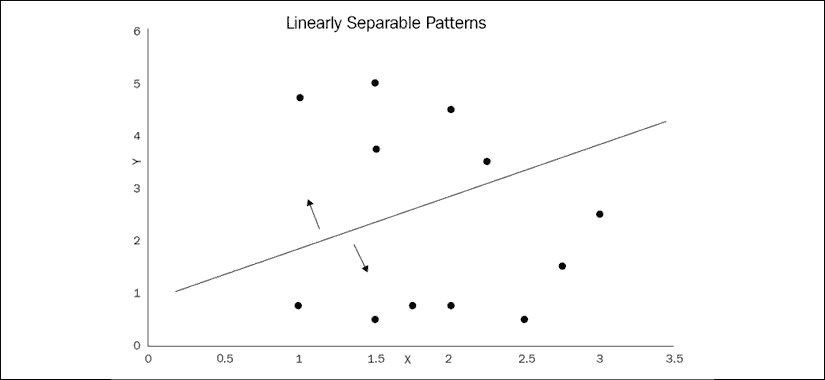
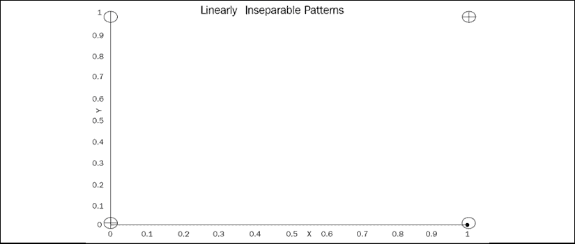
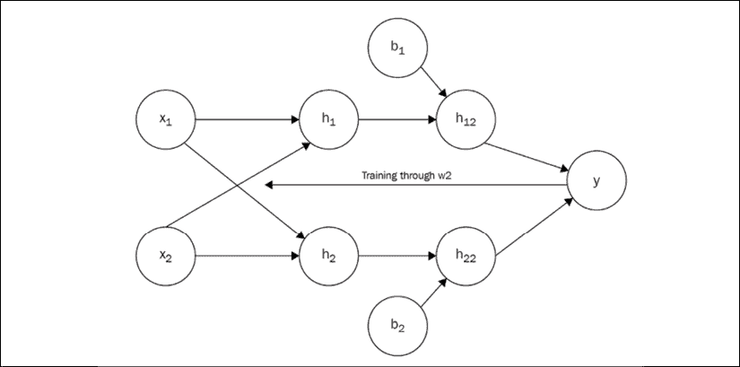
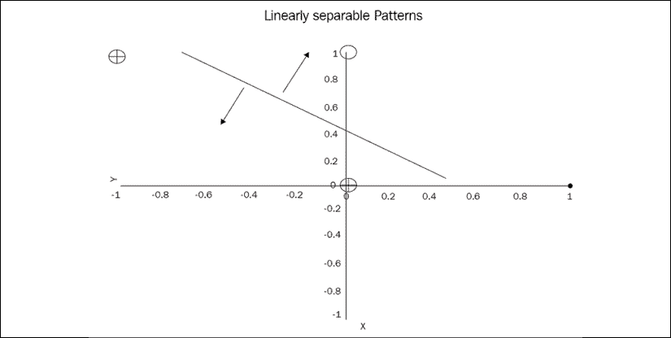

<title>Chapter_8</title>

# 8

# 用前馈神经网络解决异或问题

在一个公司项目的过程中，总会有一个看似不可能解决的问题突然出现。在那一点上，你尝试了你所学的一切，但是它对你的要求不起作用。你的团队或客户开始转向别处。是时候做出反应了。

在本章中，一个不可能解决的关于材料优化的商业案例将通过手工制作的**前馈神经网络** ( **FNN** )的版本成功解决。

前馈网络是深度学习的关键构建模块之一。围绕 XOR 函数的斗争完美地说明了深度学习如何在企业环境中重新流行起来。XOR 是一个异或函数，我们将在本章后面探讨。异或 FNN 说明了神经网络的一个关键功能:**分类**。一旦信息被分类成子集，它就为**预测**和神经网络的许多其他功能打开了大门，例如表征学习。

XOR FNN 将从零开始构建，从一开始就揭开深度学习的神秘面纱。将应用一种老式的、从头开始的方法，将深度学习的宣传吹到桌面上。

本章将涵盖以下主题:

*   解释异或问题
*   如何手工制作 FNN
*   用 FNN 解异或
*   分类
*   反向传播
*   成本函数
*   成本函数优化
*   误差损失
*   趋同；聚集

在我们开始构建 FNN 之前，我们将首先介绍 XOR 及其在第一个人工神经模型中的局限性。

# 最初的感知器不能解决异或功能

最初的感知器是在 20 世纪 50 年代设计的，并在 20 世纪 70 年代末进行了改进。最初的感知器包含一个不能解异或函数的神经元。

异或功能意味着你必须选择一个异或(XOR)。

这可能很难理解，因为我们不习惯思考我们在日常生活中使用*或*的方式。事实上，我们总是交替使用*或*作为包含或排除。举个简单的例子:

如果有朋友来看我，我可能会问他们:“你想喝茶还是咖啡？”这基本上是茶 XOR 咖啡的报价；我不希望我的朋友既要茶又要咖啡。我的朋友会选择其中之一。

我可以接着问:“你要牛奶还是糖？”在这种情况下，如果我的朋友两者都想要，我不会感到惊讶。这是一个包含的*或*。

因此,“异或”意味着“你可以选择其中一个，但不能两个都选”

我们将在本章通过更多的例子来发展这些概念。

为了解决这个异或函数，我们将建立一个 FNN。

一旦建立了用于解决 XOR 问题的前馈网络，它将被应用于优化实例。材料优化示例将在数十亿个维度中选择最佳的维度组合，以通过 XOR 函数的泛化来最小化公司资源的使用。

首先，必须阐明感知器的 XOR 限制的解决方案。

## 异或和线性可分模型

在 20 世纪 60 年代末，数学上证明了感知器不能解决异或函数。幸运的是，今天，感知器及其 neocognitron 版本构成了神经网络的核心模型。

你可能会忍不住想，*那又怎样？*然而，整个神经网络领域都依赖于解决像这样的模式分类问题。如果没有模式分类，图像、声音和文字对机器来说毫无意义。

### 线性可分模型

麦卡洛克-皮茨 1943 年的神经元(见*第二章*、*构建奖励矩阵——设计你的数据集*)导致了罗森布拉特 1957-59 年的感知器和 1960 年的 Widrow-Hoff 自适应线性元件(Adaline)。

这些模型是基于 *f* ( *x* ， *w* )函数的线性模型，需要一条线来分隔结果。感知器无法实现这个目标，因此无法对它面对的许多对象进行分类。

标准线性函数可以分离值。**线性可分性**可以用下图表示:



图 8.1:线性分离模式

想象一下，分隔前面的点的线和它下面的部分代表一幅需要由机器学习或深度学习应用程序来表示的图片。线上面的点代表天空中的*云*；线下面的点代表山上的树。这条线代表那座山的坡度。

为了能够线性分离，一个函数必须能够将*云*从*树*中分离出来，以便对它们进行分类。分类的先决条件是某种线性或非线性的可分性。

### 线性模型(如原始感知器)的异或极限

线性模型无法解决 XOR 问题，如下表所示:

| **x1 的值** | **x2 的值** | **输出** |
| 一 | 一 | 0 |
| 0 | 0 | 0 |
| 一 | 0 | 一 |
| 0 | 一 | 一 |

第 3 行和第 4 行显示了一个异或(XOR)。想象你给一个孩子一块蛋糕或一块糖果(1 或 1):

*   **案例一**:孩子回答:“我要糖，要不就什么都不要！”(0 或 1)。那就是异或(XOR)！
*   **案例二**:孩子回答:“我要蛋糕，不然什么都不要！”(1 或 0)。这也是一个异或(XOR)运算！

下图显示了由一个感知器表示的 XOR 函数的线性不可分性:



图 8.2:线性不可分的模式

表中的值表示该图中的笛卡尔坐标。在(1，1)和(0，0)处有十字的圆不能与在(1，0)和(0，1)处的圆分开。这是个大问题。意味着弗兰克·罗森布拉特(Frank Rosenblatt)的 *f* ( *x* ， *w* )感知器无法分离，因而无法分类，这些点变成*云*和*树*。因此，在许多情况下，感知器不能识别需要线性可分性的值。

弗兰克·罗森布拉特发明了 20 世纪最强大的神经概念——一种可以学习的神经元——但在 20 世纪 60 年代，他不得不忍受这种限制。

正如前面蛋糕或糖果的例子所解释的，XOR 函数的缺乏限制了中的应用，你必须在两个选项中专门选择。在实际应用中有许多“非此即彼”的情况。对于自动驾驶汽车来说，它可以左转或右转，但在做出决定时不要前后急转弯！

我们将用一个老式的解决方案来解决这个限制，首先构建一个 FNN，然后实现它。

# 从零开始建造 FNN

让我们做一个心理实验。想象我们在 1969 年。我们有今天的知识，但没有什么可以证明它。我们知道感知器不能实现异或功能 XOR。

我们有优势，因为我们现在知道有解决方案。要开始我们的实验，我们只有一本拍纸簿、一支铅笔、一个卷笔刀和一块橡皮等着我们。在编程之前，我们准备在纸上从头开始解决 XOR 问题。我们必须找到一种方法，用神经网络对这些点进行分类。

## 步骤 1–定义 FNN

我们必须打破常规来解决这个问题。我们必须忘记二十一世纪的复杂词汇和理论。

我们可以用高中格式写一个神经网络层。隐藏层将是:

*h*[1]=*x***w*

好的。现在我们有一层。层仅仅是一个功能。该函数可以表示为:

*f* ( *x* ， *w* )

其中 *x* 是输入值， *w* 是某个值乘以 *x* 。隐藏是指计算不可见，就像 *x* = 2 和 *x* + 2 是导致 4 的隐藏层。

至此，我们已经用三行定义了一个神经网络:

*   输入 *x* 。
*   某个改变其值的函数，比如 2 × 2 = 4，它将 2。那是一层。而如果结果优于 2，比如，那就太好了！输出为 1，表示是或真。既然我们看不到计算，这就是*隐藏的*层。
*   一个输出。

*f* ( *x* ， *w* )是任何神经网络的构建模块。“前馈”意味着我们将从第 1 层到第 2 层，按顺序前进。

现在我们知道，基本上任何神经网络都是用通过运算转换成某种输出的值构建的，我们需要一些逻辑来解决 XOR 问题。

## 步骤 2–两个孩子每天如何解决异或问题的例子

下面是两个孩子如何用一个简单的日常例子解决异或问题的例子。我强烈推荐这个方法。我把非常复杂的问题分解成小部分，达到一个孩子的水平，通常几分钟就能解决。然后，你会得到别人讽刺的回答，比如“你就做了这些吗？”但是，当这个解决方案在高层次的公司项目中一次又一次地发挥作用时，讽刺就消失了。

首先，我们把异或问题转换成一个商店里的糖果问题。两个孩子去商店想买糖果。然而，他们的钱只够买一包糖果。他们必须在两包不同的糖果中做出选择。假设包装一个是巧克力，一个是口香糖。然后在这两个孩子讨论的过程中，1 代表是，0 代表不是，他们的预算限制了这两个孩子的选项:

*   去商店不买任何巧克力**或**口香糖=(不，不)= (0，0)。这不是这些孩子的选择！所以答案是假的。
*   去商店同时买巧克力**和**口香糖=(是，是)= (1，1)。那太棒了，但那是不可能的。太贵了。所以，很不幸，答案是错误的。
*   去商店买巧克力**或**口香糖= (1，0 或 0，1) =(是或否)或(否或是)。那是可能的。所以，答案是真的。

想象一下这两个孩子。老大是讲道理的。小的那个还不知道怎么数数，想把两包糖果都买下来。

我们在纸上表达这一点:

*   *x*[1] (eldest child's decision, yes or no, 1 or 0) * *w*[1] (what the elder child thinks). The elder child is thinking this, or:

    *x*1**w*[1]或*h*1=*x*[1]**w*[1]

    老大的孩子像我们每天都在做的一样权衡一个决定，比如买车( *x* = 0 或 1)乘以成本( *w* [1] )。

*   *x*[2] (the younger child's decision, yes or no, 1 or 0) * *w*[3] (what the younger child thinks). The younger child is also thinking this, or:

    *x*2**w*3 或*h*2=*x*2**w*3

**理论** : *x* [1] 和 *x* [2] 为输入。 *h* [1] 和 *h* [2] 是神经元(一个计算的结果)。由于 *h* *h*1 和*h*2 从而形成一个隐藏层。 *w*

现在想象两个孩子在互相交谈。

等一下！这意味着现在，每个孩子都在和其他孩子交流:

*   *x*[1] (the elder child) says *w*[2] to the younger child. Thus, *w*[2] = this is what I think and am telling you:

    *x*1**w*2

*   *x*[2] (the younger child) says, "please add my views to your decision," which is represented by *w*[4][:]

    *x*2**w*4

我们现在有了用高中水平的代码表达的前两个方程。它是一个人的想法加上一个人对另一个人说的话，要求另一个人考虑到这一点:

```
h1=(x1*w1)+(x2*w4) #II.A.weight of hidden neuron h1

h2=(x2*w3)+(x1*w2) #II.B.weight of hidden neuron h2 
```

`h1`总结一个孩子心里在想什么:个人观点+另一个孩子的观点。

`h2`总结对方孩子脑子里和谈话里在想什么:个人看法+对方孩子的看法。

**理论**:计算现在包含两个输入值和一个隐藏层。因为在下一步中，我们将对`h1`和`h2`进行计算，所以我们处于一个前馈神经网络中。我们正从输入转移到另一层，这将引导我们到另一层，以此类推。这个从一层到另一层的过程就是深度学习的基础。层数越多，网络就越深。`h1`和`h2`形成隐藏层的原因是它们的输出只是另一层的输入。

对于本例，我们不需要激活函数(如逻辑 sigmoid)中的复杂数字，因此我们声明输出值是否小于 1:

如果*h*[1]+*h*[2]>= 1 那么 *y* [1] = 1

如果*h*[1]+*h*[2]<1 那么 *y* [2] = 0

**理论** : *y* [1] 和*y*2 组成第二个隐藏层。这些变量可以是标量、向量或矩阵。它们是神经元。

现在，一个问题出现了。谁是对的？大孩子还是小孩子？

唯一的方法似乎是到处玩，用权重 *W* 代表所有权重。神经网络中的权重就像我们日常生活中的权重一样。我们一直在权衡决策。例如，有两本书要购买，我们将“权衡”我们的决定。举例来说，如果一个产品有趣且便宜，它在我们的决策中会或多或少地占一些权重。

我们这种情况的孩子至少在购买某样东西上是一致的，所以从现在开始，*w*[3]=*w*[2]，*w*[4]=*w*[1]。年幼和年长的孩子将因此分享一些决策权。

现在，必须有人成为有影响力的人。让我们把这项艰巨的任务留给大孩子吧。大一点的孩子更通情达理，会不断地传递坏消息。你必须从你的选择中减去一些东西，用减号(–)表示。

每当他们到达第一点时，最大的孩子就会对购买糖果持批评的否定态度。所有的事情都要确保不要超出预算。大孩子的意见有偏差，我们姑且称变量为 a 偏差，*b*1。既然小一点的孩子的观点也是有偏见的，那我们就称这个观点为偏见吧， *b* [2] 。由于长子的观点总是消极的，因此——*b*1 将适用于长子的所有想法。

当我们将这个决策过程应用于他们的观点时，我们得到:

*h*[1]=*y*[1]*–*b*[1]

*h*2=*y*2**b*2

然后，我们只需要使用相同的结果。如果结果> =1，则已达到阈值。阈值的计算如以下函数所示:

*y*=*h*[1]+*h*2

我们将首先开始有效地寻找权重，首先将权重和偏差设置为 0.5，如下所示:

*w*1= 0.2；*w*2= 0.5；*b*1= 0.5

*w*3=*w*2；*w*4=*w*1；*b*2=*b*1

它还不是一个完整的程序，但它的理论已经完成了。

只有两个孩子之间的交流在起作用；我们将只关注第一次尝试后修改*w*2 和*b*1 的。试了几次后，它在纸上工作了。

我们现在编写基本的数学函数，实际上是程序本身在纸上:

```
#Solution to the XOR implementation with

#a feedforward neural network(FNN)

#I.Setting the first weights to start the process

w1=0.5;w2=0.5;b1=0.5

w3=w2;w4=w1;b2=b1

#II.hidden layer #1 and its output

h1=(x1*w1)+(x2*w4) #II.A.weight of hidden neuron h1

h2=(x2*w3)+(x1*w2) #II.B.weight of hidden neuron h2

#III.threshold I, hidden layer 2

if(h1>=1): h1=1

if(h1<1): h1=0

if(h2>=1): h2=1

if(h2<1): h2=0

h1= h1 * -b1

h2= h2 * b2

#IV.Threshold II and Final OUTPUT y

y=h1+h2

if(y>=1): y=1

if(y<1): y=0

#V.Change the critical weights and try again until a solution is found

w2=w2+0.5

b1=b1+0.5 
```

让我们从纸面上的解决方案到 Python。

为什么 1969 年没有发现这个欺骗性的简单解决方案？因为*这在今天看来很简单，但在当时并非如此*，就像我们的天才前辈发现的所有发明一样。在人工智能和数学领域，没有什么是容易的。

在下一节中，我们将坚持这里提出的解决方案，并用 Python 实现它。

## 使用 FNN 和反向传播在 Python 中实现老式 XOR 解决方案

为了保持 1969 年老式解决方案的精神，我们将不使用 NumPy、TensorFlow、Keras 或任何其他高级库。用高中数学写一个带有反向传播的经典 FNN 很有趣。

如果你把一个问题分解成非常基本的部分，你会更好地理解它，并为那个特定的问题提供解决方案。你不需要用一辆大卡车来运输一条面包。

此外，通过思考儿童的想法，我们反对在现代 CPU 丰富的解决方案中运行 20，000 或更多集来解决异或问题。所使用的逻辑证明，只要一个偏差为负(年长的合理临界儿童)，两个输入可以具有相同的参数，以使系统提供合理的答案。

基本的 Python 解决方案在几个迭代中很快达到结果，大约 10 个迭代(时期或情节)，这取决于我们如何考虑它。一个时期可以与一次尝试相关联。想象看着某人练习篮球:

*   这个人把球扔向篮筐，但是没有击中。那是一个时代(也可以用一个插曲)。
*   The person thinks about what happened and changes the way the ball will be thrown.

    这种进步是它成为一个学习时代(或插曲)的原因。这不是简单的无记忆尝试。确实发生了一些事情来提高性能。

*   这个人一次又一次地投球(下一个时期)，直到整体表现有所改善。这就是神经网络如何随着时代而改进的。

`FNN_XOR_vintage_tribute.py`包含(在代码的顶部)一个有四列的结果矩阵。

矩阵的每个元素代表要求解的四个谓词的状态(`1` =正确，`0` =错误):

```
#FEEDFORWARD NEURAL NETWORK(FNN) WITH BACK PROPAGATION SOLUTION FOR XOR

result=[0,0,0,0] #trained result

train=4 #dataset size to train 
```

`train`变量是要求解的谓词的数量:(0，0)，(1，1)，(1，0)，(0，1)。要求解的谓词的变量是`pred`。

程序的核心是实际上是我们写的那张纸的副本，如下面的代码所示:

```
#II hidden layer 1 and its output

def hidden_layer_y(epoch,x1,x2,w1,w2,w3,w4,b1,b2,pred,result):

    h1=(x1*w1)+(x2*w4) #II.A.weight of hidden neuron h1

    h2=(x2*w3)+(x1*w2) #II.B.weight of hidden neuron h2

#III.threshold I,a hidden layer 2 with bias

    if(h1>=1):h1=1;

    if(h1<1):h1=0;

    if(h2>=1):h2=1

    if(h2<1):h2=0

    h1= h1 * -b1

    h2= h2 * b2

#IV. threshold II and OUTPUT y

    y=h1+h2

    if(y<1 and pred>=0 and pred<2):

        result[pred]=1

    if(y>=1 and pred>=2 and pred<4):

        result[pred]=1 
```

`pred`是从`1`到`4`的函数的自变量。下表显示了这四个谓词:

| **谓词(pred)** | **x[1]** | **x[2]** | **预期结果** |
| 0 | 一 | 一 | 0 |
| 一 | 0 | 0 | 0 |
| 2 | 一 | 0 | 一 |
| 3 | 0 | 一 | 一 |

这就是为什么对于谓词 0 和 1， *y* 必须是< 1。那么，对于谓词 2 和 3， *y* 必须是> =1。

现在，我们必须调用以下函数，将训练限制在 50 个历元，这已经足够了:

```
#I Forward and backpropagation

for epoch in range(50):

    if(epoch<1):

        w1=0.5;w2=0.5;b1=0.5

    w3=w2;w4=w1;b2=b1 
```

在第一个时期，权重和偏差都被设置为`0.5`。想也没用！让程序来完成这项工作。如前所述，`x2`的重量和偏差相等。

现在，隐藏层和`y`计算函数被调用四次，每个谓词被调用一次，如下面的代码片段中的所示:

```
#I.A forward propagation on epoch 1 and IV.backpropagation starting epoch 2

    for t in range (4):

        if(t==0):x1 = 1;x2 = 1;pred=0

        if(t==1):x1 = 0;x2 = 0;pred=1

        if(t==2):x1 = 1;x2 = 0;pred=2

        if(t==3):x1 = 0;x2 = 1;pred=3

        #forward propagation on epoch 1

        hidden_layer_y(epoch,x1,x2,w1,w2,w3,w4,b1,b2,pred,result) 
```

现在，系统必须训练。为此，我们需要测量每次迭代中正确的预测数量，从 1 到 4，并决定如何改变权重/偏差，直到我们获得正确的结果。我们将在下一节中完成这项工作。

### 成本函数和梯度下降的简化版本

稍微复杂一点的梯度下降将在下一章介绍。在这一章中，只有一个一行方程式可以完成这项工作。作为一个不落俗套的思考者，唯一需要牢记的是:*那又怎样？*梯度下降的概念是最小化当前结果和要达到的目标之间的损失或误差。

首先，需要一个成本函数。

有四个谓词(0-0，1-1，1-0，0-1)需要正确训练。我们需要找出每个时期有多少人接受了正确的训练。

成本函数将测量训练目标(4)和这个时期或训练迭代的结果(结果)之间的差异。

当达到 0 收敛时，意味着训练成功。

如果四个谓词都没有被正确训练，那么`result[0,0,0,0]`包含每个值的`0`。`result[1,0,1,0]`表示四个谓词中有两个是正确的。`result[1,1,1,1]`意味着所有四个谓词都已经被训练，并且训练可以停止。在这种情况下，`1`表示获得了正确的训练结果。可以是`0`或`1`。`result`数组是结果计数器。

随着训练沿着斜坡下降到 0，成本函数将通过具有值`4`、`3`、`2`、`1`或`0`来表示该训练。

梯度下降测量下降值，以找到坡度的方向:向上、向下或 0。然后，一旦你有了斜率和陡度，你就可以优化权重。导数是一种知道你是上坡还是下坡的方法。

每次我们沿着斜坡向上或向下移动时，我们都要检查自己是否在正确的方向上移动。我们会假设我们会一步一步来。所以如果我们改变方向，我们将改变我们的步伐一步。那个一步值就是我们的**学习率**。我们将衡量每一步的进展。然而，如果我们对我们的结果感到满意，我们可能一次走 10 步，并且每走 10 步就检查一下我们是否在正确的轨道上。我们的学习速度将因此增加到 10 步。

在这种情况下，我们劫持了这个概念，用一行函数将学习率设置为`0.05`。为什么不呢？它有助于在一行中解决梯度下降优化:

```
 if(convergence<0):w2+=training_step;b1=w2 
```

通过将老式的儿童购买糖果逻辑应用于整个 XOR 问题，我们发现只有`w2`需要优化。这就是为什么`b1=w2`。这是因为`b1`一直在做着说一些负面的(`-`)的艰难工作，这完全改变了结果输出的过程。

速率设置为`0.05`，程序在 10 个时期内完成训练:

```
epoch: 10 optimization 0 w1: 0.5 w2: 1.0 w3: 1.0 w4: 0.5 b1: -1.0 b2: 1.0 
```

这是一个逻辑上*是*还是*否*的问题。网络的构建方式是纯逻辑的。没有什么可以阻止我们使用任何我们希望的训练率。事实上，这就是梯度下降。梯度下降法有很多种。如果你发明了你自己的解决方案，那很好。

这一行代码就足够了，在这种情况下，看看斜率是否在下降。只要斜率为负， 函数就在下坡到*成本* = 0:

```
 convergence=sum(result)-train #estimating the direction of the slope

    if(convergence>=-0.00000001): break 
```

下图总结了整个过程:



图 8.3:前馈神经网络模型(FNN)

我们可以看到，在这个“前馈”神经网络中，各层的所有箭头都是向前的。然而，从 *y* 节点开始向后延伸的箭头可能会让人感到困惑。这条线代表训练模型的权重的变化。这意味着我们回到改变权重和运行网络的另一个时期(或插曲)。系统逐时段调整其权重，直到整体结果正确。

太简单了？好吧，这是可行的，这就是现实生活中开发的全部。如果你的代码没有 bug，并且完成了工作，那么这才是最重要的。

找到一个简单的开发工具，也就意味着仅此而已。它只是工具箱中的另一个工具。我们可以让这个 XOR 函数在神经网络上工作并产生收入。

公司感兴趣的不是你有多聪明，而是你能有多高效(盈利)。

一个公司的生存依赖于多重约束:按时交货，提供好的价格，提供合理质量水平的产品，以及其他许多因素。

当我们想出一个解决方案时，展示我们写大量代码有多聪明是没有用的。我们的公司或客户希望有一个高效的解决方案，运行良好且易于维护。简而言之，注重效率。一旦我们有了一个好的解决方案，我们需要证明它是有效的。在这种情况下，我们证明了线性可分性的实现。

### 实现了线性分离

请记住，通过成本函数进行反向传播的前馈网络的整体目的是将线性不可分离函数转换为线性可分离函数，以实现呈现给系统的特征分类。在这种情况下，特征具有一个`0`或`1`值。

神经网络层的核心目标之一是使输入有意义，这意味着能够将一种信息与另一种信息分开。

`h1`和`h2`将产生笛卡尔坐标线性可分性训练轴，如以下代码所示:

```
 h1= h1 * -b1

    h2= h2 * b2

    print(h1,h2) 
```

一旦隐藏层对非线性输入值进行了训练，运行该程序将提供非线性输入值的视图。然后，非线性值变成线性可分离函数中的线性值:

```
linearly separability through cartesian training -1.0000000000000004 1.0000000000000004

linearly separability through cartesian training -0.0 0.0

linearly separability through cartesian training -0.0 1.0000000000000004

linearly separability through cartesian training -0.0 1.0000000000000004

epoch: 10 optimization 0 w1: 0.5 w2: 1.0 w3: 1.0 w4: 0.5 b1: -1.0 b2: 1.0 
```

中间的结果和目标并不是屏幕上的一串数字来显示程序在工作。结果是一组笛卡尔值，可以用下面的线性分离图表示:



图 8.4:线性分离模式

我们现在已经获得了代表(1，0)和(0，1)输入的中间值的顶部值和代表(1，1)和(0，0)输入的底部值之间的分离。上限值和下限值之间有一条清晰的分界线。我们现在有*的云*在上面，有*的树*在分割线下面。

神经网络的层将非线性值转换为线性可分离值，使得通过标准分离方程进行分类成为可能，例如下面代码中的分离方程:

```
#IV. threshold II and OUTPUT y

    y=h1+h2 # logical separation

    if(y<1 and pred>=0 and pred<2):

        result[pred]=1

    if(y>=1 and pred>=2 and pred<4):

        result[pred]=1 
```

神经网络使不可分离的信息可分离和可分类的能力代表了深度学习的核心能力之一。通过这种技术，可以对数据执行许多操作，例如子集优化。

在下一节中，我们将看看我们的 FNN 异或解决方案的实际应用。

# 应用 FNN 异或函数优化数据子集

这个星球上有超过 75 亿人呼吸着空气。2050 年，我们的人口可能会增加 25 亿。所有这些人都需要穿衣服和吃饭。仅仅这两项活动就涉及到将数据分类成子集以用于工业目的。

**分组**是任何生产的核心概念。与生产服装和食品相关的生产需要分组，以优化生产成本。想象一下，不是一次将一件 t 恤分组并从一个大陆运送到另一个大陆，而是将一个集装箱中的 t 恤分组并对许多集装箱分组(不仅仅是一艘船上的两件)。例如，让我们把注意力集中在服装上。

随着顾客购买产品，连锁商店需要补充每个商店的服装库存。在这种情况下，公司有 10，000 家商店。例如，该品牌生产牛仔裤。他们的平均产品是褪色的牛仔裤。这种产品每个商店每月缓慢销售 50 台。这等于每月 10，000 家商店× 50 个单位= 500，000 个单位或库存单位(SKU)。这些单元以各种尺寸出售，分为普通、小型和大型。每月售出的尺寸是随机的。

这种产品的主要工厂有大约 2500 名员工，每天生产大约 25000 条牛仔裤。员工在以下主要领域工作:切割、装配、清洗、激光加工、包装和仓储。

第一个困难来自于织物的购买和使用。这个牌子的布料不便宜。大量是必要的。每个样板(要组装的裤子的形式)都需要通过尽可能少地浪费布料来裁剪。

假设你有一个空盒子，你想填满它以优化体积。如果你只放足球进去，会有很多空间。如果你在空的地方放网球，空间会减少。除此之外，如果你用乒乓球填满剩余的空间，你就优化了盒子里的可用空间。

构建优化的子集可以应用于集装箱、仓库流程和存储、货车装载优化以及几乎所有的人类活动。

在服装行业，如果在生产牛仔裤的过程中浪费了 1%到 10%的布料，公司将会在竞争中生存下来。超过 10%就有真正的问题要解决了。牛仔裤生产过程中消耗掉 20%的布料会让公司垮掉，并迫使其破产。

主要规则是将较大的块和较小的块组合起来，以形成优化的切割模式。

通过更大和更小的对象来优化空间可以应用于切割形式，例如牛仔裤的图案。一旦裁剪好，它们将在缝纫站进行组装。

这个问题可以归结为:

*   创建 500，000 个 SKU 的子集，以优化给定工厂下个月的切割流程
*   确保每个子集包含较小的尺寸和较大的尺寸，通过每天选择 6 个尺寸以每天构建 25，000 个单元子集来最小化织物损失
*   为每天 25，000 个单位的生产生成每天每个子集平均 3 到 6 个尺寸的切割计划

用数学术语来说，这意味着试图在给定的一天中找到 500，000 个单位中的大小子集。

任务是在 500，000 个单位中找出 6 个匹配良好的大小，如以下组合公式所示:


在这一点上，大多数人放弃了这个想法，并找到了一些简单的方法，即使这意味着浪费织物。

我们所有人的第一反应是，这比宇宙中的恒星数量和所有宣传都要多。然而，那根本不是看待它的正确方式。正确的方法是看着相反的方向。

这个问题的关键是在微观水平上观察粒子，在**比特信息**水平上。为了获得可靠的结果，需要分析详细的数据。这是机器学习和深度学习的一个基本概念。翻译成我们这个领域，就是说要处理一个图像，ML 和 DL 处理像素。

因此，即使要处理的图片数量很大，也只能分析很小的信息单元:

| 字节(YB) | 10 ^(24) | yobibyte (YiB) | 2 ^(80) |

看到这些突然出现的大数字可能会令人惊讶！然而，当试图组合成千上万的元素时，组合变成指数级的。当你把这一点延伸到主要服装品牌必须应对的大量人群时，它也变得迅速呈指数增长。

今天，谷歌、脸书、亚马逊和其他公司有数十亿字节的数据需要分类和理解。使用术语**大数据**并没有多大意义。只是一大堆数据，又怎么样？

您不需要分析数据集中每个数据点的单独位置，而是使用概率分布。

为了理解这一点，让我们去商店为一个家庭买一些牛仔裤。父母中的一方想要一条牛仔裤，那个家庭中的一个少年也想要一条。他们都去试着找到他们想要的牛仔裤的尺码。父母找到 10 条尺寸为 *x* 的牛仔裤。所有的牛仔裤都是生产计划的一部分。家长在*随机*挑选一个，少年也是如此。然后他们付钱把它们带回家。

一些系统在随机选择的情况下工作得很好:粒子(牛仔裤、其他产品单元、像素或任何要处理的东西)的随机运输(将牛仔裤从商店带到家里)，构成了流体(数据集)。

翻译到我们工厂，这意味着可以引入一个随机(random)过程来解决问题。

所有需要做的就是从 50 万件产品中随机挑选大小尺寸的产品进行生产。如果每天要挑选从 1 到 6 的 6 个尺码，尺码可在表格中分类如下:

*较小的尺寸* = *S* = {1，2，3}

*大码* = *L* = {4，5，6}

将其转换为数字子集名称， *S* = 1， *L* = 6。通过选择大尺寸和小尺寸同时生产，面料将得到优化，如下表所示:

| **尺寸选择 1** | **尺寸选择 2** | **输出** |
| 6 | 6 | 0 |
| 一 | 一 | 0 |
| 一 | 6 | 一 |
| 6 | 一 | 一 |

您会注意到前两行包含相同的值。这不会优化织物消耗。如果你只把大 6 码的产品放在一起，图案上会有“洞”。如果你只把小尺寸的产品放在一起，那么它们会填满所有的空间，没有空间放更大的产品。当大尺寸和小尺寸出现在同一卷织物上时，织物切割是最佳的。

这听起来不耳熟吗？它看起来就像我们的葡萄酒 FNN，1 而不是 0，6 而不是 1。

所有要做的就是规定子集 *S* = *值* 0，子集 *L* = *值*1；而前面的代码可以一般化。

`FFN_XOR_generalization.py`是概括前面代码的程序，如下面的代码片段所示。

如果这种方法可行，那么将选择较小和较大的尺寸发送到裁剪计划部门，并对面料进行优化。应用贝尔曼方程的随机性概念，应用随机过程，随机选择客户单位订单(每个订单是一个尺寸，单位数量为 1):

```
 w1=0.5;w2=1;b1=1

    w3=w2;w4=w1;b2=b1

    s1=random.randint(1,500000)#choice in one set s1

    s2=random.randint(1,500000)#choice in one set s2 
```

权重和偏差现在是通过 XOR 训练 FNN 的结果获得的常数。训练结束了；FNN 现在用于提供结果。请记住，机器学习和深度学习中的*学习*这个词并不意味着你必须永远训练系统。在稳定的环境中，仅当数据集发生变化时才运行训练。在项目的某一点上，你希望使用深度*训练过的*系统，而不是简单地探索深度*学习*过程的训练阶段。我们的目标不是把所有的公司资源都花在学习上，而是花在使用训练好的模型上。

深度学习架构必须迅速成为深度训练的模型才能产生利润。

对于这个原型验证，给定订单的大小是随机的。`0`表示订单符合 *S* 子集；`1`表示订单符合 *L* 子集。数据生成函数反映了以下六码牛仔裤消费模型中消费者行为的随机性:

```
 x1=random.randint(0, 1)#property of choice:size smaller=0

    x2=random.randint(0, 1)#property of choice :size bigger=1

    hidden_layer_y(x1,x2,w1,w2,w3,w4,b1,b2,result) 
```

一旦在正确的尺寸类别中随机选择了两个客户订单，FNN 将被激活，并且像前面的示例一样运行。只有`result`数组被改变了，因为我们使用了相同的核心程序。只需要 yes ( `1`或 no ( `0`)即可，如以下代码所示:

```
#II hidden layer 1 and its output

def hidden_layer_y(x1,x2,w1,w2,w3,w4,b1,b2,result):

    h1=(x1*w1)+(x2*w4) #II.A.weight of hidden neuron h1

    h2=(x2*w3)+(x1*w2) #II.B.weight of hidden neuron h2

#III.threshold I,a hidden layer 2 with bias

    if(h1>=1):h1=1

    if(h1<1):h1=0

    if(h2>=1):h2=1

    if(h2<1):h2=0

    h1= h1 * -b1

    h2= h2 * b2

#IV. threshold II and OUTPUT y

    y=h1+h2

    if(y<1):

        result[0]=0

    if(y>=1):

        result[0]=1 
```

需要计算要产生的子集数量，以确定所需阳性结果的数量。

在 500，000 个单位中有 6 种尺寸可供选择。但是，要求是为工厂制定每日生产计划。日产量目标是 25000 辆。此外，每个子集可以使用约 20 次。平均来说，一条牛仔裤总有 20 倍的相同尺码可供选择。

获得良好的织物优化需要六种尺寸。这意味着经过三次选择后，结果代表潜在优化选择的一个子集:

*R* = 120 × 3 两种尺寸的子集= 360

神奇的数字已经找到了。对于每 3 个选择，将达到产生 6 个尺寸乘以 20 个重复的目标。

每天的产量要求是 25，000 件:

请求的子集数= 25000/3=8333。333

该系统可以运行 8，333 个产品，只要有必要生产所需的子集数量。在这种情况下，范围被设置为 1，000，000 个产品的样本。需要时可延长或缩短。系统通过以下功能过滤正确的子集:

```
for element in range(1000000):

    ...(a block of code is here in the program)...

    if(result[0]>0):

        subsets+=1

        print("Subset:",subsets,"size subset #",x1," and ","size subset #",x2,"result:",result[0],"order #"," and ",s1,"order #",s2)

    if(subsets>=8333):

        break 
```

当找到 8，333 个关于较小-较大大小分布的子集时，系统停止，如以下输出所示:

```
Subset: 8330 size subset # 1 and size subset # 0 result: 1 order # and 53154 order # 14310

Subset: 8331 size subset # 1 and size subset # 0 result: 1 order # and 473411 order # 196256

Subset: 8332 size subset # 1 and size subset # 0 result: 1 order # and 133112 order # 34827

Subset: 8333 size subset # 0 and size subset # 1 result: 1 order # and 470291 order # 327392 
```

这个例子证明了这一点。*简单的解决方案可以解决非常复杂的问题。*

除了一些次要功能之外，还必须添加两个主要功能:

*   每次选择后，必须从 500，000 订单数据集中删除选择的订单。选择订单后，再次处理它将在全局结果中产生错误。这将避免两次选择相同的订单，并减少选择的数量。
*   例如，为生产目的对结果进行重新分组的优化函数。这个想法不是随机地浏览记录，而是按集合组织它们。这样，每组都可以独立控制。

申请信息:

*   应用程序的核心计算部分不到 50 行。
*   用一些控制函数和数组，程序最多可以达到 200 行。控制功能的目标是检查并查看结果是否达到总体目标。例如，每 1000 条记录，可以检查一个局部结果，看它是否符合总体目标。
*   这使得团队易于维护。

优化代码行数以创建一个强大的应用程序，对于许多业务问题来说是非常有效的。

# 摘要

从头开始构建一个小型神经网络提供了一个神经元基本属性的实用视图。我们看到一个神经元需要一个包含许多变量的输入。然后，对有偏差的值应用权重。然后激活函数转换结果并产生输出。

神经网络，即使是一层或两层网络，也可以在企业环境中提供现实生活中的解决方案。一个现实生活中的商业案例是使用分解成小功能的复杂理论实现的。然后，这些部件被组装成尽可能小和有利可图。

把一个问题分解成基本部分，并找到一个简单而有效的解决方案，这需要天赋。它需要更多的努力，而不仅仅是键入数百到数千行代码来使事情正常运行。一个经过深思熟虑的算法总是更有利可图，软件维护将被证明更具成本效益。

客户期待快速见效的解决方案。人工智能提供了大量满足这一目标的工具。为客户解决问题时，不要寻找最好的理论，而是寻找最简单、最快速的方法来实现一个有利可图的解决方案，无论它看起来多么不合常规。

在这种情况下，一个增强的 FNN 感知器解决了一个复杂的业务问题。在下一章，我们将探索一个卷积神经网络(CNN)。我们将使用 TensorFlow 2.x 构建一个 CNN，一层一层地对图像进行分类。

# 问题

1.  感知器单独能解决异或问题吗？(是|否)
2.  异或函数是线性不可分的吗？(是|否)
3.  神经网络中各层的主要目标之一是分类。(是|否)
4.  深度学习是数据分类的唯一方法吗？(是|否)
5.  成本函数显示了神经网络成本的增加。(是|否)
6.  简单的算术足以优化一个成本函数吗？(是|否)
7.  前馈网络需要输入、层和输出。(是|否)
8.  前馈网络总是需要反向传播训练。(是|否)
9.  在实际应用中，只有遵循现有的理论才能找到解决方案。(是|否)

# 进一步阅读

*   线性可分性:[http://www . ECE . utep . edu/research/web fuzzy/docs/kk-thesis/kk-thesis-html/node 19 . html](http://www.ece.utep.edu/research/webfuzzy/docs/kk-thesis/kk-thesis-html/node19.html)