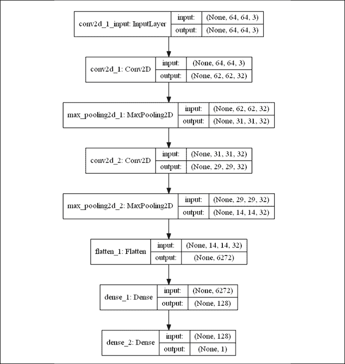
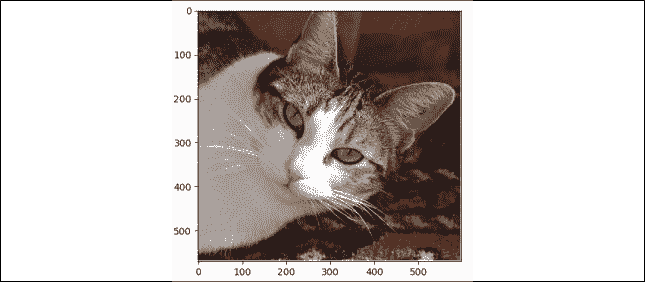
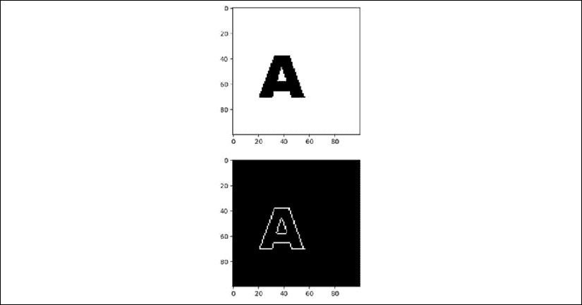

<title>Chapter_9</title>

# 9

# 基于卷积神经网络的抽象图像分类

应用于视觉的**卷积神经网络**(**CNN**)的发明代表了迄今为止应用数学史上最具创新性的成就之一。凭借其多层(可见和隐藏)，CNN 将人工智能从机器学习带到了深度学习。

在*第八章*，*用前馈神经网络*解决异或问题中，我们看到 *f* ( *x* ， *w* )是任何神经网络的构建模块。函数 *f* 将利用权重 *w* 变换输入 *x* 以产生输出。该输出可以直接使用，或者输入到另一层。在本章中，我们将概括这一原则，并介绍几个层次。同时，我们将使用带有图像的数据集。我们将有一个用于训练的数据集和一个用于验证的数据集，以确认我们的模型有效。

CNN 依赖于线性代数的两个基本工具:核和函数，如本章所述将它们应用于卷积。这些工具已经在数学中使用了几十年。

然而，Yann LeCun，Yoshua Bengio 和其他人——他们建立了一个几层的数学模型——用 CNN 解决了现实生活中的问题。

本章描述了 CNN 的奇迹，它是**人工神经网络** ( **ANNs** )的支柱之一。一个 CNN 将会从零开始建立，被训练，被拯救。所描述的分类模型将检测食品加工生产线上的生产故障。图像检测将超越物体识别，产生概念形式的抽象结果。

一个 Python TensorFlow 2 程序会一层一层的搭建，训练。额外的示例程序将说明关键功能。

本章将涵盖以下主题:

*   1D、2D 和 3D CNNs 的区别
*   向卷积神经网络添加层
*   内核和过滤器
*   塑造形象
*   ReLU 激活功能
*   内核初始化
*   联营
*   变平
*   致密层
*   编译模型
*   交叉熵损失函数
*   亚当优化器
*   训练模型
*   保存模型
*   可视化模型的 PNG

我们将从介绍 CNN 和定义它们开始。

# CNN 简介

本节描述了 CNN 的基本组成部分。`CNN_SRATEGY_MODEL.py`将说明用于构建抽象图像检测模型的基本 CNN 组件。对于机器和人类来说，概念是认知的基石。CNN 构成了深度学习(多层和神经元)的支柱之一。

在本章中，带 Python 的 TensorFlow 2 将使用 Keras 库运行，这些库现在是 TensorFlow 的一部分。如果你没有 Python 或者不想进行编程练习，这一章是独立的，有图表和解释。

## 定义 CNN

卷积神经网络处理信息，例如图像，并从中理解意义。

例如，想象你必须用一支普通的铅笔和一张纸来描绘太阳。这是一个阳光明媚的日子，太阳照耀得非常明亮——太明亮了。你戴上一副特别的高密度太阳镜。现在你可以看太阳几秒钟。您刚刚应用了色彩还原过滤器，这是卷积网络的第一步操作之一。

然后，你试着画太阳。你画一个圆，在中间放一些灰色。您刚刚应用了边缘过滤器。最后，你在圆圈上走几遍，使它容易辨认，逐渐地把你看到的东西还原成它的一种表现。现在，用这个圆圈，中间有些灰色，周围有几条光线，任何人都可以看到你画了太阳。你微笑；你做到了！你拍摄了一张太阳的彩色图像，并用数学方法将它表示为一个圆，大概是这样的:


图 9.1:圆的数学表示

您刚刚经历了卷积网络的基本过程。

单词**卷积**的意思是你把你看到的太阳一个区域一个区域地转换成一幅画。但是，你没有立刻看整个天空。你做了很多眼球运动来捕捉太阳，一个区域接一个区域，画画的时候也是这样。如果你把每个领域从你的愿景转化为你的纸上抽象的方式做一个数学表示，这将是一个核心。您可以看到，卷积运算将对象转换为更抽象的表示。这并不局限于图像，而是可以应用于我们想要从中提取模式的任何类型的数据(文字、声音和视频)。

考虑到这个概念，下图显示了在本章的模型中，机器像您一样处理图像时要遵循的连续数学步骤。卷积网络是将你所看到的转化为分类状态的一系列步骤。

在图中，每个方框代表一个层。每一层都有来自前一层的输入。每一层将转换输入，然后产生一个输出，该输出将成为下一层的输入。在每一层，对图像进行分类所必需的关键特征将被分离出来。

在你的例子中，它将用于找出你的画是否代表太阳。这属于二元分类模式(是或否，或 1 或 0)。



图 9.2:CNN 的架构

请注意，输出的大小逐渐减小，直到输出达到 1，这是将返回的二进制分类状态(1 或 0)。这些连续的步骤或层次，代表了你从观察太阳到画出太阳的过程。最后，如果我们画得不好，没有人认出太阳，这意味着我们必须回到第一步，改变一些参数(在这种情况下是权重)。这样，我们就能更好地表现太阳，直到有人说，“是的，它是太阳！”也就是概率= 1。另一个人可能会说不是太阳(概率= 0)。在这种情况下，需要更多的培训。

如果你进行这个画太阳的实验，你会注意到，作为一个人，你用眼睛和铅笔一次变换一个区域。你在每个区域重复你的方法。你执行的数学重复是你的**内核**。每区域使用一个内核是最快的绘制方式。对于我们人类来说，其实这是我们唯一能画的方式。CNN 就是基于这个过程。

在这一节中，我们看了 CNN 模型的一些关键方面，用一幅画来模拟太阳。这只是启动卷积神经网络的一种方式，还有数百种不同的方式。然而，一旦您理解了一个模型，您就有了实现其他变体所必需的理解。

在下一节中，我们将看到如何初始化和构建我们自己的 CNN。

## 初始化 CNN

`CNN_SRATEGY_MODEL.py`使用 TensorFlow 2 构建 CNN。TensorFlow 2 在开发方面做了巨大的改进。Keras 数据集、图层和模型现在是 TensorFlow 实例的一部分:

```
import tensorflow as tf

from tensorflow.keras import datasets, layers, models 
```

CNN 只需要两行标题来构建这些层！在 TensorFlow 2 中，对于每一层，我们只需调用`layers.<add your layer here>`就可以了！

使用的模型是从 TensorFlow `from tensorflow.keras`实例调用的 Keras `sequential()`:

```
classifier = models.Sequential() 
```

仅此而已。我们刚刚开始用几行代码构建我们自己的 CNN。TensorFlow 2 简化了创建 CNN 的整个过程，使其成为一个简单、直观的过程，我们将在本章中看到这一点。

让我们在下一节开始构建 CNN 的基础，并添加一个卷积层。

## 添加 2D 卷积图层

在本章中，我们将使用一个二维模型作为我们的例子。二维关系可以是现实生活中的图像，也可以是许多其他对象，如本章所述。这一章描述了一个二维网络，尽管其他的也存在:

*   一维 CNN 主要描述时间模式，例如，声音序列(音素=单词的一部分)、单词、数字和任何其他类型的序列。
*   体积模块是 3D 卷积，例如识别立方体或视频。例如，对于自动驾驶汽车来说，识别广告中靠近道路的人的 2D 图片和正在开始穿过同一条道路的行人的真实 3D 图像之间的差异至关重要！

在这一章中，空间 2D 卷积模块将应用于不同种类的图像。主程序`CNN_STRATEGY_MODEL.py`将描述如何构建和保存一个模型。

`classifier.add`将向模型添加一个层。名称**分类器**并不代表一个功能，而仅仅是这个特定程序中给这个模型的任意名称。这个模型最终会有 n 层。请看下面一行代码:

```
classifier.add(layers.Conv2D(32, (3, 3),input_shape = (64, 64, 3), activation = 'relu')) 
```

这行代码包含了很多信息:过滤器(应用了内核)、输入形状和一个激活函数。该函数包含更多选项。一旦你深入理解了这些，你就可以在你认为有必要的时候，为你要做的每个项目逐一实现其他选项。

### 核心

只是为了开始，直观地，让我们采取另一个日常模式。这个模型更加数学化，更接近 CNN 的内核表示。想象一下办公楼里一块非常小的方形瓷砖地板。例如，您希望每块地砖都从脏的变成干净的。

你可以想象一台能够将 3×3 的小瓷砖(像素)从脏变干净的清洗机。如果你看到有人拿着一个巨大的清洁机器来同时清洁所有 32×32 像素的瓷砖，你会笑的。直觉上，你知道它会很笨重，很慢，很难使用。除此之外，每种表面尺寸都需要一台大型机器！核不仅是一种有效的过滤方式，而且核卷积也是一种节省时间的资源处理。小型清洁机器是内核(脏到干净过滤器)，它将节省您执行卷积(检查所有瓷砖以清洁 3×3 区域)的时间，将地板从脏变干净。

在这种情况下，添加了 32 个不同的过滤器，内核大小为 3×3:

```
classifier.add(layers.Conv2D(32, (3, 3)... 
```

使用内核作为过滤器是卷积网络的核心。`(32, (3,3))`意为`(number of filters, (size of kernels))`。

#### 直观的方法

为了直观地理解一个内核，请记住太阳和清洁瓷砖的例子。在这一节中，一只猫的照片将展示内核是如何工作的。

在一个分析猫的模型中，最初的照片看起来像这样:



图 9.3:用于模型分析的猫照片

在第一次运行这一层时，即使没有训练，一个未经训练的内核也会改变照片:


图 9.4:猫照片转换

第一层已经开始分离猫的特征。边缘已经开始出现:猫的身体、耳朵、鼻子和眼睛。就其本身而言，第一个具有大小为 3×3 内核的过滤器(32 个中的一个)已经产生了有效的结果，该过滤器位于第一层中，并且没有经过训练。一个内核的大小可以根据你的需要而变化。例如，3×3 内核比 1×1 内核需要更多的权重。1×1 内核将只有一个权重，这限制了要表示的特征的大小。规则是内核越小，我们需要寻找的权重就越少。它还将执行特征缩减。当核的大小增加时，要查找的权重和特征的数量以及所表示的特征的数量也会增加。

随后的每一层都会用越来越小的矩阵和向量使特征更加突出，直到程序获得清晰的数学表示。

现在我们已经对过滤器的工作原理有了直观的了解，让我们来探索开发人员的方法。

#### 开发者的方法

开发人员喜欢先看到结果再决定如何解决问题。

让我们通过带有边缘检测内核的`Edge_detection_Kernel.py`走一条快速、切实的捷径来理解内核:

```
#I.An edge detection kernel

kernel_edge_detection = np.array([[0.,1.,0.],

[1.,-4.,1.],

[0.,1.,0.]]) 
```

内核是一个 3×3 的矩阵，就像猫的例子一样。但是这些值是预先设定的，并不是用重量来训练的。这里没有学问；只需要应用一个矩阵。与 CNN 的主要区别在于，它将学习如何通过权重和偏好来优化内核本身。

`img.bmp`被加载，3×3 矩阵被逐个区域地应用于加载图像的像素:

```
#II.Load image and convolution

image=mpimg.imread('img.bmp')[:,:,0]

shape = image.shape 
```

在应用内核的卷积之前的图像是字母 **A** (字母识别):


图 9.5:字母“A”

现在卷积转换图像，如下面的代码所示:

```
#III.Convolution

image_after_kernel = filter.convolve(image,kernel_edge_detection,mode='constant', cval=0) 
```

的边缘现在清晰地显示为白色，如下图所示:



图 9.6:可以看到的白色边缘

上面的原始图像显示了一个非常粗的 A。前面的图形通过细边缘显示了一个细的、可识别的 A 特征，神经网络可以在一些数学运算中对其进行分类。卷积网络的第一层训练寻找正确的权重，以自动生成正确的内核。

既然我们对过滤器有了一个直观和实用的开发者视角，让我们在方法中加入一些数学知识。

#### 数学方法

初始图像有一组您可以显示的值，如下所示:

```
#II.Load image

image=mpimg.imread('img.bmp')[:,:,0]

shape = image.shape

print("image shape",shape) 
```

该代码将打印图像的数字输出，如下所示:

```
image shape (100, 100)

image before convolution

[[255 255 255 ..., 255 255 255]

 [255 255 255 ..., 255 255 255]

 [255 255 255 ..., 255 255 255]

 ..., 
```

使用`filter.convolve`(一种数学函数)应用卷积滤波器，对图像进行转换和滤波。

卷积滤波函数使用几个变量:

*   要应用的 3×3 内核的空间索引；在这种情况下，它必须知道如何访问数据。这是通过空间索引 *j* 执行的，该索引管理网格中的数据。数据库也使用空间索引来访问数据。这些网格的轴决定了空间索引的密度。内核和图像使用 *j* 对 *W* 进行卷积，即权重内核。
*   *W* 是权数内核。
*   *I* 是输入图像。
*   *k* 是 *W* 的中心坐标。在这种情况下，默认值为 0。

然后，这些变量进入`filter.convolve`函数，如下式所示:


CNN 依赖于内核。花所有你需要的时间来探索掌握人工智能所需的三个维度:直观的方法、开发测试和数学表示。

现在，我们对卷积滤波器的工作原理有了一个数学概念，让我们来确定卷积层的形状和激活函数。

### 形状

`input_shape`定义图像的大小，64×64 像素(高×宽)，如下图:

```
classifier.add(...input_shape = (64, 64, 3)...) 
```

`3`表示通道的数量。在这种情况下，`3`表示 RGB 颜色的三个参数。每个通道可以有一个从 0 到 255 的给定值。

### 热卢

激活函数提供了影响加权数据计算转换的有用方法。它们的输出将改变分类过程、预测或网络的任何目标。该机型采用**整流线性单元** ( **ReLU** )，如以下代码所示:

```
classifier.add(..., activation = 'relu')) 
```

ReLU 激活函数将以下函数的变体应用于输入值:

*f* ( *x* ) = max{0， *x* }

对于负值，该函数返回 0；它返回正值作为*x*；对于 0 值，它返回 0。函数的一半定义域将返回零。这意味着当你提供正值时，导数总是 1。例如，ReLU 避免了逻辑 sigmoid 函数的挤压效应。然而，决定使用一个激活函数而不是另一个将取决于每个人工神经网络模型的目标。

用数学术语来说，一个**整流线性单元(ReLU)** 函数将获取所有负值，并对其应用 0。而所有的正值都保持不变。

`ReLU.py`程序提供了一些函数，包括一个 NumPy 函数，用来测试 ReLU 是如何工作的。

您可以输入测试值或使用源代码中的值:

```
import numpy as np

nx=-3

px=5 
```

`nx`期望负值，`px`期望正值，用于测试`relu(x)`和`lrelu(x)`功能。如果您希望在测试会话中包含零点，请使用`f(x)`功能。

`relu(x)`函数将计算 ReLU 值:

```
def relu(x):

    if(x<=0):ReLU=0

    if(x>0):ReLU=x

    return ReLU 
```

在这种情况下，程序将返回以下结果:

```
negative x= -3 positive x= 5

ReLU nx= 0

ReLU px= 5 
```

负值的结果变成 0，正值保持不变。导数或斜率因此总是 1，这在许多情况下是实用的，并且在调试 CNN 或任何其他 ANN 时提供了良好的可视性。

如下定义的 NumPy 函数将提供相同的结果:

```
def f(x):

    vfx=np.maximum(0.1,x)

    return vfx 
```

通过反复试验，ANN research 提出了 ReLU 的几种变体。

一个重要的例子是当许多输入值为负时出现的。ReLU 将不断产生零，使得梯度下降很困难，如果不是不可能的话。

一个巧妙的解决方法是使用一个泄漏的 ReLU。泄漏 ReLU 不会为负值返回 0，而是一个小值，例如，0.1 而不是 0。参见下面的等式:

*f* ( *x* ) = max{0.1， *x* }

泄漏的 ReLU 修复了“死亡”神经元的问题。假设你有一个层，在激活神经元的时候一直返回负值。在这种情况下，ReLU 激活将始终返回 0。这意味着这些神经元已经“死亡”它们永远不会被激活。为了避免这些“死亡”的神经元，泄漏 ReLU 提供了之前看到的小正值(0.1)，以确保神经元不会“死亡”

现在梯度下降会工作得很好。在示例代码中，函数实现如下:

```
def lrelu(x):

    if(x<0):lReLU=0.01

    if(x>0):lReLU=x

    return lReLU 
```

尽管 ReLU 存在许多其他变体，但记住这一点，您就知道它是做什么的了。

输入您自己的一些值，程序将显示结果，如下所示:

```
print("negative x=",nx,"positive x=",px)

print("ReLU nx=",relu(nx))

print("ReLU px=",relu(px))

print("Leaky ReLU nx=",lrelu(nx))

print("f(nx) ReLu=",f(nx))

print("f(px) ReLu=",f(px))

print("f(0):",f(0)) 
```

结果将显示 ReLU 结果如下:

```
negative x= -3 positive x= 5

ReLU nx= 0

ReLU px= 5

Leaky ReLU nx= 0.01 
```

我们已经处理了输入图像的大图。我们现在需要减小表示的大小，以获得更好、更抽象的表示。通过汇集一些像素，我们也将减少后续层的计算。

## 联营

CNN 包含隐藏的层。输入是可见的。然后，随着各层工作来转换数据，“隐藏”工作继续进行。输出图层再次可见。让我们继续探索“隐藏”的层！池化减小了输入表示的大小，在本例中是一个图像。最大池包括将最大池窗口应用于图像层:

```
classifier.add(layers.MaxPooling2D(pool_size = (2, 2))) 
```

这个`pool_size` 2×2 窗口将首先在图像矩阵的左上角找到 2×2 矩阵的最大值。这个第一最大值是 4。因此，它是右边池窗口的第一个值。

然后，最大池窗口跳过 2 个方格，发现 5 是最高值。5 写入最大池窗口。跳跃动作被称为**步幅**。跨距值为 2 将避免重叠，尽管一些 CNN 模型具有重叠的跨距。这完全取决于你的目标。请看下图:


图 9.7:池示例

输出大小现在从 62×62×32(滤镜数量)变为 31×31×32，如下图所示:


图 9.8:输出大小变化(池化)

存在其他汇集方法，例如平均汇集，其使用汇集窗口的平均值，而不是最大值。这取决于模型，并显示了训练模型需要付出的努力。

## 下一个卷积和池层

CNN 的下两层重复与前面描述的前两层相同的方法，在源代码中实现如下:

```
# Step 3 Adding a second convolutional layer and pooling layer

print("Step 3a Convolution")

classifier.add(layers.Conv2D(32, (3, 3), activation = 'relu'))

print("Step 3b Pooling")

classifier.add(layers.MaxPooling2D(pool_size = (2, 2))) 
```

这两层将输入大幅缩减至 14×14×32，如下图所示:


图 9.9:卷积和池层

可以在 CNN 上插入填充层。当我们一层一层地缩小图像时，卷积网络中的滤波器对中心像素的影响会比外部像素大。假设你开始在一张纸上画画。你倾向于填满纸的中心，避开边缘。这张纸的边缘包含较少的信息。如果您决定对边缘应用填充，图像将会更完整。在神经网络中，填充具有相同的功能。它确保通过添加值来考虑边缘。例如，填充可以在汇集之前或之后实现。我们将在*第 13 章*、*用 TensorFlow 2.x 和 TensorBoard* 实现一个填充的例子。

下一层可以对这一部分的池化输出应用扁平化，我们将在下一部分中看到。

## 变平

展平层采用 max pooling 层的输出，并将大小为*x***y***z*的向量转换为展平向量，如以下代码所示:

```
# Step 4 – Flattening

print("Step 4 Flattening")

classifier.add(layers.Flatten()) 
```

在这种情况下，图层矢量将为 14 × 14 × 32 = 6，272，如下图所示:


图 9.10:展平图层

该操作为后续的密集操作创建了一个具有 6272 个非常实用的连接的标准层。在进行扁平化之后，可以实现完全连接的密集网络。

## 致密层

密集层全连通。如前所示，通过到目前为止计算的尺寸缩减，完全连接是可能的。

这个连续模型中的连续层已经将图像的尺寸缩小到足以使用密集层来完成这项工作。`dense_1`先来后到，如下所示:


图 9.11:密集层

展平层产生一个 14×14×32 大小为 6，272 的层，每个输入都有一个权重。如果没有经过前面的图层，展平会产生一个更大的图层，减缓特征提取的速度。结果不会产生任何效果。

利用过滤器通过连续层和尺寸缩减提取的主要特征，密集操作将直接导致使用 ReLU on 密集操作的预测，然后使用逻辑 sigmoid 函数产生最终结果:

```
print("Step 5 Dense")

classifier.add(layers.Dense(units = 128, activation = 'relu'))

classifier.add(layers.Dense(units = 1, activation = 'sigmoid')) 
```

现在我们有了致密层，让我们探索致密层的激活功能。

### 稠密激活函数

ReLU 激活功能可应用于其他层中的密集层。

ReLU 激活函数的定义域应用于第一次密集操作的结果。ReLU 激活函数将为> =0 的值输出初始输入，并将为值<0:

*f* (输入值)= max{0，输入值)输出 0

逻辑激活函数应用于第二次密集操作，如*第 2 章*、*构建奖励矩阵-设计您的数据集*中所述。

它将产生一个介于 0 和 1 之间的值:

*LS*(*x【T12)= { 0，1}*

我们现在已经建立了 *LS* 激活函数之后的最后一个密集层。

最后一个密集图层的大小为 1，将对初始输入(本例中为图像)进行分类:


图 9.12:密集层 2

现在已经添加了模型的层。训练可以开始了。

# 训练 CNN 模型

训练一个 CNN 模型包括四个阶段:编译模型、加载训练数据、加载测试数据以及通过损失评估和参数更新周期的时期运行模型。

在本节中，为训练数据集选择的主题将是一个来自食品加工行业的示例。这里的想法不仅仅是认识一个物体，而是形成一个概念。我们将在第 10 章、*概念表征学习*中进一步探讨概念学习神经网络。目前，让我们训练我们的模型。

## 目标

该模型的主要目标是检测食品加工传送带上的生产效率缺陷。CIFAR-10(图像)和 MNIST(手写数字数据库)的使用证明有助于理解和训练一些模型。然而，在这个例子中，目标不是识别对象，而是识别概念。

下图显示了传送带的部分，其中包含可接受水平的产品，在本例中为巧克力蛋糕部分:


图 9.13:部分巧克力蛋糕示例

这些图像可以代表任何东西，从巧克力蛋糕、路上的汽车或任何其他类型的物体。要点是检测对象行中何时有“间隙”或“洞”。为了训练 CNN，我使用了包含我有时画的物体的图像来训练系统“看到”间隙。

然而，有时生产会放缓，产量会下降到警戒水平，如下图所示:


图 9.14:部分巧克力蛋糕示例

警报级别的图像显示了一个差距，这将大大降低工厂包装部门的速度。在前面的图像中有三行对象。在第一行，你可以看到五个小东西(这里是蛋糕块)，在第二行，只有三个。在第三行，你只能看到两个物体。因此，第二行和第三行缺少了对象。在这种情况下，这构成了生产线上的一个实际问题。一帧中的可接受对象的数量级别是一个参数。

现在我们有了目标，让我们开始编译模型。

## 编译模型

编译 TensorFlow 2 模型至少需要两个选项:损失函数和优化器。你评估你损失了多少，然后优化你的参数，就像在现实生活中一样。增加了一个度量选项来测量模型的性能。通过度量，您可以分析您的损失并优化您的情况，如以下代码所示:

```
classifier.compile(optimizer = 'adam', loss = 'binary_crossentropy', metrics = ['accuracy']) 
```

让我们看看模型编译的一些具体方面，从损失函数开始。

### 损失函数

损失函数提供关于模型*y*1 的状态(权重和偏差)离其目标状态 *y* 有多远的信息。

在本章中，对二次损失函数的描述先于对应用于案例研究模型的二元交叉熵函数的描述。

#### 二次损失函数

我们来刷新一下梯度下降的概念。想象你在一座山上，想要走下山。你的目标是到达山脚下的 *y* 。目前，你在位置 *a* 。谷歌地图显示你仍然需要走一段距离:

*y*–*a*

目前这个公式很棒。但是现在假设你快到山脚了，走在你前面的人掉了一枚硬币。你现在必须慢下来，谷歌地图没有太大帮助，因为在这个缩放级别。

然后，您必须使用二次目标(或成本)函数缩小距离:

*O*=(*y*–*a*)²

为了便于分析，O*除以 2，产生一个标准的二次成本函数:*


*y* 是目标。 *a* 是应用权重、偏差以及最终激活函数的操作结果。

利用结果的导数，权重和偏差可以更新。在我们的 hill 示例中，如果您每走一步( *x* )移动一米( *y* )，这比每走一步移动 0.5 米要多得多。根据你在山上的位置，你可以看到你不能应用一个恒定的学习速率(概念上，你的步长)；你就像优化者亚当一样适应它。

#### 二元交叉熵

当学习速度变慢时，交叉熵就派上了用场。在小山的例子中，它在底部变慢了。但是，请记住，一条路会把你带到一边，意味着你会暂时停留在某个特定的高度。交叉熵解决了这个问题，它能够在很小的值下很好地工作(在山上的台阶)。

假设您有以下结构:

*   输入= { *x* [1] ， *x* [2] ，…， *x* [n] }
*   权重= { *w* [1] ， *w* [2] ，…， *w* [n] }
*   一个偏差(有时更大)是 *b*
*   激活函数(ReLU、逻辑 s 形或其他)

在激活之前， *z* 代表经典操作的总和:


现在激活函数被应用到 *z* 以获得模型的当前输出。

*y*[1]=*act*(*z*)

考虑到这一点，交叉熵损失公式可以解释为:


在此功能中:

*   *n* 是输入训练的总项数，多类数据。对数底数的选择(2， *e* ，10)会产生不同的效果。
*   *y* 是输出目标。
*   *y*1 是现值，如前所述。

这个损失函数总是正的；值前面有一个减号，函数以减号开始。随着系统的发展，输出产生趋向于零的小数字。

损失函数使用这个具有更多数学输入的基本概念来更新参数。

二元交叉熵损失函数是二项式函数，它将产生 0 或 1 的概率输出，而不是像标准交叉熵那样在 0 和 1 之间的值。在二项式分类模型中，输出将是 0 或 1。

在这种情况下，当 *M* (类数)= 2 时，求和是不必要的。二元交叉熵损失函数如下:

loss =–*y*log*y*1+(1—*y*log(1—*y*1)

这种损失函数方法的整个概念是 CNN 网络为优化器提供信息以相应地自动调整权重。

### 亚当优化器

在山上的例子中，你首先利用冲力大踏步走下山(大踏步是因为你走的方向正确)。然后，你不得不一小步一小步地寻找目标。你根据自己的需要调整了对自己时刻的估计；因此，名为**自适应力矩估计** ( **亚当**)。

Adam 不断地将过去的平均梯度与现在的梯度进行比较。在希尔的例子中，它比较了你的速度。

Adam 优化器代表了经典梯度下降法的替代方法。Adam 更进一步，将其优化器应用于数据集的随机小批量。这种方法是随机梯度下降的有效形式。

然后，更具创造性的是，Adam 通过应用每个参数的学习权重将**均方根偏差** ( **RMSprop** )添加到过程中。它分析权重的均值变化有多快(例如我们的山坡示例中的梯度),并调整学习权重。

### 韵律学

指标是用来衡量你的模型在培训过程中的表现的。度量函数的行为类似于损失函数。但是，它不用于训练模型。

在这种情况下，`accuracy`参数是这样的:

```
...metrics = ['accuracy']) 
```

这里，下降到 0 的值表示训练是否在正确的轨道上，并且当训练需要 Adam 函数优化以将训练再次设置在轨道上时，该值上升到 1。

至此，我们已经编译好了我们的模型。我们现在可以考虑我们的训练数据集。

## 训练数据集

训练数据集可在 GitHub 上获得。数据集包含之前食品加工传送带示例中显示的图像。我创建了一个训练数据集，重复了一些图像，用来简单地说明 CNN 的架构。在现实生活中的项目中，需要通过反复试验的方法进行精心设计，以创建一个适当的数据集，来代表 CNN 将面临的所有情况。

类别`A`目录包含生产可接受级别产品的生产线的可接受级别图像。类别`B`目录包含生产不合格产品的生产线的警报级别图像。

由于以下原因，数据集中的图像数量有限:

*   出于实验训练的目的，这些图像产生了良好的结果
*   训练-测试阶段运行得更快以研究程序

该模型的目标是检测警报级别，这是 CNN 的抽象概念应用。

### 数据扩充

数据扩充通过生成所提供图像的失真版本来增加数据集的大小。

`ImageDataGenerator`功能批量生成张量格式的所有图像。它将通过扭曲图像(例如剪切范围)来执行数据扩充。数据增强是一种快速使用现有图像并通过变形创建更多虚拟图像的方法:

```
train_datagen =

tf.compat.v2.keras.preprocessing.image.ImageDataGenerator(

rescale = 1./255,shear_range = 0.2,zoom_range = 0.2,

horizontal_flip = True) 
```

代码描述如下:

*   如果不是`0`(或`None`)，则`rescale`将重新缩放输入图像。在这种情况下，在应用任何其他操作之前，数据乘以 1/255。
*   `shear_range`将在同一方向移动每个值，在这种情况下由`0.2`决定。它会在某一点上轻微扭曲图像，给一些更多的虚拟图像进行训练。
*   `zoom_range`是缩放的数值。
*   `horizontal_flip`设置为`True`。这是一个随机水平翻转输入的布尔值。

`ImageDataGenerator`为实时数据扩充提供更多选项，如旋转范围、高度移动等。

### 加载数据

加载数据通过`train_datagen`预处理图像函数(如前所述)并在以下代码中实现:

```
print("Step 7b training set")

training_set = train_datagen.flow_from_directory(directory+'training_set',

target_size = (64, 64),

batch_size = batchs,

class_mode = 'binary') 
```

该程序中的流程使用以下选项:

*   `flow_from_directory`将目录+ `'training_set'`设置为存储两个要训练的二进制类的路径。
*   `target_size`将被调整到该尺寸。在这种情况下，它是 64×64。
*   `batch_size`是批量数据的大小。默认值为 32，在本例中设置为`10`。
*   `class_mode`决定返回的标签数组:`None`或`'categorical'`将是 2D 的独热编码标签。在本例中，`'binary'`返回 1D 二进制标签。

看完训练数据集后，让我们继续看测试数据集。

## 测试数据集

测试数据集流程遵循与之前描述的训练数据集流程相同的结构。然而，出于测试的目的，任务可以变得更容易或更困难，这取决于模型的选择。为了使任务更加困难，添加有缺陷或噪声的图像。这将迫使系统进行更多的训练，项目团队进行更多的艰苦工作来微调模型。我选择使用一个小数据集来说明 CNN 的架构。在现实生活的项目中，选择包含 CNN 将面临的所有案例的正确数据需要时间和反复试验的方法。

数据扩充提供了一种无需向数据集中添加图像即可生成失真图像的有效方法。在许多方法中，这两种方法可以在必要时同时使用。

### 测试数据集上的数据扩充

在该模型中，数据仅经过重新缩放。例如，可以添加许多其他选项来使训练任务变得复杂，以避免过度拟合，或者仅仅因为数据集很小:

```
print("Step 8a test")

test_datagen = tf.compat.v2.keras.preprocessing.image.ImageDataGenerator(rescale = 1./255) 
```

建立数据集是人工智能项目中最困难的任务之一。如果结果是有效的，数据扩充可以是一个解决方案。如果没有，必须使用其他技术。一种技术是在可能的情况下收集非常大的数据集，然后使用数据扩充来稍微扭曲数据以用于训练目的。

### 加载数据

加载测试数据仍然仅限于该型号所需的数据。其他选项可以微调手头的任务:

```
print("Step 8b testing set")

test_set = test_datagen.flow_from_directory(directory+'test_set',

target_size = (64, 64),

batch_size = batchs,

class_mode = 'binary') 
```

永远不要低估数据集微调。有时，在找到正确的数据集和参数之前，这个阶段可能会持续数周。

一旦数据被加载，CNN 分类器就可以被训练了。现在让我们看看这是如何做到的。

## 使用分类器进行训练

分类器已经建立，可以运行；

```
print("Step 9 training")

print("Classifier",classifier.fit_generator(training_set,

steps_per_epoch = estep,

epochs = ep,

validation_data = test_set,

validation_steps = vs,verbose=2)) 
```

你会注意到，在这一章中，我们有一个用于训练数据的目录和一个单独的用于测试数据的目录。在*第五章*、*如何使用决策树增强 K-Means 聚类*中，我们将数据集分成训练子集和测试子集。这也适用于 CNN 的数据集。这是你需要根据具体情况做出的决定。

例如，有时，测试集将比训练集更难，这证明了单独目录的合理性。在其他情况下，拆分数据可能是最有效的方法。

`fit_generator`函数适合分批生成的模型，它包含主要的超参数，通过该模型中的以下参数来运行训练会话。超参数设置决定了训练算法的行为:

*   `training_set`是之前描述的训练集流程。
*   `steps_per_epoch`是从生成器产生的总步骤数(样品批次)。下面代码中使用的变量是`estep`。
*   `epochs`是对数据输入进行迭代的总次数的变量。前面代码中使用的变量是`ep`。
*   `validation_data=test_set`是测试数据流。
*   `validation_steps=vs`与发生器一起使用，定义测试样本的批次数量，如程序开始处的代码`vs`所定义:

    ```
    estep=100 #10000  vs=1000 #8000->100  ep=3 #25->2 
    ```

当训练运行时，显示测量值:损耗、精度、时期、层结构信息以及算法计算的步数。

以下是显示的损失和准确性数据的示例:

```
Epoch 1/2

 - 23s - loss: 0.1437 - acc: 0.9400 - val_loss: 0.4083 - val_acc: 0.5000

Epoch 2/2

 - 21s - loss: 1.9443e-06 - acc: 1.0000 - val_loss: 0.3464 - val_acc: 0.5500 
```

既然我们已经构建并训练了模型，我们需要保存它。保存模型将避免每次我们希望使用它时都必须训练模型。

## 保存模型

通过保存模型，我们将不必每次都重新训练它来使用它。我们只会在需要微调的时候再去训练。

TensorFlow 2 提供了一种在单行代码和单个序列化文件中保存模型结构和权重的方法:

`model3.h5`保存在下面的代码中，包含带有模型结构和权重的序列化数据。它包含每一层的参数和选项。这些信息对于微调模型非常有用:

```
print("Step 10: Saving the model")

classifier.save(directory+"model/model3.h5") 
```

模型已经建立、训练和保存。

### 后续步骤

该模型已经被建立和训练。在*第十章*、*概念表征学习*中，我们将探讨如何在没有训练的情况下加载和运行它。

# 摘要

建立和训练 CNN 只有通过努力工作，选择模型、正确的数据集和超参数才能成功。该模型必须包含卷积、池化、展平、密集层、激活函数和优化参数(权重和偏差),以形成训练和使用模型的坚实构件。

训练 CNN 解决现实生活中的问题，可以帮助向经理或潜在销售人员推销人工智能。在这种情况下，使用该模型帮助一家食品加工厂解决传送带生产率问题，使人工智能在日常企业生活中更进了一步。

一个能够识别图像中抽象概念的 CNN，让深度学习向强大的机器思维迈进了一步。能够检测图像中的对象并从结果中提取概念的机器代表了 AI 的真正最终水平。

一旦训练结束，保存模型提供了一种实用的方法来使用它，方法是加载它并将其应用于新图像以对它们进行分类。本章在我们训练并保存模型后结束。

*第十章*，*概念表征学习*，将深入探讨如何设计符号神经网络。

# 问题

1.  CNN 只能处理图像。(是|否)
2.  核是用于卷积的预设矩阵。(是|否)
3.  汇集有汇集矩阵吗，还是随机的？
4.  数据集的大小总是很大。(是|否)
5.  对于网络上所有可用的图像库来说，找到一个数据集不是问题。(是|否)
6.  一旦 CNN 建成，训练它并不需要太多时间。(是|否)
7.  经过训练的 CNN 模型仅适用于一种类型的图像。(是|否)
8.  与交叉熵函数相比，二次损失函数不是很有效。(是|否)
9.  深度学习 CNN 的性能并不代表现代 CPU 和 GPU 的真正问题。(是|否)

# 进一步阅读和参考

*   张量流 2:[https://www.tensorflow.org/beta](https://www.tensorflow.org/beta)