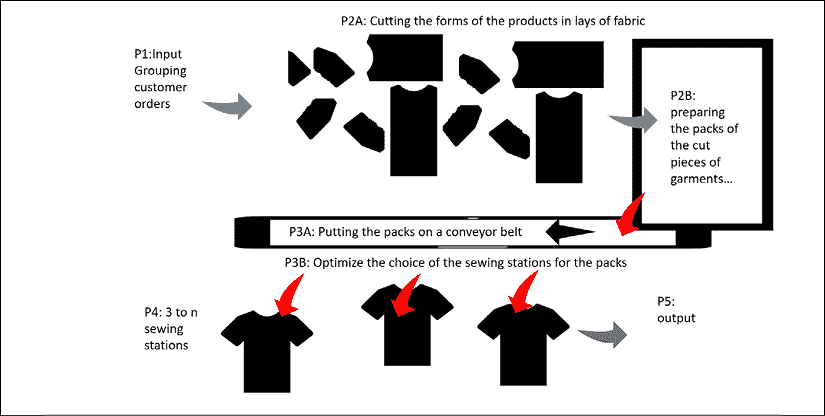
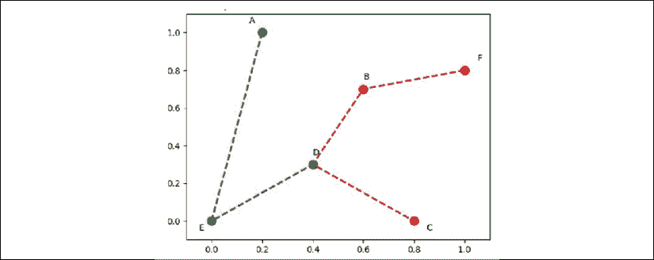
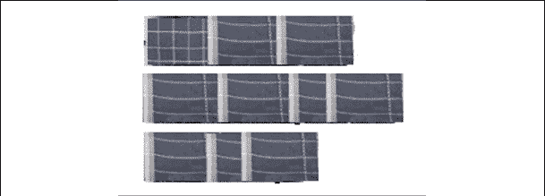
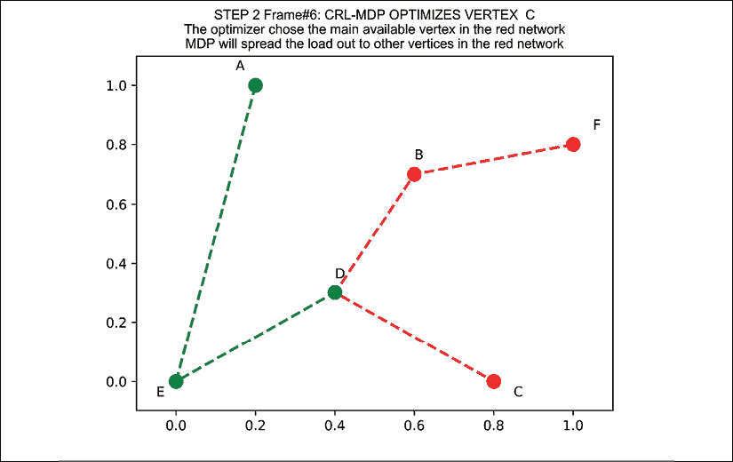

<title>Chapter_11</title>

# 11

# 结合强化学习和深度学习

亚马逊是世界领先的电子零售商之一，销售额超过 2500 亿美元。亚马逊的电子商店销售额超过了其所有其他活动，如 AWS 订阅服务(例如，premium)、零售第三方卖家服务和实体店。

本章重点介绍服装生产活动，这是亚马逊最近注册了专利的市场之一。Prime 衣柜甚至还提供试一试、轻松退货的服务。这项新活动需要计划和安排。亚马逊认真对待此事，并注册了一项服装制造系统的专利，以控制其服装产品的生产流程。

人工智能已经在服装业务的自动规划和调度中发挥了作用，从客户订单到交付。

谷歌已经成功地将深度学习和强化学习(Q-learning)结合在一个**深度 Q-network** ( **DQN** )中，这是一个可以在视频游戏和其他任务中击败人类的系统。谷歌的 AlphaGo DQN 已经取得了令人印象深刻的结果。

在这一章中，我们不仅仅是描述亚马逊的流程，或者是谷歌的流程。我添加了我在现实生活中的实现，我们将从头开始探索和构建 Python。因此，我们将结合几个系统(亚马逊、谷歌和我的实现)的想法。

我们将通过在强化学习中添加一个**概念表示学习元模型** ( **CRLMM** )来为服装制造业增加一项创新。

我们将从零开始到一个可以在现场实施的原型，在接下来的章节中为进一步的应用奠定基础。

本章将涵盖以下主题:

*   今天和明天的计划和安排
*   在*第 10 章*、*概念表征学习*中描述的 CRLMM 的进一步推广，应用于服装生产流程
*   向 CRLMM **卷积神经网络(CNN)** 输入来自生产线上网络摄像头的模拟帧
*   引入优化器，该优化器将使用应用于生产站的权重将奖励矩阵输入到**马尔可夫决策过程(MDP)** ，该决策过程随后将更新权重
*   使用前面提到的所有三个组件构建一个将在生产线上连续运行的程序(没有开始，没有结束)

我们将从谈论今天和明天的计划和日程安排开始。市场正在缓慢地从预先计划的流程转向实时流程。让我们看看怎么做。

# 今天和明天的计划和安排

当亚马逊决定推出 Prime 衣柜时，它为客户带来了一项新服务，使他们能够订购、试穿和购买服装、鞋子和其他配件。客户可以建立一个购买计划。采购计划是在给定时间内要执行的任务列表。采购计划的一个例子是:

*   往箱子里装满衣服
*   在家试穿衣服
*   如果不合身就退货
*   购买保存的物品

一旦客户同意遵循该计划，时间顺序就变得至关重要:

*   首先，必须选择一个盒子。
*   然后，还有一个交付期。
*   然后，有一个试用期(你不能永远试用产品)。在此期间，顾客可以选择不购买任何东西。
*   最后，客户确认购买。

不管亚马逊 Prime 衣柜在未来几年是否仍将是一项服务，先例已经确立；就像实体书店每年消失一样，网上购买服装将继续扩大并占据更多市场。

除此之外，企业将继续扩大生产基地，成为制造分销巨头。按照本书某些章节中提供的仓库示例，仓库将逐步取代许多商店。

**供应链管理**，结合 APS，成为一种必然。SCM-APS 约束在全球市场上不断变化(取决于制造商)。APS 代表高级计划和调度或自动计划和调度。我们将在下一节*实时制造革命*中探讨这两个概念的区别。我们将超越亚马逊在这个问题上的做法，因为实时交付已经成为市场上所有参与者的一个约束。

市场的压力促使亚马逊生产自己的服装。亚马逊已经制作了自己的时装品牌，并在全球销售服装和配饰。

为了证明它是认真的，亚马逊注册了几项专利，包括一个混合现实镜子、一个服装制造系统等等。有了混合现实镜，一个人可以想象衣服会如何合身。

在下面的章节中，我们将探索亚马逊服装内部制造计划的规划和调度方面，这将对服装工厂产生与实体店和所有类型的商店相同的影响。许多新的工作岗位将会出现，例如人工智能业务、网站、营销和供应链管理领域的数十万个工作岗位。许多工作也会消失。这些改进将推动医学进步和国防工业。社会和经济影响超出了本书的范围，也可能超出了我们的理解，就像过去所有的破坏性时代一样。

我们将详细介绍亚马逊专利定制服装流程的主要方面。如前所述，不管它是否成功，先例已经确立。

## 实时制造过程

今天，一位客户希望尽快获得所购买的产品。如果等待时间太长，客户就会去别的地方。几乎实时交付已经成为任何公司营销中的一个关键概念。亚马逊的方法一直是实时的。亚马逊的品牌突破了几个世纪以来商业的物理极限，将制造过程推向了前沿。

### 亚马逊必须扩大服务来面对竞争

如果亚马逊继续从供应商那里购买产品，而不是自己生产，它本可以避免很多动荡。研究人员不再花费大量时间开发能够解决传送带问题的人工智能，而是可以用传统的软件解决方案安装几个传感器。

人类也可以继续用马代替汽车，用纸代替电脑。在短期内，我们可以避免大量与这些技术的需求和影响相关的工作和变化。然而，从长远来看，进步和创新会胜出。

一旦一个颠覆性的创新被一家公司成功推出，竞争对手要么紧随其后，要么消失。亚马逊需要继续参与之前的流程，而不是简单地将商品储存在仓库中。例如，通过参与制造，他们可以缩短将产品交付给客户的时间。因此，亚马逊想出了这项服装制造专利，以及 3D 打印机和其他提高生产率的创新。

在同样的意义上，人工智能领域需要不断超越其不断扩大的舒适区。研究人员必须面对困难的工业问题，以获得经验，并产生能够实现更高水平的机器学习和迎接更大挑战的新算法。

### 实时制造革命

人工智能软件虽然壮观，但并不是永远改变我们生活的唯一革命。在 20 世纪 50 年代和 60 年代，消费者发现购买新产品的乐趣，如洗碗机、彩色电视机和酷酷的收音机。他们非常高兴能够获得这些产品，他们愿意等待几天，如果不是几周，以获得他们梦想的确切模型。供应商可以搁置订单几天，然后慢慢开始工作。

如今，消费者已经失去了耐心。如果有人想在网上购买产品，它必须在几天内送达。否则，消费者将转向另一家供应商。这给供应商带来了压力，他们必须立即开始交货过程。实时是在你收到请求通知的几秒钟内就开始做事情的过程。

实时是改变世界上每一个过程的强大力量。

今天，服装制造业和一般制造业都遵循先进的计划和调度流程。“高级”既指复杂的算法，也指预测(提前规划)过程。人工智能算法的提前规划方面正在经历一场革命。

亚马逊和所有制造流程一样，需要自动化的计划和调度来满足不断缩短的交付时间。

这两种系统的根本区别在于时间因素，如下表所示。先进系统和自动化系统之间的差异似乎很小，但亚马逊和其他公司一样，将通过这些差异改变历史进程。理论上，这两种系统都可以完成这两种任务。在实践中，这些方法将在未来的几年里专攻它们的领域。为了制造一架飞机，一个复杂的*高级*算法仍然需要在*提前*(几天到几周)进行大量的人工决策。为了生产基本的 t 恤，*自动化*计划可以快速自动地实时完成(几秒到几小时)

自动化计划和调度的趋势正在成为高级计划和调度的时间压缩版本。

下表中的数字并不反映确切的数字，而是趋势:

| **功能** | **高级计划和调度** | **自动化计划和调度** |
| 长期计划 | 1 个月到 5 年 | 几天到不到一个月 |
| 短期计划 | 1 天 | 1 分钟 |
| 生产或事件测量 | 通常在日常基础上考虑 | 实时 |
| 行程安排 | 1 小时到 1 周 | 实时 |
| 出现问题时重新规划 | 1 小时到 1 个月 | 实时 |
| 重新调度 | 1 小时到 1 周 | 实时 |
| 资源调整 | 1 天到 1 个月 | 实时 |
| 负载平衡 | 1 小时到 1 周 | 实时 |
| 计划和调度的自动功能 | 80% | 99% |

虽然这个表格包含了大概的信息，但是潜在的趋势是非常强劲的。我们已经看到了高级和自动化概念之间的区别；让我们也澄清一下计划和调度之间的区别:

*   一个**计划**由为未来的生产做准备的过程组成:购买材料部件和调整人力资源和物质资源。例如，亚马逊有一个年度商业计划:提前整合必要的资源，为生产做好准备。这意味着购买或建造仓库、雇用员工和购买基本的材料资源(盒子、标签和其他组件)。
*   **调度**面对在较短的时间范围内有时间因素的计划。调度决定了计划的每一部分何时先出现并产生。例如，现在仓库已经建成或购买(计划)，包装应在下周一和未来几周的什么时间(计划)开始工作？

    进度计划可以看作是计划的放大版。

如果有人走进杰夫·贝索斯的办公室，带着一份在给定地点建造仓库的计划，以及实施的成本和一般时间安排，这很好。那个人正在展示一个为期两年的项目。该项目将在 10 个月后开始，持续两年。

然后，那个人可能(我建议不是！)跟大家说:*这个计划很棒，因为它将在 10 个月后准备就绪。但是我担心下午 4 点的第二班在 1 年内的每日时间表。他们应该在早上 7:30 还是 7:45 开始？杰夫·贝索斯不会再听了。变焦水平不是他工作描述的一部分。他必须专注于更高的层次。对于一个高层管理者来说，在下午 4 点知道一年后会发生什么是没有用的！*

先进的计划和调度系统主要从 ERP 中导入数据，以制定未来计划。自动化规划和调度程序主要通过传感器检测数据，以实时做出反应和优化。本章讨论的是自动计划程序，而不是高级计划和调度系统。

把高级 APS 和自动化 APS 之间的演变想象成一个逻辑 sigmoid 函数应用于计划-调度时间挤压。以下是一些例子:

*   制造汽车的先期计划持续一个月到一年。
*   自动驾驶汽车在起点的谷歌地图行程自动计划:几秒钟到一分钟，取决于该位置的连接状态。
*   制造一辆汽车的时间表:1 天到 1 个月。
*   按照谷歌地图路线驾驶自动驾驶汽车的时间表= *实时*

总而言之，目前的趋势代表了人类进程史上的一场革命。

亚马逊的制造专利反映了实时应用于每个领域的革命。

规划已经发展到实时规划，如下式所示:


其中:

*   *x* 是生产或任何单位事件的数量。
*   *t* [x] 是 *x* 开始和结束的时间( *t* )。
*   逻辑函数挤压*t*x。
*   (λ)是学习因子；一项任务执行得越多，就越优化。

*X*t 是一组 *n* 任务在给定时间内的总权重 *t* :

*X*[t]= {*X*[1]， *x* [2] ，*X*[3]…*X*[n]

*X*t[t]和*Z*(*X*t[t]的区别在于:

*   *X*t[t]是制造产品所需要的实际时间。
*   *Z*(*X*t)并不是实际需要的时间。*Z*(*X*[t])是激活函数的结果，该激活函数将时间压缩为 RL-DL-CRLMM 网络中 *X* [t] 的输出。*Z*(*X*[t])是一个加权因子。

进一步降低权重因子的关键是一个物理生产过程和其他物理事件(例如，输出)，我称之为 lambda: 表示现实生产中的所有改进，这些改进可以缩短生产周期以及自然事件，例如生产输出。

在第 10 章、*的*中，概念表征学习*、被引入以减少差距。在本章中，将被进一步推广以优化。*

这意味着 RL-DL-CRLMM 系统将优化制造过程。我们现在将探索一个改变游戏规则的自动化服装制造流程，并用 Python 来构建它。

# 应用于自动化服装制造过程的 CRLMM

凭借自动化计划和调度系统，而不是先进的计划和调度系统，亚马逊让服装制造更贴近消费者。

人工智能将推动现有的流程。在本节中，RL-DL-CRLMM 系统将优化服装制造流程。

## 服装制造过程

亚马逊的服装制造专利可以总结如下:

*   **P1** :根据产品和尺码对服装客户订单进行分组。自从几个世纪前工业服装制造的起源以来，这一过程就一直存在。
*   **P2** :自动切规。一层是一叠布料。这就像同时在一叠(层)几张纸上切割一个圆。
*   **P3** :将服装零件的包装移动到传送带上的装配线上(参见*第十章*、*概念表示学习*)。
*   **P4** :根据产品的其他操作(包装或印刷或其他)。
*   **P5** :通过仓库和交付以及更多流程(跟踪和数据分析，例如，发现延迟交付并优化其路线)存储和优化配送流程。

下图显示了一家服装制造公司的生产流程。首先，面料被裁剪，然后叠放在一起，由传送带送到缝纫站组装衣服:



图 11.1:服装生产流程

一个摄像头安装在传送带 P3 的正上方。下图显示了传送带上方的网络摄像头:


图 11.2:传送带上的网络摄像头定格画面

网络摄像头每隔 *n* 秒定格一帧(红色矩形内)。该帧是稍后描述的 CRL-CNN 的输入。

这个图像是概念的代表。实际上，网络摄像头可能位于传送带的起点，甚至在切割过程的输出上方。对于本章中的原型，请记住，每隔 *n* 秒，一个冻结帧就会被发送到经过训练的 CNN。

这个从 P1 到 P5 的流程图提供了一个服装生产流程的总体思路。在实际的公司中，需要更多的过程:市场研究、设计产品、测试原型、增加牛仔裤的制造过程(例如，用激光打孔)，等等。

到目前为止，所描述的每一道工序都是在 30 多年前单独发明的，包括应用于服装行业的自动裁剪和传送带。*这里有什么新鲜事？许多服装专家在阅读有关亚马逊的资料时都会想到这个案例。这就是思维陷阱！认为亚马逊的服装专利不包含新组件是错误的。*

**时间挤压**是亚马逊创新流程的核心。让制造业以近乎实时的方式接近消费者是一场革命，它将具有颠覆性。将 3D 打印机添加到时间挤压等式中，你将很容易描绘出我们消费市场的未来。然而，人工智能也有权参与优化竞争。

为了说明这一点，让我们建立一个优化传送带 P3 的人工智能模型。许多解决方案也已经存在，但 RL+DL 很可能击败它们，就像在许多领域一样。

第一步是推广第 10 章、*概念表征学习*中描述的模型，通过训练更进一步。然后，可以构建 RL-DL-CRLMM。我们将首先探索如何训练 CRLMM 来分析生产中的 web 框架。

## 培训 CRLMM

*第十章*、*概念表征学习*，介绍了用 (gap concepts)到举例说明的 CRLMMs。

在前面的章节中，围绕(差距概念)的概念子集设计如下:

*   ，包含*pg*I(*p*=正子集)和*ng*[I](*n*=负子集)
*   *ng*1 是的子集； *ng*
*   *pg*2 是的子集；*pg*[2]=*pg*[2]= {良好的生产流程，没有缝隙}
*   *g*2= { loaded }
*   *g*3= {卸载}，
*   pg[4]= {交通堵塞，交通拥挤…交通太拥挤}
*   *ng*[5]= {开放车道，轻交通……正常交通}

`CNN_STRATEGY_MODEL.py`需要接受培训，以便在服装生产环境中将识别为，并记住如何识别以前的概念:

*   切割部分 P2 (A 和 B)输出在传送带上流动的服装包(P3)。
*   记住如何对食品加工公司的蛋糕进行分类，以教模型识别更多的情况。
*   记住如何执行交通分析(参见*第 10 章*、*概念表示学习*)。
*   学习如何对差距的抽象表示进行分类。

### 概化单元训练数据集

为了概括单元训练数据集，创建了六种类型的图像。每张图片代表每隔 *n* 秒在传送带上拍摄的网络摄像头画面。四个形象是具象绘画意义上的具象。两个映像将 CRLMM 程序带到了更高的抽象层次。

### 食品传送带加工–正 p 和负 n 间隙

在食品加工业的例子中(参见*第九章*、*用卷积神经网络进行抽象图像分类*，传送带上的一个间隙最常为负，一个*负γ*=*n*。

下图显示第一条生产线已经完工，但第二条和第三条生产线尚未完工:


图 11.3:食品传送带加工框架

相反，在几乎没有间隙的情况下，传送带上的负载被视为正的，a *正伽马* = *p * 。

下图显示了每条生产线可接受的产品数量:


图 11.4:食品传送带加工框架

正如前面的图片所示，无论传送带上的产品是什么，间隙始终是间隙，是一个空的空间。我们现在将把我们的模型应用到其他间隙，无论对象是什么。在这种情况下，我们将检测服装传送带上的间隙。

#### 服装传送带加工–未确定的间隙

服装传送带过程中的间隙通常是不确定的。这本身就构成了一个主要的优化问题。自然地，如果传送带是空的或饱和的，这种变化会引起操作员的注意。然而，大多数时候，优化解决了问题。

下图显示了一个相对满载的服装包装的生产流程，这些包装是要在生产线上进一步组装(通过缝合)的服装:


图 11.5:满载生产流程

下图清楚地显示了一个缺口，这意味着发送到缝纫站的数量不会很高:


图 11.6:生产流程(差距)

几个观察对于优化这个问题是必要的:

*   传送带实时问题排除了运行高级计划和调度。
*   这个问题需要实时的自动化规划和调度。
*   自动化规划和调度解决方案必须实时规划和调度。
*   在预测产出时，它将考虑规划限制因素(如下文所述)。
*   它将考虑调度约束以优化缝纫部分。

Amazon 和其他公司已经慢慢地，但是肯定地，将许多计划范围问题(更长)降低到更短的计划范围，将 SCM 的限制推得越来越远。

#### 一个抽象的间隙概念的开始

根据上下文，显示的间隙具有消极或积极的属性。CRLMM 模型现在必须学习迄今为止提到的所有差距的元概念抽象表示。这些间隙都是这样或那样的流动间隙。某物以小包的形式从一点移动到另一点。因此，包装通常大小不一，这就导致了缝隙的形成。

这些概念可以应用于牛群、赛马、团队运动攻击(足球、英式足球、橄榄球、篮球、手球和其他领域)、奥运会比赛、马拉松、传送带等等。

当流中的包彼此靠近时，一个单独的心理图像出现。每个人都有一个定制版本。下图是无间隙概念的概括表示:


图 11.7:无间隙概念的一般表示

然后，狼群有领导者和追随者。然后，一个抽象的表示也出现了。下图显示了间隙概念的一般表示:


图 11.8:差距概念的一般表示

人类并没有一个流量检测间隙功能来检测他们所观察的每一个事物。人类有一个包含物理记忆或其他数据集的大脑，但更重要的是，他们有抽象数据集。

我们中的每一个人数十亿思考的两足动物都有非常有效的抽象数据集。前面展示的元概念意味着，通过推理，一个人有一个中心元概念，一组记忆通过经验与它相适应。

元模型使用这些数据集。`dataset`目录中的数据集包含一个 CRLMM 系统的开始。该程序将学习什么是*流程缺口*，然后通过分析上下文将其应用于所看到的内容。

该数据集的这一目标导致了 CRLMM，如以下部分所述，其中:

*   抽象的习得元概念被应用到一个情境中；在这种情况下，是一个框架。
*   然后，CRLMM 确定是间隙还是无间隙情况。
*   然后，CRLMM 使用基于面向决策权重的激活函数的思维优化器做出决策。这意味着它不仅仅是一个数学问题。这是*权衡*决策过程的利弊。

在本节中，我们的 CRLMM 学会了识别服装传送带上的间隙。如果我们要实现这一点，我们会将项目传送带的许多网络框架添加到我们的数据集中来进行训练。现在，让我们继续这个例子，运行一个预测程序来对差距进行分类。

### 运行预测程序

训练是使用与第 9 章、*使用卷积神经网络(CNN)进行抽象图像分类*中描述的`CNN_STRATEGY_MODEL.py`程序相同的程序完成的，该程序旨在为后续章节进行推广。

一旦安装了前一部分的数据集，模型就可以进行预测，而无需在各个领域进行进一步的训练。

与第 10 章、*概念表征学习*中描述的`CNN_CONCEPT_STRATEGY.py`功能相同。

仅更改了数据集的路径，以及要显示的预测消息:

```
#II. Convolutional Neural Network (CNN)

#loads,traffic,food processing

A=['dataset_O/','dataset_traffic/','dataset/']

MS1=['loaded','jammed','productive']

MS2=['unloaded','change','gap']

display=1     #display images

scenario=2    #reference to A,MS1,MS2

directory=A[scenario] #transfer learning parameter (choice of images)

CRLMN=1       # concept learning

print("Classifier frame directory",directory) 
```

CRLMM 现在已经学会用元概念来表示现实生活中的记忆和相关记忆的推理。我们的 CRLMM 已经准备好组装成 RL-DL-CRLMM 的三个组件之一，我们将在下一节中看到。

# 建造 RL-DL-CRLMM

RL-DL-CRLMM 程序的完整代码为`RL_DL.py`。它建立在本章前几章和前几节的知识和程序的基础上。

RL-DL-CRLMM 包含三个部件:

*   一个 CRLMM 卷积网络将分析它从网络摄像头接收到的每一帧，网络摄像头位于来自切割部分的传送带上的服装包的正上方。
*   使用先前描述的 *Z* ( *X* )的修改版本的优化器，该优化器计划如何实时装载装配站。
*   MDP 将接收优化器功能的输入，并安排装配站的工作。它还为下一帧产生修改后的 *Z* ( *X* )各装配站的重量更新值。

在物理世界中，传送带运送服装包，每隔 *n* 秒拍摄一张图片(帧)，RL-DL-CRLMM 运行。如前所述，RL-DL-CRLMM 的输出向传送带发送指令，并将服装包引导至装配站的优化负载。

因为`RL_DL.py`描述了一个连续的 RL-DL-CRLMM 过程，所以这个程序没有开始和结束。这些组件是独立的，由发送给它们的输入触发，它们用自己的输出触发其他组件。

因此，组件将以加工顺序描述，而不是以代码内嵌顺序描述。这是因为由`def` + `function()`定义的函数先于对它们的函数调用。代码行号将被插入到代码行后面的注释中，如下所示:`# [Line 38]`。

## 循环过程

一旦系统的三个主要组件就位(CNN、MDP、优化器)，这个 RL-DL-CRLMM 的循环属性就是一个流状系统，永远不会开始也不会结束。

为了定义一个循环过程，让我们举一个日常的例子。顾客 C 去超市购买一件商品。该产品之前存放在一个仓库中，我们将其命名为 b。一家名为 A 的工厂生产该产品。如果你在给定时间观察整个供应链，你会发现没有起点和终点:

*   如果你是 A，你们都在监控 C 向 B 发送产品的需求
*   如果你是 B，你们都在监视来自 A 的东西来满足 C
*   如果你是 C，你正在为 A 创造一个交付 B 的需求

在现实生活的供应链中，没有开始也没有结束。这同样适用于自动化生产现场，适用于这种几乎无记忆系统的功能流程。传送带的网络摄像头提供了一系列帧，迫使系统进入类似循环流的行为。

## 实施 CNN-CRLMM 以检测间隙并优化

CNN-CRLMM 功能在*运行预测程序*部分和*第 10 章*、*概念表示学习*中有描述。预测功能是后面描述的 MDP 输出分析的一部分。如以下代码所示调用`CRLMM`函数:

```
def CRLMM(Q,lr,e):    # [Line 180] 
```

此函数的第一部分压缩下一节描述的 *W* 矢量。该函数的第二部分分析输入帧。

由于此时没有网络摄像头连接到系统(这必须在项目实施过程中完成)，因此进行了随机图像(帧)选择。下面的随机代码模拟真实生产中的随机事件:

```
 status=random.randint(0,1) 
```

在现实生活中，随机数量将通过传送带。随着状态被确定，CNN 模拟来自直接位于传送带上的网络摄像机的视频流的冻结帧的添加。它运行前面描述的 identity (image)函数，并为优化器返回一个`gap`或`no gap`场景(参见优化器一节)。以下代码描述了差距识别过程:

```
 if(status==0):

        #Add frame from video stream (connect to webcam)

        s=identify(directory+'classify/img1.jpg',e)

    if(status==1):

        #Add frame from video stream (connect to webcam)

        s=identify(directory+'classify/img2.jpg',e)

    s1=int(s[0])

    if (int(s1)==0):

        print('Classified in class A')

        print(MS1[scenario])

        print('Seeking...')

    if (int(s1)==1):

        print('Classified in class B')

        print(MS2[scenario])

    return s1 
```

一旦检测到`status`，无论切割系统的负载输出是高还是低，都必须做出决定。这将通过 MDP 来完成。

## q-learning-MDP

通过在这个 CNN-CRLMM 节目中增加一个 MDP Q-learning 决策函数(参见*第一章*、*通过强化学习开始下一代人工智能*)，我们现在进入了认知 RL-DL 节目的世界。

在这个实时系统中，没有开始，没有结束，也没有超出几帧的真实记忆。

`mdp01.py` MDP 计划已经并入`RL_DL.py`。因此，本章仅描述所做的更改。

MDP 参数紧跟在导入包之后。图形的每个顶点都有其字母和位置，如以下代码片段所示:

```
L=['A','B','C','D','E','F']    # [Line 37] 
```

当程序运行时，下图将以红色(目标顶点)显示该帧。接下来由 MDP 做出选择，如下所述:



图 11.9:输出(目标顶点)

请注意，这是一个无向图，有顶点(彩色点)，没有边(线)方向。MDP 将为该模型中的每一帧提供方向。

每个顶点代表这个模型中的一个装配站。每个装配站都有高工作负荷或低工作负荷。工作量很少是稳定的，因为产品在生产过程中不断流入流出。

### MDP 投入和产出

该模型中的 MDP 过程使用奖励矩阵作为输入，并产生权重向量。

#### 输入是一个中性的回报矩阵

MDP 回报矩阵被设置为`0`，除了表示可以物理访问的图的边的值；这些被设置为`1`，一个小的中间值。

事实上， MDP 除了复制这个无向图的结构之外，无法提供令人满意的结果。奖励矩阵现在被初始化和复制，如下面的代码所示，从第 41 行开始；在第 43 行`R`，构建奖励矩阵，在`Ri`，创建`R`的副本:

```
# R is The Reward Matrix for each state built on the physical graph    [Line 41]

# Ri is a memory of this initial state: no rewards and undirected

R = ql.matrix([[0,0,0,0,1,0],

               [0,0,0,1,0,1],

               [0,0,0,1,0,0],

               [0,1,1,0,1,0],

               [1,0,0,1,0,0],

               [0,1,0,0,0,0]])

Ri = ql.matrix([[0,0,0,0,1,0],

                [0,0,0,1,0,1],

                [0,0,0,1,0,0],

                [0,1,1,0,1,0],

                [1,0,0,1,0,0],

                [0,1,0,0,0,0]]) 
```

`Ri`是初始状态零回报矩阵的副本。`R`在每个新帧被重置为`Ri`。MDP 用一种无记忆、无向图和无监督的方法训练每个新框架的装配位置计划。

`Q`是学习矩阵，将在其中学习/存储奖励，如第 58 行代码所示:

```
Q = ql.matrix(ql.zeros([6,6]))    # [Line 58] 
```

#### MDP 函数的标准输出

装配站的负载不是生产的准确数量。它们是在这个连续过程中不断更新的权重，本章将对此进行进一步解释。

在程序的初始状态，顶点的初始权重在下面的代码行(第 40 行)中被设置为`0`:

```
W=[0,0,0,0,0,0]    # [Line 40] 
```

权重向量(表示为数组)包含每个装配站位置或顶点的一个值。

初始状态不是真正的开始。它就像视频上的暂停按钮。初始状态可能来自假期(无生产)、维护日(无生产)或缺少输入订单(无生产)。初始状态只是重量等于`0`的情况，因为传送带或装配站上什么都没有。

权重向量是优化器的第 1 部分(见下一节)。MDP 在优化无向图之后产生输出矩阵。优化器将提供一个目标。

该程序包含与第一章*相同的源代码，通过强化学习*开始下一代人工智能，贝尔曼方程从第 1166 行开始。MDP 产生其结果，如以下输出所示:

```
[[ 0\. 0\. 0\. 0\. 105.352 0\. ]

[ 0\. 0\. 0\. 130.44 0\. 201\. ]

[ 0\. 0\. 0\. 130.44 0\. 0\. ]

[ 0\. 161.8 105.352 0\. 105.352 0\. ]

[ 85.2816 0\. 0\. 130.44 0\. 0\. ]

[ 0\. 0\. 0\. 0\. 0\. 250\. ]]

Normed Q :

[[ 0\. 0\. 0\. 0\. 42.1408 0\. ]

[ 0\. 0\. 0\. 52.176 0\. 80.4 ]

[ 0\. 0\. 0\. 52.176 0\. 0\. ]

[ 0\. 64.72 42.1408 0\. 42.1408 0\. ]

[ 34.11264 0\. 0\. 52.176 0\. 0\. ]

[ 0\. 0\. 0\. 0\. 0\. 100\. ]] 
```

请记住，这整个 DQN-CRLMM 不仅是基于无向无记忆 MDP 函数，而且也没有真正的开始和结束，因为它是一个连续的，几乎无记忆的过程。

#### MDP 输出矩阵的图形解释

在每次运行后，MDP 矩阵还产生点对点(字母到字母)顶点间路径值的图形解释，并显示在以下输出中:

```
State of frame : 3 D

0 A E 161.8

1 B D 201.0

2 C D 201.0

3 D D 250.0

4 E A 130.44

4 E D 201.0

5 F B 161.8 
```

这样，如果值是从最高到最低的边(线，因此，两个字母之间的值)，它给出了 MDP 函数如何通过图形计算的直观想法。

`RL`是字母矢量。每一帧之后都是空的。它将通过查找每条边的值来填充。它将包含由边(由值表示的线)连接的顶点(节点和点)的字母。

`RN`是边的值。下面的代码显示了如何实现`RL`和`RN`并更新权重向量中位置的权重(`W`):

```
 #Graph structure    [Line 187]

    RL=['','','','','','']

    RN=[0,0,0,0,0,0]

    print("State of frame :",lr,L[lr])

    for i in range(6):

        maxw=0

        for j in range(6):

            W[j]+=logistic_sigmoid(Q[i,j])

            if(Q[i,j]>maxw):

                RL[i]=L[j]

                RN[i]=Q[i,j]

                maxw=Q[i,j]

                print(i,L[i],RL[i],RN[i]) 
```

在更新`RL`和`RN`的同时，更新前面代码中的逻辑功能。

## 优化器

我写过几个服装行业面料优化的优化器。在这种情况下，优化器将用于调节生产流程。

术语“优化器”并不是前面章节中使用的 CNN `rmsprop`优化器，用以下代码表示:

```
loaded_model.compile(loss='binary_crossentropy', optimizer='rmsprop', metrics=['accuracy'])    # [Line 92] 
```

术语“优化器”指的是优化该制造场所的生产的功能。例如，它不是用来训练 CNN 的优化器。这个优化器既是一个激活功能，也是一个调节器，是为了优化生产而从头开始构建的。这表明你有时必须发明你需要的优化器来为你的客户或公司产生一个有利可图的解决方案。

### 作为调节器的优化器

应用于 P3 的这种 RL-DL-CRLMM 实时生产的整体概念是优化 *Z* 装配站的负载分配，如前所述。这意味着通过下面的等式尽可能减少 Z :


为了实现这个优化目标， *Z* 需要被分解并应用到代码的战略部分。

#### 实施 Z-压缩 MDP 结果矩阵

MDP 函数的输出提供以下`Q`矩阵:

```
Q :

[[ 0\. 0\. 0\. 0\. 321.8 0\. ]

 [ 0\. 0\. 0\. 401\. 0\. 258.44]

 [ 0\. 0\. 0\. 401\. 0\. 0\. ]

 [ 0\. 0\. 0\. 500\. 0\. 0\. ]

 [ 258.44 0\. 0\. 401\. 0\. 0\. ]

 [ 0\. 321.8 0\. 0\. 0\. 0\. ]] 
```

每条线代表图中的一个顶点:A、B、C、D、E、f，得到的每一个值都需要在下面的 *z* ( *x* )函数中压扁:


下面代码中的第一步是用一个`logistic_sigmoid`函数压缩 MDP 过程为每条线(顶点) *x* 提供的权重:

```
#Logistic Sigmoid function to squash the weights    [Line 118]

def logistic_sigmoid(w):

    return 1 / (1 + math.exp(-w)) 
```

该函数通过将 MDP `Q`输出矩阵转换为每行每列的权重向量来调用，如以下代码所示:

```
 for i in range(6):    # [Line 191]

        maxw=0

        for j in range(6):

            W[j]+=logistic_sigmoid(Q[i,j]) 
```

至此，MDP 的每一个价值都失去了任何现实生活中的价值。它是一个权重，就像在任何其他网络中一样。不同的是整个系统是受控的。在实际项目中，出于维护目的，有必要通过报告关注计算。即使是自动化系统也需要质量控制。

MDP 矩阵现在已经被展平为权重矩阵，如以下输出所示:

```
Vertex Weights [3.5, 3.5, 3.0, 5.0, 3.5, 3.5] 
```

每个顶点(图中的字母)现在都有一个权重。

#### 实现 Z-挤压顶点权重向量

压扁的`W`(顶点权重)在每个帧分析后增长，并且由于`W[j]+`被连续应用，每个 MDP 运行，并且`W`和从未被设置为零。

主要原因:

*   一旦启动，RL-DL-CRLMM 就是一个连续的过程，只要传送带还在运转，就没有开始也没有结束。
*   传送带正在将装配(主要是缝纫)工作发送到装配站，这些装配站需要一些时间( *t* )来获得由*t*x 在 *Z* 方程和程序中的 *W* 向量表示的工作( *x* )。
*   因此，工作堆积在每个顶点(A 到 F)上，每个顶点代表一个装配站。

这就是为什么在 *Z* 方程中的变量被执行，如本章前面的初始方程所示，如下所示:


之所以实现有两个原因:

*   缝纫或装配站将成品送到生产线的下一道工序，例如包装。因此，每过 *m* 分钟，他们的工作量就会下降，负载特征重量也会下降。
*   生产经理不断地在装配线上学习曲线。当一个新产品到来时，团队需要一些时间来适应。他们的产量比平时稍慢。然而，训练有素的团队会定期缩短学习时间。

将两个概念组合在一个变量中。对于某些项目来说，这可能已经足够了。如果没有，就需要增加更多的工作和变量。

在该模型中，通过以下方式激活:

*   `oif`表示`W`向量更新的频率。在这个例子中，`oif`被设置为`10`。这意味着每隔 10 帧，`oir`将被应用。
*   `oir`表示基于上述两个原因的输出速率。该变量将按给定的百分比挤压`W`向量。在这个例子中，`oir=0.2`。这意味着只有 20%的权重会被保留。剩下的已经做完了。

以下代码显示了如何实现`oif`和`oir`:

```
# input_output_frequency : output every n frames/ retained memory    [Line 315]

oif=10

#input_output_rate p% (memory retained)

oir=0.2

fc=0 #frequency counter : memory output

for e in range(episodes):

    print("episode:frame #",e)

    fc=fc+1

    #memory management : lambda output

    if(fc>=10):

        for fci in range(6):

            W[fci]=W[fci]*oir

            fc=0

            print("OUTPUT OPERATION - MEMORY UPDATED FOR ",L[fci],

                  " ",oir,"% retained") 
```

`W`向量再次被压缩，如下图所示:

```
OUTPUT OPERATION - MEMORY UPDATED FOR A 0.2 % retained

OUTPUT OPERATION - MEMORY UPDATED FOR B 0.2 % retained

OUTPUT OPERATION - MEMORY UPDATED FOR C 0.2 % retained

OUTPUT OPERATION - MEMORY UPDATED FOR D 0.2 % retained

OUTPUT OPERATION - MEMORY UPDATED FOR E 0.2 % retained

OUTPUT OPERATION - MEMORY UPDATED FOR F 0.2 % retained 
```

优化器已经提供了关于每个缝纫站状态的更新信息。每个缝纫站都是 MDP 功能的一个位置。我们现在将看到 MDP 函数如何使用优化器提供的信息。

### 寻找 MDP 函数的主要目标

*W* ，权重向量，在每帧后更新，具有 *n* 帧的短期记忆。这意味着在每一个 *n* 帧中，它的存储器都清空了无用的信息。

优化器的目标是为 MDP 函数提供一个目标。在第一集，由于它没有任何信息，优化器选择了一个随机状态，如下面的代码摘录所示:

```
 #first episode is random

    if(e==0):

        lr=random.randint(0,5) 
```

这意味着将在 MDP 图上选择一个随机的装配站，代表六个装配缝纫站。本集结束后，系统将进入实时循环(参见下一节)。

第二集有`W`向量可以依赖。

这将运行`crlmm`(如前所述)CNN-CRLMM 网络来确定帧是否具有间隙或无间隙特征，如以下代码所示:

```
 crlmm=CRLMM(Q,lr,e)    # [Line 388] 
```

优化器将使用`W`来:

*   如果帧上的 CNN 产生一个`no gap`(概率为零)的结果，选择*稍微*最小的顶点(缝纫站)。既然没有缝隙，这就意味着要缝很多片。因此，最好是将工作交给一个负荷比其他人低的装配站。
*   如果帧上的 CNN 产生一个带有`gap`的结果(概率为 1)，选择带有*稍微*最高权重的顶点(缝纫站)。既然有缝隙，说明没有那么多片要缝。因此，将工作交给已经有更高工作量的装配站要好得多。它将平衡所有车站的负荷并优化负荷分配。
*   介绍选择在每种情况下为 MDP 功能找到一个目标装配站。它将寻找在一种情况下权重最高而在另一种情况下权重最低的站点(图中的顶点、字母、点)。
*   添加之前提到的*有点*的概念。这个系统必须保持相对自由，否则它会一直选择同样最好的缝纫站，剥夺其他人的工作。因此，每个可能性(`gap`或`no gap`)仅限于在每个重量等级(更高或更低)的六个位置中随机选择三个。

优化功能，如下面的代码片段所示，可以证明在现实生活中的工业生产线上非常有利可图:

```
 if(e>0):

        lr=0

        minw=10000000

        maxw=-1

        #no G => Finding the largest gap (most loaded resource or a distance)

        if(crlmm==0):

            for wi in range(3):

                op=random.randint(0,5)

                if(W[op]<minw):

                    lr=op;minw=W[op]

        #G => Finding the smallest gap (a least loaded resource or a distance)

        if(crlmm==1):

            for wi in range(3):

                op=random.randint(0,5)

                if(W[op]>maxw):

                    lr=op;maxw=W[op] 
```

`lr`是为 MDP 强化学习函数选择的主要位置，如以下代码所示:

```
 print("LR TARGET STATE MDP number and letter:",lr,L[lr]) 
```

强化学习每次都必须运行，因为它在自动化服装系统的传送带的连续过程中面对新的帧。

现在，MDP 奖励矩阵被重置为其初始状态，如程序的这些行所实现的:

```
 #initial reward matrix set again

    for ei in range(6):

        for ej in range(6):

            Q[ei,ej]=0

            if(ei !=lr):

                R[ei,ej]=Ri[ei,ej]

            if(ei ==lr):

                R[ei,ej]=0 #to target, not from 
```

目标位置是用一个值初始化的,该值符合程序的间隙或无间隙原则。如果没有间隙，该值会更高，最终重量(代表车站的负荷)也会更高。如果有差距，则该值较低，该站的权重也较低，如以下代码行所示:

```
 #no G

    rew=100

    #G

    if(crlmm==1):

        rew=50

    R[lr,lr]=rew

    print("Initial Reward matrix with vertex locations:",R) 
```

我们刚刚探索了 MDP 进程。然而，我们看到的整个程序是一个 24/7 运行的循环过程。在给定的时间，我们的人工智能程序的所有组件都在同时运行。让我们看看怎么做。

## 循环模型——一个像溪流一样的系统，没有起点也没有终点

我们已经成功地将线性生产流程(传送带、优化器和缝纫站)转化为循环流程。

由于 RL-DL-CRLMM 模型不间断运行，因此它可以同时在以下所有点运行:

*   A =使用网络摄像头和 CNN-CRLMM 捕捉切割部分的输出画面
*   B =用 CRLMM 分析负荷(每个缝纫部分的直方图)
*   C =用 MDP 优化缝纫站

ABC 是一个流程。但是由于每个进程都在不停地运行，我们可以同时看到以下所有流程:A、B、C 或 B、C、A 或 C、A、B。

下图表示循环过程:


图 11.10:圆形 RL-DL-CRLMM

该图描述了一个自动过程。然而，让我们后退一步，想象我们在一个仍然由人类做决定的工厂里。这个过程是循环的，这意味着它永远不会停止或开始。它全天候运行。我们假设楼层经理是一个优化者，用蓝色条形图表示。车间经理会查看缝纫站，看看谁有很多工作要做，谁没什么工作要做。然后，车间经理将观察传送带(带有包装图像的网框),传送带将切割好的布料包装起来，缝制成服装。例如，车间经理将选择传送带上有间隙的几个包装，用于装载最少的缝纫站。一旦做出选择，楼层经理将在手动计算图表(MDP)后，将包装引导至正确的缝制工位。

让我们更详细地探讨这些步骤。

**步骤 X** :当下一帧到达时，CRL-CNN 被激活:



图 11.11:CRL-CNN 被激活

该解决方案调用`CRLMM`函数，如以下代码所示:

```
 crlmm=CRLMM(Q,lr,e)    # [Line 388]

    print("GAP =0 or GAP =1 status: ",crlmm) 
```

以下输出显示图像的状态:`gap`，`no gap`:

```
image dataset/classify/img1.jpg predict_probability: [[ 0.]] prediction: [[ 0.]]

Classified in class A

Productive

Seeking...

GAP =0 or GAP =1 status: 0 
```

考虑了每个缝纫站(顶点 A 至 F)的下列重量:

```
 MDP_GRAPH(lr,e)    # [Line 390]

    print("Vertex Weights",W) 
```

程序以文本形式显示它们:

```
Vertex Weights [9.4, 11.100000000000001, 10.2, 12.0, 11.7, 10.0] 
```

程序还显示每个缝纫站重量的条形图如下:


图 11.12:各缝制工位重量条形图

**步骤 X+1** 优化器分析重量以做出决定:将小批量发送到工作量大的缝纫站，将大批量发送到工作量小的缝纫站。

通过这样做，优化器确保每个缝纫站都有一个最佳的工作量。如果一个缝纫站有很多堆积的工作，将大量的来料工作交给一个没有多少工作可做的缝纫站是有意义的。这样，所有的缝纫站都将满负荷工作。

 (gamma)现在已经到了这样一个地步，它明白了差距是两个状态之间的比较和概念距离的推断:

*   **超载**:过多
*   **欠载**:不够

现在包含两个抽象概念:

*   够了太多了
*   不足以缺少

循环过程的目标是保持横杠处于大致相似的高度——不是一个精确的高度，但也不是 A 无所事事，E 超载的情况。

**步骤 X+2** :本章所述的MDP 接收指令以优化给定的缝纫站，并将工作分配给它的邻居。这通常是一种生产限制:一个工位缝制 t 恤的袖子。例如，附近的车站会在 t 恤上缝一个口袋。MDP 展开工作，从目标位置开始。在这种情况下，目标位置是 A-E-D 区域(运行 Python 程序时，该区域以彩色显示)中的一个缝纫站，如下图所示:



图 11.13: MDP 展开

自动 MDP 将其结果直接发送到传送带，传送带会自动遵循发送给它的路径指令。

然后，MDP 更新权重，清空其奖励矩阵，并等待新的奖励矩阵。系统返回到步骤 x

正如你可能已经注意到的，在整个过程中根本没有人工操作。

# 摘要

将人工智能应用于亚马逊的实时销售、生产和交付，迫使项目成为现实。

用 MNIST、CIFAR 和其他即用型程序学习机器学习和深度学习是掌握人工智能的先决条件。学数学是必须的。

构建几个可以做各种理论上的事情的程序是无法避免的。然而，在公司的压力下管理一个真实的项目将使人工智能专家达到另一个水平。人工智能专家必须将人工智能理论付诸实践。公司规范的约束使得机器学习项目令人兴奋。在这些项目中，专家们学到了关于人工智能解决方案如何工作以及如何改进的宝贵信息。

本章描述了一个带有优化器的 RL-DL-CRLMM 模型。我们了解了市场是如何从提前计划制造发展到挑战传统流程的实时计划的。我们看到一位消费者希望尽快收到购买的产品。如果该产品无法满足需求，则必须近乎实时地生产出来，并交付给客户。为了实现这一过程的自动化，我们构建了一个 Python 程序，它可以扫描服装传送带，通过 CNN 检测切割过程中的间隙，使用优化功能选择最佳的缝纫工作站，然后用 MDP 构建一个图表来表示优化的路径。

下一章将探讨这一解决方案的应用，将 SVM 应用于物联网环境中的自动驾驶汽车、群人工智能和初级 AGI。

# 问题

1.  一个 CNN 可以被训练理解一个抽象的概念？(是|否)
2.  是不是最好避开概念，只用现实生活中的图像？(是|否)
3.  计划和日程安排是一回事吗？(是|否)
4.  亚马逊的制造专利是一场革命吗？(是|否)
5.  学习仓库如何运作是没有用的。(是|否)
6.  网络营销不需要人工智能。(是|否)

# 进一步阅读

*   更多关于亚马逊服装制造创新和服装市场的信息可以在这里找到:[https://www . nytimes . com/2017/04/30/technology/detailing-amazons-custom-clothing-patent . html](https://www.nytimes.com/2017/04/30/technology/detailing-amazons-custom-clothing-patent.html)，[https://www.amazon.com/learn-more-prime-wardrobe/b?ie=UTF8&node = 16122413011](https://www.amazon.com/learn-more-prime-wardrobe/b?ie=UTF8&node=16122413011)