# 十二、人工智能和物联网

有人说**物联网** ( **IoT** )将成为第四次工业革命。让我们等几年，直到硝烟散去，然后让历史学家弄清楚我们经历了什么样的革命。

无论如何，**联网设备**至少在过去二十年里一直在改变我们的生活。鉴于近年来我们所看到的一切，我们可以有把握地说，物联网已经成为颠覆性的。

人工智能刚刚开始了它在人类智慧中的漫长旅程。新的、不可思议的创新等待着我们。了解前沿的机器学习和深度学习理论只是你冒险的开始。认真对待你所看到的一切，看看如何将它融入到你的项目中。

你必须保持开放的心态，接受即将到来的许多创新。例如，概念表示学习(参见前面的章节)将人类概念的力量添加到神经网络中。

本章采用上一章的技术，并将其应用于自动驾驶汽车的示例。前一章使用了一个网络摄像头和一个程序，并向传送带发送指令。那是在 IoT 家族里。让我们在程序中添加一个**支持向量机** ( **SVM** )并把它带到一个城市的街道上，看看会发生什么。

本章分为三个主要部分:公共服务项目、模型的配置和模型的运行。

本章将涵盖以下主题:

*   自动驾驶解决方案
*   向行程规划者介绍安全路线参数
*   将 CNN 应用于停车场
*   支持向量机在安全出行规划中的应用
*   教 MDP 寻找最安全的路线(不一定是最短的路)

让我们从概述问题和我们将要进行的项目的目标开始。

# 公共服务项目

本例中的整个项目是实现一项自驾车、从家到无家可归者收容所的送货服务:

*   在家的家庭有衣服和食物，他们愿意给需要的人。
*   自动驾驶汽车可以在远处启动，并进入家庭，将货物带到避难所。
*   自动驾驶汽车不需要有底座。它可以停在任何地方，去任何地方，并在自动充电的服务站加油。

在这一章中，我们将重点关注自动驾驶汽车在完成一次交付并正在寻找有停车位的停车场时的情况。我们需要这些信息来做决定。

一些物联网项目计划在每个停车位上放置传感器，并将信息发送到控制中心。市议会认为那太贵了。相反，市议会决定采用一种更具成本效益的解决方案。网络摄像头将安装在项目网格中所有可能的停车场上。这个智能电网用于将产品从家庭运输到避难所。

我们将通过首先建立 RL-DL-CRLMM 模型来解决这个问题。

# 设置 RL-DL-CRLMM 模型

本节描述如何为此项目建立上一章的模型并添加一些功能。

在*第十一章*、*结合强化学习和深度学习*中，RL-DL-CRLMM 模型分析了传送带上要实时缝制的裁片的网络摄像头图像。目标是确定它们是否包含间隙(没有太多要缝的部分)或没有间隙(有很多要缝的部分)。然后模型选择了最好的缝纫站。一个有很多工作要做的缝纫站最好用少量的缝纫件来优化。一个没有多少工作要做的缝纫站最好是有大量的缝纫工件。通过这样做，RL-DL-CRLMM 优化了每个缝纫站的负载，如下图所示的:


图 12.1:服装生产流程

这导致以下循环优化模型:


图 12.2:圆形 RL-DL-CRLMM

我们在*第十一章*、*结合强化学习和深度学习*中探索的这个 RL-DL-CRLMM 模型，包含以下组件:

*   一个 CRL-CNN 看看图像有没有缝隙。在本章中，我们将使用相同的模型来查看停车场中是否存在代表可用停车位的缺口。
*   优化者将依靠 SVM 在选择旅程时增加安全的概念。然后，它将使用优化规则来做出决策，就像在第 11 章*中一样，结合强化学习和深度学习*。
*   行程的 MDP 如*第一章*、*通过强化学习开始下一代人工智能*所述。

本章的 RL-DL-CRLMM 模型侧重于寻找具有可用停车位的停车场并前往那里，因此将变成:

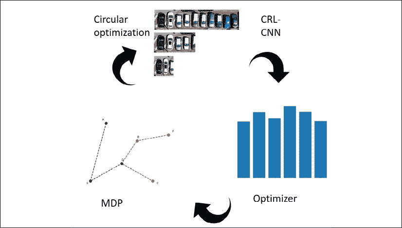

图 12.3:圆形 RL-DL-CRLMM

这个模型中的 CRL-CNN在停车场寻找空间，而不是传送带上的缝隙。

RL-DL-CRLMM 模型包含一个**卷积神经网络** ( **CNN** )和一个**马尔可夫决策过程** ( **MDP** )通过一个优化器链接在一起。优化器包含一个 SVM(安全评估)和一组规则。

该系统现在将被称为 CRLMM。

## 应用 CRLMM 的模型

在*第 9 章*、*用卷积神经网络(CNN)进行抽象图像分类*中，训练 CRLMM 程序`CNN_STRATEGY_MODEL.py`，以识别食品加工厂传送带上输出的(伽马概念)。上一章的结尾将带到了一个更高的抽象层次。

只要数据集的 (gamma)成员处于未确定状态，它的泛化就包含矛盾但相似的概念。到本章为止，这些就是(大写 gamma)所学的概念(概念表示学习)。

= {间隙、无间隙、负载、空载、负载不足、负载充足、负载过多、车道上的汽车空间、高负载产品和传送带上缺失产品之间的距离、缝纫站上的重量… * n * }

章节的下一步是使用前面章节中构建的 CRLMM 来识别停车场中的停车位，并向自动驾驶车辆发送信号:

*   现在将缝隙感知为空间。
*   现在将空间感知为两个目标之间的距离(间隙)。
*   将需要一个上下文来确定两个对象之间的空间是正距离还是负距离。

让我们来看看我们将用来实现目标的数据集。

### 数据集

*第 9 章*、*用卷积神经网络(CNN)进行抽象图像分类*到本章使用的数据集是样本数据集。在现实生活的项目中，从网络摄像头获得正确的实时帧需要一些工作。会有灯光约束，先决条件等等。然而，哲学是相同的。

与前几章一样，GitHub 本章的`dataset`目录包含以下内容:

*   训练集
*   测试集
*   `CNN_CONCEPT_STRATEGY.py`训练出来的模特
*   `CNN_CONCEPT_STRATEGY.py`使用的`classify`目录

如前几章所解释的，一个配置良好的网络摄像头的完整帧流需要几周甚至几个月的时间来准备。它们本身就是项目。

该项目将首先决定使用一个摄像头或 IP 摄像头，可以将图像发送到嵌入在 RL-DL-CRLMM 程序中的 CNN。CNN 会将视频发送的每张图片分类为包含间隙或可用停车位。

网络摄像头通常与电脑相连，电脑会向远处的服务器发送信息。IP 摄像机可以直接向远处的机器发送信息。这两种解决方案都是连接的物联网对象。IP 摄像头可能会更贵。为了证明该解决方案是一个好的解决方案，实现团队可能会首先从网络摄像头开始。一旦项目被接受，那么从长远来看，IP 摄像头可能会更好。在这一章中，我们将把网络摄像头视为一个资金有限的研究项目。因此，我们将认为这些图像来自网络摄像头。

在这个例子中，已经演变成空间(间隙检测(距离))汽车寻找停车位。

下面是一个没有的模拟定格画面——位于一栋建筑上的网络摄像头拍摄的空间，向下指向一个停车场:


图 12.4:模拟冻结帧

我对图像进行了转换，以模拟一些可以用来简化图像的计算机视觉技术:

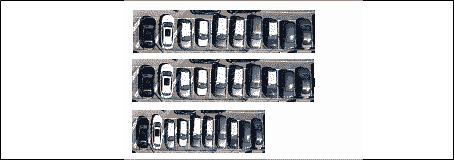

图 12.5:几乎没有间隙的停车场(没有足够的可用停车位)

下面的框代表了屏幕右侧一个很小但足够的停车位。这些示例中的图像旨在解释系统是如何构建的。我为这个例子创建了这个图像来显示-空间是否可用。再一次，我模拟了一个经过计算机视觉处理的图像，这很容易做到，但超出了本书的范围。它在停车场的更高级别表示中显示了几个可用的停车位:


图 12.6:几乎没有间隙的停车场(没有足够的可用停车位)

### 使用训练好的模型

通过使用与第 9 章、*卷积神经网络(CNN)*中*相同的`CNN_STRATEGY_MODEL.py`程序来训练模型。*

只需确保以下程序头中的目录指向`dataset/`，这是场景 2:

```
A=['dataset_O/','dataset_traffic/','dataset/']

scenario=2 #reference to A

directory=A[scenario] #transfer learning parameter (choice of images)

print("directory",directory) 
```

模型存放在`/dataset/model`。为了测试该模型，使用了在前一章中改进的`CNN_CONCEPT_STRATEGY.py`。只需更改消息并将帧分类循环限制为`2`，如以下代码片段所示:

```
MS1='available'

MS2='space'

I=['1','2','3','4','5','6'] 
```

以下加载的图像在应用 CNN 模型之前已经调整了大小:

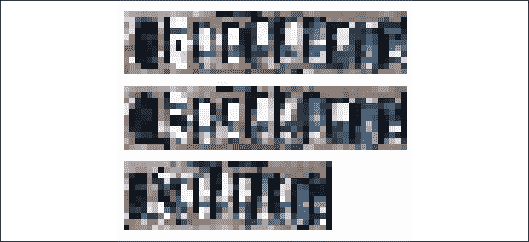

图 12.7:调整大小后的图像

#### 停车场分类

我们证明了模型是可行的。但是，在下面的部分中，我们将模拟使用随机函数发送的图像，而不是实际的图像。

现在，CRLMM 已经被训练来区分已满停车场和有可用空间的停车场，一旦找到可用停车场，SVM 就会作为中间步骤接管，我们将在下一节中看到。

# 添加 SVM 函数

无人驾驶汽车已经将包裹送到避难所。现在它必须找到一个停车场，停在那里。而不是像许多其他系统一样有一个基地，这为城市节省了许多无用的旅行成本。

## 动机——使用自动 SVM 提高安全水平

支持向量系统为路线计算增加了一个新功能——**安全**。

大多数系统，如谷歌地图，关注于:

*   最短的旅行
*   最快的旅行
*   交通

然而，自动驾驶汽车不得不采取额外的预防措施。许多人在一些道路上感到不安全。无论如何，安全第一。一旦找到合适的停车场，SVM 就必须避开车辆。

目标是通过交通找到一条路径，即使距离更长。一个 *p* 参数允许距离的 *p* %变化。例如，10%允许 10%的更长距离，并将提供安全的通道，如以下 SVM 结果所示:

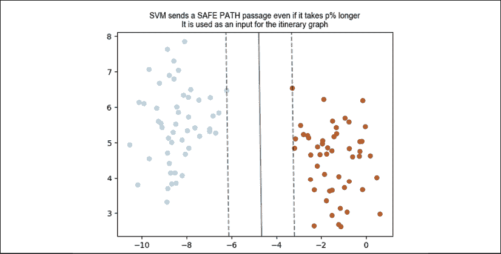

图 12.8:交通路径

值得注意的是，数据点是**而不是**实际坐标，而是更高维度的表示，如下节所述。

## 支持向量机的定义

SVM 通过将数据转换到更高的维度来对数据进行分类。例如，它会将数据分为两类。

在本节中，SVM 将用于区分危险驾驶位置和安全驾驶位置:

代码中的例子是随机的(就像现实生活中的交通一样)，但是这个模型可以进一步发展。

安全是该模型的关键，因此每个驾驶位置(道路、十字路口)都具有与该目标相关的特征:

*   该地点的事故数量
*   那个位置的交通
*   驾车经过该地点的经历(侥幸脱险，没有问题)

所有这些数据都可以输入 SVM 程序。程序将转换数据，使其可线性分离(见*第 8 章，用前馈神经网络解决异或问题*)。

左边的蓝点是好位置，右边的棕色点是危险位置。一个函数将读取另一个表中数据点的纬度和经度特征，并将它们转换回 GPS 格式。

例如，左边的蓝点可能是:

*   地点 A
*   过去十年中的一次事故
*   一年内通过该点没有任何问题

一个棕色的点可能是:

*   位置 D(距离 A 几个街区)
*   十年内发生了 74 起事故
*   一年内通过该点的 15 个问题

因此，蓝点和红点与上图中的实际位置无关。位置是**标签**。他们的特征如预期的那样被分开了。

要将数据发送到 GPS 导航系统，只需找到作为初始数据集一部分的位置的 GPS 坐标。

例如，将选择位置 A，而不是位置 d。因此，程序会查看数据集并找到其 GPS 位置。

让我们给下面的 SVM 图表添加一些词语:


图 12.10: SVM 曲线图

*   虚线垂直线之间的空间就是**边距**。这有点像橄榄球队或足球队的两条线之间的边缘。当玩家(数据点)排成一行时，一个看不见的空间或空白将他们分开。
*   接触这些边距的点是至关重要的，因为它们首先决定了边距的位置。当橄榄球或足球运动员排成一组时，SVM 将对此进行计算(参考以下 Python 函数)。这些特殊数据点被称为**支撑点**。它们也被称为支持向量**。**
***   在页边空白中间的垂直线是**决策线**。*   由于线将点分开，因此数据集是线性可分的。这意味着可以在数据点之间画一条线，并将它们分成不同的类。在这种情况下，系统希望获得安全位置(蓝点)并避免不安全的位置(棕色点)。**

 **现在我们已经定义了什么是 SVM，让我们用 Python 来实现它。

## Python 函数

`sklearn`包提供以下`svm`功能:

```
from sklearn import svm

from sklearn.datasets import make_blobs 
```

`make_blobs`功能在所有方向上为本例生成统一数据。因此，这是一个随机数据的各向同性分布。一个**斑点**包含数据点。数据点表示给定区域内汽车的集中程度，这是使用汽车的经度和纬度计算出来的。

scikit-learn 包含生成函数的高斯因子。高斯核应用平均值的标准偏差。想象你在沙箱里玩，你做了一座小山。然后，用你的手，把这堆东西切成两半。平均值是你切割沙堆的地方；标准差由两边下降的斜率表示。

收集一个好的数据集可能需要几天，有时甚至几周的时间。但是使用 scikit-learn，您可以在一行中完成，如下面的代码片段所示:

```
 #100 cars clusters(concentration of cars) represented   [Line 323]

    X, y = make_blobs(n_samples=100, centers=2, random_state=7) 
```

这个函数提供了许多参数。使用的方法如下:

*   `n_samples`，代表聚类之间分散的点数。在本例中，`100`已经表示了一个区域内汽车聚集的子集群。
*   `Centers`是生成数据的中心数。在这个例子中，`2`表示靠近自动驾驶汽车的当前位置及其未来目的地的区域。
*   `random_state`是由随机数生成器生成的种子。这是随机数序列开始的地方。这是因为我们认为随机的东西是伪随机的，所以它有确定性的基础。

在此示例中，使用线性内核来拟合模型，如以下代码所示:

```
 # the model is directly fitted. The goal is a global estimate    [Line 326]

    clf = svm.SVC(kernel='linear', C=1000)

    clf.fit(X, y) 
```

scikit-learn 的 SVM 包含一个参数惩罚，这解释了`svm.SVC`中的`C`。还有更多的选项，但关键的选项是内核。线性内核将产生线性分离，如前面的屏幕截图所示。

RBF 核会产生不同的结果。结构看起来更有规律。如下面的屏幕截图所示，RBF 核充当高效的结构正则化函数:

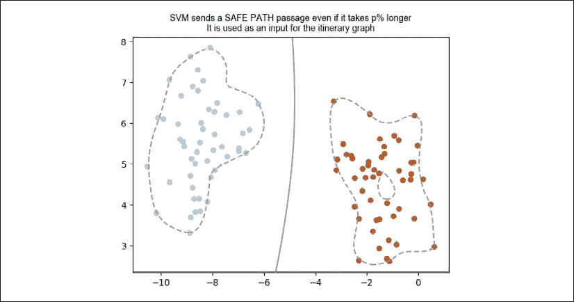

图 12.11:正则化结构路径

请记住，SVM 可用于 MNIST 和 CIFAR 数据集的图像识别。人工智能提供了不止一种方法来解决给定的问题。必要时，您可以通过灵活的试错法来选择合适的工具。

绘制线指令从第 300 行开始。要考虑的主要代码行是查找和使用决策线(参考前面的定义)并将数据点分散在页边距两侧的函数。这是通过使用以下`decision_function`实现的:

```
 Z = clf.decision_function(xy).reshape(XX.shape) 
```

将显示结果，如前所示。SVM 现在是这个无人驾驶汽车(SDC)模型中 CRLMM 的一个组件。我们准备跑 CRLMM 为 SDC 找一个可用的停车位。

# 运行 CRLMM

自动驾驶汽车的任务是一个循环(没有起点，也没有终点),就像上一章描述的 CRLMM 一样:

*   如果是在停车场，可以通过家里或者避难所激活。
*   如果它在给定的家里，它会去庇护所。
*   如果它在收容所，它可以去一个家或一个停车位。
*   如果它需要充电，可以在充电站(或者更可能是停车场)进行，这已经是一些城市的做法了。

在某一点上，自动驾驶汽车必须从特定的家到停车位。其行程的这一部分是以下各节的主题。

## 寻找停车位

`CRL-MM-IoT_SVM.py`使用上一章描述的`RL_DL.py`的微调版本。

no- (无伽玛、无间隙、无空格)结果不可接受。我们要寻找的结果是一个有缺口的图像。

如果将停车场图像分类为已满或可用空间的`crlmm`函数返回一个`0`，程序会检测到它并显示一条消息。代码示例包含以下代码摘录的行号:

```
 if(crlmm==0):    # [Line 392]

                full = load_img("FULL.JPG")

                plt.subplot(111)

                plt.imshow(full)

                plt.title('PARKING LOT STATUS : This parking lot is full.' + '\n' + 'Another webcam is consulted', fontname='Arial', fontsize=10)

                #plt.text(0.1,2, "The frame is the input of a trained CNN")

                plt.show()

                '''

                plt.show(block=False)

                time.sleep(5)

                plt.close()

                '''

                print("This parking lot is full, searching...") 
```

程序显示以下完整标志，几秒钟后关闭:

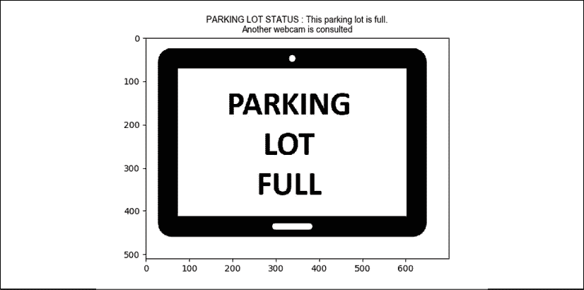

图 12.12:停车场状态

程序必须找到一个停车位。因此，它将尝试搜索好的停车场，如以下代码片段所示:

```
 for search in range(1000):    # [Line 391]

            if(crlmm==0): 
```

一千次搜索看起来很多，但对机器学习程序来说并不难。

此外，在大城市寻找可用的停车位是一件痛苦的事情。通常情况下，这是不合适的:没有足够的停车位来确保在到达那里的时间内找到一个停车位。

对于这个原型，最佳搜索的数量被限制为`2`。超过该值，以下`CRLMM`功能被激活:

```
 if(search>2):    # [Line 405]

                    a=1

                crlmm=CRLMM(Q,lr,e,a) 
```

两次搜索无果后，程序激活`a`，这是`CRLMM`功能的标志。

`CRLMM`功能现在包含随机搜索功能，模拟选择停车场，提供一级状态:

```
 status=random.randint(0,10)    # [Line 199]

    if(status>5):

        status=1

    if(status<=5):

        status=0 
```

该状态表示停车场可用性的概率估计。`a`标志模拟一个将要添加的程序，该程序将扫描所有停车场并运行该函数来查找可用空间。

在最初的会议上展示一个原型，你总是需要足够的说服力，但是如果你走得太远，如果你的想法被拒绝，这样做的成本就成了一个风险。

因此，如果`a`被激活，系统模拟扫描(待开发)并强制状态为`1`，如以下代码片段所示:

```
 if(a>0 and status==0):    # [Line 204]

        #add an available search function here that scans all the

        #webcams of then network until it finds one that suits the model (not too far parameter and available)

        status=1 
```

然后，程序继续运行经过训练的 CNN 来识别可用的停车场(参考下面的屏幕截图)，如前面的配置部分所述:

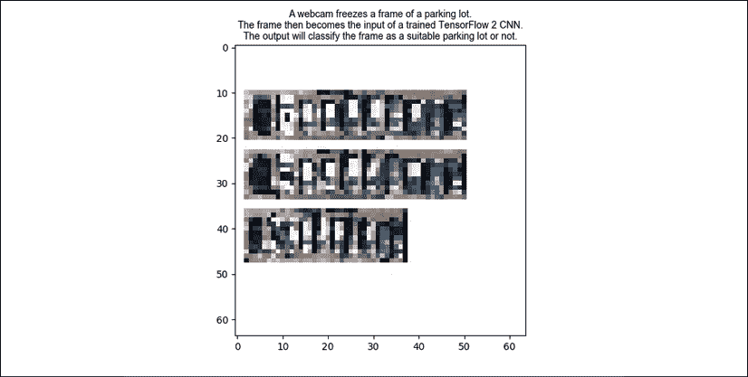

图 12.13:网络摄像头冻结了一个停车场的画面

现在已经找到一个有可用空间的停车场(框架左上角的空白空间)，搜索功能停止，下面的`break`指令被激活:

```
 if(crlmm==1):    # [Line 408]

                    a=0

                    break 
```

一旦找到停车位，就会到达`break`指令。一旦检测到可用的停车位，我们就可以决定如何到达停车场。

## 决定如何到达停车场

当`crlmm==1`时，CRLMM 程序找到了一个合适的停车场，如下面的代码所示:

```
 if(crlmm==1):    # [Line 412]

            available = load_img("AVAILABLE.JPG")

            plt.subplot(111)

            plt.imshow(available)

            plt.title('PARKING LOT STATUS : This parking lot has available space.' + '\n' + 'Now an SVM will suggest a safe route ', fontname='Arial', fontsize=10)

            #plt.text(0.1,2, "The frame is the input of a trained CNN"

            plt.show()

            '''

            plt.show(block=False)

            time.sleep(5)

            plt.close()

            '''

            print("This parking lot has available space...") 
```

它显示以下消息和一个标志:

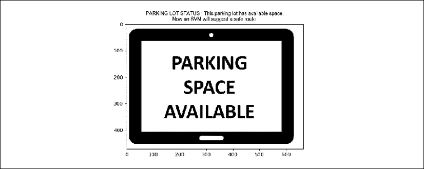

图 12.14:停车场状态

既然我们找到了一个可用的停车位，我们需要为 SDC 找到一条安全的路线。这意味着 SDC 将避开交通，使自主机器学习程序更容易进行。现在是激活该功能的时候了。

### 支持向量机

CRLMM 现在要求安全路线，即使这意味着花费更长的时间(时间或距离)。自动驾驶汽车需要严格的安全第一政策。

该程序达到以下 SVM 函数:

```
 print("This parking lot has available space...")    # [Line 424]

            SAFE_SVM() 
```

配置部分描述的 SVM 提供了一条通过流量的安全路径，如结果的屏幕截图所示:

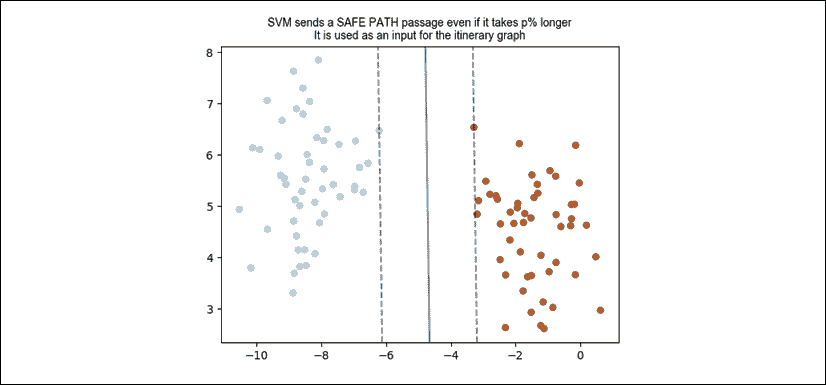

图 12.15:流量图

例如，在这种随机情况下(大部分时间流量都是随机的)，左侧的蓝点表示流量较稀疏，棕色点表示流量较密集的区域。在实际实现中，目标是为程序中的 MDP 提供信息，以便它出于安全原因在较稀疏的交通中找到路径，从而限制 SDC 在较密集的交通中可能出现的错误。过去事故的统计数据和汽车的体验的权重也可以加入，以创建这种安全模式旅行规划者的更深层次的愿景。

假设自动驾驶汽车要去棕色区域的一个点。SVM 将:

*   建议一条尽可能穿过蓝点区域的路线，然后才是棕色区域。
*   将信息发送到谷歌地图。这将需要一个额外的脚本来读取包含 SVM 中每个数据点的 GPS 坐标的数据集。

许多司机在拥挤的高速公路或人口密集的城市里感到不安全。给地图软件添加最安全的路线功能会有所帮助。

SVM 将数据点带到了一个更高的水平(参见本章配置部分的解释)。

SVM 函数中表示的点**不是**实际位置，而是抽象的表示。分割线需要通过一个函数，将该信息转换成一个真实的位置数据点。

一旦 SVM 边界被转换成位置数据点，旅程或行程图被激活。

### 路线图表

原型通过以下函数调用显示了基于 SVM 建议及其权重向量的路线图模拟:

```
 print("SAFE PASSAGE SUGGESTED")    # [Line 426]

            MDP_GRAPH(lr,e) 
```

下图用红色显示了最安全的旅程，即使它需要更长的时间(时间或距离):

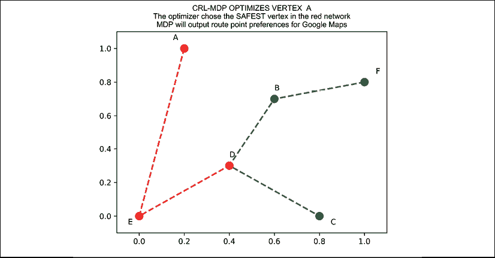

图 12.16:优化器选择了最安全的路线

出于原型的目的，SVM 没有直接连接到图表，这需要花费大量的时间。

相反，插入了下面的`random.randint`函数，该函数模拟任何情况下停车位的随机可用性:

```
 for wi in range(6):    [Line 430]

                op=random.randint(0,5)

                if(W[op]>maxw):

                    lr=op;maxw=W[op] 
```

请记住，就最初向潜在客户或经理展示而言，对原型进行进一步开发是没有用的。

这种类型的原型比幻灯片更强大，因为它证明了你的合法性。幻灯片是静态的，不能证明你在这个特定主题上的能力。原型将显示你的专业知识。一旦我们有了最安全的位置，我们就可以更新 MDP 的权重向量，如前一章所述。

### 权重向量

显示重量向量。在这个模型中，权重代表位置，就像上一章一样。然而，在本章的中，权重是一个等级:

*   在过去的几年里，当该区域周围发生一些事故时，每个重量都有一个较高的安全等级。这个是一个**安全等级**。这个排名应该是我们行程软件的一部分。我们应该被告知。
*   自动驾驶汽车的体验将定制每个重量。是自己的行车记录。由于软件有缺陷而导致的未遂事件将使重量下降。良好的业绩记录会增加权重。对人类来说很容易的事情对软件来说可能很难，反之亦然。

如果原型被接受，系统现在显示与待开发的内部更新程序一起使用的重量。以下代码调用管理自动驾驶车辆最安全路线权重的函数，并显示直方图:

```
 print("Vertex Weights",W)    # [Line 428]

            MDP_CRL_graph(W,lr) 
```

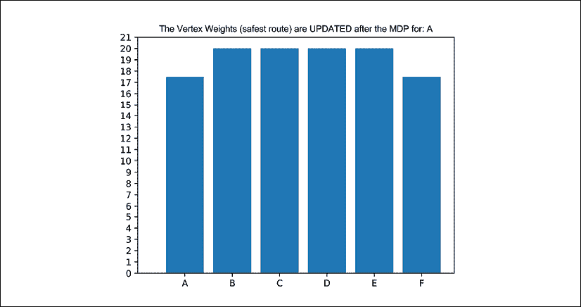

图 12.17:更新后的权重顶点直方图(最安全的路线)

我们检测到一个可用的停车位，要求 SVM 提供到达该停车位需要经过的最安全区域，更新每个区域的权重，并将信息发送到 MDP 以计算安全路线。

# 摘要

与上一章一样，本章描述了一个无人参与的互联物联网流程。这一趋势将在未来几年扩展到各个领域。

这也说明知道如何使用一个工具是需要努力的，尤其是在学习人工智能的时候。为特定市场设想解决方案需要的不仅仅是努力工作。创造力不会随着工作而来。它通过将你的思想从任何形式的束缚中解放出来而发展。

一旦想出了解决方案，接下来就要区分为演示做太多和做得不够。CRLMM 提供了一种框架，有助于建立一个技术解决方案(CNN，MDP，SVM 和优化)，同时保持其他人理解的日常概念。

本章还表明，人工智能模型可以包含算法，RL，DL，SVM 和 CRL 认知方法的集合，等等。

下一章将带我们深入神经网络和 TensorFlow 2 的内部，窥视人工神经网络的过程。

# 问题

1.  在任何情况下，快速开车到一个地点都比安全要好。(是|否)
2.  自动驾驶汽车永远不会真正取代人类司机。(是|否)
3.  有一天机器人自动驾驶消防车能灭火吗？(是|否)
4.  各大城市需要投资自动驾驶汽车还是回避？(投资|避免)
5.  你会信任一辆自动驾驶巴士接送孩子上下学吗？(是|否)
6.  你能在高速公路上的自动驾驶汽车里睡觉吗？(是|否)
7.  你愿意为一个城市的一个项目开发一个自动驾驶程序吗？(是|否)

# 进一步阅读

*   有关支持向量机的更多信息，请参考这些链接:[http://scikit-learn.org/stable/modules/svm.html](http://scikit-learn.org/stable/modules/svm.html)、[http://sci kit-learn . org/stable/auto _ examples/SVM/plot _ separating _ hyperplane . html # sphx-glr-auto-examples-SVM-plot-separating-hyperplane-py](http://scikit-learn.org/stable/auto_examples/svm/plot_separating_hyperplane.html#sphx-glr-auto-examp)**