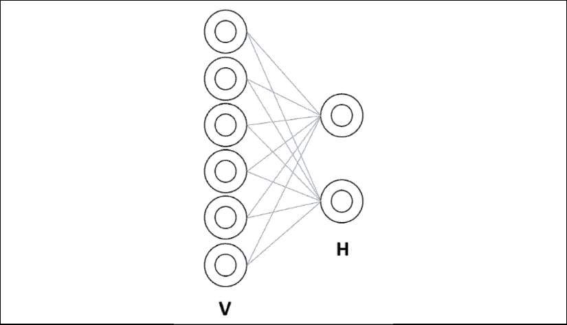
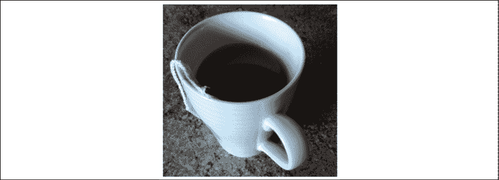
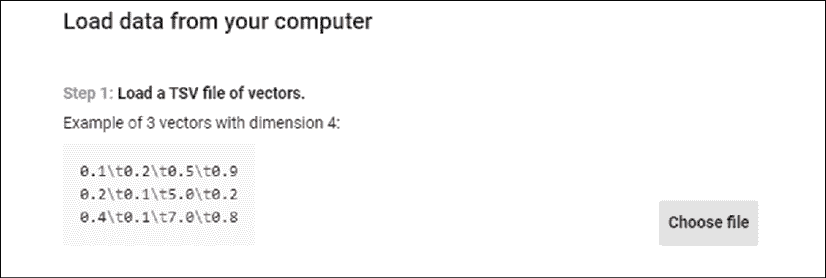
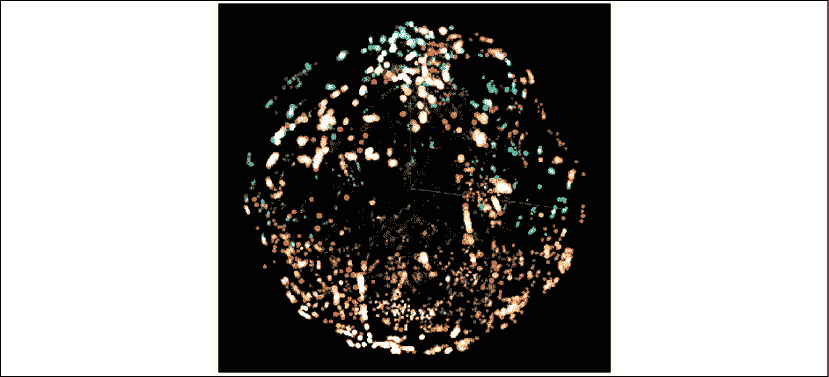
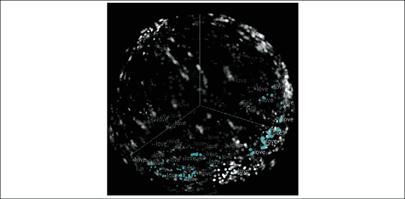

# 十四、使用受限玻尔兹曼机(RBMs)和主成分分析(PCA)准备聊天机器人的输入

在接下来的章节中，我们将探索聊天机器人框架并构建聊天机器人。你会发现创建一个聊天机器人结构只需要点击几下。然而，如果不设计输入来准备所需的对话流，就无法构建聊天机器人。本章的目的是在*第十五章*、*设置认知 NLP UI/CUI 聊天机器人*中演示如何从数据集中提取特征，然后使用它们收集基本信息来构建聊天机器人。

对话的输入需要深入的研究和设计。在这一章中，我们将构建一个**受限玻尔兹曼机器** ( **RBM** )来分析数据集。在*第 13 章*、*使用 TensorFlow 2.x 和 TensorBoard* 可视化网络中，我们检查了卷积神经网络(CNN)的层并显示了它们的输出。这一次，我们将探索 RBM 的重量。我们将进一步使用 RBM 的权重作为特征。RBM 的权重可以被转换成用于**主成分分析** ( **PCA** )算法的特征向量。

我们将使用 RBM 生成的特征向量，通过 TensorBoard 嵌入投影仪的功能来构建 PCA 显示。然后，我们将使用获得的统计数据为聊天机器人的输入奠定基础。

为了说明整个过程，我们将使用流平台数据作为示例来说明这是如何完成的。流媒体已经成为几乎所有智能手机用户的核心活动。网飞、YouTube、亚马逊或任何提供流媒体服务的平台面临的问题是为我们提供合适的视频。如果观看者观看视频，并且平台没有显示下一个要观看的相关的相似视频，则观看者可能选择使用另一个平台。

本章分为两部分:

*   构建 RBM，然后将其扩展到自动特征向量生成器
*   使用主成分分析将 RBM 的权重表示为特征。TensorFlow 的嵌入式投影仪具有内置的 PCA 功能。生成的统计数据将为*第 15 章*、*建立认知 NLP UI/CUI 聊天机器人*提供对话结构的基础。

让我们首先定义我们正在使用的基本术语和我们的目标。

# 定义基本术语和目标

本章的目标是准备数据以创建我们将在*第 15 章*、*建立认知 NLP UI/CUI 聊天机器人*中构建的聊天机器人的输入。

创建聊天机器人需要准备。我们不能在没有最起码的信息的情况下就进入一个项目。在我们的例子中，我们将检查我基于电影偏好创建的数据集。我没有选择下载大型数据集，因为我们需要首先专注于理解过程并使用基本数据建立模型。

在线平台上的数据集的大小每天都在增加。当我们在流媒体平台上观看电影时，例如在网飞，我们可以喜欢这部电影或点击拇指向下按钮。

当我们在网络平台上赞成或反对一部电影时，我们的偏好会被记录下来。这些电影的特点为平台提供了有价值的信息，然后平台可以显示我们更喜欢的选择:动作片、冒险片、浪漫片、喜剧片等等。

在这一章中，我们将首先使用 RBM 来提取一个用户或一组用户观看的电影的描述(例如动作、冒险或喜剧)。我们将采用 RBM 产生的输出权重来创建反映用户偏好的特征文件。

这个用户偏好的特征文件可以被认为是一个人的“心理数据集”。这个名字乍一看可能很奇怪。然而，一个人的“精神”表现超出了标准的年龄、收入和其他客观数据。“爱”、“暴力”和“视野”(更广阔的视野、冒险)等特征比我们在驾照上找到的信息更能让我们深入了解一个人。

在本章的第二部分，我们将使用 RBM 输出的人的“头脑”的特征作为主成分分析的输入。PCA 将计算这些特征如何相互关联以及它们如何变化，我们将在 TensorBoard 中显示它们。

然后，我们将通过从 RBM 中提取的关键特征，实际上看到一个人思想的表现。这些信息将在第 15 章中帮助我们创建一个定制的聊天机器人。

让我们进入第一阶段，建立一个 RBM。

# 介绍和构建 RBM

RBM 是随机和无向的图模型，通常由一个可见层和一个隐藏层构建。他们在网飞的一次比赛中被用来预测未来的用户行为。这里的目标不是预测观众会做什么，而是确定观众是谁，并将数据存储在观众的个人资料结构的思维数据集中。输入数据表示要被训练以了解观众 X 的特征。每一列表示 X 的潜在个性和品味的特征。每行代表 X 看过的一部电影的特点。以下代码(和本节)在`RBM_01.py`中:

```
np.array([[1,1,0,0,1,1],

         [1,1,0,1,1,0],

         [1,1,1,0,0,1],

         [1,1,0,1,1,0],

         [1,1,0,0,1,0],

         [1,1,1,0,1,0]]) 
```

这个 RBM 的目标是通过计算观看的电影的特征来定义 X 的轮廓。与任何神经网络一样，输入数据也可以是图像、文字和其他形式的数据。

首先，我们将探索架构并定义什么是能量驱动的神经网络。然后，我们将使用 Python 从头开始构建一个 RBM。

## RBM 的建筑

使用的 RBM 模型包含两层:一个可见层和一个隐藏层。存在许多类型的 RBM，但一般来说，它们包含以下属性:

*   可见单元之间没有联系，这也是*受限*的原因。
*   在实现网络的受限属性的隐藏单元之间没有连接。
*   在前馈神经网络(FNN)中没有方向，如第 8 章、*中的*所述，用前馈神经网络解决异或问题*。因此，RBM 的模型是一个无向图。*
*   可见和隐藏的层由一个权重矩阵和一个偏置向量连接，如下图所示:



图 14.1:可见单元和隐藏单元之间的连接

该网络包含六个可见单元和两个隐藏单元，产生一个 2×6 值的权重矩阵，我们将向其中添加偏差值。

您会注意到没有输出。系统从可见单元运行到隐藏单元，然后返回。我们正在用这种类型的网络进行特征提取。例如，在本章中，我们将使用权重作为特征。

RBM 通过权重矩阵强制网络以 2 个单位表示包含在 6 个单位中的数据，从而创建要素制图表达。隐藏单元、权重和偏差可用于特征提取。

## 基于能源的模型

RBM 是一款基于能源的车型。能量越高，获得正确信息的概率越低；能量越低，概率越高——换句话说，准确度越高。

为了理解这一点，让我们回到我们在*第一章*、*通过强化学习开始下一代人工智能*中观察到的一杯茶:



图 14.2:一杯茶的复杂性

在第 1 章的*中，我们通过杯子的整体内容和温度观察到了杯子的微观状态。然后，我们继续使用马尔可夫决策过程(MDP)来运行微观状态计算。*

这一次，我们将重点关注一杯茶的温度。 *x* 将一杯茶中所有分子的全球温度:

*   如果 *x* = 1，这意味着温度非常高。茶刚刚煮沸。
*   如果 *x* = 0.5，这意味着温度已经下降。
*   如果 *x* = 0.1，这意味着温度还有点暖，但是茶在变凉。

温度越高，越多的分子在杯子里以高能量反弹，使杯子感觉很热。

但是，越热，越接近非常热，我们能喝的概率就越低。

这导致温度 *x* 的概率 *p* :

*   *x* - > 1， *p* - > 0
*   *x* - > 0， *p* - > 1

如你所见，在能源驱动系统中，我们将努力降低能源水平。假设我们有一个人对热饮有未知的耐受性，我们想打赌他们是否能喝我们的茶。当然，没有人想喝冷(低能量)茶，但是如果我们的重点是一个人能够喝这种茶而不觉得太热(高能量)的可能性，那么我们希望这种茶尽可能低能量(也就是说，凉)!

为了说明我们一杯茶的 *p* ( *x* )系统，我们就用欧拉数 *e* ，等于 2.718281。 *p* ( *x* )是我们能喝到我们那杯茶的概率， *p* 是概率， *x* 是温度或能量。

我们将开始介绍一个简单的能量函数，其中*p*(*x*)=*e*^((–)^x^):

*   *p*(*e*^((-1)))= 0.36
*   *p*(*e*^((–0.5)))= 0.60
*   *p*(*e*^((–0.1)))= 0.90

你可以看到，随着-*x*(能量)减少，概率 *p* ( *x* )增加。

RBM 的学习功能的目标是通过优化权重和偏差来降低能量水平。通过这样做，RBM 增加了优化隐藏单元、权重和偏差的可能性。

为了计算 RBM 的能量，我们将考虑网络的完整架构。让我们再次展示我们的模型，如下所示:


图 14.3:可见单元和隐藏单元之间的连接

该 RBM 型号包含以下数值:

*   *E* ( *v* ， *h* )，这是考虑了可见单位(输入数据)和隐藏单位的能量函数。
*   *v*I=可视单元的状态(输入)。
*   *a* [i] =可见单位的偏差。
*   *h*j=隐藏单元的状态。
*   *b* [j] =隐藏单元的偏差。
*   *w*ij=权重矩阵。

考虑到这些变量，我们可以将、和 *ij* 的 RBM 的能量函数定义为权重矩阵的行和列，如下所示:


现在我们对什么是 RBM 及其背后的原理有了更好的了解，让我们开始考虑如何使用 Python 从头构建一个 RBM。

## 用 Python 构建 RBM

我们将使用`RBM_01.py`从开始构建一个 RBM，不用预先构建库。这个想法是从上到下理解一个 RBM，看看它是如何运行的。我们将在制造机器时探索更多的 RBM 理论。

### 创建类和 RBM 的结构

首先，RBM 级被创建:

```
class RBM:

    def __init__(self, num_visible, num_hidden):

        self.num_hidden = num_hidden

        self.num_visible = num_visible 
```

该类的第一个函数将接收隐藏单元的数量(`2`)和可见单元的数量(`6`)。

在第 20 行用随机权重值初始化权重矩阵:

```
 np_rng = np.random.RandomState(1234)

        self.weights = np.asarray(np_rng.uniform(

            low=-0.1 * np.sqrt(6\. / (num_hidden + num_visible)),

            high=0.1 * np.sqrt(6\. / (num_hidden + num_visible)),

            size=(num_visible, num_hidden))) 
```

现在将在第 27 行的第一行和第一列中插入偏置单元:

```
 self.weights = np.insert(self.weights, 0, 0, axis = 0)

        self.weights = np.insert(self.weights, 0, 0, axis = 1) 
```

这个模型的目标是观察砝码的行为。观察权重将决定如何根据可见单元和隐藏单元之间的计算来解释该模型中的结果。

第一行和第一列是偏差，如前面的代码片段所示。对于分析功能，将只分析重量。权重和偏差现在都到位了。

### 在 RBM 类中创建训练函数

在线 30 上，创建训练功能:

```
 def train(self, data, max_epochs, learning_rate): 
```

在此功能中:

*   `self`是上课
*   `data` is the 6×6 input array, containing 6 lines of movies and 6 columns of features of the movies:

    ```
    np.array([[1,1,0,0,1,1],

              [1,1,0,1,1,0],

              [1,1,1,0,0,1],

              [1,1,0,1,1,0],

              [1,1,0,0,1,0],

              [1,1,1,0,1,0]]) 
    ```

    本章的 RBM 模型是使用**可见二进制单位**，如输入所示，是该模型的训练数据。RBM 将使用该输入作为训练数据。

    RBM 可以包含其他类型的单位:softmax 单位、高斯可见单位、二项式单位、校正线性单位等等。我们的模型关注二进制单位。

*   `max_epochs`是 RBM 将运行训练的个纪元。
*   `learning_rate`是将应用于包含权重和偏差的权重矩阵的学习率。

我们现在将在第 35 行的第一列中插入`1`的偏差单位:

```
 data = np.insert(data, 0, 1, axis = 1) 
```

还有其他策略来初始化偏见。这是一个试错过程，取决于你的项目。在这种情况下，`1`的偏置单元足以完成工作。

### 计算训练函数中的隐藏单元

在第 37 行，我们开始在`max_epochs`期间通过计算隐藏单元的值来训练 RBM:

```
 for epoch in range(max_epochs): 
```

第一阶段是关注隐藏的单元。我们使用点矩阵乘法激活具有权重矩阵的隐藏单元的概率:

```
 pos_hidden_activations = np.dot(data, self.weights) 
```

然后，我们应用逻辑函数，如我们在*第 2 章*、*构建奖励矩阵-设计您的数据集*中所见:

```
 pos_hidden_probs = self._logistic(

                pos_hidden_activations) 
```

调用的逻辑函数在第 63 行:

```
 def _logistic(self, x):

        return 1.0 / (1 + np.exp(-x)) 
```

我们将偏差设置为`1`:

```
 pos_hidden_probs[:,0] = 1 # Fix the bias unit. 
```

我们现在已经计算了具有随机权重的隐藏状态的概率的第一个时期。

### 用于重构和收缩发散的隐藏单元的随机抽样

有许多采样方法，例如Gibbs 采样，它有一种随机方法来避免确定性样本。

在这个模型中，我们将选择一个随机样本，该随机样本选择的隐藏概率值超过随机样本的值。`random.rand`函数创建一个随机矩阵，其值在`0`和`1`之间，大小为`num_examples` × `self.num_hidden+1`:

```
 pos_hidden_states = pos_hidden_probs >

                np.random.rand(num_examples, self.num_hidden + 1) 
```

这个样本将用于我们将在下一节探讨的**重建**阶段。

我们还需要计算**对比散度**(用于更新权重矩阵的函数)阶段的关联，这在下面解释:

```
 pos_associations = np.dot(data.T, pos_hidden_probs) 
```

可见数据单元 *v* ×隐藏数据单元 *h* 的点积可表示如下:


既然已经实现了点积，我们将构建重建阶段。

### 重建

RBM 使用其输入数据作为其训练数据，使用随机权重矩阵计算隐藏权重，然后*重建*可见单元。与其他神经网络中的输出层不同，RBM 重建可见单元，并将它们与原始数据进行比较。

以下代码应用与前面描述的隐藏单元相同的方法来生成可见单元:

```
 neg_visible_activations = np.dot(pos_hidden_states,

                self.weights.T)

            neg_visible_probs = self._logistic(

                neg_visible_activations)

            neg_visible_probs[:,0] = 1 # Fix the bias unit 
```

这些负可见单位将用于评估 RBM 的误差水平，如下所述。

既然我们已经用隐藏单元状态的样本生成了可见单元，我们继续并生成相应的隐藏状态:

```
 neg_hidden_activations = np.dot(neg_visible_probs,

                self.weights)

            neg_hidden_probs = self._logistic(

                neg_hidden_activations)

            neg_associations = np.dot(neg_visible_probs.T,

                neg_hidden_probs) 
```

注意`neg_associations`可以用以下形式表示:


在这里，我们做了以下工作:

*   使用包含训练数据的可见单元计算正隐藏状态
*   选择了那些正隐藏状态的随机样本
*   重构的负(从隐藏状态生成，而不是数据)可见状态
*   并且反过来，从产生的可见状态中产生隐藏状态

通过这个过程，我们已经*重建了*可见状态。但是，我们需要评估结果并更新权重。

### 对比分歧

为了更新权重，我们不使用梯度下降。在该能量模型中，我们使用对比散度，其可表示如下:


字母是学习率。学习率应该是一个小值，并且可以在整个训练过程中进行优化。我应用了一个小值，总体为 0.001。

更新权重的源代码如下:

```
 self.weights += learning_rate * ((pos_associations -

                neg_associations)) 
```

随着时间的推移，权重将会调整，降低能量和误差水平，从而提高概率的准确性。

在这一点上，我们将显示误差水平和整个时期的 RBM 的能量值。

### 误差和能量函数

在第 56 行，误差函数计算由数据提供的可视单位和重建的可视单位之间的差的平方和:

```
 error = np.sum((data - neg_visible_probs) ** 2) 
```

对于能量函数，我们可以使用我们最初的能量方程:


在我们的代码中，我们不会使用偏差，因为我们经常将它们设置为`1`。

我们还需要一个函数来测量 RBM 能量的演化。

能量将用概率函数 *p* 来测量:


*Z* 是一个**配分函数** ，用于确保每个 *x* 输入的概率之和不超过 1:


配分函数是每个 *x* 的所有个体概率的总和:


相应的代码将计算 RBM 的能量，该能量将随着 RBM 经历的时代而随时间减少:

```
 energy=-np.sum(data) - np.sum(neg_hidden_probs)-

                np.sum(pos_associations * self.weights)

            z=np.sum(data)+np.sum(neg_hidden_probs)

            if z>0: energy=np.exp(-energy)/z; 
```

你会注意到误差函数和能量函数都不会影响训练过程。训练过程基于对比差异。

“误差”和“能量”值将通过提供对 RBM 训练行为的一些洞察来衡量模型的效率。

以下是流程开始和结束时的测量值示例:

```
Epoch 0: error is 8.936507744240409  Energy: 1586106430052073.0

...

Epoch 4999: error is 4.498343290467705  Energy: 2.426792619597097e+46 
```

在时间 0，误差高，能量也高。

在时期 4999，误差足够低以使模型产生正确的特征提取值。能量已经明显减少了。

## 运行时期并分析结果

一旦 RBM 已经优化了n 个时期的权重偏差矩阵，该矩阵将为个人 X 的简档系统提供以下信息，例如:

```
[[ 0.91393138 -0.06594172 -1.1465728 ]

[ 3.01088157 1.71400554 0.57620638]

[ 2.9878015 1.73764972 0.58420333]

[ 0.96733669 0.09742497 -3.26198615]

[-1.09339128 -1.21252634 2.19432393]

[ 0.19740106 0.30175338 2.59991769]

[ 0.99232358 -0.04781768 -3.00195143]] 
```

RBM 模型使用随机值，每次训练都会产生略微不同的结果。

RBM 将训练输入并显示添加到 X 的个人资料中的特征。

已经为人 x 训练了特征的权重。第一行是偏差，检查第 2 列和第 3 列。下面六行是 X 的特征权重:

```
[[ 0.913269 -0.06843517 -1.13654324]

[ 3.00969897 1.70999493 0.58441134]

[ 2.98644016 1.73355337 0.59234319]

[ 0.953465 0.08329804 -3.26016158]

[-1.10051951 -1.2227973 2.21361701]

[ 0.20618461 0.30940653 2.59980058]

[ 0.98040128 -0.06023325 -3.00127746]] 
```

权重(粗体)是第 2 行到第 6 行和第 2 列到第 3 列。第一行和第一列是偏差。

解释 RBM 权重的方法仍然是一个谨慎的策略。在这种情况下，一种创造性的方法被用来确定营销行为。RBM 还有许多其他用途，例如图像处理。在这种情况下，权重矩阵将通过对要素的权重线求和来提供 X 的剖面，如以下代码所示:

```
 for w in range(7):

        if(w>0):

            W=print(F[w-1],":",r.weights[w,1]+r.weights[w,2]) 
```

要素现在已被标注，如下图所示:

```
love : 2.25265339223

happiness : 2.28398311347

family : -3.16621250031

horizons : 0.946830830963

action : 2.88757989766

violence : -3.05188501936

A value>0 is positive, close to 0 slightly positive

A value<0 is negative, close to 0 slightly negative 
```

我们可以看到，超越标准的电影分类，X 有些喜欢地平线，不喜欢暴力，喜欢动作。x 发现幸福和爱情很重要，但在这一点上家庭并不重要。

RBM 提供了 X 的个人资料——不是预测，而是准备通过聊天机器人提出建议，或者只是建立 X 的机器思维数据集。

我们获取了一个数据集，并使用 RBM 从中提取了主要特征。下一步将使用权重作为 PCA 的特征向量。

# 使用 RBM 的权重作为 PCA 的特征向量

在这一节中，我们将编写一个`RBM_01.py`的增强版本。`RBM_01.py`产生一个名为 x 的观众的特征向量。现在的目标是提取 12，000 个观众的特征，例如，为 PCA 提供足够数量的特征向量。

在`RBM_01.py`中，观众 X 最喜欢的电影首先以矩阵形式提供。现在的目标是产生 12，000 个观众向量的随机样本。

手头的第一项任务是创建一个 RBM 启动器，运行 RBM 12，000 次，以模拟随机选择的观众和他们最喜欢的电影，即观众喜欢的电影。然后，将存储每个观众的特征向量。

`RBM_launcher.py`首次进口 RBM 为`rp`:

```
import RBM as rp 
```

`RBM_launcher.py`的主要目标是执行运行 RBM 的基本功能。一旦`RBM`被导入，特征向量的`.tsv`文件被创建:

```
#Create feature files

f=open("features.tsv","w+")

f.close 
```

当调用作为`rp`导入的`RBM`函数`rp`时，它将追加特征文件。

下一步是创建包含元数据的标签文件:

```
g=("viewer_name"+"\t"+"primary_emotion"+"\t"+"secondary_emotion"+

    "\n")

with open("labels.tsv", "w") as f:

    f.write(g) 
```

你会注意到“情绪”这个词的用法在这种情况下，“情感”指的是一般情感分析的特征，而不是特定的人类情感。请阅读“情绪”在这种情况下作为情绪分析功能。

现在，我们准备运行 RBM 12，000+次，例如:

```
#Run the RBM feature detection program over v viewers

print("RBM start")

vn=12001

c=0

for v in range (0,vn):

    rp.main()

    c+=1

    if(c==1000):print(v+1);c=0;

print("RBM over") 
```

`rp.main()`调用`RBM.py`中的`main()`函数，我们现在将为该流程增强该函数。

我们将在另一个名为`RBM.py`的文件中逐步增强`RBM_01.py`。我们将修改代码第 65 行来创建一个 RBM 启动器选项:

变量名`pt`被设置为`0`或`1`，这取决于我们是否希望显示中间信息:

```
 # RBM_launcher option

    pt=0  #restricted printing(0), printing(1) 
```

由于这是一个自动过程，因此`pt`被设置为`0`。

10 部电影的元数据存储在`titles`:

```
 # Part I Feature extractions from data sources

    # The titles of 10 movies

    titles=["24H in Kamba","Lost","Cube Adventures",

            "A Holiday","Jonathan Brooks",

             "The Melbourne File", "WNC Detectives",

             "Stars","Space L","Zone 77"] 
```

从第 71 行开始创建电影的特征矩阵，每个电影具有六个特征，具有与`RBM_01.py`中相同的特征:

```
 # The feature map of each of the 10 movies. Each line is a movie.

    # Each column is a feature. There are 6 features: ['love', 'happiness', 'family', 'horizons', 'action', 'violence']

    # 1= the feature is activated, 0= the feature is not activated

    movies_feature_map = np.array([[1,1,0,0,1,1],

                                   [1,1,0,1,1,1],

                                   [1,0,0,0,0,1],

                                   [1,1,0,1,1,1],

                                   [1,0,0,0,1,1],

                                   [1,1,0,1,1,0],

                                   [1,0,0,0,0,0],

                                   [1,1,0,1,1,0],

                                   [1,1,0,0,0,1],

                                   [1,0,0,1,1,1],

                                   [1,1,0,0,1,0],

                                   [1,1,0,1,1,1],

                                   [1,1,0,0,1,1]]) 
```

矩阵的每一行包含一部电影，每一列是该电影的六个特征之一。如果值为`0`，则特征不存在；如果值为`1`，则该特征存在。

在未来的几年里，每部电影的功能数量将扩展到每部电影的无限数量，以微调我们的偏好。

创建一个空的输出矩阵。在`RBM_01.py`中，提供了结果。在本例中，它将填充随机选项:

```
 #The output matrix is empty before the beginning of the analysis

    #The program will take the user "likes" of 6 out of the 10 movies

    dialog_output = np.array([[0,0,0,0,0,0],

                              [0,0,0,0,0,0],

                              [0,0,0,0,0,0],

                              [0,0,0,0,0,0],

                              [0,0,0,0,0,0],

                              [0,0,0,0,0,0]]) 
```

现在，随机电影选择器将生成每个电影和每个观众的喜欢或不喜欢:

```
 #An extraction of viewer's first 6 liked 6 movies out n choices

    #Hundreds of movies can be added. No dialog is needed since a cloud streaming services stores the movie-likes we click on

    mc=0   #Number of choices limited to 6 in this example

    a="no" #default input value if rd==1

    #for m in range(0,10):

    if pt==1:print("Movie likes:");

    while mc<6:

        m=randint(0,9)# filter a chosen movie or allow (this case) a person can watch and like a movie twice=an indication

        b=randint(0,1)# a person can like(dislike) a movie the first time and not the second(or more) time

        if mc<6 and (a=="yes" or b==1):

            if pt==1:print("title likes: ",titles[m]);

            for i in range(0,6):dialog_output[mc,i]=

                movies_feature_map[m,i];

            mc+=1

        if mc>=6:

            break 
```

我们可以选择是否显示输入:

```
 #The dialog_input is now complete

    if pt==1:print("dialog output",dialog_output); 
```

对话输出是平台通过其喜欢/不喜欢界面收集的数据。RBM 运行其训练课程:

```
 #dialog_output= the training data

    training_data=dialog_output

    r = RBM(num_visible = 6, num_hidden = 2)

    max_epochs=5000

    learning_rate=0.001

    r.train(training_data, max_epochs,learning_rate) 
```

现在从第 185 行到第 239 行处理 RBM 训练期的结果，以将获得的权重转换成特征向量和相应的元数据:

```
###Processing the results

    # feature labels

    F=["love","happiness","family","horizons","action","violence"]

    .../...

        control=[0,0,0,0,0,0]

        for j in range(0,6):

            for i in range(0,6):

                control[i]+=dialog_output[j][i]

    ###End of processing the results 
```

现在的目标是选择给定观众选择的给定电影的主要特征。这个特征可以是“爱”或“暴力”,例如:

```
 #Selection of the primary feature

    for w in range(1,7):

        if(w>0):

            if pt==1:print(F[w-1],":",r.weights[w,0]);

            tw=r.weights[w,0]+pos

            if(tw>best1):

                f1=w-1

                best1=tw

            f.write(str(r.weights[w,0]+pos)+"\t")

    f.write("\n")

    f.close() 
```

次要特征也很有意思。它通常提供比主要特征更多的信息。观众将倾向于观看某种类型的电影。然而，次要特征因电影而异。例如，假设一个年轻的观众喜欢动作片。“暴力”可能是主要特征，但次要特征在一种情况下可能是“爱”，在另一种情况下可能是“家庭”。次要特征存储在该观众的特征向量中:

```
 #secondary feature

    best2=-1000

    for w in range(1,7):

        if(w>0):

            tw=r.weights[w,0]+pos

            if(tw>best2 and w-1!=f1):

                f2=w-1

                best2=tw 
```

元数据保存在标签文件中:

```
 #saving the metadata with the labels

    u=randint(1,10000)

    vname="viewer_"+str(u)

    if(pt==1):

        print("Control",control)

        print("Principal Features: ",vname,f1,f2,"control")

    f= open("labels.tsv","a")

    f.write(vname +"\t"+F[f1]+"\t"+F[f2]+"\t")

    f.write("\n")

    f.close() 
```

在这个例子中，这个过程将重复 12，000 次。

特征向量`features.tsv`文件已创建:


图 14.4:特征向量文件

特征向量`labels.tsv`元数据文件匹配特征向量文件:

```
viewer_name    primary_emotion    secondary_emotion

viewer_8481    love               violence

viewer_3568    love               violence

viewer_8667    love               horizons

viewer_2730    love               violence

viewer_3970    love               horizons

viewer_1140    love               happiness 
```

你会注意到“爱”和“暴力”经常出现。这来自于我建立数据集的方式，主要基于包含动作和角色之间某种形式的温暖关系的电影，这在年轻一代的电影中很典型。

既然已经创建了特征向量和元数据文件，我们可以使用 PCA 来表示这些点。

## 了解 PCA

PCA 在其他特征处理算法中，被脸书、亚马逊、谷歌、微软、IBM 和许多其他公司非常有效地应用于市场营销。

概率机器学习训练在针对服装、食品、书籍、音乐、旅游、汽车和其他市场消费者细分时仍然有效。

然而，人类不仅仅是消费者；他们是人。当他们联系网站或呼叫中心时，标准答案或刻板的情绪语气分析方法可能取决于一个人的神经。当人类与医生、律师和其他专业服务机构接触时，如果发生重大个人危机，那么一点人情味是必要的。

在这种情况下，PCA 的目标是提取关键特征来描述个人或群体。主成分分析阶段将帮助我们建立 X 的个人资料的心理表示，要么与 X 交流，要么将 X 的头脑用作强大的、留心的聊天机器人或决策者。

PCA 不是一个简单的概念，所以让我们花一些时间来正确理解它。我们将从一个直观的解释开始，之后，我们将进入它背后的数学。

PCA 获取数据，并在更高的层次上表示数据。

例如，想象你在你的卧室里。房间里有一些书籍、杂志和音乐(可能在你的智能手机上)。如果你把你的房间看作一个三维笛卡尔坐标系，你房间里的目标都在特定的 *x* 、 *y* 、 *z* 坐标中。

出于实验的目的，把你最喜欢的东西放在你的床上。把你最喜欢的东西放在一起，把你的第二选择放在稍微远一点的地方。如果你把你的床想象成一个 2D 笛卡尔空间，你已经让你的目标改变了维度。你已经把你最重视的目标带入了一个更高的维度。它们现在比那些对你来说没什么价值的东西更明显。

他们不再在他们通常的地方；它们在你的床上，具体位置取决于你的喜好。

这就是常设仲裁法院的理念。如果数据集中的数据点数量非常大，一个人的“心理数据集”的 PCA 将总是不同于另一个人的 PCA 表示，就像 DNA 一样。一个“心理数据集”是一个给定的人的思想、图像、词语和感觉的集合。它超过了经典的年龄、性别、收入等中性特征。“心理数据集”将带我们进入某人的大脑。

这就是应用于人的心理表示的概念表示学习元模型(CRLMM)的内容。每个人都是不同的，每个人都值得定制的聊天机器人或机器人待遇。

### 数学解释

计算 PCA 的主要步骤对于理解如何从直观方法过渡到 TensorBoard 嵌入式投影仪如何使用 PCA 表示数据集非常重要。

#### 差异

方差是指一个值发生变化。例如，随着夏天太阳的升起，气温变得越来越暖和。方差由给定小时的温度和几小时后的温度之间的差异表示。协方差是两个变量一起变化。例如，当我们在外面天气越热，我们就越会流汗来降温。

*   **Step 1**: Calculate the mean of the array `data1`. You can check this with `mathfunction.py`, as shown in the following function:

    ```
    data1 = [1, 2, 3, 4]

    M1=statistics.mean(data1)

    print("Mean data1",M1) 
    ```

    答案是 2.5。平均值不是中间值(数组的中间值)。

*   **Step 2**: Calculate the mean of array `data2`. The mean calculation is executed with the following standard function:

    ```
    data2 = [1, 2, 3, 5]

    M2=statistics.mean(data2)

    print("Mean data2",M2) 
    ```

    答案是。 *X* 上方的横条表示这是一个平均值。

*   **第 3 步**:使用以下等式计算方差:


现在，NumPy 将使用每个 *x* 的绝对值减去平均值来计算方差，将它们相加，并将和除以 *n* ，如下面的代码片段所示:

```
#var = mean(abs(x - x.mean())**2).

print("Variance 1", np.var(data1))

print("Variance 2", np.var(data2)) 
```

根据数据集的总体，有些方差是用*n*–1 计算的。

差异程序的结果显示在以下输出中:

```
Mean data1 2.5

Mean data2 2.75

Variance 1 1.25

Variance 2 2.1875 
```

我们已经可以看到`data2`比`data1`变化大得多。他们合得来吗？它们的方差接近还是不接近？它们以同样的方式变化吗？在下一节中，我们的目标是考虑嵌入程序的输出，找出两个单词是否经常出现在一起或彼此靠近。

#### 协方差

协方差将告诉我们这些数据集是否一起变化。该等式遵循与方差相同的原理，但现在将两个方差连接起来，以查看它们是否属于同一组:


与方差一样，分母可以是*n*–1，具体取决于您的型号。此外，在这个等式中，分子被扩展以可视化协方差的余数部分，如在`mathfunction.py`中的以下数组中实现的:

```
x=np.array([[1, 2, 3, 4],

            [1, 2, 3, 5]])

a=np.cov(x)

print(a) 
```

NumPy 的输出是一个协方差矩阵，`a`:

```
[[1.66666667 2.16666667]

 [2.16666667 2.91666667]] 
```

如果增加数据集的一些值，将会增加矩阵各部分的值。如果减少数据集的某些值，协方差矩阵的元素也会减少。

观察矩阵中的一些元素以这种方式增减需要时间和观察。如果我们能找到一两个能给我们这些信息的值呢？

#### 特征值和特征向量

为了理解协方差矩阵，特征向量将指向协方差前进的方向。特征值将表示给定特征的大小或重要性。

综上所述，特征向量将为协方差矩阵`a`提供方向和特征值的重要性。有了这些结果，我们将能够在多维空间中用 TensorBoard 嵌入投影仪来表示 PCA。

设`w`为`a`的一个特征值。特征值必须满足以下等式:

```
dot(a,v)=w * v 
```

必须存在一个向量`v`，对于这个向量`dot(a,v)`与`w*v`相同。

NumPy 将通过以下函数进行计算:

```
from numpy import linalg as LA

w, v = LA.eigh(a)

print("eigenvalue(s)",w) 
```

特征值在以下输出中显示(按升序):

```
eigenvalue(s) [0.03665681 4.54667652] 
```

现在，我们需要特征向量来查看这些值应该应用于哪个方向。NumPy 提供了一个同时计算特征值和特征向量的函数。这是因为特征向量是使用矩阵的特征值计算的，如以下代码片段所示:

```
from numpy import linalg as LA

w, v = LA.eigh(a)

print("eigenvalue(s)",w)

print("eigenvector(s)",v) 
```

该程序的输出如下:

```
eigenvector(s) [[-0.79911221  0.6011819 ]

 [ 0.6011819   0.79911221]] 
```

特征值以 1D 数组的形式出现，特征值为`a`。

特征向量出现在 2D 方阵中，对应的值(对于每个特征值)在列中。

#### 创建特征向量

剩下的步骤是将特征值从最高值到最低值排序。最高特征值将提供主分量(最重要)。与之对应的特征向量就是它的特征向量。您可以选择忽略最低值或特征。在数据集中，将有数百个，通常是数千个要表示的要素。现在我们有了特征向量:

特征向量= FV = {特征向量 [1] ，特征向量 [2] … *n* }

*n* 意味着可以有更多的特征转换成 PCA 特征向量。

#### 派生数据集

最后一步是转置特征向量和原始数据集，并将行特征向量乘以行数据:

将显示的数据=特征向量行*数据行

#### 总结一下

特征值的最高值就是主分量。特征向量将确定当乘以该向量时数据点的方向。

## 用 TensorFlow 的嵌入式投影仪表示 PCA

TensorBoard Embedding 投影仪提供内置 PCA 功能，可以快速配置以满足我们的需求。TensorBoard 可以作为一个单独的程序调用，也可以嵌入到程序中，就像我们在*第 13 章*、*用 TensorFlow 2.x 和 TensorBoard* 可视化网络中看到的那样。

然后，我们将在第 15 章、*设置认知 NLP UI/CUI 聊天机器人*中提取关于观众营销细分的关键信息，用于开始构建聊天机器人。

首先进入这个链接:[https://projector.tensorflow.org/](https://projector.tensorflow.org/)

对于以下功能，请记住 TensorBoard Embedding Projector 在每一步都工作，并且可能需要一些时间，具体取决于您的机器。我们通过点击**加载**来加载`RBM_launcher.py`和`RBM.py`产生的数据:


图 14.5:加载按钮

一旦**从您的计算机加载数据**窗口出现，我们通过点击**选择文件**加载特征向量`features.tsv`文件:



图 14.6:加载特征向量文件

我们通过在**步骤 2(可选)**中点击**选择文件**来加载`labels.tsv`元数据文件:


图 14.7:加载 TSV 文件

要获得 12，000 多个特征的良好表示，点击**球形化数据，**，默认模式下不勾选:


图 14.8:球形化数据

我们现在通过 **secondary_emotion** 选择标签，通过 **secondary_emotion** 选择颜色，通过 **secondary_emotion** 选择编辑:


图 14.9:管理标签

为了更好地查看数据，我们启动了夜间模式，这样月亮就会处于活动状态:


图 14.10:激活夜间模式

在这一点上，我们有一个很好的 PCA 表示，它像地球一样转动，我们头脑中的想法，或者我们正在分析的所有观众的头脑，这取决于我们如何使用这些特征。图像上的点是代表我们用 RBM 计算的特征的数据点，然后使用 PCA 用图像表示。这就像窥视内心一样:



图 14.11:特征的 PCA 表示

给定的人或一群人的特征的 PCA 表示提供了在聊天机器人中创建对话的重要信息。让我们分析 PCA，为聊天机器人准备数据。

## 分析 PCA 以获得聊天机器人的输入入口点

我们的目标是收集一些信息，开始使用我们的认知聊天机器人。我们将使用 TensorBoard 提供的过滤器。

选择 **secondary_emotion** 作为我们滤镜的基础:


图 14.12:过滤数据

我们正在分析的特征如下:

```
F=["love","happiness","family","horizons","action","violence"] 
```

我们需要查看每个特性的统计数据。

我们在 TensorBoard 的搜索选项中输入特征，例如“爱情”，然后单击向下箭头:


图 14.13: TensorBoard 的搜索选项

PCA 表示实时改变其视图:



图 14.14:RBM 特征的 PCA 表示

“爱”有 643 分。请注意，“爱”点以一种相对令人满意的方式分组。它们大多位于图像的同一区域，而不是遍布整个图像。这一分组表明，RBM 的权重提供了在该实验的 PCA 中证明足够正确的特征。

我们对每个特征重复该过程，以获得每个特征的点数并可视化它们。对于 GitHub 上为本章提供的数据集，我们获得:

*   爱情:643
*   幸福指数:2267
*   家庭:0
*   地平线:1521
*   行动:2976
*   暴力:4594

    **重要提示**:如果`RBM_launcher.py`再次运行，这个结果自然会改变，因为这是一个随机的观众-电影选择过程。

    

这些结果为我们针对聊天机器人的市场细分提供了有趣的信息:

*   暴力和动作指向动作片。
*   家庭=0 分给年轻观众；例如，青少年对行动比对建立家庭更感兴趣。
*   发现幸福和爱是他们寻找的视野的一部分。

这是典型的超级英雄系列和电影。超级英雄通常是孤独的个体。

当我们在第 15 章、*建立一个认知的 NLP UI/CUI 聊天机器人*中构建我们的聊天机器人时，我们将看到这是如何工作的。

# 摘要

在这一章中，我们准备了创建聊天机器人输入对话框的关键信息。使用 RBM 的重量作为特征构成了第一步。我们看到，我们可以使用神经网络从数据集中提取特征，并使用优化的权重来表示它们。

处理电影观众的喜欢/不喜欢揭示了电影的特征，这反过来提供了市场细分的心理表示。

链接到 RBM 的 PCA 将生成一个向量空间，只需点击几下，就可以在 TensorBoard 嵌入式投影仪中查看该向量空间。

TensorBoard 建立后，我们分析了统计数据，以了解数据集来源的市场细分。通过列出每个功能的点数，我们发现了推动这一市场细分的主要功能。

发现了我们正在分析的市场细分的一些关键特征后，我们现在可以进入下一章，开始为观众构建聊天机器人。同时，我们将保持后门可用，以防对话框显示我们需要微调我们的特征向量统计。

# 问题

1.  RBM 基于有向图。(是|否)
2.  RBM 的隐藏单元通常是相互连接的。(是|否)
3.  RBM 中不使用随机抽样。(是|否)
4.  PCA 将数据转换到更高维度。(是|否)
5.  在协方差矩阵中，特征向量表示代表该矩阵的向量的方向，特征值表示该向量的大小。(是|否)
6.  用机器来表现人类的思维是不可能的。(是|否)
7.  机器无法学习概念，这就是为什么经典应用数学足以为每个领域制作高效的人工智能程序。(是|否)

# 进一步阅读

*   有关成果管理制的更多信息，请参考:[https://skymind.ai/wiki/restricted-boltzmann-machine](https://skymind.ai/wiki/restricted-boltzmann-machine)
*   本章源代码的原始参考站点可以在这里找到:[https://github . com/echen/restricted-Boltzmann-machines/blob/master/readme . MD](https://github.com/echen/restricted-boltzmann-machines/blob/master/README.md)
*   杰弗里·辛顿的论文原文可以在这里找到:【http://www.cs.toronto.edu/~hinton/absps/guideTR.pdf 
*   有关 PCA 的更多信息，请参考此链接:[https://www . science direct . com/topics/engineering/principal-component-analysis](https://www.sciencedirect.com/topics/engineering/principal-component-analysis)
*   现成的 RBM 资源就在这里:[https://pypi.org/project/pydbm/](https://pypi.org/project/pydbm/)