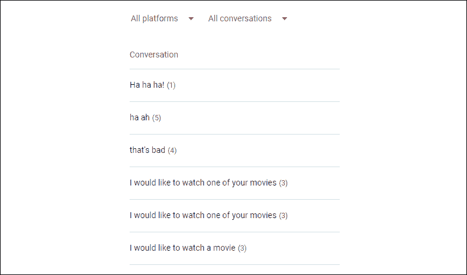
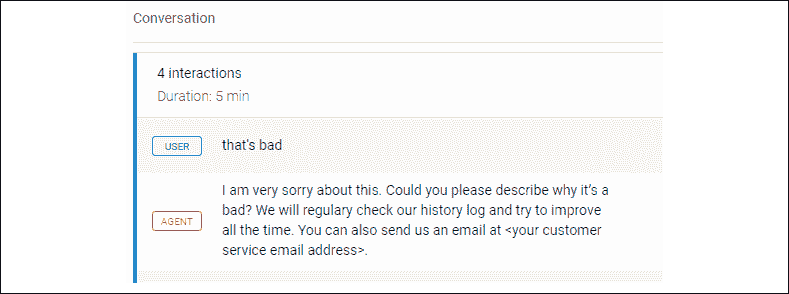
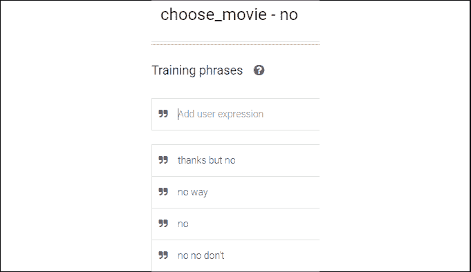
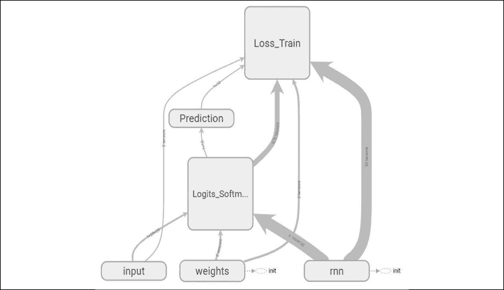
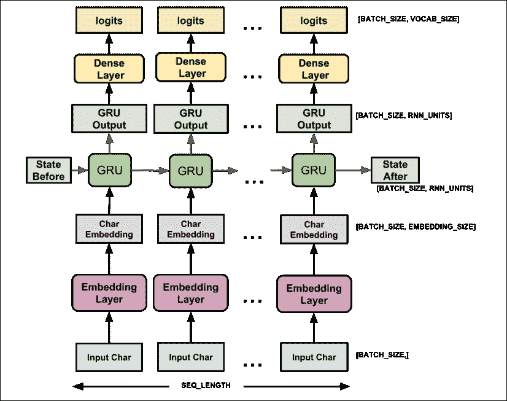
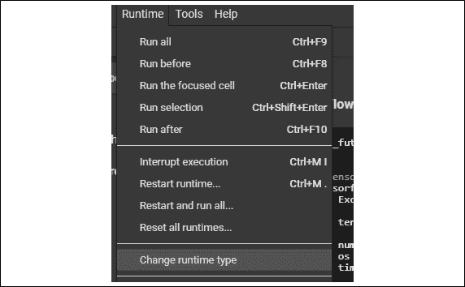
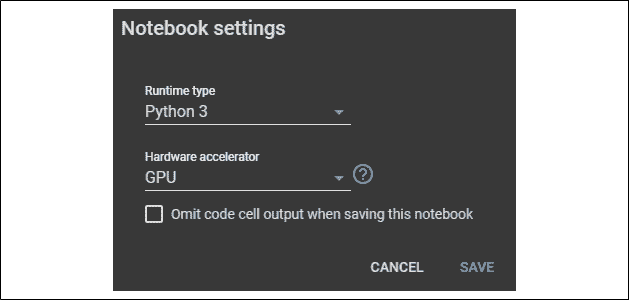

<title>Chapter_16</title>

# 16

# 改善聊天机器人的情商缺陷

情绪仍然是非理性和主观的。人工智能算法从未放弃理性和客观性。认知失调随之而来，这使得生产高效聊天机器人的任务变得复杂。

在*第 14 章*、*使用受限玻尔兹曼机器(RBMs)和主成分分析(PCA)* 准备聊天机器人的输入中，我们使用 RBM 和 PCA 方法构建了一个合理的链式算法流程。从那里，我们提取了一个细分市场的关键客观数据。从这个细分市场及其特点出发，我们在第 15 章、*中设计了一个对话，建立了一个认知 NLP UI/CUI 聊天机器人*。对话是合理的，我们为用户提供了可能的服务选择。我们这样做是出于善意，以使从请求到结果的路径尽可能短。这是一条一切顺利的道路。

在这一章中，我们将面对人性的意外反应。没有路径会挑战我们的对话。我们面临的问题之一是情感多义性，混淆了用户的情感信号。

我们将使用从*第 14 章*、*使用受限玻尔兹曼机(RBM)和主成分分析(PCA)准备聊天机器人的输入、*和*第 15 章*、*建立认知 NLP UI/CUI 聊天机器人*中提取的信息来处理*不*意外路径，并进入数据记录的世界。

数据记录将提供关键的上下文数据来满足用户。目标是创造情感，而不仅仅是对用户的情感状态做出随机反应。

最后，我们将打开大门，通过 RNN-LSTM 方法研究自动生成文本的方法。这个想法将在未来基于数据记录创建自动对话。

本章将涵盖以下主题:

*   情感多义性
*   聊天
*   数据记录
*   创造情感
*   探索 RNN-LSTM 方法

我们将首先探讨简单地对情绪做出反应和创造情绪之间的区别。

# 从对情绪做出反应，到创造情绪

设计一个对用户表达做出反应的聊天机器人是一回事。但是像人类一样在对话中创造情绪需要对聊天机器人如何管理情绪有更深的理解。先说情感多义性。

## 解决情感多义性问题

我们将从解决情感多义性问题开始，增强聊天机器人的情商。我们习惯于用词来定义一词多义，而不是用情感，因为一词多义是指一个词有多种意思的能力。在*第 6 章*、*如何使用决策树来增强 K-Means 聚类*中，我们探讨了“教练”这个词引起的混乱“蔻驰”可能意味着公共汽车或体育教练，这导致了英语到法语的翻译问题。

多义性也适用于人工智能对情绪的解释。我们将通过两个例子来探索这个领域:问候和肯定。

然后，我们将通过语音识别和面部分析来解决误导我们认为很容易从面部表情中读出情绪的谬误。

### 问候问题示例

要实现此章节，请打开 Dialogflow 并转到在*第 15 章*、*设置认知 NLP UI/CUI 聊天机器人*中创建的名为`cogfilm+<your unique ID>`的代理。

假设有人向聊天机器人代理输入“嗨”。几乎每个人都会认为这是一个好的开始。但真的是这样吗？

让我们来探索一些可能的解释:

*   **"Hi" meaning the person is very tense and irritated**: This could be the case of a top manager who never uses "Hi" to say hello, does not like chatbots, or doubts that the one that is being tested is worth anything at all.

    这位经理通常会说:“早上好”、“下午好”和“晚上好”

*   **“嗨”的意思是“那又怎样？”更像是，“你好。”这可能是一个人，P，他不喜欢刚刚跟 P 说早上好的人 Q。**
*   “嗨”，意思是“我有麻烦了。”这可能是一个通常活泼、快乐的人说，“大家好。今天过得怎么样？”但今天，只是一句简短的“嗨”这会引发他人的警觉反应，比如“你还好吗？、”“有什么不对吗？”
*   “嗨”，意思是“我在努力表现得友好些。”这可能是一个通常在早上脾气暴躁的人，他只是坐下来盯着笔记本电脑，直到咖啡里的咖啡因开始起作用。但是今天，这个人完全恢复了状态，完全清醒，说，“嗨。”这可能会引发其他人的警觉反应，例如，“某人度过了一个美好的夜晚！我错了吗？”，伴随着其他人的一些笑声。

我可以继续列举上百种“嗨”的其他情况和用法为什么？因为人类有无数的行为可以反映在相遇时的第一个“嗨”上。

这可能适用于不用说“再见”或用多种方式说“再见”就结束谈话。一个人早上和另一个人说再见的方式可以有多种含义。

因此，这是我们的挑战之一。在我们进一步讨论这个问题之前，让我们通过考虑肯定性示例来看看另一个挑战。

### 肯定的例子

假设有人在聊天机器人中输入或说“是”。这真的意味着“是”吗？

*   **“是的”，就像“是啊，无论如何。”**:用户讨厌聊天机器人。对话很无聊。用户在想，如果他们不说“是”并结束，这个对话将永远继续下去。
*   **“是”，比如“我害怕说不”。**:用户不想说“是”这个问题可以是，“你对你的工作满意吗？”用户可能害怕答案被记录和监控。用户害怕制裁。尽管这个人讨厌自己的工作，但答案会是“是的”，甚至可能是“我当然喜欢！”
*   **“是”作为一个真诚的“是”，一个人在**后立即后悔:一个人在聊天机器人的广告压力刺激下，对一项购买说“是”。但是几分钟后，同一个人会想，“为什么我答应了，然后买了那个？”因此，一些平台甚至在产品或服务交付之前就允许退款。

就像“嗨”一样，我可以用“是”列出上百种情感多义的情况

现在，我们已经理解了眼前的挑战，让我们来探索之前提到的银弹谬误。

### 语音识别谬误

许多编辑和开发者认为，语音识别将通过检测声音的语气来解决情商问题。

然而，情感多义性也适用于语调。当人类感到威胁时，他们倾向于隐藏自己的情绪，当他们信任他们的环境时，他们会敞开心扉。

让我们回到“嗨”和“是”的例子。

**用欢快的语气打招呼:例如，一个叫 X 的人走进一间办公室。有人说，“哦，你好！很高兴见到你！”人 Y 用很开心的语气回答“嗨”。谷歌主页或亚马逊 Alexa，在他们的研究实验室中，产生了 0.9%的对话进展顺利的概率。**

 **这可能是真的。也可能是假的。

比如，人 Y 讨厌人 X，人 X 知道了，说“见到你真好！”故意的。Y 人知道 X 人知道他们讨厌对方但不会屈服于先爆发。所以人“Y”用超级开心的语气回答“嗨”。

在这一点上，许多人转向面部分析。

### 面部分析谬误

情感多义性也适用于面部分析。许多人认为深度学习面部分析将解决多义性问题。

我最近看到一个开发者发的帖子，上面有一张明显是强颜欢笑的图片，并配有文字说明，快乐可以通过 DL 面部分析检测出来！

让我们来看看两种基本的面部表情:微笑和皱眉。现在，你知道情感多义性将适用于这两种情况。

#### 微笑

如果有人微笑，而 DL 面部分析算法检测到这种微笑，这意味着这个人很开心。这是真的吗？也许吧。也许不是。

也许这个人是快乐的。也许微笑是讽刺的，意思是“是啊，当然，如果你想做梦，但我不同意！”它可能意味着“别挡我的路，”或者，“我很高兴，因为我要伤害你，”或者，“我很高兴见到你。”谁知道呢？

事实是没有人知道，有时甚至微笑的人也不知道。有时候一个人会想“为什么我对她/他笑了？我讨厌她/他！”

#### 皱眉

如果某人皱眉，并且 DL 面部分析算法检测到该皱眉，则意味着此人悲伤或不开心。这是真的吗？也许吧。也许不是。

也许那个人那天很开心。事情进行得很顺利，这个人只是忘了一本书，比如，在来这个地点之前忘在家里了。也许第二个经过的人会微笑，心里想，“那又怎样？这是一个伟大的日子，我不在乎！”

也许这个人不开心。也许这个人正在看一场精彩的球赛，而他们最喜欢的球员错过了一些东西。第二秒之后，这个人想“哦，那又怎么样？反正我的队要赢了，”他笑着说。有些人只是皱眉头，如果他们正在努力思考，但这并不意味着他们不快乐。

我们现在可以看到，有成千上万的情绪多义情况发生在单词，语调和面部表情上，因此没有神奇的解决方案可以突然克服人工智能在解释人们的情绪时存在的固有困难。

我们现在将探索一些解决这个问题的现实方案。

## 聊天

闲聊根本不是解决聊天机器人情商问题的银弹。事实上，即使不谈聊天机器人，我们都在这样或那样的情况下遭受情绪困扰。闲聊会在对话中加入一些不重要的短语，比如“哇”、“酷”、“哎呀”、“太棒了”等等。

*我们不需要追求完美，但要展示善意*。每个人类都知道情商和多义性的困难。如果对方表现出善意来弥补错误，人们可以接受对话中的错误。

闲聊是赔罪表示善意的一个小步骤。

为了达到“让顾客开心”的目的，向下滚动主菜单到**闲聊**，点击那个选项，并启用它，如下图所示。我们将关注**礼貌**和**情感**:


图 16.1:菜单中的闲聊

### 礼貌

当事情出错时，礼貌会让谈话更顺畅。情商不是每次都能 100%答对。

*情商(EI)是指适应环境，纠正犯下的错误，并试图随时缓解紧张情绪。*

首先，点击**启用**，这将在对话期间触发闲聊响应:


图 16.2:启用闲聊

您会注意到**礼貌**进度条位于 0%。我们需要增加 EI:


图 16.3:闲聊主题

我们将仔细回答用户可能提出的第一个“问题”或他们可能表达的一个短语:**那不好。**

我们有麻烦了！这是最坏的情况。我们必须努力工作来弥补这一点。

情感上的多义性使得这种情况极难处理。我们不想做的一件事是假装我们的机器人是智能的。

我建议采取两种行动:

首先，仔细回答，说我们需要对此进行调查，例如:

对此我非常抱歉。你能描述一下为什么不好吗？我们将定期检查我们的历史日志，并尝试不断改进。您也可以发送电子邮件至<您的客户服务电子邮件地址>。我们会尽快回答。

您可以输入如下答案，并点击**保存**按钮:


图 16.4:礼貌

你会注意到**礼遇**进度条已经跳到了 17%。我们已经讨论了对话的关键领域。当我们没有填写所有内容时，会提供默认答案，但它们是随机的，如果您激活此功能，可以更好地输入您自己的短语。

现在通过在右上角的测试控制台中输入“这是坏的”来测试对话框。您将看到以下响应:


图 16.5:默认响应

如果您键入“bad”而不是“That's bad”，它也可以工作，这要感谢 Dialogflow 的 ML 功能:


图 16.6:默认响应

数据记录将极大地帮助提高聊天机器人的质量。

我们将在下一节探讨数据记录。但是我们先检查一下自己的情绪。

### 情感

我们就对付第一反应:**哈哈哈！**如果我们回到情感多义性的问题上，知道用户可以在任何时候说这句话，我们又有麻烦了！


图 16.7:管理情绪

用户高兴吗，或者他们在取笑聊天机器人？谁知道呢？甚至通过面部分析和语气分析，快速的“哈哈哈！”很难解释。

我建议谨慎低调地回答，比如“嗯，真令人愉快！”比如说。

这将让用户认为聊天机器人有幽默感。当你点击**保存**时，**情绪**进度条会跳起来。

您将会注意到，除了 Dialogflow 检测到的变量之外，您还可以在回复中直接输入变量。此外，如果用户输入一个不在对话框中的短语，在意图列表中会有一个后退意图。

闲聊可能会使对话更顺畅，但这只是情商的一个组成部分，在聊天机器人或日常生活中。

数据记录将使我们更进一步。

# 数据记录

在*第 15 章*、*设置认知 NLP UI/CUI 聊天机器人*中，我们使用后续意图将对话的上下文考虑在内。然而，即使后续的意图也不会为用户方面的意外答案提供解决方案。

为了增强对话，数据记录将通过记住对话的关键方面来为聊天机器人创建长期记忆。

用户和 Dialogflow 设计者必须同意谷歌 Dialogflow 数据记录功能的条款，如本页所述:[https://cloud.google.com/dialogflow/docs/data-logging](https://cloud.google.com/dialogflow/docs/data-logging)。

隐私是一件严肃的事情。然而，你会注意到，当你使用搜索引擎搜索某个产品时，你最终会看到或收到与搜索相关的广告。这是数据记录。

做这个决定取决于你的目标和目标受众。假设用户接受了协议的条款。现在，数据记录被激活。然后，数据记录将为聊天机器人提供长期记忆。

本章的其余部分将探讨数据记录，并假设用户已经清楚地接受了它。

像所有聊天机器人平台(亚马逊、微软和其他)一样，谷歌云提供日志来改进聊天机器人。许多功能、接口和服务为提高对话质量提供了强大的支持。

数据记录可以在语音识别任务之外驱动认知适应性对话。

我们将通过一个对话的历史来探索这样做的一种方法。转到**历史**:


图 16.8:菜单中的对话历史选项

您将看到过去对话的列表:



图 16.9:对话历史

注意**所有平台**列表，其中包含谷歌助手和其他平台的信息。您可以通过点击屏幕右侧的**来部署您的聊天机器人，查看它如何在谷歌助手**上工作。从那里，你可以按照指示，让它在智能手机、谷歌主页和其他地方运行。此外，你将有先进的日志数据，以改善聊天机器人。

如果您在*礼貌*部分测试了“这不好”,将会显示交互历史:



图 16.10:聊天机器人互动

知道用户名的一种方法是在出现问题时询问用户的姓名。这可以方便地定制一个对话框。因此，我们可以为这个人或这类人建立一个特殊的对话。例如，我们可以要求对方在回复中说出自己的名字和电子邮件地址。当我们手动或使用**实现**部分中的脚本分析数据日志时，我们可以跟踪问题并在个人层面上改进聊天机器人。

完成**闲聊**部分后，激活数据记录授权供您使用数据记录，我们可以开始创作情感了。谷歌将继续改进我们的聊天机器人的数据记录功能。

如果我们知道哪个用户说了什么，我们就可以改进对话框，我们将在下一节中看到。

# 创造情感

当用户输入涉及情感多义性的模糊反应时，聊天机器人很难考虑前面几节描述的数百种可能性。

在本节中，我们将重点关注试图获得服务的用户，例如在流媒体平台上访问电影。

一个高效的聊天机器人应该能够激发用户的情绪。最有效的方法是:

*   产生*客户满意度*。顾客满意是聊天机器人在无摩擦和预期的对话中应该努力产生的终极情感。如果客户对答案不满意，紧张和挫败感就会增加。
*   使用功能，如*第 14 章*的 RBM-PCA 方法、*使用受限波尔兹曼机器(RBMs)和主成分分析(PCA)准备聊天机器人的输入*，建议缩短对话路径的选项，从而使用户“满意”

我们现在将探索在第 15 章*中遇到的对话的*否*路径，设置一个认知 NLP UI/CUI 聊天机器人*。

要访问对话框的*号*路径，请转到**意图**，点击**选择 _ 电影**意图，点击**添加后续意图**，并点击下拉菜单中的**号**:


图 16.11:添加跟进意图

现在应该会出现一个**选择 _ 电影-否**选项:


图 16.12:跟进选项

点击**选择 _ 电影-否**。

Google 输入了几个默认的“不”变体，如下图所示:



图 16.13:对话流训练短语

这个“不”的回答让聊天机器人大吃一惊。在*第 14 章*中，探索了这个细分市场。出事了！

聊天机器人致力于一个特定的细分市场，即“动作”超级英雄粉丝类型的观众。答案是“否”意味着我们需要检查其他可用的功能。

*第 14 章*、*使用受限波尔兹曼机器(RBMs)和主成分分析(PCA)* 准备聊天机器人的输入，在`RBM.py`程序中的特点是:

```
 # Each column is a feature. There are 6 features:

    # ['love','happiness','family','horizons','action','violence'] 
```

迄今为止预测的“动作”特征集合了几个特征:

动作= {快乐，动作，暴力}

没有考虑以下特性:

{爱情，家庭，地平线}

既然我们想缩短路径，我们必须找到一种方式来提出一个问题:

*   涵盖了这三个特性
*   可以将现有特征矩阵用于另一个市场细分

观众也可以有:

*   最近看够了动作片
*   逐渐走出他们生命中的超级英雄时期，开始寻找其他类型的电影

在这两种情况下，观众的市场细分可能与另一个包含家庭爱情价值观的细分重叠。

正如我们在第 15 章、*设置认知 NLP UI/CUI 聊天机器人*的*向代理*添加履行功能一节中所看到的，我们可以使用脚本来:

*   涵盖这些三个特性
*   将现有特征矩阵用于另一个市场细分

传统的市场细分会考虑年龄因素。让我们继续朝着这个方向前进，并为观众，一个年轻的超级英雄粉丝，变老的可能性做好准备，进入另一个年龄电影类型的片段，与第 14 章中`RBM.py`使用的片段重叠:

```
 movies_feature_map = np.array([[1,1,0,0,1,1],

                                   [1,1,0,1,1,1],

                                   [1,0,0,0,0,1],

                                   [1,1,0,1,1,1],

                                   [1,0,0,0,1,1],

    .../... 
```

我们应该在《黑客帝国》中加入一些爱情家庭的特征。然后，我们将获得另一个市场细分。最终，聊天机器人将管理许多营销部门，这是许多流媒体平台的标准做法。

第 15 章*设置认知 NLP UI/CUI 聊天机器人*中的图表变体如下:

| **电影/故事片** | 爱 | 快乐 | 家庭的 | 地平线 | 行为 | 暴力 |
| 坎巴的 24H | 一 | 一 | 0 | 0 | 一 | 一 |
| 遗失 | 一 | 一 | 0 | 一 | 一 | 一 |
| 立方体冒险 | 一 | 0 | 0 | 0 | 0 | 一 |
| 一个假期 | 一 | 一 | 0 | 一 | 一 | 一 |
| 乔纳森·布鲁克斯 | 一 | 0 | 0 | 0 | 一 | 一 |
| 墨尔本档案 | 一 | 一 | 0 | 一 | 一 | 0 |
| WNC 侦探 | 一 | 0 | 0 | 0 | 0 | 0 |
| 明星 | 一 | 一 | 0 | 一 | 一 | 0 |
| 太空 II | 一 | 一 | 一 | 0 | 一 | 0 |
| 77 区 | 一 | 0 | 0 | 一 | 一 | 一 |

这个特征矩阵包含一个电影，它具有前一个矩阵中缺少的特征:空间 II。

流媒体平台包含许多市场细分:

*M*= {*s*1，*s*2，…*s*n}

许多市场细分包含变体、合并功能、组合等等。

由于数据记录已被激活，从这一点开始，我们现在有以下信息:

*   该观众是否看过该市场细分中的几部电影中的一部。这构成了另一个棘手的问题，因为一些观众可能想再次观看电影。
*   观众的新市场细分。

为流媒体平台构建一个聊天机器人将需要几个月的设计，有许多构建可能性。对于此示例，我们将重点关注年龄增长场景，使对话路径尽可能短，并提供以下响应:

“你想看太空二吗？这是一部关于一个家庭在太空中冒险的大片。有一些动作，但主要是一个家庭试图在太空中生存的故事。”

向下滚动到**文本响应**部分，输入如下响应，然后点击**保存**以触发培训过程:


图 16.14:培训流程一览

如果观众回答“是”，那么对话框将会引导到电影的页面。要继续这个方向，回到*第 15 章*、*设置认知 NLP UI/CUI 聊天机器人*，并根据自己的意愿对这部分对话进行“是”的后续交流。

我们给代理添加了一些情商。我们现在将通过使用**递归神经网络** ( **RNNs** )进行文本增强来探索聊天机器人架构的未来。

RNN 可以处理顺序数据，如单词序列、事件等。

# RNN 对未来自动对话生成的研究

聊天机器人的未来在于自动生成对话，基于数据记录对话、它们的认知意义、用户的个人资料等等。随着 RNNs 的发展，我们将更接近这种方法。有许多生成方法可以生成声音和文本的自动序列。了解 RNN 是一个很好的起点。

RNN 模型是基于序列的，在这种情况下，是基于单词。它分析序列中的任何东西，包括图像。为了加快思维数据集的处理速度，可以在这里应用数据增强，就像在其他模型中应用图像一样。

首先看一下它的图形数据流结构，可以看出 RNN 是一个神经网络，就像前面研究过的其他神经网络一样。下图显示了 RNN 的概念视图:



图 16.15:数据流结构

*y* 输入(测试数据)进入损失函数(**损失 _ 训练**)。 *x* 输入(训练数据)将通过权重和偏差转换成具有 softmax 功能的逻辑。

查看图形的 RNN 区域，显示以下 **basic_lstm_cell** :


图 16.16:basic _ lstm _ cell—图形的 RNN 区域

RNN 的 LSTM 单元包含“忘记”门，当序列对于 RNN 单元变得太长时，该门将防止渐变消失。

## 工作中的注册护士

一个 RNN 包含一些函数，这些函数获取一个层的输出，并以模拟时间的顺序将其反馈给输入。这个反馈过程按顺序获取信息，例如:

*这部* - >的电影- >曾- > **有趣** - >但- >我- >没- >喜欢- > *它*

RNN 会将一堆单词展开成一个序列，并分析左右两边的单词窗口。例如，在这个句子中，一个 RNN 人可以从有趣(粗体)开始，然后读右边和左边的单词(斜体)。这些是 RNN 的一些超参数。

这个层序方面打开了层序预测的大门。它不是同时识别整个数据模式，而是识别数据序列，如本例所示。

没有 RNN 的网络会将以下向量识别为一周，这种模式与其他模式一样:

星期一

星期二

星期三

星期四

星期五

星期六

星期日

RNN 将通过展开数据流来探索序列中的相同数据:

周一->周二->周三->周四->周五->周六->周日

主要区别在于，一旦经过训练，网络就会预测后面的单词；如果星期三是输入，星期四可能是输出之一。这将在下一节中显示。

### RNN、LSTM 和消失渐变

为了模拟序列和记忆，RNN 和 LSTM 将使用反向传播算法。LSTM 在某些情况下是 RNN 的改进版。

当在网络中越来越深的层上计算梯度时，RNN 经常会遇到问题。有时，它会由于序列属性而消失(过于接近 0)，就像我们当一个记忆序列变得太长时一样。

反向传播(就像我们处理序列一样)变得效率更低。反向传播算法有很多，比如常用的香草型反向传播算法。该算法执行有效的反向传播，因为它在每个训练模式之后更新权重。

一种强制渐变不消失的方法是使用 ReLU 激活函数， *f* ( *x* ) = max(0， *x* )，强制模型上的值，这样它就不会卡住。

另一种方法是使用 LSTM 细胞，在输入和输出细胞之间包含一个遗忘门，有点像我们陷入记忆序列时，我们说“随便”，然后继续前进。

例如，LSTM 单元将充当具有 0 和 1 值的存储器门。这个细胞会忘记一些信息，以便对它展开成序列的信息有一个新的看法。在最近的 TensorFlow 版本(2.0 及更高版本)中，可以选择在图层中使用 RNN 或 LSTM 单位。你的选择将取决于几个因素。关键因素是梯度的行为。如果它消失在 RNN 单位，你可能要改善你的模型或转移到 LSTM 单位。

要记住的 RNN 的关键思想是，它将信息展开成序列，记住过去来预测未来。LSTM 的主要思想依赖于它的“忘记”门，避免消失梯度。在 TensorFlow 2.x 中，可以在几行中选择 RNN 或 LSTM 单位。

让我们在谷歌联合实验室上运行一个例子。

## 使用 RNN 生成文本

要查看程序，请登录到您的 Dialogflow 帐户，将`text_generation_tf2.ipynb`(位于本书 GitHub 知识库的`CH16`目录中)上传到您的 Google 协作环境，并将其保存在您的驱动器中，如*第 13 章*、*用 TensorFlow 2.x 和 TensorBoard* 可视化网络中的*Google 协作*部分所述。

这个 TensorFlow 作者程序是为教育目的而精心设计的。该程序首先设置 TensorFlow 2.x 和必要的库。

在这一节中，我们将关注程序的要点，然后您可以探索、运行和修改这些要点。

## 向量化文本

RNN 的主要输入步骤包括获取单词序列、字符串，并将它们转换成**数字表示**:

```
# Creating a mapping from unique characters to indices

char2idx = {u:i for i, u in enumerate(vocab)}

idx2char = np.array(vocab)

text_as_int = np.array([char2idx[c] for c in text]) 
```

我们为每个字符获取一个数值:

```
{

  '\n':   0,

  ' ' :   1,

  '!' :   2,

  '$' :   3,

  '&' :   4,

  "'" :   5,

  ',' :   6,

  '-' :   7,

  '.' :   8,

  '3' :   9,

  ':' :  10,

  ';' :  11,

  '?' :  12,

  'A' :  13,

  'B' :  14,

  'C' :  15,

.../... 
```

你会注意到这本“字典”可以有两种解释:

*   字符 2 数字
*   整数 2 字符

RNN 将运行其计算，但预测将以字符形式出现。

例如，程序可以获取加载文本的第一个序列，并生成文本的映射整数，如下所示:

```
# Show how the first 13 characters from the text are mapped to integers

print ('{} ---- characters mapped to int ---- > {}'.format(

    repr(text[:13]), text_as_int[:13])) 
```

在本例中，结果是:

```
'First Citizen' ---- characters mapped to int ---- > [18 47 56 57 58  1 15 47 58 47 64 43 52] 
```

RNN 将遍历数字序列、整数段或文本窗口进行训练，然后进行预测。为此，程序为所有具有训练批次的神经网络创建示例和目标。

## 构建模型

使用 TensorFlow 2 构建神经网络已经变得非常简单，只需几行代码，您甚至可以在示例程序中忽略它们！

在进入这几行之前，让我们澄清一些基本概念:

*   一个**连续**模型包含一堆或一堆层。
*   **嵌入**取每个字符的号，存储在一个向量中。
*   **GRU** 代表门控循环单元。一个 GRU 包含管理隐藏单元的门，保留一些信息，忘记其他信息。当序列变长时，RNN GRU 有时会感到困惑，从而错误地管理梯度，然后梯度消失。更有效的 LSTM 单元是循环网络单元的一部分，并且具有与单元、输入门、输出门和遗忘门的反馈连接。但是最终类型单元的选择总是取决于你的项目环境。在任何情况下，要记住的关键概念是，递归网络管理数据序列，记住过去，同时忘记一些信息。
*   一个**密集**层，在这种情况下，是输出层。
*   一个**时间步长**是一个预定义的序列长度。在另一个模型中，如果我们正在处理依赖于时间的数据，它可能是实际时间。

顺序模型仅由三层构成:

```
def build_model(vocab_size, embedding_dim, rnn_units, batch_size):

    model = tf.keras.Sequential([

        tf.keras.layers.Embedding(vocab_size, embedding_dim,

                                  batch_input_shape=[batch_size,

                                                     None]),

    tf.keras.layers.GRU(rnn_units,

                        return_sequences=True,

                        stateful=True,

                        recurrent_initializer='glorot_uniform'),

    tf.keras.layers.Dense(vocab_size)

    ])

    return model 
```

就是这样！如果模型在训练阶段需要的话，你可以用 LSTM 层替换基本的`rnn_units`。一旦建立了模型，该模型:

*   在“字典”中查找嵌入内容
*   运行 GRU 一个时间步长。
*   密集层然后将生成**逻辑**(参见*第 2 章*，*构建奖励矩阵-设计您的数据集*)以使用似然函数、概率分布来产生预测。

TensorFlow 作者的程序的下图总结了这一过程:



图 16.17:张量流模型

## 生成文本

在尝试和训练模型后，程序将自动生成文本，例如:

```
print(generate_text(model, start_string=u"ROMEO: ")) 
```

您会注意到，`ROMEO:` 已经被设置为起始字符串。然后，它显示以下预测来自莎士比亚编写的初始文本，并在程序开始时加载:

```
ROMEO: Isick a tranch

It wast points for a sisten of resold thee, testement.

Petch doth my sweety beits are so of my sister.

KING RICHARD III:

Thou forget,

How did you burzenty day, 'tis oatly; heaven, for a womanous dear!

This is thy for mercy to the Kanging;

He that from the brothers of Gloucestersherding blame,

Thisble York, se me? 
```

您可以返回到程序的开头并更改 URL。不要加载莎士比亚，改为你自己的文本:

```
path_to_file = tf.keras.utils.get_file('<YOUR FILE NAME>',

    '<YOUR URL>') 
```

运行程序前，进入**运行时**->-T40【改变运行时类型:



图 16.18:运行时类型

点击**上的改变运行时类型**:



图 16.19:笔记本设置

我推荐用 GPU。此外，如果您想要保存您的笔记本以及运行程序时产生的结果，请确认**保存此笔记本时省略代码单元输出**未被选中。

您现在已经准备好探索并进行自己的研究，为自动文本生成的未来做出贡献！

# 摘要

情感多义性使得人类关系丰富多彩，令人兴奋地不可预测。然而，聊天机器人仍然是机器，没有能力管理用户短语的各种可能的解释。

当今的技术需要努力工作才能让认知 NPL 崔聊天机器人启动并运行。闲聊会让谈话更顺畅。它不仅仅是一个小功能；礼貌和愉快的情绪反应是谈话顺利进行的关键。

我们可以通过一个有意义的对话，创造一个温暖的体验，在用户中创造情感，从而减少当今技术的限制。客户满意度是高效聊天机器人的核心。实现这一目标的一种方法是基于数据记录实现认知功能。我们看到，当用户在我们期望“是”的时候回答“不”时，聊天机器人需要适应，就像我们人类一样。

认知数据记录可以通过我们在*第 14 章*、*用受限玻尔兹曼机(RBMs)和主成分分析(PCA)准备聊天机器人的输入*、*第 15 章*、*设置认知 NLP UI/CUI 聊天机器人*的认知对话以及本章构建的自适应对话来实现。在我们的例子中，观众改变了市场细分，聊天机器人记录了新的个人资料。Dialogflow-fulfillment 脚本可以管理整个自适应过程，尽管这超出了本书的范围。

我们研究了通过 RNNs 最终导致自动对话的数据序列。聊天机器人使用认知方法，如 RBM-PCA 和本章的自适应数据记录推理，总有一天会建立自己的对话。

以下章节将探索通过基因、生物神经元和量子位实现更高水平人工智能的方法。下一章探索遗传算法，然后将它们实现到混合神经网络中。

# 问题

1.  当聊天机器人无法提供正确的回答时，一条真人热线需要接管对话。(是|否)
2.  闲聊在日常生活或聊天机器人中毫无用处。最好是直奔主题。(是|否)
3.  数据记录可用于改善语音识别。(是|否)
4.  聊天机器人代理的对话历史将包含有价值的信息。(是|否)
5.  当今的技术不能利用用户对话的数据记录。(是|否)
6.  RNN 使用数据序列进行预测。(是|否)
7.  RNN 可以为所有应用程序自动生成聊天机器人的对话流。(是|否)

# 进一步阅读

*   关于 RNNs 的信息:[https://www.tensorflow.org/tutorials/recurrent](https://www.tensorflow.org/tutorials/recurrent)
*   更多关于文本生成:[https://www.tensorflow.org/tutorials/text/text_generation](https://www.tensorflow.org/tutorials/text/text_generation)**