# 十八、神经形态计算

必要时，我们的大脑会激活数千甚至数十亿个神经元，让我们的身体做好面对任何情况的战斗准备。正如我们在*第 17 章*、*混合神经网络中的遗传算法*中所看到的，进化已经在数千代和数百万年间微调了生物能力。

在这一章中，我们将深入了解我们身体内部的认知能力。我们将从上一章的染色体转向使我们成为智能生物的生物神经元。神经元以数十亿种方式相互作用，产生认知模式，从而形成思维结构。

神经形态计算利用了我们大脑的巨大优化能力，令人惊讶的是，它消耗的能量非常少。平均来说，我们消耗几瓦特，比一个灯泡还少，来解决非常复杂的问题。就其本身而言，这表明我们大脑的神经元结构具有独特的架构，我们尚未在物理上复制。

将神经形态计算带入现实世界需要硬件和软件，就像所有计算机科学模型一样。在这一章中，我们将把重点放在软件上，尽管提及与英特尔正在进行的神经形态研究相关的硬件也很重要。这种硬件的形式是一种名为 Loihi 的芯片，以即将浮出水面的夏威夷水下火山命名。Loihi 包含成千上万个神经元，它们的突触、树突和轴突复制了我们的大脑活动。IBM 和其他公司一直在进行这方面的研究。

我们有大约一千亿个神经元。这些芯片只能到达成千上万的神经元。然而，通过在物理网络中连接成千上万的芯片，神经形态计算将是我们在不久的将来都必须考虑的一个领域。

我们将首先定义什么是神经形态计算，然后探索 Nengo，这是一个独特的神经形态框架，有坚实的教程和文档。Nengo 是超出本书范围的许多其他方法之一。这一章不是神经形态课程，而是一个概述，邀请你挖掘我们大脑结构的奇妙力量来解决复杂的问题。我们将要探索的问题将使我们更接近理解我们的大脑是如何工作的。

本章将涵盖以下主题:

*   什么是神经形态计算
*   Nengo 入门
*   基本 Nengo 概念
*   探索 Nengo 教程和界面
*   Nengo 和经典 AI 的区别
*   将 Nengo 独特的**语义指针架构** ( **SPA** )模型应用于关键研究领域

让我们从基础开始——什么是神经形态计算？

# 神经形态计算

让我们直接进入我们思维过程的核心来理解神经形态计算。对于人工智能专家，我想用一句话来总结从经典模型到尖端神经形态模型的旅程:

*从头脑到大脑*

如果我们更进一步，M 是我们所有精神表示的集合，B 是导致思维模式的身体反应的世界。

从这个意义上来说， *M* 是我们在本书中已经探索过的所有东西的集合:

*M*= {基于规则的系统、机器学习、深度学习、进化算法……*M*}

*m* 是我们周围世界的任何数学*心理表示*。例如，在深度学习中，人工神经网络将通过搜索它可以在图像中找到的模式，通过更低的维度和更高的抽象水平，尝试理解图像的混乱。

然而，一个心理结构，不管它看起来多么有效，仍然是一个表象，而不是一个物理现实。

现在，让我们观察 *B* = *大脑构造*:

*B* =现象/事件(我们内部或外部世界)- >物理刺激- >大脑中的物理神经活动- >目标区域中的高级活动- >物理电学习反应- >人类的一个动作

*B* 的架构让我们更加接近现实！心理表示被最小化，从而减少了人工结构的失真，而不管它们的效率如何。

经典人工智能是关于构建我们认知活动的心理表示。

神经形态计算是关于建立一个可以编码现实的大脑，像人脑一样处理它，并解码结果。

请记住，像英特尔这样的公司正在提供芯片来完成神经形态计算的奇妙任务，我们将在本章中发现这一点。

现在我们对什么是神经形态计算有了一些了解，让我们看看神经形态框架 Nengo。

# Nengo 入门

简而言之，nego 构建大脑，而不是像经典机器学习和深度学习那样构建精神表示。

Nengo 代表*神经工程对象*。它既有 Nengo 的脚本功能，又有 Nengo GUI 的图形功能。我们将使用 NEF，它是 Nengo 的**神经工程框架** ( **NEF** )。

Nengo 是由滑铁卢大学(加拿大安大略省)理论神经科学中心创建的。克里斯·埃利史密斯在这个项目中发挥了重要作用。

在前几章中，我们已经探索了许多认知建模的方法。Nengo 使用 NEF 来实现 SPA。

语义指针是生物系统中的一种神经表示，它承载着将导致更高级认知表示的结构。

术语*指针*指的是指针，例如我们在 C++中所知道的，因为它们可以访问它们不包含的数据。

术语语义是指它们不仅仅是 C++中的数学工具，因为它们通过它们之间的距离包含虚拟表示。

如果我们把这两个概念放在一起，这将导致令人兴奋的意义概念，它是通过位于我们大脑中不同距离和状态的生物指针活动产生的。让我们通过首先安装 Nengo 来深入研究神经形态计算。

## 安装 Nengo 和 Nengo GUI

对于这一章，我使用了带有 NumPy 和 Matplotlib 库的 Python 接口，就像我们从本书开始时所做的那样。接下来需要做的就是安装带有`pip`的 Nengo，例如:

```
pip install nengo 
```

您可以使用其他方法安装它。更多信息，请访问[https://github.com/nengo/nengo](https://github.com/nengo/nengo)。

让我们安装漂亮的 HTML 5 可视化工具，并通过我用`pip`安装的这个 GUI 与 Nengo 交互:

```
pip install nengo-gui 
```

你也可以用其他方法安装它。更多信息，请访问至:[https://github.com/nengo/nengo-gui/](https://github.com/nengo/nengo-gui/)。

一旦这两个程序都被安装，如果你遇到任何问题，然后咨询链接，其中包含了大量的信息，或 Nengo 的支持团队，他们提供了很好的反馈。

Nengo 的使用方法有很多。本章描述了使用 Python 的快速入门方法。

一旦你设置好了，打开你的浏览器，比如 Chrome，然后在命令行控制台中输入`nengo`，它应该会在你的浏览器中打开 Nengo GUI 界面，打开一个`default.py` Python 程序:


图 18.1: Nengo Python 代码

点击左上方的文件夹图标，然后点击`built-in examples`:


图 18.2: Nengo 示例

将出现一个列表。点击`tutorial`:


图 18.3:Nengo 示例列表

一系列有趣的教育例子将会出现:

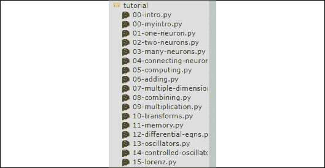

图 18.4:教程部分的例子

教程程序位于安装程序编写它们的目录中。

您可以在浏览器地址栏的教程 Python 示例的 URL 中看到它们。

## 创建 Python 程序

现在，让我们通过几个步骤创建一个 Python 程序并保存文件:

*   打开一个空的 Python 文件，但不要保存它
*   编写下面的代码来导入`nengo`库并创建一个模型:

    ```
    import nengo  model = nengo.Network()  with model:      #<your code here> 
    ```

现在，将 Python 文件保存在教程的其他程序的路径中。当您打开一个 Nengo 示例时，您可以看到这个路径。只需导航到该路径来保存您的程序。我们将它命名为`00-myintro.py`,以很好地适应教程中的程序列表:


图 18.5:保存 Python 程序

我们将像以前一样返回到`tutorial`目录，我们将打开它来添加基本的 Nengo 对象。

Nengo 对象是 Nengo 模型的构建模块，用于创建神经元群体，将它们连接到刺激功能，并管理输出。

对于我们的 Python 程序，我们将使用一些关键的 Nengo 对象，这些将在下面的章节中详细介绍。

## 能歌合奏

Nengo ensemble 是一组神经元。它可以被认为是一群包含实数的神经元。

合奏是通过以下方式创建的对象:

```
nengo.Ensemble 
```

可以在一行中创建合奏:

```
ensemblex = nengo.Ensemble(n_neurons=5, dimensions=1) 
```

只要我们在`00-myintro.py`中添加一行，就会在 Nengo 界面的左侧窗格中出现一个集合的表示:


图 18.6:神经元集合

在右侧的代码编辑器中编写 Python 代码时，您可以在可视化界面窗格中可视化模型的可视化流程。

一个系综可以包含一个个体的群体，即单个神经元。这个神经元是我们生物神经元的代表:

*   **突触后电流** ( **PSCs** )流经我们的树突
*   *电流*然后到达神经元的核心(细胞体)
*   如果电流在轴突的初始段(轴突小丘)超过阈值，则产生*尖峰*
*   随着离子通道打开，在接收池中产生PSC

让我们更详细地了解一下 Nengo 的神经元类型。

### Nengo 神经元类型

我们在我们的系综中创造了 50 个神经元:

```
ens = nengo.Ensemble(n_neurons=50... 
```

神经元有多种类型。然而，在我们的例子中，我们将使用默认的神经元，一个**泄漏的积分触发** ( **LIF** 神经元。

神经元动力学是基于一个叫做**整合**的求和过程。这种集成与一种将在临界电压以上点火(触发)的机制相关联。

除非另有说明，否则线性微分方程结合触发文件尖峰的阈值是构成我们将使用的默认 LIF 神经元的最终组件。

有关 Nengo 神经元类型的更多信息，请参见[https://www.nengo.ai/nengo-extras/neurons.html](https://www.nengo.ai/nengo-extras/neurons.html)。

### Nengo 神经元维度

在我们的例子中，`dimensions`被设置为【T28 这意味着系综由一个数(或维度)表示:

```
ens = nengo.Ensemble(..., dimensions=1) 
```

### 一个能结

既然我们已经定义了我们的神经元集合和它们的输出维度，我们将定义输出:

```
node_number = nengo.Node(output=0.5) 
```

刺激将是一个常数，并显示在滑块上:


图 18.7: Nengo 滑块

在某些情况下，带有数字的输出可能是不够的。该数字可由导入 NumPy 的函数替换。可以使用正弦波函数，例如:

```
node_function = nengo.Node(output=np.sin) 
```

一旦我们进入我们的节点功能，除了先前显示的信息之外，它还会出现在界面上:


图 18.8:界面上的节点功能

`node_function`提供一种向 Nengo 对象发送非神经输入的方式。

我们将在本章的`15-lorenz.py`例子中探索这样一个实现，这个例子在教程章节 Nengo 的例子中。

如果右键单击`node_function`图像并选择一个值，您将看到一条代表正弦波刺激实时值的曲线:

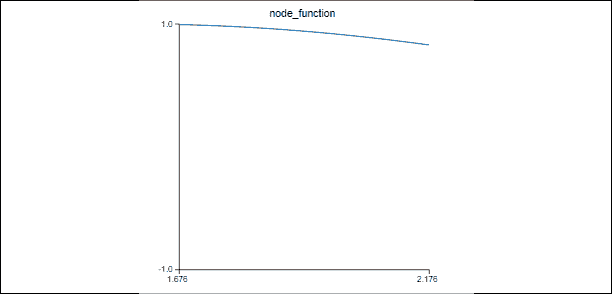

图 18.9:节点功能

有关 Nengo 对象的更多信息，请访问[https://www . Nengo . ai/nego/getting _ started . html # creating-Nengo-objects](https://www.nengo.ai/nengo/getting_started.html#creating-nengo-objects)。

## 连接 Nengo 对象

我们现在需要连接系综和节点来使我们的系统工作。以这种方式，系综将具有功能。

此时，我们有一个系综和一个节点函数，如下图所示:


图 18.10:集合和节点功能

为了连接它们，我们将添加一个 Nengo 连接:

```
nengo.Connection(node_function, ens) 
```

更多 Nengo 前端 API 定义，参见[https://www.nengo.ai/nengo/frontend_api.html](https://www.nengo.ai/nengo/frontend_api.html)。

现在，让我们探索令人兴奋的视觉界面。

## 可视化数据

第一步是点击屏幕右下角的播放按钮:


图 18.11:播放按钮

这将启动时间，模拟我们的大脑活动。时间是神经形态计算的独特特征之一。我们不会把静态的数学一层一层地堆砌成一种心理表示。有了 Nengo，我们一步一步，一秒一秒的模拟大脑活动！

一旦你点击播放按钮，感觉就像我们在看自己的大脑！

我们在上一节中看到了如何可视化滑块的活动，这产生了刺激。在这一部分，我们将重点介绍我们的合奏。

如果我们右击系综可视化，出现几个选项:**值**、**尖峰**、**电压**、**触发模式**和**细节...**:


图 18.12:整体选项

*   **值**:将显示我们系综的值，从-1 到 1，例如:

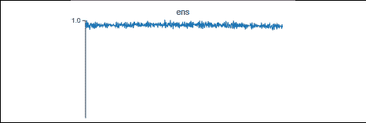

图 18.13:集合的值

*   **尖峰脉冲**:尖峰脉冲活动产生漂亮的颜色，显示我们的神经元对正弦波刺激的反应:

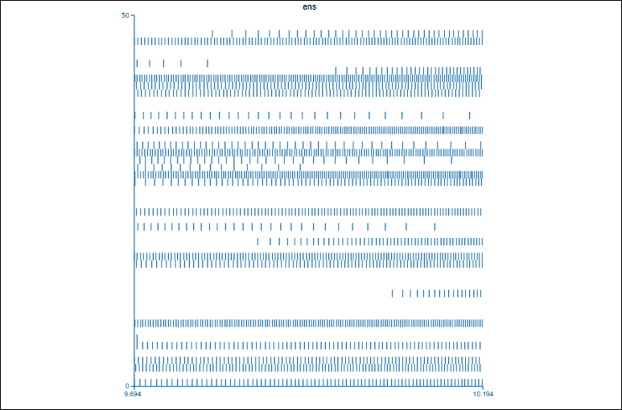

图 18.14:尖峰模式

你会注意到每个神经元都有自己的脉冲通道。合奏的这一特性产生了各种各样的反应。

*   **Voltages**: The voltages provide interesting information on the current that is flowing through our neurons under stimulation from other neurons and, in turn, from yet more neurons that are gathering information from the world outside us.

    在下面的屏幕截图中，集合包含五个神经元，颜色通道提供了更多信息:

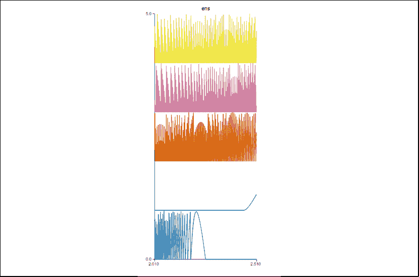

图 18.15:颜色模式下的神经元活动

*   **放电模式**:下图中的整体放电模式由 50 个神经元生成。放电模式必然与刺激和连接直接相关:


图 18.16:点火模式

通过我进行的实验，我已经观察到许多模式。我正在做的一个研究领域是将给定函数的数千帧触发模式输入到人工神经网络和随机丘奇-图灵算法中，并生成“思维”模式。例如，运行帧的通道可以产生新数据序列。值得尝试。

下图代表了 500 个神经元的模式，为在这些模式的数千帧上运行深度学习带来了复杂性:

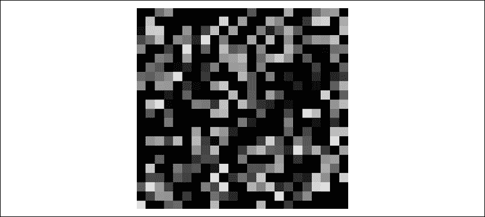

图 18.17:触发模式

*   **Details...**: In the plots section, we can visualize input current and tuning curves. The tuning curve shows how the neurons are reacting to the input current. If there is no pattern, then there must be an explanation or a configuration problem.

    调谐曲线的可视化控制通过显示它们如何收敛来节省时间！

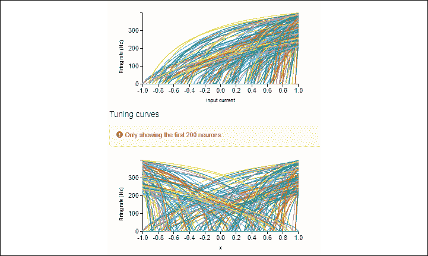

图 18.18:调谐曲线

我们已经介绍了 Nengo 提供的一些主要可视化工具。

现在，我们将看到如何用探针从我们的系统中检索数据。

## 探针

我们可以用探针检索信息,或者将它们可视化，或者处理输出数据。

在本节中，我使用以下页面上的信息增强了`00-myintro.py`以产生数字输出和视觉输出，您可以从这些信息中获得项目的想法:[https://www . nengo . ai/nengo/examples/basic/single _ neuron . html](https://www.nengo.ai/nengo/examples/basic/single_neuron.html)

我创建的程序是`nengo_probing.py`，可以在这本书的 GitHub 库中找到。该程序是一个独立的程序，不运行在 Nengo 的图形用户界面。您不能在 Nengo 的 GUI 中使用如下所示的模拟命令。在您的 Python 界面中运行这个程序。它展示了运行丰富的 Nengo 软件的另一种方式。

该程序包含用于 Matplotlib 的附加标题和用于数据显示和处理目的的分布:

```
import matplotlib.pyplot as plt

from nengo.utils.matplotlib import rasterplot

from nengo.dists import Uniform 
```

该程序包含与`00-myintro.py`相同的架构。它创建一个系综，添加一个功能，然后连接对象:

```
model = nengo.Network("Probing")

with model:

    ens = nengo.Ensemble(n_neurons=50, dimensions=1)

    #node_number = nengo.Node(output=0.5)

    node_function=nengo.Node(output=np.sin)

    nengo.Connection(node_function, ens)

    print(ens.probeable)

with model:

    # Connect the input signal to the neuron

    nengo.Connection(node_function, ens) 
```

我们现在将使用`nengo.Probe`添加一个探测功能:

```
 # The original input

    function_probe = nengo.Probe(node_function)

    # The raw spikes from the neuron

    spikes = nengo.Probe(ens.neurons)

    # Subthreshold soma voltage of the neuron

    voltage = nengo.Probe(ens.neurons, 'voltage')

    # Spikes filtered by a 10ms post-synaptic filter

    filtered = nengo.Probe(ens, synapse=0.01) 
```

为了获得一些数据，让我们运行模拟器 5 秒钟:

```
with nengo.Simulator(model) as sim:  # Create the simulator

    sim.run(5) 
```

模拟器在显示输出之前运行计算*。*

然后，我们可以探测数据并以数字格式显示它。这样，我们可以从我们的系统中检索输出数据以供进一步使用，用几行代码将神经形态模型可视化或链接到其他算法:

*   **Decoded output**: The decoded output can be filtered (see the preceding filter):

    ```
    print("Decoded output of the ensemble")

    print(sim.trange(), sim.data[filtered]) 
    ```

    然后显示或处理输出数据:

    ```
    [1.000e-03 2.000e-03 3.000e-03 ... 4.998e+00 4.999e+00 5.000e+00] [[ 0\.        ]

     [ 0\.        ]

     [-0.03324582]

     ...

     [-1.26366121]

     [-1.22083471]

     [-1.18750863]] 
    ```

    Nengo 可以用 Matplotlib 生成一个图表:

    ```
    # Plot the decoded output of the ensemble

    plt.figure()

    plt.plot(sim.trange(), sim.data[filtered])

    #plt.plot(sim.trange(), sim.data[node_function])

    plt.xlim(0, 1)

    plt.suptitle('Filter decoded output', fontsize=16) 
    ```

    上述代码的输出如下所示:

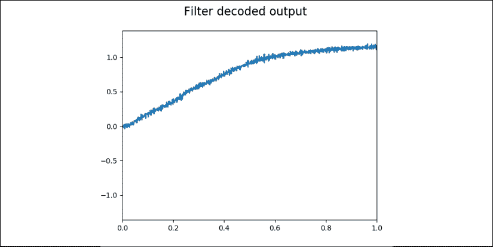

图 18.19:解码后的输入

*   **Spikes**: Spikes are retrieved in a single line of code:

    ```
    print("Spikes")

    print(sim.trange(),sim.data[spikes]) 
    ```

    输出产生一系列尖峰信号:

    ```
    [1.000e-03 2.000e-03 3.000e-03 ... 4.998e+00 4.999e+00 5.000e+00] [[   0\.    0\.    0\. ...    0\.    0\.    0.]

     [   0\.    0\.    0\. ...    0\.    0\.    0.]

     [   0\.    0\.    0\. ... 1000\.    0\.    0.]

     ...

     [   0\.    0\. 1000\. ...    0\.    0\.    0.]

     [   0\.    0\.    0\. ...    0\.    0\.    0.] 
    ```

    该程序生成一个与数据相匹配的峰值数字:

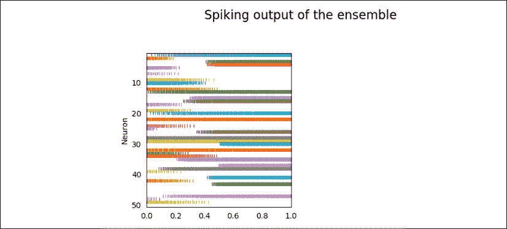

图 18.20:尖峰输出

我们可以用有价值的原始数据检查视觉显示。

*   **Voltage**: The simulation provides voltage data:

    ```
    print("Voltage")

    print((sim.trange(), sim.data[voltage][:, 0])) 
    ```

    数据存储在一个随时可用的数组中:

    ```
    (array([1.000e-03, 2.000e-03, 3.000e-03, ..., 4.998e+00, 4.999e+00,

           5.000e+00]), array([0., 0., 0., ..., 0., 0., 0.])) 
    ```

    该程序还生成了系综电压的图形:


图 18.21:神经元电压

至此，我们已经介绍了 Nengo 的主要特性。我们现在将看到 Nengo 如何推动关键人工智能研究领域的研究。

# 将 Nengo 的独特方法应用于关键的人工智能研究领域

例如，将大脑神经形态模型的能力应用于简单的算术或经典神经网络是无用的，它们不需要任何超过 TensorFlow 2.x 的东西。

但试图用经典网络解决神经形态计算可以用有机大脑模型更好解决的问题也是浪费时间。例如:

*   深度学习，TensorFlow 2。卷积模型使用一种独特的激活函数，如 ReLU(参见*第九章*、*用卷积神经网络(CNN)进行抽象图像分类*)。神经形态神经元在受到刺激时有各种各样的反应。
*   神经形态模型整合了时间与更静态的 DL 算法。当我们运行神经形态模型时，我们更接近我们的时间驱动生物模型的现实。
*   人类大脑项目，[https://www.humanbrainproject.eu/en/](https://www.humanbrainproject.eu/en/)，提供了神经形态计算如何为经典计算提供额外见解的广泛研究和例子。

我建议用几个人工智能工具测试一个给定的问题，并选择最有效的一个。

SPA 示例展示了 Nengo 在多个领域的效率。教程部分的所有例子都有很好的文档记录，并且运行良好。您可以将我们在本章中探索的可视化函数应用于它们，还可以修改代码，在您的 Python 环境中试验它们，等等。

我想强调两个领域:语言学和天气表示:

*   **Linguistics**: `25-spa-parse.py` processes neuronal signals and produces words. When you run it, the performances look magical, thanks to the SPA. The code is well documented.

    该程序包含令人兴奋的`thalamus`模块，可以模拟我们大脑中的皮质下核(前脑和中脑)。我们大脑的这一部分，基底神经节，有着高密度的连接。

    这一类可以减少甚至消除对刺激的低反应，并增强对刺激的高反应。该计划值得运行和探索！Nengo GUI 可以直观地理解:

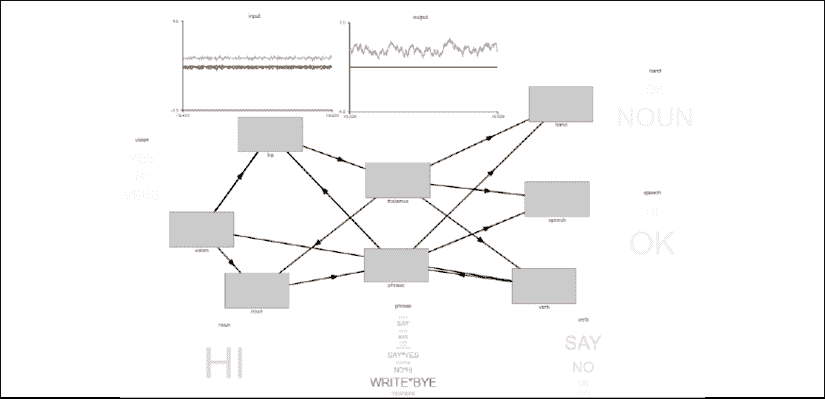

图 18.22: Nengo GUI 选项

*   **天气表示** : `15-lorenz.py`不是一个 SPA 程序。它只有几行长。它显示了代表大气温度和变化的三个基本洛伦兹方程的图形。Nengo 出于教育目的修改了该准则，详见[http://comp neuro . uwaterloo . ca/publications/Elias mith 2005b . html](http://compneuro.uwaterloo.ca/publications/eliasmith2005b.html)上的一篇文章。Nengo GUI 显示了一个激动人心的演示:

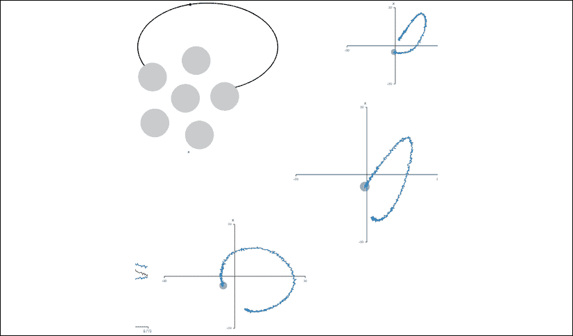

图 18.23:洛伦兹方程

`15-lorenz.py`的代码很短，程序看起来很简单。但是天气预报是最难用人工智能模型来描述事件的领域之一！

神经形态计算的潜力可以成为真正的游戏规则改变者。让我们进行一个思维实验。想象一下:

*   飓风就像一个活的有机体
*   它的中心与它周围的一切相连
*   它以海洋的热量和水为食
*   里面的一切都可以被认为是微小的飓风粒子

现在让我们通过以下方式继续实验:

*   给神经形态模型中的数十亿个粒子喂食
*   利用神经形态芯片网络的力量
*   利用量子计算的计算能力(参见*第 19 章*、*量子计算*)利用芯片的输入/输出进行计算
*   将 SPA 应用于飓风粒子表示，就像它们是神经元一样，并运行预测

我认为天气预报的未来在于物理的、神经形态的模型，这些模型将会考虑数十亿个参数。

结果是:我们将能够提前几个小时到几天预测飓风的路线和等级。这可以拯救生命。

简而言之，神经形态计算才刚刚开始展示其价值。当神经形态芯片上市时，神经形态计算将呈指数级增长。

# 摘要

在这一章中，我们从头开始构建神经形态 Python 程序。Nengo 系综中的神经元群体是由神经元组成的。然后，系统具有刺激功能、连接和探测对象。Nengo 提供了许多其他的例子，你可以探索。

NEF 旨在实现神经形态计算模型。SPA 的新概念表明，我们的大脑有增强的指针，这些指针有意义并与我们的物理数据相关联。

神经形态计算为经典机器学习和深度学习无法解决的复杂程序打开了巨大的视野。借助即将上市的神经形态芯片的力量，天气预报可以利用机器大脑的复杂性和多样性。机器大脑可以通过激发数十万个具有个体和集体行为的神经元来进行独特的计算。

我们在这本书里已经涉及了很多算法和框架。我们可以使用人类历史上最强大的智能算法。从到 GA 算法，从、、PCA、NLP、CUI 算法到 CNN、、和 LSTM 网络，我们探索了很多 AI 工具。但是可能有建立统一模型的方法。我们将在未来几年看到。与此同时，神经形态计算让我们的工具箱变得异常智能。谷歌拥有 TPU 硬件来优化TensorFlow，神经形态计算可以依赖英特尔芯片，许多公司正在努力生产更具创新性的硬件。

未来无疑将依赖于混合架构，其中一些或所有的人工智能工具将被构建到元人工智能系统中。

在*第 19 章*、*量子计算*中，我们将探索量子力学可用的指数硬件。量子计算机没有内存，依靠其他系统提供输入和处理输出。想象一下一个神经形态系统被链接到量子计算机上！

# 问题

1.  神经形态计算再现了我们的精神活动。(是|否)
2.  神经形态计算再现了我们的大脑活动。(是|否)
3.  语义指针体系结构(SPA)是一种硬件体系结构。(是|否)
4.  NEF 代表神经工程框架。(是|否)
5.  Loihi 是一款经典芯片。(是|否)
6.  复制我们大脑的神经活动不能解决一个方程。(是|否)
7.  Nengo 中的系综包含算法。(是|否)
8.  尖峰信号阻断了神经元的活动。(是|否)
9.  放电模式可以用来分析大脑活动。(是|否)
10.  机器学习和深度学习只是我们大脑活动的隐喻。(是|否)

# 参考

本章使用的参考程序可以在【https://www.nengo.ai/examples/】https://www . nengo . ai、[找到。](https://www.nengo.ai/examples/)

# 进一步阅读

*   **Research** – *How to Build a Brain*, *Chris Eliasmith*: This book provides the theoretical background for neuromorphic computing.

    Chris Eliasmith 也是 Nengo 的设计师之一。

*   **软件**–Nengo([https://www.nengo.ai/](https://www.nengo.ai/)):Nengo 基于扎实的研究、文档和优秀的社区。
*   **硬件**——英特尔:英特尔正在努力生产一款神经形态芯片([https://www . Intel . fr/content/www/fr/fr/research/neuromorphic-computing . html](https://www.intel.fr/content/www/fr/fr/research/neuromorphic-computing.html))。