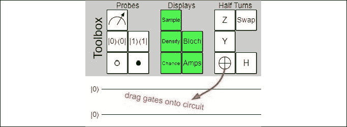
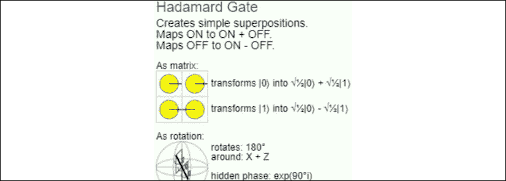
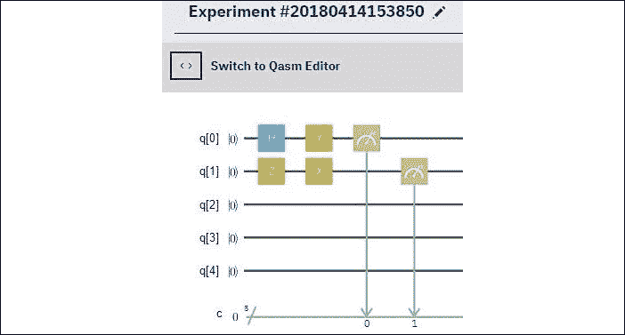
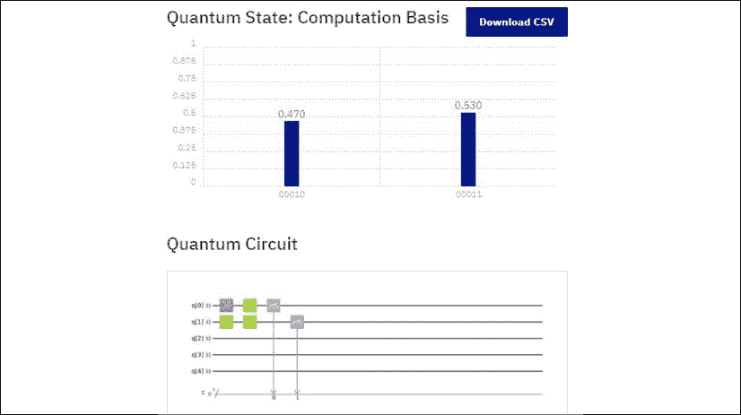
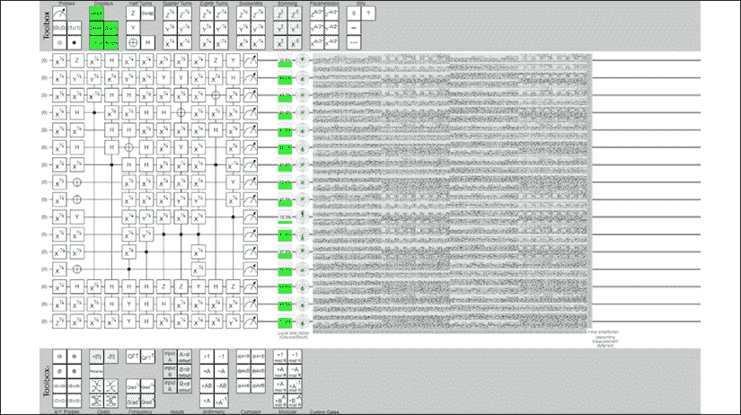

# 十九、量子计算

IBM 已经开始制造用于研究和商业目的的量子计算机。几年后，量子计算将成为颠覆性的，并将提供指数级的计算能力。谷歌、Xanadu、D-Wave、Rigetti 和其他公司将研究预算投入到量子计算中。

这种人类历史上独一无二的计算机能力为获得经典计算机不可能获得的结果打开了大门。1994 年，Peter Shor 指出，对于整数的质因数和离散对数问题，量子算法可以比经典算法表现得更好。然后在 1995 年，Lov Grover 添加了非结构化搜索问题。随着量子计算机的兴起，研究可以走得更远。

量子计算机本身不会提供革命性的算法。任何算法都可以分解成运行基本经典机器的组件。超级计算机仍然可以运行人工智能算法，这比用量子计算机实现它们容易得多。例如，量子计算机没有内存，所以它们非常依赖经典计算机来输入和解释输出。

虽然量子计算机有局限性，但随着时间的推移，量子计算能力将使当今的算法超越我们的想象。许多公司在银行、医疗保健、网络安全等领域投资了量子计算研究。

这一章解释了为什么量子计算机优于经典计算机，什么是量子比特，如何使用它，以及量子思维实验如何能够导致量子思维机器。提供的例子只是一种接近量子计算的再创造的方法。

我们将从经典机器中获取结果，将结果输入量子计算机，然后解释量子计算算法提供的结果。有些人更进一步用混合量子经典算法，这超出了本章的范围。

在*第 18 章*、*神经形态计算*中，我们探索了如何使用我们的大脑来创建神经形态模型。在这一章中，我们将通过一个创造思维的研究项目来创造一个更高层次的表现。Quantum mind 基于 CRLMM，我已经成功地将其应用于许多公司网站。在这个研究项目中，一个名为 MindX 的量子思维代表了一个随机人的思维。我们将在一个激动人心的实验中探索 MindX。

本章将涵盖以下主题:

*   为什么量子计算机比其他经典计算机更强大
*   什么是量子比特
*   布洛赫球
*   量子计算
*   如何建立 MindX，一个有思维的量子计算机研究项目

首先，我们来讨论一下量子计算机背后的一些基础知识，以及是什么让它们如此强大。

**注**:对于那些不希望在阅读本章之前安装任何东西的人来说，这一章是独立的，有量子电路的截图。IBM Q 和 Quirk 可以在线使用，无需在本地安装任何东西。

# 量子计算机日益强大的力量

在我们开始讨论 MindX 之前，我们应该从基础开始，MindX 是一个令人兴奋的研究项目，旨在创造一台具有思维能力的量子计算机。本节描述了:

*   为什么量子计算机更快
*   什么是量子位
*   如何测量量子位(它的位置)
*   如何用量子门创建量子分数(程序)
*   如何运行量子分数并将其结果用于认知 NLP 聊天机器人

这一章的目标不是太深入量子计算的细节，而是教你足够的知识来建造一台有思想的量子计算机。这一章只是为了展示量子计算机是如何工作的，并向我们展示使用计算机的新方法。

## 量子计算机速度

标准的计算机位具有 0 或 1 状态。传统的计算机将根据系统的选择来管理 0 或 1，但它仍然局限于选择 1 或(XOR) 0。它无法同时管理这两种状态。

量子计算机不受异或状态的约束。这是一个与状态。它可以同时管理 0 到 1 之间的值，直到被测量！量子状态在被观察到之前是未知的，这意味着量子程序可以同时使用 0 和 1 之间的值。一旦被观察到，由于量子态的物理不稳定性，量子位将取值 0 或 1。

仅仅是观察一个量子态，就让状态分解。在量子计算中，这被称为**消相干**。这不是魔法。量子位是不稳定的。观察时，量子态分解。

这意味着一旦被测量，量子计算就是无记忆的。量子计算机中不存在存储。输入由经典计算机完成，输出返回经典计算机，通过以下过程存储:

1.  经典计算机提供输入
2.  量子计算机处理输入并产生输出
3.  经典计算机解释输出

也就是说，量子计算机的计算能力完全证明了这种架构限制的合理性。

在观察到量子位之前，它可以具有 0 或 1 状态或介于两者之间的概率，例如 0.1、0.7 或 0.9。

观察情况叫做衡量状态。测量时，只有 0 或(XOR) 1 会成为结果。

在状态被测量之前，大量的概率都是可能的。如果在系统中加入一个量子位，我们现在同时拥有两个量子位和四个基本组合。

与标准的计算机逻辑不同，所有四种状态都可以在并行过程中同时用于计算算法。因此，给定算法的可能状态的数量将随着所涉及的量子位的数量而扩大。可以用下面的数来估计状态的体积，其中 *q* 是量子比特的数量:

2 ^问

看着这个小小的等式似乎一点也不可怕。现在，让我们看看在一个运行多达 100 个量子位的循环中会是什么样子，可能状态的数量为`nb`:

```py
import numpy as np

for q in range(101):

    v=(2**q)

    print("Size of nb to describe",q," qubits:","{:,}".format(v)) 
```

这个项目看起来也不可怕。但是，下面的输出非常棒:

```py
Size of nb to describe 0 qubits: 1

Size of nb to describe 1 qubits: 2

Size of nb to describe 2 qubits: 4

Size of nb to describe 3 qubits: 8

Size of nb to describe 4 qubits: 16

Size of nb to describe 5 qubits: 32

Size of nb to describe 6 qubits: 64

...

Size of nb to describe 10 qubits: 1,024

...

Size of nb to describe 50 qubits: 1,125,899,906,842,624

...

Size of nb to describe 97 qubits:

158,456,325,028,528,675,187,087,900,672

Size of nb to describe 98 qubits:

316,912,650,057,057,350,374,175,801,344

Size of nb to describe 99 qubits:

633,825,300,114,114,700,748,351,602,688

Size of nb to describe 100 qubits:

1,267,650,600,228,229,401,496,703,205,376 
```

目前，大数据通常以 Pb 计算。一个 petabyte=10 ^(15) 或大约 2 ^(50) 字节。

脸书存储着超过 20 亿个账户的数据。想象一下，脸书在某一天管理 500 的数据。让我们在下面的代码中看看 500 大约等于多少:

```py
print("Facebook in the near future:")

s=(2**50)*500

print("{:,}".format(v)) 
```

这个输出非常令人惊讶，因为它大约是一台 100 量子位量子计算机一次运行可以计算的数据量:

```py
A segment of Facebook data :

1,267,650,600,228,229,401,496,703,205,376 
```

这意味着一台具有 100 个量子位的量子计算机可以计算出所有数据的大小，这些数据在不久的将来可能会超过 20 亿个脸书账户。

量子计算机实际上根本不包含那么大的数据量，但它表明人们可以用那么大的计算信息量进行计算。

更重要的是，这也意味着单个量子计算机可以运行单个思维的思维数据集(见下一节)并计算关联。这个思考过程可以产生指数数量的联系。

传统的 *n* 位计算机管理 *n* 位，而量子计算机将管理 2 ^n 位或 2 ^q 位。

与量子计算机的指数幂相比，很快，对于科学计算来说，经典计算机就像是过去的遗物。经典计算机仍将被使用，但量子计算机将成为探索超越目前人工智能极限的世界的工具。

把你在这本书里看到的所有 AI 解决方案形象化。一旦你接触到量子计算，它们似乎已经蒙上了一些过去的灰尘。

在未来的几年里，量子计算机将在许多领域击败任何其他计算机。在一次并行计算中，量子计算机可以在一次运行中完成传统计算机需要数年才能完成的工作。

现在想想由许多量子计算机组成的网络能做什么！

通常，我们试图将大体积与宇宙中的恒星数量进行比较，我们会说，“这比我们宇宙中的恒星数量还要多。”我们现在必须看着相反的方向，看着非常小的数字。

教训很明显:未来在于纳米模型。量子计算代表着挑战和机遇。

## 定义一个量子位

一个量子位，一个量子比特，有一个物理对应物。例如，量子态可以用超导体回路的振荡电流来编码。谷歌和 IBM 已经尝试了这种方法。另一种方法是在真空阱中的电磁场中捕获的离子中编码量子位。

光子、电子、光的状态和其他技术已经出现。无论采用哪种方法，由超过 50 量子位的量子计算机完成的计算都将超过经典的超级计算机。

竞争非常激烈，因为市场将迅速变得巨大。现在就准备好面对即将到来的颠覆吧！

## 代表一个量子位

量子位的数学表示为:

*   为 0 值
*   为 1 值
*   其中α是概率参数
*   其中β是概率参数

这些括号被称为括号或括号符号。

这种线性表示叫做叠加。就其本身而言，它解释了量子计算的大部分威力。

因此，量子态中 0 和 1 的叠加可以在 kets(如)中表示如下，而不是 bras(如):


阿尔法和贝塔概率看起来像权重，量子位的那些可能状态的总概率必须加起来是 1。我们使用分区函数、softmax 和其他技术来确保概率之和等于 1。这并不奇怪，因为像我们这样的计算机极客设计了给量子计算机编程的方法。

翻译成数学，这意味着和的概率总和必须为 1。在量子位概率的情况下，值是平方的，导致以下约束:


为了描述一个量子位元的可能状态，我们需要三个数字:0 和 1 的可能状态，以及一个决定机率值的数字(另一个是隐含的，因为总和必须是 1)。

由于量子位在它们各自的状态下相互作用，相互作用被描述为纠缠。一个纠缠指定至少两个相互作用的量子位。如果不考虑所有量子位元的所有状态，就无法描述它们。

这在物理上得到了再现，这意味着这种纠缠看起来很奇怪，因为它们的量子纠缠(关系)可以在远处发生。一个量子位可以影响物理上很远的一个量子位。

这是一种奇怪的思考方式，而且一开始并不容易被接受。阿尔伯特·爱因斯坦经常被人嘲笑地称纠缠为“幽灵般的超距作用”

## 量子位的位置

表示量子位状态的主要方式之一是使用布洛赫球。它展示了一个量子位是如何旋转的，并且可以用来描述量子位的状态。为了正确理解这一点，下一节将首先回顾圆的一些性质。

### 弧度、角度和旋转

半径是圆心和圆周之间的距离，如下图所示:


图 19.1:圆的半径

圆的半径是圆直径的一半。半径 *r* 与周长 *C* 的关系为(其中):


如果半径的长度环绕一个圆的圆周，该圆弧形成一个弧度，如下图所示:


图 19.2:一个弧度

弧度形成的角度约等于 57.29 度。

弧度的属性可用于旋转:

*   3.14 × 57.29 =约 180
*   因此弧度= 180°

旋转通常用弧度描述，弧度用表示，如下表所示:

| **度** | **弧度** |
| 30 |  |
| 45 |  |
| 60 |  |
| 90 |  |
| 180 |  |
| 270 |  |
| 360 |  |

既然我们已经有了这个总结，让我们来探索一下 Bloch 球。

### 布洛赫球

刚才显示的弧度表是一种描述旋转的实用方法。下图所示的布洛赫球提供了一个量子位的位置和旋转的可视化表示:


图 19.3:布洛赫球体

北极和南极(极坐标)代表一个量子位的基本状态:


一个量子位可以取球体上的任何值。

## 创作量子乐谱

组成一个量子分数包括在一个五线谱(或电路)上定位门和添加一个测量值。输入来自一台经典的计算机。在测量阶段之后，输出返回到经典计算机。原因是量子计算机没有内存，因此无法存储它们的中间状态，因为它们不稳定。

本节使用 Quirk，一个非常有教育意义的量子电路模拟器，来展示量子门和量子合成器。

你可以通过这个链接在线访问怪癖:[https://algassert.com/quirk](https://algassert.com/quirk)。

### 有怪癖的量子门

量子位用线表示，从左边开始，如下量子门编程界面所示:



图 19.4:量子门编程界面

这些门是将转换量子位状态的逻辑门。

#### 非门

一个非门将把一个零比特转换成一个零比特。它会把一个 ket-one 变成 ket-zero 。

在电路描述中，上的**为 ket-1 状态，**下的**为 ket-0 状态，如以下量子分数所示:**


图 19.5:量子分数的电路描述

你可以看到:

*   非门符号是一个内部有一条垂直线和水平线的圆
*   状态上的**表示状态为**
*   Bloch 球体表示在(从 Bloch 球体的顶部开始，这是应该的)

#### h 门

H 门或 Hadamard 门将执行以下转换:



图 19.6:哈达玛门变换

以下 50%的概率将显示在一个矩形中，并且还将显示在 Bloch 球面上的位置:


图 19.7:在矩形和布洛赫球上有 50%的机会

门的基本作用是旋转布洛赫球上的量子位，并在测量时产生一个可能的条件。有许多可能的门可以探索和使用，如本设计菜单图中的所示:


图 19.8:闸门设计菜单

这些门对于构建许多算法来说绰绰有余。

### 一个带有怪癖的量子计算机分数

这里的目标是玩弄界面，直观地看到电路如何运行。

用 Quirk 构建量子分数(或回路)意味着:

*   拖放门将使一个量子位转向一个特定的方向，并产生可能的结果
*   添加另一个量子位，做同样的事情，等等
*   能够进行中间测量，尽管这对于真正的物理量子计算机来说是不可能的(观测结果会使系统崩溃)

分数表示如下，例如:


图 19.9:量子计算机分数表示

有两个量子位，每条线上有一个门。然后显示中间结果，使模拟器很有教育意义。然后再增加两个门。最后，在末端增加以下测量探头:


图 19.10:测量探针

一旦测量完成，最终结果将显示在测量符号的右侧。

### IBM Q 的量子计算机分数

IBM Q 提供了一个云平台来运行一台真正的物理量子计算机。

创建一个免费帐户并访问 IBM quantum computing composer。正如 Quirk 一样，量子门在以下分数上被拖动，如下图所示:



图 19.11:量子门被拖动

分数可以在 Quirk 这样的模拟器上运行，也可以在真实的 quantum 计算机上运行，如下界面图所示:


图 19.12:分数界面

点击**模拟**，将运行一个模拟器。

**运行**在 IBM 的物理量子计算机上启动计算。这是一次令人兴奋的经历！未来就在你的指尖。

下面的输出很有趣。对于相同的分数，它与 Quirk 有点不同，但概率如预期的那样加起来为 1:



图 19.13:量子计算机分数输出

IBM 还拥有该乐谱的源代码版本(QASM)，如下面的代码所示:

```py
include "qelib1.inc";

qreg q[5];

creg c[5];

h q[0];

z q[1];

y q[0];

x q[1];

measure q[0] -> c[0];

measure q[1] -> c[1]; 
```

这种语言是一种开放的量子汇编语言。它可以像 IBM 的 Q 平台上的任何其他语言一样在编辑器中编写。还可以下载一个开发工具包，这些 API 都是实用的。IBM 提供了关于这种方法所有方面的广泛而详细的文档。

说了这么多，让我们看看量子计算如何推动人工智能项目。现在是时候定义思维量子计算机项目了。

# 会思考的量子计算机

思维量子计算机不是大脑功能的再现，而是人的思维的再现。神经形态计算是一种表示我们的神经元以及大脑如何使用尖峰神经元进行思考的方法。量子计算可以提供一种令人兴奋的方式，通过数学算法模拟我们的思维能力，这些算法使用量子位，而不是神经元。我们刚刚开始探索这些方法的潜力，事实上，它们很可能会合并成一套混合软件和硬件解决方案。

量子 MindX 实验的努力是建立一个名为 MindX 的个人大脑，将过去事件、对话、聊天和照片的记忆存储在一台经典计算机上。然后，该程序将把数据子集转换成量子电路，看看会发生什么，我们的量子电路在产生数百万种可能性时会如何表现。

本节描述了如何构建 MindX，这是一个思维计算机，只是一个研究项目。必须指出，这种方法是实验性的。这可以被视为一种先进的思维实验。多年来我一直在研究这个课题。量子计算的力量无疑将推动这一领域的研究。

## 代表我们大脑的概念

输入包括对 PCA CRLMM 表示的精神状态进行编码，正如我们在*第 14 章*、*中所构建的那样，使用受限玻尔兹曼机器(RBMs)和主成分分析(PCA)* 准备聊天机器人的输入。CRLMM 表示不是一般的字典或百科全书数据集，而是收集、分类并转换成 PCA 的实际个人数据的思维数据集。

## 扩展 MindX 的概念表示

如果在这个研究实验之外实现，MindX 的思维数据集将继续增长。它将有传感器来处理情绪分类的体温，表情检测的面部识别，身体语言检测器等等。所有这些技术都已经存在。纽约证券交易所已经拥有人工智能物联网代理，可以从外部来源收集信息以做出决策。这些人工智能代理已经取代了大量的人类决策。想象一下，当量子计算变得具有颠覆性时，将会发生什么！

## MindX 实验

量子 MindX 实验的目的是构建一个大脑，并让它用量子计算机的力量进行思考。这一节将展示如何运行一个 16 量子位的大脑。

描述一个 16 量子位量子模拟所需的数字大小是 65，536。

本节首先描述如何执行以下操作:

*   准备数据
*   创建并运行量子分数
*   使用输出

让我们继续准备数据吧。

### 准备数据

为了给更高维度的计算准备数据，30 多年来，我一直在为公司项目使用一种概念编码方法，为我开发的算法提供嵌入式数据。这保证了解决问题的高层次抽象。实现迁移学习和领域学习是一种非常有利可图的方式。通过这种方式，您可以将相同的模型应用于许多不同的领域。

该方法包括用本书中描述的方法嵌入数据。目标始终保持不变-将数据点转换到更高维度以可视化特征。

对于量子计算，MindX 实验的方法保持不变。

### 转换函数–情境函数

在创建和运行分数之前，需要应用两个函数:一个精神状态函数和一个量子转换函数。

情境函数包括构建 PCA 维度中的特征向量。我们在*第 14 章*、*使用受限玻尔兹曼机器(RBMs)和主成分分析(PCA)准备聊天机器人的输入、*中完成了这一点，并将其应用于*第 15 章*、*中的聊天机器人，建立认知 NLP UI/CUI 聊天机器人*。聊天机器人能够使用 X 的大脑数据集来建立一个有意义的对话。

在这一章中，量子维度将为聊天机器人提供一个新生的个人思维，而不是像机器一样能够识别、分类和预测的一般思维。

MindX 的思维方式像人类一样有偏见。MindX 有一个特别开放的头脑来适应每个人，这使它能够感同身受。

MindX 可以怀疑。因此，它能比教条式的机器学得更好。

一个情境函数将为 MindX 机器人的电影建议创建一个情境矩阵，它将与消费者进行交流。例如，在 MindX 机器人提出电影建议的情况下，对于 16 个量子位，它可以是如下内容:

| **量子位** | **概念** | **图片** | **初始极性** |
| 一 | 城市 | 停车 | 0.146 |
| 2 | 黑暗 | 黑暗森林 | 0.5 |
| 3 | 乡愁 | 秋叶 | 0.5 |
| 四 | 令人担心的 | 深色背景 | 0.146 |
| 5 | 工作 | 悲伤的脸 | 0.5 |
|  | … | .. | .. |
| 15 | 想想电影《迷失》 |  | 0.38 |
| 16 | 建议“丢失”的决定 |  | 0.0 |

MindX 不再分析人 X 了。它现在已经从它的思维数据集中加载了一个移情矩阵，其中包含数据和情绪分析*极性*。接近 1 的值为正值。接近 0 或负值的值为负值。MindX 加载了自己的思想和另一个人的思想。

移情用另一个人的想法和感受来渲染你的想法和感受。

刚才显示的 16 量子位矩阵包含四列，如上表所示:

*   **量子位**:量子合成器上该量子位的行
*   **概念和心理表示**:加载在 MindX 情境数据集中的概念，通过*第 14 章*、*使用受限玻尔兹曼机器(RBM)和主成分分析(PCA)准备输入聊天机器人*中描述的过程获得，其中我们运行 RBM 来生成我们通过 PCA 表示的特征。

心理表示出现如下主成分分析所示:


图 19.14:一个“头脑”的主成分分析表示

这些特征来自 RBM 对特定年龄段电影偏好的研究，现在可以用作量子电路的输入，产生带有信息和噪音的随机心理活动。

这个电影例子是为了解释如何创建一个有思想、有同情心的聊天机器人。这种方法可以应用于其他商业细分市场或任何需要聊天机器人思考预设答案之外的情况。许多领域，如医疗保健、药物研究和安全，将受益于开放思维的量子算法。

### 变换函数——量子函数

这些算法已经产生了一个带有标签(概念和图像)的量子位行号。每条线还拥有以概率格式用从 0 到 1 的归一化值表示的情感分析极性。我们将考虑大脑对目标反应的消极和积极观点。请记住，“负”接近 0，“正”接近 1，中间值给出了更详细的近似值。0.4 到 0.6 是一个转折点。

这个到另一维度的第一次变换是初始化量子变换函数的第一步。量子转换功能包括用量子门初始化所有 16 个量子位的第一列。

就像数据集被转换成主成分特征一样，极性转换函数使量子转换函数能够将数据集带入量子宇宙。

该函数将自动找到量子门，该量子门代表以下情境矩阵的数据点的归一化情感分析极性:

| **初始极性** | **量子门** |
| 0.146 | X ^(1/4) |
| 0.5 | X ^(1/2) |
| 0.5 | X ^(1/2) |
| 0.146 | X ^(1/4) |
| 0.5 | X ^(1/2) |
| .. |  |
| 0.38 | X ^(1/8) |
| 0.0 | Z ^(1/8) |

MindX，一个随机的人的精神状态现在在一个矩阵中，它的概念现在已经被转化为一个量子维度，在这个维度中，数据状态可以在整个量子分数的创建过程中被追踪。

### 创建和运行乐谱

MindX 的思维过程用量子分数来描述。有两种方法可以建立这个分数:

*   手动，就像音乐家写乐谱一样。这需要考虑前一个逻辑门和下一个逻辑门的效果，将决策过程考虑在内。这就像编写任何人工智能程序一样。
*   通过构建一个函数，自动读取 MindX 思维方式的规则库，并通过该规则库应用量子门。你可以将其应用于机器学习和深度学习，也可以测试量子计算机与经典计算机的性能。

无论如何，都需要写一个算法。这个算法是一个考虑到情绪的决策算法。例如，怀疑是阻止许多人做出错误决定的原因。举例来说，太多的怀疑会使一个人退出一个情境。

这是一个算法的量子转录，它将 MindX 的概念考虑在内，并表示它们如何交互。这需要非常精准的思维和认知科学编程。

以下是我用 Quirk 搭建的一个实验量子分数:



图 19.15:用 Quirk 构建的量子分数

运行 quantum score 并完成测量后，右侧的绿色矩形将提供输出。

### 使用输出

量程分数的输出现在作为一列添加到情况矩阵中。如果您想要实现这样的解决方案，请记住，编写函数需要一些时间，需要一些汗水和茶水来熬过夜晚。MindX 可以用来增强聊天机器人的计划外响应。MindX 已经证明了它的想象力。

| **量子位** | **概念** | **图像** | **以量子门形式表示的初始归一化极性** | **量子输出直接解释为情绪分析极性** |
| 一 | 城市 | 停车 | 0.146 | 0.677 |
| 2 | 黑暗 | 黑暗森林 | 0.5 | 0.691 |
| 3 | 乡愁 | 秋叶 | 0.5 | 0.5 |
| 四 | 令人担心的 | 深色背景 | 0.146 | 0.48 |
| 5 | 工作 | 悲伤的脸 | 0.5 | 0.36 |
|  | … | .. | .. |  |
| 15 | 想想电影《迷失》 |  | 0.38 | 0.82 |
| 16 | 建议“丢失”的决定 |  | 0.0 | 0.75 |

MindX 给出了其关于向人 x 建议给定电影的想法的 65，536 量子态描述。第 15 和 16 行显示归一化极性值已经上升超过 0.5，达到对电影的正面感觉。

理由是第一行表明 MindX 在那一刻感受到了 X 人对生活的怀疑:

*   那个人 X 会认同“迷失”电影
*   这部电影有一个快乐的结局(MindX 通过电影的特点知道这一点)
*   那个人 X 看完电影后很可能会精神振奋

你可以尝试建立量子分数。您可以使用 Quirk，而无需安装任何东西并探索许多领域中可用的电路列表:Grover 的搜索、Shor 的周期查找、量子傅立叶变换等等。

# 摘要

量子计算机打开了科学实验的大门，这是用经典计算机永远也做不到的。在几年内，量子计算机将成为主流，不可避免的，并且是企业和研究实验室的关键资产。这场比赛已经开始征服市场。

应用于量子计算机的 CRLMM 可以使 MindX 成为地球上最强大的思维头脑之一——人类或机器。

MindX 拥有一个无限的思维数据集和一台 250 英镑起的量子计算机，一台 50 量子位的机器，可以获得一个已经活了 1000 年的人的思维能力和经验。MindX 的思维能力和对过去经验的指数级实时记忆，通过转换函数加载，可以帮助解决许多医疗、后勤和其他决策问题。

量子思维才刚刚开始改变对世界的认知。像 CRLMM 这样的概念人工智能模型无疑将成为下一代人工智能解决方案的起点。这些 CRLMM 模型将更加强大，因为它们将被赋予同理心和复杂的思维。

希望，这个量子计算的概述将打开你的想象之门，进入等待你的新世界！

人工智能才刚刚开始它进入我们生活的漫长旅程。永远相信创新。永远不要相信一个解决了一个问题却没有打开通向问题和想法的大门的解决方案！

# 问题

1.  除了炒作，没有量子计算机存在。(是|否)
2.  量子计算机可以存储数据。(是|否)
3.  量子门对量子位的影响可以用布洛赫球来观察。(是|否)
4.  一个用过去的经验、图像、文字和其他日常信息(如存储的记忆)思考的大脑，将会找到数学本身无法解决的问题的更深层次的解决方案。(是|否)
5.  一台量子计算机将解决今天无法解决的医学研究问题。(是|否)
6.  量子计算机解决数学问题的速度比经典计算机快得多。(是|否)
7.  经典电脑将很快消失，智能手机处理器也是。(是|否)
8.  量子分数不能用源代码格式编写，只能用可视化界面编写。(是|否)
9.  量子模拟器可以和量子计算机跑得一样快。(是|否)
10.  量子计算机在运行计算时会产生中间结果。(是|否)

# 进一步阅读

*   **理论** : *量子计算与量子信息:十周年纪念版*，*迈克尔·尼尔森*，*艾萨克·l·庄*
*   探索 IBM Q 并发现如何实现量子分数:[https://www.ibm.com/quantum-computing/](https://www.ibm.com/quantum-computing/)
*   使用 Quirk，一个直观的量子分数设计工具:[http://algassert.com/2016/05/22/quirk.html](http://algassert.com/2016/05/22/quirk.html)