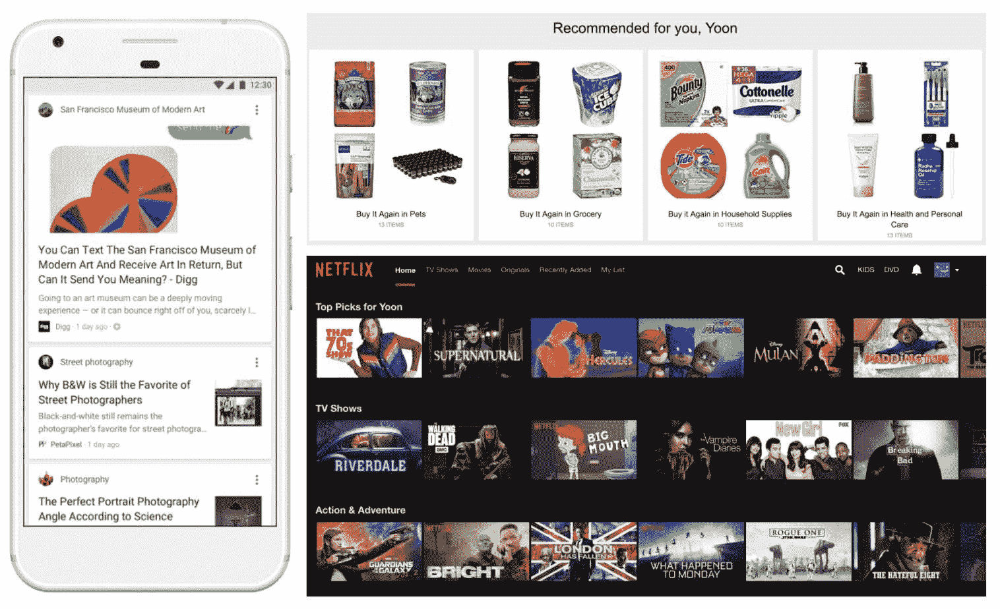
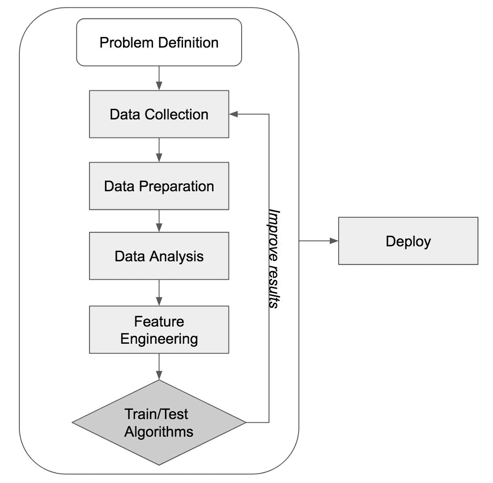
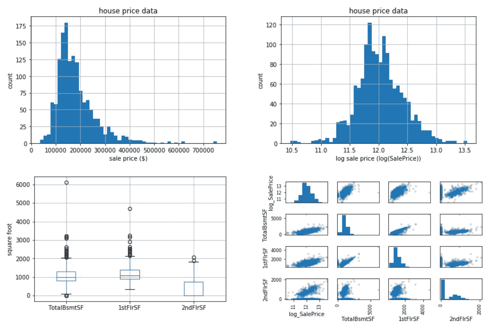
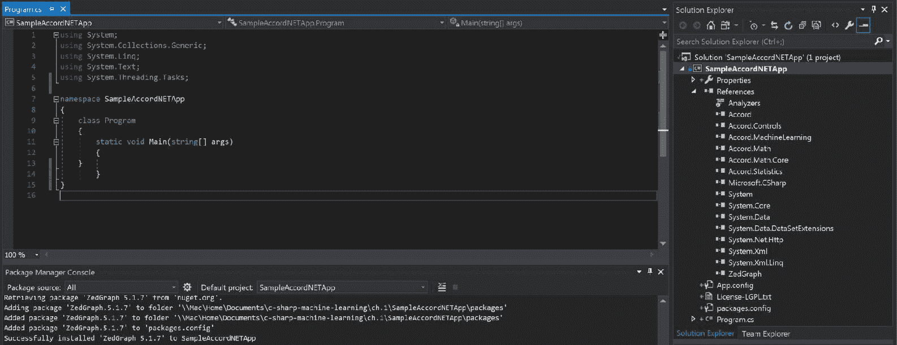
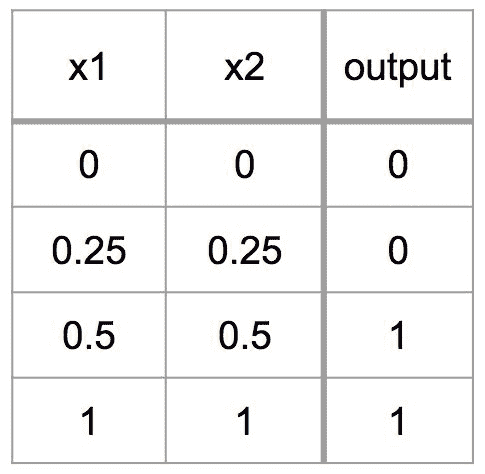
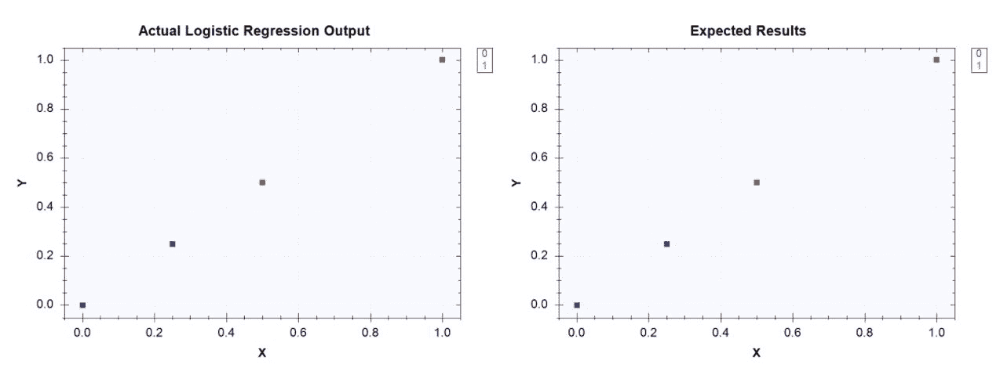
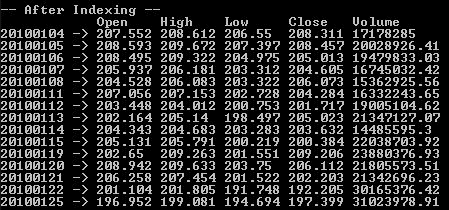

# 一、机器学习建模基础

很难看出**机器学习** ( **ML** )如何影响普通人的日常生活。其实 ML 无处不在！在搜索餐厅吃饭的过程中，你几乎可以肯定使用了 ML。在寻找参加晚宴的礼服时，你会使用 ML。在去赴宴的路上，如果你使用了某个拼车应用，你可能也会使用 ML。ML 的应用如此广泛，以至于它已经成为我们生活中必不可少的一部分，尽管它通常并不引人注意。随着数据的不断增长及其可访问性，各行各业对 ML 的应用和需求都在快速增长。然而，训练有素的数据科学家的增长速度尚未满足商业中 ML 需求的增长速度，尽管丰富的资源和软件库使构建 ML 模型更容易，因为数据科学家和 ML 工程师需要时间和经验来掌握这些技能。这本书将为这些人准备基于真实数据集的真实项目。

在这一章中，我们将学习一些 ML 的实际例子和应用，构建 ML 模型的基本步骤，以及如何为 ML 建立我们的 C#环境。在这个简短的介绍性章节之后，我们将立即使用第二章、*垃圾邮件过滤*和[第三章](part0036.html#12AK80-5ebdf09927b7492888e31e8436526470)、 *Twitter 情感分析*中的文本数据集来构建分类 ML 模型。然后在[第四章](part0045.html#1AT9A0-5ebdf09927b7492888e31e8436526470)、*外汇汇率预测*、[第五章](part0056.html#1LCVG0-5ebdf09927b7492888e31e8436526470)、*房屋及财产公允价值*中利用金融及房地产财产数据建立回归模型。在[第六章](part0073.html#25JP20-5ebdf09927b7492888e31e8436526470)、*客户细分*中，我们将使用一种聚类算法来洞察使用电子商务数据的客户行为。在[第 7 章](part0082.html#2E6E40-5ebdf09927b7492888e31e8436526470)、*音乐流派推荐*和[第 8 章](part0097.html#2SG6I0-5ebdf09927b7492888e31e8436526470)、*手写数字识别*中，我们将利用音频和图像数据建立推荐和图像识别模型。最后，我们将使用半监督学习技术来检测[第 9 章](part0116.html#3EK180-5ebdf09927b7492888e31e8436526470)、*网络攻击检测*和[第 10 章](part0132.html#3TSA80-5ebdf09927b7492888e31e8436526470)、*信用卡欺诈检测*中的异常。

在本章中，我们将讨论以下主题:

*   关键的 ML 任务和应用
*   构建 ML 模型的步骤
*   为 ML 建立一个 C#环境


# 关键的 ML 任务和应用

在我们的日常生活中，有许多领域在不被注意的情况下使用了 ML。媒体公司使用 ML 推荐最相关的内容，如新闻文章、电影或音乐，供您阅读、观看或收听。电子商务公司使用 ML 来推荐你感兴趣并且最有可能购买的商品。游戏公司使用 ML 来检测你的运动和关节运动，用于他们的运动传感器游戏。ML 在行业中的其他一些常见用途包括摄像头上的人脸检测以更好地聚焦，自动问答，聊天机器人或虚拟助理与客户互动以回答问题和请求，以及检测和防止欺诈性交易。在这一节中，我们将了解一些日常生活中大量使用 ML 的应用程序:

*   **Google News feed**:Google News feed 使用 ML 根据用户的兴趣和其他个人资料数据生成个性化的文章流。协同过滤算法经常用于这种推荐系统，并且是从它们的用户基础的观看历史数据中构建的。媒体公司使用这种个性化推荐系统来吸引更多的流量到他们的网站，并增加订户的数量。
*   **亚马逊产品推荐**:亚马逊使用用户浏览和订单历史数据来训练一个 ML 模型，以推荐用户最有可能购买的产品。这是电子商务行业监督学习的一个很好的用例。这些推荐算法通过显示与每个用户兴趣最相关的项目，帮助电子商务公司实现利润最大化。
*   网飞电影推荐:网飞使用电影评级、观看历史和偏好简档来推荐用户可能喜欢的其他电影。他们用数据训练协同过滤算法，进行个性化推荐。考虑到*超过* *人们在网飞上观看的 80%的电视节目是通过平台的推荐系统*发现的，根据 Wired 上的一篇文章([http://www . Wired . co . uk/article/how-do-netflixs-algorithms-work-machine-learning-helps-to-predict-what-viewers-will-like](http://www.wired.co.uk/article/how-do-netflixs-algorithms-work-machine-learning-helps-to-predict-what-viewers-will-like))，这是媒体公司 ML 的一个非常有用和有利可图的例子。
*   **摄像头上的人脸检测**:摄像头检测人脸，以便更好地对焦和测光。这是计算机视觉和分类最常用的例子。此外，一些照片管理软件使用聚类算法将图像中相似的面孔分组在一起，以便您可以在以后搜索照片中某些人的照片。
*   Alexa-虚拟助理:虚拟助理系统，如 Alexa，可以回答诸如*纽约的天气如何？*或者完成某些任务，比如*打开客厅的灯。*这些类型的虚拟助理系统通常使用语音识别、**自然语言理解** ( **NLU** )、深度学习和各种其他机器学习技术来构建。
*   **微软 Xbox Kinect** : Kinect 可以感知每个目标离传感器有多远，并检测关节位置。Kinect 使用随机决策树算法进行训练，该算法从深度图像中构建大量单独的决策树。

下面的截图展示了使用 ML 的推荐系统的不同例子:



左:谷歌新闻，右上:亚马逊产品推荐，右下:网飞电影推荐

下面的屏幕截图描述了 ML 应用程序的几个其他示例:


左:人脸检测，中:亚马逊 Alexa，右:微软 Xbox Kinect


# 构建 ML 模型的步骤

现在我们已经看到了一些 ML 应用程序的例子，问题是，我们如何着手构建这样的 ML 应用程序和系统？大学教授的关于 ML 和 ML 课程的书籍通常从覆盖 ML 算法背后的数学和理论开始，然后将这些算法应用于给定的数据集。这种方法对于那些完全不熟悉这门学科并希望学习 ML 基础的人来说是非常好的。然而，具有一些先前知识和经验的有抱负的数据科学家，以及希望将他们的知识应用到实际的 ML 项目中的人，经常会不知道从哪里开始以及如何着手一个给定的 ML 项目。在这一节中，我们将讨论构建 ML 应用程序的典型工作流程，这将贯穿全书。下图总结了我们使用 ML 开发应用程序的方法，我们将在下面的小节中对此进行更详细的讨论:

 

构建 ML 模型的步骤

如上图所示，构建学习模型要遵循的步骤如下:

*   **问题定义**:启动任何项目的第一步，不仅仅是理解问题，还要定义你试图用 ML 解决的问题。对一个问题的糟糕定义将导致一个无意义的 ML 系统，因为模型将已经为一个你实际上没有试图解决的问题而被训练和优化。毫无疑问，这第一步是构建有用的 ML 模型和应用程序的最重要的一步。在开始构建 ML 模型之前，您至少应该回答以下四个问题:
*   **数据收集**:拥有数据是建立 ML 模型最本质最关键的部分，最好是大量的数据。没有数据，没有模型。根据您的项目，您收集数据的方法可能会有所不同。您可以从其他供应商那里购买现有的数据源，您可以抓取网站并从中提取数据，您可以使用公开可用的数据，或者您也可以收集自己的数据。有多种方法可以收集 ML 模型所需的数据，但在数据收集过程中，您需要记住这两个数据元素-目标变量和特征变量。目标变量是预测的答案，而特征变量是模型用来学习如何预测目标变量的因素。通常，目标变量不会以标签的形式出现。例如，当您处理 Twitter 数据来预测每条推文的情绪时，您可能没有为每条推文标记情绪数据。在这种情况下，您必须采取额外的步骤来标记您的目标变量。一旦收集了数据，就可以进入数据准备步骤。
*   **数据准备**:一旦你收集了所有的输入数据，你需要准备好它，以便它是一种可用的格式。这一步比你想象的更重要。如果您有杂乱的数据，并且您没有为您的学习算法清理这些数据，您的算法将不会从您的数据集很好地学习，并且不会按预期执行。还有，即使你有高质量的数据，如果你的数据不是你的算法可以用来训练的格式，那么拥有高质量的数据是没有意义的。糟糕的数据，糟糕的模型。您至少应该处理下面列出的一些常见问题，以便为后续步骤准备好数据:
*   **数据分析**:现在你的数据已经准备好了，是时候实际查看数据，看看你是否能识别出任何模式，并从数据中得出一些见解。汇总统计数据和图表是描述和理解数据的两种最佳方式。对于连续变量，查看最小值、最大值、平均值、中间值和四分位数是一个很好的起点。对于分类变量，您可以查看分类的计数和百分比。当您查看这些汇总统计数据时，您还可以开始绘制图表来可视化您的数据结构。下图显示了一些常用的数据分析图表。直方图常用于显示和检查变量、异常值和偏度的基本分布。箱线图常用于显示五个数字的汇总、异常值和偏斜度。成对散点图常用于检测变量之间明显的成对相关性:



数据分析和可视化。左上:名义房屋销售价格直方图，右上:使用对数标度的房屋销售价格直方图，左下:地下室、一楼和二楼平方英尺分布的箱线图，右下:一楼和二楼平方英尺之间的散点图

想出特性是困难的，耗时的，需要专业知识。应用机器学习基本上是特征工程。

*-Andrew Ng*

*   **训练/测试算法**:一旦你创建了你的特征，就该训练和测试一些 ML 算法了。在开始训练模型之前，最好考虑一下性能指标。根据您正在解决的问题，您对绩效评估的选择会有所不同。例如，如果您正在构建一个股票价格预测模型，您可能希望最小化您的预测和实际价格之间的差异，并选择**均方根误差** ( **RMSE** )作为您的性能度量。如果您正在构建一个信用模型来预测某人是否可以获得贷款批准，您可能希望使用精确率作为您的绩效衡量标准，因为不正确的贷款批准(误报)将比不正确的贷款不批准(误报)产生更大的负面影响。在我们学习这些章节时，我们将讨论每个项目更具体的性能指标。

一旦您对模型有了具体的性能度量，现在就可以训练和测试各种学习算法及其性能。根据你的预测目标，你对学习算法的选择也会有所不同。下图显示了一些常见的机器学习问题。如果您正在解决分类问题，您可能想要训练分类器，例如逻辑回归模型、朴素贝叶斯分类器或随机森林分类器。另一方面，如果你有一个连续的目标变量，那么你会想要训练回归变量，比如线性回归模型，k-最近邻，或者**支持向量机** ( **SVM** )。如果您希望通过使用无监督学习从数据中获得一些见解，您可能希望使用 k 均值聚类或均值漂移算法:


ML 问题的图解。左:分类，中:回归，右:聚类

最后，我们必须考虑如何测试和评估我们尝试过的学习算法的性能。将数据集分成训练集和测试集以及运行交叉验证是测试和比较 ML 模型的两种最常用的方法。将数据集分成两个子集(一个用于训练，另一个用于测试)的目的是在训练集上训练模型，而不将其暴露给测试集，以便测试集上的预测结果指示未预见数据的一般模型性能。k 倍交叉验证是评估模型性能的另一种方法。它首先将一个数据集分成大小相等的 K 个子集，留下一个子集用于测试，并在其余的子集上进行训练。例如，在三重交叉验证中，数据集将首先分成三个大小相等的子集。在第一次迭代中，我们将使用折叠#1 和#2 来训练我们的模型，并在折叠#3 上测试它。在第二次迭代中，我们将使用折叠#1 和#3 在折叠#2 上训练和测试我们的模型，在第三次迭代中，我们将使用折叠#2 和#3 在折叠#1 上训练和测试我们的模型。然后，我们将对性能指标进行平均，以评估模型性能:

*   **改善结果**:到目前为止，你已经有一两个表现相当好的候选模型，但是可能还有一些改进的空间。也许您注意到您的候选模型在某种程度上过度拟合，也许它们没有达到您的目标性能，或者也许您有更多的时间来迭代您的模型-不管您的意图如何，有多种方法可以提高您的模型的性能，它们如下:
*   **部署**:是时候将您的模型付诸行动了！一旦你准备好了模型，是时候让它们投入生产了。在你的模型完全掌控之前，确保你进行了广泛的测试。计划为您的模型开发监控工具也是有益的，因为随着输入数据的发展，模型性能会随着时间的推移而降低。


# 为 ML 建立一个 C#环境

现在我们已经讨论了构建 ML 模型的步骤和方法，我们将在本书中遵循这些步骤和方法，让我们开始设置 ML 的 C#环境。我们将首先安装和设置 Visual Studio，然后安装和设置我们将在接下来的章节中经常用到的两个包(Accord.NET 和 Deedle)。


# 为 C#设置 Visual Studio

假设你有一些 C#的先验知识，我们将保持这一部分的简短。如果你需要安装 Visual Studio for C#，去[https://www.visualstudio.com/downloads/](https://www.visualstudio.com/downloads/)下载一个版本的 Visual Studio。在本书中，我们使用的是 Visual Studio 2017 的社区版。如果它提示您下载。在你安装 Visual Studio 之前，去 https://www.microsoft.com/en-us/download/details.aspx?的[id=53344](https://www.microsoft.com/en-us/download/details.aspx?id=53344) 并首先安装。


# 安装 Accord.NET

Accord.NET 是一个. NET ML 框架。在 ML 软件包之上，Accord.NET 框架还有数学、统计学、计算机视觉、计算机听觉和其他科学计算模块。我们将主要使用 Accord.NET 框架的 ML 包。

一旦你安装并设置好你的 Visual Studio，让我们开始为 C#，Accord.NET 安装 ML 框架。通过 NuGet 安装最简单。要安装它，打开包管理器(工具|获取包管理器|包管理器控制台)并通过输入以下命令安装`Accord.MachineLearning`和`Accord.Controls`:

```
PM> Install-Package Accord.MachineLearning
PM> Install-Package Accord.Controls
```

现在，让我们使用这些 Accord.NET 包构建一个示例 ML 应用程序。打开 Visual Studio，在 Visual C#类别下创建一个新的`Console Application`。使用前面的命令通过`NuGet`安装那些 Accord.NET 包，并添加对我们项目的引用。在您的**解决方案浏览器**中，您应该会看到一些 Accord.NET 软件包被添加到您的参考资料中，结果应该类似于下面的截图:



我们现在要建立的模型是一个非常简单的逻辑回归模型。给定二维数组和预期输出，我们将开发一个训练逻辑回归分类器的程序，然后绘制显示预期输出和该模型实际预测的结果。该模型的输入和输出如下所示:



这个样本逻辑回归分类器的代码如下:

```
using System;
using System.Collections.Generic;
using System.Linq;
using System.Text;
using System.Threading.Tasks;

using Accord.Controls;
using Accord.Statistics;
using Accord.Statistics.Models.Regression;
using Accord.Statistics.Models.Regression.Fitting;

namespace SampleAccordNETApp
{
    class Program
    {
        static void Main(string[] args)
        {
            double[][] inputs =
            {
                new double[] { 0, 0 },
                new double[] { 0.25, 0.25 }, 
                new double[] { 0.5, 0.5 }, 
                new double[] { 1, 1 },
            };

            int[] outputs =
            { 
                0,
                0,
                1,
                1,
            };

            // Train a Logistic Regression model
            var learner = new IterativeReweightedLeastSquares<LogisticRegression>()
            {
                MaxIterations = 100
            };
            var logit = learner.Learn(inputs, outputs);

            // Predict output
            bool[] predictions = logit.Decide(inputs);

            // Plot the results
            ScatterplotBox.Show("Expected Results", inputs, outputs);
            ScatterplotBox.Show("Actual Logistic Regression Output", inputs, predictions.ToZeroOne());

            Console.ReadKey();
        }
    }
}
```

一旦你写完这段代码，你可以点击 *F5* 或者点击顶部的开始按钮来运行它。如果一切顺利，应该会产生下图所示的两个图。如果失败，检查参考文献或错别字。您可以随时右键单击类名或灯泡图标，让 Visual Studio 帮助您找到命名空间引用中缺少的包:



示例程序生成的图。左:实际预测结果，右:预期输出

此示例代码可在以下链接找到:[https://github . com/Yoon hwang/c-sharp-machine-learning/blob/master/ch . 1/sampleaccordnetapp . cs](https://github.com/yoonhwang/c-sharp-machine-learning/blob/master/ch.1/SampleAccordNETApp.cs)。


# 安装 Deedle

Deedle 是一个开源软件。数据框架编程的. NET 库。Deedle 允许您以类似于 Python 中 R 数据帧和 pandas 数据帧的方式进行数据操作。在接下来的章节中，我们将使用这个包来加载和操作 ML 项目的数据。

类似于我们如何安装 Accord.NET，我们可以从 NuGet 安装 Deedle 包。打开软件包管理器(工具|获取软件包管理器|软件包管理器控制台),使用以下命令安装`Deedle`:

```
PM> Install-Package Deedle
```

让我们简单地看看如何使用这个包从 CSV 文件加载数据并进行简单的数据操作。更多信息，你可以访问[http://bluemountaincapital.github.io/Deedle/](http://bluemountaincapital.github.io/Deedle/)获取 API 文档和样本代码。在这个练习中，我们将使用 2010 年至 2013 年的每日 AAPL 股票价格数据。您可以从以下链接下载这些数据:[https://github . com/Yoon hwang/c-sharp-machine-learning/blob/master/ch . 1/table _ AAPL . CSV](https://github.com/yoonhwang/c-sharp-machine-learning/blob/master/ch.1/table_aapl.csv)。

打开 Visual Studio，在 Visual C#类别下创建一个新的`Console Application`。使用前面的命令通过`NuGet`安装`Deedle`库，并添加对项目的引用。在您的**解决方案** **浏览器**中，您应该会看到添加到您的引用中的`Deedle`包。

现在，我们将 CSV 数据加载到一个`Deedle`数据帧中，然后进行一些数据操作。首先，我们将使用`Date`字段更新数据帧的索引。然后，我们将对`Open`和`Close` 列应用一些算术运算来计算从开盘价到收盘价的百分比变化。最后，我们将通过计算收盘价和前收盘价之差，除以前收盘价，然后乘以`100`来计算日收益率。该示例`Deedle`程序的代码如下所示:

```
using Deedle;
using System;
using System.Collections.Generic;
using System.IO;
using System.Linq;
using System.Text;
using System.Threading.Tasks;

namespace DeedleApp
{
    class Program
    {
        static void Main(string[] args)
        {
            // Read AAPL stock prices from a CSV file
            var root = Directory.GetParent(Directory.GetCurrentDirectory()).Parent.FullName;
            var aaplData = Frame.ReadCsv(Path.Combine(root, "table_aapl.csv"));
            // Print the data
            Console.WriteLine("-- Raw Data --");
            aaplData.Print();

            // Set Date field as index
            var aapl = aaplData.IndexRows<String>("Date").SortRowsByKey();
            Console.WriteLine("-- After Indexing --");
            aapl.Print();

            // Calculate percent change from open to close
            var openCloseChange = 
                ((
                    aapl.GetColumn<double>("Close") - aapl.GetColumn<double>("Open")
                ) / aapl.GetColumn<double>("Open")) * 100.0;
            aapl.AddColumn("openCloseChange", openCloseChange);
            Console.WriteLine("-- Simple Arithmetic Operations --");
            aapl.Print();

            // Shift close prices by one row and calculate daily returns
            var dailyReturn = aapl.Diff(1).GetColumn<double>("Close") / aapl.GetColumn<double>("Close") * 100.0;
            aapl.AddColumn("dailyReturn", dailyReturn);
            Console.WriteLine("-- Shift --");
            aapl.Print();

            Console.ReadKey();
        }
    }
}
```

当您运行这段代码时，您将看到以下输出。

原始数据集如下所示:


使用日期字段索引该数据集后，您将看到以下内容:



在应用简单的算术运算来计算从打开到关闭的变化率之后，您将看到以下内容:


最后，在将收盘价移动一行并计算每日回报后，您将看到以下内容:


正如您从这个示例`Deedle`项目中看到的，我们可以用一两行代码运行各种数据操作，而使用本机 C#应用相同的操作需要更多行代码。我们将在本书中频繁使用`Deedle`库进行数据操作和特性工程。

这个示例 Deedle 代码可以在以下链接找到:[https://github . com/Yoon hwang/c-sharp-machine-learning/blob/master/ch . 1/Deedle app . cs](https://github.com/yoonhwang/c-sharp-machine-learning/blob/master/ch.1/DeedleApp.cs)。


# 摘要

在这一章中，我们简要讨论了一些关键的 ML 任务和 ML 应用的实际例子。我们还学习了开发 ML 模型的步骤以及每个步骤中的常见挑战和任务。在接下来的章节中，我们将按照这些步骤完成我们的项目，我们将更详细地探讨某些步骤，尤其是特征工程、模型选择和模型性能评估。我们将根据我们要解决的问题的类型，讨论我们可以在每个步骤中应用的各种技术。最后，在这一章中，我们将带你了解如何为我们未来的 ML 项目建立一个 C#环境。我们使用 Accord.NET 框架构建了一个简单的逻辑回归分类器，并使用`Deedle`库来加载和操作数据。

在下一章中，我们将直接应用我们在本章中讨论过的 ML 基础知识，为垃圾邮件过滤建立一个 ML 模型。我们将遵循本章中讨论的构建 ML 模型的步骤，将原始电子邮件数据转换为结构化数据集，分析电子邮件文本数据以获得一些见解，然后最终构建分类模型来预测电子邮件是否为垃圾邮件。我们还将在下一章讨论一些分类模型的常用模型评估指标。