<title>Spam Email Filtering</title> 

# 垃圾邮件过滤

在本章中，我们将开始使用我们在[第一章](part0020.html#J2B80-5ebdf09927b7492888e31e8436526470)、*机器学习建模基础*中安装的两个包，用 C#构建真实世界**机器学习** ( **ML** )模型；Accord.NET 负责 ML，迪德尔负责数据处理。在本章中，我们将建立一个垃圾邮件过滤的分类模型。我们将使用包含垃圾邮件和非垃圾邮件的原始电子邮件数据集，并使用它来训练我们的 ML 模型。我们将开始遵循我们在前一章中讨论的开发 ML 模型的步骤。这将帮助我们更好地理解 ML 建模中的工作流程和方法，并使它们成为我们的第二天性。在我们努力构建垃圾邮件分类模型的同时，我们还将讨论文本数据集的特征工程技术和分类模型的基本模型验证方法，并比较用于垃圾邮件过滤的逻辑回归分类器和朴素贝叶斯分类器。熟悉这些模型构建步骤、基本文本特征工程技术和基本分类模型验证方法将为使用**自然语言处理** ( **NLP** )的更高级特征工程技术以及在[第 3 章](part0036.html#12AK80-5ebdf09927b7492888e31e8436526470)、*推特情感分析*中构建多类分类模型奠定基础。

在本章中，我们将讨论以下主题:

*   垃圾邮件过滤项目的问题定义
*   数据准备
*   电子邮件数据分析
*   电子邮件数据的特征工程
*   Logistic 回归与朴素贝叶斯在垃圾邮件过滤中的比较
*   分类模型验证

<title>Problem definition for the spam email filtering project</title> 

# 垃圾邮件过滤项目的问题定义

让我们从定义本章要解决的问题开始。你可能已经很熟悉什么是垃圾邮件了；垃圾邮件过滤是 Gmail、Yahoo Mail 和 Outlook 等电子邮件服务的基本功能。垃圾邮件对用户来说可能很烦人，但是它们也带来了更多的问题和风险。例如，垃圾邮件可以被设计成请求信用卡号码或银行帐户信息，这可用于信用卡欺诈或洗钱。垃圾邮件还可用于获取个人数据，如社会安全号码或用户 id 和密码，然后用于身份盗窃和各种其他犯罪。拥有垃圾邮件过滤技术是电子邮件服务的一个重要步骤，可以使用户免于遭受此类犯罪。然而，拥有正确的垃圾邮件过滤解决方案是困难的。您希望过滤掉可疑的电子邮件，但同时又不希望过滤太多，这样非垃圾邮件就会进入垃圾邮件文件夹，永远不会被用户看到。为了解决这个问题，我们将让我们的 ML 模型从原始电子邮件数据集学习，并使用主题行将可疑电子邮件分类为垃圾邮件。我们将通过两个性能指标来衡量我们的成功:精确度和召回率。我们将在接下来的章节中详细讨论这些指标。

总结一下我们的问题定义:

*   有什么问题？我们需要一个垃圾邮件过滤解决方案来防止我们的用户成为欺诈活动的受害者，同时改善用户体验。
*   为什么会有问题？在过滤可疑电子邮件和不过度过滤之间取得适当的平衡，以便非垃圾电子邮件仍然可以进入收件箱，这是很困难的。我们将依靠 ML 模型来学习如何对这种可疑的电子邮件进行统计分类。
*   解决这个问题的方法有哪些？我们将建立一个分类模型，根据电子邮件的主题来标记潜在的垃圾邮件。我们将使用精确度和召回率来平衡被过滤的电子邮件数量。
*   成功的标准是什么？我们需要高召回率(实际回收的垃圾邮件占垃圾邮件总数的百分比)，而不需要牺牲太多的精确率(正确分类的垃圾邮件占预测为垃圾邮件的百分比)。

<title>Data preparation</title> 

# 数据准备

既然我们已经清楚地陈述和定义了我们要用 ML 解决的问题，我们需要数据。没有数据，就没有 ML。通常，您需要在数据准备步骤之前采取额外的步骤来收集和汇总您需要的数据，但在本书中，我们将使用公开可用的预编译和标记的数据集。在本章中，我们将使用 CSDMC2010 垃圾邮件语料库数据集([http://csmining.org/index.php/spam-email-datasets-.html](http://csmining.org/index.php/spam-email-datasets-.html))来训练和测试我们的模型。你可以点击链接，下载网页底部的压缩数据。当你下载并解压数据后，你会看到两个名为`TESTING`和`TRAINING`的文件夹，以及一个名为`SPAMTrain.label`的文本文件。`SPAMTrain.label`文件对`TRAINING`文件夹中的每封邮件都有编码标签——`0`代表垃圾邮件，`1`代表非垃圾邮件。我们将使用这个文本文件和`TRAINING`文件夹中的电子邮件数据来构建垃圾邮件分类模型。

一旦您下载了数据并将其放在可以加载数据的地方，您需要为将来的特征工程和模型构建步骤做好准备。我们现在拥有的是一个原始数据集，其中包含许多 EML 文件，这些文件包含有关个人电子邮件的信息，还有一个文本文件包含标签信息。为了使该原始数据集可用于使用电子邮件主题行构建垃圾邮件分类模型，我们需要执行以下任务:

1.  **从 EML 文件中提取主题行**:为未来任务准备数据的第一步是从各个 EML 文件中提取主题和正文。我们将使用一个名为`EAGetMail`的包来加载和提取 EML 文件中的信息。您可以使用 Visual Studio 中的包管理器安装此包。看看代码的第 4 到 6 行来安装这个包。使用`EAGetMail`包，您可以轻松地从 EML 文件中加载和提取主题和正文内容(第 24–30 行)。从电子邮件中提取主题和正文后，需要将每行数据作为一行附加到 Deedle 数据框中。看看下面代码中第 18 行的`ParseEmails`函数，看看如何创建一个 Deedle 数据帧，其中每行包含每封电子邮件的索引号、主题行和正文内容。

2.  **将提取的数据与标签结合**:从单个 EML 文件中提取出主题和正文内容后，我们还需要做一件事。我们需要将编码标签(0 代表垃圾邮件，1 代表垃圾邮件)映射到我们在上一步中创建的数据帧的每一行。如果用任何文本编辑器打开`SPAMTrain.label`文件，可以看到编码标签在第一列，对应的电子邮件文件名在第二列，中间用空格隔开。使用 Deedle frame 的`ReadCsv`函数，您可以通过指定一个空格作为分隔符(参见代码中的第 50 行)轻松地将这个标签数据加载到数据框中。一旦您将这些带标签的数据加载到数据框中，您可以使用 Deedle 框架的`AddColumn`功能将该数据框的第一列添加到我们在上一步中创建的另一个数据框中。看一下下面代码的第 49-52 行，看看我们如何将标签信息与提取的电子邮件数据结合起来。
3.  **将合并后的数据导出为 CSV 文件**:现在我们有了一个包含电子邮件和标签数据的数据框，是时候将该数据框导出为 CSV 文件以供将来使用了。如以下代码中的第 54 行所示，将数据帧导出到 CSV 文件需要一行。使用 Deedle frame 的`SaveCsv`功能，您可以轻松地将数据帧保存为 CSV 文件。

该数据准备步骤的代码如下:

```
// Install-Package Deedle
// Install-Package FSharp.Core
using Deedle;
// if you don't have EAGetMail package already, install it 
// via the Package Manager Console by typing in "Install-Package EAGetMail"
using EAGetMail;
using System;
using System.Collections.Generic;
using System.IO;
using System.Linq;
using System.Text;
using System.Threading.Tasks;

namespace EmailParser
{
    class Program
    {
        private static Frame<int, string> ParseEmails(string[] files)
        {
            // we will parse the subject and body from each email
            // and store each record into key-value pairs
            var rows = files.AsEnumerable().Select((x, i) =>
            {
                // load each email file into a Mail object
                Mail email = new Mail("TryIt");
                email.Load(x, false);

                // extract the subject and body
                string emailSubject = email.Subject;
                string textBody = email.TextBody;

                // create key-value pairs with email id (emailNum), subject, and body
                return new { emailNum = i, subject = emailSubject, body = textBody };
            });

            // make a data frame from the rows that we just created above
            return Frame.FromRecords(rows);
        }

        static void Main(string[] args)
        {
            // Get all raw EML-format files
            // TODO: change the path to point to your data directory
            string rawDataDirPath = "<path-to-data-directory>";
            string[] emailFiles = Directory.GetFiles(rawDataDirPath, "*.eml");

            // Parse out the subject and body from the email files
            var emailDF = ParseEmails(emailFiles);
            // Get the labels (spam vs. ham) for each email
            var labelDF = Frame.ReadCsv(rawDataDirPath + "\\SPAMTrain.label", hasHeaders: false, separators: " ", schema: "int,string");
            // Add these labels to the email data frame
            emailDF.AddColumn("is_ham", labelDF.GetColumnAt<String>(0));
            // Save the parsed emails and labels as a CSV file
            emailDF.SaveCsv("transformed.csv");

            Console.WriteLine("Data Preparation Step Done!");
            Console.ReadKey();
        }
    }
}
```

在运行这段代码之前，您需要将第 44 行中的`<path-to-data-directory>`替换为存储数据的实际路径。一旦运行了这段代码，就会创建一个名为`transformed.csv`的文件，它将包含四列(`emailNum`、`subject`、`body`和`is_ham`)。我们将使用此输出数据作为以下步骤的输入，为垃圾邮件过滤项目构建 ML 模型。然而，请尽情发挥创造力，使用 Deedle 框架和`EAGetMail`包，以不同的方式调整和准备这些数据。我们在这里展示的代码是为将来的使用准备原始电子邮件数据的一种方法，以及您可以从原始电子邮件数据中提取的一些信息。使用`EAGetMail`包，您可以提取其他特征，如发件人的电子邮件地址和电子邮件中的附件，这些额外的特征可能有助于改进您的垃圾邮件分类模型。

这个数据准备步骤的代码也可以在下面的存储库中找到:[https://github . com/Yoon hwang/c-sharp-machine-learning/blob/master/ch . 2/email parser . cs](https://github.com/yoonhwang/c-sharp-machine-learning/blob/master/ch.2/EmailParser.cs)。

<title>Email data analysis</title> 

# 电子邮件数据分析

在数据准备步骤中，我们将原始数据集转换成可读性更强、更有用的数据集。我们现在有一个文件可以查看，以确定哪些电子邮件是垃圾邮件，哪些不是。此外，我们可以很容易地找到垃圾邮件和非垃圾邮件的主题行。有了这些转换后的数据，让我们开始看看数据实际上是什么样子，看看我们能否在数据中找到任何模式或问题。

因为我们处理的是文本数据，所以我们首先要看的是垃圾邮件和非垃圾邮件之间的单词分布有什么不同。为此，我们需要将上一步的数据输出转换成单词出现的矩阵表示。让我们以数据中的前三个主题行为例，一步一步地解决这个问题。我们的前三个主题行如下:


如果我们转换这些数据，使每一列对应于每个主题行中的每个单词，并将每个单元格的值编码为`1`，如果给定的主题行包含该单词，而`0`不包含该单词，则生成的矩阵如下所示:


这种特定的编码方式被称为**一键编码**，我们只关心特定的单词是否出现在主题行中，而不关心每个单词在主题行中的实际出现次数。在前面提到的例子中，我们还去掉了所有的标点符号，比如冒号、问号和感叹号。为了以编程方式实现这一点，我们可以使用一个`regex`将每个主题行分割成只包含字母数字字符的单词，然后用一键编码构建一个数据帧。执行此编码步骤的代码如下所示:

```
private static Frame<int, string> CreateWordVec(Series<int, string> rows)
{
    var wordsByRows = rows.GetAllValues().Select((x, i) =>
    {
        var sb = new SeriesBuilder<string, int>();

        ISet<string> words = new HashSet<string>(
            Regex.Matches(
                // Alphanumeric characters only
                x.Value, "\\w+('(s|d|t|ve|m))?"
            ).Cast<Match>().Select(
                // Then, convert each word to lowercase
                y => y.Value.ToLower()
            ).ToArray()
        );

        // Encode words appeared in each row with 1
        foreach (string w in words)
        {
            sb.Add(w, 1);
        }

        return KeyValue.Create(i, sb.Series);
    });

    // Create a data frame from the rows we just created
    // And encode missing values with 0
    var wordVecDF = Frame.FromRows(wordsByRows).FillMissing(0);

    return wordVecDF;
}
```

有了这种一键编码的单词矩阵表示，我们的数据分析过程就容易多了。例如，如果我们想要查看垃圾邮件中出现频率最高的前十个单词，我们可以简单地对垃圾邮件的一键编码单词矩阵的每一列中的值求和，并取具有最高求和值的十个单词。这正是我们在下面的代码中所做的:

```
var hamTermFrequencies = subjectWordVecDF.Where(
    x => x.Value.GetAs<int>("is_ham") == 1
).Sum().Sort().Reversed.Where(x => x.Key != "is_ham");

var spamTermFrequencies = subjectWordVecDF.Where(
    x => x.Value.GetAs<int>("is_ham") == 0
).Sum().Sort().Reversed;

// Look at Top 10 terms that appear in Ham vs. Spam emails
var topN = 10;

var hamTermProportions = hamTermFrequencies / hamEmailCount;
var topHamTerms = hamTermProportions.Keys.Take(topN);
var topHamTermsProportions = hamTermProportions.Values.Take(topN);

System.IO.File.WriteAllLines(
    dataDirPath + "\\ham-frequencies.csv",
    hamTermFrequencies.Keys.Zip(
        hamTermFrequencies.Values, (a, b) => string.Format("{0},{1}", a, b)
    )
);

var spamTermProportions = spamTermFrequencies / spamEmailCount;
var topSpamTerms = spamTermProportions.Keys.Take(topN);
var topSpamTermsProportions = spamTermProportions.Values.Take(topN);

System.IO.File.WriteAllLines(
    dataDirPath + "\\spam-frequencies.csv",
    spamTermFrequencies.Keys.Zip(
        spamTermFrequencies.Values, (a, b) => string.Format("{0},{1}", a, b)
    )
);
```

从这段代码中可以看出，我们使用 Deedle 的数据框的`Sum`方法对每一列中的值求和，并按逆序排序。我们对垃圾邮件做一次，对垃圾邮件再做一次。然后，我们使用`Take`方法得到在垃圾邮件和火腿邮件中出现频率最高的前十个单词。当您运行这段代码时，它会生成两个 CSV 文件:`ham-frequencies.csv`和`spam-frequencies.csv`。这两个文件包含关于垃圾邮件和业余爱好者电子邮件中出现的单词数量的信息，我们稍后将在功能工程和模型构建步骤中使用这些信息。

现在让我们将一些数据可视化，以便进一步分析。首先，看一下下面的图表，这是数据集中在业余爱好者电子邮件中出现频率最高的十个术语:


火腿邮件中最常出现的十个术语的柱状图

从这个条形图可以看出，在数据集中，垃圾邮件比垃圾邮件多，就像在现实世界中一样。在我们的收件箱里，我们通常会收到比垃圾邮件更多的垃圾邮件。我们使用以下代码来生成此条形图，以直观显示垃圾邮件在数据集中的分布情况:

```
var barChart = DataBarBox.Show(
    new string[] { "Ham", "Spam" },
    new double[] {
        hamEmailCount,
        spamEmailCount
    }
);
barChart.SetTitle("Ham vs. Spam in Sample Set");
```

使用 Accord.NET 框架中的`DataBarBox`类，我们可以很容易地在条形图中可视化数据。现在让我们来想象一下在垃圾邮件中最常出现的十个术语。您可以使用以下代码为垃圾邮件中的前十个术语生成条形图:

```
var hamBarChart = DataBarBox.Show(
    topHamTerms.ToArray(),
    new double[][] {
        topHamTermsProportions.ToArray(),
        spamTermProportions.GetItems(topHamTerms).Values.ToArray()
    }
);
hamBarChart.SetTitle("Top 10 Terms in Ham Emails (blue: HAM, red: SPAM)");

var spamBarChart = DataBarBox.Show(
    topSpamTerms.ToArray(),
    new double[][] {
        hamTermProportions.GetItems(topSpamTerms).Values.ToArray(),
        topSpamTermsProportions.ToArray()
    }
);
spamBarChart.SetTitle("Top 10 Terms in Spam Emails (blue: HAM, red: SPAM)");
```

同样，我们使用`DataBarBox`类来显示条形图。当您运行此代码时，您将看到下面的图表，显示了在业余爱好者电子邮件中最常出现的十个术语:


火腿邮件中最常出现的十个术语

垃圾邮件中最常出现的十个术语的条形图如下所示:

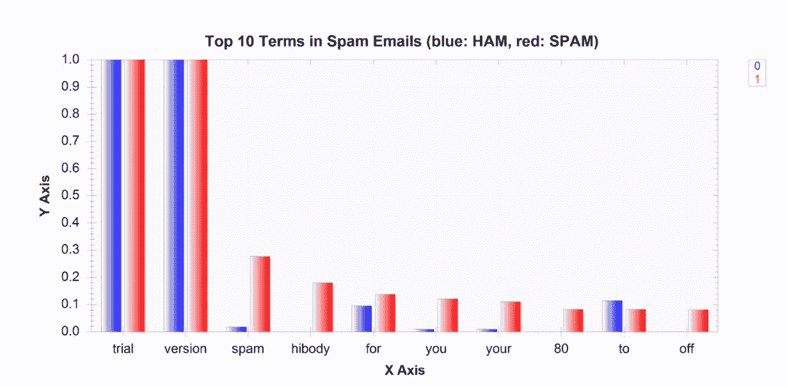

垃圾邮件中十大常见术语的条形图

正如所料，垃圾邮件中的单词分布与非垃圾邮件有很大不同。例如，如果你看右边的图表，单词 **spam** 和 **hibody** 在垃圾邮件中频繁出现，但在非垃圾邮件中并不多见。但是，有一点没有太大意义。如果你仔细观察，两个词**试用**和**版本**出现在所有的垃圾邮件和火腿邮件中，这很可能是真的。如果你在文本编辑器中打开一些 EML 的原始文件，你可以很容易地发现，并非所有的电子邮件都在主题行中包含这两个词。那么，发生了什么事？我们的数据是否被我们之前的数据准备或数据分析步骤污染了？

进一步的研究表明，我们使用的一个软件包导致了这个问题。我们用来加载和提取电子邮件内容的`EAGetMail`包，当我们使用他们的试用版时，会自动将`(Trial Version)`附加到主题行的末尾。现在我们知道了这个数据问题的根本原因，我们需要回去修复它。一个解决方案是返回到数据准备步骤，用下面的代码更新我们的`ParseEmails`函数，它只是从主题行中删除附加的`(Trial Version)`标志:

```
private static Frame<int, string> ParseEmails(string[] files)
{
    // we will parse the subject and body from each email
    // and store each record into key-value pairs
    var rows = files.AsEnumerable().Select((x, i) =>
    {
        // load each email file into a Mail object
        Mail email = new Mail("TryIt");
        email.Load(x, false);

        // REMOVE "(Trial Version)" flags
        string EATrialVersionRemark = "(Trial Version)"; // EAGetMail appends subjects with "(Trial Version)" for trial version
        string emailSubject = email.Subject.EndsWith(EATrialVersionRemark) ? 
            email.Subject.Substring(0, email.Subject.Length - EATrialVersionRemark.Length) : email.Subject;
        string textBody = email.TextBody;

        // create key-value pairs with email id (emailNum), subject, and body
        return new { emailNum = i, subject = emailSubject, body = textBody };
    });

    // make a data frame from the rows that we just created above
    return Frame.FromRecords(rows);
}
```

更新这段代码并再次运行前面的数据准备和分析代码后，单词分布的条形图就更有意义了。

下面的条形图显示了在修复和移除`(Trial Version)`标志后，在业余爱好者电子邮件中出现频率最高的十个术语:

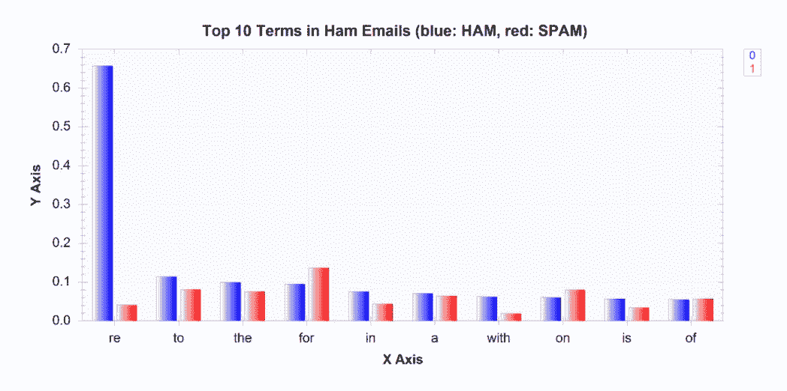

下面的条形图显示了在修复和删除`(Trial Version)`标志后，垃圾邮件中出现频率最高的十个术语:


这是一个很好的例子，说明了构建 ML 模型时数据分析步骤的重要性。数据准备和数据分析步骤之间的迭代是非常常见的，因为我们通常会在分析步骤中发现数据的问题，并且通常我们可以通过更新数据准备步骤中使用的一些代码来提高数据质量。现在我们已经有了主题行中使用的单词的矩阵表示的干净数据，是时候开始研究我们将用于构建 ML 模型的实际特征了。

<title>Feature engineering for email data</title> 

# 如果我们转换这些数据，使每一列对应于每个主题行中的每个单词，并将每个单元格的值编码为`1`，如果给定的主题行包含该单词，而`0`不包含该单词，则生成的矩阵如下所示:

在上一步中，我们简要查看了垃圾邮件和业余电子邮件的单词分布，我们注意到了一些情况。首先，大量出现频率最高的词是没有太多意义的常用词。例如，像*到*、*到*、*到*以及*到*这样的词是常用词，我们的 ML 算法不会从这些词中学到很多。这些类型的词被称为**停用词**，通常会被忽略或从特征集中删除。我们将使用 NLTK 的停用词列表从我们的特征集中过滤掉常用词。可以从这里下载 NLTK 停用词列表:[https://github . com/Yoon hwang/c-sharp-machine-learning/blob/master/ch . 2/stop words . txt](https://github.com/yoonhwang/c-sharp-machine-learning/blob/master/ch.2/stopwords.txt)。下面的代码显示了过滤掉这些停用词的一种方法:

```
// Read in stopwords list
ISet<string> stopWords = new HashSet<string>(
    File.ReadLines("<path-to-your-stopwords.txt>")
);
// Filter out stopwords from the term frequency series
var spamTermFrequenciesAfterStopWords = spamTermFrequencies.Where(
    x => !stopWords.Contains(x.Key)
);
```

过滤掉这些停用词后，非垃圾邮件的十大新常用术语如下:

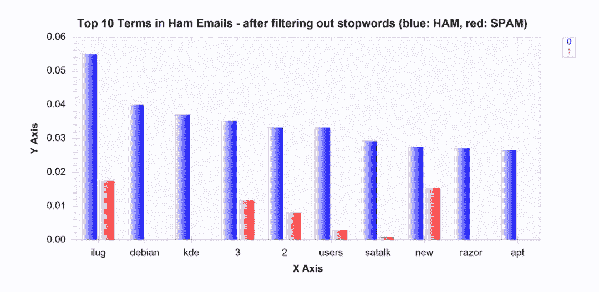

过滤掉停用词后，垃圾邮件中最常出现的十个术语如下:

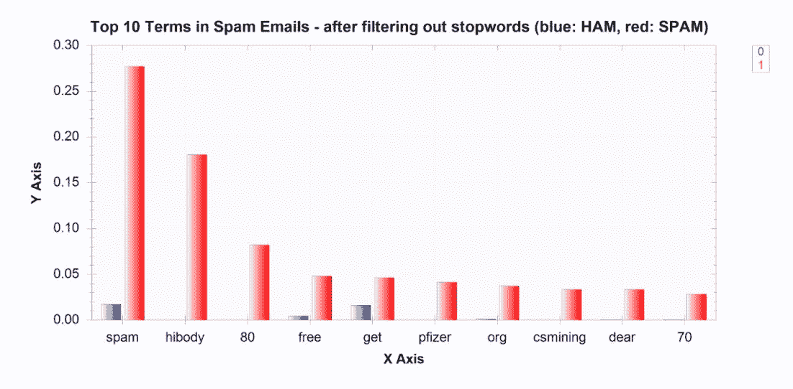

正如您从这些条形图中看到的，从功能集中过滤掉这些停用词使更多有意义的词出现在频繁出现的词列表的顶部。但是，这里还有一点我们可以注意到。数字似乎是出现频率最高的词。例如，数字 **3** 和 **2** 成为了火腿电子邮件中出现频率最高的十个单词。数字 **80** 和 **70** 成为垃圾邮件中出现频率最高的十个单词。然而，很难确定这些数字是否有助于训练 ML 模型将电子邮件分类为垃圾邮件或 ham。有多种方法可以从特性集中过滤出这些数字，但我们将在这里向您展示一种方法。我们更新了上一步中使用的`regex`来匹配只包含字母字符的单词，而不是字母数字字符。下面的代码显示了我们如何更新`CreateWordVec`函数来从特性集中过滤出数字:

```
private static Frame<int, string> CreateWordVec(Series<int, string> rows)
{
    var wordsByRows = rows.GetAllValues().Select((x, i) =>
    {
        var sb = new SeriesBuilder<string, int>();

        ISet<string> words = new HashSet<string>(
            Regex.Matches(
                // Alphabetical characters only
                x.Value, "[a-zA-Z]+('(s|d|t|ve|m))?"
            ).Cast<Match>().Select(
                // Then, convert each word to lowercase
                y => y.Value.ToLower()
            ).ToArray()
        );

        // Encode words appeared in each row with 1
        foreach (string w in words)
        {
            sb.Add(w, 1);
        }

        return KeyValue.Create(i, sb.Series);
    });

    // Create a data frame from the rows we just created
    // And encode missing values with 0
    var wordVecDF = Frame.FromRows(wordsByRows).FillMissing(0);

    return wordVecDF;
}
```

一旦我们从特征集中筛选出这些数字，垃圾邮件的单词分布如下所示:

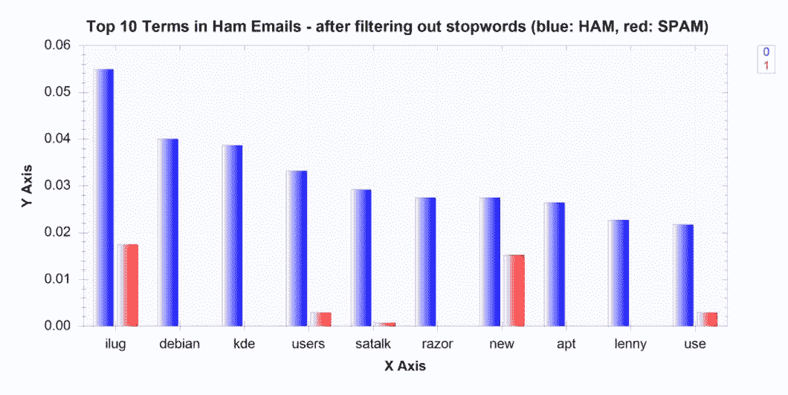

从特征集中过滤出数字后，垃圾邮件的单词分布如下所示:


正如您从这些条形图中看到的，我们在顶部列表中有更多有意义的词，垃圾邮件和业余电子邮件的词分布之间似乎有更大的区别。那些在垃圾邮件中频繁出现的词在业余邮件中似乎不太出现，反之亦然。

数据分析和特征工程步骤的完整代码可以在下面的 repo 中找到:[https://github . com/Yoon hwang/c-sharp-machine-learning/blob/master/ch . 2/data analyzer . cs](https://github.com/yoonhwang/c-sharp-machine-learning/blob/master/ch.2/DataAnalyzer.cs)。运行此代码后，它将生成条形图，显示垃圾邮件和垃圾邮件中的单词分布以及两个 CSV 文件，一个是垃圾邮件中的单词列表及其相应的出现次数，另一个是垃圾邮件中的单词列表及其相应的出现次数。在下面的模型构建部分中，当我们为垃圾邮件过滤构建分类模型时，我们将使用这个术语频率输出进行特征选择过程。

<title>Logistic regression versus Naive Bayes for email spam filtering</title> 

# Logistic 回归与朴素贝叶斯在垃圾邮件过滤中的比较

我们已经走了很长的路，最终用 C#构建了我们的第一个 ML 模型。在本节中，我们将训练逻辑回归和朴素贝叶斯分类器来将电子邮件分类为垃圾邮件和垃圾邮件。我们将对这两种学习算法进行交叉验证，以评估并更好地理解我们的分类模型在实践中的表现。如前一章中简要讨论的，在 k-fold 交叉验证中，训练集被分成大小相等的 *k* 个子集，其中一个 *k* 子集作为验证集，其余的 *k-1* 子集用于训练模型。然后重复这个过程 *k* 次，其中不同的子集或折叠在每次迭代中被用作测试的验证集，并且相应的 *k* 验证结果然后被平均以报告单个估计。

让我们先来看看如何使用 Accord.NET 框架，用 C#语言实例化一个带有逻辑回归的交叉验证算法。代码如下:

```
var cvLogisticRegressionClassifier = CrossValidation.Create<LogisticRegression, IterativeReweightedLeastSquares<LogisticRegression>, double[], int>(
    // number of folds
    k: numFolds,
    // Learning Algorithm
    learner: (p) => new IterativeReweightedLeastSquares<LogisticRegression>()
    {
        MaxIterations = 100,
        Regularization = 1e-6
    },
    // Using Zero-One Loss Function as a Cost Function
    loss: (actual, expected, p) => new ZeroOneLoss(expected).Loss(actual),
    // Fitting a classifier
    fit: (teacher, x, y, w) => teacher.Learn(x, y, w),
    // Input with Features
    x: input,
    // Output
    y: output
);

// Run Cross-Validation
var result = cvLogisticRegressionClassifier.Learn(input, output);
```

让我们更深入地看看这段代码。我们可以通过提供要训练的模型的类型、适合模型的学习算法的类型、输入数据的类型和输出数据的类型，使用静态的`Create`函数创建一个新的`CrossValidation`算法。对于这个例子，我们创建了一个新的`CrossValidation`算法，用`LogisticRegression`作为模型，`IterativeReweightedLeastSquares`作为学习算法，一个双数组作为输入类型，一个整数作为输出类型(每个标签)。您可以尝试不同的学习算法来训练逻辑回归模型。在 Accord.NET，你可以选择随机梯度下降算法(`LogisticGradientDescent`)作为学习算法来拟合逻辑回归模型。

对于参数，您可以指定 k-fold 交叉验证的折叠数( *k* )、带有自定义参数的学习方法(`learner`)、您选择的损失/成本函数(`loss`)，以及知道如何使用学习算法(`fit`)、输入(`x`)和输出(`y`)来拟合模型的函数。在本节中，为了便于说明，我们为 k 倍交叉验证设置了一个相对较小的数字`3`。此外，我们选择了一个相对较小的数字`100`用于最大迭代次数，选择了一个相对较大的数字 1e-6 或 1/1，000，000 用于`IterativeReweightedLeastSquares`学习算法的正则化。对于损失函数，我们使用一个简单的 0-1 损失函数，它为正确的预测指定 0，为不正确的预测指定 1。这是我们的学习算法试图最小化的成本函数。所有这些参数都可以进行不同的调整。您可以选择不同的损失/成本函数、k-fold 交叉验证中使用的折叠数以及学习算法的最大迭代次数和正则化次数。您甚至可以使用不同的学习算法来拟合逻辑回归模型，如`LogisticGradientDescent`，它迭代地试图找到损失函数的局部最小值。

我们可以应用这种相同的方法来训练具有 k 倍交叉验证的朴素贝叶斯分类器。使用朴素贝叶斯学习算法运行 k-fold 交叉验证的代码如下:

```
var cvNaiveBayesClassifier = CrossValidation.Create<NaiveBayes<BernoulliDistribution>, NaiveBayesLearning<BernoulliDistribution>, double[], int>(
    // number of folds
    k: numFolds,
    // Naive Bayes Classifier with Binomial Distribution
    learner: (p) => new NaiveBayesLearning<BernoulliDistribution>(),
    // Using Zero-One Loss Function as a Cost Function
    loss: (actual, expected, p) => new ZeroOneLoss(expected).Loss(actual),
    // Fitting a classifier
    fit: (teacher, x, y, w) => teacher.Learn(x, y, w),
    // Input with Features
    x: input,
    // Output
    y: output
);

// Run Cross-Validation
var result = cvNaiveBayesClassifier.Learn(input, output);
```

逻辑回归模型的前一段代码和这段代码之间的唯一区别是我们选择的模型和学习算法。代替`LogisticRegression` 和`IterativeReweightedLeastSquares`，我们使用`NaiveBayes`作为模型，使用`NaiveBayesLearning`作为学习算法来训练我们的朴素贝叶斯分类器。由于我们所有的输入值都是二进制的(0 或 1)，我们使用`BernoulliDistribution`作为朴素贝叶斯分类器模型。

使用 k-fold 交叉验证来训练和验证分类模型的完整代码可以在以下存储库中找到:[https://github . com/Yoon hwang/c-sharp-machine-learning/blob/master/ch . 2/modeling . cs](https://github.com/yoonhwang/c-sharp-machine-learning/blob/master/ch.2/Modeling.cs)。当您运行此代码时，您应该会看到如下所示的输出:

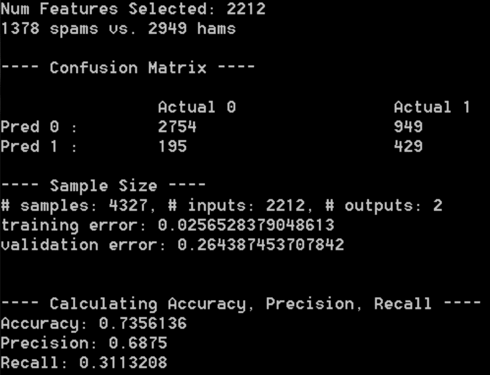

在下一节讨论模型验证方法时，我们将更仔细地看看这些数字代表了什么。为了尝试不同的 ML 模型，只需修改代码中的第 68–88 行。您可以用我们之前讨论过的逻辑回归模型代码来替换它们，或者您也可以尝试使用您选择的不同学习算法。

<title>Classification model validations</title> 

# 分类模型验证

在上一节中，我们使用 Accord.NET 框架用 C#构建了我们的第一个 ML 模型。然而，我们还没有完全完成。如果我们更仔细地观察前面的控制台输出，有一件事非常令人担忧。训练误差在 0.03 左右，但验证误差在 0.26 左右。这意味着我们的分类模型在训练集中正确预测了 100 次中的 87 次，但是在验证或测试集中的模型预测在 100 次中只有 74 次是正确的。这是一个典型的过度拟合的例子，其中模型与训练集如此接近，以至于它对不可预见的数据集的预测是不可靠和不可预测的。如果我们将该模型应用于生产垃圾邮件过滤系统，那么该模型在过滤垃圾邮件时的实际性能将是不可靠的，并且与我们在训练集中看到的不同。

过度拟合通常是因为模型对于给定的数据集来说太复杂，或者用于拟合模型的参数太多。我们在上一节中构建的朴素贝叶斯分类器模型的过度拟合问题很可能是由于我们用于训练模型的特征的复杂性和数量。如果您再次查看上一节末尾的控制台输出，您可以看到用于训练我们的朴素贝叶斯模型的特征数是 2，212。考虑到我们的样本集中只有大约 4，200 条电子邮件记录，并且其中只有大约三分之二(或大约 3，000 条记录)用于训练我们的模型，这是太多的特征了(这是因为我们使用了三重交叉验证，并且在每次迭代中只有这三重中的两重用作训练集)。为了解决这个过度拟合的问题，我们必须减少用于训练模型的特征数量。为了做到这一点，我们可以过滤掉那些不常出现的术语。完成此操作的代码位于上一节完整代码的第 48–53 行，如下所示:

```
// Change number of features to reduce overfitting
int minNumOccurrences = 1;
string[] wordFeatures = indexedSpamTermFrequencyDF.Where(
    x => x.Value.GetAs<int>("num_occurences") >= minNumOccurrences
).RowKeys.ToArray();
Console.WriteLine("Num Features Selected: {0}", wordFeatures.Count());
```

从这段代码中可以看出，我们在上一节中构建的朴素贝叶斯分类器模型使用了垃圾邮件中至少出现过一次的所有单词。如果你看看垃圾邮件中的词频，大约有 1400 个词只出现一次(看看在数据分析步骤中创建的`spam-frequencies.csv`文件)。直观上，那些出现次数少的单词只会产生噪音，而不会给我们的模型带来太多的信息。这直接告诉我们，当我们在上一节中最初构建分类模型时，我们的模型会暴露于多少噪声。

现在我们知道了这个过度拟合问题的原因，让我们来修复它。让我们尝试使用不同的阈值来选择特性。我们尝试了 5、10、15、20 和 25 作为垃圾邮件中的最小出现次数(也就是说，我们将`minNumOccurrences`设置为 5、10、15 等等)，并用这些阈值训练朴素贝叶斯分类器。

首先，最少出现五次的朴素贝叶斯分类器结果如下所示:


最少出现 10 次的朴素贝叶斯分类器结果如下所示:


最少出现 15 次的朴素贝叶斯分类器结果如下所示:


最后，最少出现 20 次的朴素贝叶斯分类器结果如下所示:

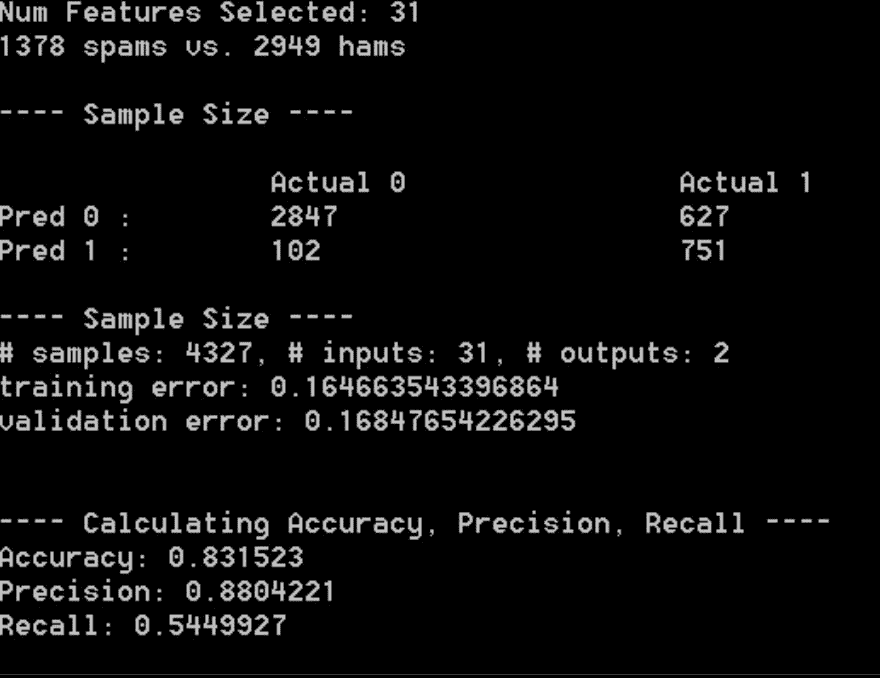

从这些实验结果中可以看出，随着我们增加单词出现的最小数量并相应减少用于训练模型的特征数量，`training error`和`validation error`之间的差距减小，训练错误开始看起来更类似于验证错误。随着我们解决过度拟合问题，我们可以对模型在不可预见的数据和生产系统中的表现更有信心。我们用逻辑回归分类模型运行了相同的实验，结果与我们用朴素贝叶斯分类器发现的结果相似。逻辑回归模型的实验结果显示在以下输出中。

首先，最少出现五次的逻辑回归分类器结果如下所示:


最少出现十次的逻辑回归分类器结果如下所示:


最少出现 15 次的逻辑回归分类器结果如下所示:

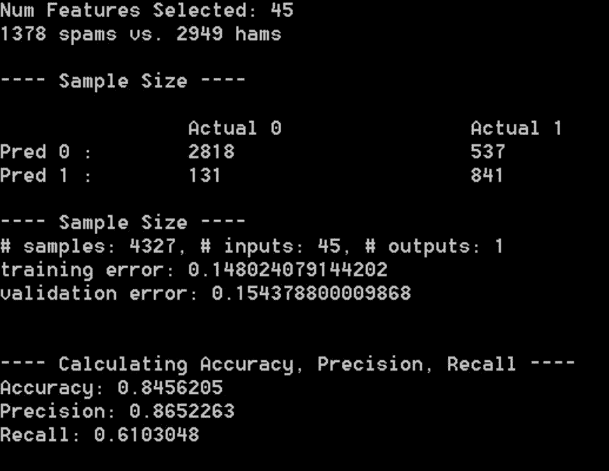

最少出现 20 次的逻辑回归分类器结果如下所示:

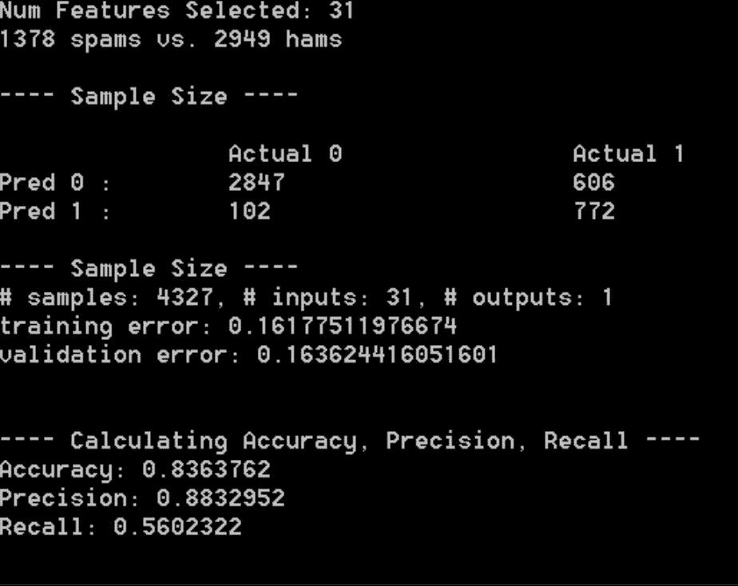

既然我们已经介绍了如何处理过度拟合问题，我们还想了解一些模型性能指标:

*   **混淆矩阵**:混淆矩阵是告诉我们一个预测模型的整体性能的表格。每一列代表每个实际类别，每一行代表每个预测类别。在二进制分类问题的情况下，混淆矩阵将是 2×2 矩阵，其中第一行代表否定预测，第二行代表肯定预测。第一列代表实际的负值，第二列代表实际的正值。下表说明了二元分类问题的混淆矩阵中的每个单元所代表的含义:

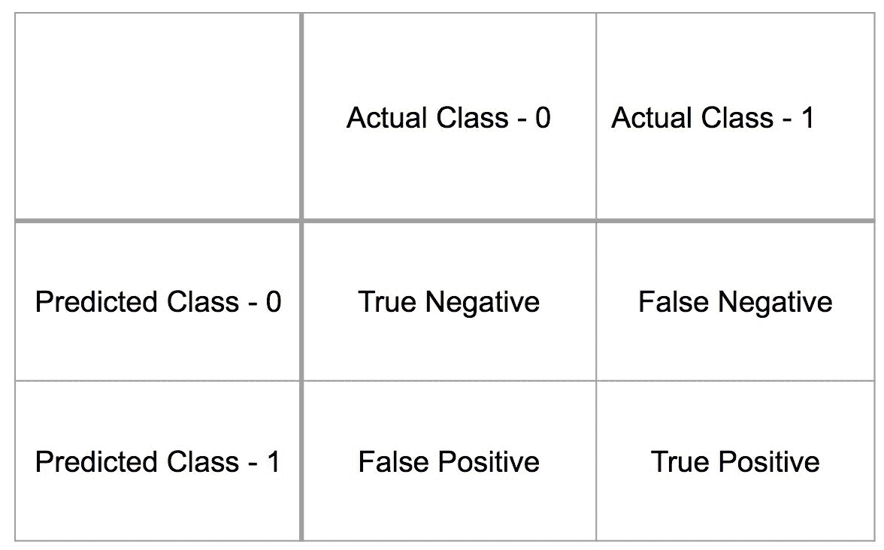

*   **真负** ( **TN** )是模型正确预测 0 类的时候；**假阴性** ( **FN** )是模型预测为 **0** 而实际类为 **1** 时；**假阳性** ( **FP** )是当模型预测为类 **1** ，而实际类为 **0** 时；而**真正** ( **TP** )是模型正确预测类 **1** 的时候。从表中可以看出，混淆矩阵描述了整个模型的性能。在我们的示例中，如果我们查看前面屏幕截图中的最后一个控制台输出，其中显示了我们的逻辑回归分类模型的控制台输出，我们可以看到，TNs 的数量是`2847`，FNs 的数量是`606`，FPs 的数量是`102`，TP 的数量是`772`。有了这些信息，我们可以进一步计算出**真阳性率**(**TPR**)**真阴性率**(**TNR**)**假阳性率**(**FPR**)**假阴性率** ( **FNR** )，如下所示:

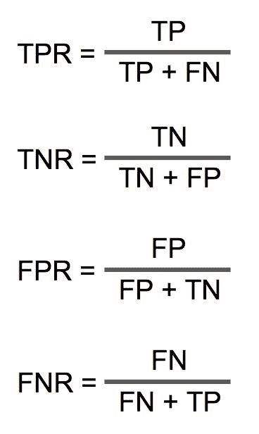

使用前面的例子，我们的例子中的真实阳性率是 0.56，TNR 是 0.97，FPR 是 0.03，FNR 是 0.44。

*   **准确率**:准确率是正确预测的比例。使用前面示例混淆矩阵中的相同符号，精度可以计算如下:


准确性是一个经常使用的模型性能指标，但有时它并不能很好地代表整体模型性能。例如，如果样本集在很大程度上是不平衡的，并且如果，比方说，在我们的样本集中有五封垃圾邮件和 95 封垃圾邮件，那么一个将每封邮件分类为垃圾邮件的简单分类器必须达到 95%的准确率。然而，它永远不会捕捉垃圾邮件。这就是为什么我们需要查看混淆矩阵和其他性能指标，如精确度和召回率:

*   **精确率**:精确率是正确的正预测数占正预测总数的比例。使用与前面相同的符号，我们可以计算精确率如下:


如果您查看我们的逻辑回归分类模型结果的前一个屏幕截图中的最后一个控制台输出，精确率是通过将混淆矩阵中的 TPs 数量 772 除以混淆矩阵中的 TPs 数量 772 和 FPs 数量 102 之和来计算的，结果是 0.88。

*   **召回率**:召回率是正确正面预测的数量占实际正面案例总数的比例。这是一种告诉我们这个模型检索到多少实际阳性病例的方式。使用与前面相同的符号，我们可以如下计算召回率:

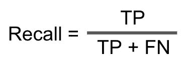

如果您查看前面的逻辑回归分类模式结果的屏幕截图中的最后一个控制台输出，召回率是通过将混淆矩阵中的 TPs 数量 772 除以混淆矩阵中的 TPs 数量 772 和 FNs 数量 606 之和来计算的，结果是 0.56。

根据这些性能指标，选择最佳模型是数据科学家的职责。在准确率和召回率之间总会有一个权衡。准确率比其他模型高的模型，召回率会比较低。就我们的垃圾邮件过滤问题而言，如果您认为正确过滤垃圾邮件更重要，并且您可以牺牲一些通过用户收件箱的垃圾邮件，那么您可能需要优化精确度。另一方面，如果你认为过滤掉尽可能多的垃圾邮件更重要，即使你可能最终也会过滤掉一些非垃圾邮件，那么你可能需要优化召回。选择正确的模型并不是一个容易的决定，仔细考虑需求和成功标准对于做出正确的选择是至关重要的。

总之，下面是我们可以用来根据交叉验证结果和混淆矩阵计算性能指标的代码:

*   **训练与验证(测试)误差**:用于识别过度拟合问题(第 48-52 行):

```
// Run Cross-Validation
var result = cvNaiveBayesClassifier.Learn(input, output);

// Training Error vs. Test Error
double trainingError = result.Training.Mean;
double validationError = result.Validation.Mean;
```

*   **混淆矩阵**:真阳性对假阳性，真阴性对假阴性(第 95-108 行):

```
// Confusion Matrix
GeneralConfusionMatrix gcm = result.ToConfusionMatrix(input, output);

float truePositive = (float)gcm.Matrix[1, 1];
float trueNegative = (float)gcm.Matrix[0, 0];
float falsePositive = (float)gcm.Matrix[1, 0];
float falseNegative = (float)gcm.Matrix[0, 1];
```

*   **准确度对精确度对召回率**:用于衡量 ML 模型的正确性(第 122-130 行):

```
// Accuracy vs. Precision vs. Recall
float accuracy = (truePositive + trueNegative) / numberOfSamples;
float precision = truePositive / (truePositive + falsePositive);
float recall = truePositive / (truePositive + falseNegative);
```

<title>Summary</title> 

# 摘要

在这一章中，我们用 C#建立了第一个 ML 模型，可以用来过滤垃圾邮件。我们首先定义并清楚地陈述了我们试图解决的问题以及成功的标准。然后，我们从原始电子邮件数据中提取相关信息，并将其转换为可用于数据分析、特征工程和 ML 模型构建步骤的格式。在数据分析步骤中，我们学习了如何应用一键编码，并构建了主题行中使用的单词的矩阵表示。我们还从我们的数据分析过程中发现了一个数据问题，并了解了我们如何经常在数据准备和分析步骤之间来回迭代。然后，我们进一步改进了我们的特征集，过滤掉停用词，并使用一个`regex`按非字母数字或非字母单词进行拆分。有了这个功能集，我们使用逻辑回归和朴素贝叶斯分类器算法构建了我们的第一个分类模型，简要介绍了过度拟合的危险，并学习了如何通过查看准确度、精确度和召回率来评估和比较模型性能。最后，我们还了解了精确度和召回率之间的权衡，以及如何根据这些指标和业务需求选择模型。

在下一章中，我们将进一步扩展使用文本数据集构建分类模型的知识和技能。我们将通过使用 Twitter 情感数据开始查看一个数据集，其中我们有两个以上的类。我们将了解二元分类模型和多类分类模型之间的区别。我们还将讨论用于特征工程的一些其他 NLP 技术，以及如何使用随机森林算法建立多类分类模型。