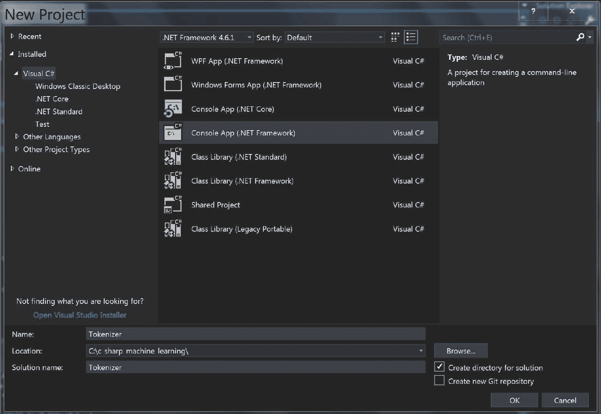
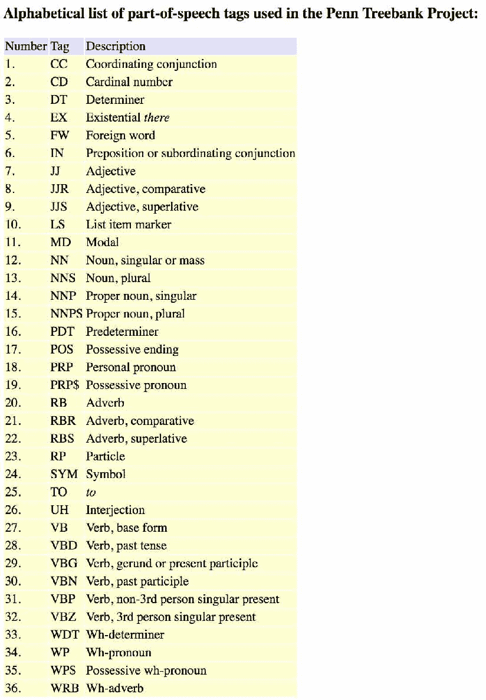

# 推特情感分析

在这一章中，我们将扩展我们在 C#中构建分类模型的知识。除了我们在前一章中使用的两个包 Accord.NET 和迪德尔，我们将开始使用斯坦福 CoreNLP 包来应用更高级的自然语言处理技术，如标记化、**词性标注和词汇化。使用这些包，我们本章的目标是建立一个多类分类模型，预测推文的情绪。我们将使用一个原始的 Twitter 数据集，它不仅包含单词，还包含表情符号，并将使用它来训练一个用于情绪预测的**机器学习** ( **ML** )模型。我们将遵循构建 ML 模型时所遵循的相同步骤。我们将从问题定义开始，然后是数据准备和分析、特征工程、模型开发和验证。在我们的特征工程步骤中，我们将扩展我们的 NLP 技术知识，并探索我们如何应用标记化、词性标注和词条化来构建更高级的文本特征。在模型构建步骤中，我们将探索一种新的分类算法，随机森林分类器，并将其性能与朴素贝叶斯分类器进行比较。最后，在我们的模型验证步骤中，我们将扩展我们在前一章中涉及的混淆矩阵、精度和召回的知识，并讨论什么是**接收器工作特性** ( **ROC** )曲线和曲线** ( **AUC** )下的**面积，以及如何使用这些概念来评估我们的 ML 模型。**

在本章中，我们将介绍以下内容:

*   使用 Stanford CoreNLP 软件包设置环境
*   Twitter 情绪分析项目的问题定义
*   使用斯坦福 CoreNLP 进行数据准备
*   使用引理作为表示的数据分析
*   使用词汇化和表情符号的特征工程
*   朴素贝叶斯与随机森林
*   使用 ROC 曲线和 AUC 指标进行模型验证


# 设置环境

在我们开始我们的 Twitter 情绪分析项目之前，让我们用斯坦福 CoreNLP 包来设置我们的开发环境，我们将在本章中使用这个包。Standford CoreNLP 软件包需要多个步骤来为您的环境做好准备，因此最好完成以下步骤:

1.  第一步是创建一个新的控制台应用程序。NET Framework)项目。确保您使用的. NET Framework 版本高于或等于 4.6.1。如果您安装了旧版本，请转到[https://docs . Microsoft . com/en-us/dot net/framework/install/guide-for-developers](https://docs.microsoft.com/en-us/dotnet/framework/install/guide-for-developers)并遵循安装指南。下面是项目设置页面的屏幕截图(注意，您可以选择您的。顶栏中的. NET Framework 版本):



2.  现在，让我们安装斯坦福 CoreNLP 软件包。您可以在软件包管理器控制台中键入以下命令:

```
Install-Package Stanford.NLP.CoreNLP
```

本章我们要用的版本是`Stanford.NLP.CoreNLP` 3.9.1。随着时间的推移，版本可能会发生变化，您可能需要更新您的安装。

3.  我们只需要再做一件事，我们的环境就可以开始使用这个包了。我们需要安装 CoreNLP models JAR，它包含各种用于解析、词性标注、**命名实体识别**(**)和其他一些工具的模型。点击这个链接下载并解压斯坦福 CoreNLP:[https://stanfordnlp.github.io/CoreNLP/](https://stanfordnlp.github.io/CoreNLP/)。一旦你下载并解压后，你会看到里面有多个文件。感兴趣的特定文件是`stanford-corenlp-<version-number>-models.jar`。我们需要将 jar 文件的内容提取到一个目录中，这样我们就可以加载 C#项目中的所有模型文件。您可以使用以下命令从`stanford-corenlp-<version-number>-models.jar`中提取内容:** 

```
jar xf stanford-corenlp-<version-number>-models.jar 
```

当您从 models jar 文件中提取完所有的模型文件后，您就可以开始在您的 C#项目中使用 Stanford CoreNLP 包了。

现在，让我们检查一下我们的安装是否成功。下面的代码是对这个例子([https://sergey-tihon.github.io/Stanford.)的轻微修改 NLP.NET/StanfordCoreNLP.html](https://sergey-tihon.github.io/Stanford.NLP.NET/StanfordCoreNLP.html)):

```
using System;
using System.IO;
using java.util;
using java.io;
using edu.stanford.nlp.pipeline;
using Console = System.Console;

namespace Tokenizer
{
    class Program
    {
        static void Main()
        {
            // Path to the folder with models extracted from Step #3
            var jarRoot = @"<path-to-your-model-files-dir>";

            // Text for processing
            var text = "We're going to test our CoreNLP installation!!";

            // Annotation pipeline configuration
            var props = new Properties();
            props.setProperty("annotators", "tokenize, ssplit, pos, lemma");
            props.setProperty("ner.useSUTime", "0");

            // We should change current directory, so StanfordCoreNLP could find all the model files automatically
            var curDir = Environment.CurrentDirectory;
            Directory.SetCurrentDirectory(jarRoot);
            var pipeline = new StanfordCoreNLP(props);
            Directory.SetCurrentDirectory(curDir);

            // Annotation
            var annotation = new Annotation(text);
            pipeline.annotate(annotation);

            // Result - Pretty Print
            using (var stream = new ByteArrayOutputStream())
            {
                pipeline.prettyPrint(annotation, new PrintWriter(stream));
                Console.WriteLine(stream.toString());
                stream.close();
            }

            Console.ReadKey();
        }
    }
}
```

如果安装成功，您应该会看到类似以下内容的输出:


让我们仔细看看这个输出。标记是作为单个语义单元分组的字符序列。通常，令牌是*单词*或*术语*。在每个 token 输出中，我们都可以看到原文，比如`We`、`'re`、`going`。`PartOfSpeech`标签指的是每个单词的类别，比如名词、动词和形容词。例如，我们示例中第一个标记`We`的`PartOfSpeech`标签是`PRP`，它代表*人称代词*。我们例子中第二个标记`'re`的`PartOfSpeech`标记是`VBP`，它代表*v*erb，非第三人称单数现在时。POS 标签的完整列表可在此处([http://www . ling . upenn . edu/courses/Fall _ 2003/ling 001/Penn _ tree bank _ POS . html](http://www.ling.upenn.edu/courses/Fall_2003/ling001/penn_treebank_pos.html))或以下截图中找到:



POS 标签列表

最后，我们的标记化示例中的`Lemma`标记引用了给定单词的标准形式。比如`am`和`are`的引理是`be`。在我们的例子中，第三个令牌中的单词`going`的引理是`go`。在接下来的章节中，我们将讨论如何将单词词汇化用于特征工程。


# Twitter 情感分析的问题定义

让我们开始我们的 Twitter 情绪分析项目，明确定义我们将建立什么样的模型以及它们将预测什么。你可能已经听说过术语**情绪分析**。情感分析本质上是一个通过计算确定给定文本表达积极、中性还是消极情感的过程。社交媒体内容的情感分析可以以多种方式使用。例如，营销人员可以使用它来确定营销活动的效果如何，以及它如何影响消费者对某个产品或公司的看法和态度。情绪分析也可以用来预测股市变化。对某家公司的正面消息和聚合正面情绪通常会使其股价向正面方向移动，对给定公司的新闻和社交媒体中的情绪分析可用于预测股价在不久的将来将如何移动。为了试验我们如何建立一个情感分析模型，我们将使用一个预编译和标记的航空公司情感 Twitter 数据集，该数据集最初来自 CrowdFlower 的 Data for Everyone 库(【https://www.figure-eight.com/data-for-everyone/】T2)。然后，我们将应用一些 NLP 技术，特别是单词标记化、词性标注和词汇化，从原始推文数据中构建有意义的文本和表情特征。由于我们希望为每条推文预测三种不同的情绪(积极、中立和消极)，我们将建立一个多类分类模型，并使用不同的学习算法进行实验——朴素贝叶斯和随机森林。一旦我们建立了情感分析模型，我们将主要通过这三个指标来评估性能:精确度、召回率和 AUC。

让我们总结一下 Twitter 情绪分析项目的问题定义:

*   有什么问题？我们需要一个 Twitter 情绪分析模型来计算识别推文中的情绪。
*   为什么会有问题？识别和测量用户或消费者对某个主题(如产品、公司、广告等)的情绪通常是测量某些任务的影响和成功的必要工具。
*   解决这个问题的方法有哪些？我们将使用斯坦福 CoreNLP 包来应用各种 NLP 技术，如标记化、词性标注和词条化，以从原始 Twitter 数据集构建有意义的特征。有了这些功能，我们将尝试不同的学习算法来建立一个情感分析模型。我们将使用精确度、召回率和 AUC 来评估模型的性能。
*   成功的标准是什么？我们想要高准确率，但不要牺牲太多召回率，因为将一条推文正确分类到三个情绪桶(积极、中性和消极)中的一个比更高的检索率更重要。此外，我们需要一个高的 AUC 数，我们将在本章的后面部分更详细地讨论这一点。


# 使用斯坦福 CoreNLP 进行数据准备

现在我们知道了本章的目标，是时候深入研究数据了。与上一章类似，我们将使用预编译和预标记的 Twitter 情感数据。我们将使用来自 crowd flower ' s Data for every one library([https://www.figure-eight.com/data-for-everyone/](https://www.figure-eight.com/data-for-everyone/))的数据集，你可以从这个链接下载数据:[https://www . ka ggle . com/crowd flower/Twitter-airline-sensation](https://www.kaggle.com/crowdflower/twitter-airline-sentiment)。我们这里有大约 15000 条关于美国航空公司的推文。这些 Twitter 数据是从 2015 年 2 月收集的，然后被分为三个类别——积极、消极和中立。该链接为您提供了两种类型的数据:CSV 文件和 SQLite 数据库。我们将在这个项目中使用 CSV 文件。

一旦您下载了这些数据，我们需要为我们未来的分析和模型构建做好准备。数据集中感兴趣的两列是`airline_sentiment`和`text`。`airline_sentiment`列包含关于情绪的信息——一条推文是正面的、负面的还是中性的——而`text`列包含原始的 Twitter 文本。为了使这些原始数据随时可用于我们未来的数据分析和模型构建步骤，我们需要执行以下任务:

*   **清理不必要的文本**:很难证明文本的某些部分为我们的模型提供了许多见解和信息，例如 URL、用户 id 和原始数据。因此，准备原始数据的第一步是清除不包含太多信息的不必要的文本。在这个例子中，我们删除了 hashtags 中的 URL、Twitter 用户 id、数字和散列符号。我们使用`Regex`用空字符串替换这样的文本。下面的代码演示了我们用来过滤掉这些文本的`Regex`表达式:

```
// 1\. Remove URL's
string urlPattern = @"https?:\/\/\S+\b|www\.(\w+\.)+\S*";
Regex rgx = new Regex(urlPattern);
tweet = rgx.Replace(tweet, "");

// 2\. Remove Twitter ID's
string userIDPattern = @"@\w+";
rgx = new Regex(userIDPattern);
tweet = rgx.Replace(tweet, "");

// 3\. Remove Numbers
string numberPattern = @"[-+]?[.\d]*[\d]+[:,.\d]*";
tweet = Regex.Replace(tweet, numberPattern, "");

// 4\. Replace Hashtag
string hashtagPattern = @"#";
tweet = Regex.Replace(tweet, hashtagPattern, "");
```

从这段代码中可以看出，有两种方法可以替换与`Regex`模式匹配的字符串。您可以实例化一个`Regex`对象，然后用另一个字符串替换匹配的字符串，如前两种情况所示。出于同样的目的，您也可以直接调用静态的`Regex.Replace`方法，如最后两种情况所示。每次您调用`Regex.Replace`方法时，静态方法都会创建一个`Regex`对象，所以如果您在多个地方使用相同的模式，那么使用第一种方法会更好:

*   **将相似的表情符号分组并编码在一起**:表情符号，如笑脸和悲伤的脸，经常在推文中使用，并提供关于每条推文情绪的有用见解。直觉上，一个用户会使用笑脸表情来发关于积极事件的微博，而另一个用户会使用悲伤表情来发关于消极事件的微博。然而，不同的笑脸表现出相似的积极情绪，可以组合在一起。例如，一个带括号`:)`的笑脸与另一个带大写字母`D`、`:D`的笑脸含义相同。因此，我们希望将这些相似的表情分组在一起，并将它们编码为一个组，而不是将它们放在单独的组中。我们将使用 Romain Paulus 和 Jeffrey Pennington 分享的 R 代码([https://NLP . Stanford . edu/projects/glove/preprocess-twitter . Rb](https://nlp.stanford.edu/projects/glove/preprocess-twitter.rb))，将其翻译成 C#，然后应用于我们的原始 Twitter 数据集。下面是我们如何把 R 写的表情符号`Regex`代码翻译成 C#的，这样我们就可以把相似的表情符号分组编码在一起了:

```
// 1\. Replace Smiley Faces
string smileyFacePattern = String.Format(@"{0}{1}[)dD]+|[)dD]+{1}{0}", eyesPattern, nosePattern);
tweet = Regex.Replace(tweet, smileyFacePattern, " emo_smiley ");

// 2\. Replace LOL Faces
string lolFacePattern = String.Format(@"{0}{1}[pP]+", eyesPattern, nosePattern);
tweet = Regex.Replace(tweet, lolFacePattern, " emo_lol ");

// 3\. Replace Sad Faces
string sadFacePattern = String.Format(@"{0}{1}\(+|\)+{1}{0}", eyesPattern, nosePattern);
tweet = Regex.Replace(tweet, sadFacePattern, " emo_sad ");

// 4\. Replace Neutral Faces
string neutralFacePattern = String.Format(@"{0}{1}[\/|l*]", eyesPattern, nosePattern);
tweet = Regex.Replace(tweet, neutralFacePattern, " emo_neutral ");

// 5\. Replace Heart
string heartPattern = "<3";
tweet = Regex.Replace(tweet, heartPattern, " emo_heart ");
```

*   **将其他有用的表情分组并编码在一起**:最后，还有一些表情可以帮助我们的模型检测推文的情绪。重复的标点符号，如`!!!`和`???`，以及拉长的单词，如`wayyyy`和`soooo`，可以提供一些关于推文情绪的额外信息。我们将对它们分别进行分组和编码，以便我们的模型可以从这样的表达式中学习。下面的代码显示了我们如何对这样的表达式进行编码:

```
// 1\. Replace Punctuation Repeat
string repeatedPunctuationPattern = @"([!?.]){2,}";
tweet = Regex.Replace(tweet, repeatedPunctuationPattern, " $1_repeat ");

// 2\. Replace Elongated Words (i.e. wayyyy -> way_emphasized)
string elongatedWordsPattern = @"\b(\S*?)(.)\2{2,}\b";
tweet = Regex.Replace(tweet, elongatedWordsPattern, " $1$2_emphasized ");
```

如代码所示，对于重复的标点符号，我们在字符串后面附加了一个后缀`_repeat`。比如`!!!`会变成`!_repeat`，`???`会变成`?_repeat`。对于加长的单词，我们添加了一个带有后缀`_emphasized`的字符串。比如`wayyyy`会变成`way_emphasized`，`soooo`会变成`so_emphasized`。

获取原始数据集、如前所述处理单个 Twitter 文本并将处理后的 Twitter 文本导出到另一个数据文件的完整代码可以在这个存储库中找到:[https://github . com/Yoon hwang/c-sharp-machine-learning/blob/master/ch . 3/data processor . cs](https://github.com/yoonhwang/c-sharp-machine-learning/blob/master/ch.3/DataProcessor.cs)。让我们简单地浏览一下代码。它首先将原始的`Tweets.csv`数据集读入 Deedle 数据帧(第 76–82 行)。然后，它调用一个名为`FormatTweets`的方法，该方法具有一个包含所有原始 Twitter 文本的列系列。第 56–65 行中的`FormatTweets`方法代码如下所示:

```
private static string[] FormatTweets(Series<int, string> rows)
{
    var cleanTweets = rows.GetAllValues().Select((x, i) =>
    {
        string tweet = x.Value;
        return CleanTweet(tweet);
    });

    return cleanTweets.ToArray();
}
```

这个`FormatTweets` 方法遍历序列中的每个元素，即原始 tweets，并调用`CleanTweet`方法。在`CleanTweet`方法中，每条原始 tweet 都按照我们之前定义的所有`Regex`模式运行，然后按照之前讨论的方式进行处理。第 11–54 行中的`CleanTweet`方法如下所示:

```
private static string CleanTweet(string rawTweet)
{
      string eyesPattern = @"[8:=;]";
      string nosePattern = @"['`\-]?";

      string tweet = rawTweet;
      // 1\. Remove URL's
      string urlPattern = @"https?:\/\/\S+\b|www\.(\w+\.)+\S*";
      Regex rgx = new Regex(urlPattern);
      tweet = rgx.Replace(tweet, "");
      // 2\. Remove Twitter ID's
      string userIDPattern = @"@\w+";
      rgx = new Regex(userIDPattern);
      tweet = rgx.Replace(tweet, "");
      // 3\. Replace Smiley Faces
      string smileyFacePattern = String.Format(@"{0}{1}[)dD]+|[)dD]+{1}{0}", eyesPattern, nosePattern);
      tweet = Regex.Replace(tweet, smileyFacePattern, " emo_smiley ");
      // 4\. Replace LOL Faces
      string lolFacePattern = String.Format(@"{0}{1}[pP]+", eyesPattern, nosePattern);
      tweet = Regex.Replace(tweet, lolFacePattern, " emo_lol ");
      // 5\. Replace Sad Faces
      string sadFacePattern = String.Format(@"{0}{1}\(+|\)+{1}{0}", eyesPattern, nosePattern);
      tweet = Regex.Replace(tweet, sadFacePattern, " emo_sad ");
      // 6\. Replace Neutral Faces
      string neutralFacePattern = String.Format(@"{0}{1}[\/|l*]", eyesPattern, nosePattern);
      tweet = Regex.Replace(tweet, neutralFacePattern, " emo_neutral ");
      // 7\. Replace Heart
      string heartPattern = "<3";
      tweet = Regex.Replace(tweet, heartPattern, " emo_heart ");
      // 8\. Replace Punctuation Repeat
      string repeatedPunctuationPattern = @"([!?.]){2,}";
      tweet = Regex.Replace(tweet, repeatedPunctuationPattern, " $1_repeat ");
      // 9\. Replace Elongated Words (i.e. wayyyy -> way_emphasized)
      string elongatedWordsPattern = @"\b(\S*?)(.)\2{2,}\b";
      tweet = Regex.Replace(tweet, elongatedWordsPattern, " $1$2_emphasized ");
      // 10\. Replace Numbers
      string numberPattern = @"[-+]?[.\d]*[\d]+[:,.\d]*";
      tweet = Regex.Replace(tweet, numberPattern, "");
      // 11\. Replace Hashtag
      string hashtagPattern = @"#";
      tweet = Regex.Replace(tweet, hashtagPattern, "");

      return tweet;
}
```

一旦所有的原始 Twitter tweets 都被清理和处理，结果将作为一个单独的列添加到原始 Deedle 数据框中，列名为`tweet`。以下代码(第 89 行)显示了如何将字符串数组添加到数据框中:

```
rawDF.AddColumn("tweet", processedTweets);
```

一旦你走到这一步，我们需要做的唯一额外的步骤就是导出处理过的数据。使用 Deedle data frame 的`SaveCsv`方法，您可以轻松地将数据帧导出为 CSV 文件。以下代码显示了我们如何将处理后的数据导出到 CSV 文件中:

```
rawDF.SaveCsv(Path.Combine(dataDirPath, "processed-training.csv"));
```

现在我们有了干净的 Twitter 文本，让我们标记并创建一个 tweets 的矩阵表示。类似于我们在[第 2 章](part0028.html#QMFO0-5ebdf09927b7492888e31e8436526470)、*垃圾邮件过滤*中所做的，我们将把一个字符串分解成单词。然而，我们将使用在本章前一节中安装的 Stanford CoreNLP 包，并利用我们在前一节中编写的示例代码。对 tweets 进行符号化并构建其矩阵表示的代码如下:

```
private static Frame<int, string> CreateWordVec(Series<int, string> rows, ISet<string> stopWords, bool useLemma=false)
        {
            // Path to the folder with models extracted from `stanford-corenlp-<version>-models.jar`
            var jarRoot = @"<path-to-model-files-dir>";

            // Annotation pipeline configuration
            var props = new Properties();
            props.setProperty("annotators", "tokenize, ssplit, pos, lemma");
            props.setProperty("ner.useSUTime", "0");

            // We should change current directory, so StanfordCoreNLP could find all the model files automatically
            var curDir = Environment.CurrentDirectory;
            Directory.SetCurrentDirectory(jarRoot);
            var pipeline = new StanfordCoreNLP(props);
            Directory.SetCurrentDirectory(curDir);

            var wordsByRows = rows.GetAllValues().Select((x, i) =>
            {
                var sb = new SeriesBuilder<string, int>();

                // Annotation
                var annotation = new Annotation(x.Value);
                pipeline.annotate(annotation);

                var tokens = annotation.get(typeof(CoreAnnotations.TokensAnnotation));
                ISet<string> terms = new HashSet<string>();

                foreach (CoreLabel token in tokens as ArrayList)
                {
                    string lemma = token.lemma().ToLower();
                    string word = token.word().ToLower();
                    string tag = token.tag();
                    //Console.WriteLine("lemma: {0}, word: {1}, tag: {2}", lemma, word, tag);

                    // Filter out stop words and single-character words
                    if (!stopWords.Contains(lemma) && word.Length > 1)
                    {
                        if (!useLemma)
                        {
                            terms.Add(word);
                        }
                        else
                        {
                            terms.Add(lemma);
                        }
                    }
                }

                foreach (string term in terms)
                {
                    sb.Add(term, 1);
                }

                return KeyValue.Create(i, sb.Series);
            });

            // Create a data frame from the rows we just created
            // And encode missing values with 0
            var wordVecDF = Frame.FromRows(wordsByRows).FillMissing(0);

            return wordVecDF;
        }
```

从代码中可以看出，这段代码与上一节中的示例代码的主要区别在于，这段代码遍历每条 tweet，并将令牌存储到 Deedle 的数据帧中。正如在[第 2 章](part0028.html#QMFO0-5ebdf09927b7492888e31e8436526470)、*垃圾邮件过滤、*中一样，我们使用一键编码来分配矩阵中每个术语的值(0 对 1)。这里需要注意的一点是，我们如何选择用词条或单词创建矩阵。单词是从每条推文中分解出来的原始未触及的术语。例如，如果使用单词作为标记，字符串`I am a data scientist`将被分解为`I`、`am`、`a`、`data`和`scientist`。词条是每个单词的标准形式。比如同一个字符串`I am a data scientist`，如果用 lemmas 做记号，会分解成`I`、`be`、`a`、`data`和`scientist`。注意`be`是`am`的引理。我们将在*特征工程使用词条化和表情符号*部分讨论什么是词条，什么是词条化。

可以在这里找到 tokenize 和创建 tweets 矩阵表示的完整代码:[https://github . com/Yoon hwang/c-sharp-machine-learning/blob/master/ch . 3/twittertokenizer . cs](https://github.com/yoonhwang/c-sharp-machine-learning/blob/master/ch.3/TwitterTokenizer.cs)。这段代码中有一些需要注意的地方。首先，让我们看看它是如何计算每种情绪有多少样本的。以下代码片段(第 122-127 行)显示了我们如何计算每个情感的样本数量:

```
// Look at the sentiment distributions in our sample set
var sampleSetDistribution = rawDF.GetColumn<string>(
    "airline_sentiment"
).GroupBy<string>(x => x.Value).Select(x => x.Value.KeyCount);
sampleSetDistribution.Print();
```

从这段代码中可以看出，我们首先获得情感列`airline_sentiment`，并根据值对其进行分组，其中的值可以是`neutral`、`negative`或`positive`。然后，它计算出现的次数并返回计数。

TwitterTokenizer 代码中要注意的第二件事是我们如何用整数值对情感进行编码。以下是您在完整代码的第 149–154 行中看到的内容:

```
tweetLemmaVecDF.AddColumn(
    "tweet_polarity", 
    rawDF.GetColumn<string>("airline_sentiment").Select(
        x => x.Value == "neutral" ? 0 : x.Value == "positive" ? 1 : 2
    )
);
tweet_polarity, to the term matrix data frame. We are taking the values of the airline_sentiment column and encoding 0 for neutral, 1 for positive, and 2 for negative. We are going to use this newly added column in our future model building steps.
```

最后，请注意我们是如何调用了两次`CreateWordVec`方法的——一次没有术语化(第 135-144 行),一次有术语化(第 147-156 行)。如果我们创建一个没有词汇化的一键编码的词矩阵，我们实际上是把所有的词作为词矩阵中的单独的记号。可以想象，这将创建一个比用 lemmatization 更大更稀疏的矩阵。我们将两个代码都留在那里，供您探索这两个选项。你可以尝试用一个以单词为列的矩阵来构建 ML 模型，并与那些以词条为列的模型进行比较。在这一章中，我们将使用带引理的矩阵来代替单词。

当您运行这段代码时，它将输出一个条形图，显示样本集中的情感分布。正如你在下面的图表中看到的，在我们的样本集中，我们有大约 3000 条中立的推文，2000 条正面的推文，和 9000 条负面的推文。该图表如下所示:


# 使用引理作为表示的数据分析

现在是时候查看实际数据，寻找术语频率分布的任何模式或差异，以及推文的不同情绪。我们将获取上一步的输出，并获得每种情感的前七个最频繁出现的标记的分布。在这个例子中，我们使用一个带有引理的术语矩阵。请随意对包含单词的术语矩阵进行同样的分析。分析推文每条情绪中使用频率最高的前 N 个 tokens 的代码可以在这里找到:[https://github . com/Yoon hwang/c-sharp-machine-learning/blob/master/ch . 3/data analyzer . cs](https://github.com/yoonhwang/c-sharp-machine-learning/blob/master/ch.3/DataAnalyzer.cs)。

这段代码中有一点需要注意。与上一章不同，我们需要计算三种情绪类别的词频——中性、消极和积极。以下是完整代码的代码片段(第 54-73 行):

```
var neutralTermFrequencies = ColumnWiseSum(
    tweetLemmaDF.Where(
        x => x.Value.GetAs<int>("tweet_polarity") == 0
    ),
    "tweet_polarity"
).Sort().Reversed;

var positiveTermFrequencies = ColumnWiseSum(
    tweetLemmaDF.Where(
        x => x.Value.GetAs<int>("tweet_polarity") == 1
    ),
    "tweet_polarity"
).Sort().Reversed;

var negativeTermFrequencies = ColumnWiseSum(
    tweetLemmaDF.Where(
        x => x.Value.GetAs<int>("tweet_polarity") == 2
    ),
    "tweet_polarity"
).Sort().Reversed;
```

从代码中可以看出，我们为每个情感类调用了`ColumnWiseSum`方法，这个方法的代码如下:

```
private static Series<string, double> ColumnWiseSum(Frame<int, string> frame, string exclude)
{
    var sb = new SeriesBuilder<string, double>();
    foreach(string colname in frame.ColumnKeys)
    {
        double frequency = frame[colname].Sum();
        if (!colname.Equals(exclude))
        {
            sb.Add(colname, frequency);
        }
    }

    return sb.ToSeries();
}
```

从这段代码中可以看出，它遍历每一列或每一项，并对该列中的所有值求和。由于我们使用了一次性编码，一个简单的列式求和将给出每个术语在 Twitter 数据集中的出现次数。一旦我们计算完所有的列求和，我们就将它们作为 Deedle series 对象返回。有了这些结果，我们根据它们的频率对术语进行排序，并将这些信息存储到三个单独的文件中，`neutral-frequencies.csv`、`negative-frequencies.csv`和`positive-frequencies.csv`。在后面的功能工程和模型构建部分，我们将使用频率输出这一术语。

当您运行代码时，它将生成以下图表:


从图表中可以看出，不同情绪之间的分布有一些明显的差异。像**感谢**和**伟大**这样的词是正面推文中出现频率最高的七个词中的两个，而像**延迟**和**取消**这样的词是负面推文中出现频率最高的七个词中的两个。直觉上，这些是有道理的。当你表达对某人或某事的积极感受时，你通常会用**谢谢**和**棒极了**这样的词。另一方面，**延误**和**取消**与航班或航空公司背景下的负面事件有关。也许一些用户的航班被延迟或取消，他们在推特上表达了他们的沮丧。另一个值得注意的有趣的事情是，在正面推文中，`emo_smiley`这个词在最频繁出现的词中排名第七。如果你还记得，在上一步我们将所有的笑脸表情符号(比如`:)`、`:D`等等)分组编码为`emo_smiley`。这告诉我们，表情符号可能对我们的模型学习如何对每条推文的情绪进行分类起着重要作用。现在我们对数据的样子和每种情绪的术语有了一个大致的概念，让我们来谈谈我们将在本章中使用的特征工程技术。


# 使用词汇化和表情符号的特征工程

我们在上一节中简要讨论了引理。让我们更深入地了解一下什么是引理，什么是引理化。根据一个词在句子中的用法和位置，这个词会有不同的形式。例如，单词`like`可以根据之前出现的单词采用`likes`或`liked`的形式。如果我们简单地将句子标记成单词，那么我们的程序会将单词`like`、`likes`和`liked`视为三种不同的标记。然而，这可能不是我们想要的。这三个词有着相同的含义，当我们构建模型时，将这些词组合成我们特征集中的一个标记是很有用的。这就是词汇化的作用。词条是单词的基本形式，词条化是根据每个单词所在的句子部分将每个单词转换成词条。在前面的例子中，`like`是`likes`和`liked`的引理，系统地将`likes`和`liked`转化为`like`是一种引理化。

下面是一个使用斯坦福 CoreNLP 的词汇化示例:


在这里，你可以看到`likes`和`like`都被词条化成了`like`。这是因为这两个词在句子中都被用作动词，动词形式的引理是`like`。让我们看另一个例子:


这里第一个`likes`和第二个`likes`有不同的引理。第一个以`like`为引理，第二个以`likes`为引理。这是因为第一个用作动词，而第二个用作名词。从这些例子中可以看出，根据句子的不同部分，相同单词的引理可能会有所不同。对文本数据集使用词汇化可以极大地降低特征空间的稀疏性和维数，并且可以帮助模型更好地学习，而不会暴露在太多的噪声中。

类似于词汇化，我们也把相似的表情符号归为一组。这是基于相似的表情符号有相似含义的假设。比如`:)`和`:D`的意思几乎一样，如果不是完全一样的话。在另一种情况下，根据用户的不同，冒号和括号的位置会有所不同。一些用户可能会键入`:)`，但是其他一些用户可能会键入`(:`。然而，这两者之间唯一的不同是冒号和括号的位置，它们的意思是一样的。在所有这些情况下，我们希望我们的模型学习相同的情绪，而不产生任何噪音。像我们在上一步中所做的那样，将相似的表情分组到同一个组中，有助于减少我们的模型的不必要的噪音，并帮助他们从这些表情中学习最多。


# 朴素贝叶斯与随机森林

终于是时候训练我们的 ML 模型来预测推文的情绪了。在本节中，我们将尝试使用朴素贝叶斯和随机森林分类器。与前一章相比，我们要做两件不同的事情。首先，我们将样本集分成一个训练集和一个验证集，而不是运行 k-fold 交叉验证。这也是一种经常使用的技术，其中模型只从样本集的子集学习，然后用其余的样本测试和验证它们，这是它们在训练时没有观察到的。这样，我们可以测试模型在不可预见的数据集中的表现，并模拟它们在现实世界中的表现。我们将使用 Accord.NET 包中的`SplitSetValidation`类将我们的样本集分成训练集和验证集，每个集都有预定义的比例，并为训练集配备一个学习算法。

其次，我们的目标变量不再是二进制(0 或 1)，不像前面的[第二章](part0028.html#QMFO0-5ebdf09927b7492888e31e8436526470) *，垃圾邮件过滤*。相反，它可以取 0、1 或 2 中的任何值，其中 0 代表中性情绪推文，1 代表积极情绪推文，2 代表消极情绪推文。所以，我们现在处理的是多类分类问题，而不是二元分类问题。在评估我们的模型时，我们必须采取不同的方法。我们将不得不修改前一章中的准确度、精确度和回忆计算代码，来计算这个项目中三个目标情感类别中每一个的这些数字。此外，当我们查看某些指标(如 ROC 曲线和 AUC，我们将在下一节中讨论)时，我们将不得不使用 one-vs-rest 方法。

让我们首先看看如何在 Accord.NET 框架中用`SplitSetValidation`类实例化我们的学习算法。下面是如何用朴素贝叶斯分类器算法实例化一个`SplitSetValidation` 对象:

```
var nbSplitSet = new SplitSetValidation<NaiveBayes<BernoulliDistribution>, double[]>()
{
    Learner = (s) => new NaiveBayesLearning<BernoulliDistribution>(),

    Loss = (expected, actual, p) => new ZeroOneLoss(expected).Loss(actual),

    Stratify = false,

    TrainingSetProportion = 0.8,

    ValidationSetProportion = 0.2
};
var nbResult = nbSplitSet.Learn(input, output);
SplitSetValidation object—TrainingSetProportionand ValidationSetProportion. As the name suggests, you can define what percentage of your sample set is should be used for training with the TrainingSetProportionparameter and what percentage of your sample set to be used for validation with the ValidationSetProportion parameter. Here in our code snippet, we are telling our program to use 80% of our sample for training and 20% for validation. In the last line of the code snippet, we fit a Naive Bayes classification model to the train set that was split from the sample set. Also, note here that we used BernoulliDistribution for our Naive Bayes classifier, as we used one-hot encoding to encode our features and all of our features have binary values, similar to what we did in the previous chapter.
```

类似于我们如何用朴素贝叶斯分类器实例化一个`SplitSetValidation`对象，您可以用随机森林分类器实例化另一个对象，如下所示:

```
var rfSplitSet = new SplitSetValidation<RandomForest, double[]>()
{
    Learner = (s) => new RandomForestLearning()
    {
        NumberOfTrees = 100, // Change this hyperparameter for further tuning

        CoverageRatio = 0.5, // the proportion of variables that can be used at maximum by each tree

        SampleRatio = 0.7 // the proportion of samples used to train each of the trees

    },

    Loss = (expected, actual, p) => new ZeroOneLoss(expected).Loss(actual),

    Stratify = false,

    TrainingSetProportion = 0.7,

    ValidationSetProportion = 0.3
};
var rfResult = rfSplitSet.Learn(input, output);
```

我们把之前的代码换成了随机森林作为模型，`RandomForestLearning`作为学习算法。如果仔细观察，我们可以为`RandomForestLearning`调整一些超参数。第一个是`NumberOfTrees`。这个超参数让你选择进入你的随机森林的决策树的数量。一般来说，在一个随机森林中有更多的树会导致更好的性能，因为您实际上是在这个森林中构建更多的决策树。然而，性能提升是以训练和预测时间为代价的。随着随机森林中树木数量的增加，训练和预测将花费更多的时间。这里需要注意的另外两个参数是`CoverageRatio` 和`SampleRatio`。`CoverageRatio` 设置特征集在每棵树中使用的比例，而`SampleRatio` 设置训练集在每棵树中使用的比例。具有更高的`CoverageRatio`和`SampleRatio`会提高森林中单个树的性能，但也会增加树之间的相关性。树之间较低的相关性有助于减少泛化误差；因此，在单个树的预测能力和树之间的相关性之间找到一个好的平衡对于建立一个好的随机森林模型是至关重要的。调整和试验这些超参数的各种组合可以帮助您避免过度拟合问题，并在训练随机森林模型时提高模型性能。我们建议您使用这些超参数的各种组合构建多个随机森林分类器，并试验它们对模型性能的影响。

我们用来训练朴素贝叶斯和随机森林分类模型并输出验证结果的完整代码可以在这里找到:[https://github . com/Yoon hwang/c-sharp-machine-learning/blob/master/ch . 3/twittersentimentmodeling . cs](https://github.com/yoonhwang/c-sharp-machine-learning/blob/master/ch.3/TwitterSentimentModeling.cs)。让我们仔细看看这段代码。在第 36-41 行，它首先读入令牌矩阵文件`tweet-lemma.csv`，这是我们在数据准备步骤中构建的。然后在第 43-51 行，我们读入术语频率文件，`positive-frequencies.csv`和`negative-frequencies.csv`，它们是我们在数据分析步骤中构建的。类似于我们在上一章所做的，我们根据第 64 行中出现的术语数量进行特征选择。在这个例子中，我们用 5、10、50、100 和 150 作为样本 tweets 中最少出现次数的阈值。从第 65 行开始，我们遍历这些阈值，并开始训练和评估朴素贝叶斯和随机森林分类器。每次在训练集上对模型进行训练时，都会对训练期间未观察到的验证集运行该模型。

下面是完整代码的一部分(第 113-135 行),它对训练集和验证集运行训练好的朴素贝叶斯模型，以测量样本内和样本外性能:

```
// Get in-sample & out-sample prediction results for NaiveBayes Classifier
var nbTrainedModel = nbResult.Model;

int[] nbTrainSetIDX = nbSplitSet.IndicesTrainingSet;
int[] nbTestSetIDX = nbSplitSet.IndicesValidationSet;

Console.WriteLine("* Train Set Size: {0}, Test Set Size: {1}", nbTrainSetIDX.Length, nbTestSetIDX.Length);

int[] nbTrainPreds = new int[nbTrainSetIDX.Length];
int[] nbTrainActual = new int[nbTrainSetIDX.Length];
for (int i = 0; i < nbTrainPreds.Length; i++)
{
   nbTrainActual[i] = output[nbTrainSetIDX[i]];
   nbTrainPreds[i] = nbTrainedModel.Decide(input[nbTrainSetIDX[i]]);
}

int[] nbTestPreds = new int[nbTestSetIDX.Length];
int[] nbTestActual = new int[nbTestSetIDX.Length];
for (int i = 0; i < nbTestPreds.Length; i++)
{
   nbTestActual[i] = output[nbTestSetIDX[i]];
   nbTestPreds[i] = nbTrainedModel.Decide(input[nbTestSetIDX[i]]);
}
```

下面是完整代码的一部分(第 167-189 行),它在训练集和验证集上运行经过训练的随机森林模型，以测量样本内和样本外性能:

```
// Get in-sample & out-sample prediction results for RandomForest Classifier
var rfTrainedModel = rfResult.Model;

int[] rfTrainSetIDX = rfSplitSet.IndicesTrainingSet;
int[] rfTestSetIDX = rfSplitSet.IndicesValidationSet;

Console.WriteLine("* Train Set Size: {0}, Test Set Size: {1}", rfTrainSetIDX.Length, rfTestSetIDX.Length);

int[] rfTrainPreds = new int[rfTrainSetIDX.Length];
int[] rfTrainActual = new int[rfTrainSetIDX.Length];
for (int i = 0; i < rfTrainPreds.Length; i++)
{
    rfTrainActual[i] = output[rfTrainSetIDX[i]];
    rfTrainPreds[i] = rfTrainedModel.Decide(input[rfTrainSetIDX[i]]);
}

int[] rfTestPreds = new int[rfTestSetIDX.Length];
int[] rfTestActual = new int[rfTestSetIDX.Length];
for (int i = 0; i < rfTestPreds.Length; i++)
{
    rfTestActual[i] = output[rfTestSetIDX[i]];
    rfTestPreds[i] = rfTrainedModel.Decide(input[rfTestSetIDX[i]]);
}
```

让我们仔细看看这些。为了简洁起见，我们将只看一下随机森林模型的情况，因为它对于朴素贝叶斯分类器也是一样的。在第 168 行，我们首先从学习的结果中获得训练的模型。然后，我们从第 170-171 行的`SplitSetValidation`对象中获取样本内(训练集)和样本外(测试/验证集)集合的索引，这样我们就可以遍历每一行或记录并进行预测。我们重复这个过程两次——一次是针对第 175-181 行的样本内训练集，另一次是针对第 183-189 行的样本外验证集。

一旦我们有了训练集和测试集的预测结果，我们就通过一些验证方法运行这些结果(第 138-141 行用于朴素贝叶斯分类器，第 192-196 行用于随机森林分类器)。我们专门为这个项目的模型验证编写了两个方法— `PrintConfusionMatrix`和`DrawROCCurve`。`PrintConfusionMatrix` 是我们在[第二章](part0028.html#QMFO0-5ebdf09927b7492888e31e8436526470)、*垃圾邮件过滤*中的更新版本，它现在打印一个 3×3 的混淆矩阵，而不是 2×2 的混淆矩阵。另一方面，`DrawROCCurve` 方法为本项目引入了一些新概念和新的模型验证方法。让我们在下一节中更详细地讨论我们在这个项目中使用的那些新的评估指标。


# 模型验证 ROC 曲线和 AUC

如前所述，我们在本章中使用了不同的模型验证指标:ROC 曲线和 AUC。ROC 曲线是在不同阈值下真阳性率对假阳性率的图。曲线中的每个点代表对应于某个概率阈值的真阳性和假阳性率对。它通常用于在不同的候选模型中选择最佳和最优的模型。

ROC 曲线下的面积(AUC)衡量模型区分这两类的能力。在二元分类的情况下，AUC 衡量模型区分积极结果和消极结果的程度。由于我们在这个项目中处理的是一个多类分类问题，所以我们使用一个相对于其余部分的方法来构建 ROC 曲线并计算 AUC。例如，一条 ROC 曲线可以将正面推文作为正面结果，将中性和负面推文作为负面结果，而另一条 ROC 曲线可以将中性推文作为正面结果，将正面和负面推文作为负面结果。如下图所示，我们为我们建立的每个模型绘制了三个 ROC 图——一个是中性对静止(正和负)，一个是正对静止(中性和负)，一个是负对静止(中性和正)。AUC 数越高，模型越好，因为它表明模型能够以更好的机会区分阳性类别和阴性类别。

以下图表显示了在 **10** 出现最少术语的朴素贝叶斯分类器的 ROC 曲线:


以下图表显示了在 **50** 时出现次数最少的朴素贝叶斯分类器的 ROC 曲线:


下面的图表显示了在 **150** 出现次数最少的朴素贝叶斯分类器的 ROC 曲线:


正如您从图表中看到的，我们还可以通过查看训练和测试结果曲线之间的差距，从 ROC 图表中检测过度拟合问题。差距越大，模型越过度拟合。如果你看看第一种情况，我们只过滤掉那些在推文中出现不到十次的术语，两条曲线之间的差距很大。随着我们提高阈值，我们可以看到差距缩小。当我们选择最终模型时，我们希望训练 ROC 曲线和测试/验证 ROC 曲线尽可能小。因为这个分辨率是以牺牲模型性能为代价的，所以我们需要为这个折衷找到正确的截止线。

现在让我们来看一个随机森林分类器的例子。以下是拟合随机森林分类器的示例结果:


集成方法，如随机森林，通常适用于分类问题，通过集成更多的树可以提高精度。但是，它们也有一些限制，其中一个限制在前面的随机森林分类器的示例结果中显示过。与所有基于决策树的模型一样，随机森林模型往往会过度拟合，尤其是当它试图从许多分类变量中学习时。从随机森林分类器的 ROC 曲线可以看出，训练和测试 ROC 曲线之间的差距很大，尤其是与朴素贝叶斯分类器的 ROC 曲线相比。具有最小术语出现数阈值 150 的朴素贝叶斯分类器在训练和测试 ROC 曲线之间几乎没有间隙，而具有相同阈值的随机森林分类器在两个 ROC 曲线之间显示出大的间隙。当处理这样的数据集时，其中有许多分类变量，我们需要小心选择哪个模型，并特别注意调整超参数，例如随机森林模型的`NumberOfTrees`、`CoverageRatio`和`SampleRatio`、*、*。


# 摘要

在这一章中，我们为 Twitter 情感分析建立和训练了更高级的分类模型。我们将前一章中所学的知识应用于具有更复杂文本数据的多类分类问题。我们首先使用斯坦福 CoreNLP 包来设置我们的环境，我们在数据准备和分析步骤中使用该包来进行标记化、词性标注和词条化。然后，我们通过对 tweets 进行符号化和词条化，将原始 Twitter 数据集转换成一个一次性编码矩阵。在这个数据准备步骤中，我们还讨论了如何使用 Regex 将相似的表情分组在一起，并从推文中删除不必要的文本，如 URL、Twitter IDs 和原始数字。在我们的数据分析步骤中，我们进一步分析了常用术语和表情符号的分布，我们看到了词汇化和将相似的表情符号分组在一起有助于减少数据集中不必要的噪音。根据前面步骤中的数据和见解，我们尝试使用朴素贝叶斯和随机森林分类器构建多类分类模型。在构建这些模型时，我们介绍了一种常用的模型验证技术，其中我们将样本集分成两个子集，即训练集和验证集，并使用训练集来拟合模型，使用验证集来评估模型性能。我们还介绍了新的模型验证指标，ROC 曲线和 AUC，我们可以使用它们在模型候选中选择最佳和最优的模型。

在下一章，我们将改变思路，开始构建目标变量为连续变量的回归模型。我们将使用外汇汇率数据集来构建时间序列特征，并探索回归问题的其他一些 ML 模型。我们还将讨论评估回归模型的性能与评估分类模型的性能有何不同。**