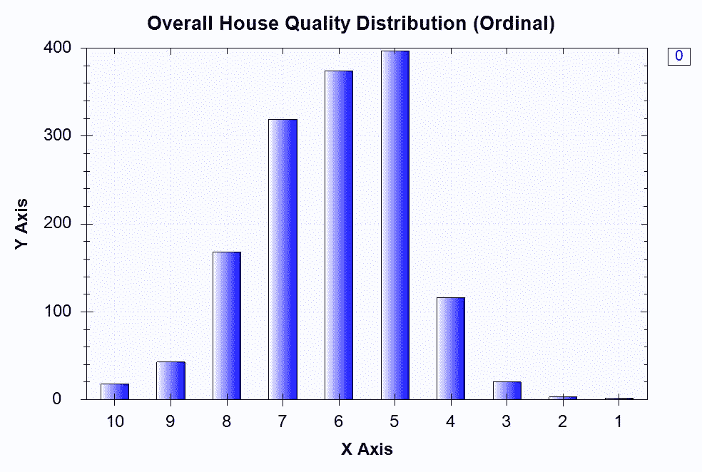
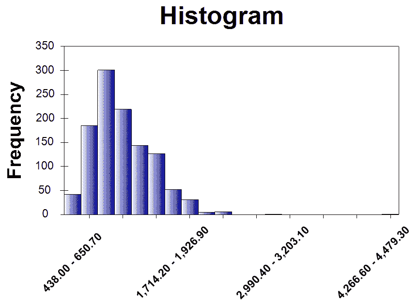
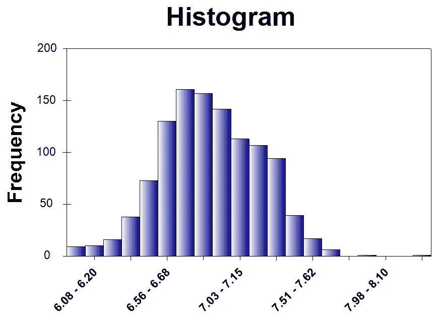
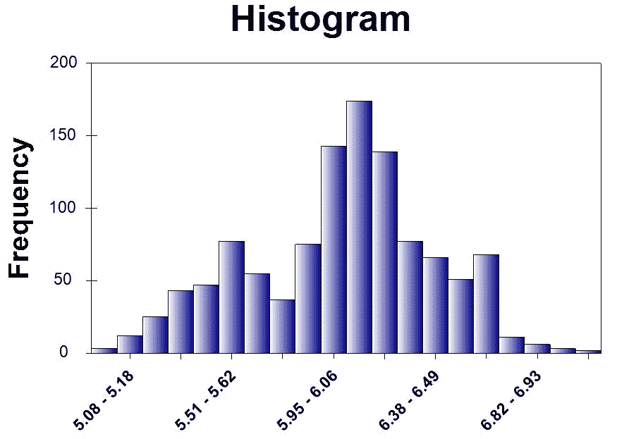
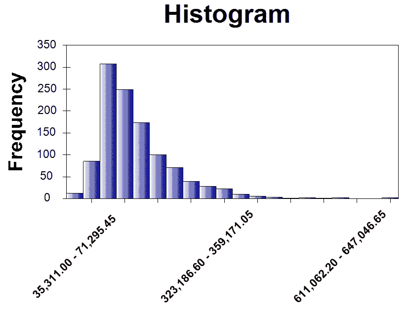
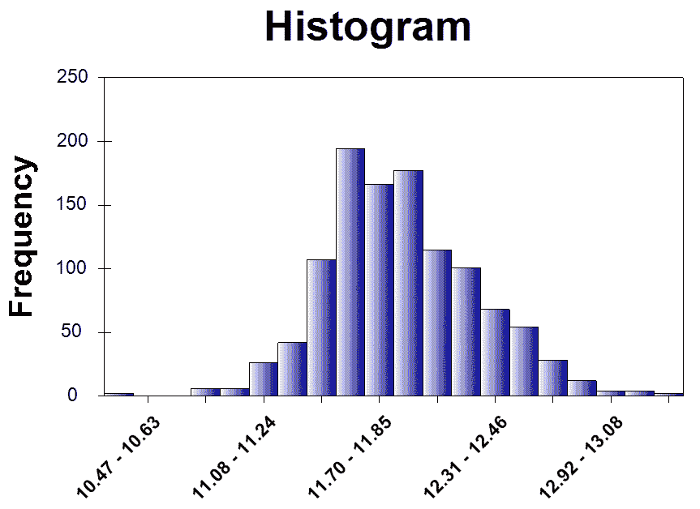
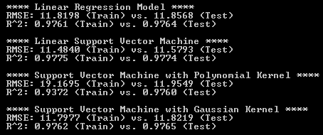
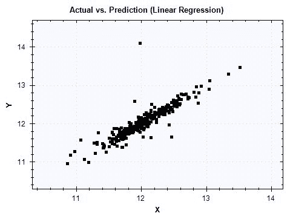
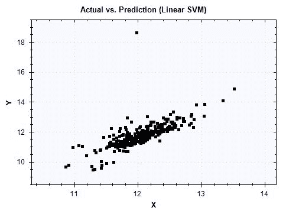

<title>Fair Value of House and Property</title> 

# 房屋和财产的公允价值

在本章中，我们将扩展我们在 C#中构建回归**机器学习** ( **ML** )模型的知识和技能。在最后一章中，我们在外汇汇率数据集上建立了一个线性回归和线性支持向量机模型，其中所有特征都是连续变量。然而，我们将处理一个更复杂的数据集，其中一些特征是分类变量，而另一些是连续变量。

在本章中，我们将使用一个房价数据集，该数据集包含许多具有混合变量类型的房屋属性。使用这些数据，我们将开始研究两种常见类型的分类变量(有序与非有序)以及住房数据集中一些分类变量的分布。我们还将了解数据集中一些连续变量的分布，以及对显示偏态分布的变量使用对数变换的好处。然后，我们将学习如何编码和设计这样的分类特征，以便我们能够适应机器学习模型。与上一章不同的是，我们探索了**支持向量机** ( **SVM** )的基础知识，我们将为我们的 SVM 模型应用不同的内核方法，并看看它如何影响模型性能。

与上一章类似，我们将使用**均方根误差** ( **RMSE** )，R ² ，以及实际值与预测值的关系图来评估我们的 ML 模型的性能。本章结束时，您将更好地理解如何处理分类变量，如何为回归模型编码和设计此类特征，如何应用各种内核方法构建 SVM 模型，以及如何构建预测房屋公允价值的模型。

在本章中，我们将讨论以下主题:

*   房产项目公允价值的问题界定
*   分类变量与连续变量的数据分析
*   特征工程和编码
*   线性回归与带核支持向量机
*   使用 RMSE、R ² 和实际与预测图进行模型验证

<title>Problem definition</title> 

# 问题定义

让我们从准确理解我们将要构建的 ML 模型开始这一章。当你正在寻找一所房子或物业购买，你会考虑这些房子或物业的许多属性，你看。你可能会考虑卧室和浴室的数量、车库可以停放多少辆车、社区、房屋的材料或装修等等。房子或房产的所有这些属性都会影响到你如何决定给定房产的价格，或者你如何与卖方协商价格。然而，很难理解和估计一项财产的公允价值是多少。通过建立一个模型来预测每项资产的公允价值或最终价格，你可以在与卖家谈判时做出更明智的决定。

为了建立房屋公允价值预测的模型，我们将使用一个包含 79 个解释变量的数据集，该数据集涵盖了美国爱荷华州埃姆斯市住宅的几乎所有属性及其 2006 年至 2010 年的最终销售价格。这个数据集是由杜鲁门州立大学的迪安·德·科克([https://ww2.amstat.org/publications/jse/v19n3/decock.pdf](https://ww2.amstat.org/publications/jse/v19n3/decock.pdf))编制的，可以从这个链接下载:[https://www . ka ggle . com/c/house-prices-advanced-regression-techniques/data](https://www.kaggle.com/c/house-prices-advanced-regression-techniques/data)。有了这些数据，我们将构建包含以下信息的要素:房屋不同部分的面积或大小、房屋使用的风格和材料、房屋不同部分的状况和装修，以及进一步描述每个房屋信息的各种其他属性。利用这些特性，我们将探索不同的回归机器学习模型，如线性回归、线性支持向量机，以及具有多项式和高斯核的**支持向量机** ( **SVMs** )。然后，我们将通过查看 RMSE、R ² 以及实际值与预测值的关系图来评估这些模型。

总结一下我们对房屋和财产项目公允价值的问题定义:

*   有什么问题？我们需要一个回归模型来预测美国爱荷华州埃姆斯住宅的公允价值，以便我们在购买房屋时能够了解并做出更明智的决策。
*   为什么会有问题？由于在决定房屋或财产的公允价值时的复杂性质和众多移动部分，拥有一个可以预测并告知购房者他们正在查看的房屋的预期价值的机器学习模型是有利的。
*   解决这个问题的方法有哪些？我们将使用包含 79 个解释变量的预编译数据集，这些解释变量包含美国爱荷华州 Ames 的住宅信息，并构建和编码混合类型(分类和连续)的要素。然后，我们将探索线性回归和支持向量机与不同的内核作出预测的公允价值的房子。我们将通过查看 RMSE、R ² 以及实际值与预测值的关系图来评估候选模型。
*   成功的标准是什么？因为我们希望我们对房价的预测尽可能接近实际的房屋销售价格，所以我们希望获得尽可能低的 RMSE，而不损害我们的拟合优度度量 R ² ，以及实际值与预测值的关系图。

<title>Categorical versus continuous variables</title> 

# 分类变量与连续变量

现在让我们开始看实际的数据集。可以关注这个链接:[https://www . ka ggle . com/c/house-prices-advanced-regression-techniques/data](https://www.kaggle.com/c/house-prices-advanced-regression-techniques/data)，下载`train.csv`和`data_description.txt`文件。我们将使用`train.csv`文件构建模型，而`data_description.txt`文件将帮助我们更好地理解数据集的结构，尤其是关于我们拥有的分类变量。

如果你看看训练数据文件和描述文件，你可以很容易地发现，有一些变量具有某些名称或代码，代表每所房子的属性的特定类型。例如，`Foundation`变量可以取`BrkTil`、`CBlock`、`PConc`、`Slab`、`Stone`和`Wood`中的一个值，其中每个值或代码代表建造房屋的地基类型——分别是砖和瓦、煤渣砖、浇注混凝土、平板、石头和木头。另一方面，如果您查看数据中的`TotalBsmtSF`变量，您会发现它可以取任何数值，并且值是连续的。如前所述，这个数据集包含混合类型的变量，当我们处理既有分类变量又有连续变量的数据集时，我们需要小心处理。

<title>Non-ordinal categorical variables</title> 

# 非顺序分类变量

我们先来看一些分类变量及其分布。我们要查看的第一个房屋属性是建筑类型。构建显示建筑类型分布的条形图的代码如下:

```
// Categorical Variable #1: Building Type
Console.WriteLine("\nCategorical Variable #1: Building Type");
var buildingTypeDistribution = houseDF.GetColumn&lt;string&gt;(
    "BldgType"
).GroupBy&lt;string&gt;(x =&gt; x.Value).Select(x =&gt; (double)x.Value.KeyCount);
buildingTypeDistribution.Print();

var buildingTypeBarChart = DataBarBox.Show(
    buildingTypeDistribution.Keys.ToArray(),
    buildingTypeDistribution.Values.ToArray()
);
buildingTypeBarChart.SetTitle("Building Type Distribution (Categorical)");
```

当您运行此代码时，它将显示如下条形图:


从这个条形图中可以看出，我们数据集中的大多数建筑类型是 1Fam，它代表了*单户独立式*建筑类型。第二个最常见的建筑类型是 TwnhsE，代表*联排别墅末端单元*建筑类型。

让我们看看另一个分类变量，批次配置(数据集中的`LotConfig`字段)。构建批次配置分布条形图的代码如下:

```
// Categorical Variable #2: Lot Configuration
Console.WriteLine("\nCategorical Variable #1: Building Type");
var lotConfigDistribution = houseDF.GetColumn&lt;string&gt;(
    "LotConfig"
).GroupBy&lt;string&gt;(x =&gt; x.Value).Select(x =&gt; (double)x.Value.KeyCount);
lotConfigDistribution.Print();

var lotConfigBarChart = DataBarBox.Show(
    lotConfigDistribution.Keys.ToArray(),
    lotConfigDistribution.Values.ToArray()
);
lotConfigBarChart.SetTitle("Lot Configuration Distribution (Categorical)");
```

当您运行此代码时，它将显示以下条形图:


正如您在该条形图中看到的，内部批次是我们数据集中最常见的批次配置，角落批次是第二常见的日志配置。

<title>Ordinal categorical variable</title> 

# 有序分类变量

我们刚刚看到的两个分类变量没有自然排序。一种类型不会出现在另一种类型之前，或者一种类型不会比另一种类型更重。但是，有一些分类变量具有自然的顺序，我们称这样的分类变量为有序分类变量。例如，当您从 1 到 10 对材料的质量进行排序时，其中 10 代表最好，1 代表最差，这是一个自然的排序。让我们看看这个数据集中的一些有序分类变量。

我们要查看的第一个有序分类变量是`OverallQual`属性，它代表房屋的整体材料和饰面。查看该变量分布的代码如下:

```
// Ordinal Categorical Variable #1: Overall material and finish of the house
Console.WriteLine("\nOrdinal Categorical #1: Overall material and finish of the house");
var overallQualDistribution = houseDF.GetColumn&lt;string&gt;(
    "OverallQual"
).GroupBy&lt;int&gt;(
    x =&gt; Convert.ToInt32(x.Value)
).Select(
    x =&gt; (double)x.Value.KeyCount
).SortByKey().Reversed;
overallQualDistribution.Print();

var overallQualBarChart = DataBarBox.Show(
    overallQualDistribution.Keys.Select(x =&gt; x.ToString()),
    overallQualDistribution.Values.ToArray()
);
overallQualBarChart.SetTitle("Overall House Quality Distribution (Ordinal)");
```

当您运行此代码时，它将按从 10 到 1 的顺序显示下面的条形图:



不出所料，*非常优秀、*编码为 10，或*优秀、*、编码为 9 的房源数量较少，类别比*中等偏上、*编码为 6，或*中等偏上、*类别编码为 5。

我们将看到的另一个有序分类变量是`ExterQual`变量，它代表外部质量。查看该变量分布的代码如下:

```
// Ordinal Categorical Variable #2: Exterior Quality
Console.WriteLine("\nOrdinal Categorical #2: Exterior Quality");
var exteriorQualDistribution = houseDF.GetColumn&lt;string&gt;(
    "ExterQual"
).GroupBy&lt;string&gt;(x =&gt; x.Value).Select(
    x =&gt; (double)x.Value.KeyCount
)[new string[] { "Ex", "Gd", "TA", "Fa" }];
exteriorQualDistribution.Print();

var exteriorQualBarChart = DataBarBox.Show(
    exteriorQualDistribution.Keys.Select(x =&gt; x.ToString()),
    exteriorQualDistribution.Values.ToArray()
);
exteriorQualBarChart.SetTitle("Exterior Quality Distribution (Ordinal)");
```

当您运行此代码时，它将显示以下条形图:


与`OverallQual`变量不同，`ExterQual`变量没有用于排序的数值。在我们的数据集中，它具有下列值之一:`Ex`、`Gd`、`TA`和`FA`，这些值分别代表优秀、良好、一般/典型和一般。虽然这个变量没有数值，但它显然有一个自然的排序，其中优秀类别(Ex)代表外部材料的最佳质量，良好类别(Gd)代表外部材料的次佳质量。在特征工程步骤中，我们将讨论如何为未来的模型构建步骤编码这种类型的变量。

<title>Continuous variable</title> 

# 连续变量

到目前为止，我们已经研究了数据集中的两种类型的分类变量。然而，数据集中还有另一种类型的变量；连续变量。与分类变量不同，连续变量没有数量限制。例如，房屋地下室面积的平方英尺可以是任何正数。一所房子可以有 0 平方英尺的地下室面积(或者没有地下室),或者一所房子可以有 1000 平方英尺的地下室面积。我们要看的第一个连续变量是`1stFlrSF`，代表一楼平方英尺。以下代码显示了我们如何为`1stFlrSF`构建直方图:

```
// Continuous Variable #1-1: First Floor Square Feet
var firstFloorHistogram = HistogramBox
.Show(
    houseDF.DropSparseRows()["1stFlrSF"].ValuesAll.ToArray(),
    title: "First Floor Square Feet (Continuous)"
)
.SetNumberOfBins(20);
```

运行此代码时，将显示以下直方图:



从这张图表中可以明显看出，它在正方向上有一条长尾，或者换句话说，分布是右偏的。当我们建立 ML 模型时，数据的偏斜会对我们产生不利影响。处理数据集中这种偏斜的一种方法是应用一些变换。一种常用的转换是对数转换，即获取给定变量的对数值。在本例中，以下代码显示了我们如何将对数转换应用于`1stFlrSF`变量，并显示转换后变量的直方图:

```
// Continuous Variable #1-2: Log of First Floor Square Feet
var logFirstFloorHistogram = HistogramBox
.Show(
    houseDF.DropSparseRows()["1stFlrSF"].Log().ValuesAll.ToArray(),
    title: "First Floor Square Feet - Log Transformed (Continuous)"
)
.SetNumberOfBins(20);
```

当您运行此代码时，您将看到下面的直方图:



从这张图表中可以看出，与我们之前看到的相同变量的直方图相比，分布看起来更对称，更接近我们熟悉的钟形。对数变换常用于处理数据集中的偏斜，并使分布更接近正态分布。让我们看看数据集中的另一个连续变量。以下代码用于显示`GarageArea`变量的分布，该变量代表车库的平方英尺大小:

```
// Continuous Variable #2-1: Size of garage in square feet
var garageHistogram = HistogramBox
.Show(
    houseDF.DropSparseRows()["GarageArea"].ValuesAll.ToArray(),
    title: "Size of garage in square feet (Continuous)"
)
.SetNumberOfBins(20);
```

当您运行此代码时，您将看到下面的直方图:


类似于前面的`1stFlrSF`的情况，也是右偏，虽然看起来偏的程度小于`1stFlrSF`。我们使用以下代码对`GarageArea`变量进行对数转换:

```
// Continuous Variable #2-2: Log of Value of miscellaneous feature
var logGarageHistogram = HistogramBox
.Show(
    houseDF.DropSparseRows()["GarageArea"].Log().ValuesAll.ToArray(),
    title: "Size of garage in square feet - Log Transformed (Continuous)"
)
.SetNumberOfBins(20);
```

运行此代码时，将显示以下直方图:



正如所料，当对数变换应用于变量时，分布看起来更接近正态分布。

<title>Target variable – sale price</title> 

# 目标变量-销售价格

在我们进入特征工程步骤之前，我们需要考虑最后一个变量；目标变量。在这个房屋项目的公允价值中，我们预测的目标变量是`SalePrice`，它代表 2006 年至 2010 年在美国爱荷华州埃姆斯市出售的每套住宅的最终销售价格(美元金额)。因为销售价格可以取任何正数值，所以它是一个连续变量。让我们首先来看看我们是如何为销售价格变量构建直方图的:

```
// Target Variable: Sale Price
var salePriceHistogram = HistogramBox
.Show(
    houseDF.DropSparseRows()["SalePrice"].ValuesAll.ToArray(),
    title: "Sale Price (Continuous)"
)
.SetNumberOfBins(20);
```

当您运行此代码时，将显示以下直方图:



与前面连续变量的情况类似，*销售价格*的分布有一个长的右尾，并且严重向右倾斜。这种偏斜通常会对回归模型产生不利影响，因为其中一些模型(如线性回归模型)假设变量呈正态分布。如前所述，我们可以通过应用日志转换来解决这个问题。以下代码显示了我们如何对销售价格变量进行 log 转换并构建直方图:

```
// Target Variable: Sale Price - Log Transformed
var logSalePriceHistogram = HistogramBox
.Show(
    houseDF.DropSparseRows()["SalePrice"].Log().ValuesAll.ToArray(),
    title: "Sale Price - Log Transformed (Continuous)"
)
.SetNumberOfBins(20);
```

当您运行此代码时，您将看到以下经过对数转换的销售价格变量的直方图:



正如所料，`SalePrice`变量的分布看起来更接近正态分布。我们将使用这个经过对数转换的`SalePrice`变量作为我们未来模型构建步骤的目标变量。

这个数据分析步骤的完整代码可以在这个链接找到:[https://github . com/Yoon hwang/c-sharp-machine-learning/blob/master/ch . 5/data analyzer . cs](https://github.com/yoonhwang/c-sharp-machine-learning/blob/master/ch.5/DataAnalyzer.cs)。

<title>Feature engineering and encoding</title> 

# 特征工程和编码

现在，我们已经查看了数据集以及分类变量、连续变量和目标变量的分布，让我们开始为 ML 模型构建特征。正如我们之前所讨论的，数据集中的分类变量有特定的字符串值来表示每种类型的变量。然而，您可能已经清楚，我们不能使用字符串类型来训练我们的 ML 模型。所有变量的值都必须是数字，以便能够用于拟合模型。处理具有多种类型或类别的分类变量的一种方法是创建虚拟变量。

<title>Dummy variables</title> 

# 虚拟变量

虚拟变量是一个取值为 0 或 1 的变量，用来表示给定的类别或类型是否存在。例如，在`BldgType`变量的情况下，它有五个不同的类别`1Fam`、`2FmCon`、`Duplx`、`TwnhsE`和`Twnhs`，我们将创建五个虚拟变量，其中每个虚拟变量代表给定记录中这五个类别中的每一个是否存在。下面显示了虚拟变量编码如何工作的示例:


从这个例子中可以看出，每一类建筑类型的存在和不存在都被编码成一个单独的虚拟变量`0`或`1`。例如，对于 ID 为`1`的记录，建筑类型为`1Fam`，新变量`BldgType_1Fam`的编码值为 1，其他四个新变量`BldgType_2fmCon`、`BldgType_Duplex`、`BldgType_TwnhsE`和`BldgType_Twnhs`的编码值为 0。另一方面，对于 ID 为`10`的记录，建筑类型为`2fmCon`，对于变量`BldgType_2fmCon`用值 1 编码，对于另外四个新变量`BldgType_1Fam`、`BldgType_Duplex`、`BldgType_TwnhsE`和`BldgType_Twnhs`用值 0 编码。

在本章中，我们为以下分类变量列表创建了虚拟变量:

```
string[] categoricalVars = new string[]
{
    "Alley", "BldgType", "BsmtCond", "BsmtExposure", "BsmtFinType1", "BsmtFinType2",
    "BsmtQual", "CentralAir", "Condition1", "Condition2", "Electrical", "ExterCond",
    "Exterior1st", "Exterior2nd", "ExterQual", "Fence", "FireplaceQu", "Foundation",
    "Functional", "GarageCond", "GarageFinish", "GarageQual", "GarageType",
    "Heating", "HeatingQC", "HouseStyle", "KitchenQual", "LandContour", "LandSlope", 
    "LotConfig", "LotShape", "MasVnrType", "MiscFeature", "MSSubClass", "MSZoning", 
    "Neighborhood", "PavedDrive", "PoolQC", "RoofMatl", "RoofStyle", 
    "SaleCondition", "SaleType", "Street", "Utilities"
};
```

以下代码显示了我们编写的创建和编码虚拟变量的方法:

```
private static Frame&lt;int, string&gt; CreateCategories(Series&lt;int, string&gt; rows, string originalColName)
{

    var categoriesByRows = rows.GetAllValues().Select((x, i) =&gt;
    {
        // Encode the categories appeared in each row with 1
        var sb = new SeriesBuilder&lt;string, int&gt;();
        sb.Add(String.Format("{0}_{1}", originalColName, x.Value), 1);

        return KeyValue.Create(i, sb.Series);
    });

    // Create a data frame from the rows we just created
    // And encode missing values with 0
    var categoriesDF = Frame.FromRows(categoriesByRows).FillMissing(0);

    return categoriesDF;
}
```

正如您在该方法的第 8 行中看到的，我们用原始分类变量的名称作为新创建的虚拟变量的前缀，并将它们附加到每个类别中。例如，`1Fam`类别中的`BldgType`变量将被编码为`BldgType_1Fam`。然后，在`CreateCategories`方法的第 15 行，我们用 0 对所有其他值进行编码，以表示在给定的分类变量中不存在这样的类别。

<title>Feature encoding</title> 

# 特征编码

既然我们已经知道了要对哪些分类变量进行编码，并且已经为这些分类变量创建了虚拟变量编码方法，那么是时候构建包含要素及其值的数据框了。首先，我们来看看如何在以下代码片段中创建要素数据框:

```
var featuresDF = Frame.CreateEmpty&lt;int, string&gt;();

foreach(string col in houseDF.ColumnKeys)
{
    if (categoricalVars.Contains(col))
    {
        var categoryDF = CreateCategories(houseDF.GetColumn&lt;string&gt;(col), col);

        foreach (string newCol in categoryDF.ColumnKeys)
        {
            featuresDF.AddColumn(newCol, categoryDF.GetColumn&lt;int&gt;(newCol));
        }
    }
    else if (col.Equals("SalePrice"))
    {
        featuresDF.AddColumn(col, houseDF[col]);
        featuresDF.AddColumn("Log"+col, houseDF[col].Log());
    }
    else
    {
        featuresDF.AddColumn(col, houseDF[col].Select((x, i) =&gt; x.Value.Equals("NA")? 0.0: (double) x.Value));
    }
}
featuresDF(in line 1), and start adding in features one by one. For those categorical variables for which we are going to create dummy variables, we are calling the encoding method, CreateCategories, that we wrote previously and then adding the newly created dummy variable columns to the featuresDF data frame (in lines 5-12).  For the SalePrice variable, which is the target variable for this project, we are applying log transformation and adding it to the featuresDF data frame (in lines 13-17). Lastly, we append all the other continuous variables, after replacing the NA values with 0s, to the featuresDF data frame (in lines 18-20).
```

一旦我们为模型训练创建并编码了所有的特征，我们就将这个`featuresDF`数据帧导出到一个`.csv`文件中。以下代码显示了我们如何将数据帧导出到一个`.csv`文件中:

```
string outputPath = Path.Combine(dataDirPath, "features.csv");
Console.WriteLine("Writing features DF to {0}", outputPath);
featuresDF.SaveCsv(outputPath);
```

我们现在已经拥有了所有必要的特征，可以用来开始建立机器学习模型来预测房屋的公允价值。特征编码和工程的完整代码可以在这个链接找到:[https://github . com/Yoon hwang/c-sharp-machine-learning/blob/master/ch . 5/feature engineering . cs](https://github.com/yoonhwang/c-sharp-machine-learning/blob/master/ch.5/FeatureEngineering.cs)。

<title>Linear regression versus SVM with kernels</title> 

# 线性回归与带核的 SVM

在开始训练我们的机器学习模型之前，我们需要做的第一件事是将我们的数据集分成训练集和测试集。在本节中，我们将通过随机子选择和按预定义的比例划分索引，将样本集分为训练集和测试集。我们用来将数据集分成训练集和测试集的代码如下:

```
// Split the sample set into train and test sets
double trainProportion = 0.8;

int[] shuffledIndexes = featuresDF.RowKeys.ToArray();
shuffledIndexes.Shuffle();

int trainSetIndexMax = (int)(featuresDF.RowCount * trainProportion);
int[] trainIndexes = shuffledIndexes.Where(i =&gt; i &lt; trainSetIndexMax).ToArray();
int[] testIndexes = shuffledIndexes.Where(i =&gt; i &gt;= trainSetIndexMax).ToArray();

var trainSet = featuresDF.Where(x =&gt; trainIndexes.Contains(x.Key));
var testSet = featuresDF.Where(x =&gt; testIndexes.Contains(x.Key));

Console.WriteLine("\nTrain Set Shape: ({0}, {1})", trainSet.RowCount, trainSet.ColumnCount);
Console.WriteLine("Test Set Shape: ({0}, {1})", testSet.RowCount, testSet.ColumnCount);
featuresDF data frame that we created in the previous feature engineering and encoding step into train and test sets.
```

一旦我们准备好这些训练和测试数据帧，我们需要从数据帧中过滤掉不必要的列，因为训练和测试数据帧当前有列的值，例如`SalePrice`和`Id`。然后，我们必须将这两个数据帧转换成双数组的数组，这些数组将被输入到我们的学习算法中。从训练和测试数据帧中筛选出不需要的列并将这两个数据帧转换为数组的数组的代码如下:

```
string targetVar = "LogSalePrice";
string[] features = featuresDF.ColumnKeys.Where(
    x =&gt; !x.Equals("Id") && !x.Equals(targetVar) && !x.Equals("SalePrice")
).ToArray();

double[][] trainX = BuildJaggedArray(
    trainSet.Columns[features].ToArray2D&lt;double&gt;(),
    trainSet.RowCount,
    features.Length
);
double[][] testX = BuildJaggedArray(
    testSet.Columns[features].ToArray2D&lt;double&gt;(),
    testSet.RowCount,
    features.Length
);

double[] trainY = trainSet[targetVar].ValuesAll.ToArray();
double[] testY = testSet[targetVar].ValuesAll.ToArray();
```

<title>Linear regression</title> 

# 线性回归

本章房价预测项目我们要探讨的第一个 ML 模型是线性回归模型。您应该已经熟悉使用 Accord.NET 框架在 C#中构建线性回归模型。我们使用以下代码来构建线性回归模型:

```
Console.WriteLine("\n**** Linear Regression Model ****");
// OLS learning algorithm
var ols = new OrdinaryLeastSquares()
{
    UseIntercept = true,
    IsRobust = true
};

// Fit a linear regression model
MultipleLinearRegression regFit = ols.Learn(
    trainX,
    trainY
);

// in-sample predictions
double[] regInSamplePreds = regFit.Transform(trainX);
// out-of-sample predictions
double[] regOutSamplePreds = regFit.Transform(testX);
```

本章的线性回归模型代码与前一章代码的唯一区别是`OrdinaryLeastSquares`学习算法的`IsRobust`参数。顾名思义，它使学习算法适合更稳健的线性回归模型，这意味着它对异常值不太敏感。当我们有非正态分布的变量时，如本项目的情况，当拟合线性回归模型时，它通常会导致问题，因为传统的线性回归模型对非正态分布的异常值很敏感。将此参数设置为`true`有助于解决此问题。

<title>Linear SVM</title> 

# 线性 SVM

本章中我们要实验的第二个学习算法是线性 SVM。以下代码显示了我们如何构建线性 SVM 模型:

```
Console.WriteLine("\n**** Linear Support Vector Machine ****");
// Linear SVM Learning Algorithm
var teacher = new LinearRegressionNewtonMethod()
{
    Epsilon = 0.5,
    Tolerance = 1e-5,
    UseComplexityHeuristic = true
};

// Train SVM
var svm = teacher.Learn(trainX, trainY);

// in-sample predictions
double[] linSVMInSamplePreds = svm.Score(trainX);
// out-of-sample predictions
double[] linSVMOutSamplePreds = svm.Score(testX);
```

你可能已经注意到了，与前一章类似，我们使用`LinearRegressionNewtonMethod`作为学习算法来拟合线性 SVM。

<title>SVM with a polynomial kernel</title> 

# 具有多项式核的 SVM

我们要实验的下一个模型是具有多项式内核的 SVM。我们不会对核方法进行过多的详细描述，但简单地说，核是输入特征变量的函数，它可以将原始变量转换和投影到一个更具线性可分性的新特征空间中。多项式核在原始输入要素的基础上查看输入要素的组合。这些输入特征变量的组合在回归分析中通常被称为**交互变量**。使用不同的核方法将使 SVM 模型对相同的数据集有不同的学习和行为。

以下代码显示了如何使用多项式内核构建 SVM 模型:

```
Console.WriteLine("\n**** Support Vector Machine with a Polynomial Kernel ****");
// SVM with Polynomial Kernel
var polySVMLearner = new FanChenLinSupportVectorRegression&lt;Polynomial&gt;()
{
    Epsilon = 0.1,
    Tolerance = 1e-5,
    UseKernelEstimation = true,
    UseComplexityHeuristic = true,
    Kernel = new Polynomial(3)
};

// Train SVM with Polynomial Kernel
var polySvm = polySVMLearner.Learn(trainX, trainY);

// in-sample predictions
double[] polySVMInSamplePreds = polySvm.Score(trainX);
// out-of-sample predictions
double[] polySVMOutSamplePreds = polySvm.Score(testX);
```

我们将`FanChenLinSupportVectorRegression`学习算法用于具有多项式内核的支持向量机。在这个例子中，我们使用了一个 3 次多项式，但是你可以用不同的次数进行实验。但是，度数越高，越有可能过度适应训练数据。所以，当你使用高次多项式核时，你必须小心谨慎。

<title>SVM with a Gaussian kernel</title> 

# 具有高斯核的 SVM

另一种常用的核方法是高斯核。简而言之，高斯核查看输入要素变量之间的距离，对于相近或相似的要素会产生较高的值，而对于较远的要素会产生较低的值。高斯核可以帮助将线性不可分的数据集变换和投影到更线性可分的特征空间中，并且可以提高模型性能。

以下代码显示了如何使用高斯内核构建 SVM 模型:

```
Console.WriteLine("\n**** Support Vector Machine with a Gaussian Kernel ****");
// SVM with Gaussian Kernel
var gaussianSVMLearner = new FanChenLinSupportVectorRegression&lt;Gaussian&gt;()
{
    Epsilon = 0.1,
    Tolerance = 1e-5,
    Complexity = 1e-4,
    UseKernelEstimation = true,
    Kernel = new Gaussian()
};

// Train SVM with Gaussian Kernel
var gaussianSvm = gaussianSVMLearner.Learn(trainX, trainY);

// in-sample predictions
double[] guassianSVMInSamplePreds = gaussianSvm.Score(trainX);
// out-of-sample predictions
double[] guassianSVMOutSamplePreds = gaussianSvm.Score(testX);
```

类似于多项式核的情况，我们使用了`FanChenLinSupportVectorRegression`学习算法，但是用`Gaussian`方法代替了核。

到目前为止，我们已经讨论了如何为支持向量机使用不同的核方法。我们现在将在房价数据集上比较这些模型的性能。您可以在此链接找到我们用于构建和评估模型的完整代码:[https://github . com/Yoon hwang/c-sharp-machine-learning/blob/master/ch . 5/modeling . cs](https://github.com/yoonhwang/c-sharp-machine-learning/blob/master/ch.5/Modeling.cs)。

<title>Model validations </title> 

# 模型验证

在我们开始研究我们在上一节中构建的线性回归和 SVM 模型的性能之前，让我们回顾一下我们在上一章中讨论的指标和诊断图。我们将查看 RMSE，R ² ，以及实际值与预测值的对比图，以评估我们模型的性能。我们将在本节中使用的模型评估代码如下:

```
private static void ValidateModelResults(string modelName, double[] regInSamplePreds, double[] regOutSamplePreds, double[][] trainX, double[] trainY, double[][] testX, double[] testY)
{
    // RMSE for in-sample 
    double regInSampleRMSE = Math.Sqrt(new SquareLoss(trainX).Loss(regInSamplePreds));
    // RMSE for out-sample 
    double regOutSampleRMSE = Math.Sqrt(new SquareLoss(testX).Loss(regOutSamplePreds));

    Console.WriteLine("RMSE: {0:0.0000} (Train) vs. {1:0.0000} (Test)", regInSampleRMSE, regOutSampleRMSE);

    // R^2 for in-sample 
    double regInSampleR2 = new RSquaredLoss(trainX[0].Length, trainX).Loss(regInSamplePreds);
    // R^2 for out-sample 
    double regOutSampleR2 = new RSquaredLoss(testX[0].Length, testX).Loss(regOutSamplePreds);

    Console.WriteLine("R^2: {0:0.0000} (Train) vs. {1:0.0000} (Test)", regInSampleR2, regOutSampleR2);

    // Scatter Plot of expected and actual
    var scatterplot = ScatterplotBox.Show(
        String.Format("Actual vs. Prediction ({0})", modelName), testY, regOutSamplePreds
    );

}
```

我们对模型使用这种方法的方式如下:

```
ValidateModelResults("Linear Regression", regInSamplePreds, regOutSamplePreds, trainX, trainY, testX, testY);
ValidateModelResults("Linear SVM", linSVMInSamplePreds, linSVMOutSamplePreds, trainX, trainY, testX, testY);
ValidateModelResults("Polynomial SVM", polySVMInSamplePreds, polySVMOutSamplePreds, trainX, trainY, testX, testY);
ValidateModelResults("Guassian SVM", guassianSVMInSamplePreds, guassianSVMOutSamplePreds, trainX, trainY, testX, testY);
ValidateModelResults method. When you run this code, you will see the following output on your console:
```



当查看拟合优度值 R ² 和 RMSE 值时，线性 SVM 模型似乎最适合数据集，而具有高斯核的 SVM 模型似乎第二适合数据集。看看这个输出，多项式核的 SVM 模型似乎不太适合预测房价的公允价值。现在，让我们来看看诊断图，以评估我们的模型预测房价有多好。

下图显示了线性回归模型的诊断图:



这个线性回归模型的诊断图看起来不错。大多数点似乎排列在一条对角线上，这表明线性回归模型的预测与实际值非常吻合。

下图显示了线性 SVM 模型的诊断图:



正如之前的 R ² 度量值所预期的那样，线性 SVM 模型的拟合优度看起来不错，尽管似乎有一个预测值与实际值相差甚远。大多数点似乎排列在一条对角线上，这表明线性 SVM 模型的预测与实际值非常吻合。

下图显示了具有多项式内核的 SVM 模型的诊断图:


具有多项式内核的 SVM 模型的诊断图表明，该模型的拟合优度不是很好。大部分预测位于 12 左右的直线上。这与其他指标一致，我们已经看到 RMSE 和 R ² 指标是我们尝试的四个模型中最差的。

下图显示了具有高斯内核的 SVM 模型的诊断图:


具有高斯内核的 SVM 模型的诊断图结果相当令人惊讶。根据 RMSE 和 R ² 测量，我们预期使用高斯核的 SVM 的模型拟合将是好的。然而，这个模型的大部分预测是在一条直线上，没有显示任何斜线的模式。查看该诊断图，我们不能得出结论，具有高斯内核的 SVM 模型的模型拟合是好的，即使 R ² 度量显示了模型拟合优度的强正标志。

通过观察指标数字和诊断图，我们可以得出结论，线性回归模型和线性 SVM 模型似乎是预测房价公允价值的最佳方法。这个项目向我们展示了观察诊断图的重要性的一个很好的例子。查看和优化单个指标可能很有诱惑力，但是使用多个验证指标来评估模型总是更好，查看诊断图(例如实际值与预测值的对比图)对于回归模型尤其有帮助。

<title>Summary</title> 

# 摘要

在本章中，我们扩展了关于构建回归模型的知识和技能。我们使用美国爱荷华州埃姆斯市的住宅销售价格数据建立了预测模型。与其他章节不同，我们有一个更复杂的数据集，其中的变量具有混合类型，即分类和连续。我们研究了分类变量，其中没有自然排序(非序数)和有自然排序(序数)的类别。然后我们看连续变量，它们的分布有长的右尾。我们还讨论了如何对数据中具有高偏斜度的变量使用对数转换来调节偏斜度，并使这些变量的分布更接近正态分布。

我们讨论了如何处理数据集中的分类变量。我们学习了如何为每种类型的分类变量创建和编码虚拟变量。利用这些特征，我们对四种不同的机器学习模型进行了实验——线性回归、线性支持向量机、多项式核的 SVM 和高斯核的 SVM。我们简要讨论了核方法的目的和用法，以及如何将它们用于线性不可分的数据集。使用 RMSE，R ² 和实际值与预测值的关系图，我们评估了我们为预测美国爱荷华州艾姆斯市房价公允价值而构建的四个模型的性能。在我们的模型验证步骤中，我们看到了验证指标结果与诊断图结果相矛盾的情况，我们了解了查看多个指标和诊断图以确定模型性能的重要性。

下一章，我们又要调档了。到目前为止，我们一直在学习如何使用和构建监督学习算法。然而，在下一章，我们将学习无监督学习，更具体地说是聚类算法。我们将讨论如何使用聚类算法，通过在线零售数据集来深入了解客户群。