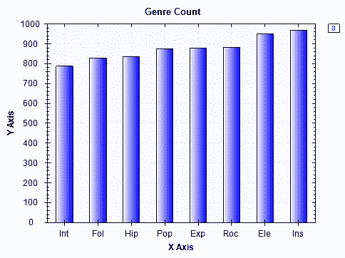
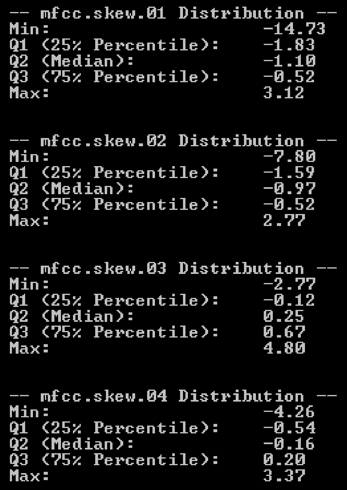
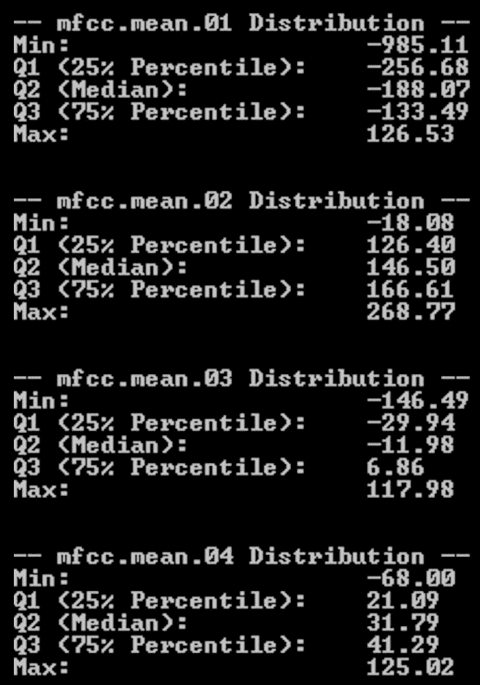
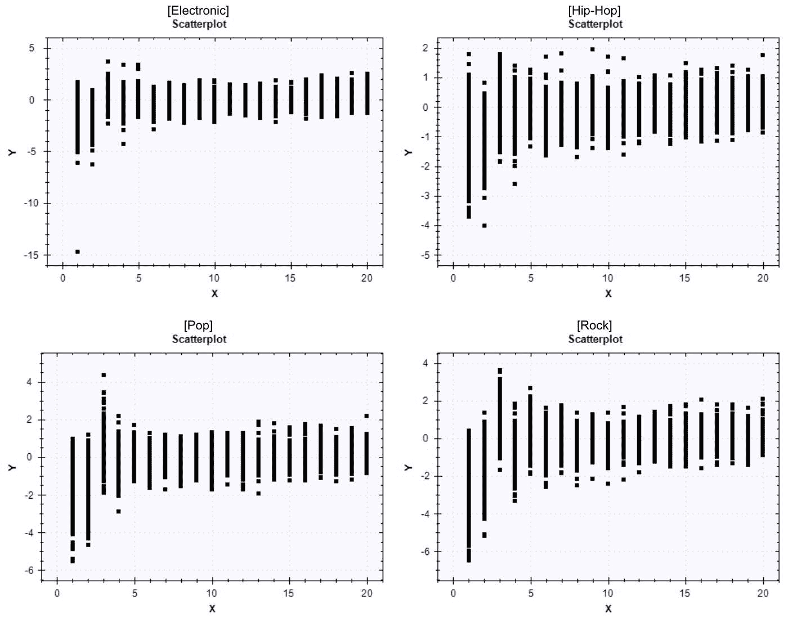
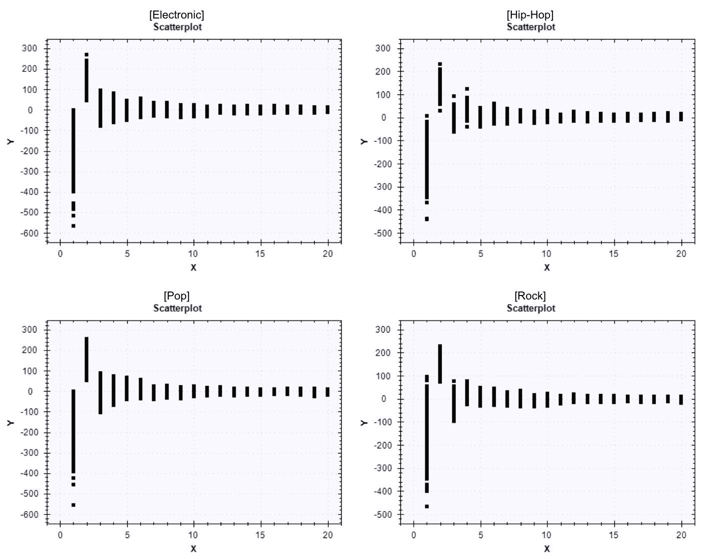

# 七、音乐流派推荐

在这一章，我们将回到监督学习。我们已经使用学习算法为分类和回归问题建立了许多监督学习算法，例如逻辑回归、朴素贝叶斯、随机森林和**支持向量机** ( **SVM** )。然而，我们构建的这些模型的输出数量始终是一个。在我们的 Twitter 情绪分析项目中，输出只能是积极、消极或中立中的一种。另一方面，在我们的房价预测项目中，输出是预测的房价的日志。与我们之前的项目不同，有些情况下我们希望我们的**机器学习** ( **ML** )模型输出多个值。推荐系统是我们需要能够产生排序预测的 ML 模型的一个例子。

在本章中，我们将使用一个包含各种音频特征的数据集，该数据集是从大量音乐录音中编译而来的。有了这些数据，我们将探索音频特征的值，如声音频谱的峰度和偏斜度，是如何在不同流派的歌曲中分布的。然后，我们将开始构建多个 ML 模型，输出给定歌曲属于每个音乐流派的预测概率，而不是针对给定歌曲只产生一个最可能流派的预测输出。一旦我们建立了这些模型，我们将进一步整合这些基础模型的预测结果，为歌曲音乐流派的最终推荐建立一个元模型。我们将使用不同的模型验证指标，**平均倒数排名** ( **MRR** )，来评估我们的排名模型。

在本章中，我们将讨论以下主题:

*   音乐流派推荐项目的问题定义
*   音频特征数据集的数据分析
*   音乐流派分类的 ML 模型
*   集合基本学习模型
*   评估推荐/排名排序模型


# 问题定义

让我们进入更详细的细节，并适当地定义我们要解决什么问题，以及我们要为这个项目建立什么机器学习模型。音乐流媒体服务，如 Pandora 和 Spotify，需要音乐推荐系统，通过它可以推荐和播放听众可能喜欢的歌曲。建立音乐推荐系统的方法不止一种。一种方法是看其他相似用户听了什么，定义相似用户的方法是看他们听过的歌曲的历史。然而，如果用户是该平台的新手和/或如果我们没有足够的他或她听过的歌曲的历史，这种方法将不能很好地工作。在这种情况下，我们不能依赖历史数据。而是利用用户当前正在听的歌曲的属性来推荐其他音乐会更好。在音乐推荐中能够起到重要作用的一个歌曲属性就是流派。当前正在平台上听音乐的用户很可能会喜欢继续听相同或相似的音乐。想象一下，你正在听器乐，音乐流媒体应用突然播放了摇滚乐。这不会是一个平稳的过渡，也不会是一个好的用户体验，因为你很可能会想继续听器乐。通过正确识别歌曲的流派并推荐正确的歌曲类型来播放，您可以避免干扰您的音乐流媒体服务的用户体验。

为了建立一个音乐流派推荐模型，我们将使用 **FMA:一个用于音乐分析的数据集**，它包含了超过 100，000 首曲目的大量数据。数据集包含关于专辑、标题、音频属性等信息，完整的数据集可以从这个链接找到并下载:【https://github.com/mdeff/fma。有了这些数据，我们将进一步选择感兴趣的特征，并建立许多 ML 模型，输出每首歌曲属于不同音乐流派的概率。然后，我们将按照概率对类型进行排序。我们将尝试各种学习算法，如逻辑回归、朴素贝叶斯和 SVM。我们将更进一步，使用集成技术将这些模型的输出作为另一个 ML 模型的输入，该模型产生最终的预测和推荐输出。我们将使用 MRR 作为衡量标准来评估我们的音乐流派推荐模型。

总结一下我们对音乐流派推荐项目的问题定义:

*   有什么问题？我们需要一个推荐模型，根据一首歌曲属于每个流派的可能性对音乐流派进行排序，这样我们就可以正确地识别一首歌曲的流派，并推荐下一首歌曲。
*   为什么会有问题？使用历史数据进行音乐推荐对于那些新接触该平台的用户来说是不可靠的，因为他们没有足够的历史数据来进行好的音乐推荐。在这种情况下，我们将不得不使用音频和其他功能来识别接下来播放什么音乐。正确识别和推荐音乐类型是决定下一首歌曲的第一步。
*   有哪些解决这个问题的方法？我们将使用公开可用的音乐数据，这些数据不仅包含关于歌曲的专辑、标题和艺术家的信息，还包含关于许多音频功能的信息。然后，我们将建立输出概率的 ML 模型，并使用这个概率输出对给定歌曲的流派进行排序。
*   成功的标准是什么？我们希望正确的音乐类型能够成为最受欢迎的音乐类型之一。我们将使用 MRR 作为评估排名模型的指标。


# 音频特征数据集的数据分析

让我们开始研究音频特征数据集。为了专注于建立音乐流派的推荐模型，我们削减了来自 **FMA 的原始数据集:用于音乐分析的数据集**。你可以从这个链接下载这些数据:[https://github . com/Yoon hwang/c-sharp-machine-learning/blob/master/ch . 7/sample . CSV](https://github.com/yoonhwang/c-sharp-machine-learning/blob/master/ch.7/sample.csv)。


# 目标变量分布

```cs
genre_top, and counted the number of records for each genre:
```

```cs
var genreCount = featuresDF.AggregateRowsBy<string, int>(
    new string[] { "genre_top" },
    new string[] { "track_id" },
    x => x.ValueCount
).SortRows("track_id");

genreCount.Print();

var barChart = DataBarBox.Show(
    genreCount.GetColumn<string>("genre_top").Values.ToArray().Select(x => x.Substring(0,3)),
    genreCount["track_id"].Values.ToArray()
).SetTitle(
    "Genre Count"
);
```

与前几章类似，我们在 Deedle 数据帧中使用了`AggregateRowsBy`方法来计算每个流派的记录数。然后，我们使用`DataBarBox`类创建一个条形图，直观地显示目标变量的分布。正如您在这个代码片段(第 10 行)中看到的，我们使用每个流派的前三个字母作为条形图中每个流派的标签。

运行此代码时，您将看到目标变量分布的以下输出:


下图显示了目标变量分布的条形图:



从这张图表中可以看出，在我们的样本集中，器乐( **Ins** )的数量最多，电子( **Ele** )和摇滚( **Roc** )紧随其后，位列第二和第三。虽然这个样本集包含某些类型的歌曲比其他类型的多，但是这是一个相对平衡的集合，其中一个或两个类型没有占据样本记录的大部分。现在，让我们看看我们的一些特征的分布。


# 音频功能–MFCC

对于这个项目，我们将重点关注整个数据集所具有的一部分特征。我们将使用 **Mel 频率倒谱系数**(**MFCC**)及其统计分布作为我们的 ML 模型的特征。简而言之，**是声谱的代表，我们将使用其统计分布、峰度、偏斜度、最小值、最大值、平均值、中值和标准差。如果您查看从上一步下载的样品组，您将会看到根据相应的统计分布命名的色谱柱。我们首先来看看这些特性的分布。以下代码片段显示了我们如何计算每个特征的四分位数:**

```cs
foreach (string col in featuresDF.ColumnKeys)
{
    if (col.StartsWith("mfcc"))
    {
        int idx = int.Parse(col.Split('.')[2]);
        if(idx <= 4)
        {
            Console.WriteLine(String.Format("\n\n-- {0} Distribution -- ", col));
            double[] quantiles = Accord.Statistics.Measures.Quantiles(
                featuresDF[col].ValuesAll.ToArray(),
                new double[] { 0, 0.25, 0.5, 0.75, 1.0 }
            );
            Console.WriteLine(
                "Min: \t\t\t{0:0.00}\nQ1 (25% Percentile): \t{1:0.00}\nQ2 (Median): \t\t{2:0.00}\nQ3 (75% Percentile): \t{3:0.00}\nMax: \t\t\t{4:0.00}",
                quantiles[0], quantiles[1], quantiles[2], quantiles[3], quantiles[4]
            );
        }
    }
}
```

与前几章类似，我们使用`Accord.Statistics.Measures`类中的`Quantiles`方法来计算四分位数，这是将值分成四个子集的三个数字——最小值和中值之间的中间数(第 25 ^个百分点)、中值(第 50 ^个百分点)以及中值和最大值之间的中间数(第 75 ^个百分点)。正如您在这段代码的第 6 行中看到的，我们只显示了前四个系数的统计分布。对于您的进一步实验，您可以查看所有 MFCC 特征的分布，而不仅限于这四个。让我们快速地看一下几个发行版。

前四个系数的峰度分布如下:


从这个输出中可以看出，大多数峰度值都在-2 到 5 之间，但也有峰度值很大的情况。现在让我们看看前四个系数的偏斜度分布:



偏斜度在较窄的范围内变化。通常，偏斜值似乎在-15 到 5 之间。最后，让我们看看前四个系数的均值分布:



从这个输出可以看出，平均值似乎有所不同，范围很大。它可以取-1，000 到 300 之间的任何值。

现在我们对音频特征的分布有了一个大致的概念，让我们看看是否能在不同的流派中找到特征分布的差异。我们将绘制一个散点图，其中 *x* 轴是每个特性的索引， *y* 轴是给定特性的值。让我们先看看这些情节，因为用一些视觉效果会更容易理解。

以下图表显示了四种不同类型的峰度分布:


如前所述， *x* 轴是指每个特征的索引。由于 MFCCs 的峰度有 20 个单独的特征，x 值从 1 到 20。另一方面， *y* 轴显示了给定特征的分布。正如你从这个图表中看到的，不同流派之间的特征分布存在一些差异，这将有助于我们的 ML 模型学习如何正确预测给定歌曲的流派。

以下图表显示了四种不同类型的偏度分布:



最后，以下图表显示了四种不同类型的平均分布:



当与峰度和偏斜度相比较时，每个特征的平均值的分布在不同的体裁中似乎更相似。

为了创建这些图表，我们使用了`ScatterplotBox`类。以下代码显示了我们如何创建前面的图表:

```cs
string[] attributes = new string[] { "kurtosis", "min", "max", "mean", "median", "skew", "std" };
foreach (string attribute in attributes)
{
    string[] featureColumns = featuresDF.ColumnKeys.Where(x => x.Contains(attribute)).ToArray();
    foreach (string genre in genreCount.GetColumn<string>("genre_top").Values)
    {
        var genreDF = featuresDF.Rows[
            featuresDF.GetColumn<string>("genre_top").Where(x => x.Value == genre).Keys
        ].Columns[featureColumns];

        ScatterplotBox.Show(
            BuildXYPairs(
                genreDF.Columns[featureColumns].ToArray2D<double>(),
                genreDF.RowCount,
                genreDF.ColumnCount
            )
        ).SetTitle(String.Format("{0}-{1}", genre, attribute));
    }
}
```

从这段代码中可以看出，我们从第 2 行开始遍历不同的统计分布(`kurtosis`、`min`、`max`等等)，对于这些统计分布中的每一个，我们从第 7 行的`featuresDF`中选择我们感兴趣的列。然后，我们编写并使用了一个助手函数，它为散点图构建一个 x-y 对数组，并使用`ScatterplotBox`类的`Show`方法显示它。

为散点图构建 x-y 对的辅助函数的代码如下:

```cs
private static double[][] BuildXYPairs(double[,] ary2D, int rowCount, int columnCount)
{
    double[][] ary = new double[rowCount*columnCount][];
    for (int i = 0; i < rowCount; i++)
    {
        for (int j = 0; j < columnCount; j++)
        {
            ary[i * columnCount + j] = new double[2];
            ary[i * columnCount + j][0] = j + 1;
            ary[i * columnCount + j][1] = ary2D[i, j];
        }
    }
    return ary;
}
```

从这段代码中可以看出，这个方法将特性的索引作为 x 值，将特性的值作为 y 值。

这个数据分析步骤的完整代码可以在这个链接找到:[https://github . com/Yoon hwang/c-sharp-machine-learning/blob/master/ch . 7/data analyzer . cs](https://github.com/yoonhwang/c-sharp-machine-learning/blob/master/ch.7/DataAnalyzer.cs)。


# 音乐流派分类的 ML 模型

我们现在将开始构建音乐流派分类的 ML 模型。在这个项目中，我们的 ML 模型的输出将采取稍微不同的形式。与我们已经建立的其他监督学习模型不同，我们希望我们的模型输出给定歌曲的每个流派的可能性或概率。因此，我们希望我们的模型输出八个值，而不是一个值，其中每个值将代表给定歌曲属于八种流派的概率——电子、实验、民谣、嘻哈、器乐、国际、流行和摇滚。为了实现这一点，我们将使用来自每个模型类的`Probabilities`方法，在我们到目前为止一直使用的`Decide`方法之上。


# 逻辑回归

我们要试验的第一个模型是逻辑回归。以下代码显示了我们如何为训练集和测试集构建 80/20 分割的逻辑回归分类器:

```cs
// 1\. Train a LogisticRegression Classifier
Console.WriteLine("\n---- Logistic Regression Classifier ----\n");
var logitSplitSet = new SplitSetValidation<MultinomialLogisticRegression, double[]>()
{
    Learner = (s) => new MultinomialLogisticLearning<GradientDescent>()
    {
        MiniBatchSize = 500
    },

    Loss = (expected, actual, p) => new ZeroOneLoss(expected).Loss(actual),

    Stratify = false,

    TrainingSetProportion = 0.8,

    ValidationSetProportion = 0.2,

};

var logitResult = logitSplitSet.Learn(input, output);

var logitTrainedModel = logitResult.Model;

// Store train & test set indexes to train other classifiers on the same train set
// and test on the same validation set
int[] trainSetIDX = logitSplitSet.IndicesTrainingSet;
int[] testSetIDX = logitSplitSet.IndicesValidationSet;
```

您应该已经熟悉了，我们使用`SplitSetValidation`将样本集分成训练集和测试集。我们将样本集的 80%用于训练，另外 20%用于测试和评估我们的模型。我们使用`MultinomialLogisticRegression`作为多类分类器的模型，使用`MultinomialLogisticLearning`和`GradientDescent`作为我们的学习算法。与前几章相似，我们使用`ZeroOneLoss`作为分类器的`Loss`函数。

正如您在这段代码的基础上所看到的，我们将经过训练的逻辑回归分类器模型存储到一个单独的变量`logitTrainedModel`中，同时还存储了训练集和测试集的索引，用于训练和测试其他学习算法。我们这样做是为了在不同的 ML 模型之间进行模型性能的直接比较。

使用这种经过训练的逻辑回归模型进行样本内和样本外预测的代码如下:

```cs
// Get in-sample & out-of-sample predictions and prediction probabilities for each class
double[][] trainProbabilities = new double[trainSetIDX.Length][];
int[] logitTrainPreds = new int[trainSetIDX.Length];
for (int i = 0; i < trainSetIDX.Length; i++)
{
    logitTrainPreds[i] = logitTrainedModel.Decide(input[trainSetIDX[i]]);
    trainProbabilities[i] = logitTrainedModel.Probabilities(input[trainSetIDX[i]]);
}

double[][] testProbabilities = new double[testSetIDX.Length][];
int[] logitTestPreds = new int[testSetIDX.Length];
for (int i = 0; i < testSetIDX.Length; i++)
{
    logitTestPreds[i] = logitTrainedModel.Decide(input[testSetIDX[i]]);
    testProbabilities[i] = logitTrainedModel.Probabilities(input[testSetIDX[i]]);
}
```

如前所述，我们使用来自`MultinomialLogisticRegression`模型的`Probabilities`方法，它输出一个概率数组，每个指数代表给定歌曲成为相应音乐流派的概率。以下代码显示了我们如何对每种类型进行编码:

```cs
IDictionary<string, int> targetVarCodes = new Dictionary<string, int>
{
    { "Electronic", 0 },
    { "Experimental", 1 },
    { "Folk", 2 },
    { "Hip-Hop", 3 },
    { "Instrumental", 4 },
    { "International", 5 },
    { "Pop", 6 },
    { "Rock", 7 }
};
featuresDF.AddColumn("target", featuresDF.GetColumn<string>("genre_top").Select(x => targetVarCodes[x.Value]));
```

让我们尝试使用与逻辑回归模型相同的训练和测试集索引来训练另一个 ML 模型。


# 高斯核的 SVM

使用下面的代码，您可以训练一个多类 SVM 模型:

```cs
// 2\. Train a Gaussian SVM Classifier
Console.WriteLine("\n---- Gaussian SVM Classifier ----\n");
var teacher = new MulticlassSupportVectorLearning<Gaussian>()
{
    Learner = (param) => new SequentialMinimalOptimization<Gaussian>()
    {
        Epsilon = 2,
        Tolerance = 1e-2,
        Complexity = 1000,
        UseKernelEstimation = true
    }
};
// Train SVM model using the same train set that was used for Logistic Regression Classifier
var svmTrainedModel = teacher.Learn(
    input.Where((x,i) => trainSetIDX.Contains(i)).ToArray(),
    output.Where((x, i) => trainSetIDX.Contains(i)).ToArray()
);
```

正如您在这段代码中看到的，我们之前构建的 SVM 模型之间有一个微小的区别。我们用的是`MulticlassSupportVectorLearning`而不是`LinearRegressionNewtonMethod`或`FanChenLinSupportVectorRegression`，我们在[第五章](part0056.html#1LCVG0-5ebdf09927b7492888e31e8436526470)、*房产公允价值*中使用过。这是因为我们现在有一个多类分类问题，并且需要为这样的 SVM 模型使用不同的学习算法。正如我们在前面的另一章中所讨论的，超参数，如`Epsilon`、`Tolerance`和`Complexity`，是可以调整的，您应该为性能更好的模型试验其他值。

这里需要注意的一点是，当我们训练 SVM 模型时，我们使用的训练集与构建逻辑回归模型时使用的训练集相同。正如您在代码的基础上看到的，我们在以前用于逻辑回归模型的训练集中选择了具有相同索引的记录。这是为了确保我们能够正确地对 SVM 模型和逻辑回归模型的性能进行直接比较。

与之前的逻辑回归模型的情况类似，我们使用以下代码，通过训练好的 SVM 模型进行样本内和样本外预测:

```cs
// Get in-sample & out-of-sample predictions and prediction probabilities for each class
double[][] svmTrainProbabilities = new double[trainSetIDX.Length][];
int[] svmTrainPreds = new int[trainSetIDX.Length];
for (int i = 0; i < trainSetIDX.Length; i++)
{
    svmTrainPreds[i] = svmTrainedModel.Decide(input[trainSetIDX[i]]);
    svmTrainProbabilities[i] = svmTrainedModel.Probabilities(input[trainSetIDX[i]]);
}

double[][] svmTestProbabilities = new double[testSetIDX.Length][];
int[] svmTestPreds = new int[testSetIDX.Length];
for (int i = 0; i < testSetIDX.Length; i++)
{
    svmTestPreds[i] = svmTrainedModel.Decide(input[testSetIDX[i]]);
    svmTestProbabilities[i] = svmTrainedModel.Probabilities(input[testSetIDX[i]]);
}
```

`MulticlassSupportVectorMachine`类还提供了`Probabilities`方法，通过它我们可以得到一首歌属于八种风格的可能性。我们将这些概率输出存储到单独的变量`svmTrainProbabilities`和`svmTestProbabilities`中，用于我们未来的模型评估和模型集合。


# 朴素贝叶斯

我们将为音乐流派分类建立更多的机器学习模型。我们将训练一个朴素贝叶斯分类器。以下代码显示了如何为具有连续值的输入构建朴素贝叶斯分类器:

```cs
// 3\. Train a NaiveBayes Classifier
Console.WriteLine("\n---- NaiveBayes Classifier ----\n");
var nbTeacher = new NaiveBayesLearning<NormalDistribution>();

var nbTrainedModel = nbTeacher.Learn(
    input.Where((x, i) => trainSetIDX.Contains(i)).ToArray(),
    output.Where((x, i) => trainSetIDX.Contains(i)).ToArray()
);
```

从这段代码中可以看出，我们使用`NormalDistribution`作为`NaiveBayesLearning`的发行版。不像在前面的章节中，我们用字数作为朴素贝叶斯分类器的特征，我们有连续的音频特征值。在这种情况下，我们需要建立一个高斯朴素贝叶斯分类器。与我们构建 SVM 模型时类似，我们使用用于逻辑回归模型的相同训练集来训练朴素贝叶斯分类器。

以下代码显示了如何使用训练好的朴素贝叶斯分类器获得样本内和样本外预测的概率输出:

```cs
// Get in-sample & out-of-sample predictions and prediction probabilities for each class
double[][] nbTrainProbabilities = new double[trainSetIDX.Length][];
int[] nbTrainPreds = new int[trainSetIDX.Length];
for (int i = 0; i < trainSetIDX.Length; i++)
{
    nbTrainProbabilities[i] = nbTrainedModel.Probabilities(input[trainSetIDX[i]]);
    nbTrainPreds[i] = nbTrainedModel.Decide(input[trainSetIDX[i]]);
}

double[][] nbTestProbabilities = new double[testSetIDX.Length][];
int[] nbTestPreds = new int[testSetIDX.Length];
for (int i = 0; i < testSetIDX.Length; i++)
{
    nbTestProbabilities[i] = nbTrainedModel.Probabilities(input[testSetIDX[i]]);
    nbTestPreds[i] = nbTrainedModel.Decide(input[testSetIDX[i]]);
}
```

类似于`MulticlassSupportVectorMachine`和`MultinomialLogisticRegression`类，`NaiveBayes`模型也提供了`Probabilities`方法。从代码中可以看出，我们将样本内和样本外记录的预测概率存储在两个独立的变量中，`nbTrainProbabilities`和`nbTestProbabilities`。

在接下来的部分中，我们将看看如何组合和集成我们到目前为止构建的这些模型。构建 ML 模型的完整代码可以在这个链接找到:[https://github . com/Yoon hwang/c-sharp-machine-learning/blob/master/ch . 7/modeling . cs](https://github.com/yoonhwang/c-sharp-machine-learning/blob/master/ch.7/Modeling.cs)。


# 集合基本学习模型

集成学习是将训练好的模型结合在一起，以提高它们的预测能力。我们在前面章节中建立的随机森林分类器是集成学习的一个例子。它构建了一个决策树的森林，其中用样本集中的一部分样本和特征来训练各个树。这种集成学习的方法叫做 **bagging** 。我们在这一章将要使用的系综方法是**叠加**。堆叠是指使用其他模型的输出建立一个新的 ML 模型，这被称为**基本学习模型**。

在本项目中，我们将在我们在上一节中构建的逻辑回归、SVM 和朴素贝叶斯模型的预测概率输出的基础上构建一个新的朴素贝叶斯分类器模型。我们需要做的第一件事是用基础模型的概率输出建立一个新模型，即建立训练输入。以下代码显示了我们如何组合基本模型的所有输出:

```cs
// 4\. Ensembling Base Models
Console.WriteLine("\n-- Building Meta Model --");
double[][] combinedTrainProbabilities = new double[trainSetIDX.Length][];
for (int i = 0; i < trainSetIDX.Length; i++)
{
    List<double> combined = trainProbabilities[i]
        .Concat(svmTrainProbabilities[i])
        .Concat(nbTrainProbabilities[i])
        .ToList();
    combined.Add(logitTrainPreds[i]);
    combined.Add(svmTrainPreds[i]);
    combined.Add(nbTrainPreds[i]);

    combinedTrainProbabilities[i] = combined.ToArray();
}

double[][] combinedTestProbabilities = new double[testSetIDX.Length][];
for (int i = 0; i < testSetIDX.Length; i++)
{
    List<double> combined = testProbabilities[i]
        .Concat(svmTestProbabilities[i])
        .Concat(nbTestProbabilities[i])
        .ToList();
    combined.Add(logitTestPreds[i]);
    combined.Add(svmTestPreds[i]);
    combined.Add(nbTestPreds[i]);

    combinedTestProbabilities[i] = combined.ToArray();
}
Console.WriteLine("\n* input shape: ({0}, {1})\n", combinedTestProbabilities.Length, combinedTestProbabilities[0].Length);
```

正如您在这段代码中看到的，我们将目前为止构建的所有三个模型的预测概率连接在一起。使用这个概率输出数据作为输入，我们将使用朴素贝叶斯学习算法建立一个新的元模型。下面的代码是我们如何训练这个元模型的:

```cs
// Build meta-model using NaiveBayes Learning Algorithm
var metaModelTeacher = new NaiveBayesLearning<NormalDistribution>();
var metamodel = metaModelTeacher.Learn(
    combinedTrainProbabilities, 
    output.Where((x, i) => trainSetIDX.Contains(i)).ToArray()
);
```

从这段代码中，您可以看到我们仍然在使用`NormalDistribution`，因为输入是一组连续的值。然后，我们用之前训练的基本学习模型的组合概率输出来训练这个新的朴素贝叶斯分类器。与前面的步骤类似，我们通过使用`Probabilities`方法从这个元模型获得预测输出，并将这些结果存储到单独的变量中。使用这个新的元模型获得训练集和测试集的预测输出的代码如下:

```cs
// Get in-sample & out-of-sample predictions and prediction probabilities for each class
double[][] metaTrainProbabilities = new double[trainSetIDX.Length][];
int[] metamodelTrainPreds = new int[trainSetIDX.Length];
for (int i = 0; i < trainSetIDX.Length; i++)
{
    metaTrainProbabilities[i] = metamodel.Probabilities(combinedTrainProbabilities[i]);
    metamodelTrainPreds[i] = metamodel.Decide(combinedTrainProbabilities[i]);
}

double[][] metaTestProbabilities = new double[testSetIDX.Length][];
int[] metamodelTestPreds = new int[testSetIDX.Length];
for (int i = 0; i < testSetIDX.Length; i++)
{
    metaTestProbabilities[i] = metamodel.Probabilities(combinedTestProbabilities[i]);
    metamodelTestPreds[i] = metamodel.Decide(combinedTestProbabilities[i]);
}
```

现在我们已经建立了所有的模型，让我们开始看看这些模型的性能。在下一节中，我们将评估基础模型以及我们刚刚构建的元模型的性能。


# 评估推荐/排名排序模型

评估对结果进行排序的推荐模型与评估分类模型有很大不同。除了模型预测是对还是错，我们还关心正确的结果在推荐模型中的排名。换句话说，预测正确结果为倒数第二的模型比预测正确结果为倒数第四或第五的模型更好。例如，当你在搜索引擎上搜索某个东西时，在第一页的顶部找到最合适的文档是很好的，但是将该文档作为第一页的第二个或第三个链接也是可以的，只要它不出现在第一页或下一页的底部。在接下来的章节中，我们将讨论一些评估这种推荐和排名模型的方法。


# 预测准确度

第一个也是最简单的衡量标准是准确性。对于我们构建的第一个逻辑回归模型，我们可以使用以下代码来获得精确度:

```cs
Console.WriteLine(String.Format("train accuracy: {0:0.0000}", 1-logitResult.Training.Value));
Console.WriteLine(String.Format("validation accuracy: {0:0.0000}", 1-logitResult.Validation.Value));
```

对于以下模型，SVM 和朴素贝叶斯分类器，我们可以使用以下代码来计算训练集和测试集预测的准确性:

```cs
Console.WriteLine(
    String.Format(
        "train accuracy: {0:0.0000}",
        1 - new ZeroOneLoss(output.Where((x, i) => trainSetIDX.Contains(i)).ToArray()).Loss(nbTrainPreds)
    )
);
Console.WriteLine(
    String.Format(
        "validation accuracy: {0:0.0000}",
        1 - new ZeroOneLoss(output.Where((x, i) => testSetIDX.Contains(i)).ToArray()).Loss(nbTestPreds)
    )
);
```

我们对第一个逻辑回归模型使用了`SplitSetValidation`类，因此它在模型拟合时计算精确度。然而，对于后续的模型，我们分别训练了 SVM 和朴素贝叶斯模型，所以我们需要使用`ZeroOneLoss`类来计算精确度。

运行此代码时，您将看到逻辑回归模型的准确性输出，如下所示:


对于朴素贝叶斯模型，准确性结果如下所示:


对于 SVM 模型，输出如下所示:


最后，元模型的准确性结果如下:


从这些结果中，我们可以看到朴素贝叶斯分类器通过在大约 42%的时间内预测正确的流派而表现得最好。逻辑回归模型是精度第二高的最佳模型，SVM 模型是预测精度最差的模型。有趣的是，我们用其他三个模型的输出构建的元模型表现得并不好。它比 SVM 模型好，但比朴素贝叶斯和逻辑回归分类器差。


# 混淆矩阵

接下来我们要看的是混淆矩阵。在第 2 章、*垃圾邮件过滤*的[中的二元分类的情况下，我们探索了混淆矩阵是 2×2 矩阵的情况。然而，在这个项目中，我们的模型有`8`个结果，混淆矩阵的形状将是 8×8。让我们先来看看如何建立这样一个混淆矩阵:](part0028.html#QMFO0-5ebdf09927b7492888e31e8436526470)

```cs
// Build confusion matrix
string[] confMatrix = BuildConfusionMatrix(
    output.Where((x, i) => testSetIDX.Contains(i)).ToArray(), logitTestPreds, 8
);

System.IO.File.WriteAllLines(Path.Combine(dataDirPath, "logit-conf-matrix.csv"), confMatrix);
```

助手函数`BuildConfusionMatrix`的代码如下所示:

```cs
private static string[] BuildConfusionMatrix(int[] actual, int[] preds, int numClass)
{
    int[][] matrix = new int[numClass][];
    for(int i = 0; i < numClass; i++)
    {
        matrix[i] = new int[numClass];
    }

    for(int i = 0; i < actual.Length; i++)
    {
        matrix[actual[i]][preds[i]] += 1;
    }

    string[] lines = new string[numClass];
    for(int i = 0; i < matrix.Length; i++)
    {
        lines[i] = string.Join(",", matrix[i]);
    }

    return lines;
}
```

一旦你运行这个代码，你将得到一个 8 x 8 的矩阵，其中行是实际的和观察到的类型，列是从模型中预测的类型。以下是我们的逻辑回归模型的混淆矩阵:


粗体数字表示模型正确预测的记录数。比如这个 logistic 回归模型把 **79 首**歌正确预测为**电音**和 **33 首**歌被预测为**电音**，在这里其实是**实验**。这里值得注意的一点是，这个逻辑回归模型在预测流行歌曲方面做得不太好。它只有一个流行预测，但那个预测是错误的，这首歌实际上是一首嘻哈歌曲。现在让我们看看朴素贝叶斯分类器预测的混淆矩阵:


正如准确性结果所预期的，混淆矩阵看起来比逻辑回归更好。与逻辑回归分类器相比，每个类别中有更高比例的预测是正确的。朴素贝叶斯分类器似乎对流行歌曲做得更好。

以下是 SVM 分类器的混淆矩阵:


不出所料，预测结果并不好。SVM 模型预测 100%的记录为电子记录。最后，让我们看看元模型是如何工作的:


这个混淆矩阵看起来比 SVM 模型的稍微好一点。然而，大多数预测要么是乐器类的要么是 T2 国际类的，只有少数唱片被预测为其他类型。

查看混淆矩阵是检查模型的错误分类并找出模型的弱点和优点的好方法。这些结果与准确性结果非常一致，其中朴素贝叶斯分类器优于所有其他模型，元模型表现不佳，尽管它不是我们建立的四个模型中最差的。


# 平均倒数等级

我们要看的下一个评估指标是 MRR。MRR 可用于模型生成结果列表并衡量排名的整体质量的情况。让我们先来看看这个等式:


如您所见，它是等级倒数之和的平均值。考虑下面的例子:


在第一个例子中，正确的流派是排名第二，所以倒数排名是 **1/2** 。第二个例子的正确流派是排名第一，所以倒数排名是 **1/1** ，也就是 **1** 。按照这个过程，我们可以得到所有记录的倒数排名，最终的 MRR 值就是这些倒数排名的平均值。这告诉我们排名的总体质量。本例中， **MRR** 为 **0.57** ，大于 1/2。因此，这个 MRR 数表明，平均而言，正确的流派出现在模型预测的前两个流派中。

为了计算模型的 MRR，我们首先需要将概率输出转换为排名，然后根据转换后的模型输出计算 MRR。以下代码片段显示了我们如何计算模型的 MRR:

```cs
// Calculate evaluation metrics
int[][] logitTrainPredRanks = GetPredictionRanks(trainProbabilities);
int[][] logitTestPredRanks = GetPredictionRanks(testProbabilities);

double logitTrainMRRScore = ComputeMeanReciprocalRank(
    logitTrainPredRanks,
    output.Where((x, i) => trainSetIDX.Contains(i)).ToArray()
);
double logitTestMRRScore = ComputeMeanReciprocalRank(
    logitTestPredRanks,
    output.Where((x, i) => testSetIDX.Contains(i)).ToArray()
);

Console.WriteLine("\n---- Logistic Regression Classifier ----\n");
Console.WriteLine(String.Format("train MRR score: {0:0.0000}", logitTrainMRRScore));
Console.WriteLine(String.Format("validation MRR score: {0:0.0000}", logitTestMRRScore));
```

这段代码使用了两个辅助函数，`GetPredictionRanks`和`ComputeMeanReciprocalRank`。`GetPredictionRanks`方法将模型的概率输出转换为排名，而`ComputeMeanReciprocalRank`方法根据排名计算 MRR。助手函数`GetPredictionRanks`如下所示:

```cs
private static int[][] GetPredictionRanks(double[][] predProbabilities)
{
    int[][] rankOrdered = new int[predProbabilities.Length][];

    for(int i = 0; i< predProbabilities.Length; i++)
    {
        rankOrdered[i] = Matrix.ArgSort<double>(predProbabilities[i]).Reversed();
    }

    return rankOrdered;
}
```

我们使用`Accord.Math`包中的`Matrix.ArgSort`方法对每张唱片的风格进行排序。`Matrix.ArgSort`返回按概率升序排序后的流派索引。但是，我们希望它们按降序排列，这样最有可能的类型会排在第一位。这就是为什么我们使用`Reversed`方法反转排序索引的顺序。

助手函数`ComputeMeanReciprocalRank`如下所示:

```cs
private static double ComputeMeanReciprocalRank(int[][] rankOrderedPreds, int[] actualClasses)
{
    int num = rankOrderedPreds.Length;
    double reciprocalSum = 0.0;

    for(int i = 0; i < num; i++)
    {
        int predRank = 0;
        for(int j = 0; j < rankOrderedPreds[i].Length; j++)
        {
            if(rankOrderedPreds[i][j] == actualClasses[i])
            {
                predRank = j + 1;
            }
        }
        reciprocalSum += 1.0 / predRank;
    }

    return reciprocalSum / num;
}
```

这是我们之前讨论的 MRR 计算公式的实现。该方法遍历每条记录，并获得正确流派的排名。然后，它对秩进行倒数，对所有的倒数求和，最后将这个和除以记录数，得到 MRR 数。

让我们开始看看到目前为止我们已经建立的模型的 MRR 分数。以下输出显示了`Logistic Regression Classifier`的 MRR 分数:


朴素贝叶斯分类器的样本内和样本外 MRR 分数如下所示:


SVM 分类器的结果如下:


最后，元模型的 MRR 分数如下:


从这些输出中，我们可以看到朴素贝叶斯分类器在大约`0.61`处具有最好的 MRR 分数，而 SVM 分类器在大约`0.33`处具有最差的 MRR 分数。这个元模型的 MRR 分数在`0.4`左右。这与我们在前面的步骤中通过查看预测准确性和混淆矩阵发现的结果一致。从这些 MRR 分数中，我们可以看到正确的流派通常落在朴素贝叶斯分类器的前两个等级中。另一方面，正确的流派通常出现在 SVM 分类器的前三名，并且在元模型的前三名之内。正如你从这些案例中所看到的，我们可以通过观察 MRR 指标来了解排名的整体质量。


# 摘要

在这一章中，我们建立了第一个推荐模型，对每个结果的可能性进行排序。我们在本章开始时定义了我们要解决的问题以及我们要使用的建模和评估方法。然后，我们查看了样本集中变量的分布。首先，我们观察了目标变量在不同类别或流派中的分布情况，并注意到这是一个平衡的样本集，没有一个流派占据了我们数据集中的大多数样本。然后，我们看了音频特征的分布。在这个项目中，我们主要关注 MFCCs 及其统计分布，如峰度、偏度、最小值和最大值。通过观察这些特征的四分位数和散点图，我们证实了不同音乐流派的特征分布是不同的。

在我们的建模步骤中，我们试验了三种学习算法:逻辑回归、SVM 和朴素贝叶斯。因为我们正在构建多类分类模型，所以我们必须使用与前面章节不同的学习算法。我们学习了如何在 Accord.NET 框架中使用`MultinomialLogisticRegression`和`MulticlassSupportVectorMachine`类，以及何时使用`NormalDistribution`代替`NaiveBayesLearning`。然后，我们讨论了如何构建一个元模型，将基础学习模型的预测结果集成起来，以提高最大似然模型的预测能力。最后，我们讨论了评估排名模型与其他分类模型的不同之处，并查看了准确性、混淆矩阵和 MRR 度量来评估我们的 ML 模型。

在下一章中，我们将使用手写数字图像数据集来构建一个分类器，将每个图像分类到相应的数字中。我们将讨论一些降低特征集维数的技术，以及如何将它们应用于图像数据集。我们还将讨论如何使用 Accord.NET 框架在 C#中构建神经网络，这是深度学习的主干。**