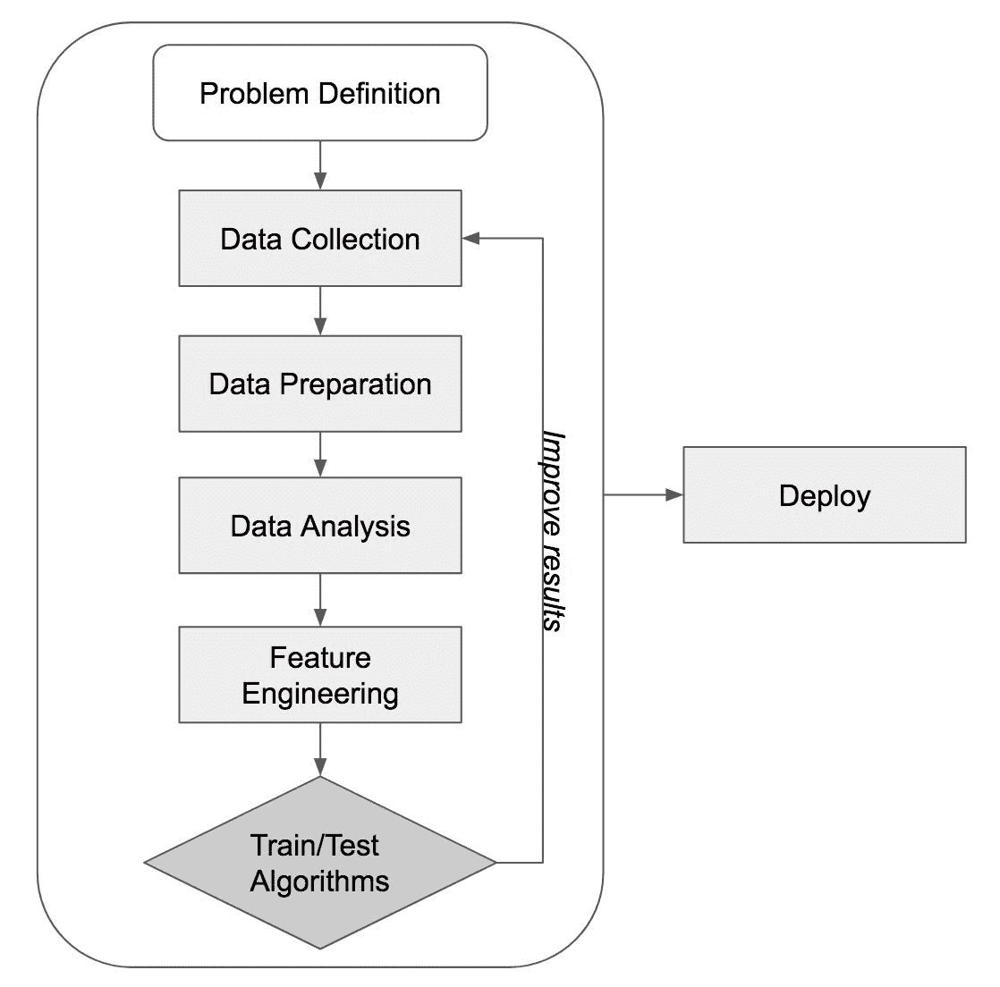

# 十一、下一步是什么？

我们已经走了很长的路。从构建**机器学习** ( **ML** )模型的基础和步骤，到为各种现实项目实际开发大量的 ML 模型，到目前为止，我们已经介绍了很多。在简短的介绍性章节之后，我们学习了 ML 的基础知识和构建 ML 模型的基本步骤，我们开始构建 ML 模型。在[第 2 章](part0028.html#QMFO0-5ebdf09927b7492888e31e8436526470)、*垃圾邮件过滤*和[第 3 章](part0036.html#12AK80-5ebdf09927b7492888e31e8436526470)、*推特情感分析*中，我们讨论了使用文本数据集构建分类模型。在[第四章](part0045.html#1AT9A0-5ebdf09927b7492888e31e8436526470)、*外汇汇率预测*和[第五章](part0056.html#1LCVG0-5ebdf09927b7492888e31e8436526470)、*房屋和财产的公允价值*中，我们使用金融和房地产数据建立回归模型。然后，在第 6 章、*客户细分*中，我们介绍了如何使用聚类算法，通过电子商务数据集对客户行为进行直观洞察。在[第 7 章](part0082.html#2E6E40-5ebdf09927b7492888e31e8436526470)、*音乐流派推荐*和[第 8 章](part0097.html#2SG6I0-5ebdf09927b7492888e31e8436526470)、*手写数字识别*中，我们扩展了构建 ML 模型的知识，利用音乐记录和手写数字图像数据构建音乐推荐和图像识别模型。在[第 9 章](part0116.html#3EK180-5ebdf09927b7492888e31e8436526470)、*网络攻击检测*和[第 10 章](part0132.html#3TSA80-5ebdf09927b7492888e31e8436526470)、*信用卡欺诈检测*中，我们为网络攻击检测和信用卡欺诈检测构建了异常检测模型。

在这一章中，我们将回顾我们已经建立的 ML 模型的类型，到目前为止我们已经完成的项目，以及使用 Accod.NET 框架训练各种 ML 模型的代码片段。我们还将讨论在实际项目和情况中使用和应用 ML 时的一些挑战。最后，我们将介绍一些可用于未来 ML 项目的其他软件包，以及数据科学家经常使用的其他通用技术。

在本章中，我们将讨论以下主题:

*   对我们目前所学知识的回顾
*   构建 ML 模型的现实挑战
*   数据科学家使用的其他常用技术


# 回顾

从第一章开始，我们已经讨论了大量的材料。从讨论 ML 的基础到构建分类、回归和聚类模型，在我们结束本书之前，有必要回顾一下我们到目前为止所做的工作。让我们回顾一些对你未来的 C# ML 项目有帮助的基本概念和代码。


# 构建 ML 模型的步骤

正如在[第 1 章](part0020.html#J2B80-5ebdf09927b7492888e31e8436526470)、*机器学习建模基础*中所讨论的，对于有抱负的数据科学家和 ML 工程师来说，理解构建将在生产系统中使用的真实世界 ML 模型的流程和方法可能具有挑战性。我们已经在[第 1 章](part0020.html#J2B80-5ebdf09927b7492888e31e8436526470)、*机器学习建模基础*中详细讨论了构建机器学习模型的步骤，并且我们在迄今为止参与的每个项目中都遵循了这些步骤。下图应该是对构建真实 ML 模型的基本步骤的一个很好的概括:



正如你应该已经知道的，我们总是从问题定义开始一个 ML 项目。在这一步，我们定义了我们要用 ML 解决的问题，以及为什么我们需要 ML 模型来解决这样的问题。这也是我们集思广益的步骤和先决条件，如所需的数据类型，以及我们将要实验的学习算法的类型。最后，这是我们需要明确定义项目成功标准的地方。我们不仅可以为 ML 模型的预测性能，还可以为您的模型的执行性能定义一些评估指标，特别是如果模型需要在实时系统中运行，并在给定的时间窗口内输出预测结果。

从问题定义阶段，我们继续到数据收集步骤。对于我们在本书中参与的项目，我们使用了已经编译和标注的公开数据。然而，在现实世界中，数据可能一开始就不可用。在这种情况下，我们必须想出收集数据的方法。例如，如果我们计划为我们网站或应用程序上的用户建立用户行为预测的 ML 模型，那么我们可以收集网站或应用程序上的用户活动。另一方面，如果我们正在建立一个信用模型来评估潜在借款人的信用价值，我们很可能无法自己收集数据。在这种情况下，我们将不得不求助于出售信用相关数据的第三方数据供应商。

一旦我们收集了所有的数据，接下来我们要做的就是准备和分析数据。在数据准备步骤中，我们需要通过查看数据字段的格式、重复记录的存在或缺失值的数量来验证数据集。检查完这些标准后，我们就可以开始分析数据，看看数据集中是否有任何值得注意的模式。如果您还记得，我们通常首先分析目标变量分布，然后开始分析每个目标类的特性分布，以识别任何可以将目标类彼此分开的显著模式。在数据分析步骤中，我们专注于获得对数据模式的一些见解，以及数据本身的结构。

有了对来自数据分析步骤的数据的洞察和理解，我们就可以开始构建将用于我们的 ML 模型的特征。正如吴恩达提到的，应用 ML 基本上是特征工程。这是建立最大似然模型和确定预测模型性能的最关键步骤之一。如果您还记得，我们讨论了如何使用一键编码将文本特征转换为 1 和 0 的编码矩阵，以解决我们的文本分类问题。我们还讨论了构建时间序列特征，如移动平均线和布林线，以及在构建回归模型时对高度偏斜的特征使用对数变换。这个特征工程步骤是我们需要创新的地方。

一旦我们准备好了所有的特性，我们就可以继续训练和测试各种学习算法了。根据目标变量是连续的还是分类的，我们可以决定是建立分类模型还是回归模型。如果您还记得以前的项目，我们通过使用 k-fold 交叉验证或通过将数据集分成两个子集，用一个组进行训练，用另一个拒绝组进行测试，来训练和测试我们的模型。直到我们找到满意的模型，我们将不得不重复前面的步骤。如果我们没有足够的数据，我们将不得不返回到数据收集阶段，并尝试为更准确的模型收集更多的数据。如果我们对重复记录或缺失值处理得不好，我们将不得不返回到数据准备步骤来清理数据。如果我们可以构建更多更好的特性，那么重复特性工程步骤可以帮助我们提高 ML 模型的性能。

构建 ML 模型的最后一步是将它们部署到生产系统中。至此，所有的模型都应该已经过充分的测试和验证。在部署之前准备一些监控工具是有益的，这样可以监控模型的性能。

我们在整个章节中已经完全遵循了这些步骤，所以当你开始着手未来的 ML 项目时，你会意识到这些步骤是多么的舒适和熟悉。然而，有几个基本步骤我们无法在本书中完全涵盖，例如数据收集和模型部署步骤，因此您应该始终牢记这些步骤的重要性和目标。


# 分类模型

我们在[第 2 章](part0028.html#QMFO0-5ebdf09927b7492888e31e8436526470)、*垃圾邮件过滤*和[第 3 章](part0036.html#12AK80-5ebdf09927b7492888e31e8436526470)、*推特情感分析*中构建的这两个 ML 模型是分类模型。在[第二章](part0028.html#QMFO0-5ebdf09927b7492888e31e8436526470)、*垃圾邮件过滤*中，我们构建了一个分类模型，将邮件分为垃圾邮件和 ham(非垃圾邮件)。在[第三章](part0036.html#12AK80-5ebdf09927b7492888e31e8436526470)、 *Twitter 情绪分析*中，我们为 Twitter 情绪分析建立了一个分类模型，该模型将每条推文分类为三种情绪之一——积极、消极和中性。分类问题在 ML 项目中很常见。建立一个模型来预测一个客户是否会在网上商店购买一件商品，这是一个分类问题。建立一个模型来预测借款人是否会偿还他/她的贷款也是一个分类问题。

如果在目标变量中只有两类，通常是正面结果和负面结果，那么我们称之为二元分类。二进制分类问题的一个很好的例子是我们在[第 2 章](part0028.html#QMFO0-5ebdf09927b7492888e31e8436526470)、*垃圾邮件过滤*中做的垃圾邮件过滤项目。如果目标变量中有两个以上的类，那么我们称之为多类或多项式分类。在[第三章](part0036.html#12AK80-5ebdf09927b7492888e31e8436526470)、 *Twitter 情感分析*的 Twitter 情感分析项目中，我们遇到了不得不将一条记录分为三个不同类别的情况；这是多项式分类问题的一个很好的例子。在这本书里，我们还有两个分类项目。如果您还记得，我们在第 7 章、*音乐流派推荐*中的音乐流派推荐项目的目标变量中有 8 个不同的流派或类别，在第 8 章、*手写数字识别*中的手写数字识别项目的目标变量中有 10 个不同的数字。

对于上述分类项目，我们试验了许多学习算法，如逻辑回归、朴素贝叶斯、**支持向量机**(**【SVM】**)、随机森林和神经网络。为了提醒你如何在 C#中训练这些学习算法，我们将重申我们如何使用 Accord.NET 框架在 C#中初始化这些学习算法。

以下代码片段显示了我们如何训练二元逻辑回归分类器:

```cs
var learner = new IterativeReweightedLeastSquares<LogisticRegression>()
{
    MaxIterations = 100
};
var model = learner.Learn(inputs, outputs);
```

对于多项式分类问题，我们使用以下代码训练了一个逻辑回归分类器:

```cs
var learner = new MultinomialLogisticLearning<GradientDescent>()
{
    MiniBatchSize = 500
};
var model = learner.Learn(inputs, outputs);
```

在构建朴素贝叶斯分类器时，我们使用了以下代码:

```cs
var learner = new NaiveBayesLearning<NormalDistribution>();
var model = learner.Learn(inputs, outputs);
```

如果您还记得，当特征具有连续变量时，我们使用了`NormalDistribution`,就像在音乐流派推荐项目的情况下，其中所有的特征都是音频频谱特征并且具有连续的值。另一方面，我们使用了`BernoulliDistribution`，这里的特性只能取二进制值(0 对 1)。在[第三章](part0036.html#12AK80-5ebdf09927b7492888e31e8436526470)、*推特情感分析*的推特情感分析项目中，我们拥有的所有功能只能取 0 或 1。

下面的代码显示了我们如何训练一个`RandomForestLearning`分类器:

```cs
var learner = new RandomForestLearning()
{
    NumberOfTrees = 100,

    CoverageRatio = 0.5,

    SampleRatio = 0.7

};
var model = learner.Learn(inputs, outputs);
```

您可能已经知道，我们可以调整超参数，例如随机森林中的树木数量(`NumberOfTrees`)、每棵树最多可以使用的变量比例(`CoverageRatio`)以及用于训练每棵树的样本比例(`SampleRatio`)，以找到性能更好的随机森林模型。

我们使用以下代码来训练 SVM 模型:

```cs
var learner = new SequentialMinimalOptimization<Gaussian>();
var model = learner.Learn(inputs, outputs);
```

如果你还记得，我们可以为支持向量机使用不同的内核。在`Gaussian`内核之上，我们也可以使用`Linear`和`Polynomial`内核。根据您拥有的数据集的类型，一个内核比其他内核工作得更好，应该尝试各种内核来找到性能最佳的 SVM 模型。

最后，我们可以使用以下代码训练神经网络:

```cs
var network = new ActivationNetwork(
    new BipolarSigmoidFunction(2), 
    91, 
    20,
    10
);

var teacher = new LevenbergMarquardtLearning(network);

Console.WriteLine("\n-- Training Neural Network");
int numEpoch = 10;
double error = Double.PositiveInfinity;
for (int i = 0; i < numEpoch; i++)
{
    error = teacher.RunEpoch(trainInput, outputs);
    Console.WriteLine("* Epoch {0} - error: {1:0.0000}", i + 1, error);
}
```

您可能还记得[第 8 章](part0097.html#2SG6I0-5ebdf09927b7492888e31e8436526470)、*手写数字识别*，我们通过多次(历元)运行数据集来训练神经网络模型。在每次迭代或历元之后，我们注意到错误率下降了，因为神经网络从数据集学习到了越来越多的东西。我们还注意到，在每个时期，错误率的改善率是递减的，因此在足够的时期之后，神经网络模型的性能不会有显著的改善。

可以在以下链接查看代码示例:[https://github . com/Yoon hwang/c-sharp-machine-learning/blob/master/ch . 11/classificationmodereview . cs](https://github.com/yoonhwang/c-sharp-machine-learning/blob/master/ch.11/ClassificationModelReview.cs)。


# 回归模型

我们还开发了多元回归 ML 模型。在[第 4 章](part0045.html#1AT9A0-5ebdf09927b7492888e31e8436526470)、*外汇汇率预测*中，我们致力于外汇汇率预测项目，在该项目中，我们构建了可以预测欧元和美元之间未来汇率的模型。在[第 5 章](part0056.html#1LCVG0-5ebdf09927b7492888e31e8436526470)、*房屋及物业公允价值*中，我们针对房屋及物业公允价值项目训练了不同的可以预测房价的 ML 模型。回归问题在现实世界的 ML 项目中也很常见。建立一个预测客户终身价值的模型是一个回归问题。建立一个模型来预测潜在借款人在不破产的情况下可以借入的最大金额是另一个回归问题。

在本书中，我们探讨了许多用于回归项目的机器学习算法。对于汇率预测项目，我们在[第四章](part0045.html#1AT9A0-5ebdf09927b7492888e31e8436526470)、*汇率预测*中试验了线性回归和线性 SVM 模型。在[第 5 章](part0056.html#1LCVG0-5ebdf09927b7492888e31e8436526470)、*房屋和财产公允价值*中，我们还尝试对 SVM 模型使用不同的内核，如`Polynomial`和`Guassian`内核。为了提醒你如何在 C#中训练这些回归模型，我们将重申如何使用 C#和 Accord.NET 框架来构建这些模型。

以下代码片段显示了我们如何训练线性回归模型:

```cs
var learner = new OrdinaryLeastSquares()
{
    UseIntercept = true
};
var model = learner.Learn(inputs, outputs);
```

当使用线性内核构建 SVM 时，我们使用了以下代码:

```cs
var learner = new LinearRegressionNewtonMethod()
{
    Epsilon = 2.1,
    Tolerance = 1e-5,
    UseComplexityHeuristic = true
};
var model = learner.Learn(inputs, outputs);
```

您可能还记得，`Epsilon`、`Tolerance`和`UseComplexityHeuristic`是超参数，可以进一步调整以获得更好的模型性能。在构建 SVM 模型时，我们建议您尝试超参数的各种组合，以找到最适合您业务案例的模型。

当我们想要对 SVM 使用多项式核时，我们可以使用以下代码:

```cs
var learner = new FanChenLinSupportVectorRegression<Polynomial>()
{
    Kernel = new Polynomial(3)
};
var model = learner.Learn(inputs, outputs);
```

对于一个`Polynomial`内核，你可以调整一个多项式函数的次数。例如，对于二次多项式(二次)内核，可以用`new Polynomial(2)`初始化内核。类似地，对于四次多项式内核，可以用`new Polynomial(4)`初始化内核。但是，增加核的复杂性会导致过度拟合，因此在对 SVM 使用高次多项式核时需要小心。

当我们想要建立一个高斯核的 SVM 时，我们可以使用下面的代码:

```cs
var learner = new FanChenLinSupportVectorRegression<Gaussian>()
{
    Kernel = new Gaussian()
};
var model = learner.Learn(inputs, outputs);
```

您可以在以下链接中找到上述回归模型的代码示例:[https://github . com/Yoon hwang/c-sharp-machine-learning/blob/master/ch . 11/regressionmodelreview . cs](https://github.com/yoonhwang/c-sharp-machine-learning/blob/master/ch.11/RegressionModelReview.cs)。


# 聚类算法

我们讨论了一种无监督学习算法，k-means 聚类，以及如何使用它从未标记的数据集中获得洞察力。在[第 6 章](part0073.html#25JP20-5ebdf09927b7492888e31e8436526470)、*客户细分*中，我们在一个电子商务数据集上使用了 k-means 聚类算法，我们从该数据集中了解了不同的客户行为。我们已经介绍了如何使用聚类算法根据客户的购买历史建立不同的客户群，但是聚类算法还有许多其他应用。例如，聚类算法也可以用于图像分析，例如将图像分割成子部分，以及用于生物信息学，例如发现密切相关的基因组(基因聚类)。

我们使用以下代码，通过 C#和 Accord.NET 框架构建了一个 k-means 聚类算法:

```cs
KMeans kmeans = new KMeans(numClusters);
KMeansClusterCollection clusters = kmeans.Learn(sampleSet);
```

您可能还记得，我们需要向`KMeans`类给出我们想要构建的集群的数量。以编程方式决定我们讨论的最佳聚类数的一种方法是查看轮廓得分，它衡量一个数据点与其自己的聚类的相似程度。使用这个轮廓分数，您可以迭代不同的聚类数，然后决定哪一个最适合给定的数据集。

您可以在以下链接找到 k-means 聚类算法的代码示例:[https://github . com/Yoon hwang/c-sharp-machine-learning/blob/master/ch . 11/clustering algorithm review . cs](https://github.com/yoonhwang/c-sharp-machine-learning/blob/master/ch.11/ClusteringAlgorithmReview.cs)。


# 现实生活中的挑战

如果我们能为所有的商业问题建立 ML 模型，那就太好了。然而，通常情况并非如此。通常，到达模型开发阶段比实际构建工作模型有更多的挑战。我们将讨论在从事 ML 项目时经常出现的以下数据科学挑战:

*   数据问题
*   基础设施问题
*   可解释性与准确性


# 数据问题

拥有正确的数据和足够的数据是构建一个工作 ML 模型的最重要的先决条件。然而，由于一些不同的原因，这通常是开发 ML 模型中最困难的部分。我们将讨论许多数据科学家在数据相关问题上面临的一些常见挑战。

首先，所需的数据可能根本不存在。例如，设想一家最近成立的在线零售店希望应用 ML 来了解或预测其客户的消费模式。由于他们是一家新企业，客户群很小，没有太多的历史购买数据，他们没有足够的数据供数据科学家使用。在这种情况下，他们所能做的就是等待一个更好的时机来着手 ML 项目，即使他们的团队中有数据科学家。他们的数据科学家将无法用有限的数据构建任何有意义的东西。

第二，数据集存在，但不可访问。这种问题在大公司里经常发生。由于安全问题，访问数据可能被限制在组织的某些子组中。在这种情况下，数据科学家可能必须经过不同部门或业务实体的多级批准，或者他们可能必须建立一个单独的数据管道，通过该管道他们可以接收他们需要的数据。这种问题通常意味着数据科学家需要很长时间才能开始从事他们想要从事的 ML 项目。

最后，数据是分段的或者太乱。几乎所有时候，数据科学家获得的原始数据集都包含杂乱的数据，并且来自不同的数据源。数据中可能有太多缺失值或重复记录，数据科学家将不得不花费大量时间清理原始数据集。数据可能太不结构化。当您处理大量文本的数据集时，通常会发生这种情况。在这种情况下，您可能必须应用各种文本挖掘和**自然语言处理** ( **NLP** )技术来清理数据，使其可用于构建 ML 模型。


# 基础设施问题

在大型数据集上训练 ML 模型需要大量的内存和 CPU 资源。随着我们获得越来越大的数据，我们不可避免地会遇到基础架构问题。如果您没有足够的内存资源来训练 ML 模型，您可能会在数小时或数天的模型训练后出现*内存不足*异常。如果您没有足够的处理能力，那么训练一个复杂的 ML 模型可能需要几周甚至几个月的时间。获得适量的计算资源是构建 ML 模型的真正挑战。随着用于 ML 的数据比以往增长得更快，所需的计算资源量也逐年显著增长。

随着云计算服务提供商(如 AWS、Google 和 Microsoft Azure)的兴起，获得所需的计算资源变得更加容易。在任何云计算平台上，您都可以轻松地请求和使用您需要的内存和 CPU 数量。然而，由于一切都是有代价的，在这些云平台上运行 ML 作业可能会花费很多钱。根据你的预算，这样的成本会限制你可以为你的 ML 任务使用多少计算资源，这需要巧妙的计划。


# 可解释性与准确性

ML 中最后一个常见的现实挑战是 ML 模型的可解释性和准确性之间的权衡。更传统的线性模型，如逻辑回归和线性回归模型，很容易用预测输出来解释。我们可以提取这些线性模型的截距和系数，并使用简单的算术运算获得预测输出。然而，更复杂的模型，如随机森林和 SVM，在解释预测输出方面更难使用。与逻辑回归或线性回归模型不同，我们不能从简单的算术运算中推断出预测结果。那些复杂的模型更像是一个黑匣子。我们知道输入和输出，但是中间的东西对我们来说是一个黑盒。

当用户或审计员要求解释模型行为时，复杂学习算法中的这种可解释性问题就成了问题。如果对可解释性有这样的要求，我们将不得不求助于更传统的线性模型，即使更复杂的模型比那些线性模型表现得更好。


# 其他常见技术

随着 ML 和数据科学领域比以往任何时候都发展得更快，正在构建的新技术的数量也在快速增长。有许多资源和工具可以帮助你更容易、更快速地构建 ML 解决方案和应用。我们将讨论一些技术和工具，我们建议你在未来的 ML 项目中熟悉它们。


# 其他 ML 库

我们在本书中使用的 Accord.NET 框架是最常用的，也是最完善的 ML 框架之一。然而，在 C#中为 ML 构建的其他库值得一提，并在您未来的 ML 项目中参考一下。

**Encog** 是一个可以用 Java 和 C#的 ML 框架。它与我们一直使用的 Accord.NET 框架非常相似，在这个意义上，它有大量的 ML 算法。这个框架有很好的文档记录，并且有很多样本代码，可以供您未来的机器学习项目参考。更多关于 **Encog** 框架的信息和文档可以在以下链接找到:【https://www.heatonresearch.com/encog/】T4。

Weka 是另一个 ML 框架，但它不同于 Accord.NET 框架，因为 **Weka** 框架是专门为数据挖掘设计的。它被许多研究人员广泛使用，有很好的文档，甚至有一本解释如何使用 **Weka** 进行数据挖掘的书。Weka 是用 Java 写的，但是也可以用 C#写。更多关于 **Weka** 框架的信息可以在以下链接找到:[https://www.cs.waikato.ac.nz/~ml/index.html](https://www.cs.waikato.ac.nz/~ml/index.html)。此外，有关如何在 C#中使用 **Weka** 框架的信息可以在以下链接中找到:[https://Weka . wikispaces . com/Use % 20 Weka % 20 with % 20 the % 20 Microsoft % 20。NET %框架](https://weka.wikispaces.com/Use%20WEKA%20with%20the%20Microsoft%20.NET%20Framework)。

最后，你可以在 NuGet 中搜索。NET，适用于 C#的任何其他机器学习框架。NuGet 上可用的任何库或包都可以在您的开发环境中轻松下载和引用。在下面的链接中搜索你可能需要的或者可能对你未来的机器学习项目有帮助的包是一个很好的做法:[https://www.nuget.org/](https://www.nuget.org/)。


# 数据可视化库和工具

我们将要讨论的下一组工具和包是关于数据可视化的。ML 和数据可视化是数据科学不可分割的结合。对于您构建的任何 ML 模型，您应该能够向用户或业务合作伙伴展示您的发现、模型性能和模型结果。此外，为了连续的模型性能监控目的，数据可视化技术通常用于识别生产系统中模型的任何问题或者模型性能的任何潜在恶化。因此，构建了许多数据可视化库来简化数据可视化任务。

**LiveCharts** 是一个用于数据可视化的. NET 库。我们在本书中使用了 Accord.NET 框架的图表库，但是对于更复杂的情节，我们建议使用 **LiveCharts** 。从基本图表(如折线图和条形图)到复杂的交互式图表，您可以相对容易地用 C#构建各种可视化效果。 **LiveCharts** 库有完整的文档和大量示例以及样本代码。你可以在以下链接找到更多关于如何使用 **LiveCharts** 进行数据可视化的信息:[https://lvcharts.net/](https://lvcharts.net/)。

除了 C#。NET 库进行数据可视化任务，还有两个数据可视化工具是数据科学社区经常使用的: **D3.js** 和 **Tableau** 。 **D3.js** 是一个 JavaScript 库，用于在网页上构建和呈现图表。通常，这个 JavaScript 库用于为各种数据科学和数据可视化任务创建仪表板。Tableau 是一个商业智能工具，用它你可以拖拽创建各种可视化。这个工具不仅经常被数据科学家使用，也经常被非数据专业人员使用。想了解更多关于 **D3.js** 库的信息，可以关注这个链接:[https://d3js.org/](https://d3js.org/)。想了解更多关于 Tableau 的信息，你可以点击这个链接:[https://www.tableau.com/](https://www.tableau.com/)。


# 数据处理技术

最后，我们将讨论一些常用的数据处理技术和工具。在本书中，我们主要使用 CSV 文件作为 ML 建模项目的输入。我们使用 Deedle 框架来加载、操作和聚合数据。然而，通常 ML 项目的输入数据的类型是不同的。对于某些项目，数据可能存储在 SQL 数据库中。对于其他项目，数据可能存储在分布式文件系统中。此外，输入数据的来源甚至可以来自实时流服务。我们将简要讨论一些针对这种情况的常用技术，以及在哪里可以找到更详细的信息，以便您做进一步的研究。

SQL 数据库，如 SQL Server 或 PostgreSQL，是最常用的数据存储和数据处理技术。使用 SQL 语言，数据科学家可以轻松地检索、操作和聚合数据，以便为他们的 ML 项目处理和准备数据。作为一名有抱负的数据科学家，更好地使用 SQL 语言处理数据将对您有所帮助。

数据科学社区中经常使用的另一项技术是 **Spark** ，这是一个集群计算框架。有了 **Spark** ，你可以大规模处理大量数据。使用机器集群并在这些机器上分配繁重的计算， **Spark** 帮助构建可扩展的大数据解决方案。这项技术广泛应用于许多组织和公司，如网飞、雅虎和易贝，它们每天都有大量的数据要处理。

最后，有许多用于实时 ML 应用的流处理技术。其中最受欢迎的是**卡夫卡**。这种技术通常用于构建需要连续传输数据流的实时应用程序或数据管道。在构建实时 ML 应用程序的情况下，使用流处理技术，如 **Kafka** ，将是成功交付实时 ML 产品的关键。


# 摘要

在这一章中，我们回顾了本书到目前为止所讨论的内容。我们简要回顾了构建 ML 模型的基本步骤。然后，我们使用 Accord.NET 框架对分类、回归和聚类问题进行了总结和编译，用 C#构建了各种 ML 模型。我们还讨论了现实生活中的挑战，这些挑战我们无法在本书中涵盖，但当您开始从事未来的 ML 项目时，您很可能会面临这些挑战。我们讨论了访问和编译数据以构建 ML 模型的挑战，大数据将面临的基础设施挑战，以及 ML 模型的可解释性和准确性之间的权衡。最后，我们介绍了一些常用的技术，我们建议您在未来的 ML 项目中熟悉这些技术。本章提到的代码库和工具只是可用工具的一个子集，常用的工具和技术将会逐年发展。我们建议您持续研究 ML 和数据科学的最新技术。

在本书中，我们涵盖了各种 ML 技术、工具和概念。由于您已经阅读了这本书，从构建基本的分类和回归模型到复杂的推荐和图像识别系统，以及现实世界问题的异常检测模型，我希望您在为未来的 ML 项目构建 ML 模型时获得了更多的信心。我希望你在本书中的旅程是有价值和有意义的，并且你已经学到了许多新的和有用的技能。