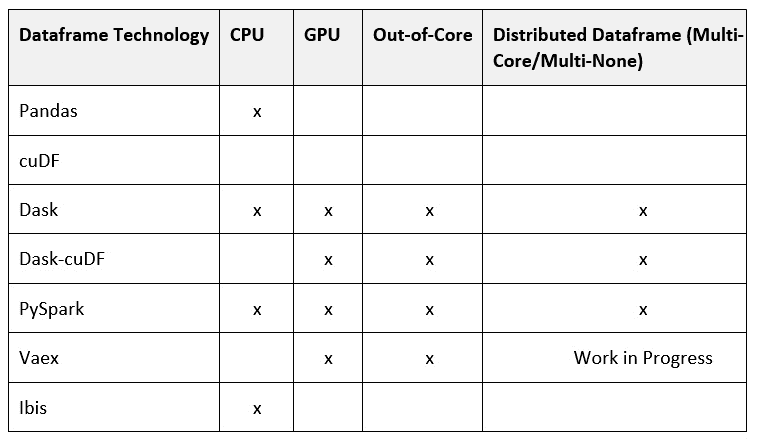
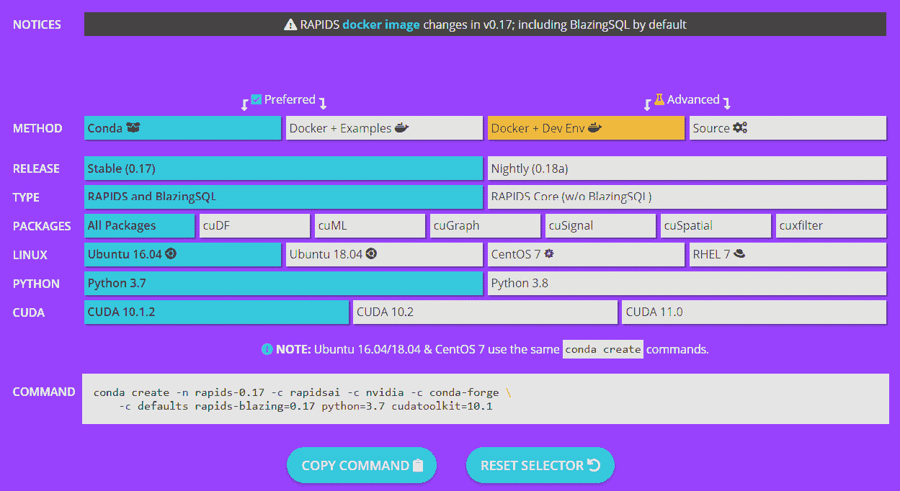
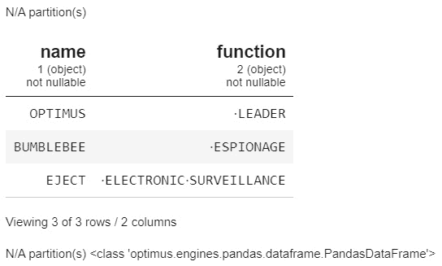
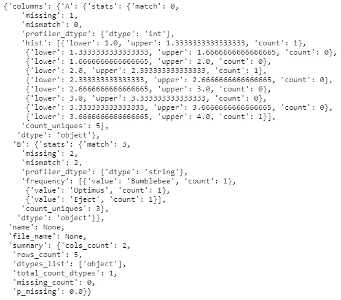

# 一、嗨Optimus！

Optimus 是一个 Python 库，它可以加载、转换和保存数据，并且还专注于处理表格数据。它提供了专门设计的功能，使这项工作对你来说更容易；它可以使用多个引擎作为后端，比如熊猫、 **cuDF** 、 **Spark** 、 **Dask** ，这样你就可以高效地处理小数据和大数据。

Optimus 是*不是*一种 DataFrame 技术:它不是一种在内存中组织数据的新方法，比如 **arrow** ，也不是一种在 GPU 中处理数据的方法，比如 **cuDF** 。相反，Optimus 依靠这些技术来加载、处理、探索和保存数据。

说了这么多，这本书是给所有人看的，大多数是数据和机器学习工程师，他们希望简化为数据处理任务编写代码。无论您是想在笔记本电脑上还是在远程集群中处理大数据还是小数据，无论您是想从数据库还是远程存储中加载数据，Optimus 都提供了让您的数据处理任务变得更简单所需的所有工具。

在这一章中，我们将了解 Optimus 是如何诞生的，以及所有可以用作后端来处理数据的 DataFrame 技术。然后，我们将了解 Optimus 与各种数据帧技术的区别。之后，我们将安装 **Optimus** 和 **Jupyter Lab** ，以便我们准备好在 [*第二章*](B17166_02_Final_SS_epub.xhtml#_idTextAnchor039) *中编码、数据加载、保存和文件格式*。

最后，我们将分析 Optimus 的一些内部功能，以了解它是如何工作的，以及如何利用一些更高级的功能。

关键点:本书不会试图解释每种数据帧技术是如何工作的。互联网上有大量的资源解释这些技术的内部原理和日常使用。Optimus 是一种尝试的结果，旨在创建一种表达性强且易于使用的数据 API，并为用户提供他们所需的大部分工具，以尽可能最简单的方式完成数据准备过程。

我们将在本章中讨论的主题如下:

*   介绍Optimus
*   安装运行Optimus所需的一切
*   使用Optimus
*   发现 Optimus 内部

# 技术要求

为了充分利用本章，请确保您实现了本节中指定的所有内容。

Optimus 可以与多种后端技术一起处理数据，包括 GPU。对于 GPU，Optimus 用的是 **RAPIDS** ，需要 NVIDIA 卡。有关要求的更多信息，请参阅 GPU 配置部分。

要在 Windows 10 上使用 RAPIDS，您需要具备以下条件:

*   Windows 10 版本 2004(操作系统内部版本 202001.1000 或更高版本)
*   CUDA SDK v11.1 中的 CUDA 版本 455.41

你可以在[https://github . com/packt publishing/Data-Processing-with-Optimus](https://github.com/PacktPublishing/Data-Processing-with-Optimus)中找到本章的所有代码。

# 介绍Optimus

Optimus 的开发始于另一个项目。2016 年，我和雨果·雷耶斯·阿尔贝托·邦桑托(Alberto Bonsanto)正在为委内瑞拉的一家全国性零售企业开展一个大数据项目。我们学习了如何使用 PySpark 和 Trifacta 来准备和清理数据，并找到购买模式。

但是这两种技术很快就出现了问题:这些年来，数据有不同的类别/产品名称，一个 10 级分类树，并且来自不同的来源，包括 CSV 文件、Excel 文件和数据库，这给我们的工作流程增加了一个额外的过程，并且不容易引起整理。另一方面，当我们尝试 Trifacta 时，我们需要学习它独特的语法。它还缺少我们需要的一些特性，比如从数据集中的每一列中删除一个字符的能力。除此之外，该工具是闭源的。

我们认为我们可以做得更好。我们希望用 Python 编写一个开源、用户友好的库，让任何没有经验的用户都可以使用 PySpark 应用函数来清理、准备和绘制大数据。

Optimus由此诞生。

之后，我们整合了其他技术。我们想包含的第一个是 cuDF，它支持将处理数据的速度提高 20 倍；此后不久，我们还集成了 Dask、Dask-cuDF 和 Ibis。您可能想知道，为什么有这么多数据帧技术？要回答这个问题，我们需要多了解一些它们的工作原理。

## 探索数据帧技术

如今有许多不同的众所周知的数据帧技术可用。Optimus 可以使用一种或多种现有技术处理数据，包括 pandas、Dask、cuDF、Dask-cuDF、Spark、Vaex 或 Ibis。

让我们来看看和 Optimus 一起工作的一些例子:

*   **熊猫**毫无疑问是更受欢迎的数据帧技术之一。如果你用 Python 处理数据，你可能会经常使用 pandas，但是它有一个重要的警告:pandas 不能处理多核处理。这意味着你不能使用现代 CPU 可以给你的所有能力，这意味着你需要找到一种 hacky 的方式来使用熊猫的所有核心。此外，您不能处理大于 RAM 中可用内存的数据量，因此您需要编写代码来分块处理数据。
*   Dask 出来帮助 Python 数据处理并行化。在 Dask 中，我们有 Dask 数据帧，相当于 pandas 数据帧，可以使用多个内核以及集群中的节点进行并行处理。这使用户能够将数据处理扩展到集群中的数百台机器。你可以启动 100 台机器，处理你的数据，然后快速、简单、廉价地关闭它们。此外，它支持核外处理，这意味着它可以处理大于 RAM 中可用内存的数据量。
*   在用户层面， **cuDF** 和 **Dask-cuDF** 的工作方式与 pandas 和 Dask 几乎相同，但在使用GPU 时，大多数操作的速度要快 20 倍。虽然 GPU 很贵，但与 CPU 相比，它们更物有所值，因为它们处理数据的速度要快得多。
*   **Vaex** 在数据框架领域的相关性正在增长。它可以在核外处理数据，比 Dask 和 PySpark 更容易使用，并且由于其底层的 C 语言实现而被优化为并行处理字符串和统计数据。
*   Ibis 也越来越受欢迎。Ibis 的惊人之处在于，它可以使用多个引擎(类似 Optimus，但专注于 SQL 引擎),你可以用 Python 编写代码，这些代码可以被翻译成 SQL，用于 Impala、MySQL、PostgreSQL 等等。

下面的表格提供了几种技术的快速对比:



(*)取决于所配置的发动机

图 1.1–Optimus 中可用的数据框架技术和功能

关于何时使用每种引擎，有一些明确的指导原则:

*   如果数据帧适合内存，请使用 pandas 如果您有 GPU 并且数据适合内存，请使用 cuDF。在相同的情况下，这几乎总是比使用分布式数据帧技术更快。这最适合实时或接近实时的数据处理。
*   如果您需要处理大于内存的数据，请使用 Dask；如果您拥有大于内存的数据以及多核和/或多节点 GPU 基础架构，请使用 Dask-cuDF。
*   如果您有一台机器并且数据大于内存，请使用 Vaex 如果您需要处理 TB 级的数据，请使用 Spark。这对于适合内存的小数据集来说是很慢的。

现在你明白了这一点，你可以释放 Optimus 的魔力，开始在任何可用的引擎中使用相同的 Optimus API 准备数据。

## 检验 Optimus 设计原则

关于 Optimus 的一个关键点是，我们并没有试图创造一种新的数据框架技术。正如我们已经看到的，实际上有许多惊人的选项，几乎涵盖了所有用例。Optimus 的目的是简化用户处理数据的方式，并将这种能力赋予可能没有任何技术专长的人。为此，Optimus 遵循三个原则:

*   一个 API 来管理它们。
*   *懂技术可选。*
*   *数据类型要尽可能丰富。*

这些是什么意思？让我们详细看看每一个。

### 一个 API 来管理它们

几乎所有的数据框架技术都试图模仿熊猫的 API。然而，同样的功能能做什么有细微的差别，这取决于你如何应用它；有了Optimus，我们想把这一切抽象出来。

我们稍后将对此进行更详细的讨论，但这里有一个简单的例子:您可以使用`.cols`访问器来计算列的平方根，如下所示:

```py
from optimus import Optimus
op = Optimus("dask")
df = op.create.dataframe({"A":[0,-1,2,3,4,5]})
df = df.cols.sqrt("A")
```

如果您想要从 Dask 切换到任何其他引擎，您可以使用以下任何值。每个都将实例化 Optimus 数据帧的不同类:

*   `"pandas"`要用熊猫。这将实例化一个熊猫数据帧。
*   `"dask"`使用达斯克。这将实例化一个 DaskDataFrame。
*   `"cudf"`使用 cuDF。这将实例化一个 CUDFDataFrame。
*   `"dask_cudf"`使用 Dask-cuDF。这将实例化一个 DaskCUDFDataFrame。
*   `"spark"`使用 PySpark。这将实例化一个 SparkDataFrame。
*   `"vaex"`使用 Vaex。这将实例化一个 VaexDataFrame。
*   `"ibis"`使用朱鹭。这将实例化一个 IbisDataFrame。

这种灵活性的一个惊人之处在于，您可以使用 pandas 处理笔记本电脑上的数据样本，然后将任务发送到 Dask-cuDF 或 Spark 集群，使用更快的引擎来处理它。

### 了解技术细节是可选的

熊猫很复杂。用户需要处理技术细节，如行、索引、系列和掩码，而你需要进入低级别并使用 **NumPy/Numba** 从你的 CPU/GPU 获得所有的能量。

有了 Numba，用户在处理数字数据时可以大大提高速度。它在运行时将 Python 函数翻译成优化的机器代码。这仅仅意味着我们可以在 CPU 或 GPU 上编写更快的函数。例如，当我们使用 Optimus 请求一个直方图时，一列的最小值和最大值是在一次传递中计算出来的。

在 Optimus 中，我们试图对每个操作采取更快的方法，而不需要广泛的技术细节知识，以充分利用技术。那是Optimus的工作。

Optimus 中抽象的其他一些数据帧特性包括索引、序列和掩码(PySpark 除外)。在 Optimus 中，你只有列和行；目的是使用电子表格中熟悉的概念，这样当您开始使用 Optimus 时可以软着陆。

在 Optimus 中，您有两个主要的访问器，`.cols`和`.rows`，它们提供了大多数可用的转换方法。例如，您可以使用`df.cols.lower`将一列的所有值转换成小写，而您可以使用`df.rows.drop_duplicates`删除整个数据集中的重复行。这方面的例子将在本书后面讨论。

### 数据类型应该尽可能丰富

所有 DataFrame 技术都有表示整数、小数、时间和日期的数据类型。在 pandas 和 Dask 中，您可以使用 NumPy 数据类型来分配不同类型的整数，例如 int8、int16、int32 和 int64，或者不同的小数类型，例如 float32、float64 等等。

这为用户提供了很多控制来优化数据的保存方式，并减少了内存和磁盘上的数据总量。例如，如果有 100 万行的值在 1 到 10 之间，那么可以将数据保存为`uint8`而不是`inf64`，以减小数据大小。

除了这种内部数据表示之外，Optimus 还可以推断和检测一组更丰富的数据类型，以便您可以理解列中的哪些数据与特定的数据类型(URL、电子邮件、日期等等)相匹配，然后应用特定的函数来处理它。

在 Optimus 中，我们使用术语**质量**来表达三个数据特征:

*   与所推断的数据类型相匹配的值的数量
*   与所推断的数据类型不同的值的数量
*   缺失值的数量

使用`df.cols.quality`方法，Optimus 可以推断每个加载列的数据类型，并返回该列中有多少值匹配其数据类型。在**日期**数据类型的情况下，Optimus 可以推断出日期格式。

以下列表显示了 Optimus 可以检测到的所有数据类型:

*   整数。
*   弦乐。
*   电子邮件。
*   网址。
*   性别。
*   布尔型。
*   美国邮政编码。
*   信用卡。
*   时间和日期格式。
*   对象。
*   数组。
*   电话号码。
*   社会安全号码。
*   HTTP 代码。

许多这些数据类型都有您可以使用的特殊函数，如下所示:

*   URL:模式、域、扩展和查询字符串
*   日期:年、月、日
*   时间:小时、分钟和秒
*   电子邮件:域和域扩展

最好的部分是你可以定义你自己的数据类型并为它们创建特殊的函数。我们将在本书的后面了解更多。我们还将了解可以用来处理或删除匹配、不匹配和缺失值的函数。

现在我们已经了解了 Optimus 是如何工作的，让我们在您的机器上运行它。

# 安装运行 Optimus 所需的一切

要开始使用 Optimus，你需要一台安装了支持 Python、 **PIP 包**和 **Conda** 的 Windows、Ubuntu 或 macOS 的笔记本电脑。如果你是 Python 的新手，PIP 是主包管理器。它允许 Python 用户安装和管理扩展 Python 标准库功能的包。

安装 Optimus 最简单的方法是通过 PIP。它将允许我们在几分钟内开始运行示例。在本节的后面，我们将看到一些 Optimus 在笔记本、shell 终端和 Python 读取的文件上运行的例子，但是在此之前，我们需要安装 Optimus 及其依赖项。

首先，让我们安装 **Anaconda** 。

## 安装蟒蛇

Anaconda 是 Python 和 R 编程语言的免费开源发行版。发行版附带了Python 解释器、Conda 以及各种与机器学习和数据科学相关的包，这样您可以更容易、更快地开始。

要在任何系统上安装 Anaconda，您可以使用安装程序或通过系统软件包管理器安装它。在 Linux 和 macOS 的情况下，您可以分别使用 APT 或 Homebrew 安装 Anaconda。

在 Linux 上，使用以下命令:

```py
sudo apt-get install anaconda # on Linux
```

对于 macOS 和 Windows，请前往[https://www.anaconda.com/products/individual](https://www.anaconda.com/products/individual)。下载与您的系统最匹配的 Windows 文件，下载后双击该文件开始安装过程:

```py
brew cask install anaconda # on macOS
```

现在安装了 Anaconda，让我们安装 Optimus。

## 安装Optimus

安装了 Anaconda 之后，我们可以使用 conda 来安装 Optimus:

正如 Conda 网站上的所述，Conda 为任何语言提供了*包、依赖和环境管理。*有了 Conda，我们可以管理多个 Python 环境，而不会因为依赖关系而污染我们的系统。例如，您可以创建一个使用 Python 3.8 和 pandas 0.25 的 Conda 环境，以及另一个使用 Python 3.7 和 pandas 1.0 的环境。让我们来看看:

1.  首先，我们需要打开 Anaconda 提示符。这只是 Conda 附带的命令行界面:
    *   *对于 Windows* :从开始菜单，搜索并打开 **Anaconda 提示**。
    *   *对于 macOS* :打开 Launchpad，点击终端图标。
    *   *对于 Linux* :打开一个终端窗口。
2.  现在，在终端中，我们将创建一个名为 Optimus 的 Conda 环境来创建一个干净的 Optimus 安装:

    ```py
    conda create -n optimus python=3.8
    ```

3.  现在，您需要使用下面的命令从`(base)`环境切换到`(optimus)`环境:

    ```py
    conda activate optimus
    ```

4.  在你的终端上运行下面的命令将会安装 Optimus 及其基本特性，并准备好进行测试:

    ```py
    pip install pyoptimus
    ```

5.  If you have done this correctly, running a simple test will tell us that everything is correct:

    ```py
    python -c 'import optimus; optimus.__version__'
    ```

    现在，我们准备使用Optimus！

我们也推荐使用 **Jupyter 笔记本**。

## 安装 JupyterLab

如果你在过去的 5 年里没有生活在岩石下，你可能知道 Jupyter 笔记本。 **JupyterLab** 是 Jupyter Notebook 的下一代:它是一个基于 web 的交互式开发环境，用于编码。Jupyter(简称)将帮助我们轻松地测试和修改我们的代码，并将帮助我们更快地测试我们的代码。让我们来看看:

1.  要安装 JupyterLab，进入终端，如*安装 Optimus* 一节所述，运行以下命令:

    ```py
    conda install -c conda-forge jupyterlab
    ```

2.  此时，您可以简单地运行 Jupyter。然而，我们将安装几个方便的扩展来调试 Dask 并跟踪 GPU 利用率和 RAM:

    ```py
    conda install nodejs conda install -c conda-forge dask-labextension jupyter labextension install dask-labextension jupyter serverextension enable dask_labextension
    ```

3.  现在，让我们使用下面的命令运行 Jupyter:

    ```py
    jupyter lab --ip=0.0.0.0
    ```

4.  您可以使用任何浏览器访问 Jupyter:


图 1.2–JupyterLab 用户界面

接下来，我们来看看如何安装 RAPIDS。

## 安装急流

如果你想让使用带有 Optimus 的 GPU 引擎，你必须采取一些额外的步骤。

**RAPIDS** 是 NVIDIA 开发的一组库，用于使用 GPU 处理端到端的数据科学管道；cuDF 和 Dask-cuDF 就是这些库中的两个。Optimus 可以使用这两者以本地和分布式的方式处理数据。

要让 RAPIDS 工作，您需要一个 GPU、NVIDIA Pascal 或更好的处理器，计算能力为 6.0+。你可以通过查看英伟达网站上的表格来检查计算能力:[bit.ly/cc_gc](http://bit.ly/cc_gc)。

首先，让我们在 Windows 上安装 RAPIDS。

### 在 Windows 10 上安装 RAPIDS

在撰写本文时(2020 年 12 月)还不完全支持 RAPIDS，所以你必须使用 Linux 版本 2 的 ( **WSL2** )的 **Windows 子系统。WSL 是 Windows 10 的一个特性，可以让你直接在 Windows 上运行原生的 Linux 命令行工具。**

您将需要以下物品:

*   Windows 10 版本 2004(操作系统内部版本 202001.1000 或更高版本)。你必须注册才能获得 Windows Insider 预览版，特别是开发者频道。这是 WSL2 虚拟机访问 GPU 所必需的:[https://insider.windows.com/en-us/](https://insider.windows.com/en-us/)。
*   CUDA SDK v11.1 中的 CUDA 版本 455.41。您必须使用 NVIDA CUDA 驱动程序的特殊版本，您可以从 NVIDIA 的网站下载这些驱动程序。您必须加入 NVIDIA 开发者计划才能访问该版本；搜索`WSL2 CUDA Driver`会引导你找到它。

以下是步骤:

1.  安装 Windows 的开发人员预览版。确保您点击**更新**旁边的复选框来安装其他推荐的更新。
2.  从 NVIDIA 开发者程序安装 Windows CUDA 驱动程序。
3.  通过启用**虚拟** **机器** **平台**可选功能来启用 WSL 2。你可以在这里找到更多步骤:[https://docs.microsoft.com/en-us/windows/wsl/install-win10.](https://docs.microsoft.com/en-us/windows/wsl/install-win10%20)
4.  从 Windows Store 安装 WSL(Ubuntu-20.04 确认工作)。
5.  在 WSL VM 上安装 Python，用 Anaconda 测试。
6.  转至本章的*安装急流*部分。

### 在 Linux 上安装 RAPIDS

首先，你需要安装 CUDA 和 NVIDIA 驱动。如果您的机器正在运行依赖于特定 CUDA 版本的代码，请特别注意。有关 CUDA 和 NVIDIA 驱动程序兼容性的更多信息，请查看[bit.ly/cuda_c](http://bit.ly/cuda_c)。

如果没有兼容的 GPU，可以使用 Google Cloud Platform、Amazon 或 Azure 等云提供商。

在这种情况下，我们将使用谷歌云平台。截至 2020 年 12 月，你可以获得一个有 300 美元的账户来使用。创建帐户后，您可以设置一个 VM 实例来安装 RAPIDS。

要在谷歌云平台上创建一个虚拟机实例，请遵循以下步骤:

1.  首先，进入汉堡菜单，点击**计算引擎**，选择**虚拟机实例**。
2.  Click on **CREATE INSTANCE**. You will be presented with a screen that looks like this:

    图 1.3–谷歌云平台实例创建

3.  选择可以提供 GPU 的地区。并非所有区域都有可用的 GPU。完整的列表，请查看 https://cloud.google.com/compute/docs/gpus 的[。](https://cloud.google.com/compute/docs/gpus)
4.  确保从下拉菜单中选择 **N1** 系列。
5.  Be sure to select an OS that's compatible with the CUDA drivers (check the options available here: [https://developer.nvidia.com/cuda-downloads](https://developer.nvidia.com/cuda-downloads)). After the installation, you will be using 30 GB of storage space, so make sure you assign enough disk space:

    图 1.4–谷歌云平台操作系统选择

6.  Check the Allow **HTTP traffic** option:

    图 1.5–谷歌云平台操作系统选择

7.  最后，点击页面底部的**创建**按钮:


图 1.6–Google 云实例创建

现在，您已经准备好安装 RAPIDS 了。

### 安装 RAPIDS

在检查你的 GPU 和 Optimus 一起工作后，进入[https://rapids.ai/start.html](https://rapids.ai/start.html)。选择符合您需求的选项，并将命令部分的输出复制到您的命令行界面:



图 1.7–谷歌云平台操作系统选择

安装过程完成后，您可以通过导入库并获取其版本来测试 RAPIDS:

```py
python -c 'import cudf; cudf.__version__'
```

接下来，让我们学习如何安装**线圈**以简化设置。

## 使用盘绕的

Coiled 是一个部署即服务库，用于扩展 Python，为用户提供 Dask 和 Dask-cuDF 集群。它将开发人员从数据角色中分离出来，使数据专业人员能够花更少的时间来设置网络、管理 Docker 映像群、创建 AWS IAM 角色以及其他他们不得不处理的设置，以便他们能够将更多的时间花在实际工作上。

要在 Optimus 上使用 Coiled 集群，我们只需将最少的配置传递给 Optimus 初始化函数，并将 Coiled 提供的令牌包含在参数中；要获取此令牌，您必须在[https://cloud . coiled . io](https://cloud.coiled.io)上创建一个帐户，并从您的仪表盘获取令牌，如下所示:

```py
op = Optimus(coiled_token="<your token here>", n_workers=2)
```

在这个例子中，我们使用一个盘绕令牌初始化 Optimus，并将 workers 的数量设置为`2`。Optimus 将初始化 Dask 数据帧，并处理 Coiled 创建的到集群的连接。在此之后，Optimus将正常工作。

当使用 Coiled 时，在远程集群中的包和本地机器中的包之间保持相同的版本是很重要的。为此，您可以使用它的命令行工具安装一个 Coiled 软件环境作为本地 conda 环境。为了使用 Optimus，我们将使用一个名为`optimus/default`的特定软件环境:

```py
coiled install optimus/default 
conda activate coiled-optimus-default
```

在前面的例子中，我们告诉`coiled install`创建 conda 环境，然后使用`conda activate`开始使用它。

## 使用码头集装箱

如果你知道如何使用Docker**并且你已经在你的系统上安装了它，你可以使用它在工作环境中快速设置 Optimus。**

要在 Docker 环境中使用 Optimus，只需运行以下命令:

```py
docker run -p 8888:8888 --network="host" optimus-df/optimus:latest
```

这将从 Docker Hub 获取最新版本的 Optimus 映像，并在其中运行一个笔记本进程。您将看到如下内容:

```py
To access the notebook, open this file in a browser:
    file://...
Or copy and paste one of these URLs:
    http://127.0.0.1:8888/?token=<GENERATED TOKEN>
```

只需复制地址并粘贴到你的浏览器中，确保有相同的令牌，你就可以使用安装了 Optimus 的笔记本了。

# 使用Optimus

现在我们已经安装了 Optimus，我们可以开始使用它了。在本节中，我们将介绍一些主要功能以及如何使用它们。

## Optimus实例

您使用 Optimus 实例来配置引擎，以及加载和保存数据。让我们看看这是如何工作的。

一旦 Optimus 安装到您的系统上，您就可以在 Python 环境中使用它了。让我们导入`Optimus`类并实例化它的一个对象:

```py
from optimus import Optimus
op = Optimus(engine=pandas)
```

在 Optimus 中，我们称数据帧技术为引擎。在前面的例子中，我们使用熊猫作为基本引擎来设置Optimus。非常容易！

现在，让我们在远程集群中使用 Dask 实例化 Optimus。为此，我们必须将参数中的配置传递给`Optimus`函数，特别是`session`参数，它允许我们传递一个 Dask 客户端:

```py
from dask.distributed import Client
client = Client("127.0.0.105")
op = Optimus(engine="dask", session=client)
```

在前面的代码中，我们实例化了一个 Dask 分布式客户端，并将其传递给 Optimus 初始化。

要使用不同数量的工作线程进行初始化，也可以传递一个命名参数:

```py
op = Optimus(engine="dask", n_workers=2)
```

这将自动创建一个本地客户端，而不是像前面的例子那样只传递一个。

使用 Dask，您现在可以访问 100 多个函数来转换字符串，以及过滤和合并数据。

### 从任何来源保存和加载数据

使用 Optimus 实例，您可以轻松地从文件或数据库中加载数据帧。要加载一个文件，只需调用不同格式(`.csv`、`.parquet`、`.xlsx`等)的可用方法之一，或者只需调用通用`file`方法，这将推断出文件格式和其他参数:

```py
op.load.csv("path/to/file.csv")
op.load.file("path/to/file.csv")
```

对于数据库或外部存储桶，Optimus 可以将连接作为不同的实例来处理，这允许我们维护操作并清除在不同加载例程中可能重复或不重复的任何凭证和地址:

```py
db = op.connect.database( *db_args )
op.load.database_table("table name", connection=db)
conn = op.connect.s3( *s3_args )
op.load.file("relative/path/to/file.csv", connection=conn)
```

另一方面，要保存到文件或数据库的表中，可以使用以下代码:

```py
df.save.csv("relative/path/to/file.csv", connection=conn)
df.save.database_table("table_name", db=db)
```

现在我们已经启动了引擎，并且我们的数据已经准备好，让我们看看如何使用 Optimus 数据框架来处理它。

## Optimus数据框

Optimus 的主要目标之一是尝试提供一个可理解的、易于记忆的 API，以及清理和整理数据所需的所有工具。在这一节中，我们将重点介绍 Optimus 区别于现有 DataFrame 技术的主要特性。

### 使用访问者

Optimus 数据框架可以用自然语言进行修改，将不同的可用方法分成组件。例如，如果我们想要修改整个列，我们可以使用`.cols`访问器中可用的方法，而如果我们想要通过特定列的值过滤行，我们可以使用`.rows`访问器中的方法，等等。

操作的一个例子可以是列重命名:

```py
df.cols.rename("function", "job")
```

在这种情况下，我们只是将`function`列重命名为`"job"`，但是修改后的数据帧不会保存在任何地方，所以正确的做法是这样的:

```py
df = df.cols.rename("function", "job") 
```

此外，大多数操作返回数据帧的修改版本，以便可以调用这些方法，并将它们链接起来:

```py
df = df.cols.upper("name").cols.lower("job") 
```

当 Optimus 实例化一个数据帧时，它会对使用所选引擎制作的核心数据帧进行抽象。支持的每个引擎都有一个 DataFrame 类。例如，Dask 数据帧保存在一个名为`DaskDataFrame`的类中，该类包含了 Optimus 的所有实现。关于其内部的细节将在本书的后面讨论。

正如我们前面提到的，要在 Optimus 数据帧上使用这些方法中的大多数，必须使用访问器，这些访问器根据调用它们的位置来分隔可能具有不同行为的不同方法:

```py
df.cols.drop("name")
```

前面的代码将删除整个`"name"`列。以下命令返回不同的数据帧:

```py
df.rows.drop(df["name"]==MEGATRON)
```

前面的代码将删除“`name"`列中值与`MEGATRON`值匹配的行。

### 获取更丰富的数据帧数据

Optimus 的目标是在需要的时候给用户重要的信息。通常，您会使用`head()`或`show()`来打印数据帧信息。当您使用`display`时，Optimus 可以提供额外的有用信息:

```py
df.display()
```

这会产生以下输出:



图 1.8–Optimus 数据框显示示例

在前面的屏幕截图中，我们可以看到关于所请求的数据帧的信息，例如列和行的数量、所有列及其各自的数据类型、一些值，以及分区的数量和所查询的数据帧的类型(在本例中是`DaskDataFrame`)。当您在转换数据以确保您在正确的轨道上时，这些信息是有用的。

### 操作时自动铸造

Optimus 将根据您应用的操作转换列的数据类型。例如，为了计算的最小值和最大值，Optimus 会将列转换成浮点数，并忽略非数字数据:

```py
dfn = op.create.dataframe({"A":["1",2,"4","!",None]}) 
dfn.cols.min("A"), df.cols.max("A")
(1.0, 4.0)
```

在前面的例子中，Optimus 忽略了`"!"`和`None`值，只分别返回较低和较高的数值，在本例中是`1.0`和`4.0`。

### 管理输出列

对于大多数列方法，我们可以选择复制每个输入列并保存到另一个列，这样操作就不会修改原始列。例如，要保存一个字符串类型列的大写副本，我们只需要调用同一个`df.cols.upper`和一个额外的参数`output_cols`:

```py
df.cols.capitalize("name", output_cols="cap_name")
```

这个参数叫做`output_cols`，它是复数，因为当多个输入列被传递给方法时，它支持多个名称:

```py
df.cols.upper(["a", "b"], 
              output_cols=["upper_a", "upper_b"])
```

在前面的示例中，我们将结果数据帧中的列数增加了一倍，一对保持不变，另一对将其值转换为大写。

### 压型

为了深入了解 Optimus 正在转换的数据，我们可以使用`df.profile()`，它以 Python 字典的形式提供有用的信息:

```py
df = op.create.dataframe({"A":["1",2,"4","!",None],
                          "B":["Optimus","Bumblebee", 
                               "Eject", None, None]}) 
df.profile(bins=10)
```

这会产生以下输出:



图 1.9–分析器输出

在前面的屏幕截图中，我们可以看到数据，例如每一列，以及它的名称、缺失值和不匹配值、它的推断数据类型、它的内部数据类型、直方图(或分类列中按频率排列的值)和唯一值。对于数据帧，我们有数据帧的名称、文件的名称(如果数据来自一个文件)、有多少列和行、数据类型的总数、有多少丢失的行以及丢失值的百分比。

### 形象化

Optimus 最有用的特性之一是它能够以各种视觉形式绘制数据帧，包括:

*   频率图表
*   直方图
*   箱线图
*   散点图

为了实现这一点，Optimus 使用了 Matplotlib 和 Seaborn，但是您也可以获得 Python 字典格式的必要数据，以便与任何其他绘图库或服务一起使用。

### Python 字典输出

默认情况下，Optimus 中的每个输出操作都会给我们一个字典(除了一些情况，比如作为聚合，默认情况下会给我们另一个数据帧)。词典可以很容易地转换并保存到 JSON 文件中，以备报告或向 API 提供数据时使用:

```py
df.columns_sample("*")
```

### 字符串、数字和编码工具

Optimus 尝试提供现成的工具来处理字符串和数字，并为数据准备过程提供工具，以便您可以创建机器学习模型。

#### 字符串聚类

`"NYC"`和`"New York City"`。在这种情况下，它们指的是同一个东西。

#### 处理异常值

发现异常值是统计数据框架最常见的应用之一。当发现异常值时，有各种可能的方法会得到我们不同的结果，比如 **z-score** 、**指纹**、 **n-gram 指纹**等等。对于 Optimus，这些方法是作为备选方案提供的，因此您可以适应大多数情况。

#### 编码技术

`string_to_index`，它允许我们将分类数据转换成数字数据。

## 技术细节

当处理分布式数据帧技术时，有两个概念出现，即是 Optimus 设计的一个组成部分。这些都是**懒**和**急**的执行。

让我们探索一下这在 Optimus 中是如何工作的。

### 分布式引擎以一种懒惰的方式处理数据

例如，在 Dask 中，当你对数据帧应用一个函数时，它不会像在 pandas 中那样被立即应用。您需要通过调用`df.execute()`来显式地触发这个计算，或者在调用触发这个处理的其他操作时隐式地触发这个计算。

当明确请求时，Optimus 利用这个功能来触发所有的计算。例如，当我们请求一个数据集的概要文件时，每一个操作，例如**直方图计算**、**前 n 个值**和**数据类型推断**，都被推送到一个**有向无环图** ( **DAG** )中的一个簇中，并被并行执行。

下面的展示了在 DAG 中可视化的并行执行的多个操作:


图 1.10–在 Dask 中可视化 DAG

### 聚合返回计算操作(急切执行)

正如我们前面提到的，分布式引擎以一种懒惰的方式处理聚合。Optimus 触发聚合，这样你就可以立即看到结果。

### 触发执行

如果被请求，Optimus能够立即执行操作。这只适用于支持延迟操作的引擎，比如 Dask 和 PySpark。这样，当您知道工作流程中的某些操作会发生变化时，我们可以减少计算时间:

```py
df = df.cols.replace("address", "MARS PLANET",
                     "mars").execute()
```

在前面的例子中，我们用`"mars"`替换了`address`列上每个带有`"MARS PLANET"`的匹配，然后保存了这个操作的缓存。

但是，有一些操作或方法也会触发所有之前延迟的操作。让我们来看看其中的一些案例:

*   *请求样本*:例如，在任何延迟函数后调用`df.display()`将需要计算最终数据。为此，Optimus 会在请求任何种类的输出之前触发所有延迟的操作；当我们调用任何其他输出函数时，也会发生这种情况。
*   *请求概要文件*:当调用`df.profile()`时，一些聚合是在后台完成的，比如计算唯一值、不匹配值和缺失值。此外，获取每一列的频繁值或直方图计算将需要之前已经执行的延迟函数。

当使用分布式数据帧技术时，当一个操作被执行时，数据被执行并存储在每个工人中。在 Dask 的例子中，这个函数是`cache`，当我们在 Optimus 数据帧上调用`execute`时，这个函数就会被调用。注意，如果我们直接在 Dask 数据帧上调用`compute`,所有数据都将被带到客户端，如果数据太大，这可能会导致我们系统中的内存问题。

# 发现Optimus内部

Optimus 旨在方便非技术用户和开发人员使用。一旦你知道了一些内部机制是如何工作的，你就会知道一些转换是如何工作的，并且希望能够避免任何意外的行为。此外，如果情况需要，你可以扩展 Optimus 或者进行更高级的或者特定引擎的改造。

## 发动机

Optimus 处理初始化任何引擎所需的所有细节。虽然`*args`或者`**kwargs`的说法。

Optimus 总是保留一个对你初始化的引擎的引用。例如，如果您想从 Optimus 实例获得 Dask 客户机，您可以使用以下命令:

```py
op.client
```

这将向您显示以下信息:


图 1.11–Optimus 中的 Dask 客户端对象

关于 Optimus 的一个有趣的事情是你可以同时使用多个引擎。这一开始可能看起来很奇怪，但是如果你有创意的话，它会给你带来惊人的机会。例如，您可以将 Spark 与 pandas 结合起来，前者用于从数据库加载数据，后者用于实时分析数据样本，或者使用 pandas 加载数据，并使用 Ibis 将指令作为一组 SQL 指令输出。

在实现层面，所有的引擎都继承自`BaseEngine`。让我们将所有引擎功能包装成三个主要操作:

*   **初始化**:在这里，Optimus处理你选择的引擎的所有初始化过程。
*   `op.create.dataframe`根据选择的引擎，将映射到数据帧的创建。
*   `op.load`处理文件加载和数据库。

## 数据帧后面的数据帧

Optimus DataFrame 是一个包装器，它公开并实现一组函数来处理字符串和数字数据。在内部，当 Optimus 创建一个 DataFrame 时，它使用您选择的引擎来创建它，以便在`.data`属性中保存一个引用。以下是这方面的一个例子:

```py
op = Optimus("pandas")
df = op.load.csv("foo.txt", sep=",")
type(df.data)
```

这会产生以下结果:

```py
Pandas.core.frame.DataFrame
```

关键的一点是 Optimus 总是将数据表示为数据帧，而不是序列。这很重要，因为在熊猫中，例如，一些操作返回一个序列作为结果。

在熊猫中，使用以下代码:

```py
import pandas as pd
type(pd.DataFrame({"A":["A",2,3]})["A"].str.lower())
pandas.core.series.Series
```

在 Optimus 中，我们使用以下代码:

```py
from optimus import Optimus
op = Optimus("pandas")
type(op.create.dataframe({"A":["A",2,3]}).cols.lower().data)
pandas.core.frame.DataFrame
```

如您所见，这两个值具有相同的类型。

## 元

Meta 用于保存一些不属于核心数据集中的数据，但是对于一些操作是有用的，比如将 top-N 操作的结果保存在特定的列中。为此，我们将元数据保存在数据帧中。这可以使用`df.meta`来访问。使用这种元数据有三个主要原因。让我们来看看每一个。

### 保存文件信息

如果从文件中加载数据帧，它会保存文件路径和文件名，这对跟踪正在处理的数据很有用:

```py
from optimus import Optimus 
op = Optimus("pandas") 
df = op.load.csv("foo.txt", sep=",")
df.meta
```

您将获得以下输出:

```py
{'file_name': 'foo.txt', 'name': 'foo.txt'}
```

### 数据剖析

数据清理是一个迭代过程；也许你想计算直方图或数据集中的前 N 个值来找出你想删除或修改的数据。当您使用`df.profile()`计算数据分析时，Optimus 将根据数据类型计算直方图或频率表。这个想法是，在处理`Actions`数据时，我们可以确定直方图或前 N 名值何时应该重新计算。接下来，您将看到**动作**是如何工作的。

### 行动

正如我们之前看到的，Optimus 试图缓存某些操作，以确保您不会浪费宝贵的计算时间在没有改变的数据上重新运行任务。

为了优化缓存的使用和重建，Optimus 处理了多个内部操作来进行相应的操作。

您可以通过尝试以下代码来检查操作是如何保存的:

```py
from optimus import Optimus 
op = Optimus("pandas") 
df = op.load.csv("foo.txt", sep=",")
df = df.cols.upper("*")
```

要检查应用于数据帧的操作，请使用以下命令:

```py
df.meta["transformations"]
```

您将获得一个 Python 字典，其中包含操作名称和受该操作影响的列:

```py
{'actions': [[{'upper': ['name']}], [{'upper': ['function']}]]}
```

关键的一点是，不同的操作对如何分析数据以及如何处理数据帧的元数据有不同的影响。每个 Optimus 操作都有一个与之相关联的唯一动作名称。让我们看看 Optimus 中可用的五个操作，以及它们对数据帧的影响:

*   `df.cols.lower()`或`df.cols.sqrt()`。
*   `df.rows.set()`或`df.rows.drop_duplicate()`。
*   `df.cols.copy()`。在内部，*用源元数据列在`dict`元上创建一个新的键。如果您复制 Optimus 列，则不会对其触发分析操作。*
*   `df.cols.rename()`。在内部，它只是重命名元字典中的一个键。如果您复制 Optimus 列，则不会对其触发分析操作。
*   `df.cols.drop()`。在内部，它*删除*元字典中的一个键。如果您复制 Optimus 列，则不会对其触发分析操作。

## 虚拟函数

有些功能并不适用于所有的数据帧技术。在 Spark 和 Dask 等分布式数据帧中使用了`.repartition()`、`.cache()`和`compute()`等函数来触发 workers 中的操作，但这些概念在 pandas 或 cuDF 中并不存在。为了在所有引擎中保持 API 的内聚性，我们可以简单地使用`pass`或返回相同的 DataFrame 对象。

## 诊断

当您使用 Dask 和 Spark 作为 Optimus 引擎时，您可以访问它们各自的诊断仪表板。对于非常复杂的工作流，了解已经执行了哪些操作以及哪些操作可能会降低整个流程的速度会非常方便。

让我们看看 Dask 的情况。要访问诊断面板，可以使用以下命令:

```py
op.client()
```

这将为您提供有关 Dask 客户端的信息:


图 1.12-Dask 客户信息

在这种情况下，您可以在浏览器中指向[http://192 . 168 . 86 . 249:39011/status](http://192.168.86.249:39011/status)来查看 Dask 诊断仪表板:


图 1.13–Dask 诊断仪表板

关于诊断的深入讨论超出了本书的范围。要了解有关该主题的更多信息，请访问[https://docs . dask . org/en/latest/diagnostics-distributed . html](https://docs.dask.org/en/latest/diagnostics-distributed.html)。

# 总结

在这一章中，我们学习了 Optimus 的基本功能，以及基于你所使用的基础设施，哪一个可用的引擎是最合适的。您还了解了为什么使用 Optimus 而不是普通的数据帧是有益的，以及 Optimus 与现有的数据帧技术有什么不同。然后，我们学习了如何在 Windows、macOS 和 Linux 上安装 Optimus，既可以在云上安装，也可以使用外部服务，如 **Coiled** 。

最后，我们深入探究了 Optimus 的内部结构，以便您更好地理解它是如何工作的，以及它是如何让您发挥创造力并充分利用 Optimus 的。

在下一章，我们将学习如何从文件、数据库和远程位置(如亚马逊 S3)加载和保存数据。