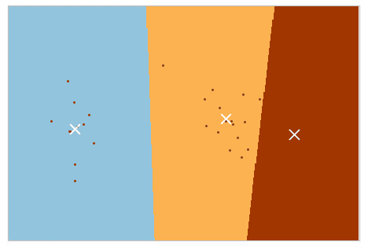

# *第八章*:机器学习

到目前为止，我们已经涵盖了从数据清理、数据探索、特征创建到创建**机器学习** ( **ML** )模型所需的所有工具。

现在，我们将探索 Optimus 如何帮助您在一行代码中轻松地创建、评估和使用最常见的 ML 算法。这样，你就不必使用除 Optimus 之外的技术了。

因此，在本章中，我们将了解以下主题:

*   Optimus 作为一个内聚的**应用编程接口** ( **API** )
*   实施列车测试分割程序
*   Optimus 中的培训模型

# 技术要求

Optimus 可以配合多种后端技术处理数据，包括**图形处理单元**(**GPU**)。对于 GPU，Optimus 使用的是**实时自动化人员识别系统** ( **激流**)，需要 NVIDIA 卡。更多需求请到 [*第一章*](B17166_01_Final_SB_epub.xhtml#_idTextAnchor015)*嗨擎天柱 *GPU 配置*部分！*。

你可以在[https://github . com/packt publishing/Data-Processing-with-Optimus](https://github.com/PacktPublishing/Data-Processing-with-Optimus)找到本章的所有代码。

# Optimus 作为一个内聚的 API

Optimus 的主要目标是创建一个内聚的 API，这样你就可以用最简单的方式处理数据和创建 ML 模型。在 Optimus 中，您有一个`ml`访问器，它将允许您访问 Optimus 中实现的 ML 算法。

ML 算法可能很难并行实现，例如，Spark 中没有实现带有噪声的应用程序的**基于密度的空间聚类** ( **DBSCAN** )。对于 Optimus，我们实现了所有库中通用的算法，而是我们认为必须的，但是在一个特定的库中遗漏了的算法。首先，让我们看看哪个库支持每个 Optimus 引擎，如下所示:

*   熊猫使用 scikit-learn。
*   Dask 使用 Dask-ML。
*   cuDF 使用 cuML。
*   Dask cuDF 使用 cuML。
*   Vaex 使用 vaex.ml。
*   Spark 使用 MLlib。
*   Ibis 还没有可用的 ML 库。

说了这么多，现在来看看每个库中都实现了哪些算法。看看下面的概述:


图 8.1–每个库中实现的算法

与数据帧一样，Optimus 试图创建一个层来抽象底层细节。下面我们来列举一些细节，让你能确定擎天柱能在哪些地方增值，如下:

*   正如我们所看到的，每个引擎都有自己的库来处理 ML，所以您不必学习使用每个库。
*   pandas/Dask 算法非常依赖 NumPy，所以你在创建模型的时候要处理一些底层的数据转换。
*   Spark 并不遵循其他 ML 库所遵循的 scikit-learn API。所以，如果你想使用 Spark，你需要学习一个新的 API。

通过创建一个层来抽象这些细节，我们将为 Optimus 的用户提供一个更简单的界面。现在，让我们来看看擎天柱是如何帮助我们的。

## 擎天柱如何提供帮助

当你想创建一个模型的时候，有一个过程可以保证你的模型能够获得它所能达到的最好的性能。在确保您已经清理、准备和特征工程化了您现在需要的数据之后，根据您想要实现的模型，您需要将您的数据拆分为训练和测试数据，并使用 k-fold 方法评估您的数据。下图概括了 Optimus 如何在内部处理模型:


图 8.2–创建模型的 Optimus 流程

让我们看看擎天柱如何帮助这个任务。

# 实施列车测试分割程序

将您的数据分成两个数据集的主要思想是，您可以在一个数据集中训练您的模型，然后用新数据测试您的模型性能。当数据集被拆分为训练集和测试集时，大部分数据进入训练集，一小部分用于测试。

用于拟合模型的子集称为训练数据集。这包含示例**输入和输出**(**I/o**)，它们将训练符合参数的模型。

另一方面，当测试数据集上的输入被提供给模型时，根据这些输入做出的结果预测将与预期值进行比较，以评估模型的准确性。

## 何时使用列车测试分离程序

训练测试分割评估程序可用于分类或回归问题。

要使用的数据集应该足够大以代表问题域，覆盖每个常见案例和足够多的不常见案例。基于此，可能需要整个数据集中的数千甚至数百万个示例。

除非模型有足够的数据，否则它不能有效地将输入映射到输出，也不会在测试集中有所需的数据来生成模型的性能度量。

这个过程方便的另一个原因是为了获得更好的计算效率。当涉及到培训时，一些模型可能非常昂贵，并且多轮评估可能很难处理。

## 测试尺寸

训练测试分割评估有一个关键参数，即数据集的分割率。对于训练集或测试集，这通常表示为 0 到 1 之间的数字，这意味着值为 0.2 的测试集将拥有原始数据集中 20%的内容。

所有情况都没有一个完美的比例或百分比。我们必须以覆盖所有项目目标的方式分配分割，包括培训、评估和测试模型的实际成本，等等。

常见的测试大小包括大小在 0.2 到 0.5 之间的测试集。

现在我们知道了如何实现一个训练测试分割模型评估过程，让我们看看如何在 Optimus 中使用它。

在 Optimus 中，这个过程由模型内部处理，使用`test_size`参数。假设我们想要应用一个线性回归模型，并使用 20%的可用数据作为测试数据来测试模型性能。我们可以通过下面的代码实现这一点:

```
df.ml.linear_regression(['reclat','reclong'], 'mass(g)', test_size=0.2)  
```

在前面的例子中，我们将线性回归模型应用于数据集的`reclat`和`reclong`列。

## 可重复的训练测试分割

行被随机分配给训练集和测试集，以便样本具有代表性。

因此，如果您想要比较结果，您需要为分割数据集时使用的伪随机数生成器设置一个种子。这样，将使用原始数据集中相同的一组值来拟合和评估模型。

这可以通过在我们将用来创建 ML 模型的方法上设置`random_state`参数来实现。

## 使用 k 倍交叉验证

交叉验证或 k 倍交叉验证是一种常用的技术，用于评估 ML 模型。这包括将数据分成 *k* 组，并将 *n* 部分的每一个与其余部分进行比较。这种方法易于理解，并且与训练-分割方法相比，通常导致更少的有偏模型。该方法最好表示如下:


图 8.3–k 倍交叉验证的工作原理

例如，如果我们在五个折叠上测试我们的模型，我们将处理如图*图 8.3* 所示的数据。

我们将回顾所有这些方法，以便更好地理解如何测试我们的模型，但是 Optimus 内部使用了 k-fold 技术。

# 在 Optimus 中训练模型

现在我们知道了测试/训练、分割和交叉验证过程是如何工作的，让我告诉你一些令人惊奇的事情。您不必为配置和编写代码来使这个过程工作而挣扎，因为 Optimus 会为您完成繁重的工作。

我们来看看 Optimus 中可用的 ML 型号。

## 线性回归

线性回归是一种监督的 ML 算法，对于找出变量之间的联系非常有用。通过将线性方程分配给我们现有的数据，我们可以使用新数据并预测输出，如下图所示:


图 8.4-近似于一簇点的直线

在前面的图中，我们可以看到一条近似于一簇点的线。让我们看看如何计算这个近似值。

首先，让我们从使用以下代码创建数据集开始:

```
import numpy as np 
size = 10000 
data = { 
    'length':[round(random.uniform(1,2),1) for i in range(size)],  
    'width': [round(random.uniform(1,1.5),1) for i in range(size)],  
    'height': [random.randint(20,50) for i in range(size)], 
    'type': [random.randint(0,1) for i in range(size)] 
} 

df = op.create.dataframe(data).repartition(4).execute() 
df['weight'] = df['height'] * df['width'] * df['length'] * [random.uniform(1,1) for i in range(size)] 
df = df.cols.round('weight',1) 
```

这将创建以下输出:

```
     length        width     height       type     d_weight
  (float64)    (float64)    (int64)    (int64)    (float64)
-----------  -----------  ---------  ---------  -----------
        1.4          1.2         36          0         60.5
        1.1          1.4         20          1         30.8
        1.9          1.1         20          0         41.8
        1.2          1           30          1         36
        1.6          1.1         20          1         35.2
        1.8          1.4         39          0         98.3
        1.6          1.4         20          0         44.8
        1.4          1.4         21          0         41.2
        1.5          1.1         38          0         62.7
```

现在，你可以使用线性回归模型预测一个值，就像这样:

```
lm = df.ml.linear_regression('height','d_weight', test_size=0.2,fit_intercept=False) 
```

此外，您可以使用高度来预测`d_weight`值，如下所示:

```
lm.predict(36)
```

这将返回以下输出:

```
 [68.18919244183671] 
```

在这种情况下，对于高度`36`，该模型将返回一个维度权重`68.18919244183671`，但是让我们稍微探究一下在引擎盖下发生了什么。

`df.ml.linear_regression`将返回一个擎天柱模型对象。如果您执行`lm`，它将返回以下输出:

```
<optimus.engines.pandas.ml.models.Model at 0x1f931014f48> 
```

这个对象有一些额外的功能，可以帮助您评估和可视化您的模型。

为了评估你的模型或者你的模型在预测一个值方面有多好，Optimus 使用了决定系数。这表明回归预测接近真实数据点的程度。在 Optimus 中，您可以像这样检查准确性:

```
print(lm.evaluate())
```

这将返回以下输出:

```
{'accuracy': 0.5518192755546748, 'standard deviation': 0.054855397528967634} 
```

很难说现在是不是一个好的 R 值。一个好的 R 值的阈值很大程度上取决于领域，因此它是比较不同模型的最有用的工具。

如果你想让知道这条线在哪里与轴相交，你可以使用下面的代码行得到这个信息:

```
lm.intercept()
```

这将为您提供以下输出:

```
-1.0359347377853823 
```

或者，如果你想得到线性方程的系数，你可以使用下面的代码:

```
lm.coef() 
[1.9221350555037229] 
```

好了——现在我们知道了如何预测和评估我们的模型，让我们稍微回顾一下，看看`df.ml.linear_regression`内部发生了什么。

Optimus 在这里做出了与我们在上一节中所学内容相关的两个重要步骤，如下所示:

*   列车测试分离
*   k 倍交叉验证

Optimus 首先将数据分为训练和测试数据。Optimus 默认使用 20%的数据进行测试。您可以使用`test_size`属性设置您想要为此使用多少数据，如下所示:

```
lm = df.ml.linear_regression('height','d_weight', test_size=0.3) 
```

在 k 折交叉验证中，Optimus 默认取五折。值得注意的是，我们之前计算的精度是每个折叠中所有 R 计算的平均值。如果您想知道如何执行每一次折叠，您可以使用`lm.scores`获得以下输出:

```
{'neg_mean_absolute_error': [-13.811269861612953, -11.279855517497198, -12.091910783179417, -12.318287462375567, -12.317722455904498], 'neg_mean_squared_error': [-303.27443869789056, -219.26820300534945, -217.3260761387018, -243.19541612297002, -238.7205727812638], 'neg_root_mean_squared_error': [-17.41477644696855, -14.807707554018936, -14.741983453345137, -15.594723983545526, -15.450584868582283], 'r2': [0.4539669486939144, 0.6245671700067864, 0.560437200131502, 0.5421392626142632, 0.5600087733488277]} 
```

最后，让我们画一条为线性回归算法生成的线，它能更好地逼近所有数据点。为此，我们将使用`plot`方法。你可以在这里看到它的代表:


图 8.5–多元线性回归

要使用线性回归进行预测，您可以实现多个功能。

假设我们想要使用`length`、`width`和`height`属性来预测`d_weight`值。我们可以通过以下方式做到这一点:

```
lm = df.ml.linear_regression(['length','width','height'],'d_weight', test_size=0.2,fit_intercept=False,)
```

为了进行预测，您可以使用下面的代码行:

```
print(lm.predict([[1.4,1.38,25]])) 
```

因为你用了三个独立变量，你会得到三个系数。要打印这些内容，请运行以下代码行:

```
print(lm.coef()) 
```

您将获得以下结果:

```
[21.26987554210074, -10.097655140541706, 1.364351495308436] 
```

为了评估这个模型，正如我们看到的，我们可以使用下面的代码:

```
print(lm.evaluate()) 
{'accuracy': 0.9684722231977312, 'standard deviation': 0.0017256479289964421} 
```

正如我们所看到的，我们通过使用更多的数据特征来提高模型的准确性。

## 逻辑回归

逻辑回归是一种 ML 算法，可以使用连续值预测某些离散值的概率。让我们使用来自 scikit-learn 的虹膜数据集来看看这是如何工作的。以下示例由来自三种鸢尾**植物**的各 50 个样本组成:

```
import numpy as np
import pandas as pd
from sklearn.datasets import load_iris

iris = load_iris()
df = pd.DataFrame(data=np.c_[iris['data'], iris['target']], 
                  columns=iris['feature_names'] + ['target'])
df = op.create.dataframe(df)
```

我们将得到一个更大的数据集，所以让我们分两部分打印它，如下所示:

```
df.cols.select(['sepal length (cm)', 'sepal width (cm)', 'target']).print()
```

这将显示以下输出:

```
  sepal length (cm)    sepal width (cm)       target
          (float64)           (float64)    (float64)    
-------------------  ------------------  -----------
                5.1                 3.5            0
                4.9                 3              0
                4.7                 3.2            0
                4.6                 3.1            0
                5                   3.6            0
```

这是另一部分:

```
df.cols.select(['sepal length (cm)', 'sepal width (cm)', 'target']).print()
```

这将显示以下输出:

```
  petal length (cm)    petal width (cm)       target
          (float64)           (float64)    (float64)
-------------------  ------------------  -----------
                1.4                 0.2            0
                1.4                 0.2            0
                1.3                 0.2            0
                1.5                 0.2            0
                1.4                 0.2            0  
```

花的种用 0、1、2 表示，分别对应`setosa`、`versicolor`和`virginica`种。

您可以使用`iris.target_names`通过获取名称，得到以下输出:

```
array(['setosa', 'versicolor', 'virginica'], dtype='<U10') 
```

现在，要使用 20%的测试规模计算逻辑回归模型，请运行以下代码:

```
lr = df.ml.logistic_regression([0,1,2,3],'target', test_size=0.2) 
```

这将返回模型。然后，您可以使用`predict`返回采用您输入的特征的物种，如下所示:

```
lr.predict([[5.1,3.5,1.4,0.2]]) 
```

这将返回以下输出:

```
[0.0] 
```

前面的输出与`setosa`物种相关。

现在，如果你想知道每个物种接受你输入的特征的概率，你可以使用下面一行代码:

```
lr.predict_proba([[5.1,3.5,1.4,0.2]]) 
```

这将返回一个包含每个物种概率的数组，如下所示:

```
[[8.76409999e-01, 1.23555395e-01, 3.46054257e-05]]
```

要获得模型的精度，可以使用下面一行代码:

```
lr.evaluate() 
```

这将产生以下输出:

```
{'accuracy': 0.94, 'standard deviation': 0.9} 
```

正如我们所看到的，我们有很多选择来使用逻辑回归。现在，我们将展示通过生成一些图，我们可以从分类模型中获得更详细的信息。

## 模特表演

模型性能指的是你的模型预测未来数据的能力。让我们看看如何根据我们使用的 ML 算法来应用一些评估方法。

### 混淆矩阵

混淆矩阵是一个表格，可以显示算法在一组测试数据上的性能。在这一节中，我们将展示如何使用 Optimus 使混淆矩阵更加用户友好和易于理解。

要获得混淆矩阵，您可以简单地在模型中调用以下方法:

```
lr.confusion_matrix()
```

这将导致下面的混淆矩阵图:


图 8.6-混淆矩阵

我们在这里看到的是:

*   11 项的真实类为 0。没有一个被错误分类。
*   11 个项目的真实类别是 12，但有一个被错误地归类为 2。
*   六项的真实类是 6。没有一个被错误分类。

正如你所看到的，通过使用混淆矩阵，我们可以知道一个分类器有多准确。让我们看看如何测量我们的模型的性能。

### 皇家对空观察队

一个 **AUC-ROC** (分别为和**接收器操作特性**曲线下的**面积)曲线帮助我们可视化我们的 ML 分类器执行得有多好。具体来说，它告诉我们一个模型能够在多大程度上区分不同的类。更高的 AUC 意味着更准确的预测。**

较高的 *x* 轴值(靠近图的右边部分)告诉我们有较高数量的假阳性，而较高的 *y* 轴值(靠近图的顶部)表示有较高数量的真阳性。要绘制 AUC-ROC 曲线，请运行以下代码行:

```
lr.roc_auc()
```

此产生以下输出:


图 8.7-ROC 曲线图

现在，让我们来学习另一种叫做**精确回忆** ( **PR** )的测量技术。

### PR 曲线图

为了理解精度和召回的概念，我们首先需要理解我们可以得到的四种类型的结果，因此我们可以预测其值，如下所示:

*   **真正**:预测正确，实际值为正。
*   **假阳性**:预测错误，实际值为正。
*   **真负**:预测正确，实际值为负。
*   **假阴性**:预测错误，实际值为负值。

但是这是什么意思？

假设我们有一个可以识别物体是人还是机器人的摄像系统。这是四种可能的结果:


图 8.8–ML 模型中的结果类型

精度和召回是可以衡量模型性能的指标。精度是实际真阳性的比率-这表示模型在猜测哪些元素是真的方面有多精确。另一方面，回忆是被选择的相关元素的比率——它是通过将真阳性的计数除以真阳性的计数和假阴性的计数之和来计算的。

在 Optimus 中，您可以使用下面的代码行绘制模型的精度和召回:

```
lr.precision_recall()
```

这将导致这样的情节:


图 8.9–PR 曲线图

正如你所看到的，通过绘制 PR 曲线，你将能够知道你的模型的精确度和召回率之间的权衡。

## K-means

K-means 聚类是一个`ml.k_means`，就像这样:

```
km = df.ml.k_means([0,1,2,3],'target',3) 
km.predict([[5.1,3.5,1.4,0.2],[6.2,2.9,4.3,1.3]]) 
[0, 1] 
km.plot_clusters() 
```

质心在 **X** 中，每种颜色代表三个簇中的一个，如下图所示:



图 8.10–K 均值图

### 模型评估

在 Optimus 中，只需使用`scores`方法就可以得到 k-means 评估分数，就像这样:

```
km.scores() 
{
    'inertia': 139.82049635974974,
    'homogeneity_score': 0.6591265018049008,
    'completeness_score': 0.6598476779627759,
    'v_measure_score': 0.659486892724918,
    'adjusted_rand_score': 0.6201351808870379,
    'adjusted_mutual_info_score': 0.6552228479234864,
    'silhouette_score': 0.5061527484935536
} 
```

让我们看看每个值的含义，如下所示:

*   `inertia`:惯性是对集群一致性的一种度量。
*   `homogeneity_score`:这考虑了一个簇是否包含仅仅是单个类的成员的数据点。
*   `completeness_score`:这提供了如何将样本分配到聚类的信息，更具体地说，所有具有相同真值的样本都应该分配到同一个聚类。
*   `v_measure_score`:该对称值可用于确定同一数据上两个赋值的兼容性。
*   `adjusted_rand_score`:通过查看所有样本对，并对分配到相同或不同聚类的样本进行计数，这将生成聚类彼此相似程度的度量。
*   `adjusted_mutual_info_score`:用于更新**互信息** ( **MI** )得分，由于在聚类过程之间的偶然性。
*   `silhouette_score`:这是用来评估一个聚类技术的好坏。

#### 不知道中心的数量

在某些情况下，我们不知道数据集被分成了多少个簇。为此，我们可以使用肘法。

它被称为肘方法，因为该图表类似于一只带有“肘”(曲线上的拐点)的手臂，可以用来指示我们的数据集中存在多少个聚类。

肘方法在数据集上运行 k 均值聚类 *k* 次。对于每次迭代，计算失真分数(或误差平方和)。这个想法是，这个分数可以先降低，然后变平，形成一个肘形。要创建肘图，我们可以使用以下代码行:

```
km.plot_elbow(4, 11)
```

这将输出 4 到 11 个集群之间的图形，如下面截图中的所示:


图 8.11-4 个和 11 个聚类之间的肘方法图

如果您想要绘制两个到八个集群之间的图形，可以使用以下代码行:

```
km.plot_elbow(2,8)
```

这导致了下面的图:


图 8.12-两个和八个聚类之间的肘方法图

在最后一幅图中，我们看到一条虚线。这条线定义了曲线的拐点，它可以用作我们数据集中的聚类数。需要明确的是，这是一种启发式方法，因此它可以被视为比确定的方法更有指导意义的方法来计算集群的数量。

在*图 8.11* 中，因为无法识别弯头，所以没有画虚线。

## 五氯苯甲醚

对于人类来说，很难处理三维之外的信息。我们可以使用一些工件，比如给数据点着色或者分配一些形状和大小来添加额外的维度，但是当我们处理数百甚至数十个维度时，很难(如果不是不可能的话)想象如何可视化数据集。

这就是 PCA 帮助我们的时候。PCA 是一种降维方法，在这种方法中，您可以将 n 个维度减少到较小的数量，但仍然保留来自较大数据集的信息。让我们看看如何将 *n* 个特性/列减少到两个，如下所示:

```
df.ml.PCA([0,1,2,3], n_components=2).print(5) 
      PCA_0        PCA_1
  (float64)    (float64)
-----------  -----------
   -2.2647      0.480027
   -2.08096    -0.674134
   -2.36423    -0.341908
   -2.29938    -0.597395
   -2.38984     0.646835
```

此外，您可以从原始数据框架中添加任何其他列。在这种情况下，让我们添加`target`列，并使用它来绘制每个物种的颜色，以便我们可以轻松地区分三个集群，如下所示:

```
print(df.ml.PCA([0,1,2,3], 'target', n_components=2)) 
      PCA_0        PCA_1       target
  (float64)    (float64)    (float64)
-----------  -----------  -----------
   -2.2647      0.480027            0
   -2.08096    -0.674134            0
   -2.36423    -0.341908            0
   -2.29938    -0.597395            0
   -2.38984     0.646835            0
```

然后，我们可以绘制数据，就像这样:


图 8.13–PCA 图

至此，我们已经了解了如何使用 Optimus 创建模型。现在，让我们看看如何保存它们，以便在需要的时候使用。

## 加载和保存模型

在创建我们的模型之后，重要的一点是保存它以备将来使用。令人高兴的是，有了 Optimus，你可以简单地在模型中使用`save`方法。让我们以之前创建的逻辑回归模型为例，如下所示:

```
lr.save('model.sav')
```

这将保存一个名为`model.sav`的文件，其中保存了我们的模型。

现在，为了加载我们的模型，我们使用最初创建的 Optimus 对象，如下所示:

```
m = op.load.model('model.sav')
```

如果您想检查哪个模型已经加载，只需调用`m`变量，它将打印以下信息:

```
LogisticRegression(n_jobs=1, solver='liblinear')
```

现在，要使用一些特性来预测一个值，运行下面一行代码:

```
m.predict([[6.3,3.3,4.7,1.6]])
```

这将返回 2 作为预测物种，正如我们在这里看到的:

```
array([2.])
```

如您所见，您可以用一行代码在 Optimus 中加载和保存模型。这将有助于您在将来使用您的模型，从 Jupyter 笔记本到 web 服务器，进行远程消费。

# 总结

在这一章中，我们学习了 Optimus 中每个库处理 ML 的可用算法。我们看到了训练测试分割评估以及何时使用它。

我们还学习了不同的训练模型，如线性回归、逻辑回归、k-means、随机森林和 PCA。

最后，我们学习了如何加载和保存这些模型以备将来使用或部署。

在下一章，我们将学习如何使用 Optimus 中的自然语言功能。