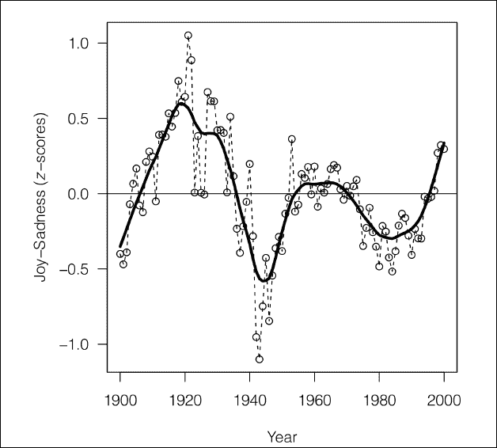
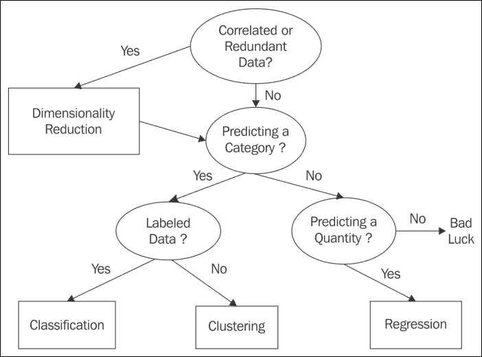
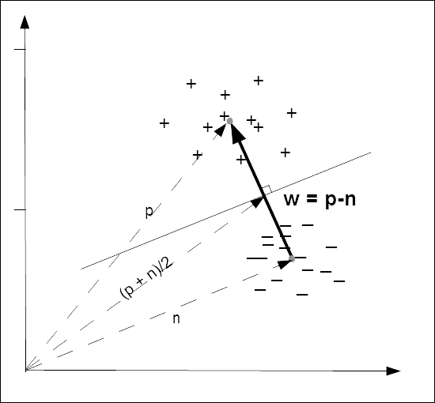
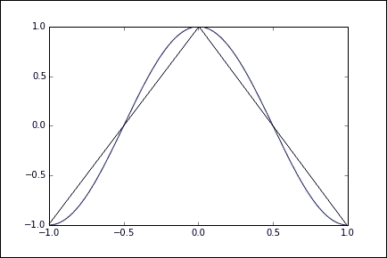
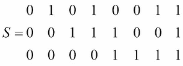

# 一、机器学习中的思维

机器学习系统具有深刻而令人兴奋的能力，可以为多种多样的应用提供重要的见解；从开创性的拯救生命的医学研究，到发现我们宇宙的基本物理方面。从为我们提供更好、更清洁的食物，到网络分析和经济建模。事实上，我们生活中几乎没有任何领域没有以某种方式接触到这项技术。随着物联网的不断扩展，产生了数量惊人的数据，很明显，智能系统正在以非常引人注目的方式改变社会。有了开源工具，如 Python 及其库提供的工具，以及以 Web 为代表的不断增加的开源知识库，以新的令人兴奋的方式学习和应用这项技术就相对容易和便宜了。在本章中，我们将讨论以下主题:

*   人类接口
*   设计原则
*   模型
*   统一建模语言

# 人类界面

对于那些足够老，或者足够不幸，使用过微软 office 套件早期版本的人来说，你可能会记得 Clippy 先生的 office 助手。这项功能最初是在 Office 97 中推出的，每当你在文档开头键入“亲爱的”一词时，它就会不请自来地从电脑屏幕的右下角弹出，并提示“看起来你正在写信，需要帮助吗？”。

在Office 的早期版本中，Clippy 先生被默认开启，几乎受到了软件用户的普遍嘲笑，并可能作为机器学习的第一次大失败而载入史册。

那么，为什么快乐的 Clippy 先生如此遭人恨呢？显然，处于消费者软件开发前沿的微软员工并不愚蠢，自动化助手可以帮助日常办公任务的想法并不一定是个坏主意。事实上，后来的自动化助手，至少是最好的，可以在背景下无缝运行，并显著提高工作效率。考虑预测文本。有许多例子，有些非常有趣，说明预测文本出现了惊人的错误，但在大多数情况下，它没有失败，它没有被注意到。这只是成为我们正常工作流程的一部分。

在这一点上，我们需要区分错误和失败。Clippy 先生的失败是因为它太显眼，设计太差，而不一定是因为它有错误；也就是说，它可能会给出正确的建议，但很可能你已经知道你正在写信。预测文本的错误率很高，也就是说，它经常预测错误，但它不会失败，这在很大程度上是因为它的失败方式:不引人注目。

用系统工程的话来说，任何具有*紧密耦合的人机界面*的系统的设计都是困难的。人类的行为，就像整个自然界一样，不是我们总能预测的。表情识别系统、自然语言处理和手势识别技术等都开辟了人机交互的新方式，这对机器学习专家来说有着重要的应用。

每当我们设计一个需要人类输入的系统时，我们需要预测人类与系统交互的可能方式，而不仅仅是预期的方式。从本质上说，我们试图用这些系统做的事情是向他们灌输一些对人类经验广阔全景的理解。

在网络出现的最初几年，搜索引擎使用一个简单的系统，基于搜索词在文章中出现的次数。网络开发者很快开始通过增加关键词的数量来利用这个系统。显然，这将导致关键字军备竞赛，并导致一个非常无聊的网站。衡量高质量的入站链接数量的页面排名系统旨在提供更准确的搜索结果。现在，当然，现代搜索引擎使用更复杂和秘密的算法。

对 ML 设计者来说同样重要的是不断增长的数据量。这提出了几个挑战，最明显的是它的巨大。然而，算法在提取知识和见解方面的能力是巨大的，这在较小的数据集下是不可能的。因此，许多人类互动现在都被数字化了，我们才刚刚开始理解和探索这些数据的许多用途。

作为一个奇怪的例子，考虑一下 20 世纪书籍中的情感表达研究*(Acer bi 等人，2013 年)。虽然严格来说更多的是数据分析研究，而不是机器学习，但出于几个原因，它是说明性的。它的目的是从 20 世纪^(的书籍中提取文本，根据情绪得分来绘制情感内容的图表。通过古登堡计划数字图书馆、WordNet([http://wordnet.princeton.edu/wordnet/](http://wordnet.princeton.edu/wordnet/))和谷歌 **Ngram** 数据库([books.google.com/ngrams](http://books.google.com/ngrams))访问大量数字化文本，这项研究的作者能够绘制出反映在当时文献中的 20 ^到世纪的文化变迁。他们通过绘制语气词汇的使用趋势来做到这一点。)*

在这项研究中，作者给每个单词贴上标签(*1 克*)，并将其与情绪得分和出版年份相关联。我们可以看到，情感词汇，如快乐、悲伤、恐惧等等，可以根据它们引发的积极或消极情绪来评分。从 WordNet(【wordnet.princeton.edu】)获得情绪得分。WordNet 给每个情绪词分配一个情感分数。最后，作者简单统计了每个语气词的出现次数:

这里， *ci* 是某个特定语气词的计数， *n* 是语气词的总计数(不是所有词，只是有语气分值的词)，而 *C [the]* 是正文中 *the* 这个词的计数。这使总数正常化，以考虑到几年后更多的书被写出来(或数字化)。此外，由于许多后来的书籍倾向于包含更多的技术语言，单词*和*被用于标准化，而不是获得总字数。这在散文文本中更准确地表达了长时间的情感。最后，通过减去平均值并除以标准偏差，根据正态分布*M[z]对分数进行归一化。*

这个数字取自 20 世纪书籍中的情感表达，(阿尔贝托·阿塞尔比，瓦西里欧斯·兰波斯，菲利普·加内特，r·亚历山大·本特利)PLOS 。

这里我们可以看到这项研究生成的图表之一。它显示了这个时期写的书的快乐-悲伤分数，并清楚地显示了与第二次世界大战时期相关的负面趋势。

这项研究很有趣，有几个原因。首先，它是数据驱动科学的一个例子，以前被认为是软的科学，如社会学和人类学，被赋予了坚实的经验基础。尽管有一些令人印象深刻的结果，这项研究相对容易实现。这主要是因为 WordNet 和 Google 已经完成了大部分艰苦的工作。这凸显了如何使用互联网上免费提供的数据资源，以及 Python 的数据和机器学习包等软件工具，任何拥有数据技能和动机的人都可以在此基础上开展工作。

# 设计原则

系统设计和设计其他东西(比如房子)之间经常有相似之处。在一定程度上，这个类比成立。我们试图将设计组件放入符合规范的结构中。当我们考虑它们各自的操作环境时，这种类比就失效了。在房子的设计中，人们通常认为景观一旦形成，就不会改变。

软件环境略有不同。系统是互动和动态的。我们设计的任何系统都将嵌套在其他系统中，无论是电子系统、物理系统还是人类系统。同样，计算机网络中的不同层(应用层、传输层、物理层等等)嵌套了不同的含义和功能，在项目的不同级别执行的活动也是如此。

作为这些系统的设计者，我们还必须对环境有很强的意识，也就是我们工作的领域。这些知识为我们提供了数据模式的线索，并帮助我们为我们的工作提供背景。

机器学习项目可以分为五个不同的活动，如下所示:

*   定义对象和规格
*   准备和探索数据
*   模型结构
*   履行
*   测试
*   部署

设计师主要关心的是前三个。然而，他们经常在其他活动中发挥，而且在许多项目中必须发挥主要作用。还应该说，项目的时间表不一定是这些活动的线性序列。重要的是，它们是不同的活动。它们可能同时发生，并以其他方式相互作用，但它们通常涉及不同类型的任务，这些任务可以根据人力和其他资源、项目阶段和外部因素进行划分。此外，我们需要考虑不同的活动涉及不同的操作模式。当你勾画出一个想法时，考虑你的大脑工作的不同方式，与当你在做一个特定的分析任务，比如一段代码时相比。

通常，最困难的问题是从哪里开始。我们可以开始钻研一个问题的不同元素，对一个特性集有一个概念，也许对我们可能使用的模型有一个概念。这可能会导致定义的对象和规范，或者我们可能必须做一些初步的研究，例如检查可能的数据集和数据源、可用的技术，或者与其他工程师、技术人员和系统用户交谈。我们需要探索经营环境和各种制约因素；它是 web 应用程序的一部分，还是科学家的实验室研究工具？

在设计的早期阶段，我们的工作流程会在不同的元素之间转换。例如，我们从一个一般性的问题开始——也许对解决这个问题所必需的一项或多项任务有一个想法——然后我们把它分成我们认为是关键的功能，用一个玩具数据集在几个模型上进行试验，返回来改进功能集，调整我们的模型，精确地定义任务，并改进模型。当我们觉得我们的系统足够健壮时，我们可以在一些真实数据上测试它。当然，然后我们可能需要回过头来改变我们的特性集。

选择和优化特征通常是机器学习设计者的主要活动(实际上，本身就是一项任务)。在我们充分描述任务之前，我们不能真正决定我们需要什么特性，当然，任务和特性都受到我们可以构建的可行模型类型的限制。

## 问题类型

作为设计师，我们被要求解决一个问题。我们得到了一些数据和一个预期的输出。第一步是以一种机器可以理解的方式，以一种对人类有意义的方式来构建问题。我们可以采用以下六种广泛的方法来精确定义我们的机器学习问题:

*   **探索性**:在这里，我们分析数据，寻找模式，如趋势或变量之间的关系。探索往往会导致一种假设，比如将饮食与疾病联系起来，或者将犯罪率与城市住宅联系起来。
*   **描述性**:在这里，我们尝试总结我们数据的具体特征。例如，平均寿命、平均温度或人口中左撇子的数量。
*   推理:推理问题是一个试图支持假设的问题，例如，通过使用不同的数据集来证明(或反驳)预期寿命和收入之间的一般联系。
*   **预测**:在这里，我们试图预测未来的行为。例如，通过分析收入来预测预期寿命。
*   **偶然**:这是一种试图找出导致某事的原因。低收入会导致预期寿命降低吗？
*   机械论:它试图回答诸如“收入和预期寿命之间的联系机制是什么？”

大多数机器学习问题都涉及开发过程中的几个此类问题。例如，我们可以首先探索数据，寻找模式或趋势，然后我们可以描述数据的某些关键特征。这可以使我们做出预测，并找到特定问题背后的原因或机制。

## 你问对问题了吗？

问题必须是合理的，并且在其主题范围内有意义。这些领域知识使您能够理解数据中重要的东西，并看到某个模式或相关性在哪里有意义。

问题应该尽可能具体，同时给出有意义的答案。它通常以一种概括的陈述开始，如“我想知道富有是否意味着健康”。所以，你做了一些进一步的研究，发现你可以按地理区域得到财富的统计数据，比如说从税务局。我们可以通过健康的反面，也就是疾病来衡量健康，比如通过入院人数，我们还可以通过将疾病与地理区域联系起来来检验我们最初的命题，“富裕意味着健康”。我们可以看到，一个更具体的问题依赖于几个可能有问题的假设。

我们还应该考虑到，我们的结果可能会受到这样一个事实的干扰，即穷人可能没有医疗保险，因此即使生病也不太可能去医院。在我们想要发现的东西和我们试图测量的东西之间有一种相互作用。这种相互作用可能隐藏了真实的发病率。然而，并非一切都没了。因为我们知道这些事情，那么也许我们可以在我们的模型中解释它们。

通过尽可能多地了解我们正在工作的领域，我们可以使事情变得容易得多。

通过检查你所提的问题或部分问题是否已经被回答，或者是否有数据集可以帮助你理解这个主题，你可能会节省很多时间。通常，你必须同时从几个不同的角度来处理一个问题。尽可能多地做准备性研究。很有可能其他设计师已经做了一些能给你带来启发的工作。

## 任务

任务是在一段时间内进行的特定活动。我们必须区分人工任务(规划、设计和实现)和机器任务(分类、聚类、回归等等)。也要考虑什么时候人和机器之间有重叠，例如，为一个模型选择特征。我们在机器学习中的真正目标是尽可能多地将这些任务从人工任务转换为机器任务。

将现实世界的问题与特定的任务相匹配并不总是容易的。许多现实世界的问题可能看起来在概念上是相关联的，但需要非常不同的解决方案。或者，看起来完全不同的问题可能需要相似的方法。不幸的是，没有简单的查找表来将特定的任务与问题相匹配。很大程度上取决于环境和领域。一个领域中的类似问题在另一个领域中可能无法解决，这可能是因为缺乏数据。然而，有少量的任务应用于大量的方法来解决许多最常见的问题类型。换句话说，在所有可能的编程任务空间中，有一个任务子集对我们的特定问题有用。在这个子集内，有一个更小的任务子集，这些任务很简单，实际上可以有效地应用于我们的问题。

机器学习任务发生在三种广泛的环境中:

*   **监督学习**:这里的目标是从标记的训练数据中学习一个模型，允许对未知的未来数据进行预测。
*   **无监督学习**:这里我们处理未标记的数据，我们的目标是在这些数据中找到隐藏的模式，以提取有意义的信息。
*   **强化学习**:这里的目标是开发一个系统，根据它与环境的相互作用来提高它的性能。这通常涉及到一个奖励信号。这类似于监督学习，除了强化学习不是有标记的训练集，而是使用奖励函数来不断提高其性能。

现在，让我们来看看一些主要的机器学习任务。下图应该给你一个尝试和决定什么类型的任务适合不同的机器学习问题的起点:

### 分类

分类可能是最常见的任务类型；这部分是因为它相对容易、容易理解，并且解决了许多常见问题。分类是根据实例的特征将类分配给一组实例。这是一种监督学习方法，因为它依赖于一个带标签的训练集来学习一组模型参数。然后，可以将该模型应用于未标记的数据，以预测每个实例属于哪个类。分类任务大致有两种类型:**二元分类**和多类分类。典型的二进制分类任务是电子邮件垃圾邮件检测。这里，我们使用电子邮件的内容来确定它是否属于以下两类之一:垃圾邮件或非垃圾邮件。多类分类的一个例子是手写识别，其中我们试图预测一个类，例如，字母名称。在这种情况下，每个字母数字字符都有一个类。多类分类有时可以通过将二元分类任务链接在一起来实现，然而，我们以这种方式丢失了信息，并且我们无法定义单个决策边界。因此，多类分类通常与二类分类分开处理。

### 回归

有些情况下，我们感兴趣的不是离散的类，而是一个连续的变量，例如，一个概率。这类问题是回归问题。回归分析的目的是了解输入自变量的变化如何影响因变量的变化。最简单的回归问题是线性的，包括用一条直线来拟合一组数据，以便进行预测。这通常通过最小化训练集中每个实例的误差平方和来实现。典型的回归问题包括在给定症状范围和严重程度的情况下估计疾病的可能性，或者在给定过去表现的情况下预测测试分数。

### 聚类

聚类是最著名的无监督方法。这里，我们关心的是在一个未标记的数据集中测量实例之间的相似性。我们经常使用几何模型来确定实例之间的距离，基于它们的特征值。我们可以使用任意的接近度来确定每个实例属于哪个集群。聚类经常用于数据挖掘和探索性数据分析。有各种各样的方法和算法来执行这项任务，其中一些方法包括基于距离的方法，以及为每个聚类寻找中心点，或者使用基于分布的统计技术。

与聚类相关的是联想；这是一项无人监管的任务，在数据中寻找某种类型的模式。这项任务是产品推荐系统的基础，如亚马逊和其他在线商店提供的产品推荐系统。

### 降维

许多数据集包含大量与每个实例相关的特征或测量值。这可能会在计算能力和内存分配方面带来挑战。此外，许多特征可能包含冗余信息或与其他特征相关的信息。在这些情况下，我们的学习模型的性能可能会显著下降。降维最常用于特征预处理；它将数据压缩到一个低维子空间，同时保留有用的信息。当我们想要可视化数据时，通常通过将更高的维度投射到一个、两个或三个维度上，也可以使用降维。

从这些基本的机器任务中，有许多派生的任务。在许多应用中，这可能仅仅是将学习模型应用于预测以建立偶然的关系。我们必须记住解释和预测是不一样的。一个模型可以做出预测，但是除非我们清楚地知道它是如何做出预测的，否则我们无法开始形成一个可理解的解释。解释需要人类的领域知识。

我们还可以使用预测模型从一般模式中找出例外。这里我们感兴趣的是偏离预测的个别情况。这通常被称为**异常检测**和在诸如检测银行诈骗、噪音过滤，甚至是搜寻外星生命等方面有着广泛的应用。

一个重要且潜在有用的任务是子群发现。我们在这里的目标不是像在聚类中那样划分整个域，而是找到一个具有实质上不同分布的子群。实质上，子群发现是试图发现一个从属目标变量和许多独立解释变量之间的关系。我们并不试图寻找一个完整的关系，而是寻找一组在对领域重要的方面不同的实例。例如，为目标变量*心脏病=真实*建立一个亚组，*吸烟者=真实*和*家族史=真实*。

最后，我们考虑控制型任务。在不同的条件下，这些功能可以优化控制设置，使收益最大化。这可以通过几种方式实现。我们可以克隆专家行为:机器直接向人类学习，并在不同条件下预测行动。任务是学习专家行动的预测模型。这类似于强化学习，任务是学习条件和最佳行动之间的关系。

### 错误

在机器学习系统中，软件缺陷可能会产生非常严重的现实世界后果；如果你嵌入在装配线机器人中的算法将一个人归类为生产组件，会发生什么？显然，在关键系统中，您需要为故障做准备。在您的设计流程和系统中应该嵌入一个强大的故障和错误检测程序。

有时，为了调试和检查逻辑缺陷，有必要设计非常复杂的系统。可能需要生成具有特定统计结构的数据集，或者创建*人造人*来模仿界面。例如，开发一种方法来验证您的设计在数据、模型和任务级别上的逻辑是否合理。错误可能很难跟踪，作为一名科学家，你必须假设存在错误，并试图证明事实并非如此。

识别和优雅地捕捉错误的想法对软件设计师来说很重要，但作为机器学习系统设计师，我们必须更进一步。我们需要能够在模型中捕捉到从错误中学习的能力。

必须考虑我们如何选择我们的测试集，特别是，它对数据集的其余部分有多大的代表性。例如，如果它与训练集相比有噪声，它将在测试集上给出差的结果，这表明我们的模型是过度拟合的，而事实上并非如此。为了避免这种情况，使用了交叉验证的过程。例如，这是通过将数据随机分成十个大小相等的块来实现的。我们使用九个组块来训练模型，一个用于测试。我们这样做 10 次，使用每个块测试一次。最后，我们取测试集性能的平均值。除了分类之外，交叉验证还用于其他监督学习问题，但正如您所料，非监督学习问题需要进行不同的评估。

对于无监督的任务，我们没有标记的训练集。因为我们不知道正确的答案是什么样的，所以评估可能有点棘手。例如，在聚类问题中，我们可以通过度量来比较不同模型的质量，如聚类直径与聚类之间距离的比率。然而，在任何复杂的问题中，我们永远不知道是否有另一个尚未建立的模型更好。

### 优化

最优化问题在许多不同的领域中无处不在，比如金融、商业、管理、科学、数学和工程。优化问题包括以下内容:

*   我们希望最大化或最小化的目标函数。
*   决策变量，即一组可控输入。这些输入在指定的约束内变化，以满足目标函数。
*   参数，是不可控或固定的输入。
*   约束是决策变量和参数之间的关系。它们定义了决策变量的值。

大多数优化问题只有一个目标函数。在我们可能有多个目标函数的情况下，我们经常发现它们相互冲突，例如，降低成本和增加产量。在实践中，我们试图将多个目标转化为一个单一的函数，也许是通过创建目标函数的加权组合。在我们的成本和产出的例子中，一个单位成本的变量可能会起作用。

决策变量是我们为实现目标而控制的变量。它们可能包括资源或劳动力。对于模型的每次运行，模块的参数是固定的。我们可以使用几个*案例*，其中我们选择不同的参数来测试多种条件下的变化。

对于许多不同类型的优化问题，有成千上万的解决算法。大多数方法都是先找到一个可行的解决方案，然后通过调整决策变量对其进行迭代改进，希望找到一个最优的解决方案。许多优化问题可以用线性规划技术很好地解决。他们假设目标函数和所有约束相对于决策变量是线性的。在这些关系不是线性的地方，我们经常使用合适的二次函数。如果系统是非线性的，那么目标函数可能不是凸的。也就是说，它可能有不止一个局部极小值，并且不能保证局部极小值就是全局极小值。

### 线性规划

为什么线性模型如此普遍？首先，它们相对容易理解和实现。它们是基于一个良好的数学理论，该理论是在 18 世纪中期发展起来的，后来在数字计算机的发展中发挥了关键作用。计算机被赋予了独特的任务来实现线性程序，因为计算机在很大程度上是基于线性规划的理论而被概念化的。线性函数总是凸的，意味着它们只有一个最小值。**线性规划** ( **LP** )问题通常用单纯形法求解。假设我们想要解决优化问题，我们将使用以下语法:

*max x[1]*+*x[2]*带约束:*2x[1]*+*x[2]≤4*和*x[1]*+*2x[2]≤3*

我们假设*x[1]和*x[2]大于或等于 0。我们需要做的第一件事是把它转换成标准形式。这是通过确保问题是最大化问题来完成的，也就是说，我们将*最小 z* 转换为*最大 z* 。我们还需要通过添加非负松弛变量将不等式转换为等式。这里的例子已经是一个最大化问题，所以我们可以让我们的目标函数保持原样。我们确实需要将约束中的不平等变为平等:**

*2x[1]*+*x[2]*+*x[3]= 4*和*x[1]*+*2x[2]+*x[4]= 3**

如果我们让 *z* cf 目标函数，那么我们可以写出如下:

*z-x[1]-x[2]= 0*

我们现在有以下线性方程组:

*   目的:*z-x[1]-x[2]*+*0*+*0 = 0*
*   约束 1:*2x[1]*+*x[2]*+*x[3]*+*0 = 4*
*   约束 2:*x[1]+*2x[2]+*0+x[4]= 3***

我们的目标是最大化 *z* ，记住所有变量都是非负的。我们可以看到*x[1]和*x[2]出现在所有方程中，称为非基本。*x[3]和*x[4]值只出现在一个等式中。它们被称为基本变量。我们可以通过将所有非基本变量赋值为 0 来找到一个基本解。这里，这给了我们以下内容:****

*x[1]= x[2]= 0*；*x[3]= 4*；*x[4]= 3*； *z = 0*

记住我们的目标是最大化 z，这是一个最优的解决方案吗？我们可以看到，由于在我们的线性系统的第一个方程中 *z* 减去了*x[1]T155 和*x[2]，我们能够增加这些变量。如果这个方程中的系数都是非负的，那么就没有办法增加 *z* 。当目标方程中的所有系数都为正时，我们就知道找到了最优解。**

这里的情况不是这样。所以，我们在目标方程中取一个系数为负的非基本变量(比如说 *x [1]* ，它被称为 **进入变量**，并使用一种称为**旋转**的技术将其从非基本变量变成基本变量。同时，我们将把一个叫做 **的基本变量**变成一个非基本变量。我们可以看到 *x [1]* 在两个约束方程中都出现了，那么我们选择哪一个进行主元呢？记住我们需要保持系数为正。我们发现，通过使用产生等式右边与它们各自的进入系数的最低比率的主元，我们可以找到另一个基本解。对于 *x [1]* ，在本例中，第一个约束为 *4/2* ，第二个约束为 *3/1* 。因此，我们将在约束 1 中使用*x[1]进行透视。*

我们将约束 *1* 除以 *2* ，得到如下结果:

*x[1]+*x[2]+*x[3]= 2***

我们现在可以用*x[1]来表示它，并将其代入其他方程，以从那些方程中消除 *x1* 。一旦我们进行了一点代数运算，我们就得到下面的线性系统:*

*z-1/2x[2]+*1/3 x[3]= 2**

*x[1]*+*1/2 x[2]*+*1/2x[3]= 2*

*3/2x[2]–1/2x[3]+*x[4]= 1**

我们有另一个基本的解决方案。但是，这是最优解吗？由于我们在第一个等式中仍然有一个负系数，所以答案是否定的。我们现在可以对 *x2* 进行相同的旋转过程，并且使用比率规则，我们发现我们可以在第三个等式中旋转 *3/2x2* 。这为我们提供了以下信息:

*z+1/3x[3]+*1/3x[4]= 7/3**

*x1+2/3x[3]-1/3 x[4]= 5/3*

*x2-1/3x[3]+*2/3 x[4]= 2/3**

这就给了我们*x[3]= x[4]= 0*、 *x [1] = 5/3* 、 *x2 = 2/3* 、 *z = 7/3* 的解法。这是最优解，因为第一个方程中不再有负数。

我们可以用下面的图表来形象化地说明这一点。阴影区域是我们将找到可行解决方案的区域:

双变量优化问题

### 型号

线性编程为我们提供了一种将现实世界的问题编码成计算机语言的策略。然而，我们必须记住，我们的目标不仅仅是解决一个问题的实例，而是创建一个模型，通过新的数据来解决独特的问题。这是学习的本质。一个学习模型必须有一个机制来评估它的输出，反过来，改变它的行为到一个更接近解决方案的状态。

模型本质上是一种假设，也就是对一种现象提出的解释。目标是让它对问题进行概括。在监督学习问题的情况下，从训练集中获得的知识被应用于未标记的测试。在无监督学习问题的情况下，例如聚类，系统不从训练集学习。它必须从数据集本身的特征中学习，比如相似度。在这两种情况下，过程都是迭代的。它重复一组定义明确的任务，使模型更接近正确的假设。

模型是机器学习系统的核心。他们是学习的对象。有许多模型，这些模型有许多变化，也有许多独特的解决方案。我们可以看到，机器学习系统解决的问题(回归、分类、关联等等)出现在许多不同的设置中。它们已经成功地用于科学、工程、数学、商业以及社会科学的几乎所有分支；他们就像他们经营的领域一样多样化。

这种模型的多样性赋予了机器学习系统强大的问题解决能力。然而，对于设计者来说，决定哪一个或哪几个模型是针对特定问题的最佳模型也是一件令人畏惧的事情。把事情复杂化，往往有几个模型可能解决你的任务，或者你的任务可能需要几个模型。当你着手这样一个项目时，你根本不知道解决原始问题的最准确和最有效的途径是什么。

为了我们的目的，让我们把这个广阔的画布分成三个重叠的、非相互的和排他的类别:几何的、概率的和逻辑的。在这三个模型中，必须区分模型如何划分实例空间。实例空间可以被认为是数据的所有可能实例，不管每个实例是否出现在数据中。实际数据是实例空间的子集。

有两种方法来划分这个空间:分组和分级。两者的关键区别在于分组模型将实例空间分成固定的离散单元，称为**段**。他们有一个有限的分辨率，不能区分超过这个分辨率的类。另一方面，放坡会在整个实例空间上形成一个全局模型，而不是将空间分成几个部分。理论上，它们的分辨率是无限的，无论实例多么相似，它们都可以区分它们。分组和分级之间的区别不是绝对的，许多模型都包含两者的元素。例如，线性分类器通常被认为是分级模型，因为它基于连续函数。然而，存在线性模型不能区分例如平行于决策边界的线或面的情况。

#### 几何模型

几何模型使用实例空间的概念。几何模型最明显的例子是所有的特征都是数字的，并且可以成为笛卡尔坐标系统中的坐标。当我们只有两三个特征时，它们很容易被形象化。然而，由于许多机器学习问题有数百或数千个特征，因此维度，可视化这些空间是不可能的。然而，许多几何概念，如线性变换，仍然适用于这个超空间。这可以帮助我们更好地理解我们的模型。例如，我们期望许多学习算法是平移不变的，也就是说，我们把原点放在坐标系统的什么地方并不重要。此外，我们可以使用欧几里德距离的几何概念来度量实例之间的任何相似性；这为我们提供了一种方法来聚集相似的实例，并在它们之间形成一个决策边界。

假设我们使用线性分类器将段落分类为快乐或悲伤，并设计了一套测试。每个测试都与一个权重 *w* 相关联，以确定每个测试对整体结果的贡献。

我们可以简单地对每个测试求和，然后乘以它的权重，得到一个总分数，并创建一个决策规则，该规则将创建一个边界，例如，如果快乐分数大于阈值，则为。

每个特征对整体结果都有独立的贡献，因此规则是线性的。这种贡献取决于每个特征的相对权重。该权重可以是正的，也可以是负的，并且在计算总得分时，每个单独的特征不受阈值的限制。

我们可以用向量符号重写这个和，使用 *w* 作为权重向量(*w[1]， *w [2] ，...，w [n]* )和 *x* 为测试结果的向量( *x [1] ，x [2] ，...，x[n])。同样，如果我们使它成为等式，我们可以定义决策边界:**

*w . x = t*

我们可以把 *w* 想象成一个指向正(快乐)例 *P* 和负例 *N* 的“质心”之间的向量。我们可以通过平均以下各项来计算这些质心:

我们现在的目标是在这些质心之间创建一个决策边界。我们可以看到 *w* 与 *P - N* 成比例，或者相等，并且 *(P + N)/2* 将在决策边界上。所以，我们可以这样写:

决策边界图

实际上，真实数据是有噪声的，不一定容易分离。即使数据很容易分离，特定的决策边界也可能没有太大的意义。考虑稀疏的数据，例如在文本分类中，与每个单词的实例的数量相比，单词的数量很大。在这个大面积的空实例空间中，可能很容易找到一个决策边界，但是哪个是最好的呢？一种选择方法是使用边距来测量决策边界与其最近实例之间的距离。我们将在本书的后面探索这些技术。

#### 概率模型

A typical example of a probabilistic model is the Bayesian classifier, where you are given some training data (*D*), and a probability based on an initial training set (a particular hypothesis, *h*), getting the posteriori probability, *P (h/D)*.

As an example, consider that we have a bag of marbles. We know that 40 percent of them are red and 60 percent are blue. We also know that half of the red marbles and all the blue marbles have flecks of white. When we reach into the bag to select a marble, we can feel by its texture that it has flecks. What are the chances of it being red?

Let *P(RF)* be equal to the probability that a randomly drawn marble with flecks is red:

*P(FR)* = the probability of a red marble with flecks is 0.5.

*P(R)* = the probability a marble being red is 0.4.

*P(F)* = the probability that a marble has flecks is *0.5 x 0.4 + 1 x 0.6= 0.8*.

Probabilistic models allow us to explicitly calculate probabilities, rather than just a binary true or false. As we know, the key thing we need to do is create a model that maps or features a variable to a target variable. When we take a probabilistic approach, we assume that there is an underlying random process that creates a well defined but unknown probability distribution.

Consider a spam detector. Our feature variable, *X*, could consist of a set of words that indicate the email might be spam. The target variable, *Y*, is the instance class, either spam or ham. We are interested in the conditional probability of *Y* given *X*. For each email instance, there will be a feature vector, *X*, consisting of Boolean values representing the presence of our spam words. We are trying to find out whether *Y*, our target Boolean, is representing spam or not spam.

Now, consider that we have two words, *x[1]* and *x[2]*, that constitute our feature vector *X*. From our training set, we can construct a table such as the following one:

|   | 

P(Y = spam&#124; x[1], x[2])

 | 

P(Y = not spam&#124; x[1], x[2])

 |
| --- | --- | --- |
| *P(Y&#124; x[1] = 0, x[2] = 0)* | 0.1 | 0.9 |
| *P(Y&#124; x[1] = 0, x[2] = 1)* | 0.7 | 0.3 |
| *P(Y&#124; x[1] = 1, x[2] = 0)* | 0.4 | 0.6 |
| *P(Y&#124; x[1] = 1, x[2] = 1)* | 0.8 | 0.2 |

> *Table 1.1*

We can see that once we begin adding more words to our feature vector, it will quickly grow unmanageable. With a feature vector of *n* size, we will have *2^n* cases to distinguish. Fortunately, there are other methods to deal with this problem, as we shall see later.

The probabilities in the preceding table are known as posterior probabilities. These are used when we have knowledge from a prior distribution. For instance, that one in ten emails is spam. However, consider a case where we may know that *X* contains *x[2] = 1*, but we are unsure of the value of *x[1]*. This instance could belong in row 2, where the probability of it being spam is **0.7**, or in row 4, where the probability is **0.8**. The solution is to average these two rows using the probability of *x[1] = 1* in any instance. That is, the probability that a word, *x[1]*, will appear in any email, spam or not:

*P(Y|x[2] = 1) = P(Y|x[1] = 0, x[2] = 1)P(x[1] = 0) + P(x[1] = 1,x[2] = 1)P(x[1] = 1)*

This is called a likelihood function. If we know, from a training set, that the probability that *x[1]* is one is 0.1 then the probability that it is zero is 0.9 since these probabilities must sum to 1\. So, we can calculate the probability that an e-mail contains the spam word *0.7 * 0.9 + 0.8 * 0.1 = 0.71*.

This is an example of a likelihood function: *P(X|Y)*. So, why do we want to know the probability of *X*, which is something we all ready know, conditioned on *Y*, which is something we know nothing about? A way to look at this is to consider the probability of any email containing a particular random paragraph, say, the 127th paragraph of War and Peace. Clearly, this probability is small, regardless of whether the e-mail is spam or not. What we are really interested in is not the magnitude of these likelihoods, but rather their ratio. How much more likely is an email containing a particular combination of words to be spam or not spam? These are sometimes called generative models because we can sample across all the variables involved.

We can use Bayes' rule to transform between prior distributions and a likelihood function:

*P(Y)* 是先验概率，即每一类在观测到 *X* 之前的可能性有多大。同样， *P(X)* 是不考虑 *Y* 的概率。如果我们只有两个类，我们可以使用比率。例如，如果我们想知道数据在多大程度上倾向于每个类，我们可以使用以下方法:

如果几率小于 1，我们假设分母中的类最有可能。如果大于 1，则枚举数中的类是最有可能的。如果我们使用*表 1.1* 中的数据，我们计算出以下后验概率:

可能性函数在机器学习中很重要，因为它创建了一个生成模型。如果我们知道词汇表中每个单词的概率分布，以及每个单词出现在垃圾邮件或非垃圾邮件中的可能性，我们可以根据条件概率生成一封随机的垃圾邮件， *P(X|Y = spam)* 。

#### 逻辑模型

逻辑模型是基于算法的。它们可以被翻译成一套人类可以理解的正式规则。例如，如果*x[1]和*x[2]都为 1，则该电子邮件被分类为垃圾邮件。**

这些逻辑规则可以组织成树形结构。在下图中，我们看到实例空间在每个分支被迭代分区。叶子由代表实例空间片段的矩形区域(或高维情况下的超矩形)组成。根据我们正在解决的任务，树叶被标上类别、概率、实数等等。

图形特征树

特征树在表示机器学习问题时非常有用；甚至那些乍一看似乎没有树状结构的。例如，在上一节中的贝叶斯分类器中，我们可以将实例空间划分成与特征值组合一样多的区域。决策树模型通常采用修剪技术来删除给出错误结果的分支。在第 3 章、*将数据转化为信息*中，我们将探讨用 Python 表示决策树的多种方式。

### 注

请注意，决策规则可能会重叠，并做出相互矛盾的预测。

于是我们说它们在逻辑上是不一致的。当规则没有考虑特征空间中的所有坐标时，它们也可能是不完整的。有许多方法可以解决这些问题，我们将在本书的后面详细讨论这些方法。

由于树学习算法通常以自上而下的方式工作，所以第一个任务是在树的顶部找到一个好的特征进行分割。我们需要找到一个分裂，这将导致后续节点的纯度更高。我所说的纯度是指训练样本都属于同一个类的程度。随着我们沿着树向下，在每一层，我们发现每个节点处的训练样本的纯度增加，也就是说，它们越来越多地被分成它们自己的类，直到我们到达所有样本都属于同一类的叶子。

从另一个角度来看，我们对降低决策树中后续节点的熵感兴趣。熵是一种无序度的度量，在树的顶部(根)较高，随着数据被划分到相应的类中，每个节点的熵逐渐降低。

在更复杂的问题中，那些具有更大特征集和决策规则的问题，找到最佳分割有时是不可能的，至少在可接受的时间内是不可能的。我们真正感兴趣的是创造最浅的树，以最短的路径到达我们的叶子。在分析时间内，每个节点随着每个附加特征呈指数增长，因此找到最佳决策树可能比实际使用次优树来执行任务需要更长的时间。

逻辑模型的一个重要属性是，在某种程度上，它们可以为自己的预测提供解释。例如，考虑由决策树做出的预测。通过追踪从叶到根的路径，我们可以确定导致最终结果的条件。这是逻辑模型的优势之一:它们可以被人类检查以揭示更多的问题。

### 特性

同样，决策的好坏取决于我们在现实生活中获得的信息，在机器学习任务中，模型的好坏取决于它的特征。从数学上来说，特征是一个从实例空间映射到特定域中的一组值的函数。在机器学习中，我们进行的大多数测量都是数值的，因此最常见的特征域是实数集。其他常见的域包括布尔、真或假、整数(比如，当我们计算某个特定特征的出现次数时)，或者有限集合，比如一组颜色或形状。

模型是根据它们的特征来定义的。此外，单个特征可以转化为一个模型，这就是所谓的单变量模型。我们可以区分特征的两种用途。这与分组和分级的区分有关。

首先，我们可以通过放大实例空间中的一个区域来对我们的特征进行分组。假设 *f* 是一个统计一个单词*X[1]T6 在一封电子邮件 *X* 中出现次数的特征。我们可以设置如下条件:*

其中 *f(X)=0* ，代表不包含*X[1]的邮件，或者其中 *f(X) > 0* 代表一次或多次包含*X[1]的邮件。这些条件被称为**二元分割**，因为它们将实例空间分成两组:满足条件的和不满足条件的。我们还可以将实例空间分割成两个以上的部分，以创建非二进制分割。例如，其中*f(X)= 0*；*0<F(X)<5*； *F(X) > 5* ，以此类推。**

其次，我们可以对我们的特征进行分级，以计算每个特征对整体结果的独立贡献。回想一下我们简单的线性分类器，下面的判定规则形式:

因为这个规则是线性的，所以每个特征对实例的得分有独立的贡献。这个贡献靠*w[I]。如果是正的，那么一个正的 *x [i]* 会增加分数。如果*w[I]为负，则正的*x[I]会降低分数。如果*w[I]很小或者为零，那么它对整体结果的贡献可以忽略不计。可以看出，这些特征对最终预测做出了可测量的贡献。****

特征的这两种用途，如分割(分组)和预测(分级)，可以合并到一个模型中。一个典型的例子是，当我们想要在区间 *-1 < x < 1* 上逼近一个非线性函数，比如说 *y sin π x* 。显然，简单的线性模型是行不通的。当然，简单的回答就是把 *x* 轴拆分成 *-1 < x 0* 和 *0 <* 。在每一段上，我们都能找到一个合理的线性近似。

使用分组和分级

通过特征构造和转换，可以做很多工作来提高我们的模型的性能。在大多数机器学习问题中，这些特征不一定是显式可用的。它们需要从原始数据集构建，然后转换成我们的模型可以利用的东西。这在文本分类等问题中尤为重要。在我们简单的垃圾邮件示例中，我们使用了所谓的单词包表示法，因为它不考虑单词的顺序。然而，这样做，我们丢失了关于文本意义的重要信息。

特征构造的一个重要部分是离散化。我们有时可以提取更多的信息，或者与我们的任务更相关的信息，通过将特征分成相关的块。例如，假设我们的数据包含一个人的精确收入列表，我们试图确定金融收入和一个人居住的郊区之间是否有关系。显然，如果我们的特征集不是由精确的收入组成，而是由收入范围组成，这是合适的，尽管严格地说，我们会丢失信息。如果我们适当地选择我们的区间，我们将不会丢失与我们的问题相关的信息，并且我们的模型将执行得更好并且给我们更容易解释的结果。

这突出了特征选择的主要任务:从噪声中分离信号。

真实世界的数据不可避免地会包含大量我们不需要的信息，以及简单的随机噪声，分离出与我们的需求相关的数据部分(可能很小)对于我们模型的成功非常重要。当然，重要的是我们不要丢弃对我们来说可能很重要的信息。

通常，我们的特征将是非线性的，并且线性回归可能不会给我们好的结果。一个技巧是转换实例空间本身。假设我们有下图所示的数据。很明显，线性回归只给我们一个合理的拟合，如左图所示。但是，如果我们将实例空间平方，我们可以改善这个结果，即我们使*x = x[2]和 *y = y [2]* ，如右边的图所示:*

方差= .92 方差= .97

转换实例空间

我们可以更进一步，使用一种叫做 **内核技巧**的技术。这个想法是，我们可以创建一个更高维的隐式特征空间。成对的数据点通过指定的函数从原始数据集映射到这个更高维的空间，有时称为**相似性函数**。

例如，让 *x [1] = (x [1] ，y [1] )* 和 *x [2] = (x [2] ，y [2] )* 。

我们创建一个 2D 到 3D 的映射，如下所示:

三维空间中与 2D 点*x[1]和*x[2]相对应的点如下:**

现在，这两个向量的点积是:

我们可以看到，通过在原始 2D 空间中对点积求平方，我们在 3D 空间中获得了点积，而没有实际创建特征向量本身。这里我们定义了内核 *k(x [1] ，x [2] ) = (x [1] ，x[2]2*。在高维空间中计算点积通常在计算上更便宜，正如我们将看到的，这种技术在机器学习中被广泛使用，从 **支持向量机**(**SVM**)**主成分分析** ( **PCA** )和相关性分析。

我们前面看到的基本线性分类器定义了一个决策边界。向量 *w* 等于正例均值和反例均值之差 *p-n* 。假设我们有点 *n= (0，0)* 和 *p = (0，1)* 。假设我们从两个训练样本中得到一个正均值， *p1 = (-1，1)* 和 *p2 = (1，1)* 。因此，我们有以下内容:

我们现在可以将决策边界写成如下形式:

使用内核技巧，我们可以获得以下决策边界:

使用我们之前定义的内核，我们得到如下结果:

我们现在可以推导出决策边界:

这只是一个以原点为圆心，半径为 *√t* 的圆。

另一方面，使用内核技巧，每个新实例都根据每个训练示例进行评估。作为这种更复杂计算的回报，我们获得了更灵活的非线性决策边界。

一个非常有趣和重要的方面是特性之间的交互。互动的一种形式是相关性。例如，一篇博客文章中的单词，我们可能期望单词*冬季*和*寒冷*之间存在正相关，而*冬季*和*炎热*之间存在负相关。这对您的模型意味着什么取决于您的任务。如果您正在进行情感分析，您可能需要考虑降低一起出现的每个单词的权重，因为与该单词单独出现相比，添加另一个相关单词对整体结果的影响可能会稍微小一些。

同样关于情感分析，我们经常需要转换某些特征来捕捉它们的含义。例如，短语*不开心*包含一个单词，如果我们只使用 *1-grams* ，即使它的情绪明显是负面的，也会有助于正面的情绪得分。一个解决方案(除了使用 *2-grams* ，这可能不必要地使模型变得复杂)是识别这两个词何时出现在序列中，并创建一个新的特征 *not_happy* ，以及相关的情感分数。

选择和优化功能是值得的。它可能是学习系统设计的一个重要部分。设计的这种迭代性质在两个阶段之间转换。首先，理解你正在研究的现象的性质，其次，用实验来检验你的想法。这种实验让我们对现象有了更深入的了解，使我们能够优化我们的特征并获得更深入的理解，等等，直到我们对我们的模型给我们提供了真实的准确反映感到满意。

## 统一建模语言

机器学习系统可能很复杂。人脑通常很难理解一个完整系统的所有交互作用。我们需要某种方式将系统抽象成一组离散的功能组件。这使我们能够用图表和绘图来可视化我们系统的结构和行为。

UML 是一种形式主义，它允许我们以一种精确的方式可视化和交流我们的设计思想。我们用代码实现我们的系统，底层原理用数学表达，但是还有第三个方面，在某种意义上，垂直于这些，那是我们系统的可视化表示。画出你的设计的过程有助于从不同的角度将其概念化。也许我们可以考虑尝试三角解决方案。

概念模型是描述问题元素的理论工具。它们可以帮助我们澄清假设，证明某些性质，并让我们对系统的结构和相互作用有一个基本的了解。

UML 产生于既要简化这种复杂性，又要允许我们的设计被清晰明确地传达给团队成员、客户和其他利益相关者的需要。模型是真实系统的简化表示。在这里，我们在更一般的意义上使用单词*模型*，与其更精确的机器学习定义相比。UML 可以用来建模几乎任何可以想象的系统。核心思想是用核心属性和功能的清晰表示去除任何不相关的和潜在的混淆元素。

### 类图

类图模拟了系统的静态结构。类代表具有共同特征的抽象实体。它们很有用，因为它们表达并实现了面向对象的编程方法。我们可以看到，通过在代码中分离不同的对象，我们可以更清楚地将每个对象作为一个独立的单元来处理。我们可以用一组特定的特征来定义它，并定义它与其他对象的关系。这使得复杂的程序可以分解成独立的功能组件。它还允许我们通过继承来子类化对象。这非常有用，反映了我们如何对我们的世界的特定层次进行建模(也就是说，程序员是人类的子类，Python 程序员是程序员的子类)。对象编程可以加快整个开发时间，因为它允许组件的重用。有丰富的开发组件类库可供利用。此外，生成的代码往往更容易维护，因为我们可以替换或更改类，并且能够(通常)理解这将如何影响整个系统。

事实上，对象编码确实倾向于产生更大的代码库，这意味着程序运行起来会更慢。最终，这不是一个“非此即彼”的情况。对于许多简单的任务，如果您可能永远不会再使用它，您可能不想花时间来创建一个类。一般来说，如果您发现自己键入相同的代码，或者创建相同类型的数据结构，那么创建一个类可能是个好主意。对象编程的最大优点是我们可以将数据和操作数据的函数封装在一个对象中。这些软件对象可以以非常直接的方式与真实世界的对象对应。

最初，设计面向对象的系统可能需要一些时间。然而，在建立可行的类结构和类定义时，实现类所需的编码任务变得更加清晰。创建一个类结构是开始系统建模的一个非常有用的方法。当我们定义一个类时，我们感兴趣的是一组特定的属性，作为所有可能属性或实际不相关属性的子集。它应该是真实系统的准确表示，我们需要判断什么是相关的，什么是不相关的。这是困难的，因为现实世界的现象是复杂的，我们对系统的信息总是不完整的。我们只能按照我们所知道的去做，所以我们的领域知识(对我们试图建模的系统的理解)，无论是软件、自然还是人类，都是至关重要的。

### 对象图

对象图是运行时系统的逻辑视图。它们是特定时刻的快照，可以理解为类图的一个实例。许多参数和变量在程序运行时会改变值，而对象图的功能就是映射这些。这个运行时绑定是对象图表示的关键事物之一。通过使用链接将对象联系在一起，我们可以对特定的运行时配置进行建模。对象之间的链接对应于对象类之间的关联。因此，链接受到与它对其对象实现的类相同的约束。

对象图

类图和对象图都由相同的基本元素组成。而类图代表了类的抽象蓝图。对象图表示对象在特定时间点的真实状态。单对象图不能代表每一个类实例，所以在画这些图的时候，我们必须把自己限制在重要的实例和覆盖系统基本功能的实例上。对象图应该阐明对象之间的关联，并指明重要变量的值。

### 活动图解

活动图的目的是通过将单独的动作链接在一起来模拟系统的工作流，这些动作一起代表一个过程。他们尤其擅长对协调任务集进行建模。活动图是 UML 规范中最常用的图之一，因为它们的格式是基于传统的流程图，所以很容易理解。活动图的主要组成部分是动作、边(有时称为路径)和决策。行动用圆角矩形表示，边缘用箭头表示，决策用菱形表示。活动图通常有一个开始节点和一个结束节点。

示例活动图的图形

### 状态图

状态图用于建模系统，这些系统根据它们所处的状态改变行为。它们由状态和转换来表示。状态由圆角矩形表示，转换由箭头表示。每个过渡都有一个触发器，这是沿着箭头写的。

许多状态图将包括初始伪状态和最终状态。伪状态是控制流量的状态。另一个例子是选择伪状态。这表明布尔条件决定了转换。

状态转换系统由四个要素组成；它们如下:

*   *S = {s [1] ，s [2] ，…}* :一组状态
*   *A= {a [1] ，a [2] ，...}* :一组动作
*   *E ={e [1] ，e [2] ，...}* :一组事件
*   *y: S(A U E)→2s* :状态转移函数

第一个元素是世界所有可能状态的集合。行动是一个代理人可以做的改变世界的事情。事件可以在世界上发生，并且不受代理的控制。状态转移函数 *y* 接受两个输入:世界的状态和动作与事件的联合。这为我们提供了所有可能的状态，作为应用特定动作或事件的结果。

假设我们有一个仓库，存放三件物品。我们认为仓库最多只储存一种物品。我们可以通过以下矩阵来表示仓库的可能状态:

这样可以为 *E* 定义类似的二进制矩阵，代表卖出的事件，为 *A* 定义类似的二进制矩阵，是一个动作指令。

在这个简单的例子中，我们的转移函数应用于一个实例( *s* ，它是 *S* 中的一列)，它是 *s' = s + a - e* ，其中 *s'* 是系统的最终状态， *s* 是它的初始状态， *a* 和 *e* 分别是一个活动和一个事件。

我们可以用下面的转换图来表示:

转换图的图形

# 总结

到目前为止，我们已经介绍了广泛的机器学习问题、技术和概念。希望到现在为止，你已经知道如何开始解决一个新的独特的问题，把它分解成几个部分。我们已经复习了一些基本的数学知识，并探索了将我们的设计可视化的方法。我们可以看到，同一个问题可以有许多不同的表现形式，每一个都可能突出不同的方面。在我们开始建模之前，我们需要一个定义明确的目标，表述为一个具体的、可行的、有意义的问题。我们需要清楚如何用机器可以理解的方式来表达这个问题。

设计过程，虽然包含不同的和独特的活动，但不一定是一个线性过程，而是一个迭代过程。我们循环通过每个特定的阶段，提出和测试想法，直到我们觉得我们可以跳到下一个阶段。有时我们可能会跳回到以前的阶段。我们可能坐在一个平衡点上，等待一个特定事件的发生；我们可能会循环经历几个阶段，或者平行经历几个阶段。

在下一章，我们将开始探索各种 Python 库中可用的实用工具。