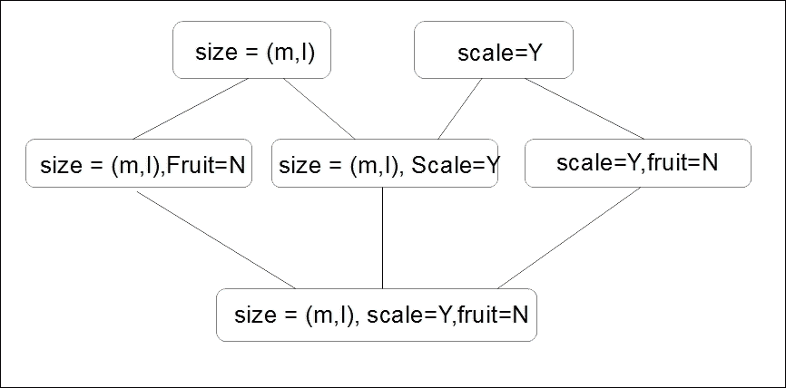
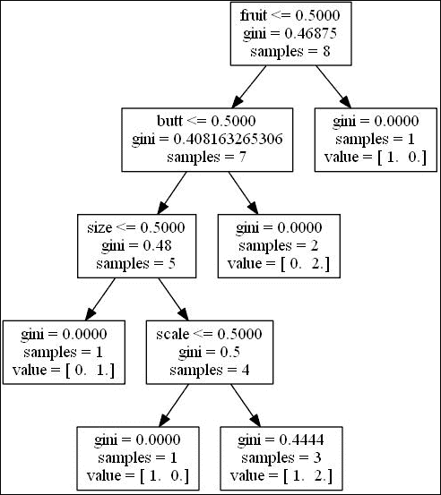
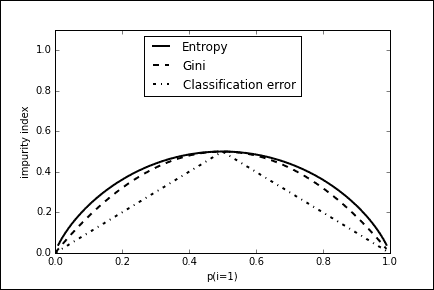
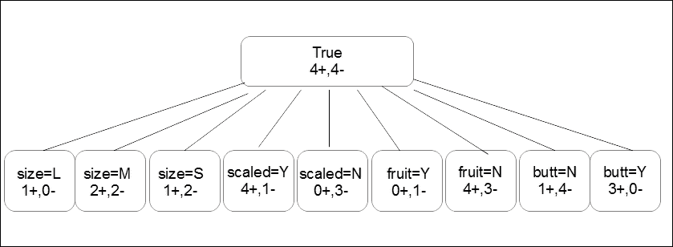
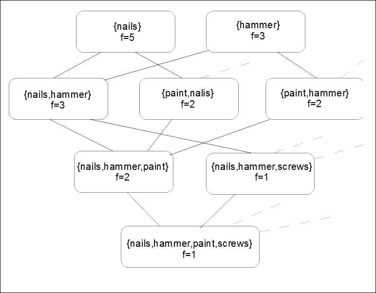

# 四、模型——从信息中学习

到目前为止，在本书中，我们已经检查了一系列的任务和技术。我们介绍了数据类型、结构和属性的基础知识，并且熟悉了一些可用的机器学习工具。

在这一章中，我们将研究三大类模型:

*   逻辑模型
*   树模型
*   规则模型

下一章将专门讨论另一种重要的模型——线性模型。本章的大部分内容都是理论性的，其目的是介绍一些机器学习任务所需的数学和逻辑工具。我鼓励你仔细考虑这些想法，并以可能有助于解决我们遇到的问题的方式来阐述它们。

# 逻辑模型

逻辑模型将实例空间，即所有可能或允许的实例的集合，划分为多个片段。目标是确保每个数据段中的数据对于特定的任务是同质的。例如，如果任务是分类，那么我们的目标是确保每个片段包含相同类的大多数实例。

逻辑模型使用逻辑表达式来解释特定的概念。最简单和最通用的逻辑表达式是文字，其中最常见的是等式。等式表达式可以应用于所有类型—主格、数值和序数。对于数字和序数类型，我们可以包括不等式文字:大于或小于。从这里开始，我们可以使用四个逻辑连接词构建更复杂的表达式。这些是合取(逻辑 AND)，用`∧`表示；析取(逻辑或)，用`∨`表示；寓意，用`→`来表示；和否定，用`┌`表示。这为我们提供了一种表达以下等价关系的方式:

*┌┌A ≡ A = A → B ≡ ┌A ∨ B*

*┌(a∧b)≡┌a∨┌b = ┌(a∨b)≡┌a∧┌b*

我们可以在一个简单的例子中应用这些想法。比方说，你遇到一片小树林，看起来都来自同一物种。我们的目标是确定这一树种的定义特征，用于分类任务。为简单起见，假设我们只处理以下四个特性:

*   尺寸:这个有三个值——小、中、大
*   叶类型:这有两个值—缩放或非缩放
*   水果:这有两个值——是或不是
*   扶壁:这有两个值——是或否

我们识别的第一棵树可以用下面的连词来描述:

*Size = Large∧Leaf = Scaled∧Fruit = No∧supridge = Yes*

我们遇到的下一棵树是中等大小的。如果我们去掉大小条件，那么这个陈述就变得更普遍了。也就是说，它将涵盖更多样本:

*叶=缩放∧果=否∧垛=是*

下一棵树也是中等大小，但它没有扶壁，因此我们删除了这一条件，并将其概括为:

*Leaf = Scaled ∧ Fruit = No*

小树林里的树都满足这种联系，我们断定它们是针叶树。显然，在现实世界的例子中，我们会使用更多的特性和值，并采用更复杂的逻辑结构。然而，即使在这个简单的例子中，**实例空间**也是 3 ^ 2 ^ 2,有 24 个可能的实例。如果我们把缺少一个特征看作一个附加值，那么**假设空间**，也就是我们可以用来描述这个集合的空间就是 *4 3 3 3 = 108* 。可能的实例集或扩展集的数量是*2^(24)。例如，如果你随机选择一组。例如，如果你随机选择一组实例，你能找到准确描述它们的合取概念的几率远远超过 100，000 比 1。*

## 通用性订购

我们可以开始将这个假设空间从最一般的陈述映射到最具体的陈述。例如，在我们的针叶树假设附近，空间看起来像这样:


在这里，我们对我们的假设进行一般性排序。顶部是最普遍的假设——所有的树都是针叶树。更一般的假设将覆盖更多的实例，因此最一般的假设，即所有的树都是针叶树，适用于所有的实例。现在，虽然这可能适用于我们所处的小树林，但当我们试图将这一假设应用于新数据，即小树林外的树木时，它将会失败。在上图的底部，我们有一个最简单的假设。随着我们进行更多的观察并通过节点向上移动，我们可以消除假设并建立下一个最普遍的完整假设。我们可以从数据中做出的最保守的概括被称为这些实例的**最不一般的概括** ( **LGG** )。我们可以把它理解为假设空间中的一个点，在这个点上，从每个实例向上的路径相交。

让我们用表格来描述我们的观察结果:

| 

大小

 | 

有鳞的

 | 

水果

 | 

支持

 | 

标签

 |
| --- | --- | --- | --- | --- |
| L | Y | 普通 | Y | 第一亲代 |
| M | Y | 普通 | Y | p2 |
| M | Y | 普通 | 普通 | p3 |
| M | Y | 普通 | Y | p4 |

当然，迟早你会走出小树林，观察到反面的例子——明显不是针叶树的树。您会注意到以下特征:

| 

大小

 | 

有鳞的

 | 

水果

 | 

支持

 | 

标签

 |
| --- | --- | --- | --- | --- |
| S | 普通 | 普通 | 普通 | n1 |
| M | 普通 | 普通 | 普通 | 氮气 |
| S | 普通 | Y | 普通 | n3 |
| M | Y | 普通 | 普通 | n4 |

所以，加上的反例，我们仍然可以看到，我们最不一般的完全假设仍然是 *Scale = Y ∧ Fruit =N* 。但是，你会注意到一个反面例子， *n4* 被覆盖了。因此，这个假设是不一致的。

## 版本空间

这个简单的例子可能会让你得出只有一个 LGG 的结论。但这不一定是真的。我们可以通过添加一种称为**内部析取**的受限析取形式来扩展我们的假设空间。在我们前面的例子中，我们有三个中型或大型针叶树的正面例子。我们可以加一个条件 *Size = Medium ∨ Size = Large* ，我们可以把这个写成*Size【m，l】*。内部析取仅适用于具有两个以上值的特征，因为类似于*Leaves = Scaled∨Leaves = Non-Scaled*的值始终为`true`。

在前面的针叶树例子中，我们删除了大小条件，以适应我们的第二个和第三个观察。这给了我们以下的 LGG:

*Leaf = Scaled ∧ Leaf = = No*

考虑到我们的内部分离，我们可以将前面的 LGG 重写如下:

*大小[m，l] ∧叶=缩放∧果=否*

现在，考虑第一个非针叶树或负非针叶树的例子:

*大小=小∧叶=无鳞∧果=无*

我们可以去掉带有内部析取的 LGG 中的三个条件中的任何一个，而不涉及这个反面例子。然而，当我们试图进一步扩展到单个条件时，我们看到 *Size[m，l]* 和 *Leaf = Scaled* 是可以的，但 *Fruit = No* 就不行，因为它涵盖了反面的例子。

现在，我们对既**完全**又**一致**的假设感兴趣，也就是说，它涵盖了所有的正例，没有一个负例。现在让我们重新绘制我们的图表，只考虑我们的四个正面( *p1 - p4* )例子和一个负面例子( *n1* )。



有时将称为**版本空间**。请注意，我们有一个最不通用的假设，三个中间假设，现在还有两个最通用的假设。版本空间形成凸集。这意味着我们可以在这个集合的成员之间进行插值。如果一个元素位于集合的最一般成员和最不一般成员之间，那么它也是该集合的成员。这样，我们就可以用版本空间的最一般成员和最不一般成员来完整地描述版本空间。

考虑一种情况，其中最不一般的概括覆盖了一个或多个否定的实例。在这种情况下，我们可以说数据不是**合取可分的**并且版本空间是空的。我们可以应用不同的方法来寻找最一般的一致假设。这里我们感兴趣的是一致性，而不是完整性。这实质上涉及到从最一般的假设空间中遍历路径。我们采取向下的步骤，例如，添加一个合取或从一个内部合取中删除一个值。在每一步，我们都尽量减少由此产生的假设的专门化。

## 覆盖空间

当我们的数据不可分时，我们需要一种方法在一致性和完整性之间进行优化。一种有用的方法是映射正实例和负实例的**覆盖空间**的，如下图所示:


我们可以看到，学习一个假设涉及到通过由一般性排序的假设空间找到一条路径。逻辑模型包括通过一个网格结构的假设空间找到一条路径。这个空间中的每个假设都包含一组实例。这些集合中的每一个集合都有上界和下界，并且按照一般性进行排序。到目前为止，我们只使用了文字的单个连接词。有了丰富的逻辑语言，为什么不在我们的表达中加入各种逻辑连接词呢？基本上有两个原因可以让我们的表达式保持简单，如下所示:

*   更具表达性的语句导致专门化，这将导致模型过度拟合训练数据，并且在测试数据上表现不佳
*   复杂的描述在计算上比简单的描述更昂贵

正如我们在学习合取假设时所看到的，未被发现的正例允许我们从合取中去掉字面量，使它更普遍。另一方面，被覆盖的反例要求我们通过增加文字来增加专门化。

我们可以用子句的析取来描述每个假设，而不是用单个文字的合取来描述，其中每个子句可以是 *A → B* 的形式。这里， *A* 是文字的连词， *B* 是单个文字。让我们考虑下面的陈述，它涵盖了一个负面的例子:

*Butt =Y ∧ Scaled = N ∧ Size = S ∧ ┌果= N*

为了排除这个反面例子，我们可以写出下面的子句:

*Butt = Y∧Scaled = N∧Size = S→Fruit = N*

当然，还有其他排除否定的从句，如*Butt = Y→Fruit = N*；然而，我们感兴趣的是最具体的条款，因为它不太可能也排除涵盖的积极。

## PAC 学习与计算复杂性

鉴于此，随着我们增加逻辑语言的复杂性，我们强加了计算成本，我们需要一个度量来衡量语言的可学性。为此，我们可以用 **的思路大概正确的** ( **PAC** )学习。

当我们从一组假设中选择一个假设时，我们的目标是确保我们的选择以高概率具有低的泛化误差。这将在测试集上以高精度执行。这就引入了的思想**计算复杂度**。这是一种形式化方法，用来衡量给定算法的计算成本与其输出的准确性之间的关系。

PAC 学习允许在非典型例子上出现错误，这种典型性是由一个未指定的概率分布决定的， *D* 。我们可以评估关于这个分布的假设的错误率。例如，让我们假设我们的数据是无噪声的，并且学习者总是在训练样本中输出完整且一致的假设。让我们选择一个任意的错误率ϵ < 0.5 和故障率δ= 0.5。我们要求我们的学习算法输出一个概率≥ 1 - δ的假设，这样错误率将小于 *ϵ* 。事实证明，这对于任何合理规模的训练集都是成立的。例如，如果我们的假设空间 *H* 包含单个坏假设，那么它在 *n 个*独立训练样本上完全一致的概率小于或等于 *(1 - ϵ) ^n* 。对于任何 *0 ≤ ϵ ≤ 1* ，这个概率小于 *e-n ϵ* 。我们需要保持这低于我们的错误率， *δ* ，我们通过设置 *n ≥ 1/ ϵ ln 1/ δ* 来实现。现在，如果 *H* 包含多个坏假设， *k ≤ | H |* ，那么在 *n* 个独立样本中，至少有一个坏假设是完整且一致的概率最大:

*k(1-ϵ)n ≤| h |(1-ϵ)n ≤| h | e-nϵ*

如果满足以下条件，该最大值将小于 *f* :


这就是所谓的 **样本复杂度**，你会注意到它在 *1/δ* 中是对数的，在 *1/ϵ* 中是线性的。

### 注

这意味着降低故障率比降低错误率要便宜得多。

为了结束这一节，我将提出另外一点。假设空间 *H* 是 *U* 的一个子集，是对任何给定现象的解释宇宙。我们如何知道正确的假设是否确实存在于 *H* 中，而不是在 *U* 中的其他地方？贝叶斯定理显示了 *H* 和 *┌ H* 的相对概率以及它们的相对先验概率之间的关系。然而，我们没有真正的方法可以知道 *P┌ H* 的值，因为没有办法计算一个尚未被设想的假设的概率。此外，这个假设的内容包括一个目前未知的可能物体的宇宙。这种悖论出现在任何使用比较假设检验的描述中，在比较假设检验中，我们根据 *H* 内的其他假设评估我们当前的假设。另一种方法是找到一种评估 H 的方法。我们可以看到，随着我们展开 *H* ，其中假设的可计算性变得更加困难。为了评估 H，我们需要将我们的宇宙限制在已知的宇宙中。对一个人来说，这是一种已经印在我们大脑和神经系统中的经验生活；对于机器来说，它是记忆库和算法。评估这个全局假设空间的能力是人工智能的关键挑战之一。


# 树模型

树模型在机器学习中无处不在。他们天生适合分而治之的迭代算法。决策树模型的主要优势之一是它们天生易于可视化和概念化。他们允许检查，而不只是给出一个答案。例如，如果我们必须预测一个类别，我们也可以公开产生特定结果的逻辑步骤。此外，树模型通常比其他模型需要更少的数据准备，并且可以处理数字和分类数据。另一方面，树模型会创建过于复杂的模型，不能很好地概括新数据。树模型的另一个潜在问题是，它们可能对输入数据的变化非常敏感，正如我们将在后面看到的，这个问题可以通过将它们用作集成学习器来缓解。

决策树和上一节中使用的假设映射之间的一个重要的区别是，树模型不在具有两个以上值的特征上使用内部析取，而是在每个值上使用分支。我们可以通过下图中的大小功能看到这一点:


另一点要注意的是，决策树比合取假设更具表达性，我们可以在这里看到这一点，我们已经能够在合取假设覆盖负面例子的情况下分离数据。当然，这种表现力是有代价的:倾向于过度适应训练数据。一种强制泛化和减少过度拟合的方法是引入对不太复杂的假设的归纳偏向。

我们可以很容易地使用 Sklearn `DecisionTreeClassifier`实现我们的小示例，并创建结果树的图像:

```
from sklearn import tree

names=['size','scale','fruit','butt']
labels=[1,1,1,1,1,0,0,0]

p1=[2,1,0,1]
p2=[1,1,0,1]
p3=[1,1,0,0]
p4=[1,1,0,0]
n1=[0,0,0,0]
n2=[1,0,0,0]
n3=[0,0,1,0]
n4=[1,1,0,0]
data=[p1,p2,p3,p4,n1,n2,n3,n4]

def pred(test, data=data):
 dtre=tree.DecisionTreeClassifier()
 dtre=dtre.fit(data,labels)
 print(dtre.predict([test]))
 with open('data/treeDemo.dot', 'w') as f:
 f=tree.export_graphviz(dtre,out_file=f,
 feature_names=names)
pred([1,1,0,1])

```

运行前面的代码创建一个`treeDemo.dot`文件。保存为`.dot`文件的决策树分类器可以使用 **Graphiz** 图形可视化软件转换为`.png`、`.jpeg`或`.gif`等图像文件。你可以从 http://graphviz.org/Download.php 下载 Graphviz。安装好之后，使用它将`.dot`文件转换成您选择的图像文件格式。

这让您清楚地了解决策树是如何被分割的。



我们可以从完整的树中看到，我们在每个节点上递归地分裂，每次分裂都增加了同一类样本的比例。我们继续沿着节点向下，直到到达一个叶节点，在那里我们的目标是拥有一组同类的实例。这个纯度的概念很重要，因为它决定了每个节点是如何被分割的，它位于上图中基尼值的后面。

## 纯度

How do we understand the usefulness of each feature in relation to being able to split samples into classes that contain minimal or no samples from other classes? What are the indicative sets of features that give a class its label? To answer this, we need to consider the idea of purity of a split. For example, consider we have a set of Boolean instances, where *D* is split into *D1* and *D2*. If we further restrict ourselves to just two classes, *D^(pos)* and *D^(neg)*, we can see that the optimum situation is where *D* is split perfectly into positive and negative examples. There are two possibilities for this: either where *D1^(pos) = D^(pos)* and *D1^(neg) = {}*, or *D1^(neg) = D^(neg)* and *D1^(pos) = {}*.

If this is true, then the children of the split are said to be pure. We can measure the impurity of a split by the relative magnitude of *n^(pos)* and *n^(neg)*. This is the empirical probability of a positive class and it can be defined by the proportion *p=n^(pos) /(n^(pos) + n^(neg))*. There are several requirements for an impurity function. First, if we switch the positive and negative class (that is, replace *p* with *1-p*) then the impurity should not change. Also the function should be zero when *p=0* or *p=1*, and it should reach its maximum when *p=0.5*. In order to split each node in a meaningful way, we need an optimization function with these characteristics.

There are three functions that are typically used for impurity measures, or splitting criteria, with the following properties.

*   **Minority class**: This is simply a measure of the proportion of misclassified examples assuming we label each leaf with the majority class. The higher this proportion is, the greater the number of errors and the greater the impurity of the split. This is sometimes called the **classification error**, and is calculated as *min(p,1-p)*.
*   **Gini index**: This is the expected error if we label examples either positive, with probability *p*, or negative, with probability *1-p*. Sometimes, the square root of the Gini index is used as well, and this can have some advantages when dealing with highly skewed data where a large proportion of samples belongs to one class.
*   **Entropy**: This measure of impurity is based on the expected information content of the split. Consider a message telling you about the class of a series of randomly drawn samples. The purer the set of samples, the more predictable this message becomes, and therefore the smaller the expected information. Entropy is measured by the following formula:


These three splitting criteria, for a probability range of between *0* and *1*, are plotted in the following diagram. The entropy criteria are scaled by *0.5* to enable them to be compared to the other two. We can use the output from the decision tree to see where each node lies on this curve.



# Rule models

We can best understand rule models using the principles of discrete mathematics. Let's review some of these principles.

Let *X* be a set of features, the feature space, and *C* be a set of classes. We can define the ideal classifier for *X* as follows:

*c: X → C*

A set of examples in the feature space with class *c* is defined as follows:

*D = {(x[1], c( x[1])), ... , (x[n], c( x[n])) ⊆ X × C*

A splitting of *X* is partitioning *X* into a set of mutually exclusive subsets *X[1]....X[s]*, so we can say the following:

*X = X1 ∪ .. ∪ Xs*

This induces a splitting of *D* into *D[1],...D[s]*. We define *Dj* where *j = 1,...,s* and is *{(x,c(x) ∈ D | x ∈ Xj)}*.

This is just defining a subset in *X* called *Xj* where all the members of *Xj* are perfectly classified.

In the following table we define a number of measurements using sums of indicator functions. An indicator function uses the notation where *I[...]* is equal to one if the statement between the square brackets is true and zero if it is false. Here *τc(x)* is the estimate of *c(x)*.

Let's take a look at the following table:

| **Number of positives** |  |
| **Number of negatives** |  |
| **真阳性** |  |
| **真正的否定** |  |
| **误报** |  |
| **假阴性** |  |
| **精度** |  |
| **错误率** |  |
| **真阳性率(灵敏度、召回率)** |  |
| **真阴性率(阴性回忆)** |  |
| **精准、自信** | T45 |

规则模型不仅包括规则集或规则列表，更重要的是，还包括如何组合这些规则以形成预测的规范。它们是一个逻辑模型，但与树方法的不同之处在于，树分为互斥的分支，而规则可以重叠，可能携带额外的信息。在监督学习中，基本上有两种方法来建立规则模型。一种是找到文字的组合，就像我们之前做的那样，形成一个覆盖足够同质的样本集的假设，然后找到一个标签。或者，我们可以反过来做；也就是说，我们可以首先选择一个类，然后找到覆盖该类足够大的样本子集的规则。第一种方法倾向于产生有序的规则列表，而在第二种方法中，规则是无序的集合。正如我们将看到的，每一种都以自己特有的方式处理重叠的规则。让我们先来看看有序列表方法。

## 有序列表方法

当我们向一个合取规则添加文字时，我们的目标是增加规则覆盖的每个后续实例集的同质性。这类似于在假设空间中构建路径，就像我们在上一节中对逻辑树所做的那样。与规则方法的一个关键区别是，我们只对其中一个子元素的纯度感兴趣，即添加的文字为真的那个子元素。对于基于树的模型，我们使用两个子节点的加权平均值来寻找二元分裂的两个分支的纯度。在这里，我们仍然对计算后续规则的纯度感兴趣；然而，我们只遵循每个分裂的一面。我们仍然可以用同样的方法来寻找纯度，但我们不再需要对所有的孩子进行平均。与决策树的分而治之策略相反，基于规则的学习通常被描述为分而治之。

让我们简单地考虑一个例子，使用前一节中的针叶树分类问题。



有几个选项来选择一个规则，将导致最纯粹的分裂。假设我们选择规则*如果 scaled = N，那么 class 为负*，我们已经覆盖了四个负样本中的三个。在下一次迭代中，我们不考虑这些样本，并继续搜索具有最大纯度的文字。实际上，我们正在做的是构建一个用`if`和`else`子句连接的有序规则列表。我们可以将规则重写为互斥的，这意味着规则集不需要排序。这里的权衡是，我们必须使用取反的文字或内部析取来处理具有两个以上值的特性。

我们可以对这个模型进行某些改进。例如，我们可以引入一个停止标准，如果满足某些条件，则停止迭代，例如在噪声数据的情况下，当每个类别中的样本数量低于某个特定数量时，我们可能希望停止迭代。

有序规则模型与决策树有许多共同之处，特别是，它们使用基于纯度概念的目标函数，纯度是每次分裂中正负类实例的相对数量。它们具有易于可视化的结构，并且在许多不同的机器学习设置中使用。

## 基于集合的规则模型

使用基于集合的规则模型，一次学习一个类的规则，我们的目标函数简单地变成最大化 *p* ，而不是最小化 min( *p，1-p* )。使用这种方法的算法通常迭代每个类，并且只覆盖在找到规则后移除的每个类的样本。基于集合的模型使用精度(参考表 4-1)作为搜索试探法，这可能使模型过于关注规则的纯度；它可能会遗漏近乎纯粹的规则，而这些规则可以被进一步专门化以形成纯粹的规则。另一种称为 **波束搜索**的方法，使用试探法来排序预定数量的最佳部分解决方案。

### 注意

有序列表为我们提供了训练集的凸覆盖。这对于未编码的基于集合的方法不一定是正确的，在该方法中，对于给定的规则集合，不存在全局最优顺序。因此，我们可以访问表示为合取关系 *A∧B* 的规则重叠，其中 *A* 和 *B* 是两个规则集。如果这两个规则在一个有序列表中，如果顺序是 *AB* ， *A = (A∧B) ∨ (A∧┌B)* 或者，如果顺序是 *BA* ， *B = (A∧B) ∨ (┌A∧B)* 。这意味着规则空间可能被扩大；然而，因为我们必须估计重叠的覆盖范围，我们牺牲了凸性。

一般来说，规则模型非常适合预测模型。正如我们将在后面看到的，我们可以扩展我们的规则模型来执行诸如聚类和回归这样的任务。规则模型的另一个重要应用是构建**描述模型**。当我们建立分类模型时，我们通常寻找将创建训练样本的纯子集的规则。然而，如果我们要寻找特定样本集的其他显著特征，这就不一定了。这有时被称为 **子群发现**。这里，我们对基于类纯度的启发式方法不感兴趣，而是对寻找不同类分布的启发式方法感兴趣。这是使用基于局部异常测试思想的定义的质量函数来完成的。该函数可以采用 *q=TP/(FP +g)* 的形式。这里的 *g* 是一个泛化因子，它决定了相对于规则所覆盖的实例数量的非目标类实例的允许数量。对于较小的值 *g* ，比方说小于 *1* ，将生成更具体的规则，因为每个额外的非目标示例都会导致更大的相对*开销*。更高的 *g* 值，比方说大于 *10* ，创建覆盖更多非目标样本的更通用的规则。 *g* 没有理论最大值；但是超过样本数就没有太大意义了。 *g* 的值由数据的大小和阳性样本的比例决定。 *g* 的值可以变化，从而引导子组发现到 *TP* 对 *FP* 空间中的某些点。

我们可以使用主观或客观质量函数。我们可以将主观的*兴趣*系数整合到模型中，以反映诸如可理解性、出乎意料性，或者基于描述兴趣类别的模板的关系模式。客观测量来自数据本身的统计和结构属性。它们非常适合使用覆盖图来突出具有不同于总体的统计特性的子群。

最后，在基于规则的模型这一节中，我们将考虑可以完全在无人监督的情况下学习的规则。这被称为**关联规则学习**，其典型用例包括数据挖掘、推荐系统和自然语言处理。我们将以一家销售四种商品的五金商店为例:**锤子**、**钉子**、**螺丝**、**油漆**。

让我们来看看下表:

| 

交易

 | 

项目

 |
| --- | --- |
| **1** | 指甲 |
| **2** | 锤子和钉子 |
| **3** | 锤子、钉子、油漆和螺钉 |
| **4** | 锤子、钉子和油漆 |
| **5** | 螺丝 |
| **6** | 油漆和螺丝 |
| **7** | 螺钉和钉子 |
| **8** | 颜料 |

在此表中，我们将交易按项目分组。我们还可以将每一项与它所涉及的事务进行分组。比如钉钉参与交易 **1** 、 **2** 、 **3** 、 **4** 、 **7** ，锤子参与 **2** 、 **3** 、 **4** 等等。我们也可以对项目集进行此操作，例如，**锤子**和**钉子**都参与了事务 **2** 、 **3** 和 **4** 。我们可以这样写，因为项目集`{hammer,nails}`覆盖了事务集`[2,3,4]`。包括空集在内共有 16 个项目集，涵盖了所有事务处理。

事务集合之间的关系形成了连接项目和它们各自的集合的网格结构。为了构建关联规则，我们需要创建超过阈值*F[T]的频繁项目集。例如，`F[T] = 3`为`{screws}`、`{hammer,nails}`、`{paint}`的频繁项集。这些只是与三个或更多事务相关联的项目集。下图显示了我们示例中的部分晶格。以类似的方式，我们在我们的假设空间映射中发现了最不一般的一般化。这里，我们感兴趣的是最大项目集的最低边界。本例中为`{nails,hammer}`。*



我们现在可以创建形式为 *if A then B* 的关联规则，其中 *A* 和 *B* 是在事务中频繁出现的项目集。如果我们在这个图上选择一条边，比如说频率为`5`的`{nails}`和频率为`3`的`{nails, hammer}`之间的边，那么我们可以说关联规则*的**置信度**如果钉子然后锤子*是`3/5`。使用频率阈值和规则的置信度，算法可以找到超过该阈值的所有规则。这被称为 **关联规则挖掘**，它通常包括一个后处理阶段，在该阶段中，不必要的规则被过滤掉，例如，更具体的规则并不比更一般的父规则具有更高的可信度。


# 总结

本章开始时，我们探索了一种逻辑语言，并为一个简单的例子创建了一个假设空间映射。我们讨论了最不一般归纳的概念，以及如何找到从最一般假设到最不一般假设的路径。我们简要地看了一下*可学习性*的概念。接下来，我们研究了树模型，发现它们可以应用于广泛的任务，并且既有描述性又易于解释。然而，树本身易于过度拟合，并且大多数树模型采用的贪婪算法可能易于对初始条件过度敏感。最后，我们讨论了有序规则列表和基于无序规则集的模型。这两种不同的规则模型的区别在于它们处理规则重叠的方式。有序的方法是找到文字的组合，将样本分成更相似的组。无序方法一次一类地搜索一个假设。

在下一章中，我们将研究一种完全不同的模型——线性模型。这些模型使用几何数学来描述问题空间，并且，正如我们将看到的，形成了支持向量机和神经网络的基础。