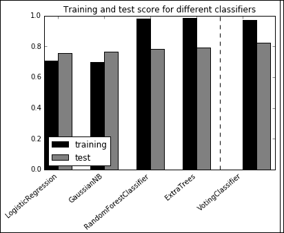
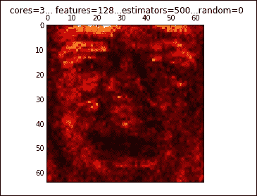
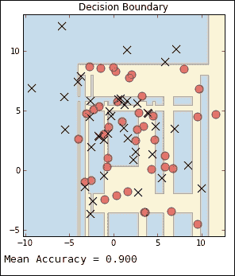
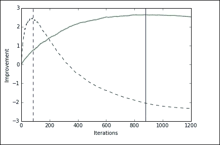

# 八、集成学习

创建机器学习集合的动机来自清晰的直觉，并基于丰富的理论历史。在许多自然和人造系统中，多样性使它们更能适应扰动。类似地，我们已经看到，对大量测量结果进行平均通常可以产生更稳定的模型，该模型不易受随机波动的影响，例如数据收集中的异常值或错误。

在这一章中，我们将把这个相当大而多样的空间分成以下几个主题:

*   集合类型
*   制袋材料
*   随机森林
*   助推

# 系综类型

整体技术可以大致分为两种类型:

*   **平均法**:这是一种方法，其中几个估算器独立运行，它们的预测被平均。这包括随机森林和装袋方法。
*   **Boosting 方法**:这是中的方法，根据错误率，使用数据的加权分布依次构建弱学习器。

集成方法使用多个模型来获得比任何单个组成模型更好的性能。我们的目标不仅是建立多样和健壮的模型，而且是在限制范围内工作，比如处理速度和返回时间。当处理大型数据集和快速响应时间时，这可能是一个重大的开发瓶颈。故障排除和诊断是处理所有机器学习模型的一个重要方面，尤其是当我们处理可能需要几天才能运行的模型时。

可以创建的机器学习集合的类型就像模型本身一样多种多样，并且主要考虑围绕三件事:我们如何划分数据，我们如何选择模型，以及我们用来组合它们的结果的方法。这种简单的说法实际上包含了一个非常大和多样化的空间。


# 装袋

Bagging，也称为 **bootstrap aggregating** ，有几种风格，它们是通过从训练数据中抽取随机子集的方式来定义的。最常见的是，装袋是指抽取样品并替换。因为样本被替换，所以生成的数据集可能包含重复项。这也意味着数据点可能会从特定的生成数据集中排除，即使该生成数据集与原始数据集大小相同。每个生成的数据集将是不同的，这是在集合中的模型之间创建多样性的一种方式。我们可以使用以下示例计算样本中某个数据点未被选中的概率:


这里， *n* 是 bootstrap 样本的个数。每个 *n* 引导样本产生不同的假设。通过平均模型或者通过选择由大多数模型预测的类别来预测类别。考虑线性分类器的集成。如果我们使用多数投票来确定预测的类别，我们创建分段线性分类器边界。如果我们将投票转换为概率，那么我们将实例空间划分为片段，每个片段可能具有不同的分数。

还应该提到的是，使用随机的特征子集是可能的，有时也是可取的；这叫做 **子空间采样**。Bagging 估计器最适用于复杂模型，如完全开发的决策树，因为它们有助于减少过度拟合。它们提供了一种简单的、现成的方法来改进单一模型。

Scikit-learn 实现了一个`BaggingClassifier`和`BaggingRegressor`对象。以下是一些最重要的参数:

| 

参数

 | 

类型

 | 

描述

 | 

默认

 |
| --- | --- | --- | --- |
| `base_estimator` | 估计量 | 这是模型，整个组合就是建立在这个模型上的。 | 决策图表 |
| `n_estimators` | （同 Internationalorganizations）国际组织 | 这是基础估计量的数。 | 10 |
| `max_samples` | Int 或 float | 这是要抽取的样本的号。如果浮动绘制`max_samples*X.shape[0]`。 | 1.0 |
| `max_features` | Int 或 float | 这是要绘制的特征数量。如果浮动绘制`max_features*X.shape[1]`。 | 1.0 |
| `bootstrap` | 布尔代数学体系的 | 这些是替换抽取的样品。 | 真实的 |
| `bootstrap_features` | 布尔代数学体系的 | 这些是用替换绘制的特征。 | 错误的 |

作为一个例子，下面的片段实例化了一个 bagging 分类器，它由 50 个决策树分类器基础估计器组成，每个估计器都建立在一半特征和一半样本的随机子集上:

```
from sklearn.ensemble import BaggingClassifier
from sklearn.tree import DecisionTreeClassifier
from sklearn import datasets

bcls=BaggingClassifier(DecisionTreeClassifier(),max_samples=0.5, max_features=0.5, n_estimators=50)
X,y=datasets.make_blobs(n_samples=8000,centers=2, random_state=0, cluster_std=4)
bcls.fit(X,y)
print(bcls.score(X,y))

```

## 随机森林

基于树的模型特别适合集成，主要是因为它们对训练数据的变化很敏感。当与 **子空间采样**一起使用时，树模型可以非常有效，从而产生更多样的模型，并且由于集合中的每个模型仅处理特征的子集，因此减少了训练时间。这使用特征的不同随机子集构建每棵树，因此被称为**随机森林**。

随机森林通过查找森林中单个树中分区的交集来划分实例空间。它定义了一个比林中任何一棵树创建的分区都更精细的分区，也就是说，包含更多的细节。原则上，一个随机森林可以映射回一个单独的树，因为每个交叉点对应于两个不同树的分支的组合。随机森林可以被认为是，本质上是基于树的模型的另一种训练算法。bagging 集成中的线性分类器能够学习单个线性分类器不可能学习的复杂决策边界。

`sklearn.ensemble`模块有两种基于决策树的算法，随机森林和极度随机化树。它们都通过在构造中引入随机性来创建不同的分类器，并且都包括用于分类和回归的类。使用`RandomForestClassifier`和`RandomForestRegressor`类，每棵树都是使用引导样本构建的。模型选择的分割并不是所有要素中的最佳分割，而是从要素的随机子集中选择的。

## 多余的树

与随机森林一样，`extra trees`方法使用随机的特征子集，但不是使用最具区分性的阈值，而是使用随机生成的一组阈值中的最佳阈值。这有助于以偏差小幅增加为代价降低方差。两个班分别是`ExtraTreesClassifier`和`ExtraTreesRegressor`。

让我们来看一个`random forest`分类器和`extra trees`分类器的例子。在这个例子中，我们使用`VotingClassifier`来组合不同的分类器。投票分类器可以帮助平衡单个模型的弱点。在这个例子中，我们将四个权重传递给函数。这些权重决定了每个模型对整体结果的贡献。我们可以看到，这两个树模型过度拟合了训练数据，但在测试数据上也往往表现得更好。我们还可以看到，`ExtraTreesClassifier`在测试集上取得了比`RandomForest`对象稍好的结果。此外，`VotingClasifier`对象在测试集上的表现优于它的所有组成分类器。值得一提的是，在不同的数据集上使用不同的权重运行该模型时，可以看到每个模型的性能是如何变化的:

```
from sklearn import cross_validation
import numpy as np
import matplotlib.pyplot as plt
from sklearn.linear_model import LogisticRegression
from sklearn.naive_bayes import GaussianNB
from sklearn.ensemble import RandomForestClassifier
from sklearn.ensemble import ExtraTreesClassifier
from sklearn.ensemble import VotingClassifier
from sklearn import datasets

def vclas(w1,w2,w3, w4):

 X , y = datasets.make_classification(n_features= 10, n_informative=4, n_samples=500, n_clusters_per_class=5)
 Xtrain,Xtest, ytrain,ytest= cross_validation.train_test_split(X,y,test_size=0.4)

 clf1 = LogisticRegression(random_state=123)
 clf2 = GaussianNB()
 clf3 = RandomForestClassifier(n_estimators=10,bootstrap=True, random_state=123)
 clf4= ExtraTreesClassifier(n_estimators=10, bootstrap=True,random_state=123)

 clfes=[clf1,clf2,clf3,clf4]

 eclf = VotingClassifier(estimators=[('lr', clf1), ('gnb', clf2), ('rf', clf3),('et',clf4)],
 voting='soft',
 weights=[w1, w2, w3,w4])

 [c.fit(Xtrain, ytrain) for c in (clf1, clf2, clf3,clf4, eclf)]

 N = 5
 ind = np.arange(N)
 width = 0.3
 fig, ax = plt.subplots()

 for i, clf in enumerate(clfes):
 print(clf,i)
 p1=ax.bar(i,clfes[i].score(Xtrain,ytrain,), width=width,color="black")
 p2=ax.bar(i+width,clfes[i].score(Xtest,ytest,), width=width,color="grey")
 ax.bar(len(clfes)+width,eclf.score(Xtrain,ytrain,), width=width,color="black")
 ax.bar(len(clfes)+width *2,eclf.score(Xtest,ytest,), width=width,color="grey")
 plt.axvline(3.8, color='k', linestyle='dashed')
 ax.set_xticks(ind + width)
 ax.set_xticklabels(['LogisticRegression',
 'GaussianNB',
 'RandomForestClassifier',
 'ExtraTrees',
 'VotingClassifier'],
 rotation=40,
 ha='right')
 plt.title('Training and test score for different classifiers')
 plt.legend([p1[0], p2[0]], ['training', 'test'], loc='lower left')
 plt.show()

vclas(1,3,5,4)

```

您将观察到以下输出:



树模型允许我们根据它们所贡献的样本的预期部分来评估特征的相对等级。这里，我们使用一个来评估分类任务中每个特征的重要性。一个特性的相对重要性取决于它在树中的位置。树顶部的特征有助于更大比例的输入样本的最终决策。

下面的例子使用了一个`ExtraTreesClassifier`类来映射特性的重要性。我们正在使用的数据集由 10 幅图像组成，每幅图像包含 40 个人，总共有 400 幅图像。每张图片都有一个标签，表明这个人的身份。在这个任务中，每个像素是一个特征；在输出中，像素的亮度表示要素的相对重要性。像素越亮，特征越重要。请注意，在这个模型中，最亮的像素在前额区域，我们应该小心如何解释这一点。由于大多数照片都是从头部上方照射的，这些像素显然非常重要，这可能是因为额头往往被更好地照亮，因此揭示了个人的更多细节，而不是一个人额头在表明其身份方面的内在属性:

```
import matplotlib.pyplot as plt
from sklearn.datasets import fetch_olivetti_faces
from sklearn.ensemble import ExtraTreesClassifier
data = fetch_olivetti_faces()
def importance(n_estimators=500, max_features=128, n_jobs=3, random_state=0):
 X = data.images.reshape((len(data.images), -1))
 y = data.target
 forest = ExtraTreesClassifier(n_estimators,max_features=max_features, n_jobs=n_jobs, random_state=random_state)
 forest.fit(X, y)
 dstring=" cores=%d..." % n_jobs + " features=%s..." % max_features +"estimators=%d..." %n_estimators + "random=%d" %random_state 
 print(dstring)
 importances = forest.feature_importances_
 importances = importances.reshape(data.images[0].shape)
 plt.matshow(importances, cmap=plt.cm.hot)
 plt.title(dstring)
 #plt.savefig('etreesImportance'+ dstring + '.png')
 plt.show()

importance()

```

上述代码的输出如下:



# 助推

在本书的前面，我介绍了 PAC 学习模型的思想和概念类的思想。一个相关的想法是的**弱可学性**。这里，集合中的每个学习算法只需要比机会稍好一点。例如，如果集合中的每个算法至少有 51%的时间是正确的，那么弱可学性的标准被满足。事实证明，PAC 和弱可学习性的概念本质上是相同的，只是对于后者，我们放弃了算法必须达到任意高精度的要求。然而，它仅仅比随机假设表现得更好。你可能会问，这有什么用？找到粗略的经验法则比高度精确的预测法则更容易。这种弱学习模型的表现可能只比 chance 稍好一点；然而，如果我们*通过对数据的不同加权分布运行多次来增强*这个学习器，并通过组合这些学习器，我们就有希望建立一个比任何单个弱学习规则表现更好的单一预测规则。

助推是一个简单而强大的想法。它通过考虑模型的训练误差来扩展 bagging。例如，如果我们训练一个线性分类器，发现它对某个实例集进行了错误分类。如果我们在包含这些错误分类实例的副本的数据集上训练后续模型，那么我们会期望这个新训练的模型在测试集上表现得更好。通过在训练集中包含错误分类实例的副本，我们将数据集的平均值向这些实例转移。这迫使学习者把注意力集中在最难分类的例子上。这在实践中通过给予错误分类的实例更高的权重，然后修改模型以考虑这一点来实现，例如，在线性分类器中，我们可以通过使用加权平均值来计算类平均值。

从总和为 1 的均匀权重数据集开始，我们运行分类器，可能会对一些实例进行错误分类。为了增加这些实例的权重，我们给它们分配总权重的一半。例如，考虑一个给我们以下结果的分类器:

|   | 

预测阳性

 | 

预测阴性

 | 

总数

 |
| --- | --- | --- | --- |
| **实际位置。** | 24 | 16 | 40 |
| **实际阴性。** | 9 | 51 | 60 |
| **总计** | 33 | 67 | 100 |

错误率为 *ɛ = (9 + 16)/100 = 0.25* 。

我们希望将一半的错误权重分配给错误分类的样本，由于我们从总和为 1 的统一权重开始，分配给错误分类的样本的当前权重就是错误率。因此，为了更新权重，我们将它们乘以因子 *1/2ɛ* 。假设错误率小于 0.5，这导致错误分类的例子的权重增加。为了确保权重总和仍然为 1，我们将正确分类的示例乘以 *(1-ɛ)* 。在本例中，错误率(错误分类样本的初始权重)为 0.25，我们希望它为 0.5，即总权重的一半，因此我们将该初始错误率乘以 2。正确分类的实例的权重是 *1/2(1-ɛ) = 2/3* 。考虑到这些权重，结果如下表所示:

|   | 

预测阳性

 | 

预测阴性

 | 

总数

 |
| --- | --- | --- | --- |
| **实际位置。** | 16 | 32 | 48 |
| 实际阴性。 | 18 | 34 | 60 |
| **总计** | 33 | 67 | 100 |

我们需要的最后一部分是一个置信因子， *α* ，它应用于集合中的每个模型。这用于基于来自每个单独模型的加权平均值进行集合预测。我们希望随着误差的减少而增加。确保这种情况发生的一种常见方法是将置信因子设置为以下值:


因此，我们得到一个数据集，如下所示:


然后我们初始化一个相等的加权分布，如下所示:


使用一个弱分类器，*h[t]，我们可以编写一个更新的规则如下:*


用归一化因子，如下所示:


注意*exp(-y[I]h[t](x[I])*为正且大于 1 如果*-y[I]h[t](x[I])*为正，如果 *x [i]* 分类错误就会出现这种情况。结果是，更新规则将增加错误分类样本的权重，并减少正确分类样本的权重。

我们可以按如下方式编写最终的分类器:


## Adaboost

最流行的增强算法之一叫做 **AdaBoost** 或**自适应增强**。这里，决策树分类器被用作基础学习器，它在不可线性分离的数据上建立决策边界:

```
import numpy as np
import matplotlib.pyplot as plt
from sklearn.ensemble import AdaBoostClassifier
from sklearn.tree import DecisionTreeClassifier
from sklearn.datasets import make_blobs

plot_colors = "br"
plot_step = 0.02
class_names = "AB"
tree= DecisionTreeClassifier()
boost=AdaBoostClassifier()
X,y=make_blobs(n_samples=500,centers=2, random_state=0, cluster_std=2)
boost.fit(X,y)
plt.figure(figsize=(10, 5))

# Plot the decision boundaries
plt.subplot(121)
x_min, x_max = X[:, 0].min() - 1, X[:, 0].max() + 1
y_min, y_max = X[:, 1].min() - 1, X[:, 1].max() + 1
xx, yy = np.meshgrid(np.arange(x_min, x_max, plot_step),
 np.arange(y_min, y_max, plot_step))

Z = boost.predict(np.c_[xx.ravel(), yy.ravel()])
Z = Z.reshape(xx.shape)
cs = plt.contourf(xx, yy, Z, cmap=plt.cm.Paired)
plt.axis("tight")

for i, n, c in zip(range(2), class_names, plot_colors):
 idx = np.where(y == i)
 plt.scatter(X[idx, 0], X[idx, 1],
 c=c, cmap=plt.cm.Paired,
 label="Class %s" % n)
plt.title('Decision Boundary')

twoclass_output = boost.decision_function(X)
plot_range = (twoclass_output.min(), twoclass_output.max())
plt.subplot(122)
for i, n, c in zip(range(2), class_names, plot_colors):
 plt.hist(twoclass_output[y == i],
 bins=20,
 range=plot_range,
 facecolor=c,
 label='Class %s' % n,
 alpha=.5)
x1, x2, y1, y2 = plt.axis()
plt.axis((x1, x2, y1, y2))
plt.legend(loc='upper left')
plt.ylabel('Samples')
plt.xlabel('Score')
plt.title('Decision Scores')
plt.show()
print("Mean Accuracy =%f" % boost.score(X,y))

```

下面的是前面命令的输出:



## 梯度提升

梯度树提升对于回归和分类问题都是非常有用的算法。它的主要优势之一是它自然地处理混合数据类型，并且它对异常值也相当健壮。此外，它比许多其他算法有更好的预测能力；然而，它的顺序架构使它不适合并行技术，因此，它不能很好地扩展到大型数据集。对于类数量较多的数据集，建议使用`RandomForestClassifier`代替。梯度提升通常使用决策树来建立基于弱学习者集合的预测模型，对成本函数应用优化算法。

在以下示例中，我们创建了一个函数，该函数构建了一个梯度提升分类器，并绘制了其累积损失与迭代次数的关系图。`GradientBoostingClassifier`类有一个`oob_improvement_`属性，在这里用于计算每次迭代的测试损失的估计值。与之前的迭代相比，这降低了我们的损失。这对于确定最佳迭代次数是一个非常有用的启发。这里，我们绘制了两个梯度提升分类器的累积改进。每个分类器都是相同的，但学习率不同，虚线为 *.01* ，实线为 *.001* 。

学习率缩小了每棵树的贡献，这意味着在估计器的数量上有一个折衷。在这里，我们实际上看到，学习率越大，模型似乎比学习率较低的模型更快地达到最佳性能。然而，这种模式似乎取得了更好的结果。在实践中通常发生的是`oob_improvement`在大量迭代中以悲观的方式偏离。让我们来看看以下命令:

```
import numpy as np
import matplotlib.pyplot as plt
from sklearn import ensemble
from sklearn.cross_validation import train_test_split
from sklearn import datasets

def gbt(params, X,y,ls):
 clf = ensemble.GradientBoostingClassifier(**params)
 clf.fit(X_train, y_train)
 cumsum = np.cumsum(clf.oob_improvement_)
 n = np.arange(params['n_estimators'])
 oob_best_iter = n[np.argmax(cumsum)]
 plt.xlabel('Iterations')
 plt.ylabel('Improvement')
 plt.axvline(x=oob_best_iter,linestyle=ls)
 plt.plot(n, cumsum, linestyle=ls)

X,y=datasets.make_blobs(n_samples=50,centers=5, random_state=0, cluster_std=5)
X_train, X_test, y_train, y_test = train_test_split(X, y, test_size=0.5, random_state=9)

p1 = {'n_estimators': 1200, 'max_depth': 3, 'subsample': 0.5,
 'learning_rate': 0.01, 'min_samples_leaf': 1, 'random_state': 3}
p2 = {'n_estimators': 1200, 'max_depth': 3, 'subsample': 0.5,
 'learning_rate': 0.001, 'min_samples_leaf': 1, 'random_state': 3}

gbt(p1, X,y, ls='--')
gbt(p2, X,y, ls='-')

```

您将观察到以下输出:



# 集成策略

我们研究了两种广泛的集成技术:bagging，应用随机森林和额外的树，以及 boosting，特别是 AdaBoost 和梯度树 boosting。当然，还有许多其他的变体和组合。在这一章的最后一节，我想研究一些选择和应用不同组合完成特定任务的策略。

一般来说，在分类任务中，有三个原因会导致模型对测试实例的错误分类。首先，如果来自不同类别的特征由相同的特征向量描述，这可能是不可避免的。在概率模型中，当类分布重叠时会发生这种情况，因此一个实例对于几个类具有非零的可能性。这里我们只能近似一个目标假设。

分类错误的第二个原因是模型不具有完全表示目标假设的表达能力。例如，如果数据不是线性可分的，即使最好的线性分类器也会对实例进行错误分类。这是由于分类器的偏差。虽然没有统一的方法来衡量偏差，但我们可以看到，非线性决策边界比线性决策边界的偏差更小，或者更复杂的决策边界比简单的决策边界的偏差更小。我们还可以看到，树模型的偏差最小，因为它们可以继续分支，直到每个叶子只覆盖一个实例。

现在，看起来我们应该尽量减少偏见；然而，在大多数情况下，降低偏差会增加方差，反之亦然。正如您可能已经猜到的，方差是分类错误的第三个来源。高方差模型高度依赖于训练数据。例如，最近邻的分类器将实例空间分割成单个训练点。如果决策边界附近的训练点被移动，那么该边界将改变。树模型也有很高的方差，但原因不同。考虑我们以在树根选择不同特征的方式改变训练数据。这可能会导致树的其余部分有所不同。

线性分类器的袋装集成能够通过分段构造来学习更复杂的决策边界。集合中的每个分类器创建一段决策边界。这表明 bagging，实际上任何集合方法，能够减少高偏差模型的偏差。然而，我们在实践中发现，增强通常是减少偏差的一种更有效的方式。

### 注意

Bagging 主要是一种方差减小技术，boosting 主要是一种偏差减小技术。

Bagging 集成对高方差模型(如复杂树)最有效，而 boosting 通常用于高偏差模型(如线性分类器)。

我们可以从的**差额的角度来看助推。这可以理解为距决策边界的带符号距离；正号表示正确的类别，负号表示错误的类别。可以显示的是，即使样本已经在判定边界的正确一侧，提升也可以增加该裕量。换句话说，即使训练错误为零，增强也可以继续提高测试集的性能。**

## 其他方法

集合方法的主要变化是通过改变组合基本模型预测的方式来实现的。我们实际上可以将这本身定义为一个学习问题，假设作为特征的一组基本分类器的预测学习一个最佳组合其预测的 **元模型**。学习线性元模型被称为**堆叠**或**堆叠概括**。堆叠使用所有学习者的加权组合，并且在分类任务中，使用组合器算法如逻辑回归进行最终预测。与装袋或助推不同，与装桶类似，堆叠通常用于不同类型的模型。

典型的堆叠程序包括以下步骤:

1.  将训练集拆分为两个不相连的集合。
2.  在第一套上训练几个基础学习者。
3.  在第二组测试基础学习者。
4.  使用上一步的预测来训练更高水平的学习者。

注意，前三个步骤与交叉验证相同；然而，基础学习者被结合，可能是非线性的，而不是采取赢家通吃的方法。

这个主题的一个变体是**桶形**。这里，选择算法用于为每个问题选择最佳模型。例如，可以通过对每个模型的预测进行加权，使用感知来挑选最佳模型。由于有大量不同的模型，有些模型比其他模型需要更长的训练时间。在集合中使用它的一种方法是首先使用快速但不精确的算法来选择哪个更慢但更精确的算法可能做得最好。

我们可以使用一组不同的基础学习者来融合多样性。这种多样性来自不同的学习算法，而不是数据。这意味着每个模型可以使用相同的训练集。通常，基础模型由相同类型的组组成，但具有不同的超参数设置。

总体而言，集成由一组基础模型和一个元模型组成，它们被训练来寻找组合这些基础模型的最佳方式。如果我们使用一组加权的模型，并以某种方式组合它们的输出，我们假设如果一个模型的权重接近于零，那么它对输出的影响将非常小。可以想象，基础分类器具有负权重，并且在这种情况下，其预测相对于其他基础模型将被反转。我们甚至可以更进一步，甚至在我们训练它之前，尝试预测一个基本模型的表现有多好。这有时被称为**元学习**。首先，这涉及在大量数据上训练各种模型，并构建一个模型来帮助我们回答一些问题，如在特定数据集上哪个模型可能优于另一个模型，或者数据是否表明特定(元)参数可能工作得最好？

请记住，在评估所有可能的问题时，没有一种学习算法能够胜过另一种算法，例如，如果所有可能的序列都是可能的，则预测下一个数字是一个序列。当然，现实世界中的学习问题具有非均匀分布，这使得我们能够在其上建立预测模型。元学习中的重要问题是如何设计元模型所基于的特征。他们需要结合训练模型和数据集的相关特征。此必须包括特征数量和类型以及样本数量之外的数据方面。


# 总结

在这一章中，我们看了 scikit-learn 中的主要集成方法及其实现。很明显，有很大的工作空间，找到对不同类型的问题最有效的技术是关键的挑战。我们看到偏差和方差的问题都有自己的解决方案，理解每个问题的关键指标是很重要的。获得好的结果通常需要大量的实验，使用本章描述的一些简单技术，你可以开始你的机器学习之旅。

在下一章也是最后一章，我们将介绍最重要的主题——模型选择和评估——并从不同的角度考察一些现实世界的问题。