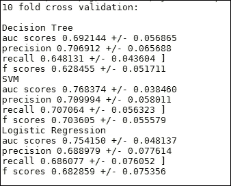
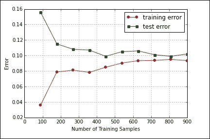

# 九、设计策略和案例研究

除了可能的数据例外，评估可能是机器学习科学家花费大部分时间做的事情。盯着一列列的数字和图表，满怀希望地看着他们的模型运行，并认真地试图理解他们的输出。评估是一个循环过程；我们运行模型，评估结果，并插入新的参数，每次都希望这会导致性能的提高。随着我们提高每个评估周期的效率，我们的工作变得更加愉快和富有成效，有一些工具和技术可以帮助我们实现这一点。本章将通过以下主题介绍其中一些:

*   评估模型性能
*   型号选择
*   真实世界案例研究。
*   机器学习设计一览

# 评估模型性能

测量模型的性能是一项重要的机器学习任务，有许多不同的参数和启发式方法来完成这项任务。不应低估定义得分策略的重要性，在 Sklearn 中，基本上有三种方法:

*   **评估者得分**:这个是指使用评估者的内置`score()`方法，具体到每个评估者
*   **评分参数**:这是指依赖于内部评分策略的交叉验证工具
*   **度量函数**:这些在度量模块中实现

我们已经看到了估计量`score()`方法的例子，例如`clf.score()`。在线性分类器的情况下，`score()`方法返回平均准确度。这是一种快速简单的方法来衡量个人评估者的表现。然而，由于多种原因，这种方法本身通常是不够的。

如果我们还记得的话，准确性是真阳性和真阴性案例的总和除以样本的数量。以此作为衡量标准表明，如果我们对许多患者进行测试，以了解他们是否患有特定疾病，那么简单地预测每个患者都没有疾病可能会给我们带来很高的准确性。显然，这不是我们想要的。

一个更好的测量性能的方法是使用 by **precision** 、 **P** 和 **Recall** 、 **R** 。如果你还记得中的表格[第四章](ch04.html "Chapter 4. Models – Learning from Information")，*模型——从信息中学习*，精度，或者说特异性，是正确的预测正例的比例，也就是 *TP/(TP+FP)* 。回忆，或者说敏感度，是 *TP/(TP+FN)* 。F-measure 定义为 *2*R*P/(R+P)* 。这些方法忽略了真正的否定率，因此它们不能评估一个模型处理否定情况的能力。

与其使用估计器的评分方法，不如使用特定的评分参数，比如那些由`cross_val_score`对象提供的参数，这通常是有意义的。这有一个`cv`参数控制数据如何分割。它通常被设置为 int，它决定了对数据进行多少次随机的连续分割。每一种都有不同的分割点。此参数也可以设置为训练和测试分割的可迭代对象，或者可以用作交叉验证生成器的对象。

在`cross_val_score`中同样重要的是评分参数。这通常由表示得分策略的字符串来设置。对于分类，默认为*精度*，一些常用值有`f1`、`precision`、`recall`，以及这些的微观平均、宏观平均、加权版本。对于回归估计器，`scoring`值为`mean_absolute_error`、`mean_squared error`、`median_absolute_error`和`r2`。

下面的代码使用 10 次连续拆分来评估数据集上三个模型的性能。在这里，我们打印出了四个模型中每一个模型的分数平均值，使用了几种测量方法。在现实世界中，我们可能需要以一种或多种方式对数据进行预处理，将这些数据转换应用到测试集和训练集是非常重要的。为了使这更容易，我们可以使用`sklearn.pipeline`模块。这依次应用了一系列的转换和一个最终的估计器，并且它允许我们集合几个可以一起交叉验证的步骤。这里，我们还使用了`StandardScaler()`类来缩放数据。通过使用两条管道将缩放应用于逻辑回归模型和决策树:

```py
from sklearn import cross_validation
from sklearn.tree import DecisionTreeClassifier
from sklearn import svm
from sklearn.linear_model import LogisticRegression
from sklearn.datasets import samples_generator
from sklearn.preprocessing import LabelEncoder
from sklearn.preprocessing import StandardScaler
from sklearn.cross_validation import cross_val_score
from sklearn.pipeline import Pipeline
X, y = samples_generator.make_classification(n_samples=1000,n_informative=5, n_redundant=0,random_state=42)
le=LabelEncoder()
y=le.fit_transform(y)
Xtrain, Xtest, ytrain, ytest = cross_validation.train_test_split(X, y, test_size=0.5, random_state=1)
clf1=DecisionTreeClassifier(max_depth=2,criterion='gini').fit(Xtrain,ytrain)
clf2= svm.SVC(kernel='linear', probability=True, random_state=0).fit(Xtrain,ytrain)
clf3=LogisticRegression(penalty='l2', C=0.001).fit(Xtrain,ytrain)
pipe1=Pipeline([['sc',StandardScaler()],['mod',clf1]])
mod_labels=['Decision Tree','SVM','Logistic Regression' ]
print('10 fold cross validation: \n')
for mod,label in zip([pipe1,clf2,clf3], mod_labels):
 #print(label)
 auc_scores= cross_val_score(estimator= mod, X=Xtrain, y=ytrain, cv=10, scoring ='roc_auc')
 p_scores= cross_val_score(estimator= mod, X=Xtrain, y=ytrain, cv=10, scoring ='precision_macro')
 r_scores= cross_val_score(estimator= mod, X=Xtrain, y=ytrain, cv=10, scoring ='recall_macro')
 f_scores= cross_val_score(estimator= mod, X=Xtrain, y=ytrain, cv=10, scoring ='f1_macro')

 print(label)
 print("auc scores %2f +/- %2f " % (auc_scores.mean(), auc_scores.std()))
 print("precision %2f +/- %2f " % (p_scores.mean(), p_scores.std()))
 print("recall %2f +/- %2f ]" % (r_scores.mean(), r_scores.std()))
 print("f scores %2f +/- %2f " % (f_scores.mean(), f_scores.std()))

```

执行时，您将看到以下输出:



这些技术有几种变体，最常用的是所谓的 **k 倍交叉验证**。这使用了有时被称为*留一个出来*的策略。首先，使用褶皱的 *k* —1 作为训练数据来训练模型。然后，剩余的数据用于计算性能指标。对每个折叠重复这一过程。性能计算为所有折叠的平均值。

Sklearn 使用`cross_validation.KFold`对象实现了。重要的参数是必需的`int`，表示元素的总数，以及一个`n_folds`参数，默认为`3`，表示折叠的数量。它还采用可选的`shuffle`和`random_state`参数，指示在分割之前是否打乱数据，以及使用什么方法来生成随机状态。默认的`random_state`参数是使用 NumPy 随机数发生器。

在下面的代码片段中，我们使用了`LassoCV`对象。这是用 L1 正则化训练的线性模型。如果您还记得的话，正则化线性回归的优化函数包括一个乘以 L1 正则项的常数(alpha)。`LassoCV`对象自动设置该 alpha 值，为了查看其有效性，我们可以比较所选的 alpha 值和每个 k 倍的分数:

```py
import numpy as np
from sklearn import cross_validation, datasets, linear_model
X,y=datasets.make_blobs(n_samples=80,centers=2, random_state=0, cluster_std=2)
alphas = np.logspace(-4, -.5, 30)
lasso_cv = linear_model.LassoCV(alphas=alphas)
k_fold = cross_validation.KFold(len(X), 5)
alphas = np.logspace(-4, -.5, 30)

for k, (train, test) in enumerate(k_fold):
 lasso_cv.fit(X[train], y[train])
 print("[fold {0}] alpha: {1:.5f}, score: {2:.5f}".
 format(k, lasso_cv.alpha_, lasso_cv.score(X[test], y[test])))

```

上述命令的输出如下:


有时，有必要保留每个文件夹中类的百分比。这是使用**分层交叉验证**完成的。当类别不平衡时，也就是说，当一些类别的数量较多而另一些类别的数量很少时，这是很有帮助的。使用分层的`cv`对象可能有助于纠正模型中可能导致偏差的缺陷，因为一个类别在一个折叠中的数量不足以做出准确的预测。然而，这也可能导致不必要的方差增加。

在下面的例子中，我们使用分层交叉验证来测试分类分数的显著性。这是通过在随机化标签后重复分类程序来完成的。 *p* 值是分数大于最初获得的分类分数的运行百分比。这个代码片段使用了`cross_validation.permutation_test_score`方法，该方法将估算器、数据和标签作为参数。在这里，我们打印出初始测试分数、 *p* 值和每个排列的分数:

```py
import numpy as np
from sklearn import linear_model
from sklearn.cross_validation import StratifiedKFold, permutation_test_score
from sklearn import datasets

X,y=datasets.make_classification(n_samples=100, n_features=5)
n_classes = np.unique(y).size
cls=linear_model.LogisticRegression()
cv = StratifiedKFold(y, 2)
score, permutation_scores, pvalue = permutation_test_score(cls, X, y, scoring="f1", cv=cv, n_permutations=10, n_jobs=1)

print("Classification score %s (pvalue : %s)" % (score, pvalue))
print("Permutation scores %s" % (permutation_scores))

```

这给了以下输出:


# 型号选择

有许多超级参数可以调整以提高性能。这往往不是一个简单的过程，要确定各种参数的影响，无论是单独的还是相互结合的。常见的尝试包括获取更多训练样本、添加或移除要素、添加多项式要素以及增加或减少正则化参数。考虑到我们可以花费大量的时间来收集更多的数据，或者以其他方式处理数据，所以你所花费的时间有可能产生富有成效的结果是很重要的。最重要的方法之一是使用网格搜索。

## 网格搜索

`sklearn.grid_search.GridSearchCV`对象用于对指定的参数值进行彻底搜索。这允许通过定义的参数集进行迭代，并以各种度量的形式报告结果。`GridSearchCV`对象的重要参数是估计器和参数网格。`param_grid`参数是一个字典或字典列表，参数名作为键，参数设置列表作为值。这使得能够搜索估计器参数值的任何序列。估计量的任何可调参数都可以与网格搜索一起使用。默认情况下，网格搜索使用估计器的`score()`函数来评估参数值。对于分类来说，这是准确性，正如我们所看到的，这可能不是最好的衡量标准。在这个例子中，我们将`GridSearchCV`对象的评分参数设置为`f1`。

在下面的代码中，我们在 L1 正则化和 L2 正则化下，在一系列`C`值(逆正则化参数)上执行搜索。我们使用`metrics.classification_report`类打印出详细的分类报告:

```py
from sklearn import datasets
from sklearn.cross_validation import train_test_split
from sklearn.grid_search import GridSearchCV
from sklearn.metrics import classification_report
from sklearn.linear_model import LogisticRegression as lr

X,y=datasets.make_blobs(n_samples=800,centers=2, random_state=0, cluster_std=4)
X_train, X_test, y_train, y_test = train_test_split(
 X, y, test_size=0.5, random_state=0)
tuned_parameters = [{'penalty': ['l1'], 
 'C': [0.01, 0.1, 1, 5]},
 {'penalty': ['l2'], 'C': [0.01, 0.1, 1, 5]}]
scores = ['precision', 'recall','f1']
for score in scores:
 clf = GridSearchCV(lr(C=1), tuned_parameters, cv=5,
 scoring='%s_weighted' % score)
 clf.fit(X_train, y_train)
 print("Best parameters on development set:")
 print()
 print(clf.best_params_)
 print("Grid scores on development set:")
 for params, mean_score, scores in clf.grid_scores_:
 print("%0.3f (+/-%0.03f) for %r"
 % (mean_score, scores.std() * 2, params))
 print("classification report:")
 y_true, y_pred = y_test, clf.predict(X_test)
 print(classification_report(y_true, y_pred))

```

我们观察到以下输出:


网格搜索可能是优化超参数最常用的方法，但是，有时它可能不是最佳选择。`RandomizedSearchCV`对象实现了对可能参数的随机搜索。它使用了一个类似于`GridSearchCV`对象的字典，但是，对于每个参数，可以设置一个分布，在这个分布上将进行随机的值搜索。如果字典包含一个值列表，那么这些值将被统一采样。此外，`RandomizedSearchCV`对象还包含一个`n_iter`参数，该参数实际上是采样的参数设置数量的计算预算。默认值为 10，值越高，通常效果越好。然而，这是以运行时间为代价的。

对于网格搜索的*蛮力*方法，还有其他选择，这些选择在`LassoCV`和`ElasticNetCV`等估算器中提供。这里，估计器本身通过沿着正则化路径*拟合正则化参数*来优化其正则化参数。这通常比使用网格搜索更有效。


# 学习曲线

理解模型如何运行的一个重要方法是使用学习曲线。考虑当我们增加样本数量时,训练和测试错误会发生什么。考虑一个简单的线性模型。在训练样本很少的情况下，很容易拟合出参数，训练误差很小。随着训练集的增长，它变得越来越难以适应，并且平均训练误差可能会增长。另一方面，随着样本的增加，交叉验证误差可能会减少，至少在开始时是这样。随着更多样本的训练，模型将能够更好地适应新的样本。考虑具有高偏差的模型，例如，具有两个参数的简单线性分类器。这只是一条直线，所以当我们开始添加训练示例时，交叉验证错误最初会减少。然而，在某一点之后，仅仅因为直线的局限性，添加训练样本不会显著降低误差，它根本无法拟合非线性数据。如果我们看一下训练误差，我们会发现，像以前一样，它最初随着训练样本的增加而增加，在某一点上，它将大约等于交叉验证误差。在高偏差的例子中，交叉验证和训练误差都很高。这表明，如果我们知道我们的学习算法有很高的偏差，那么仅仅增加更多的训练样本将不太可能显著改善模型。

现在，考虑一个具有高方差的模型，比方说具有大量多项式项和一个小的正则化参数值。随着我们添加更多样本，训练误差将缓慢增加，但保持相对较小。随着更多训练样本的加入，交叉验证集上的误差将减少。这是过度拟合的迹象。具有高方差的模型的指示性特征是训练误差和测试误差之间的大差异。这表明，增加训练样本将降低交叉验证错误，因此，添加训练样本可能是改善高方差模型的一种方法。

在下面的代码中，随着样本量的增加，我们使用学习曲线对象来绘制测试误差和训练误差。这应该给你一个指示，当一个特定的模型遭受高偏差或高方差。在这种情况下，我们使用逻辑回归模型。我们可以从这段代码的输出中看到，模型可能存在偏差，因为两种训练测试的误差都相对较高:

```py
from sklearn.pipeline import Pipeline
from sklearn.learning_curve import learning_curve
import matplotlib.pyplot as plt
import numpy as np
from sklearn.preprocessing import StandardScaler
from sklearn.linear_model import LogisticRegression
from sklearn import cross_validation
from sklearn import datasets

X, y = datasets.make_classification(n_samples=2000,n_informative=2, n_redundant=0,random_state=42)
Xtrain, Xtest, ytrain, ytest = cross_validation.train_test_split(X, y, test_size=0.5, random_state=1)
pipe = Pipeline ([('sc' , StandardScaler()),('clf', LogisticRegression( penalty = 'l2'))])
trainSizes, trainScores, testScores = learning_curve(estimator=pipe, X=Xtrain, y= ytrain,train_sizes=np.linspace(0.1,1,10),cv=10, n_jobs=1)
trainMeanErr=1-np.mean(trainScores, axis=1)
testMeanErr=1-np.mean(testScores, axis=1)
plt.plot(trainSizes, trainMeanErr, color='red', marker='o', markersize=5, label = 'training error') 
plt.plot(trainSizes, testMeanErr, color='green', marker='s', markersize=5, label = 'test error')
plt.grid()
plt.xlabel('Number of Training Samples')
plt.ylabel('Error')
plt.legend(loc=0)
plt.show()

```

下面是前面代码的输出:



# 真实世界案例研究

现在，我们将继续讨论一些真实世界的机器学习场景。首先，我们将建立一个推荐系统，然后我们将研究温室中的一些综合害虫管理系统。

## 建立推荐系统

推荐系统是信息过滤的一种，一般有两种方式:**基于内容的过滤**和**协同过滤**。在基于内容的过滤中，系统试图模拟用户的长期兴趣，并基于此选择项目。另一方面，协同过滤基于与具有相似偏好的人所选择的项目的相关性来选择项目。如您所料，许多系统混合使用了这两种方法。

### 基于内容的过滤

基于内容的过滤使用项目的内容，这些内容被表示为一组描述符术语，并且将它们与用户配置文件进行匹配。使用从用户先前观看过的项目中提取的相同术语来构建用户简档。一个典型的网上书店会从文本中提取关键词来创建用户档案并提供推荐。在许多情况下，提取这些术语的过程可以是自动的，尽管在需要特定领域知识的情况下，这些术语可能需要手动添加。手动添加术语在处理非基于文本的项目时尤为重要。从比如说一个图书馆的书籍中提取关键术语是相对容易的，比如通过将挡泥板扩音器与电吉他联系起来。在许多情况下，这将涉及人类基于特定领域知识创建这些关联，比如通过将挡泥板放大器与电吉他相关联。一旦构建完成，我们需要选择一个学习算法，它可以学习用户配置文件并做出适当的推荐。最常用的两个模型是向量空间模型和潜在语义索引模型。通过向量空间模型，我们创建了一个表示文档的稀疏向量，其中文档中的每个不同术语对应于向量的一个维度。权重用于指示一个术语是否出现在文档中。当它确实出现时，它显示 1 的权重，当它不出现时，它显示 0 的权重。还使用基于单词出现次数的权重。

另一种模型，潜在语义索引，可以在几个方面改进向量模型。考虑这样一个事实，即同一个概念经常被许多不同的词描述，也就是说，有同义词。例如，我们需要知道电脑显示器和电脑屏幕在大多数情况下是一样的。此外，考虑到许多单词有不止一个不同的意思，例如，单词 *mouse* 可以是动物，也可以是计算机界面。语义索引通过构建一个**术语-文档**矩阵来整合这些信息。每个条目代表特定术语在文档中出现的次数。一组文档中的每个术语占一行，每个文档占一列。通过被称为单值分解的数学过程，该单个矩阵可以被分解成三个矩阵，这三个矩阵将文档和术语表示为因子值的向量。本质上，这是一种降维技术，通过它我们可以创建代表多个单词的单一特征。基于这些导出的特征做出推荐。该建议基于文档中的语义关系，而不是简单地匹配相同的单词。这种技术的缺点是计算量大，运行速度慢。这对于必须实时工作的推荐系统来说是一个很大的限制。

### 协同过滤

协作式过滤采用不同的方法，用于各种场合，尤其是在社交媒体的环境中，并且有多种方式来实现它。大多数人采取一种*邻里*的方法。这是基于这样一个想法，你更可能相信你朋友的推荐，或者那些有相似兴趣的人，而不是那些和你没有太多共同点的人。

在这种方法中，使用了其他人的推荐的加权平均值。权重由个体之间的相关性决定。也就是说，具有相似偏好的人将比不太相似的人具有更高的权重。在拥有成千上万用户的大型系统中，在运行时计算所有的权重是不可行的。相反，使用一个*邻域*的推荐。通过使用某个权重阈值或者通过基于最高相关性进行选择来选择这个邻域。

在下面的代码中，我们使用了一个用户字典和他们对音乐专辑的评价。当我们绘制用户对两张专辑的评分时，这种模型的几何性质是最明显的。很容易看出，图上用户之间的距离很好地表明了他们的评级有多相似。欧几里德距离根据用户偏好的匹配程度来衡量用户之间的距离。我们还需要一种方法来考虑两个人之间的联系，为此我们使用了皮尔逊相关指数。一旦我们能够计算出用户之间的相似性，我们就按照相似性的顺序对他们进行排序。从这里，我们可以找出哪些专辑可以推荐。这是通过将每个用户的相似性得分乘以他们的评级来实现的。然后相加并除以相似性得分，本质上是基于相似性得分计算加权平均值。

另一种方法是找到物品之间的相似性。这叫做**基于项目的协同过滤**；这与我们用来计算相似性得分的基于用户的协同过滤形成对比。基于项目的方法是为每个项目找到相似的项目。一旦我们有了所有相册之间的相似性，我们就可以为特定用户生成推荐。

让我们来看一个示例代码实现:

```py
import pandas as pd 
from scipy.stats import pearsonr
import matplotlib.pyplot as plt

userRatings={'Dave': {'Dark Side of Moon': 9.0,
 'Hard Road': 6.5,'Symphony 5': 8.0,'Blood Cells': 4.0},'Jen': {'Hard Road': 7.0,'Symphony 5': 4.5,'Abbey Road':8.5,'Ziggy Stardust': 9,'Best Of Miles':7},'Roy': {'Dark Side of Moon': 7.0,'Hard Road': 3.5,'Blood Cells': 4,'Vitalogy': 6.0,'Ziggy Stardust': 8,'Legend': 7.0,'Abbey Road': 4},'Rob': {'Mass in B minor': 10,'Symphony 5': 9.5,'Blood Cells': 3.5,'Ziggy Stardust': 8,'Black Star': 9.5,'Abbey Road': 7.5},'Sam': {'Hard Road': 8.5,'Vitalogy': 5.0,'Legend': 8.0,'Ziggy Stardust': 9.5,'U2 Live': 7.5,'Legend': 9.0,'Abbey Road': 2},'Tom': {'Symphony 5': 4,'U2 Live': 7.5,'Vitalogy': 7.0,'Abbey Road': 4.5},'Kate': {'Horses': 8.0,'Symphony 5': 6.5,'Ziggy Stardust': 8.5,'Hard Road': 6.0,'Legend': 8.0,'Blood Cells': 9,'Abbey Road': 6}}

# Returns a distance-based similarity score for user1 and user2
def distance(prefs,user1,user2):
 # Get the list of shared_items
 si={}
 for item in prefs[user1]:
 if item in prefs[user2]:
 si[item]=1
 # if they have no ratings in common, return 0
 if len(si)==0: return 0
 # Add up the squares of all the differences
 sum_of_squares=sum([pow(prefs[user1][item]-prefs[user2][item],2)
 for item in prefs[user1] if item in prefs[user2]])
 return 1/(1+sum_of_squares)

def Matches(prefs,person,n=5,similarity=pearsonr):
 scores=[(similarity(prefs,person,other),other)
 for other in prefs if other!=person]
 scores.sort( )
 scores.reverse( )
 return scores[0:n]

def getRecommendations(prefs,person,similarity=pearsonr):
 totals={}
 simSums={}
 for other in prefs:
 if other==person: continue
 sim=similarity(prefs,person,other)
 if sim<=0: continue
 for item in prefs[other]:
 # only score albums not yet rated
 if item not in prefs[person] or prefs[person][item]==0:
 # Similarity * Score
 totals.setdefault(item,0)
 totals[item]+=prefs[other][item]*sim
 # Sum of similarities
 simSums.setdefault(item,0)
 simSums[item]+=sim
 # Create a normalized list
 rankings=[(total/simSums[item],item) for item,total in totals.items( )]
 # Return a sorted list
 rankings.sort( )
 rankings.reverse( )
 return rankings

def transformPrefs(prefs):
 result={}
 for person in prefs:
 for item in prefs[person]:
 result.setdefault(item,{})
 # Flip item and person
 result[item][person]=prefs[person][item]
 return result

transformPrefs(userRatings)

def calculateSimilarItems(prefs,n=10):
 # Create a dictionary similar items
 result={}
 # Invert the preference matrix to be item-centric
 itemPrefs=transformPrefs(prefs)
 for item in itemPrefs:
#        if c%100==0: print("%d / %d" % (c,len(itemPrefs)))
 scores=Matches(itemPrefs,item,n=n,similarity=distance)
 result[item]=scores
 return result

def getRecommendedItems(prefs,itemMatch,user):
 userRatings=prefs[user]
 scores={}
 totalSim={}

 # Loop over items rated by this user
 for (item,rating) in userRatings.items( ):

 # Loop over items similar to this one
 for (similarity,item2) in itemMatch[item]:

 # Ignore if this user has already rated this item
 if item2 in userRatings: continue

 # Weighted sum of rating times similarity
 scores.setdefault(item2,0)
 scores[item2]+=similarity*rating

 # Sum of all the similarities
 totalSim.setdefault(item2,0)
 totalSim[item2]+=similarity

 # Divide each total score by total weighting to get an average
 rankings=[(score/totalSim[item],item) for item,score in scores.items( )]

 # Return the rankings from highest to lowest
 rankings.sort( )
 rankings.reverse( )
 return rankings

itemsim=calculateSimilarItems(userRatings)

def plotDistance(album1, album2):
 data=[]
 for i in userRatings.keys():
 try:
 data.append((i,userRatings[i][album1], userRatings[i][album2]))
 except:
 pass
 df=pd.DataFrame(data=data, columns = ['user', album1, album2])
 plt.scatter(df[album1],df[album2])
 plt.xlabel(album1)
 plt.ylabel(album2)
 for i,t in enumerate(df.user):
 plt.annotate(t,(df[album1][i], df[album2][i]))
 plt.show()
 print(df)

plotDistance('Abbey Road', 'Ziggy Stardust')
print(getRecommendedItems(userRatings, itemsim,'Dave'))

```

您将看到以下输出:


这里我们用绘制了两张专辑的用户评分，基于此，我们可以看到用户 **Kate** 和 **Rob** 比较接近，也就是说，他们对这两张专辑的偏好是相似的。另一方面，用户**罗布**和**山姆**相距甚远，说明对这两张专辑的喜好不同。我们还打印出对用户 Dave 的推荐以及每张推荐专辑的相似度分数。

由于协同过滤依赖于其他用户的评级，当文档的数量变得比评级的数量大得多时，就会出现问题，因此用户已经评级的项目的数量在所有项目中只占很小的比例。有几种不同的方法可以帮助您解决这个问题。评级可以从他们在网站上浏览的项目类型中推断出来。另一种方法是以混合方式用基于内容的过滤来补充用户的评级。

### 回顾案例研究

本案例研究的一些重要方面如下:

*   它是 web 应用程序的一部分。它必须实时运行，并且依赖于用户的交互性。
*   有广泛的实践和理论资源可用。这是一个经过深思熟虑的问题，有几个明确的解决方案。我们不必重新发明轮子。
*   这在很大程度上是一个营销项目。它具有基于推荐的销售量的可量化的成功度量。
*   失败的成本相对较低。小误差是可以接受的。

## 温室中的昆虫检测

不断增长的人口和日益增加的气候变化给 21 世纪的农业带来了独特的挑战。温室等受控环境提供最佳生长条件并最大限度地有效利用水和养分等投入的能力，将使我们能够在不断变化的全球气候中继续养活不断增长的人口。

今天有许多食品生产系统基本上是自动化的，这些系统可能相当复杂。水产养殖系统可以在鱼缸和生长架之间循环养分和水分，本质上是在人工环境中创造一个非常简单的生态。水的营养成分、温度、水分含量、湿度和二氧化碳含量都受到控制。这些特征存在于非常精确的范围内，以优化生产。

温室内的环境条件非常有利于疾病和害虫的快速传播。早期检测和前体症状的检测，如真菌或昆虫卵的产生，对于控制这些疾病和害虫是至关重要的。出于环境、食品质量和经济方面的原因，我们希望只应用最低限度的目标控制，因为这主要涉及应用、杀虫剂或任何其他生物制剂。

这里的目标是创建一个自动系统，该系统将检测疾病或昆虫的类型和位置，随后选择并理想地实现控制。这是一个相当大的工程，由许多不同的部分组成。许多技术是独立存在的，但是在这里我们以一些非标准的方式将它们结合起来。这种方法主要是实验性的:


通常的检测方法是直接的人工观察。这是一项非常耗时的任务，需要一些特殊的技能。它也很容易出错。这种自动化本身会带来巨大的好处，也是创建自动化 IPM 系统的重要起点。首要任务之一是为每个目标确定一套指标。一种自然的方法是让一个专家或一组专家将短视频剪辑分类为无害虫或感染了一种或多种目标物种。接下来，在这些片段上训练分类器，并且希望它能够获得预测。这种方法在过去已经被用于例如*温室中的早期害虫检测* (Martin，Moisan，2004)中的害虫检测。

在典型的设置中，摄像机被放置在整个温室中以最大化采样面积。对于害虫的早期检测，目标是关键的植物器官，如茎、叶节和其他区域。由于视频和图像分析在计算上可能是昂贵的，所以可以使用智能编程的运动敏感相机，当它们检测到昆虫运动时就开始记录。

早期爆发的变化非常微妙，可以表明是植物受损、变色、生长减缓和昆虫或其卵的存在的综合结果。温室中多变的光照条件加剧了这一困难。应对这些问题的一种方法是使用认知视觉方法。这将问题分成许多子问题，每个子问题都与上下文相关。例如，在晴天时使用不同的模型，或者基于一天中不同时间的光照条件。这种背景的知识可以在初步的弱学习阶段被构建到模型中。这给了它一个内在的启发，在给定的上下文中应用适当的学习算法。

一个重要的要求是，我们要区分不同的昆虫物种，而做到这一点的方法是通过捕捉昆虫的动态成分，即它们的行为。许多昆虫可以根据它们的运动类型来区分，例如，在狭小的圈子里飞行，或者在大部分时间里静止不动，只作短暂的爆发式飞行。此外，昆虫可能有其他行为，如交配或产卵，这可能是需要控制的重要指标。

监控可以通过多个通道进行，尤其是视频和静态照片，也可以使用来自红外、温度和湿度传感器等其他传感器的信号。所有这些输入都需要打上时间和位置标记，以便它们可以在机器学习模型中有意义地使用。

视频处理首先涉及减去背景和分离序列的运动成分。在像素级，照明条件导致强度、饱和度和像素间对比度的变化。在图像级别，阴影等条件仅影响图像的一部分，而背光会影响整个图像。

在本例中，我们从视频记录中提取帧，并在系统中以各自独立的路径对其进行处理。在视频处理中，我们感兴趣的是一段时间内的帧序列，以检测运动，而在这里，我们感兴趣的是来自几个摄像机的单个帧，在同一时间聚焦在同一位置。这样，我们可以建立一个三维模型，这可能是有用的，特别是跟踪生物量的变化。

我们的机器学习模型的最终输入是环境传感器。标准控制系统测量温度、相对湿度、二氧化碳水平和光线。此外，超光谱和多光谱传感器能够检测可见光谱以外的频率。这些信号的性质要求它们有自己独特的处理路径。作为如何使用它们的一个例子，考虑我们的目标之一是一种真菌，我们知道它存在于狭窄的湿度和温度范围内。假设温室的一部分中的紫外线传感器短暂地检测到指示真菌的频率范围。我们的模型会记录这一点，如果湿度和温度在这个范围内，那么可以启动控制。这种控制可以简单地在可能的爆发附近打开通风口或打开风扇，以将该区域局部冷却到真菌不能存活的温度。

显然，系统中最复杂的部分是动作控制器。这实际上包括两个元素:输出表示目标害虫存在与否的二元向量的多标签分类器和输出控制策略的动作分类器本身。

检测各种病原体和害虫需要许多不同的部件和许多不同的系统。标准的方法是为每个目标创建一个单独的学习模型。如果我们将这些控制作为单独的、不相关的活动，那么这种多模型方法是可行的。然而，许多过程，如疾病的发展和传播以及昆虫的突然爆发，可能是由一个共同的原因促成的。

### 回顾案例研究

本案例研究中一些重要的方面如下:

*   这在很大程度上是一个研究项目。它有一个很长的时间线，涉及大量的未知空间。
*   它由若干相互关联的系统组成。每一个都可以单独处理，但是在某些时候需要集成到整个系统中。
*   它需要大量的领域知识。


# 机器学习一目了然

物理设计过程(涉及人类、决策、约束，以及最重要的:不可预测性)与我们正在构建的机器学习系统有相似之处。分类器的决策边界、数据约束以及在模型中初始化或引入多样性的随机性的使用只是我们可以建立的三个联系。更深层次的问题是，我们能在多大程度上进行这种类比。如果我们试图建立人工智能，问题是，“我们是试图复制人类智能的过程，还是简单地模仿其后果，即做出合理的决定？”这当然是进行激烈的哲学讨论的时机，虽然有趣，但在很大程度上与当前的讨论无关。然而，重要的一点是，通过观察自然系统，如大脑，并试图模仿它们的行为，可以学到很多东西。

真正的人类决策发生在复杂的大脑活动的更广泛的背景下，在设计过程的设置中，我们做出的决策通常是群体决策。与人工神经网络集合的类比是不可抗拒的。就像大多数学习能力差的学习候选人的集合一样，在一个项目的生命周期中，所做的决策最终会产生远远大于任何个人贡献的结果。重要的是，一个不正确的决策，类似于决策树中的一个糟糕的分裂，并不是浪费时间，因为弱学习者的部分角色是排除不正确的可能性。在一个复杂的机器学习项目中，意识到所做的许多工作并没有直接导致成功的结果会令人沮丧。最初的重点应该是提供令人信服的论据，证明积极的结果是可能的。

当然，机器学习系统和设计过程本身之间的类比过于简单。团队动力学中有许多东西不是由机器学习集合来表示的。例如，人类的决策发生在相当虚幻的情感、直觉和一生的经验中。此外，团队动力通常由个人抱负、微妙的偏见以及团队成员之间的关系来塑造。重要的是，管理团队必须整合到设计过程中。

任何规模的机器学习项目都需要协作。这个空间对于任何一个人来说都太大了，以至于不能完全认识到所有不同的相互关联的元素。如果没有许多人发展理论、编写基本算法、收集和组织数据的努力，即使是本书中概述的简单演示任务也是不可能的。

在时间和资源有限的情况下，成功地组织一个大型项目需要大量的技能，而这些不一定是软件工程师或数据科学家的技能。显然，我们必须定义在任何给定的环境中，成功意味着什么。一个理论研究项目以一定程度的确定性或较小程度的不确定性反驳或证明一个特定的理论，被认为是成功的。理解这些限制可以给我们现实的期望，换句话说，一个可实现的成功标准。

最常见和最持久的制约因素之一是数据不足或不准确。数据收集方法是如此重要的一个方面，然而在许多项目中却被忽视了。数据收集过程是交互式的。不改变任何动态系统就不可能询问该系统。此外，系统的一些组件比其他组件更容易观察到，因此，可能成为更广泛的不可观察或不可观察组件的不准确表示。在许多情况下，我们对一个复杂系统的了解与我们的未知相比相形见绌。这种不确定性存在于物理现实的随机性质中，这也是我们在任何预测任务中必须求助于概率的原因。对于给定的行为，决定什么样的概率水平是可接受的，比如根据疾病的估计概率来治疗潜在的患者，取决于治疗疾病或不治疗疾病的后果，而这通常依赖于人类，无论是医生还是患者，来做出最终决定。有许多领域外的问题可能会影响这样的决定。

人类解决问题虽然有许多相似之处，但这是与机器解决问题的根本区别。它依赖于很多东西，不仅仅是情绪和身体状态，也就是说，神经系统被包裹在化学和电浴中。人类的思维不是一个确定性的过程，这实际上是一件好事，因为它使我们能够以新颖的方式解决问题。创造性解决问题包括将不同的想法或概念联系起来的能力。通常，这个灵感来自一个完全不相关的事件，众所周知的牛顿的苹果。人类大脑将日常经历中的这些随机事件编织成某种连贯、有意义的结构的能力，是我们渴望在机器中建立的虚幻能力。


# 总结

毫无疑问，机器学习最难做的事情是将其应用于独特的、以前未解决的问题。我们已经试验了许多示例模型，并使用了一些最流行的机器学习算法。现在的挑战是将这些知识应用到你关心的重要的新问题上。我希望这本书已经以某种方式向您介绍了使用 Python 进行机器学习的可能性。