# 二、数据建模实战——泰坦尼克号的例子

线性模型是数据科学领域的基本学习算法。了解线性模型的工作原理在您学习数据科学的过程中至关重要，因为它是大多数复杂学习算法的基本构建模块，包括神经网络。

在这一章中，我们将深入研究数据科学领域的一个著名问题，也就是泰坦尼克号的例子。本例的目的是介绍用于分类的线性模型，并查看完整的机器学习系统管道，从数据处理和探索开始，直到模型评估。我们将在本章中讨论以下主题:

*   回归的线性模型
*   分类的线性模型
*   巨大的例子——模型构建和培训
*   不同类型的错误


# 回归的线性模型

线性回归模型是最基本的回归模型类型，广泛用于预测数据分析。回归模型的总体思想是检查两件事:

1.  一组解释性特征/输入变量在预测输出变量方面做得好吗？模型是否使用了解释因变量(输出变量)变化的特性？
2.  哪些特征是因变量的重要特征？它们以何种方式影响因变量(由参数的大小和符号表示)？这些回归参数用于解释一个输出变量(因变量)和一个或多个输入特征(自变量)之间的关系。

回归方程将阐明输入变量(自变量)对输出变量(因变量)的影响。这个方程最简单的形式，有一个输入变量和一个输出变量，由这个公式定义 *y = c + b*x.* 这里， *y* =估计的相关分数， *c* =常数， *b* =回归参数/系数， *x* =输入(独立)变量。


# 动机

线性回归模型是许多学习算法的构建模块，但这不是它们受欢迎的唯一原因。以下是其受欢迎的关键因素:

*   **应用广泛**:线性回归是最古老的回归技术，它被广泛应用于许多领域，比如预测和金融分析。
*   **运行速度快**:线性回归算法非常简单，不包含过于昂贵的数学计算。
*   **易于使用** ( **不需要太多调整**):线性回归非常易于使用，并且通常是在机器学习或数据科学课程中学习的第一种学习方法，因为您没有太多的超参数需要调整以获得更好的性能。
*   **高度可解释**:由于线性回归简单且易于检查每个预测系数对的贡献，因此高度可解释；你可以很容易地理解模型行为，并为非技术人员解释模型输出。如果系数为零，则关联的预测变量没有任何贡献。如果系数不为零，则可以很容易地确定特定预测变量的贡献。
*   **许多其他方法的基础**:线性回归被认为是许多学习方法的底层基础，比如神经网络及其不断发展的部分，深度学习。


# 广告——一个金融例子

为了更好地理解线性回归模型，我们将看一个广告示例。我们将尝试预测一些公司的销售额，给出一些与这些公司在电视、广播和报纸上做广告所花的钱数相关的因素。


# 属国

为了使用线性回归对我们的广告数据样本建模，我们将使用 Stats models 库来获得线性模型的良好特征，但是稍后，我们将使用 scikit-learn，它对于一般的数据科学具有非常有用的功能。


# 使用熊猫导入数据

Python 中有很多库可以用来读取、转换或写入数据。这些图书馆中的一个是熊猫([http://pandas.pydata.org/](http://pandas.pydata.org/))。Pandas 是一个开源库，拥有强大的数据分析功能和工具，以及非常易于使用的数据结构。

你可以通过许多不同的方式很容易地得到熊猫。获得熊猫最好的方法就是通过`conda`([http://pandas . py data . org/pandas-docs/stable/install . html # installing-pandas-with-anaconda](http://pandas.pydata.org/pandas-docs/stable/install.html#installing-pandas-with-anaconda))安装。

“conda 是一个开源的软件包管理系统和环境管理系统，用于安装多个版本的软件包及其依赖项，并在它们之间轻松切换。它可以在 Linux、OS X 和 Windows 上运行，是为 Python 程序设计的，但可以打包和分发任何软件。”–康达网站。

安装 Anaconda 就可以轻松获得 conda，Anaconda 是一个开放的数据科学平台。

那么，让我们来看看如何使用熊猫来阅读广告数据样本。首先，我们需要导入`pandas`:

```
import pandas as pd
```

接下来，我们可以使用`pandas.read_csv`方法将我们的数据加载到一个易于使用的名为 **DataFrame** 的 pandas 数据结构中。关于`pandas.read_csv`及其参数的更多信息，可以参考该方法的 pandas 文档([https://pandas . pydata . org/pandas-docs/stable/generated/pandas . read _ CSV . html](https://pandas.pydata.org/pandas-docs/stable/generated/pandas.read_csv.html)):

```
# read advertising data samples into a DataFrame
```

```
advertising_data = pd.read_csv('http://www-bcf.usc.edu/~gareth/ISL/Advertising.csv', index_col=0)
```

传递给`pandas.read_csv`方法的第一个参数是表示文件路径的字符串值。该字符串可以是包含`http`、`ftp`、`s3`和`file`的 URL。传递的第二个参数是将用作数据行标签/名称的列的索引。

现在，我们有了数据 DataFrame，它包含 URL 中提供的广告数据，每一行都由第一列标记。如前所述，pandas 提供了易于使用的数据结构，您可以将其用作数据的容器。这些数据结构有一些相关的方法，您将使用这些方法来转换和/或操作您的数据。

现在，让我们看看广告数据的前五行:

```
# DataFrame.head method shows the first n rows of the data where the   
# default value of n is 5, DataFrame.head(n=5)
advertising_data.head()
```

输出:

|  | **电视** | **电台** | **报纸** | **销售** |
| 一 | 230.1 | 37.8 | 69.2 | 22.1 |
| 2 | 44.5 | 39.3 | 45.1 | 10.4 |
| 3 | 17.2 | 45.9 | 69.3 | 9.3 |
| 四 | 151.5 | 41.3 | 58.5 | 18.5 |
| 5 | 180.8 | 10.8 | 58.4 | 12.9 |


# 理解广告数据

这个问题属于监督学习类型，其中我们有解释特征(输入变量)和响应(输出变量)。

特征/输入变量是什么？

*   电视:在给定市场中，某个产品在电视上的广告费用(以千美元计)
*   收音机:花在收音机上的广告费
*   **报纸**:花在报纸上的广告费

什么是响应/结果/输出变量？

*   **销售额**:在给定市场中单一产品的销售额(成千上万件)

我们还可以使用`DataFrame`方法形状来了解数据中的样本/观察值数量:

```
# print the shape of the DataFrame
advertising_data.shape
Output:
(200, 4)
```

所以，在广告数据中有 200 个观察值。


# 数据分析和可视化

为了理解数据的基本形式、特征和响应之间的关系以及更多的见解，我们可以使用不同类型的可视化。为了理解广告数据特征和响应之间的关系，我们将使用散点图。

为了对数据进行不同类型的可视化，可以使用 Matplotlib([https://matplotlib.org/](https://matplotlib.org/))，这是一个用于进行可视化的 Python 2D 库。要获得 Matplotlib，你可以按照他们的安装说明在:【https://matplotlib.org/users/installing.html[。](https://matplotlib.org/users/installing.html)

让我们导入可视化库 Matplotlib:

```
import matplotlib.pyplot as plt

# The next line will allow us to make inline plots that could appear directly in the notebook
# without poping up in a different window
%matplotlib inline
```

现在，让我们使用散点图来可视化广告数据特征和响应变量之间的关系:

```
fig, axs = plt.subplots(1, 3, sharey=True)

# Adding the scatterplots to the grid 
advertising_data.plot(kind='scatter', x='TV', y='sales', ax=axs[0], figsize=(16, 8))
advertising_data.plot(kind='scatter', x='radio', y='sales', ax=axs[1])
advertising_data.plot(kind='scatter', x='newspaper', y='sales', ax=axs[2])
```

输出:

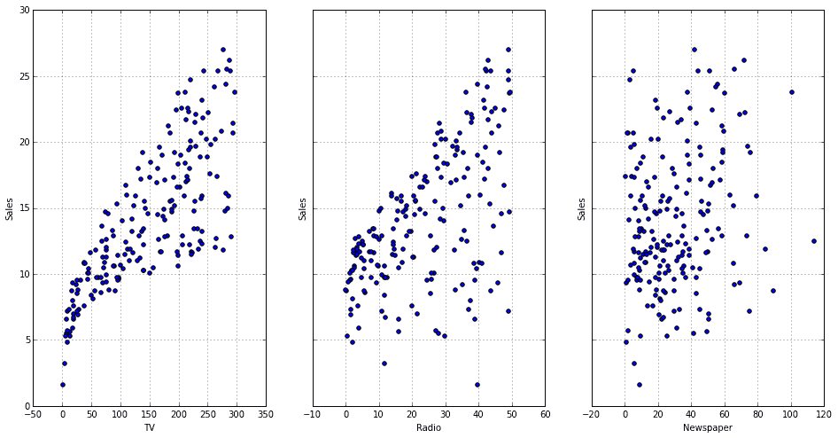

图 1:用于理解广告数据特征和响应变量之间关系的散点图

现在，我们需要看看广告将如何帮助增加销售。因此，我们需要问自己几个问题。值得问的问题是广告和销售之间的关系，哪种广告对销售的贡献更大，以及每种广告对销售的大致影响。我们将尝试使用一个简单的线性模型来回答这些问题。


# 简单回归模型

线性回归模型是一种学习算法，它与使用**解释性** **特征**(或**输入**或**预测器**)的组合来预测**定量**(也称为**数值** ) **响应**。

只有一个特征的简单线性回归模型采用以下形式:

*y = beta[0]+beta[1]x*

这里:

*   *y* 是预测数值(响应)→ **销售**
*   *x* 是该特征
*   *β[0]被称为**截距***
*   *β[1]是特征系数 *x* → **电视广告***

*β[0]和*β[1]都被认为是模型**系数**。为了创建一个可以预测广告示例中销售额的模型，我们需要学习这些系数，因为*β[1]将是特性 *x* 对响应 *y* 的学习效果。例如，如果 *beta [1] = 0.04* ，这意味着在电视广告上多花的 100 美元与四个小部件的销售额增加相关联。所以，我们需要继续，看看我们如何学习这些系数。***


# 学习模型系数

为了估计我们模型的系数，我们需要用一条回归线来拟合数据，这条回归线给出了与实际销售额相似的答案。为了得到一条最适合数据的回归线，我们将使用一个叫做**最小二乘**的标准。所以，我们需要找到一条线，使预测值和观察到的(实际)值之间的差异最小化。换句话说，我们需要找到一条最小化**残差平方和** ( **SSresiduals** )的回归线。*图 2* 说明了这一点:


图 2:用最小化残差平方和(预测值和观察值之差)的回归线拟合数据点(电视广告样本)

以下是*图 2* 中存在的元素:

*   **黑点**代表 *x* (电视广告)和 *y* (销售额)的实际值或观测值
*   **蓝线**代表最小二乘线(回归线)
*   **红线**代表残差，即预测值和观察值(实际值)之间的差值

这就是我们的系数与最小二乘线(回归线)的关系:

*   *beta[0]是**截距**，是 *x =0* 时 *y* 的值*
*   *β[1]是**斜率**，它代表 *y* 的变化除以 *x* 的变化*

*图 3* 对此进行了图解说明:

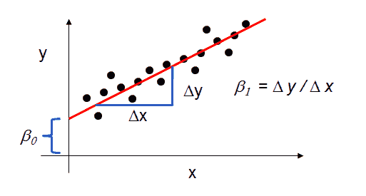

图 3:最小平方线和模型系数之间的关系

现在，让我们使用 **Statsmodels** 开始学习这些系数:

```
# To use the formula notation below, we need to import the module like the following
import statsmodels.formula.api as smf
# create a fitted model in one line of code(which will represent the least squares line)
lm = smf.ols(formula='sales ~ TV', data=advertising_data).fit()
# show the trained model coefficients
lm.params
```

输出:

```
Intercept    7.032594
TV           0.047537
dtype: float64
```

正如我们提到的，线性回归模型的一个优点是易于解释，所以让我们继续解释模型。


# 解释模型系数

我们来看看如何解读模型的系数，比如电视广告系数( *beta [1]* ):

*   投入/特色(电视广告)支出的单位增长**与**销售(响应)的`0.047537`单位增长相关联。换句话说，花在电视广告上的额外 100 美元**与 4.7537 件产品的销量增长**相关联。

从电视广告数据建立学习模型的目标是预测看不见的数据的销售。因此，让我们看看如何使用学习过的模型，以便根据电视广告的给定价值来预测销售价值(我们不知道)。


# 使用模型进行预测

假设我们有看不见的电视广告支出数据，我们想知道它们对公司销售的相应影响。因此，我们需要使用学习过的模型来为我们做这件事。假设我们想知道电视广告的 50000 美元将增加多少销售额。

让我们使用我们学到的模型系数来进行这样的计算:

*y = 7.032594 + 0.047537 x 50*

```
# manually calculating the increase in the sales based on $50k
7.032594 + 0.047537*50000
```

输出:

```
9,409.444
```

我们也可以使用统计模型来为我们做预测。首先，我们需要在 pandas 数据帧中提供电视广告值，因为 Statsmodels 接口需要它:

```
# creating a Pandas DataFrame to match Statsmodels interface expectations
new_TVAdSpending = pd.DataFrame({'TV': [50000]})
new_TVAdSpending.head()
```

输出:

|  | **电视** |
| 0 | 50000 |

现在，我们可以使用 predict 函数来预测销售额:

```
# use the model to make predictions on a new value
preds = lm.predict(new_TVAdSpending)
```

输出:

```
array([ 9.40942557])
```

让我们看看学习过的最小二乘直线是什么样子的。为了画线，我们需要两个点，每个点用这个对来表示:(`x, predict_value_of_x`)。

因此，让我们取电视广告功能的最小值和最大值:

```
# create a DataFrame with the minimum and maximum values of TV
X_min_max = pd.DataFrame({'TV': [advertising_data.TV.min(), advertising_data.TV.max()]})
X_min_max.head()
```

输出:

|  | **电视** |
| 0 | 0.7 |
| 一 | 296.4 |

让我们得到这两个值的相应预测:

```
# predictions for X min and max values
predictions = lm.predict(X_min_max)
predictions
```

输出:

```
array([  7.0658692,  21.12245377])
```

现在，让我们绘制实际数据，然后用最小二乘法拟合:

```
# plotting the acutal observed data
advertising_data.plot(kind='scatter', x='TV', y='sales')
#plotting the least squares line
plt.plot(new_TVAdSpending, preds, c='red', linewidth=2)
```

输出:

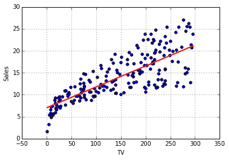

图 4:实际数据和最小二乘法曲线

这个例子的扩展和进一步的解释将在下一章解释。


# 分类的线性模型

在本节中，我们将讨论逻辑回归，这是广泛使用的分类算法之一。

什么是逻辑回归？逻辑回归的简单定义是，它是一种包含线性判别式的分类算法。

我们将从两点来阐明这个定义:

1.  与线性回归不同，逻辑回归不会尝试在给定一组要素或输入变量的情况下估计/预测数值变量的值。相反，逻辑回归算法的输出是给定样本/观察值属于特定类别的概率。更简单地说，让我们假设我们有一个二进制分类问题。在这类问题中，我们的输出变量只有两类，例如，患病或未患病。所以，某个样本属于患病类的概率是*P[0]某个样本属于未患病类的概率是*P[1]= 1-P[0]。因此，逻辑回归算法的输出总是在 0 和 1 之间。**

2.  你可能知道，有很多用于回归或分类的学习算法，每个学习算法都有自己对数据样本的假设。选择适合您的数据的学习算法的能力将随着实践和对主题的良好理解而逐渐到来。因此，逻辑回归算法的中心假设是，我们的输入/特征空间可以通过线性表面分成两个区域(每个类一个),如果只有两个特征，则可以是一条线，如果有三个特征，则可以是一个平面，依此类推。此边界的位置和方向将由您的数据决定。如果您的数据满足这一约束条件，即使用线性表面将它们分成对应于每个类的区域，那么您的数据就是线性可分的。下图说明了这一假设。在*图 5* 中，我们有三个维度、输入或特征以及两个可能的类别:患病(红色)和未患病(蓝色)。将两个区域彼此分开的分界处称为**线性判别式**，这是因为它是线性的，有助于模型区分属于不同类别的样本:

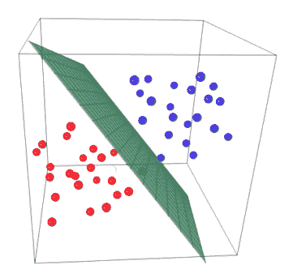

图 5:分离两个类的线性决策面

如果您的数据样本不是线性可分的，您可以通过将您的数据转换到更高维的空间，通过添加更多的特征来实现这一点。


# 分类和逻辑回归

在上一节中，我们学习了如何将连续量(例如，电视广告对公司销售额的影响)预测为输入值(例如，电视、广播和报纸广告)的线性函数。但是对于其他任务，输出不会是连续的数量。例如，预测某人是否患病是一个分类问题，我们需要不同的学习算法来执行这一任务。在本节中，我们将深入探讨逻辑回归的数学分析，这是一种用于分类任务的学习算法。

在线性回归中，我们尝试使用线性模型函数*y = h[θ](x)=θ^τx*来预测该数据集中第 *i ^个样本 *x ^((i))* 的输出变量*y^((I))的值。对于预测二进制标签 *(y ^((i)) ∈ {0，1})* 这样的分类任务来说，这并不是一个很好的解决方案。**

逻辑回归是我们可以用于分类任务的许多学习算法之一，由此我们使用不同的假设类别，同时尝试预测特定样本属于一个类别的概率以及它属于零个类别的概率。所以，在逻辑回归中，我们将尝试学习以下函数:


函数通常被称为 **sigmoid** 或 **logistic** 函数，它将*θ^τx*的值压缩到一个固定的范围*【0，1】*，如下图所示。因为该值将被挤压在[0，1]之间，所以我们可以将 *h [ θ ] (x)* 解释为一个概率。

我们的目标是搜索参数 *θ* 的值，使得当输入样本 *x* 属于一类时，概率*P(y = 1 | x)= h[θ](x))*大，而当 *x* 属于零类时，概率小:

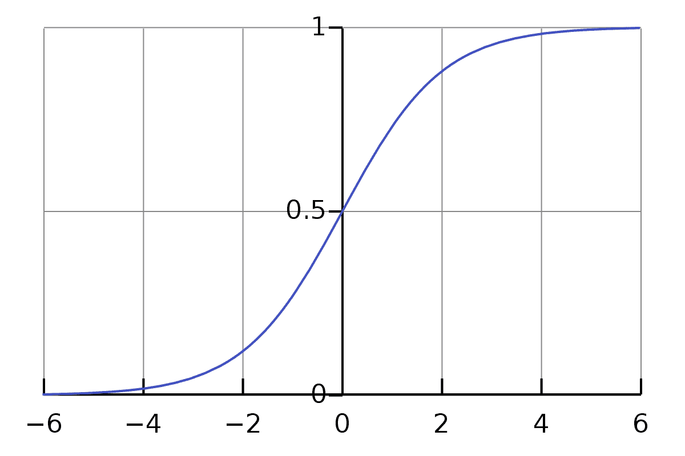

图 sigmoid 函数的形状

那么，假设我们有一组训练样本，它们对应的二进制标签是 *{(x ^((i)) ，y ^((i)) ): i = 1，...，m}。*我们将需要最小化以下成本函数，该函数测量给定的 *h [θ]* 有多好:


注意，对于每个训练样本，我们只有等式求和的两项中的一项为非零(取决于标签 *y ^((i))* 的值是否为 *0* or)。当 *y ^((i)) = 1* 时，最小化模型代价函数意味着我们需要使*h[θ](x^((I)))*大，当 *y ^((i)) = 0 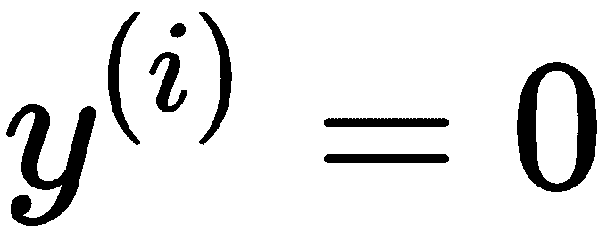* 时，我们要使 *1-h [θ] 大*。

现在，我们有了一个成本函数，它计算给定假设 *h [θ]* 与我们的训练样本的吻合程度。我们可以通过使用优化技术来最小化 *J(θ)* 并找到参数 *θ* 的最佳选择，来学习对我们的训练样本进行分类。一旦我们做到了这一点，我们可以使用这些参数将新的测试样本分类为 1 或 0，检查这两个类别标签中哪一个最有可能。如果 *P(y = 1|x) < P(y = 0|x)* 那么我们输出 0，否则我们输出 1，这与在我们的类之间定义一个阈值 0.5 并检查*h[θ](x)>0.5*是一样的。

为了最小化成本函数*J(θ)*，我们可以使用一种优化技术来找到最小化成本函数的 *θ* 的最佳值。所以，我们可以使用一个叫做 **gradient** 的微积分工具，它试图找到成本函数的最大增长率。然后，我们可以反方向求这个函数的最小值；例如， *J(θ)* 的梯度由*∇[θ]j(θ)*表示代价函数相对于模型参数取梯度。因此，我们需要提供一个函数来计算 *J(θ)* 和 *∇ [θ] J(θ)* ，以满足任何选择 *θ* 的要求。如果我们在 *J(θ)* 上对 *θ [j]* 求成本函数的梯度或导数，我们将得到以下结果:


其可以向量形式写成:


现在，我们对逻辑回归有了数学上的理解，所以让我们继续使用这种新的学习方法来解决分类任务。


# 巨大的例子——模型构建和培训

泰坦尼克号的沉没是历史上最臭名昭著的事件之一。这一事件导致 2224 名乘客和机组人员中的 1502 人死亡。在这个问题中，我们将使用数据科学来预测乘客是否会在这场悲剧中幸存，然后根据悲剧的实际统计数据来测试我们的模型的性能。

为了跟进泰坦尼克号的例子，您需要做以下工作:

1.  通过点击[https://github . com/Ahmed-menshawy/ML _ Titanic/archive/master . ZIP](https://github.com/ahmed-menshawy/ML_Titanic/archive/master.zip)下载 ZIP 文件中的存储库，或者从终端执行:
2.  Git 克隆:[https://github.com/ahmed-menshawy/ML_Titanic.git](https://github.com/ahmed-menshawy/ML_Titanic.git)
3.  安装`[virtualenv]`:([http://virtualenv . readthedocs . org/en/latest/installation . html](http://virtualenv.readthedocs.org/en/latest/installation.html))
4.  导航到解压或克隆 repo 的目录，并使用`virtualenv ml_titanic`创建一个虚拟环境
5.  用`source ml_titanic/bin/activate`激活环境
6.  用`pip install -r requirements.txt`安装所需的依赖项
7.  从命令行或终端执行`ipython notebook`
8.  遵循本章中的示例代码
9.  完成后，用`deactivate`关闭虚拟环境


# 数据处理和可视化

在这一部分，我们将做一些数据预处理和分析。数据探索和分析被认为是应用机器学习时最重要的步骤之一，也可能被认为是最重要的步骤，因为在这一步，你开始了解朋友数据，它将在训练过程中与你形影不离。此外，了解您的数据将使您能够缩小候选算法的范围，您可以使用这些算法来检查哪一个算法最适合您的数据。

让我们从导入实现所需的包开始:

```
import matplotlib.pyplot as plt
 %matplotlib inline

 from statsmodels.nonparametric.kde import KDEUnivariate
 from statsmodels.nonparametric import smoothers_lowess
 from pandas import Series, DataFrame
 from patsy import dmatrices
 from sklearn import datasets, svm

 import numpy as np
 import pandas as pd
 import statsmodels.api as sm

from scipy import stats
stats.chisqprob = lambda chisq, df: stats.chi2.sf(chisq, df)
```

让我们使用熊猫来阅读泰坦尼克号乘客和船员的数据:

```
titanic_data = pd.read_csv("data/titanic_train.csv")
```

接下来，让我们检查数据集的维度，看看我们有多少示例，有多少解释性特征描述了我们的数据集:

```
titanic_data.shape

 Output:
 (891, 12)
```

因此，我们总共有 891 个观察值、数据样本或乘客/机组人员记录，以及描述该记录的 12 个解释性特征:

```
list(titanic_data)

 Output:
 ['PassengerId',
 'Survived',
 'Pclass',
 'Name',
 'Sex',
 'Age',
 'SibSp',
 'Parch',
 'Ticket',
 'Fare',
 'Cabin',
 'Embarked']
```

让我们来看看一些样本/观察的数据:

```
titanic_data[500:510]

```

输出:

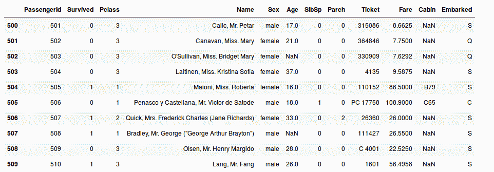

图 7:来自泰坦尼克号数据集的样本

现在，我们有一个 Pandas 数据帧，其中包含了我们需要分析的 891 名乘客的信息。数据帧的列表示关于每个乘客/机组人员的解释性特征，如姓名、性别或年龄。

其中一些解释性要素是完整的，没有任何缺失值，例如幸存的要素，它有 891 个条目。其他解释性要素包含缺失值，例如年龄要素，它只有 714 个条目。数据帧中任何缺失的值都表示为 NaN。

如果研究所有数据集要素，您会发现机票和客舱要素有许多缺失值(nan ),因此它们不会为我们的分析增加太多价值。为了解决这个问题，我们将把它们从数据帧中删除。

使用以下代码行从数据框中完全删除`ticket`和`cabin`功能:

```
titanic_data = titanic_data.drop(['Ticket','Cabin'], axis=1)
```

我们的数据集中有很多缺失值的原因。但是为了保持数据集的完整性，我们需要处理这些丢失的值。在这个具体问题上，我们会选择放弃它们。

使用以下代码行从所有剩余特征中删除所有`NaN`值:

```
titanic_data = titanic_data.dropna()
```

现在，我们有了一种竞争数据集，可以用来进行分析。如果您决定只删除所有 NaN，而不首先删除 **ticket** 和 **cabin** 特征，您将发现大部分数据集被删除，因为`.dropna()`方法从数据帧中删除了一个观察，即使它在一个特征中只有一个 NaN。

让我们进行一些数据可视化，以查看一些要素的分布，并了解解释性要素之间的关系:

```
# declaring graph parameters
fig = plt.figure(figsize=(18,6))
alpha=alpha_scatterplot = 0.3
alpha_bar_chart = 0.55
# Defining a grid of subplots to contain all the figures
ax1 = plt.subplot2grid((2,3),(0,0))
# Add the first bar plot which represents the count of people who survived vs not survived.
titanic_data.Survived.value_counts().plot(kind='bar', alpha=alpha_bar_chart)
# Adding margins to the plot
ax1.set_xlim(-1, 2)
# Adding bar plot title
plt.title("Distribution of Survival, (1 = Survived)")
plt.subplot2grid((2,3),(0,1))
plt.scatter(titanic_data.Survived, titanic_data.Age, alpha=alpha_scatterplot)
# Setting the value of the y label (age)
plt.ylabel("Age")
# formatting the grid
plt.grid(b=True, which='major', axis='y')
plt.title("Survival by Age, (1 = Survived)")
ax3 = plt.subplot2grid((2,3),(0,2))
titanic_data.Pclass.value_counts().plot(kind="barh", alpha=alpha_bar_chart)
ax3.set_ylim(-1, len(titanic_data.Pclass.value_counts()))
plt.title("Class Distribution")
plt.subplot2grid((2,3),(1,0), colspan=2)
# plotting kernel density estimate of the subse of the 1st class passenger’s age
titanic_data.Age[titanic_data.Pclass == 1].plot(kind='kde')
titanic_data.Age[titanic_data.Pclass == 2].plot(kind='kde')
titanic_data.Age[titanic_data.Pclass == 3].plot(kind='kde')
# Adding x label (age) to the plot
plt.xlabel("Age")
plt.title("Age Distribution within classes")
# Add legend to the plot.
plt.legend(('1st Class', '2nd Class','3rd Class'),loc='best')
ax5 = plt.subplot2grid((2,3),(1,2))
titanic_data.Embarked.value_counts().plot(kind='bar', alpha=alpha_bar_chart)
ax5.set_xlim(-1, len(titanic_data.Embarked.value_counts()))
plt.title("Passengers per boarding location")
```

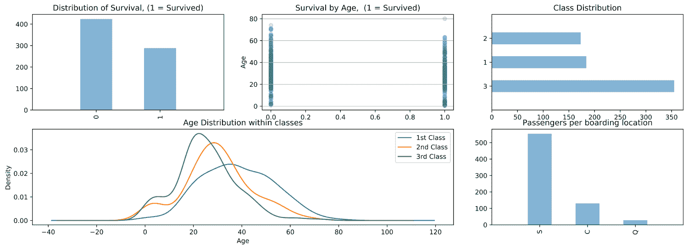

图 Titanic 数据样本的基本可视化

正如我们所提到的，这种分析的目的是基于可用的特征来预测特定乘客是否会在悲剧中幸存，例如旅行等级(在数据中称为`pclass`)**性别**、**年龄**和**票价**。所以，让我们看看是否能对幸存和死亡的乘客有更好的视觉理解。

首先，我们画一个柱状图，看看每一类的观察次数(存活/死亡):

```
plt.figure(figsize=(6,4))
fig, ax = plt.subplots()
titanic_data.Survived.value_counts().plot(kind='barh', color="blue", alpha=.65)
ax.set_ylim(-1, len(titanic_data.Survived.value_counts()))
plt.title("Breakdown of survivals(0 = Died, 1 = Survived)")
```

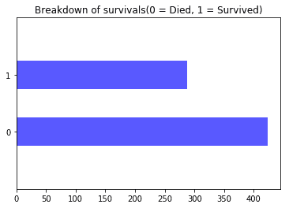

图 9:生存分析

让我们通过按性别分解之前的图表，对数据有更多的了解:

```
fig = plt.figure(figsize=(18,6))
#Plotting gender based analysis for the survivals.
male = titanic_data.Survived[titanic_data.Sex == 'male'].value_counts().sort_index()
female = titanic_data.Survived[titanic_data.Sex == 'female'].value_counts().sort_index()
ax1 = fig.add_subplot(121)
male.plot(kind='barh',label='Male', alpha=0.55)
female.plot(kind='barh', color='#FA2379',label='Female', alpha=0.55)
plt.title("Gender analysis of survivals (raw value counts) "); plt.legend(loc='best')
ax1.set_ylim(-1, 2)
ax2 = fig.add_subplot(122)
(male/float(male.sum())).plot(kind='barh',label='Male', alpha=0.55)  
(female/float(female.sum())).plot(kind='barh', color='#FA2379',label='Female', alpha=0.55)
plt.title("Gender analysis of survivals"); plt.legend(loc='best')
ax2.set_ylim(-1, 2)
```

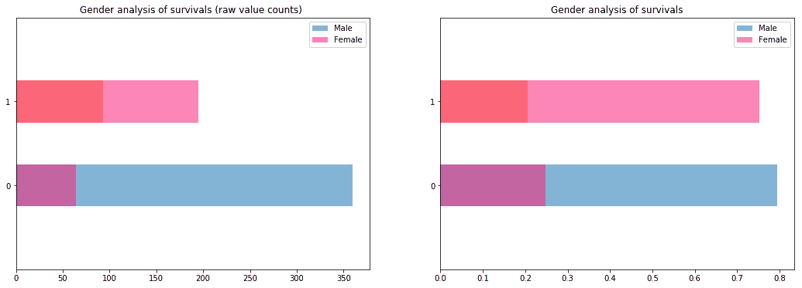

图 10:按性别特征对泰坦尼克号数据的进一步细分

现在，我们有了关于两个可能的类(存活和死亡)的更多信息。探索和可视化步骤是必要的，因为它让您更深入地了解数据的结构，并帮助您为您的问题选择合适的学习算法。正如你所看到的，我们从非常基本的图开始，然后增加了图的复杂性，以发现更多关于我们正在处理的数据。


# 数据分析——监督机器学习

这种分析的目的是预测幸存者。所以，结局会不会幸存，这是一个二元分类问题；在其中，你只有两个可能的类。

有很多学习算法可以用来解决二元分类问题。逻辑回归就是其中之一。根据维基百科的解释:

*In statistics, logistic regression or logit regression is a type of regression analysis used for predicting the outcome of a categorical dependent variable (a dependent variable that can take on a limited number of values, whose magnitudes are not meaningful but whose ordering of magnitudes may or may not be meaningful) based on one or more predictor variables. That is, it is used in estimating empirical values of the parameters in a qualitative response model. The probabilities describing the possible outcomes of a single trial are modeled, as a function of the explanatory (predictor) variables, using a logistic function. Frequently (and subsequently in this article) "logistic regression" is used to refer specifically to the problem in which the dependent variable is binary—that is, the number of available categories is two—and problems with more than two categories are referred to as multinomial logistic regression or, if the multiple categories are ordered, as ordered logistic regression. Logistic regression measures the relationship between a categorical dependent variable and one or more independent variables, which are usually (but not necessarily) continuous, by using probability scores as the predicted values of the dependent variable.[1] As such it treats the same set of problems as does probit regression using similar techniques.*

为了使用逻辑回归，我们需要创建一个公式来告诉我们的模型我们给它的特征/输入的类型:

```
# model formula
# here the ~ sign is an = sign, and the features of our dataset
# are written as a formula to predict survived. The C() lets our
# regression know that those variables are categorical.
# Ref: http://patsy.readthedocs.org/en/latest/formulas.html
formula = 'Survived ~ C(Pclass) + C(Sex) + Age + SibSp + C(Embarked)'
# create a results dictionary to hold our regression results for easy analysis later
results = {}
# create a regression friendly dataframe using patsy's dmatrices function
y,x = dmatrices(formula, data=titanic_data, return_type='dataframe')
# instantiate our model
model = sm.Logit(y,x)
# fit our model to the training data
res = model.fit()
# save the result for outputing predictions later
results['Logit'] = [res, formula]
res.summary()
Output:
Optimization terminated successfully.
 Current function value: 0.444388
 Iterations 6
```

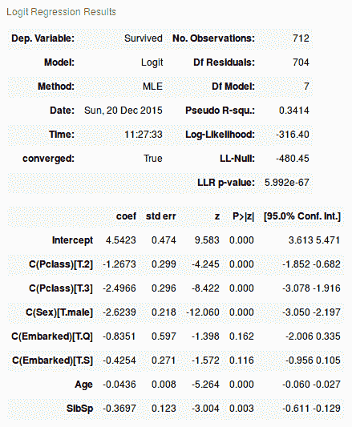

图 11:逻辑回归结果

现在，让我们将模型的预测值与实际值以及残差进行对比，残差是目标变量的实际值和预测值之间的差值:

```
# Plot Predictions Vs Actual
plt.figure(figsize=(18,4));
plt.subplot(121, axisbg="#DBDBDB")
# generate predictions from our fitted model
ypred = res.predict(x)
plt.plot(x.index, ypred, 'bo', x.index, y, 'mo', alpha=.25);
plt.grid(color='white', linestyle='dashed')
plt.title('Logit predictions, Blue: \nFitted/predicted values: Red');
# Residuals
ax2 = plt.subplot(122, axisbg="#DBDBDB")
plt.plot(res.resid_dev, 'r-')
plt.grid(color='white', linestyle='dashed')
ax2.set_xlim(-1, len(res.resid_dev))
plt.title('Logit Residuals');
```


图 12:理解 logit 回归模型

现在，我们已经建立了我们的逻辑回归模型，在此之前，我们已经对数据集进行了一些分析和探索。前面的例子向您展示了构建机器学习解决方案的一般管道。

大多数时候，从业者会陷入一些技术陷阱，因为他们缺乏理解机器学习概念的经验。例如，有人可能在测试集上获得了 99%的准确率，然后在没有对数据中的类分布进行任何调查的情况下(例如有多少样本是负的，有多少样本是正的)，他们部署了模型。

为了强调其中的一些概念，并区分您需要注意的不同种类的错误以及您真正应该关心的错误，我们将继续下一节。


# 不同类型的错误

在机器学习中，有两种类型的错误，作为数据科学的新手，你需要了解这两种错误之间的关键区别。如果你最终将错误类型的错误最小化，那么整个学习系统将是无用的，你将无法在实践中使用它来处理看不见的数据。为了减少从业者之间对这两类错误的误解，我们将在下面两个部分中解释它们。


# 表观(训练集)误差

这是第一种你不必关心最小化的错误。获得此类误差的较小值并不意味着您的模型能够很好地处理看不见的数据(概化)。为了更好地理解这种类型的错误，我们将给出一个简单的类场景示例。在课堂上解题的目的不是为了能够在考试中再次解决同样的问题，而是为了能够解决与你在课堂上练习的问题不一定相似的其他问题。考试问题可以来自课堂问题的同一个系列，但不一定完全相同。

表观误差是训练模型在我们已经知道真实结果/输出的训练集上执行的能力。如果你设法在训练集上得到 0 个错误，那么这是一个很好的指标，表明你的模型(大部分)在看不见的数据上不能很好地工作(不能一般化)。另一方面，数据科学是关于使用训练集作为学习算法的基础知识，以便在未来的未知数据中很好地工作。

在*图 3* 中，红色曲线代表**表观**误差。每当你增加模型记忆事物的能力(比如通过增加解释特征的数量来增加模型的复杂度)，你会发现这个表观误差趋近于零。可以看出，如果您的特征与观测值/样本一样多，那么**表观**误差将为零:

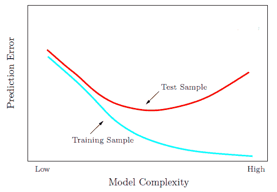

图 13:表观误差(红色曲线)和泛化/真实误差(浅蓝色)


# 一般化/真实误差

这是数据科学中第二种也是更重要的错误类型。构建学习系统的全部目的是能够在测试集上获得更小的泛化误差；换句话说，让模型在训练阶段没有使用过的一组观察/样本上很好地工作。如果你仍然考虑上一节中的课堂场景，你可以把泛化错误看作是解决考试问题的能力，这些问题不一定与你在课堂上为学习和熟悉该主题而解决的问题相似。因此，泛化性能是模型使用在训练阶段学到的技能(参数)来正确预测未知数据的结果/输出的能力。

在*图 13* 中，淡蓝色的线代表泛化误差。您可以看到，随着模型复杂性的增加，泛化误差将会减小，直到某个时间点，模型将开始失去其增长能力，泛化误差将会减小。曲线的这一部分，你得到的泛化误差失去了它不断增加的泛化能力，被称为**过拟合**。

本节的要点是尽可能减少泛化错误。


# 摘要

线性模型是一个非常强大的工具，如果您的数据与其假设相匹配，您可以将其用作初始学习算法。理解线性模型将有助于您理解使用线性模型作为构建块的更复杂的模型。

接下来，我们将继续使用泰坦尼克号的例子，更详细地讨论模型的复杂性和评估。模型复杂性是一个非常强大的工具，您需要小心使用它，以提高泛化误差。误解它会导致过度拟合的问题。