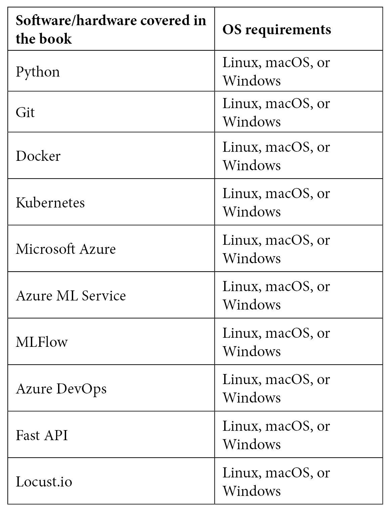

前言

# MLOps 是一种构建、部署和监控机器学习(ML)解决方案的系统方法。它是一门工程学科，可以应用于各种行业和用例。这本书提供了对 MLOps 的全面见解，并结合了真实世界的例子，以帮助您编写程序，训练健壮和可扩展的 ML 模型，并构建 ML 管道以在生产中安全地训练和部署模型。

你将从熟悉 MLOps 工作流程开始，并开始编写程序来训练 ML 模型。然后，您将继续探索训练后序列化和打包 ML 模型的选项，以在生产中部署它们，从而促进机器学习推理。接下来，您将学习使用一个可解释的监控框架来监控 ML 模型和系统性能。最后，您将应用您所获得的知识来构建现实世界的项目。

在本 ML 书结束时，您将对 MLOps 有一个 360 度的了解，并准备好在您的组织中实施 MLOps。

这本书是给谁的

# 这本书是为数据科学家，软件工程师，开发工程师，机器学习工程师，商业和技术领导人谁想要建立，部署和维护生产 ML 系统使用 MLOps 原则和技术。机器学习的基础知识是入门这本书所必需的。

这本书涵盖了什么

# [*第 1 章*](B16572_01_Final_JM_ePub.xhtml#_idTextAnchor015) ，*m lops 工作流的基础*，通过强调传统软件开发如何改变以促进机器学习，概述了不断变化的软件开发前景。我们将强调一些使用传统方法的组织中的日常问题，展示为什么需要改变思维和实施。接下来将介绍系统机器学习的重要性，接着介绍机器学习和 DevOps 的一些概念，并将它们融合到 MLOps 中。这一章最后提出了一个通用工作流程来解决几乎所有的机器学习问题。

[*第 2 章*](B16572_02_Final_JM_ePub.xhtml#_idTextAnchor028) ，*描述你的机器学习问题*，为你提供一个广阔的视角，让你了解生产中可能的 ML 解决方案类型。您将学习如何对解决方案进行分类，创建开发和部署解决方案的路线图，并采购必要的数据、工具或基础设施，以采用系统的方法开始开发 ML 解决方案。

[*第 3 章*](B16572_03_Final_JM_ePub.xhtml#_idTextAnchor053) ，*代码符合数据*，开始实现我们开发机器学习解决方案的动手业务用例。我们讨论了用于机器学习的源代码管理、用于业务用例的数据处理的有效方法，并制定了用于机器学习培训和部署的数据治理策略和管道。

[*第四章*](B16572_04_Final_JM_ePub.xhtml#_idTextAnchor074) ，*机器学习管道*，深入探讨构建机器学习管道的解决方案。我们关注特征工程、算法选择、超参数优化的关键方面，以及健壮的机器学习管道的其他方面。

[*第 5 章*](B16572_05_Final_JM_ePub.xhtml#_idTextAnchor093) ，*模型评估和打包*，深入探讨了序列化和打包机器学习模型后训练的选项，以在运行时部署它们，从而促进机器学习推理、模型互操作性和端到端模型可追溯性。您将获得关于可用选项和最新发展的广阔视角，以便将机器学习模型打包并提供给生产，从而实现高效、强大和可扩展的服务。

[*第 6 章*](B16572_06_Final_JM_ePub.xhtml#_idTextAnchor124) ，*部署您的 ML 系统的关键原则*，介绍了针对各种设置在生产中持续集成和部署的概念。您将学习如何选择正确的选项、工具和基础设施来促进机器学习解决方案的部署。您将深入了解机器学习推理选项和部署目标，并了解用于机器学习的 CI/CD 管道。

[*第 7 章*](B16572_07_Final_JM_ePub.xhtml#_idTextAnchor143) 、*构建健壮的 CI 和 CD 管道*，涵盖不同的 CI/CD 管道组件，如触发器、发布、作业等。它也将使你具备为 ML 解决方案管理你自己的定制 CI/CD 管道的知识。我们将为一个商业用例的 ML 解决方案构建一个 CI/CD 管道。我们构建的管道将是端到端可追踪的，因为它们将作为模型部署和监控的中间件。

[*第 8 章*](B16572_08_Final_JM_ePub.xhtml#_idTextAnchor159) ，*API 和微服务管理*，深入探讨 ML 推理的 API 和微服务设计原则。将鼓励边做边学的方法。我们将使用 FastAPI 和 Docker 之类的工具为 ML 模型设计和开发一个 API 和微服务。您将了解到为测试和生产环境设计强大且可扩展的微服务和 API 的关键原则、挑战和技巧。

[*第 9 章*](B16572_09_Final_JM_ePub.xhtml#_idTextAnchor176) ，*测试和保护您的 ML 解决方案*，介绍了在测试环境中执行测试的核心原则，以测试我们之前开发的微服务或 API 的健壮性和可伸缩性。我们将对已部署的 ML 解决方案进行实际负载测试。本章提供了将微服务投入生产之前要完成的测试清单。

[*第 10 章*](B16572_10_Final_JM_ePub.xhtml#_idTextAnchor189) ，*产品发布要点*，解释了如何使用之前设计的 CI/CD 管道，通过健壮且可扩展的方法将 ML 服务部署到产品中。我们将重点关注在生产中部署、监控和管理服务。关键的学习将是使用 Python、Docker 和 Kubernetes 等工具在无服务器和服务器环境中进行部署。

[*第 11 章*](B16572_11_Final_JM_ePub.xhtml#_idTextAnchor206) ，*监控您的 ML 系统的关键原则*，着眼于监控生产中 ML 系统的关键原则和方面，以实现稳健、安全和可扩展的性能。作为一个关键的收获，读者将获得一个具体的可解释的监控框架和清单，以便在生产中为他们的 ML 解决方案设置和配置监控框架。

[*第 12 章*](B16572_12_Final_JM_ePub.xhtml#_idTextAnchor222) ，*模型服务和监控*，向用户解释服务模型，并为 ML 解决方案定义指标，尤其是在算法效率、准确性和生产性能方面。我们将深入实践和监控数据漂移、模型漂移和应用程序性能的真实例子。

[*第 13 章*](B16572_13_Final_JM_ePub.xhtml#_idTextAnchor234) ，*管理持续学习的 ML 系统*，反映了机器学习解决方案中对持续学习的需求。我们将研究需要什么来成功地管理一个商业效率的 ML 系统。使用可解释的监控框架，我们将设计一个治理策略，我们将深入研究错误处理和配置警报和操作的实际实现。本章将为您提供自动化和管理 MLOps 的关键技能。

充分利用这本书

# 您应该有权使用 Microsoft Azure 订阅和用于构建 CI/CD 管道的基本 DevOps 软件。最好是装有 Linux 或 macOS 的个人电脑或笔记本电脑。

**如果你正在使用这本书的数字版本，我们建议你自己键入代码或者通过 GitHub 库访问代码(下一节提供链接)。这样做将帮助您避免任何与复制和粘贴代码相关的潜在错误。**



下载示例代码文件

# 你可以从 GitHub 的[https://github.com/PacktPublishing/EngineeringMLOps](https://github.com/PacktPublishing/EngineeringMLOps)下载本书的示例代码文件。如果代码有更新，它将在现有的 GitHub 库中更新。我们也有来自我们丰富的书籍和视频目录的其他代码包，可以在 https://github.com/PacktPublishing/[获得。看看他们！](https://github.com/PacktPublishing/)

下载彩色图片

# 我们还提供了一个 PDF 文件，其中有本书中使用的截图/图表的彩色图像。可以在这里下载:[https://static . packt-cdn . com/downloads/9781800562882 _ color images . pdf](https://static.packt-cdn.com/downloads/9781800562882_ColorImages.pdf)。

习惯用法

# 本书通篇使用了许多文本约定。

`Code in text`:表示文本中的码字、数据库表名、文件夹名、文件名、文件扩展名、路径名、伪 URL、用户输入和 Twitter 句柄。下面是一个例子:“预处理数据集是使用。get_by_name()函数。

代码块设置如下:

当我们希望将您的注意力吸引到代码块的特定部分时，相关的行或项目以粗体显示:

```
uri = workspace.get_mlflow_tracking_uri( )
mlflow.set_tracking_uri(uri)
```

任何命令行输入或输出都按如下方式编写:

```
# Importing pre-processed dataset
dataset = Dataset.get_by_name (workspace, name='processed_weather_data_portofTurku')
```

**粗体**:表示一个新术语、一个重要单词或您在屏幕上看到的单词。例如，菜单或对话框中的单词出现在文本中，如下所示。下面是一个例子:“转到**计算**选项，然后单击**创建**按钮，探索云上可用的计算选项。”

```
python3 test_inference.py
```

提示或重要注意事项

像这样出现。

保持联系

# 我们随时欢迎读者的反馈。

`customercare@packtpub.com`。

**勘误表**:虽然我们已经尽力确保内容的准确性，但错误还是会发生。如果你在这本书里发现了一个错误，请告诉我们，我们将不胜感激。请访问[www.packtpub.com/support/errata](http://www.packtpub.com/support/errata)，选择您的图书，点击勘误表提交表格链接，并输入详细信息。

`copyright@packt.com`与素材有链接。

如果你有兴趣成为一名作家，请访问 authors.packtpub.com。

点评

# 请留下评论。一旦你阅读并使用了这本书，为什么不在你购买它的网站上留下评论呢？潜在的读者可以看到并使用您不带偏见的意见来做出购买决定，我们 Packt 可以了解您对我们产品的看法，我们的作者可以看到您对他们的书的反馈。谢谢大家！

更多关于 Packt 的信息，请访问 packt.com。

For more information about Packt, please visit [packt.com](http://packt.com).