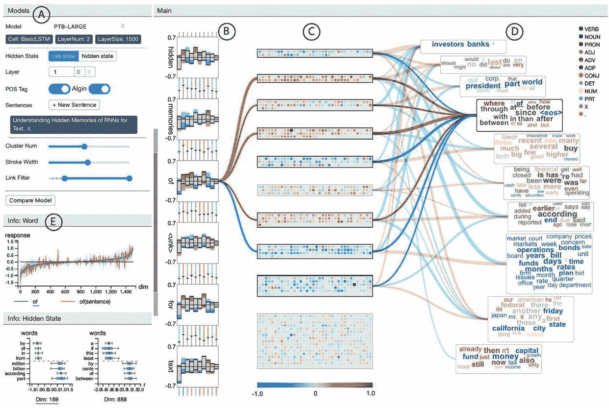

<title>B16572_11_Final_JM_ePub</title>

# 第 11 章:监控您的 ML 系统的关键原则

在本章中，我们将了解在生产中监控您的**机器学习** ( **ML** )模型所必需的基本原则。你将学习如何使用可解释的监控框架来构建可信的、可解释的人工智能解决方案。可解释的监控框架可用于构建功能监控管道，这样您就可以监控生产中的 ML 模型，分析应用程序和模型性能，并管理 ML 系统。监控 ML 系统的目标是实现信任、透明和可解释性，以增加业务影响。我们将通过一些真实世界的例子来了解这一点。

理解本章中提到的原则将使您具备为您的用例或公司构建端到端监控系统的知识。这将有助于您吸引业务、技术和公共(客户和法律)利益相关者，以便您可以高效地实现您的业务目标。这也将帮助你获得优势，并有一个系统的方法来管理你的 ML 系统。使用本章的框架，你可以为你的利益相关者和 ML 系统带来信任、透明和可解释性。

我们将在本章中讨论以下主要话题:

*   了解监控 ML 系统的关键原则
*   MLOps 工作流程中的监控
*   理解可解释的监控框架
*   启用对服务的连续监控

我们开始吧！

# 了解监控 ML 系统的关键原则

随着对数据驱动的产品以及适应不断变化的环境和监管框架的需求不断增长，在人工智能系统中建立信任至关重要。ML 项目未能给企业带来价值的原因之一是由于在他们的决策中缺乏信任和透明度。许多黑盒模型擅长达到高精度，但当涉及到解释已经做出的决策背后的原因时，它们就变得过时了。在撰写本文时，出现了一些关于信任和可解释性的新闻，如下图所示:

图 11.1–模型信任和可解释性的组成部分

这张图片展示了现实生活中重要领域的问题。让我们看看这是如何转化为模型可解释性的一些关键方面的，例如模型漂移、模型偏差、模型透明度和模型遵从性，使用一些现实生活中的例子。

## 模型漂移

我们生活在一个动态变化的世界。由于这个原因，使用 ML 模型执行任务或进行预测的环境和数据在不断发展，考虑这种变化是很重要的。例如，新冠肺炎·疫情向我们展示了一个意想不到的现实。许多商业运作已经转向虚拟化，这个疫情向我们展示了一个独特的情况，许多人认为这是**新常态**。许多小企业已经破产，由于失业率上升，个人面临着极度的资金匮乏。这些人(小企业主和个人)前所未有地(大规模地)向银行和机构申请贷款和财政救济。银行和机构已经部署和使用的欺诈检测算法还没有在贷款和金融救济应用方面看到这种数据速度和准确性。

所有这些特征的变化(如申请人的收入、信用记录、申请人的位置、他们申请的金额等等)，由于一个之前没有申请任何贷款的有贷款价值的申请人失业，可能会扭曲模型的权重/感知(或混淆模型)。这对模型提出了一个重要的挑战。为了应对这种动态变化的环境，考虑模型漂移并从中不断学习是至关重要的。

漂移与环境的变化有关，是指预测 ML 模型性能的退化以及退化变量之间的关系。以下是与模型和数据相关的四种类型的模型更改:

*   **数据漂移**:这个就是自变量性质发生变化的地方。例如，在前面的示例中，由于季节性、新产品或为满足消费者需求而增加的变化，数据会发生变化，如在新冠肺炎疫情。
*   **特征漂移**:这是特征属性随时间变化的。例如，温度随着季节的变化而变化。冬天的温度比夏天或秋天的温度低。
*   **模型漂移**:这是因变量性质发生变化的。例如，在前面的示例中，欺诈检测的分类发生了变化。
*   **上游数据变化**:当数据管道经历操作数据变化时，如不再生成特征，导致缺失值。这种情况的一个例子是客户的工资值的变化(从美元到欧元)，其中不再产生美元值。

为了更清楚，我们将在下一章( [*第 12 章*](B16572_12_Final_JM_ePub.xhtml#_idTextAnchor222) 、*模型服务和监控)*中了解更多关于漂移和开发漂移监控器的信息。

## 模型偏差

不管你喜不喜欢，ML 已经在影响你生活中的许多决定，比如进入下一份工作的候选名单，或者获得银行的抵押贷款批准。甚至埃文执法机构也在使用它来挖掘潜在的犯罪嫌疑人，以防止犯罪。新闻机构 ProPublica(利用 ML 预测未来罪犯-[https://www . ProPublica . org/article/machine-bias-risk-assessments-in-criminal-pending](https://www.propublica.org/article/machine-bias-risk-assessments-in-criminal-sentencing))。2016 年，Propublica 的 ML 显示了模型有偏见地预测黑人女性比白人男性风险更高的情况，而之前的所有记录都显示了相反的情况。这种情况可能代价高昂，并具有毁灭性的社会影响，因此需要避免。在另一个案例中，亚马逊建立了一个人工智能来雇用人，但不得不关闭它，因为它歧视女性(据《华盛顿邮报》报道)。这种偏见可能代价高昂且不道德。为了避免它们，需要监控人工智能系统，以便我们可以建立对它们的信任。

模型偏差是由于数据集(用于模型训练)的某些特征比其他特征被更重地表示和/或加权而发生的一种错误。歪曲或有偏见的数据集会导致模型用例的扭曲结果、低精度水平和分析错误。换句话说，它是由最大似然算法作出的不正确假设所导致的误差。高偏差可能导致预测不准确，并可能导致模型错过特征和预测的目标变量之间的相关关系。这方面的一个例子是前面提到的人工智能，它由亚马逊建立，用来雇用人，但对女性有偏见。我们将在*可解释的监控框架*部分了解更多关于模型偏差的信息，在那里我们将探讨*偏差和威胁检测*。

## 模型透明度

人工智能在本质上是不确定的。特别是 ML，在其生命周期中不断发展、更新和再培训。人工智能正在影响几乎所有的行业和部门。随着越来越多的人采用 ML 并使用 ML 做出重要决策，建立与确定性系统相同的信任级别变得至关重要。毕竟，只有当数字系统可以被信任来完成工作时，它们才是有用的。显然需要模型透明——许多首席执行官和商业领袖都在鼓励我们理解人工智能的商业决策及其商业影响。最近，抖音首席执行官发表声明如下:

“我们认为所有公司都应该向监管者披露他们的算法、审核政策和数据流”(来源:抖音)。

公司的这种开放和透明水平可以建立我们对人工智能作为一个社会的信任，并实现更顺利的采用和合规。

模型透明是追求在人工智能系统中建立信任，以确保公平，减少或消除偏见，提供问责制(审计系统如何得出结果的端到端过程)，并证明模型输出和系统决策的合理性。

## 模型符合性

模型合规变得重要，因为不遵守政府和社会的成本可能是巨大的。《华盛顿邮报》报道了以下标题:

“摩根大通以 5500 万美元解决联邦抵押贷款歧视诉讼”

对摩根大通来说，违规行为是一件代价高昂的事情。为了避免不必要的罚款和对社会的损害，实施法规遵从性变得越来越重要。以下是公司内部实现模型合规性的一些驱动因素:

*   **问责文化**:对洗钱系统的端到端审计对于监控合规性至关重要。MLOps 可以在促进审计和编辑使用人工智能做出的运营和商业决策方面发挥重要作用。
*   **最前沿的伦理**:构建负责任的人工智能系统，为社会带来价值并赢得我们的信任，这要求人工智能预测是包容的、公平的、符合伦理的。拥有一个道德框架可以帮助公司将他们的客户与他们的价值观和原则联系起来，并确保人工智能决策符合道德。欧洲委员会在这方面做得很好，提出了*可信人工智能的道德和指导方针*。你可以在这里找到这些指引:[https://EC . Europa . eu/digital-single-market/en/news/ethics-guidelines-trust worthy-ai](https://ec.europa.eu/digital-single-market/en/news/ethics-guidelines-trustworthy-ai)。
*   **合规管道**:对于寻求确保实时合规、审计和修订的组织来说，拥有一个同时满足业务和政府法规的合规管道是非常有益的。MLOps 可以通过跟踪所有 ML 模型的库存来促进这一点，从而让利益相关者了解它们是如何工作的，并解释它们是如何可视化地工作的。这种工作方式使人类能够监控、编辑和解释与法规的相关性，使业务利益相关者、数据科学家和监管者能够高效地携手合作，确保他们拥有透明和可解释的操作。

## 可解释的人工智能

在理想情况下，企业将模型透明性和合规性放在首位，以便企业能够动态地适应不断变化的环境，例如模型漂移，并随时处理偏差。所有这些都需要一个框架，让所有业务利益相关者(IT 和业务领导者、监管者、业务用户等)与 AI 模型保持联系，以便理解模型正在做出的决策，同时专注于增加模型的透明度和合规性。这样的框架可以使用可解释的人工智能作为 MLOps 的一部分来交付。可解释的人工智能使人工智能易于被人类理解。

模型透明性和可解释性是实现可解释人工智能的两种方法。 ML 模型基于它们被训练的数据形成模式或规则。可解释的人工智能可以帮助人类或商业利益相关者理解模型发现的规则或模式，也有助于验证 ML 模型做出的商业决策。理想情况下，可解释的人工智能应该能够服务于多个业务利益相关者，如下图所示:

图 11.2–业务驱动的可解释人工智能

黑盒模型可以获得很高的预测准确度，但是当它们不能解释为什么会做出这些决定时就会过时。大多数黑盒模型没有提供对模型性能的可见性，没有监控来捕捉潜在的偏差或漂移，也没有对模型行为的解释。为了解决这个问题，大量的研究和开发正在可解释的人工智能方法中进行，以提供模型透明性和模型可解释性。

注入了 MLOps 的可解释的 AI 方法可以使几乎所有的业务利益相关者理解和验证由 AI 做出的业务决策，并且也有助于向内部和外部利益相关者解释它们。对于可解释的人工智能没有一站式的解决方案，因为每个用例都需要它自己的可解释的人工智能方法。有各种各样的方法越来越受欢迎。我们将在下面的小节中看一些例子。

### 特征归属方法

特征归属方法显示了模型中的每个特征对每个实例预测的贡献程度。当你请求解释时，你会得到预测，以及特征属性信息。以下是一些特征归属方法:

*   SHapley 加法解释 ( **SHAP** ):一种解释任何 ML 模型输出的方法。它是基于博弈论方法的，解释了任何 ML 模型的输出。特别是，它解释了每个特性对推动模型输出的贡献。
*   **集成梯度**:一种技术，旨在根据模型的特征解释模型预测之间的关系。在论文*中介绍了深度网络的公理化属性*。它可以通过识别扭曲的数据来解释特征的重要性，并有助于调试模型性能。
*   **局部可解释的与模型无关的解释** ( **LIME** ):这是一种与模型无关的方法，用于解释预测。它关注本地解释；也就是说，解释反映了关于被预测数据实例的模型行为。例如，LIME 可以提示哪些因素或特征对于模型预测结果是重要的。这可以从下图中看出:

图 11.3–使用石灰解释单个预测

在上图中，模型预测患者患有糖尿病。石灰解释者强调而暗示糖尿病的症状，如皮肤干燥、尿液过多和视力模糊，这些都有助于`Diabetes`预测，而`No fatigue`则是反对预测的证据。使用解释器，医生可以从模型的预测中做出决定和得出结论，并为患者提供适当的治疗。

你可以在[https://cloud . Google . com/AI-platform/prediction/docs/AI-explaints/overview](https://cloud.google.com/ai-platform/prediction/docs/ai-explanations/overview)了解更多关于 AI 的解释。

### 非特征归因方法

非特征归因方法不关注特征如何影响模型的预测。相反，它们关注于模型推断的输入数据和输出数据之间的关系。以下是一些非特征归因方法:

*   **Deeplift** :这是用于评估神经网络的，通过比较每个神经元的激活与其参考激活，并根据差异分配贡献分数。Deeplift 揭示了相关性和贡献。例如，假设我们正在使用一个猫和狗图像分类器来对猫和狗之间的图像进行分类。假设分类器通过使用 deeplift 方法预测输入图像是一只狗。这里，我们可以将在图像分类器的神经网络中被激活的神经元反向传播到它们的参考激活，然后基于差异将贡献分数分配给每个特征。
*   **自然语言解释** ( **NLE** ): NLE 的目标是使用技术融合来捕捉文本解释的输入输出关系，这些技术包括部分依赖函数、梯度分析、上下文编码、个体条件期望、累积局部效应等等。这些技术对于解释分类或生成文本的语言模型非常有用。NLE 为用户决定是否信任模型的决策并采取行动提供了容易理解和有用的理由。例如，您可能希望根据模特的推荐和说明购买产品。像微软 Power BI 和 Qlik Sense 这样的工具可以用来即插即用地研究 NLE。这些工具需要根据您的需求或用例进行定制。

除了前面列举的方法之外，还有其他方法。这个领域是人工智能领域的研究热点。许多研究人员和企业领导人正在寻求解决可解释的人工智能问题，以向内部和外部的利益相关者解释模型决策。为多个业务利益相关者提供一个可解释的人工智能驱动的界面可以帮助他们回答关键的业务问题。例如，业务领导需要能够回答“这些模型决策如何影响业务？”而对于 IT 和运营来说，知道“我如何监控和调试”的答案是至关重要的

为多个业务利益相关者回答这些问题，使员工和企业能够适应人工智能，并通过优化模型偏差和漂移来适应不断变化的环境，从而确保模型透明度和模型合规性，从而最大限度地发挥其价值。

### 可解释的人工智能=模型透明性和可解释性

由于 ML 模型正在成为一等公民，为了监控模型在这些领域的表现，我们可以使用可解释的监控，这允许我们通过使用可解释的人工智能方法监控和解释他们的决策来分析和管理生产中的 ML 系统。可解释的监控是可解释的人工智能的混合体；它使用可解释的人工智能方法，在制作中融入了**操作** ( **操作**)。可解释的监控正在成为 MLOps 工作流程的一个组成部分。在下一节中，我们将看看可解释的监控如何为 MLOps 工作流带来价值。

# m lops 工作流程中的监控

我们在 [*第 1 章*](B16572_01_Final_JM_ePub.xhtml#_idTextAnchor015) 、*m lops 工作流程基础*中了解了 MLOps 工作流程。如下图所示，监控模块是 MLOps 工作流程中不可或缺的一部分，用于评估 ML 模型在生产中的表现，并衡量 ML 系统的商业价值。如果我们从透明性和可解释性的角度理解模型的决策(向利益相关者和客户解释决策)，我们只能两者都做(测量由 ML 模型产生的性能和商业价值)。

可解释的监控支持管理 ML 系统的透明性和可解释性，以推动最佳商业价值:

图 11.4–MLOps 工作流程–监控

在实践中，**可解释的监控**使我们能够监控、分析和治理 ML 系统，并且它与 MLOps 工作流中的其他组件一起在一个连续的循环中工作。它还使人类能够参与循环，以理解模型决策，并在旅途中教授模型(通过标记数据和重新训练模型)。可解释的监控使持续学习成为可能，从长远来看，对公司来说是非常有益的。下图显示了一个人在循环中的持续学习管道，通过可解释的监控来实现:

图 11.5–通过可解释的监控实现的持续学习

持续学习是系统在不断变化的环境中不断学习的能力，同时建立在先前所学的基础上。为了促进持续学习，数据和建模必须协同工作，并由循环中的人(通常是 QA 分析师或系统管理员，如数据科学家或 ML 工程师)协助。可解释的监控在持续学习系统中起着至关重要的作用，以增加收入，保持合规，并负责任地建立 ML 系统。毕竟，只有部署了持续学习能力的模型才能带来商业价值。

# 了解可解释的监控框架

在本节中，我们将详细探索可解释的监控框架(如下图所示),以了解和学习可解释的监控如何增强 MLOps 工作流和 ML 系统本身:

图 11.6–可解释的监控框架

可解释的监控框架是一个模块化的框架，用于监控、分析和管理一个 ML 系统，同时支持持续学习。所有模块同步工作，以实现透明和可解释的监控。让我们看看每个模块是如何工作的，以理解它们如何在框架中起作用。首先，让我们看看监视器模块(上图中的第一个面板)。

## 班长

监控模块是专用于监控生产中的应用(服务于 ML 模型)。多种因素在 ML 系统中发挥作用，例如应用程序性能(遥测数据、吞吐量、服务器请求时间、失败的请求、错误处理等)、数据完整性和模型漂移，以及不断变化的环境。监控模块应该从生产中的系统日志中获取重要信息，以跟踪 ML 系统的稳健性。让我们看看 monitor 模块的三个功能的重要性和功能:数据完整性、模型漂移和应用程序性能。

### 数据完整性

确保 ML 应用的数据完整性包括检查输入(ML 模型的输入数据)和输出(ML 模型预测)数据，以确保 ML 系统的完整性和稳健性。监控模块通过检查数据的数量、种类、准确性和速度来检测异常值或异常情况，从而确保数据的完整性。检测异常值或异常可以防止 ML 系统性能不佳和易受安全攻击(例如，对抗性攻击)。数据完整性加上有效的审计可以促进 ML 系统的预期性能，以获得商业价值。

### 模型漂移

如果没有测量模型漂移,模型的性能很容易低于标准，并会因糟糕的决策和客户服务而妨碍业务。例如，在新冠肺炎这样的黑天鹅事件中，很难预测数据的变化或趋势。以下是一些登上头条的新闻:

*   由于购物习惯的巨大变化，Instacart 模型预测商品在商店中可获得性的准确率从 93%降至 61%([https://fortune . com/2020/06/09/insta cart-coronavirus-artificial-intelligence/](https://fortune.com/2020/06/09/instacart-coronavirus-artificial-intelligence/))。
*   银行家们怀疑，为繁荣时期而训练的信贷模型能否准确应对压力情景([https://www . American banker . com/opinion/ai-models-could-fight-to-hand-the-market-down](https://www.americanbanker.com/opinion/ai-models-could-struggle-to-handle-the-market-downturn))。
*   为了应对市场的不确定性，交易算法失灵了。一些基金下跌了 21%。
*   图像分类模型很难适应新冠肺炎疫情事件后的“新常态”:一家人在家里的笔记本电脑前意味着“工作”，而不是“休闲”([https://TechCrunch . com/2020/08/02/ai-is-difficult-to-adjust-to-2020/](https://techcrunch.com/2020/08/02/ai-is-struggling-to-adjust-to-2020/))

因此，监控任何形式的模型漂移(如数据漂移、概念漂移或任何上游数据变化)都很重要，以便适应不断变化的环境，以最相关的方式为企业和客户服务，并产生最大的商业价值。

### 应用程序性能

监控应用性能以预见和防止任何潜在故障至关重要，因为这确保了 ML 系统的健壮性。在这里，我们可以监控生产部署目标(例如，Kubernetes 或本地服务器)的关键系统日志和遥测数据。监控应用程序性能可以为我们提供实时的关键信息，例如服务器的吞吐量、延迟、服务器请求时间、失败请求或控制流错误的数量等等。监控应用程序没有固定的方式，根据您的业务用例，您的应用程序性能机制可以被管理和监控，以保持系统正常运行，从而产生业务价值。

在监视器组件方面，我们监视数据完整性、模型漂移和应用程序性能。在下一节中，我们将分析如何监控模型和应用程序的数据。

## 分析

实时分析生产中的 ML 系统是了解 ML 系统性能并确保其稳定性的关键。人类在分析模型性能和检测微妙的异常和威胁方面起着关键作用。因此，让一个人参与进来可以给 ML 系统带来更大的透明度和可解释性。我们可以分析模型性能，以检测任何偏见或威胁，并理解为什么模型以某种模式做出决策。我们可以通过应用数据切片、对抗性攻击防御技术等高级技术，或者通过理解本地和全球解释来做到这一点。让我们看看如何在实践中做到这一点。

### 数据切片

从改善商业和生活的角度来看，有很多关于 ML 的成功故事。然而，仍然有改进用于调试和解释模型的数据工具的空间。改进的一个关键领域是理解为什么模型在数据的某些部分或片段上表现不佳，以及我们如何平衡它们的整体性能。切片是数据集的一部分或子集。数据切片可以帮助我们了解模型在不同类型的子数据集上的性能。我们可以将数据集分割成多个切片或子集，并在其上研究模型的行为。

例如，让我们考虑一个假设的情况，我们训练了一个随机森林模型来分类一个人的收入是高于还是低于 50，000 美元。该模型已经在 UCI 人口普查数据([https://archive . ics . UCI . edu/ml/datasets/Census-Income+% 28 KDD % 29](https://archive.ics.uci.edu/ml/datasets/Census-Income+%28KDD%29))上进行了训练。下表显示了数据切片(或子集)的模型结果。该表表明，总体指标可以被认为是可接受的，因为所有数据的总体日志丢失都很低(参见 *All* 行)。这是一个广泛用于二元分类问题的损失度量，代表预测的可能性与实际/真实值的接近程度；在二进制分类的情况下是 0 或 1。预测概率偏离实际值越多，测井损失值就越高。然而，单个切片讲述了一个不同的故事:

表 11.1-UCI 人口普查数据切片

通过查看前面的表格，我们可以得出结论，该型号的性能还过得去。然而，如果我们观察男性与女性受试者的表现，我们可以看到，该模型仅在女性受试者中表现良好，在女性受试者中，对数损失小于男性受试者的对数损失。另一方面，如果你看一下*教授-专业*职业，你会发现净表现与男性受试者的表现相当，对数损失分别为 0.45 和 0.41，而*教授-专业*的影响大小要小得多。该模型对*学士*、*硕士*和*博士*表现不佳，因为对数损失很高，分别为 0.44、0.49 和 0.59。还需要注意的是，如果一个切片及其副本的日志损失低于可接受的水平，这表明模型总体上是不好的，而不仅仅是在特定的数据切片上。

数据切片使我们能够看到微妙的偏差和看不见的相关性，以理解为什么一个模型可能在数据子集上表现不佳。我们可以通过使用代表所有数据切片的平衡数据集(例如，使用合成数据或欠采样等)来训练模型，或者通过调整模型的超参数来减少整体偏差，从而避免这些偏差并提高模型的整体性能。数据切片可以提供 ML 系统的模型公平性和性能的概述，并且还可以帮助组织优化数据和 ML 模型以达到最佳性能和适当的公平性阈值。数据切片可以通过为数据和模型性能提供透明度和可解释性来帮助建立对人工智能系统的信任。

注意

为了全面了解数据切片和自动化数据切片方法，请看一下*用于模型验证的自动化数据切片:一种大数据-人工智能集成方法*在[https://arxiv.org/pdf/1807.06068.pdf](https://arxiv.org/pdf/1807.06068.pdf)。

### 偏见和威胁检测

为了确保使用 ML 模型做出稳健和道德的决策，我们需要确保模型是公平和安全的。任何偏见和威胁都需要得到监控和缓解，以避免为了遵守商业价值观和法律而做出有利于任何特定方的不道德或片面的决定。

有不同类型的偏差，如选择偏差(用于训练模型的数据不代表人口，如少数民族)，框架偏差(用于收集数据的问题或调查是以一种观点或倾向为框架的)，系统偏差(重复或一致的错误)，响应偏差(参与者按照他们的意识偏差做出错误响应的数据)，或确认偏差(收集数据以验证你自己的先入之见)。为了避免和减轻这些偏差，可以应用数据切片、基于切片的学习或平衡偏差-方差权衡等技术，具体取决于用例。

ML 系统暴露于需要监控和缓解的安全威胁。在第 9 章 、*测试和保护您的 ML 解决方案中，我们已经讨论了一些常见的威胁和威胁预防技术，包括对抗性攻击、毒药攻击、隐私攻击或后门攻击等。*

### 本地和全球解释

局部和全局解释提供了关于模型性能的不同观点。局部解释为特定或单个输入的模型预测提供理由，而全局解释提供对模型预测过程的洞察，独立于任何特定输入。例如，让我们来看一个假设的案例，一个**递归神经网络** ( **RNN** )模型被用来为客户评论执行情感分析。下图显示了使用 RNNVis 工具对 RNN 模型进行情感分析的整体解释(整个流程):

图 11.7-RNN 模型的整体解释(使用 RNNVis)以理解整个过程(隐藏状态、层等如何影响模型输出和预测过程)

来源:[https://blog . acolyer . org/2019/02/25/understanding-hidden-memories-of-recurrent-neural-networks/](https://blog.acolyer.org/2019/02/25/understanding-hidden-memories-of-recurrent-neural-networks/)

这里，例如，共同聚类可视化为具有正面和负面情绪的单词示出了不同的单词云。使用全局解释，我们可以模拟模型的预测过程，并了解与参数或模型架构(例如，隐藏状态和层)相关的关系。全局解释提供了两种解释能力的视角:高级模型过程和预测性解释。另一方面，局部解释使人们对单一预测有了深入的了解。如果我们希望理解模型的性能并全面验证它，这两种解释都是有价值的。

在分析组件中，我们可以使用我们探索过的技术来分析模型的性能，例如数据切片、偏差和威胁检测，以及局部和全局解释。在下一节中，我们将学习如何治理和控制 ML 系统，以有效地指导 it 实现运营或业务目标。

## 治理

ML 系统的效率依赖于实现最大商业价值的管理方式。系统治理的很大一部分涉及质量保证和控制，以及模型审计和报告，以确保它具有端到端的可跟踪性，并符合法规。在监控和分析模型性能的基础上，我们可以控制和管理 ML 系统。治理由智能警报和行动驱动，以最大化业务价值。让我们看看警报和行动、模型质量保证和控制以及模型审计和报告是如何编排 ML 系统的治理的。

### 警报和操作

管理 ML 系统包括监控和分析 ML 应用程序。在这里，系统开发人员可以在系统出现异常行为时得到警告，例如失败的请求、缓慢的服务器响应时间、服务器异常、错误或高延迟。提醒系统开发者或管理员可以确保质量保证并防止系统故障。有两种不同类型的警报:针对系统性能的警报和基于模型性能的警报。以下是系统性能警报的一些示例:

*   基于阈值的失败请求的基于规则的警报
*   基于阈值的基于规则的服务器响应时间警报
*   基于阈值的基于规则的服务器异常警报
*   基于阈值的基于规则的可用性警报

当模型出现漂移或异常特征分布或偏差时，会生成模型性能警报。当这样的事件被记录时，系统管理员或开发人员通过电子邮件、SMS、推送通知和语音警报得到提醒。这些警报动作(自动或半自动)可用于缓解系统性能恶化。根据具体情况和需要，可以采取一些可能的措施，例如:

*   在经历高模型漂移时部署替代模型
*   重新训练模型
*   训练新模型
*   重启 ML 系统
*   重新部署 ML 系统

### 模型质量保证和控制

如果我们希望防止许多可能的事故，并确保 ML 系统的正常健康监控和功能，那么模型的质量保证和控制机制对使用 ML 系统的人来说是非常有益的。建议为模型质量保证和控制建立一个框架或机制。为此，下图所示的 ML 系统质量保证框架可以为您的组织启用该机制。这是一个模块化框架，用于监控 ML 系统的三个重要方面:

图 11.8–模型质量保证框架

质量保证专家可以帮助您的公司或组织建立测试机制，以验证用于培训的数据是否经过净化，确保用于模型推断的数据不包含对 ML 系统的威胁，并监控数据漂移以了解和验证不断变化的环境。质量保证或测试工程师可以与产品经理一起通过以下方式获得监控和测试数据:

*   理解并验证数据的统计关系(例如，平均值、中值、众数等)，以便训练、测试和推断数据。
*   开发测试来验证前面提到的统计数据和关系(使用脚本)。
*   使用特征工程技术(如特征选择、降维等)评估特征的分布。
*   重新培训和评估所有模型的性能。
*   使用新数据集定期监控所有模型的性能。
*   如果另一个模型(来自模型清单)比现有模型执行得更准确，则发出警报。
*   定期进行测试。

### 模型审计和报告

如果你想为监管者和遵守法律提供足够的信息，模型审计和报告是必不可少的。拥有模型的端到端可追溯性确保了极大的透明度和可解释性，这可以为组织或公司带来透明的治理机制。模型审计和报告的目标是评估模型的性能，并在此基础上实现 ML 系统治理。在下图中，我们可以看到从审计和报告中生成的模型透明度图表的总体概述:

图 11.9–模型透明度图表

基于审计和报告的模型评估将确保组织的健康、透明和稳健的治理机制，并使它们能够具有端到端的可追溯性，以便符合监管者的要求。拥有这样的机制将有助于组织节省大量时间和资源，并提高与监管机构互动的效率。

# 支持对服务的持续监控

如果我们希望监控生产中的 ML 系统，可解释的监控框架可以是资源丰富的。在下一章中，我们将为我们在前几章中处理的业务用例启用可解释的监控框架。我们将对已部署的系统进行持续监控。然后，我们将监控已经部署到生产中的 ML 应用程序，并分析传入的数据和模型的性能，以管理 ML 系统，从而为用例产生最大的业务价值。

# 总结

在本章中，我们学习了监控 ML 系统的关键原则。我们探索了一些常见的监控方法和可解释的监控框架(包括监控、分析和治理阶段)。然后，我们深入探讨了可解释监控的概念。

在下一章，我们将深入研究可解释监控框架的实际实现。利用这一点，我们将构建一个监控管道，以便为业务用例(预测 Turku 港口的天气)持续监控生产中的 ML 系统。

下一章相当动手，所以扣好安全带，准备好！