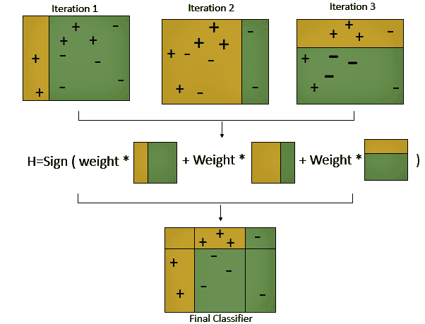
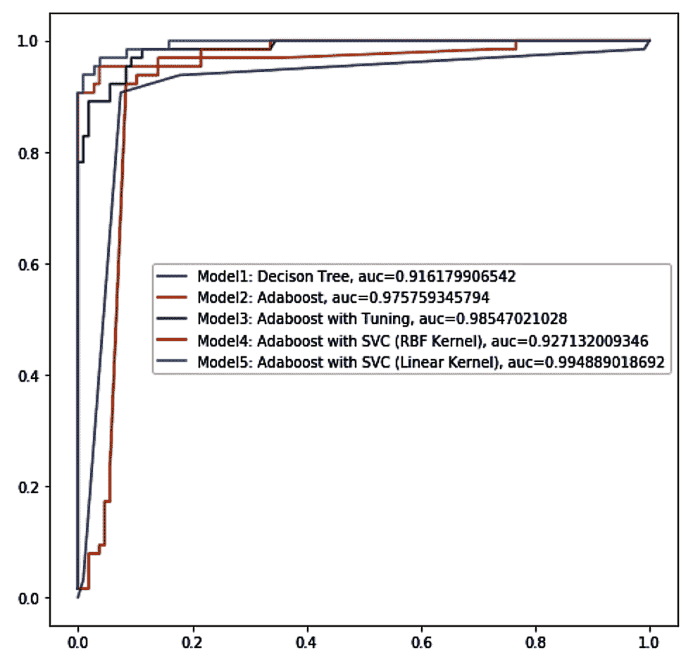
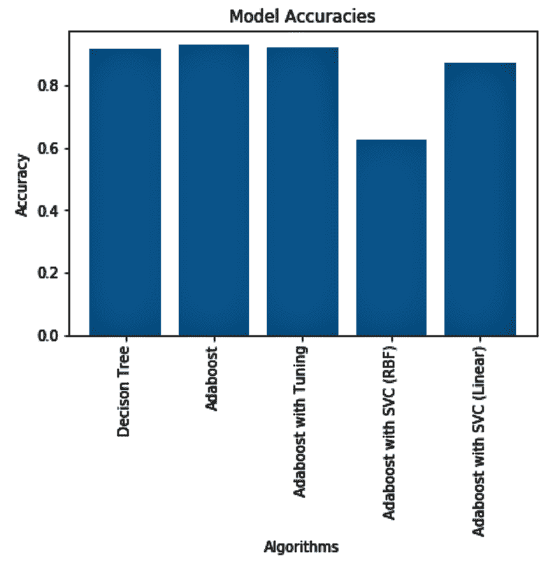
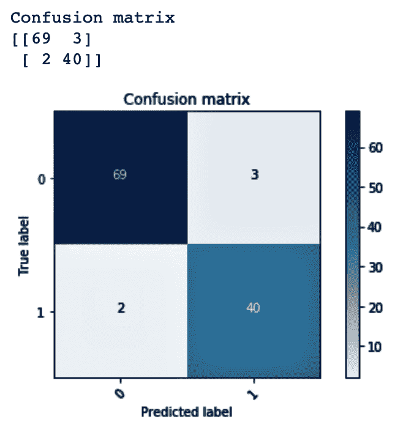
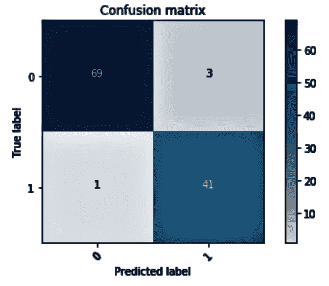
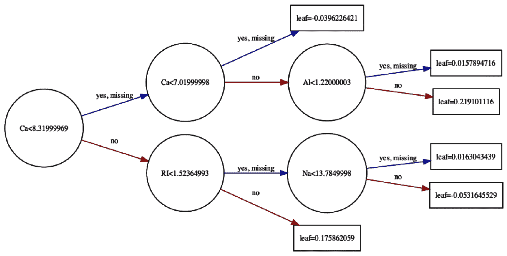
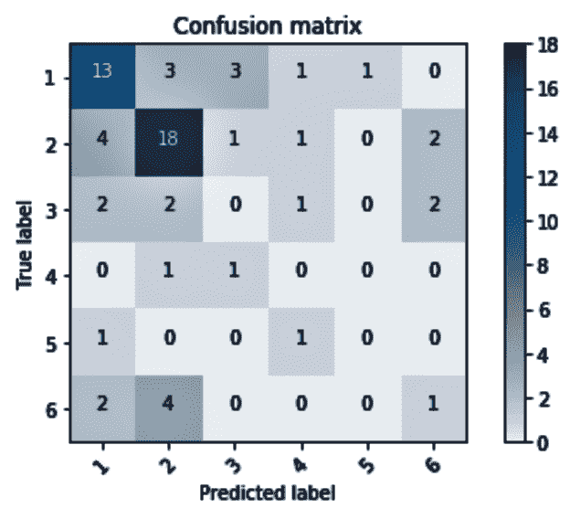
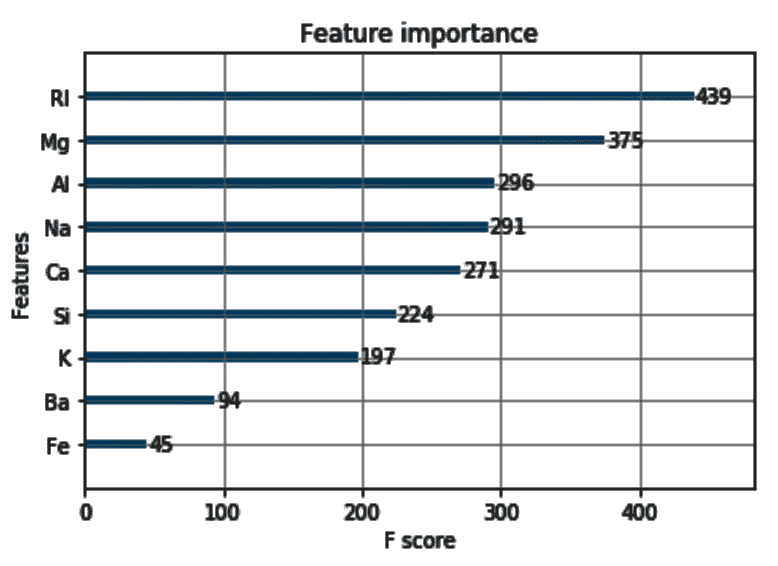

# 通过增强提高模型性能

在本章中，我们将介绍以下配方:

*   升压简介
*   使用 scikit-learn 实施 AdaBoost 进行疾病风险预测
*   使用 scikit-learn 实现疾病风险预测的梯度增强
*   使用 XGBoost 和 scikit-learn 实现玻璃识别的极端梯度增强


# 升压简介

boosting 算法是一种集成技术，它通过将一组弱学习者组合成一个强学习者来帮助提高模型性能和准确性。boosting 背后的思想是，预测器应该从以前的预测器所犯的错误中学习。

升压算法有两个关键特征:

*   首先，它们经历多次迭代
*   第二，每一次迭代都集中在被之前的迭代错误分类的实例上

当一个输入被一个假设错误分类时，它的权重在下一次迭代中被改变，以便下一个假设可以正确分类它。在训练数据上提供更好性能的那些将被给予更大的权重。这个过程通过多次迭代，将弱学习者转化为强学习者的集合，从而提高模型的性能。

在 bagging 中，没有任何引导样本依赖于任何其他引导，因此它们都是并行运行的。升压以顺序方式工作，不涉及自举采样。bagging 和 boosting 都是通过将不同模型的几个估计值合并成一个估计值来减少单个估计值的方差。然而，重要的是要注意，如果单个模型过度拟合，增强不会有很大帮助。如果模型过拟合，装袋将是一个更好的选择。另一方面，boosting 试图减少偏差，而 bagging 很少改善偏差。

本章将介绍**自适应 boosting** ( **AdaBoost** )、梯度 Boosting、 **e** **xtreme 梯度 boosting** ( **XGBoost** )等不同的 Boosting 算法。


# 使用 scikit-learn 实施 AdaBoost 进行疾病风险预测

AdaBoost 是最早用于二进制分类的 boosting 算法之一。它是由 Freund 和 Schapire 于 1996 年提出的。此后，在 AdaBoost 的基础上开发了许多其他基于 boosting 的算法。

自适应增强的另一种变体被称为**AdaBoost-absent**。AdaBoost-absent 允许每个基线分类器在其依赖特征丢失时放弃投票。

AdaBoost 侧重于将一组弱学习者组合成一个强学习者。AdaBoost 分类器的过程如下:

1.  最初，一个简短的决策树分类器适用于数据。决策树只能有一个单独的分支，称为**决策树桩**。评估整体误差。这是第一次迭代。
2.  在第二次迭代中，任何被正确分类的数据将被赋予较低的权重，而被错误分类的类将被赋予较高的权重。
3.  在第三次迭代中，另一个决策树桩将适合数据，并且权重将在下一次迭代中再次改变。
4.  一旦这些迭代结束，在每次迭代中根据错误率自动计算每个分类器的权重，以得到强分类器。

以下截图显示了 AdaBoost 的工作原理:



该算法背后的概念是将权重分配给训练示例，并选择具有最低加权误差的分类器。最后，它构造一个强分类器作为这些弱学习器的线性组合。

AdaBoost 的一般公式如下:


这里， **F(x)** 代表强量词， **** 代表权重， **f(x)** 代表弱量词。

AdaBoost 分类器采用各种参数。重要的解释如下:

*   `base_estimator`:用于训练模型的学习算法。如果没有为此参数提供值，则基本估计值为`DecisionTreeClassifier (max_depth=1)`。
*   `n_estimators`:迭代训练的模型数量。
*   `learning_rate` : 各模型对权重的贡献。默认情况下，`learning_rate`的值为`1`。学习率值越低，模型的训练速度越慢，但性能得分可能会更高。


# 做好准备

首先，导入`os`和`pandas`包，并根据您的要求设置您的工作目录:

```
# import required packages
import os
import pandas as pd
import numpy as np

from sklearn.ensemble import AdaBoostClassifier
from sklearn.model_selection import GridSearchCV
from sklearn.model_selection import train_test_split
from sklearn.tree import DecisionTreeClassifier

from sklearn.metrics import roc_auc_score, roc_curve, auc
from sklearn.model_selection import train_test_split

# Set working directory as per your need
os.chdir(".../.../Chapter 8")
os.getcwd()
```

从 GitHub 下载`breastcancer.csv`数据集，并将其复制到您的工作目录。读取数据集:

```
df_breastcancer = pd.read_csv("breastcancer.csv")
```

用`head()`函数看一下前几行:

```
df_breastcancer.head(5)
```

注意，`diagnosis`变量有 M 和 B 这样的值，分别代表恶性和良性。我们将对`diagnosis`变量执行标签编码，这样我们可以将 M 和 B 值转换成数值。

我们使用`head()`来查看变化:

```
# import LabelEncoder from sklearn.preprocessing
from sklearn.preprocessing import LabelEncoder

lb = LabelEncoder()
df_breastcancer['diagnosis'] =lb.fit_transform(df_breastcancer['diagnosis']) 
df_breastcancer.head(5)
```

然后，我们检查数据集是否有空值:

```
df_breastcancer.isnull().sum()
```

我们用`shape()`检查数据集的形状:

```
df_breastcancer.shape
```

我们现在将目标和特性集分开。我们还将数据集分成训练和测试子集:

```
# Create feature & response variables
# Drop the response var and id column as it'll not make any sense to the analysis
X = df_breastcancer.iloc[:,2:31]

# Target
Y = df_breastcancer.iloc[:,0]

# Create train & test sets
X_train, X_test, Y_train, Y_test = train_test_split(X, Y, test_size=0.30, random_state=0, stratify= Y)
```

现在，我们将继续使用`AdaBoost`算法构建我们的模型。

值得注意的是，由于随机分割和其他随机性因素，准确性和 AUC 评分可能会有所不同。


# 怎么做...

我们现在将看看如何使用 AdaBoost 来训练我们的模型:

1.  在我们构建第一个`AdaBoost`模型之前，让我们使用`DecisionTreeClassifier`来训练我们的模型:

```
dtree = DecisionTreeClassifier(max_depth=3, random_state=0)
dtree.fit(X_train, Y_train)
```

2.  我们可以用下面的代码在曲线 ( **AUC** )下看到我们的精度和**面积:**

```
# Mean accuracy
print('The mean accuracy is: ',(dtree.score(X_test,Y_test))*100,'%')

#AUC score
y_pred_dtree = dtree.predict_proba(X_test)
fpr_dtree, tpr_dtree, thresholds = roc_curve(Y_test, y_pred_dtree[:,1])
auc_dtree = auc(fpr_dtree, tpr_dtree)
print ('AUC Value: ', auc_dtree)
```

我们得到的准确度分数和 AUC 值分别为 91.81%和 0.91。注意，由于随机性，这些值对于不同的用户可能是不同的。

3.  现在，我们将使用 scikit-learn 库构建我们的 AdaBoost 模型。我们将使用`AdaBoostClassifier`来构建我们的`AdaBoost`模型。`AdaBoost`默认使用`dtree`作为基本分类器:

```
AdaBoost = AdaBoostClassifier(n_estimators=100, base_estimator=dtree, learning_rate=0.1, random_state=0)
AdaBoost.fit(X_train, Y_train)
```

4.  我们根据测试数据检查模型的准确性和 AUC 值:

```
# Mean accuracy
print('The mean accuracy is: ',(AdaBoost.score(X_test,Y_test))*100,'%')

#AUC score
y_pred_adaboost = AdaBoost.predict_proba(X_test)
fpr_ab, tpr_ab, thresholds = roc_curve(Y_test, y_pred_adaboost[:,1])
auc_adaboost = auc(fpr_ab, tpr_ab)
print ('AUC Value: ', auc_adaboost)
```

我们注意到，我们得到了 92.82%的准确度分数和 0.97 的 AUC 值。这两个指标都高于我们在*步骤 1* 中构建的决策树模型。

5.  然后，我们必须微调我们的超参数。我们将`n_estimators`设置为`100`，将`learning_rate`设置为`0.4`:

```
# Tuning the hyperparams
AdaBoost_with_tuning = AdaBoostClassifier(n_estimators=100, base_estimator=dtree, learning_rate=0.4, random_state=0)
AdaBoost_with_tuning.fit(X_train, Y_train)
```

6.  现在，我们将根据测试数据检查新模型的准确性和 AUC 值:

```
# Mean accuracy
print('The mean accuracy is: ',(AdaBoost_with_tuning.score(X_test,Y_test))*100,'%')

#AUC score
y_pred_adaboost_tune = AdaBoost.predict_proba(X_test)
fpr_ab_tune, tpr_ab_tune, thresholds = roc_curve(Y_test, y_pred_adaboost_tune[:,1])
auc_adaboost_tune = auc(fpr_ab_tune, tpr_ab_tune)
print ('AUC Value: ', auc_adaboost_tune)
```

我们注意到准确性下降到 92.39%，但是我们得到了 0.98 的改进的 AUC 值。


# 它是如何工作的...

在*步骤 1* 中，我们使用`DecisionTreeClassifier`来构建我们的模型。在*步骤 2* 中，我们注意到我们的平均准确率和 AUC 得分分别为 91.81%和 0.91。我们的目标是使用`AdaBoost`算法来改进这一点。

注意，`AdaBoost`算法默认使用决策树作为基本分类器。在*步骤 3* 中，我们使用默认基础学习者`AdaBoost`来训练我们的模型。我们将`n_estimators`设置为`100`，将`learning_rate`设置为`0.1`。我们在*步骤 4* 中检查了我们的平均准确度和 AUC 值。我们注意到，我们在平均准确性和 AUC 方面有了相当大的提高，它们分别跃升至 93.57%和 0.977。

在*步骤 5* 中，我们为我们的`AdaBoost`算法微调了一些超参数，该算法使用决策树作为基本分类器。我们将`n_estimators`设置为`100`，将`learning_rate`设置为`0.4`。*第 6 步*给出了我们在*第 5 步*中构建的模型的精确度和 AUC 值。我们看到准确率下降到 93.56%，AUC 保持在 0.981。


# 还有更多...

在这里，我们将展示使用 AdaBoost 训练一个模型，用一个**支持向量机** ( **SVM** )作为基础学习器。

默认情况下，AdaBoost 使用决策树作为基本学习器。我们也可以使用不同的基础学习者。在下面的例子中，我们使用了一个 SVM 作为我们使用`AdaBoost`算法的基础学习器。我们使用`SVC`和`rbf`作为内核:

```
from sklearn.svm import SVC

Adaboost_with_svc_rbf = AdaBoostClassifier(n_estimators=100, base_estimator=SVC(probability=True, kernel='rbf'), learning_rate=1, random_state=0)
Adaboost_with_svc_rbf.fit(X_train, Y_train)
```

我们可以使用**支持向量分类器** ( **SVC** )作为基本学习器来检查我们的 AdaBoost 模型的准确性和 AUC 值:

```
# Mean accuracy
print('The mean accuracy is: ',(Adaboost_with_svc_rbf.score(X_test,Y_test))*100,'%') 

#AUC score
y_pred_svc_rbf = Adaboost_with_svc_rbf.predict_proba(X_test)
fpr_svc_rbf, tpr_svc_rbf, thresholds = roc_curve(Y_test, y_pred_svc_rbf[:,1])
auc_svc_rbf = auc(fpr_svc_rbf, tpr_svc_rbf)
print ('AUC Value: ', auc_svc_rbf)
```

我们注意到准确性和 AUC 值分别下降到 62.57 和 0.92。

现在，我们将使用 SVC 重建 AdaBoost 模型。这一次，我们将使用线性内核:

```
Adaboost_with_svc_linear =AdaBoostClassifier(n_estimators=100, base_estimator=SVC(probability=True, kernel='linear'), learning_rate=1, random_state=0)
Adaboost_with_svc_linear.fit(X_train, Y_train)
```

我们现在获得了 90.64%的平均准确度和 0.96 的相当不错的 AUC 值。

我们现在将使用以下代码绘制一个图表来比较每个模型的 AUC 值:

```
import matplotlib.pyplot as plt
% matplotlib inline
plt.figure(figsize=(8,8))

plt.plot(fpr_dtree, tpr_dtree,label="Model1: Dtree, auc="+str(auc_dtree))
plt.plot(fpr_ab, tpr_ab,label="Model2: Adaboost, auc="+str(auc_adaboost))
plt.plot(fpr_ab_tune,tpr_ab_tune,label="Model3: Adaboost with Tuning, auc="+str(auc_adaboost_tune))
plt.plot(fpr_svc_rbf, tpr_svc_rbf, label="Model4: Adaboost with SVC (RBF Kernel), auc="+str(auc_svc_rbf))
plt.plot(fpr_svc_lin, tpr_svc_lin, label="Model5: Adaboost with SVC (Linear Kernel), auc="+str(auc_svc_linear))

plt.legend(loc=5)
plt.show()
```

这给了我们以下的情节:



我们还可以使用以下代码绘制所有模型的精度:

```
import matplotlib.pyplot as plt
% matplotlib inline
plt.figure(figsize=(8,8))

label = ['Decison Tree', 'Adaboost', 'Adaboost with Tuning', 'Adaboost with SVC (RBF)', 'Adaboost with SVC (Linear)']

values = [dtree.score(X_test,Y_test),
        AdaBoost.score(X_test,Y_test),
        AdaBoost_with_tuning.score(X_test,Y_test),
        Adaboost_with_svc_rbf.score(X_test,Y_test),
        Adaboost_with_svc_linear.score(X_test,Y_test)]

def plot_bar_accuracy():
    # this is for plotting purpose
    index = np.arange(len(label))
    plt.bar(index, values)
    plt.xlabel('Algorithms', fontsize=10)
    plt.ylabel('Accuracy', fontsize=10)
    plt.xticks(index, label, fontsize=10, rotation=90)
    plt.title('Model Accuracies')
    plt.show()

plot_bar_accuracy()
```

这为我们提供了以下输出:




# 请参见

我们还可以将网格搜索与 AdaBoost 结合使用:

```
#grid search using svm
Adaboost_with_svc = AdaBoostClassifier(n_estimators=100, base_estimator=SVC(probability=True, kernel='linear'), learning_rate=1, algorithm= 'SAMME')

Ada_Grid = {'n_estimators': [10,30,40,100],
           'learning_rate': [0.1, 0.2, 0.3]}

estimator = Adaboost_with_svc
Adaboost_with_grid_search = GridSearchCV(estimator,Ada_Grid).fit(X_train, Y_train)
print(Adaboost_with_grid_search.best_params_)
print(Adaboost_with_grid_search.best_score_)
```

在前面的代码中，我们执行了网格搜索，将`n_estimators`设置为`10`、`30`、`40`和`100`，将`learning_rate`设置为`0.1`、`0.2`和`0.3`。


# 使用 scikit-learn 实现用于疾病风险预测的梯度增强机器

梯度增强是一种基于增强原理工作的机器学习技术，其中弱学习器迭代地将他们的注意力转向在先前迭代中难以预测的错误观察，并创建弱学习器的集合，通常是决策树。

梯度增强按顺序训练模型，包括以下步骤:

1.  根据数据拟合模型
2.  用残差拟合模型
3.  创建新模型

AdaBoost 模型通过使用分配给数据点的权重来识别误差，而梯度增强则通过计算损失函数中的梯度来识别误差。损失函数是模型如何能够拟合其被训练的数据的度量，并且通常取决于被解决的问题的类型。如果我们在讨论回归问题，可以使用均方差，而在分类问题中，可以使用对数损失。梯度下降程序用于在一次添加一棵树时最小化损失。模型中现有的树保持不变。

有一些超参数可以为此进行调整:


# 做好准备

我们将采用用于训练 AdaBoost 模型的相同数据集。在这个例子中，我们将看到如何使用梯度推进机器来训练我们的模型。我们还将研究一些超参数，可以通过调整来提高模型的性能。

首先，我们必须导入所有需要的库:

```
import os
import pandas as pd
import numpy as np

from sklearn.model_selection import train_test_split

from sklearn.ensemble import GradientBoostingClassifier 
from sklearn.metrics import classification_report, confusion_matrix, accuracy_score, roc_auc_score
from sklearn.preprocessing import MinMaxScaler

import matplotlib.pyplot as plt
import itertools
```

然后，我们读取数据并将目标变量编码为 1 和 0:

```
# Read the Dataset
df_breastcancer = pd.read_csv("breastcancer.csv")

from sklearn.preprocessing import LabelEncoder
lb = LabelEncoder()
df_breastcancer['diagnosis'] = lb.fit_transform(df_breastcancer['diagnosis']) 
df_breastcancer.head(5)
```

然后，分离我们的目标和特征变量。我们将数据分成训练和测试子集:

```
# create feature & response variables
# drop the response var and id column as it'll not make any sense to the analysis
X = df_breastcancer.iloc[:,2:31]

# Target variable
Y = df_breastcancer.iloc[:,0]

# Create train & test sets
X_train, X_test, Y_train, Y_test = train_test_split(X, Y, test_size=0.20, random_state=0, stratify= Y)
```

这与我们在`AdaBoost`示例的*准备好*部分使用的代码相同。


# 怎么做...

我们现在将看看如何使用梯度推进机器来训练我们的模型:

1.  我们在上节*准备*中从`sklearn.ensemble`导入了`GradientBoostingClassifier`。我们使用`GradieBoostingClassfier`训练我们的模型:

```
GBM_model = GradientBoostingClassifier() 
GBM_model.fit(X_train, Y_train)
```

2.  这里，我们必须将测试数据传递给`predict()`函数，以使用我们在*步骤 1* 中构建的模型进行预测:

```
Y_pred_gbm = GBM_model.predict(X_test)
```

3.  现在，我们使用`classification_report`来查看以下指标:

```
print(classification_report(Y_test, Y_pred_gbm))
```

`classification_report`给出了以下输出:


4.  我们将使用`confusion_matrix()`来生成混淆矩阵。然后，我们将`confusion_matrix`的输出传递给我们预定义的函数，即`plot_confusion_matrix()`，以绘制矩阵:



5.  我们可以用`accuracy_score()`和`roc_auc_score()`检查测试的准确性和 AUC 值。

注意`accuracy_score`和`roc_auc_score`已经从`sklearn.metrics`导入:


# 它是如何工作的...

在*步骤 1* 中，我们训练了一个梯度推进分类器模型。在*步骤 2* 中，我们使用`predict()`方法对我们的测试数据进行预测。

在*步骤 3* 中，我们使用`classification_report()`来查看各种度量，例如每个类的`precision`、`recall`和`f1-score`，以及每个度量的平均值。`classification_report()`报告总真阳性、假阴性、假阳性、每个标签的未加权平均值和每个标签的支持加权平均值的平均值。它还报告了多标签分类的样本平均值。

精度指的是分类器不将一个阴性实例标记为阳性实例的能力，而召回指的是分类器找到所有阳性实例的能力。f [1] 分数是精确度和召回率的加权调和平均值。最好的`f[1] score`是 1.0，最差是 0.0。支持度是每类的观察次数。

在*步骤 4* 中，我们使用`confusion_matrix()`生成混淆矩阵来查看真阳性、真阴性、假阳性和假阴性。

在*步骤 5* 中，我们使用`accuracy_score()`和`roc_auc_score()`函数查看了测试数据的准确性和 AUC 值。

在下一节中，我们将使用网格搜索来调优超参数，以找到最佳模型。


# 还有更多...

我们现在来看看如何微调梯度推进机器的超参数:

1.  首先，我们从`sklearn.model_selection`导入`GridSearchCV`:

```
from sklearn.model_selection import GridSearchCV
```

2.  我们将网格参数设置为变量:

```
parameters = {
    "n_estimators":[100,150,200],
    "loss":["deviance"],
    "learning_rate": [0.01, 0.05, 0.1, 0.2, 0.3, 0.4, 0.5, 0.6, 0.7, 0.8, 0.9, 1],
    "min_samples_split":np.linspace(0.1, 0.5, 4),
    "min_samples_leaf": np.linspace(0.1, 0.5, 4),
    "max_depth":[3, 5, 8],
    "max_features":["log2","sqrt"],
    "criterion": ["friedman_mse", "mae"],
    "subsample":[0.3, 0.6, 1.0]
    }
```

3.  我们使用`GridSeacrhCV`，它让我们将估计器与网格搜索相结合来调整超参数。`GridSeacrhCV`方法从网格值中选择最佳参数，并与估计器一起使用:

```
grid = GridSearchCV(GradientBoostingClassifier(), parameters, cv=3, n_jobs=-1) 
grid.fit(X_train, Y_train)
```

4.  然后，我们可以查看最佳参数:

```
grid.best_estimator_
```

看一下下面的截图:


5.  我们将测试数据传递给`predict`方法来获得预测:

```
grid_predictions = grid.predict(X_test)
```

6.  同样，我们可以看到由`classification_report`提供的指标:

```
print(classification_report(Y_test, grid_predictions))
```

这为我们提供了以下输出。我们注意到平均值`precision`和`f1-score`比前一种情况有所提高:


7.  现在，我们将看看混淆矩阵，并像之前一样绘制它:

```
cnf_matrix = confusion_matrix(Y_test, grid_predictions)
plot_confusion_matrix(cnf_matrix,classes=[0,1])

```

从前面的代码中我们得到了下面的图:



8.  现在，我们将再次查看准确性和 AUC 值:

```
print("Accuracy score = {:0.2f}".format(accuracy_score(Y_test, grid_predictions)))
print("Area under ROC curve = {:0.2f}".format(roc_auc_score(Y_test, grid_predictions)))
```

我们注意到精确度保持不变，但是 AUC 从 0.96 提高到 0.97:


# 使用 XGBoost 和 scikit-learn 实现玻璃鉴定的极端梯度增强方法

XGBoost 代表极端梯度增强。它是梯度推进机的一个变种，旨在提高性能和速度。Python 中的 XGBoost 库实现了梯度推进决策树算法。梯度推进这个名字来自于它的梯度下降算法，以尽量减少损失时，增加新的模型。XGBoost 可以处理回归和分类任务。

XGBoost 是那些参加 Kaggle 竞赛的算法中的首选算法，因为它在困难的机器学习问题中的性能和执行速度。

XGBoost 中使用的一些重要参数如下:

*   `n_estimators` / `ntrees` : 指定要建造的树的数量。默认值为 50。
*   `max_depth` : 指定了树的最大深度。默认值为 6。较高的值将使模型更加复杂，并可能导致过度拟合。将该值设置为 0 表示没有限制。
*   `min_rows`:此指定一片叶子的最小观察次数。默认值为 1。
*   `learn_rate`:指定缩小特征权重的学习率。在每个提升步骤之后收缩特征权重使得提升过程更加保守，并且防止过度拟合。范围是 0.0 到 1.0。默认值为 0.3。
*   `sample_rate` : 指定训练实例的行采样率(*x*轴)。例如，将该值设置为 0.5 会告诉 XGBoost 随机收集一半的数据实例来增长树。默认值为 1，范围为 0.0 到 1.0。较高的值可以提高训练精度。
*   `col_sample_rate`:指定每一级中每个分割的列采样率( *y 轴*)。默认值为 1.0，范围从 0 到 1.0。较高的值可以提高训练精度。


# 做好准备...

你需要安装`XGBoost`库来继续这个食谱。您可以使用`pip`命令安装`XGBoost`库，如下所示:

```
!pip install xgboost
```

导入所需的库:

```
# Import required libraries
import os
import pandas as pd
import numpy as np

from numpy import sort

from xgboost import XGBClassifier
from xgboost import plot_tree
from xgboost import plot_importance

from sklearn.feature_selection import SelectFromModel
from sklearn.model_selection import train_test_split, KFold, cross_val_score, StratifiedKFold

import matplotlib.pyplot as plt
from sklearn.metrics import accuracy_score, confusion_matrix

import itertools
```

设置工作文件夹并读取数据:

```
os.chdir("/.../Chapter 7")
os.getcwd()

df_glassdata = pd.read_csv('glassdata.csv')
df_glassdata.shape
```

这些数据来自 UCI ML 知识库。列名已经根据以下链接中提供的数据描述进行了更改:[https://bit.ly/2EZX6IC](https://bit.ly/2EZX6IC)。

我们来看看数据:

```
df_glassdata.head()
```

我们将数据分为目标和特性集，并对其进行验证。注意，我们忽略了 ID 列:

```
# split data into X and Y
X = df_glassdata.iloc[:,1:10]
Y = df_glassdata.iloc[:,10]

print(X.shape)
print(Y.shape)
```

我们确认没有缺失值:

```
df_glassdata.isnull().sum()
```

我们将数据集分成训练和测试子集:

```
# Create train & test sets
X_train, X_test, Y_train, Y_test = train_test_split(X, Y, test_size=0.30, random_state=0)
```


# 怎么做...

现在，我们将继续构建我们的第一个 XGBoost 模型:

1.  首先，我们将训练数据放入 XGBoost 分类器:

```
xg_model = XGBClassifier()
xg_model.fit(X_train, Y_train)
```

2.  我们可以从训练好的模型中可视化出一个 XGBoost 决策树。可视化决策树可以提供对梯度推进过程的洞察:

```
plot_tree(xg_model, num_trees=0, rankdir='LR')
fig = pyplot.gcf()
fig.set_size_inches(30, 30)
```

这为我们提供了以下输出:



用`num_trees=0`，我们得到第一棵被提升的树。我们可以通过将索引值设置为`num_trees`参数来查看其他提升的树。

3.  我们在下面的例子中设定`num_trees=5`:

```
plot_tree(xg_model, num_trees=5, rankdir='LR')
fig = pyplot.gcf()
fig.set_size_inches(30, 30)
```

下面的截图向我们展示了第六棵被提升的树:


你需要在你的系统上安装`graphviz`库来绘制被增强的树。

4.  我们现在将对我们的测试数据使用`predict()`来获得预测值。我们可以通过`accuracy_score()`看到我们的测试精度:

```
test_predictions = xg_model.predict(X_test)
test_accuracy = accuracy_score(Y_test, test_predictions)

print("Test Accuracy: %.2f%%" % (test_accuracy * 100.0))
```

通过执行这段代码，我们可以看到测试准确率为 69.23%。

5.  我们可以通过使用以下代码来查看我们的混淆矩阵:

```
confusion_matrix(Y_test, predictions)
```

6.  然后我们可以使用一个预定义的函数`plot_confusion_matrix()`，它来自于[https://scikit-learn.org](https://scikit-learn.org):

```
def plot_confusion_matrix(cm, classes,
                          normalize=False,
                          title='Confusion matrix',
                          cmap=plt.cm.Blues):
    plt.imshow(cm, interpolation='nearest', cmap=cmap)
    plt.title(title)
    plt.colorbar()
    tick_marks = np.arange(len(classes))
    plt.xticks(tick_marks, classes, rotation=45)
    plt.yticks(tick_marks, classes)

    fmt = '.2f' if normalize else 'd'
    thresh = cm.max() / 2.
    for i, j in itertools.product(range(cm.shape[0]), range(cm.shape[1])):
        plt.text(j, i, format(cm[i, j], fmt),
                 horizontalalignment="center",
                 color="white" if cm[i, j] > thresh else "black")

    plt.ylabel('True label')
    plt.xlabel('Predicted label')
    plt.tight_layout()
```

7.  然后，我们查看目标变量的`unique`值，以设置目标变量的每个级别的名称:

```
Y.unique()
```

在下面的代码块中，我们可以看到`target_names`值为`1`、`2`、`3`、`5`、`6`和`7`。我们相应地为目标变量的每个级别设置名称:

```
# Set names to each level of our target variable
target_names = [ '1', '2', '3', '5', '6', '7']

# Pass Actual & Predicted values to confusion_matrix()
cm = confusion_matrix(Y_test, predictions)

plt.figure()
plot_confusion_matrix(cm, classes=target_names)
plt.show()
```

我们现在可以看到混淆矩阵，如下图所示:




# 它是如何工作的...

在*步骤 1* 中，我们将`XGBoostClassfier`与我们的训练数据相匹配。在*步骤 2* 和*步骤 3* 中，我们可视化了单个被增强的树。为此，我们使用了`plot_tree()`函数。我们将我们的`XGBoost`模型传递给`plot_tree()`，并通过设置`num_trees`参数来设置树的索引。`rankdir='LR'`参数从左到右绘制树。将`rankdir`设置为 UT 将绘制一棵垂直树。

在*步骤 4* 中，我们将测试子集传递给`predict()`以获得测试精度。*第 5 步*给了我们混淆矩阵。在*步骤 6* 中，我们从[scikit-learn.org](https://scikit-learn.org/stable/)那里获得了一个预定义的函数`plot_confusion_matrix()`。我们用这个函数来绘制我们的混淆矩阵。在*步骤 7* 中，我们查看了目标变量的唯一值，这样我们就可以为混淆矩阵图的每个类设置名称。然后我们绘制了混淆矩阵来评估我们的模型。


# 还有更多...

在这一节中，我们将看看如何检查特性的重要性，并基于此进行特性选择。我们还将看看如何使用交叉验证来评估 XGBoost 模型的性能。

我们可以用`model.feature_importances_`来检查特性的重要性:

```
print(xg_model.feature_importances_)
```

我们还可以使用`plot_importance()`来可视化特性的重要性:

注意，我们已经从`xgboost`库中导入了`plot_importance`。

```
plot_importance(xg_model)
```

执行上述代码后，我们会看到下面的图表，它按照重要性降序显示了特性的重要性:



使用`SelectFromModel`可将特征重要性用于特征选择。

`SelectFromModel`类是从`sklearn.feature_selection`导入的。

在下面的例子中，`SelectFromModel`采用预训练的`XGBoost`模型，并从我们的数据集中提供一个具有所选特征的子集。它基于阈值来决定所选择的特征。

重要性大于或等于阈值的要素将被保留，而其他要素将被丢弃:

```
# The threshold value to use for feature selection. 
feature_importance = sort(xg_model.feature_importances_)

# select features using threshold
for each_threshold in feature_importance:
    selection = SelectFromModel(xg_model, threshold=each_threshold, prefit=True)

    # Reduce X_train only to the selected feature
    selected_feature_X_train = selection.transform(X_train)

    # Train the model
    selection_model = XGBClassifier()
    selection_model.fit(selected_feature_X_train, Y_train)

    # Reduce X_test only to the selected feature
    selected_feature_X_test = selection.transform(X_test)

    # Predict using the test value of the selected feature
    predictions = selection_model.predict(selected_feature_X_test)

    accuracy = accuracy_score(Y_test, predictions)
    print("Threshold=%.5f, Number of Features=%d, Model Accuracy: %.2f%%" % (each_threshold, selected_feature_X_train.shape[1],accuracy*100))
```

从前面的代码中，我们可以看到以下输出:


我们注意到模型的性能随着所选特征的数量而波动。基于前面的输出，我们决定选择五个特征，这五个特征的准确率为 72%。此外，如果我们使用奥卡姆剃刀原理，我们可能会选择一个具有四个特征的更简单的模型，它给我们提供了略低的 71%的准确性。

我们还可以使用交叉验证来评估我们的模型。为了执行 k-fold 交叉验证，我们必须从`sklearn.model_selection`导入`KFold`类。

首先，我们创建`KFold`对象，并提及我们想要的分割数量:

```
kfold = KFold(n_splits=40, random_state=0)
xg_model_with_kfold = XGBClassifier()

cv_results = cross_val_score(xg_model_with_kfold, X_train, Y_train, cv=kfold, verbose=True)
print("Mean Accuracy: %.2f%% Standard Deviation %.2f%%" % (cv_results.mean()*100, cv_results.std()*100))
```

使用`cross_val_score()`，我们评估我们的模型，该模型为我们提供了均值和标准差分类精度。我们注意到我们得到了 77.92%的平均准确度和 22.33%的标准偏差。

在我们的例子中，我们有一个包含六个类的目标变量。

如果多类别分类任务有多个类别，则在执行交叉验证时，可以使用分层折叠:

```
Stratfold = StratifiedKFold(n_splits=40, random_state=0)
xg_model_with_stratfold = XGBClassifier()

sf_results = cross_val_score(xg_model_with_stratfold, X_train, Y_train, cv=Stratfold, verbose=True)
print("Mean Accuracy: %.2f%% Standard Deviation %.2f%%" % (sf_results.mean()*100, sf_results.std()*100))
```

使用`StratifiedKFold()`，我们获得了 81.18%的改进平均准确度和 21.37%的降低标准偏差。

注意`n_splits`不能大于每个类的成员数。


# 请参见

*   LightGBM 是微软开发的梯度推进框架的开源软件。它使用基于树的算法不同于其他**梯度推进机**(**GBMs**)【https://bit.ly/2QW53jH】T21