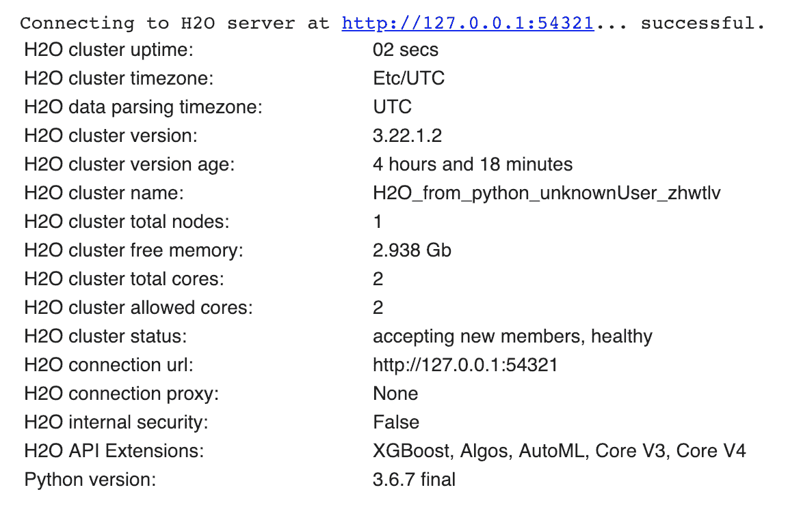
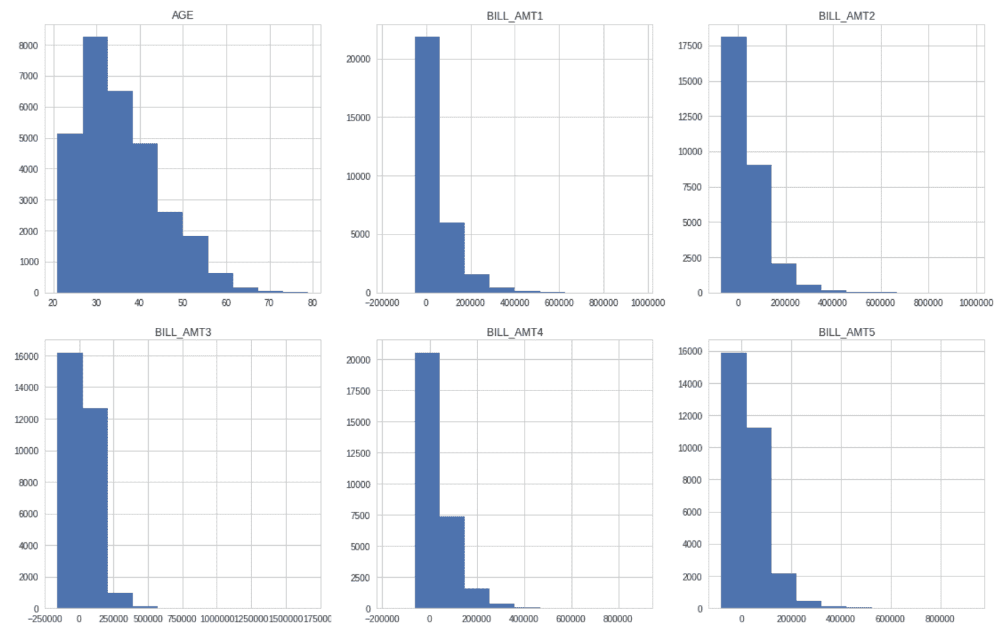
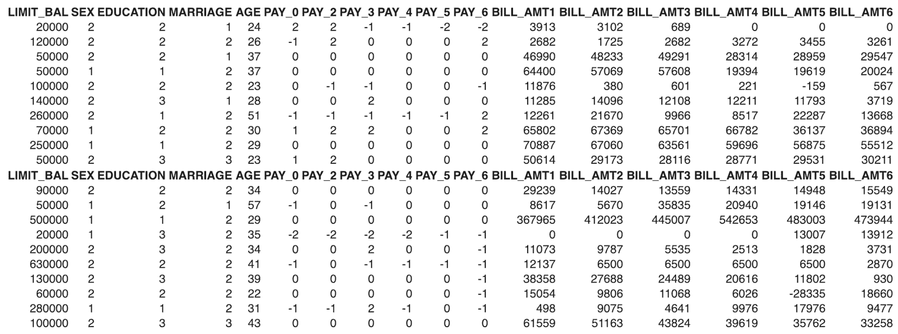
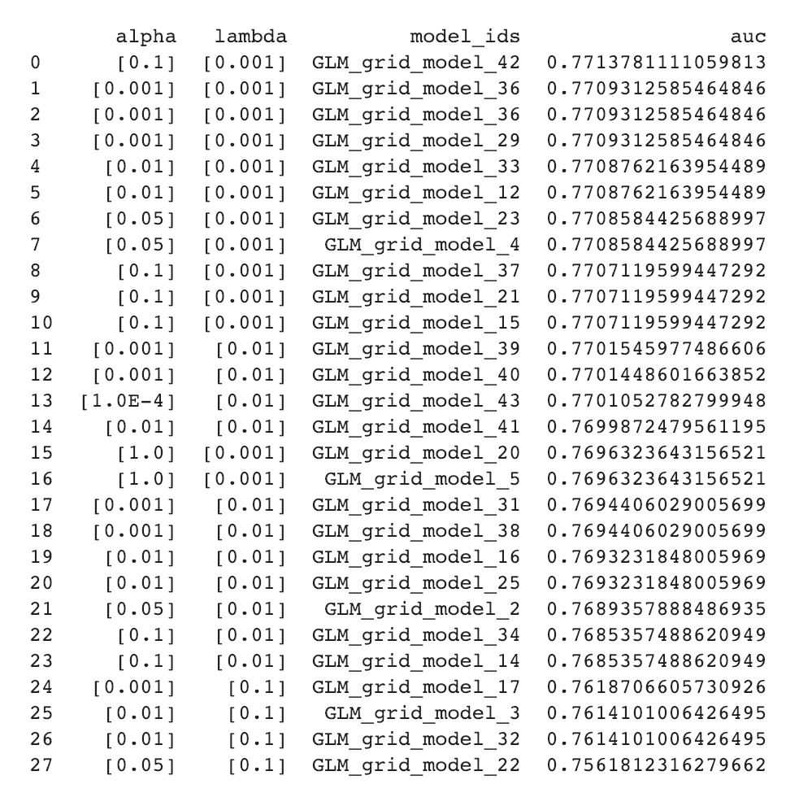
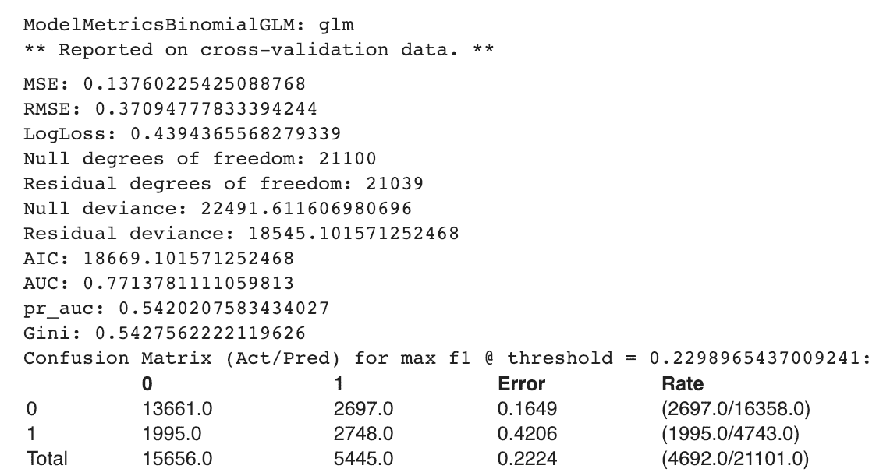
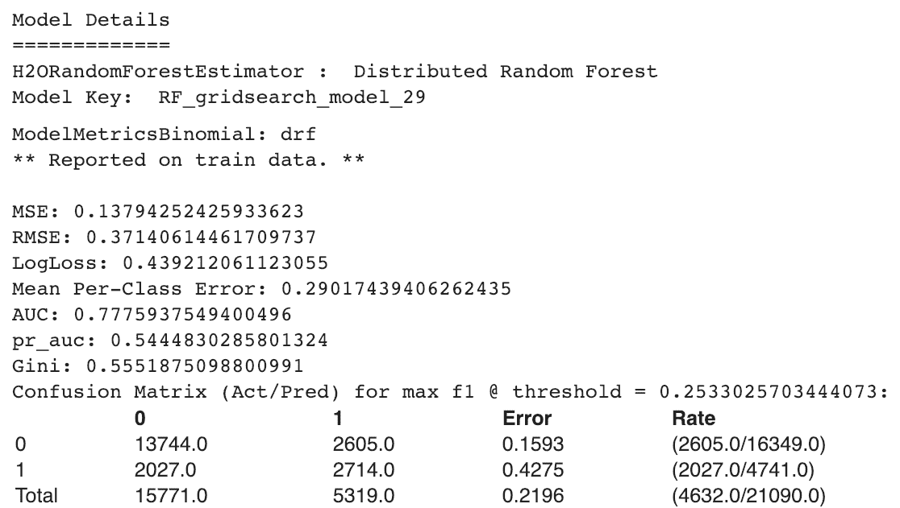

# 基于 H2O 的异构集成分类器

在本章中，我们将介绍以下配方:

*   使用异质集成分类器预测信用卡违约者


# 介绍

在这一章中，我们将展示如何使用 H2O 构建异构集成分类器，它是一个开源、分布式、内存中的机器学习平台。在 H2O 有许多监督和非监督的算法。

在监督算法中，H2O 为我们提供了神经网络、随机森林(RF)、广义线性模型、梯度提升机、朴素贝叶斯分类器和 XGBoost。

H2O 还为我们提供了一种堆叠集成方法，旨在使用堆叠过程找到一组预测算法的最佳组合。H2O 的堆叠系综支持回归和分类。


# 使用异质集成分类器预测信用卡违约者

我们将以台湾的信用卡支付违约者数据为例。这是我们之前在[第 3 章](6a5a73fc-dba9-4903-a54a-6c79a8ee57b4.xhtml)、*重采样方法*中使用的数据集，用于构建逻辑回归模型。在这个食谱中，我们将使用不同的算法建立多个模型，最后，建立一个堆叠的集合模型。

此数据集包含台湾信用卡客户的信息。这包括与付款违约者、客户的人口统计因素、他们的信用数据和他们的付款历史有关的信息。GitHub 中提供了数据集。它也可以从它的主要来源，https://bit.ly/2EZX6IC 的 UCI ML 知识库获得。

在我们的示例中，我们将使用以下来自 H2O 的监督算法来构建我们的模型:

*   广义线性模型
*   分布式随机森林
*   梯度提升机
*   堆叠系综

我们将看到如何在 Python 中使用这些算法，并学习如何为每个算法设置一些超参数。


# 做好准备

我们将使用 Google Colab 来构建我们的模型。在[第十章](0d0517ac-d372-478f-ba6a-4ad4828b81a0.xhtml)、*使用 H2O* 、*、*的异构集成分类器中，我们在*还有更多*部分解释了如何使用 Google 协同实验室。

我们将从在 Google Colab 中安装 H2O 开始，如下所示:

```
! pip install h2o
```

执行前面的命令将显示一些说明，最后一行显示以下消息(H2O 的版本号将根据可用的最新版本而有所不同):

```
Successfully installed colorama-0.4.1 h2o-3.22.1.2
```

我们导入所有需要的库，如下所示:

```
import pandas as pd
import numpy as np

from sklearn.model_selection import train_test_split
from sklearn.metrics import confusion_matrix, roc_curve, auc
from sklearn import tree

import h2o
from h2o.estimators.glm import H2OGeneralizedLinearEstimator
from h2o.estimators.random_forest import H2ORandomForestEstimator
from h2o.estimators.gbm import H2OGradientBoostingEstimator
from h2o.grid.grid_search import H2OGridSearch
from h2o.estimators.stackedensemble import H2OStackedEnsembleEstimator

import seaborn as sns
import matplotlib.pyplot as plt
%matplotlib inline
```

然后我们将初始化 H2O:

```
# Initialize H2o
h2o.init()
```

成功初始化后，我们将看到下面截图中显示的信息。根据环境的不同，此信息可能会有所不同:



我们将从 Google Drive 中读取数据集。为此，我们首先需要安装驱动器:

```
from google.colab import drive
drive.mount('/content/drive')
```

它将指示您转到一个 URL 来获取授权码。你需要点击网址，复制授权码，然后粘贴。成功安装后，您可以从 Google Drive 的相应文件夹中读取您的文件:

```
# Reading dataset from Google drive
df_creditcarddata = h2o.import_file("/content/drive/My Drive/Colab Notebooks/UCI_Credit_Card.csv")
```

注意，使用`h2o.import_file`，我们创建了`h2o.frame.H2OFrame`。这类似于一个`pandas`数据框架。然而，在`pandas`数据帧的情况下，数据保存在内存中，而在这种情况下，数据位于 H2O 集群上。

你可以在 H2O 数据框架上运行类似的方法，就像你可以在熊猫上运行一样。例如，为了查看数据帧中的前 10 个观察值，可以使用以下命令:

```
df_creditcarddata.head()
```

要检查数据帧的尺寸，我们使用以下命令:

```
df_creditcarddata.shape
```

为了查看所有列名，我们运行以下语法:

```
df_creditcarddata.columns
```

在`pandas`数据框架中，我们使用`dtypes`来查看每一列的数据类型。在 H2o 数据框架中，我们将使用以下内容:

```
df_creditcarddata.types
```

这为我们提供了以下输出。注意分类变量显示为`'enum'`:


数据集中有我们的目标变量`default.payment.next.month`。这将告诉我们哪些客户已经或尚未拖欠付款。我们希望看到违约者和非违约者的分布情况:

```
df_creditcarddata['default.payment.next.month'].table()
```

这给了我们`default.payment.next.month`变量中每个类的计数:


我们不需要`ID`列进行预测建模，所以我们将它从数据框架中移除:

```
df_creditcarddata = df_creditcarddata.drop(["ID"], axis = 1) 
```

我们可以使用`hist()`方法查看数值变量的分布:

```
import pylab as pl
df_creditcarddata[['AGE','BILL_AMT1','BILL_AMT2','BILL_AMT3','BILL_AMT4','BILL_AMT5','BILL_AMT6', 'LIMIT_BAL']].as_data_frame().hist(figsize=(20,20))
pl.show()
```

下面的截图向我们展示了绘制的变量。这可以帮助我们分析每个变量:



为了扩展我们的分析，我们可以看到违约者和非违约者在性别、教育和婚姻状况方面的分布情况:

```
# Defaulters by Gender
columns = ["default.payment.next.month","SEX"]
default_by_gender = df_creditcarddata.group_by(by=columns).count(na ="all")
print(default_by_gender.get_frame())

# Defaulters by education
columns = ["default.payment.next.month","EDUCATION"]
default_by_education = df_creditcarddata.group_by(by=columns).count(na ="all")
print(default_by_education.get_frame())

# Defaulters by MARRIAGE
columns = ["default.payment.next.month","MARRIAGE"]
default_by_marriage = df_creditcarddata.group_by(by=columns).count(na ="all")
print(default_by_marriage.get_frame())
```

在下面的截图中，我们可以看到不同类别的违约者的分布情况:


我们现在将分类变量转换成因子:

```
# Convert the categorical variables into factors

df_creditcarddata['SEX'] = df_creditcarddata['SEX'].asfactor()
df_creditcarddata['EDUCATION'] = df_creditcarddata['EDUCATION'].asfactor()
df_creditcarddata['MARRIAGE'] = df_creditcarddata['MARRIAGE'].asfactor()
df_creditcarddata['PAY_0'] = df_creditcarddata['PAY_0'].asfactor()
df_creditcarddata['PAY_2'] = df_creditcarddata['PAY_2'].asfactor()
df_creditcarddata['PAY_3'] = df_creditcarddata['PAY_3'].asfactor()
df_creditcarddata['PAY_4'] = df_creditcarddata['PAY_4'].asfactor()
df_creditcarddata['PAY_5'] = df_creditcarddata['PAY_5'].asfactor()
df_creditcarddata['PAY_6'] = df_creditcarddata['PAY_6'].asfactor()
```

我们还将二分目标变量`default.payment.next.month`编码为因子变量。转换后，我们用`levels()`方法检查目标变量的类:

```
# Also, encode the binary response variable as a factor
df_creditcarddata['default.payment.next.month'] = df_creditcarddata['default.payment.next.month'].asfactor() 
df_creditcarddata['default.payment.next.month'].levels()
```

然后，我们将定义预测变量和目标变量:

```
# Define predictors manually
predictors = ['LIMIT_BAL','SEX','EDUCATION','MARRIAGE','AGE','PAY_0','PAY_2','PAY_3',\
 'PAY_4','PAY_5','PAY_6','BILL_AMT1','BILL_AMT2','BILL_AMT3','BILL_AMT4',\
 'BILL_AMT5','BILL_AMT6','PAY_AMT1','PAY_AMT2','PAY_AMT3','PAY_AMT4','PAY_AMT5','PAY_AMT6']

target = 'default.payment.next.month'
```

然后，我们使用`split_frame()`方法分割数据帧:

```
splits = df_creditcarddata.split_frame(ratios=[0.7], seed=1) 
```

下面的代码给出了两个分割输出:

```
splits
```

在下面的屏幕截图中，我们可以看到以下两个分割:



我们将分割分为训练和测试子集:

```
train = splits[0]
test = splits[1] 
```


# 怎么做...

让我们继续使用本章前面提到的算法来训练我们的模型。我们将从训练我们的**广义线性模型** ( **GLM** )模型开始。我们将建立三个 GLM 模型:

*   具有参数默认值的 GLM 模型
*   具有λ搜索(正则化)的 GLM 模型
*   网格搜索下的 GLM 模型

现在，我们将在下一节开始训练我们的模型。

1.  让我们训练我们的第一个模型:

```
GLM_default_settings = H2OGeneralizedLinearEstimator(family='binomial', \
                                            model_id='GLM_default',nfolds = 10, \
                                            fold_assignment = "Modulo", \
                                            keep_cross_validation_predictions = True)
```

`H2OGeneralizedLinearEstimator`符合广义线性模型。它接受一个响应变量和一组预测变量。

`H2OGeneralizedLinearEstimator`可以处理回归和分类任务。在回归问题的情况下，它返回一个`H2ORegressionModel`子类，而对于分类，它返回一个`H2OBinomialModel`子类。

2.  我们在*准备就绪*部分创建了预测变量和目标变量。将预测值和目标变量传递给模型:

```
GLM_default_settings.train(x = predictors, y = target, training_frame = train)
```

3.  使用`lambda_search`参数训练 GLM 模型:

```
GLM_regularized = H2OGeneralizedLinearEstimator(family='binomial', model_id='GLM', \
                                                lambda_search=True, nfolds = 10, \
                                                fold_assignment = "Modulo", \
                                                keep_cross_validation_predictions = True)

GLM_regularized.train(x = predictors, y = target, training_frame = train)
```

`lambda_search`帮助 GLM 找到最佳正则化参数λ。`lambda_search`参数接受一个布尔值。当设置为`True`时，GLM 将首先拟合具有最高 lambda 值的模型，这被称为**最大正则化**。然后，它在每一步减少这个值，直到它达到最小λ。最终的最佳模型基于最佳λ值。

4.  使用带网格搜索的 GLM 训练模型:

```
hyper_parameters = { 'alpha': [0.001, 0.01, 0.05, 0.1, 1.0],
                     'lambda': [0.001, 0.01, 0.1, 1] }
search_criteria = { 'strategy': "RandomDiscrete", 'seed': 1,
                    'stopping_metric': "AUTO",
                    'stopping_rounds': 5 }

GLM_grid_search = H2OGridSearch(H2OGeneralizedLinearEstimator(family='binomial', \
                  nfolds = 10, fold_assignment = "Modulo", \
                  keep_cross_validation_predictions = True),\
                  hyper_parameters, grid_id="GLM_grid", search_criteria=search_criteria)

GLM_grid_search.train(x= predictors,y= target, training_frame=train)
```

5.  我们用`get_grid()`方法得到按`auc`值排序的网格结果:

```
# Get the grid results, sorted by validation AUC
GLM_grid_sorted = GLM_grid_search.get_grid(sort_by='auc', decreasing=True)
GLM_grid_sorted
```

在下面的截图中，我们可以看到每个型号的`auc`分数，它由`alpha`和`lambda`参数的不同组合组成:



6.  我们可以在我们的训练数据和交叉验证数据上看到模型指标:

```
# Extract the best model from random grid search
Best_GLM_model_from_Grid = GLM_grid_sorted.model_ids[0]

# model performance
Best_GLM_model_from_Grid = h2o.get_model(Best_GLM_model_from_Grid)
print(Best_GLM_model_from_Grid)
```

从前面的代码块中，您可以评估模型度量，包括`MSE`、`RMSE`、`Null`和`Residual Deviance`、`AUC`和`Gini`，以及`Confusion Matrix`。在稍后的阶段，我们将使用网格搜索中的最佳模型来构建堆叠系综。

让我们看下图并评估模型指标:



7.  使用随机森林训练模型。使用默认设置的随机森林的代码如下所示:

```
# Build a RF model with default settings
RF_default_settings = H2ORandomForestEstimator(model_id = 'RF_D',\
                                nfolds = 10, fold_assignment = "Modulo", \
                                keep_cross_validation_predictions = True)

# Use train() to build the model
RF_default_settings.train(x = predictors, y = target, training_frame = train)
```

8.  要获得模型的汇总输出，请使用以下代码:

```
RF_default_settings.summary()
```

9.  使用网格搜索训练随机森林模型。如下面的代码块所示设置超参数:

```
hyper_params = {'sample_rate':[0.7, 0.9],
                'col_sample_rate_per_tree': [0.8, 0.9],
                'max_depth': [3, 5, 9],
                'ntrees': [200, 300, 400]
               }
```

10.  使用`H2OGridSearch()`上的超参数通过`gridsearch`训练`RF`模型:

```
RF_grid_search = H2OGridSearch(H2ORandomForestEstimator(nfolds = 10, \
                             fold_assignment = "Modulo", \
                             keep_cross_validation_predictions = True, \
                             stopping_metric = 'AUC',stopping_rounds = 5), \
                             hyper_params = hyper_params, \
                             grid_id= 'RF_gridsearch')

# Use train() to start the grid search
RF_grid_search.train(x = predictors, y = target, training_frame = train)
```

11.  按 AUC 分数对结果进行排序，以查看哪个模型表现最佳:

```
# Sort the grid models
RF_grid_sorted = RF_grid_search.get_grid(sort_by='auc', decreasing=True)
print(RF_grid_sorted)
```

12.  从网格搜索结果中提取最佳模型:

```
Best_RF_model_from_Grid = RF_grid_sorted.model_ids[0]

# Model performance
Best_RF_model_from_Grid = h2o.get_model(Best_RF_model_from_Grid) 
print(Best_RF_model_from_Grid)
```

在下面的屏幕截图中，我们看到了培训数据和交叉验证数据上的网格模型的模型指标:



13.  使用 GBM 训练模型。以下是使用默认设置训练 GBM 的方法:

```
GBM_default_settings = H2OGradientBoostingEstimator(model_id = 'GBM_default', \
                       nfolds = 10, \
                       fold_assignment = "Modulo", \
                       keep_cross_validation_predictions = True)

# Use train() to build the model
GBM_default_settings.train(x = predictors, y = target, training_frame = train)
```

14.  在 GBM 上使用网格搜索。要执行网格搜索，请按如下方式设置超参数:

```
hyper_params = {'learn_rate': [0.001,0.01, 0.1],
                'sample_rate': [0.8, 0.9],
                'col_sample_rate': [0.2, 0.5, 1],
                'max_depth': [3, 5, 9]}
```

15.  使用`H2OGridSearch()`上的超参数，通过网格搜索训练 GBM 模型:

```
GBM_grid_search = H2OGridSearch(H2OGradientBoostingEstimator(nfolds = 10, \
                        fold_assignment = "Modulo", \
                        keep_cross_validation_predictions = True,\
                        stopping_metric = 'AUC', stopping_rounds = 5),
                        hyper_params = hyper_params, grid_id= 'GBM_Grid')

# Use train() to start the grid search
GBM_grid_search.train(x = predictors, y = target, training_frame = train)
```

16.  与早期模型一样，我们可以查看按 AUC 排序的结果:

```
# Sort and show the grid search results
GBM_grid_sorted = GBM_grid_search.get_grid(sort_by='auc', decreasing=True)
print(GBM_grid_sorted)
```

17.  从网格搜索中提取最佳模型:

```
Best_GBM_model_from_Grid = GBM_grid_sorted.model_ids[0]

Best_GBM_model_from_Grid = h2o.get_model(Best_GBM_model_from_Grid) 
print(Best_GBM_model_from_Grid)
```

我们可以使用`H2OStackedEnsembleEstimator`构建一个堆叠集合 ML 模型，该模型可以使用我们使用 H2O 算法构建的模型来提高预测性能。`H2OStackedEnsembleEstimator`帮助我们找到一组预测算法的最佳组合。

18.  从我们使用网格搜索构建的早期模型中创建一个最佳模型列表:

```
# list the best models from each grid
all_models = [Best_GLM_model_from_Grid, Best_RF_model_from_Grid, Best_GBM_model_from_Grid]
```

19.  使用`H2OStackedEnsembleEstimator`设置堆叠集合模型:

```
# Set up Stacked Ensemble
ensemble = H2OStackedEnsembleEstimator(model_id = "ensemble", base_models = all_models, metalearner_algorithm = "deeplearning")

# uses GLM as the default metalearner
ensemble.train(y = target, training_frame = train)
```

20.  根据测试数据评估整体性能:

```
# Eval ensemble performance on the test data
Ens_model = ensemble.model_performance(test)
Ens_AUC = Ens_model.auc()
```

21.  比较基础学员在`test`数据上的表现。以下代码测试了我们构建的所有 GLM 模型的模型性能:

```
# Checking the model performance for all GLM models built
model_perf_GLM_default = GLM_default_settings.model_performance(test)
model_perf_GLM_regularized = GLM_regularized.model_performance(test)
model_perf_Best_GLM_model_from_Grid = Best_GLM_model_from_Grid.model_performance(test)
```

以下代码测试了我们构建的所有随机森林模型的模型性能:

```
# Checking the model performance for all RF models built
model_perf_RF_default_settings = RF_default_settings.model_performance(test)
model_perf_Best_RF_model_from_Grid = Best_RF_model_from_Grid.model_performance(test)
```

以下代码测试了我们构建的所有 GBM 模型的模型性能:

```
# Checking the model performance for all GBM models built
model_perf_GBM_default_settings = GBM_default_settings.model_performance(test)
model_perf_Best_GBM_model_from_Grid = Best_GBM_model_from_Grid.model_performance(test)
```

22.  要从基础学员那里获得最佳 AUC，请执行以下命令:

```
# Best AUC from the base learner models
best_auc = max(model_perf_GLM_default.auc(), model_perf_GLM_regularized.auc(), \
 model_perf_Best_GLM_model_from_Grid.auc(), \
 model_perf_RF_default_settings.auc(), \
 model_perf_Best_RF_model_from_Grid.auc(), \
 model_perf_GBM_default_settings.auc(), \
 model_perf_Best_GBM_model_from_Grid.auc())

print("Best AUC out of all the models performed: ", format(best_auc))
```

23.  以下命令显示堆叠系综模型的 AUC:

```
# Eval ensemble performance on the test data
Ensemble_model = ensemble.model_performance(test)
Ensemble_model = Ensemble_model.auc()
```


# 它是如何工作的...

我们使用 Google Colab 来训练我们的模型。在 Google Colab 中安装了 H2O 之后，我们初始化了 H2O 实例。我们还导入了所需的库。

为了使用 H2O 的库，我们从`h2o.estimators`引入了`H2OGeneralizedLinearEstimator`、`H2ORandomForestEstimator`和`H2OGradientBoostingEstimator`。我们还导入了`H2OStackedEnsembleEstimator`来使用堆叠集合训练我们的模型。

我们安装了 Google Drive 并使用`h2o.import_file()`读取数据集。这创建了一个 H2O 数据帧，它非常类似于一个`pandas`数据帧。但是，数据不是保存在内存中，而是位于一个远程 H2O 集群中。

然后，我们在 H2O 数据框架上执行基本操作来分析我们的数据。我们看了一下维度、前几行和每列的数据类型。`shape`属性返回了一个包含行数和列数的元组。`head()`方法返回前 10 个观察值。`types`属性返回每一列的数据类型。

注意，H2O 数据帧中的分类变量被标记为`enum`。

我们的目标变量是`default.payment.next.month`。使用`table()`方法，我们看到了目标变量的两个类的分布。在这种情况下，`table()`方法返回了类`1`和`0`的计数。

我们不需要`ID`列，所以我们使用带有`axis=1`作为参数的`drop()`方法删除了它。使用`axis=1`，它删除了列。否则，`axis=0`的默认值将从索引中删除标签。

我们分析了数字变量的分布。您可以无限探索您的数据。我们还看到了我们的目标变量的两个类别在不同类别中的分布，如性别、教育和婚姻。

然后，我们用`asfactor()`方法将分类变量转换成因子类型。对目标变量也是如此。

我们创建了一个预测变量和目标变量的列表。我们用`split_frame()`方法将数据帧分成训练和测试子集。

我们将比率传递给`split_frame()`方法。在我们的例子中，我们将数据集分成 70%和 30%。但是，请注意，这并没有给出 70%-30%的精确划分。H2O 使用概率分割方法，而不是使用精确的比率来分割数据集。这是为了在大数据上提高拆分效率。

在我们将数据集分成训练和测试子集之后，我们继续训练我们的模型。我们使用 GLM、随机森林、一台**梯度提升机** ( **GBM** )和堆叠系综来训练堆叠模型。

在*怎么做...*部分，在*步骤 1* 和*步骤 2* 中，我们展示了使用默认设置训练 GLM 模型的代码。我们使用交叉验证来训练我们的模型。

在*步骤 3* 中，我们用`lambda_search`训练了一个 GLM 模型，这有助于找到最优的正则化参数。

在*步骤 4* 中，我们使用网格搜索参数来训练我们的 GLM 模型。我们设置了超参数，并将其提供给`H2OGridSearch()`方法。这有助于我们跨模型搜索最佳参数。在`H2OGridSearch()`方法中，我们使用了`RandomDiscrete`搜索标准策略。

默认的搜索标准策略是笛卡尔的，它覆盖了超参数组合的整个空间。随机离散策略对所提供的超参数的所有组合进行随机搜索。

在*步骤 5* 中，使用`get_grid()`方法，我们查看了使用所提供参数的不同组合构建的每个模型的 AUC 分数。在*步骤 6* 中，我们从随机网格搜索中提取了`best`模型。我们还可以在最佳模型上使用`print()`方法，查看训练数据和交叉验证数据上的模型性能指标。

在*步骤 7* 中，我们使用默认设置训练了一个随机森林模型，并查看了步骤 8 中生成的模型的摘要。在*步骤 9* 和*步骤 10* 中，我们展示了使用网格搜索训练随机森林模型的代码。我们为各种可接受的超参数设置多个值，如`sample_rate`、`col_sample_rate_per_tree`、`max_depth`和`ntrees`。`sample_rate`指不替换的行抽样。它取值在`0`和`1`之间，表示数据的采样百分比。`col_sample_rate_per_tree`是对每棵树进行无替换的列采样。`max_depth`设置为指定每棵树应建造的最大深度。较深的树可能在训练数据上表现得更好，但是将花费更多的计算时间，并且可能过度拟合，并且不能对看不见的数据进行归纳。`ntrees`参数用于基于树的算法，指定在模型上构建的树的数量。

在*步骤 11* 和*步骤 12* 中，我们打印了网格搜索生成的每个模型的 AUC 分数，并从中提取了最佳模型。

我们还训练了 GBM 模型来适应我们的数据。在*步骤 13* 中，我们使用默认设置构建了 GBM。在*步骤 14* 中，我们为网格搜索设置超参数空间。我们在*步骤 15* 中使用了这个，在那里我们培训了我们的 GBM。在 GBM 中，我们为超参数设置值，如`learn_rate`、`sample_rate`、`col_sample_rate`、`max_depth`和`ntrees`。`learn_rate`参数用于指定 GBM 算法训练模型的速率。`learn_rate`参数值越低越好，有助于避免过拟合，但计算时间会很长。

在 H2O，`learn_rate`有 GBM 和 XGBoost 两种型号。

*第 16 步*向我们展示了网格搜索得到的每个模型的 AUC 分数。我们在*步骤 17* 中提取了最佳网格搜索 GBM。

在*步骤 18* 到*步骤 20* 中，我们使用来自 H2O 的`H2OStackedEnsembleEstimator`来训练我们的堆叠系综模型。我们根据测试数据评估了最终模型的性能。

在第 21 步中，我们评估了根据测试数据构建的所有 GLM 模型。我们对使用 RF 和 GBM 训练的所有模型进行了同样的操作。*第 22 步*给出了具有最大 AUC 分数的模型。在*步骤 23* 中，我们评估了测试数据上堆叠集成模型的 AUC 分数，以便比较堆叠集成模型与单个基础学习者的性能。


# 还有更多...

请注意，我们使用交叉验证来训练我们所有的模型。我们使用了`nfolds`选项来设置用于交叉验证的折叠数。在我们的例子中，我们使用了`nfolds=5`，但是我们也可以将其设置为更高的数字。

在你建立的每个模型中，折叠的数量需要是相同的。

指定了`nfolds`的值后，我们还可以为`fold_assignment`参数提供一个值。`fold_assignment`取`auto`、`random`、`modulo`、`stratified`等值。如果我们设置为`Auto`，算法自动选择一个选项；目前选择`Random`。当`fold_assignment`设置为`Random`时，它会将数据随机分成`nfolds`组。当`fold_assignment`被设置为`Modulo`时，它使用确定性方法将数据平均分割成不依赖于`seed`参数的`nfolds`。

当我们使用交叉验证方法构建模型时，确保您为所有模型指定一个`seed`值或使用`fold_assignment="Modulo"`。

在网格搜索中，我们使用了两个参数:`stopping_metric`和`stopping_rounds`。这些参数适用于 GBM 和随机森林算法，但不适用于 GLM。`stopping_metric`指定在指定提前停止时要考虑的指标，这可以通过将`stopping_rounds`设置为大于零的值来实现。

在我们的例子中，我们将`stopping_metric`设置为 AUC，将`stopping_rounds`设置为 5。这意味着，如果 AUC 在指定的回合数(在我们的例子中是五个回合)内没有改善，算法将在停止进一步训练之前测量 AUC。

如果指定了`stopping_metric`，也必须设置`stopping_rounds`。当`stopping_tolerance`也被设置时，如果模型的`stopping_metric`没有提高到`stopping_tolerance`值，模型将在达到`stopping_rounds`中提到的轮数后停止训练。


# 请参见

http://docs.h2o.ai/提供 H2O 文档。