# 十一、基于自然语言处理的异构文本分类集成

在本章中，我们将讨论以下主题:

*   使用异构算法集成的垃圾邮件过滤
*   基于集成模型的电影评论情感分析


# 介绍

文本分类是语言处理和文本挖掘的一个广泛研究的领域。使用文本分类机制，我们可以根据内容将文档分类到预定义的类别中。

在这一章中，我们将看看如何对发送到我们手机上的短信进行分类。虽然我们收到的一些信息很重要，但其他信息可能会对我们的隐私构成严重威胁。我们希望能够对文本消息进行正确的分类，以避免垃圾邮件和错过重要的消息。


# 使用异构算法集成的垃圾邮件过滤

我们将使用 UCI ML 存储库中的垃圾短信收集数据集来创建垃圾短信分类器。使用垃圾邮件分类器，我们可以估计这些邮件的极性。我们可以使用各种分类器将邮件分类为垃圾邮件或垃圾邮件。

在本例中，我们选择了朴素贝叶斯、随机森林和支持向量机等算法来训练我们的模型。

我们使用各种数据清理和准备机制来准备数据。为了预处理我们的数据，我们将执行以下序列:

1.  将所有文本转换为小写
2.  删除标点符号
3.  删除停用词
4.  执行词干分析
5.  将数据符号化

我们还使用**t**erm frequency-inverse data frequency(**TF-IDF**)来处理我们的数据，它告诉我们一个单词在消息或文档中出现的频率。TF 计算如下:

`TF = No. of times a word appears in a document / Total No. of words in the document`

TF-IDF 根据一个单词在一个文档或一组文档中出现的频率，对该单词的重要性进行数字评分。简单来说，TF-IDF 评分越高的术语越稀有。分数越低，越普遍。TD-IDF 的数学表达式如下:

`tfidf(w,d,D)= tf(t,d) × idf(t,D)`

其中 w 代表单词，D 代表文档，D 代表文档集合。

在本例中，我们将使用垃圾短信收集数据集，该数据集标记了为研究手机垃圾短信而收集的消息。这个数据集在 UCI ML 资源库中可用，也在 GitHub 资源库中提供。


# 做好准备

我们从导入所需的库开始:

```py
import os
import numpy as np
import pandas as pd
import itertools
import warnings
import string
import matplotlib.pyplot as plt
from nltk.corpus import stopwords
from nltk.stem import WordNetLemmatizer
from sklearn.feature_extraction.text import CountVectorizer
from sklearn.feature_extraction.text import TfidfVectorizer
from sklearn.model_selection import train_test_split
from sklearn.naive_bayes import MultinomialNB
from sklearn.metrics import confusion_matrix
from sklearn.model_selection import GridSearchCV
from sklearn.ensemble import RandomForestClassifier
from sklearn.metrics import classification_report
from sklearn.metrics import roc_auc_score as auc
from sklearn.metrics import roc_curve
from sklearn.metrics import accuracy_score
from scipy.stats import mode
```

注意，对于这个例子，我们导入了像`nltk`这样的库来准备我们的数据。我们还从`sklearn.feature_extraction`引入了`CountVectorizer`和`TfidVectorizer`模块。这些模块用于 ML 算法中的特征提取。

我们重用 scikit-learn 网站上的`plot_confusion_matrix`来绘制我们的混淆矩阵。这也是我们在前面章节中使用过的函数:

```py
def plot_confusion_matrix(cm, classes,
                          normalize=False,
                          title='Confusion matrix',
                          cmap=plt.cm.Blues):

    plt.imshow(cm, interpolation='nearest', cmap=cmap)
    plt.title(title)
    plt.colorbar()
    tick_marks = np.arange(len(classes))
    plt.xticks(tick_marks, classes, rotation=45)
    plt.yticks(tick_marks, classes)

    fmt = '.2f' if normalize else 'd'
    thresh = cm.max() / 2.
    for i, j in itertools.product(range(cm.shape[0]), range(cm.shape[1])):
        plt.text(j, i, format(cm[i, j], fmt),
                 horizontalalignment="center",
                 color="white" if cm[i, j] > thresh else "black")

    plt.ylabel('True label')
    plt.xlabel('Predicted label')
    plt.tight_layout()
```

我们设置工作目录并读取数据集:

```py
os.chdir("/.../Chapter 11/CS - SMS Classification")
os.getcwd()

df_sms = pd.read_csv("sms_labeled_data.csv", encoding = 'utf8')
```

注意我们用的是`encoding='utf8'`。这是为了指示`read_csv()`方法使用 UTF 编码来读取文件。Python 附带了许多编解码器。详尽的列表可在[https://docs . python . org/3/library/codecs . html # standard-encodings](https://docs.python.org/3/library/codecs.html#standard-encodings)获得。

读取数据后，我们检查它是否已正确加载:

```py
df_sms.head()
```

我们还使用`dataframe.shape`检查数据集中的观察值和特征的数量:

```py
df_sms.shape
```

我们来看看垃圾邮件和业余邮件的数量:

```py
# Gives the count for ham messages
print(df_sms["type"].value_counts()[0])
no_of_ham_messages = df_sms["type"].value_counts()[0]

# Gives the count for spam messages
print(df_sms["type"].value_counts()[1])
no_of_spam_messages = df_sms["type"].value_counts()[1]
```

我们还可以直观显示垃圾邮件和业余邮件的比例:

```py
sms_count = pd.value_counts(df_sms["type"], sort= True)
ax = sms_count.plot(kind='bar', figsize=(10,10), color= ["green", "orange"], fontsize=13)

ax.set_alpha(0.8)
ax.set_title("Percentage Share of Spam and Ham Messages")
ax.set_ylabel("Count of Spam & Ham messages");
ax.set_yticks([0, 500, 1000, 1500, 2000, 2500, 3000, 3500, 4000, 4500, 5000, 5500])

totals = []
for i in ax.patches:
totals.append(i.get_height())

total = sum(totals)

# set individual bar lables using above list
for i in ax.patches:
string = str(round((i.get_height()/total)*100, 2))+'%'
# get_x pulls left or right; get_height pushes up or down
ax.text(i.get_x()+0.16, i.get_height(), string, fontsize=13, color='black')
```

通过前面的代码，我们可以看到下面的图:

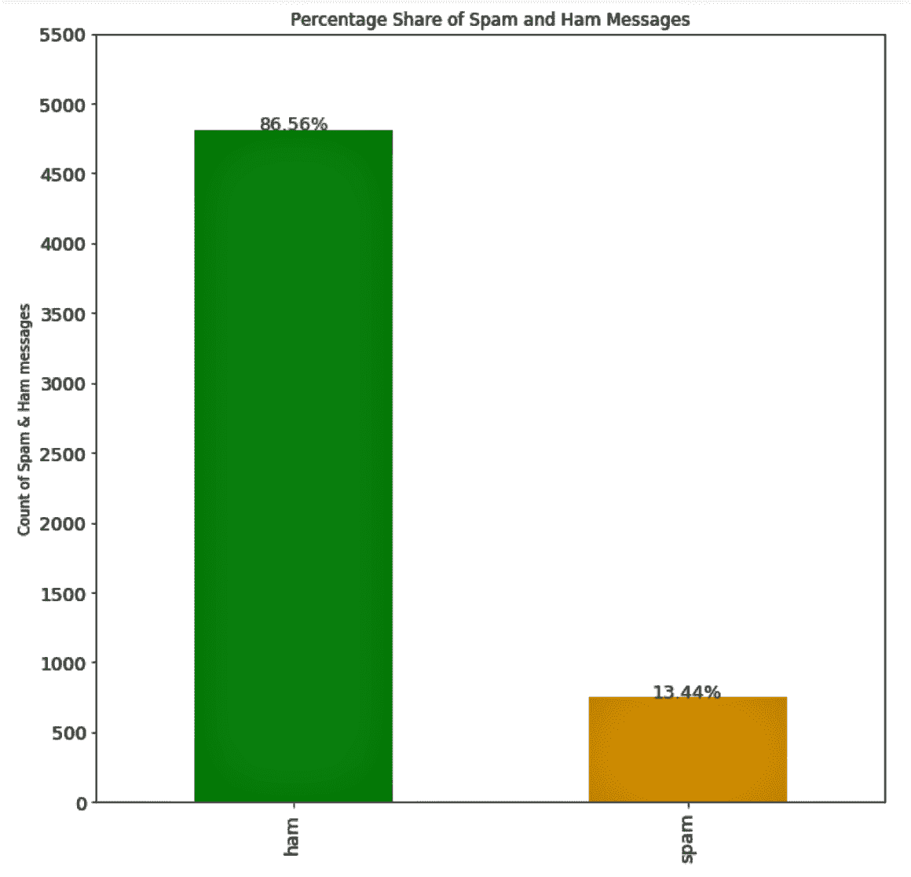

我们还定义了一个函数来删除标点符号，将文本转换为小写，并删除停用词:

```py
lemmatizer = WordNetLemmatizer()

# Defining a function to remove punctuations, convert text to lowercase and remove stop words
def process_text(text):
    no_punctuations = [char for char in text if char not in string.punctuation]
    no_punctuations = ''.join(no_punctuations)

    clean_words = [word.lower() for word in nopunc.split() if word.lower() not in stopwords.words('english')]
    clean_words = [lemmatizer.lemmatize(lem) for lem in clean_words]
    clean_words = " ".join(clean_words)

    return clean_words
```

我们将定义的`process_text()`函数应用于数据集中的文本变量:

```py
df_sms['text'] = df_sms['text'].apply(text_processing)
```

我们分离特征和目标变量，并将数据分成`train`和`test`子集:

```py
X = df_sms.loc[:,'text']
Y = df_sms.loc[:,'type']
Y = Y.astype('int')

X_train, X_test, Y_train, Y_test = train_test_split(X, Y, test_size=.3, random_state=1)
```

我们使用`CountVectorizer`模块将文本转换成向量:

```py
count_vectorizer = CountVectorizer(stop_words='english')

count_train = count_vectorizer.fit_transform(X_train)
count_test = count_vectorizer.transform(X_test)
```

我们还使用`TfidfVectorizer`模块将文本转换成 TF-IDF 向量:

```py
tfidf = TfidfVectorizer(stop_words='english')

tfidf_train = tfidf.fit_transform(X_train)
tfidf_test = tfidf.transform(X_test)
```

现在让我们继续训练我们的模型。我们对计数数据和 TF-IDF 数据使用以下算法，并观察各个模型的表现:

*   朴素贝叶斯
*   支持向量机
*   随机森林

我们也结合模型预测来看集合的结果。


# 怎么做...

让我们从训练我们的模型开始，看看它们在这一部分的表现如何:

1.  使用朴素贝叶斯算法为模型定型。将该算法应用于计数数据和 TF-IDF 数据。

以下是对计数数据进行朴素贝叶斯定型的代码:

```py
from sklearn.naive_bayes import MultinomialNB
nb = MultinomialNB()

nb.fit(count_train, Y_train)
nb_pred_train = nb.predict(count_train)
nb_pred_test = nb.predict(count_test)
nb_pred_train_proba = nb.predict_proba(count_train)
nb_pred_test_proba = nb.predict_proba(count_test)

print('The accuracy for the training data is {}'.format(nb.score(count_train, Y_train)))
print('The accuracy for the testing data is {}'.format(nb.score(count_test, Y_test)))
```

看看前面模型的`train`和`test`精度:


2.  使用`classification_report()`方法打印分类报告。将`Y_test`和`nb_pred_test`传递给`classification_report()`方法:

```py
print(classification_report(Y_test, nb_pred_test))
```

这为我们提供了以下输出，它显示了目标变量中每个类的`precision`、`recall`、`f1-score`和`support`:


3.  将`Y_test`和`nb_pred_test`传递给`plot_confusion_matrix()`函数，以绘制混淆矩阵，如下所示:

```py
target_names = ['Spam','Ham']

# Pass actual & predicted values to the confusion matrix()
cm = confusion_matrix(Y_test, nb_pred_test)
plt.figure()
plot_confusion_matrix(cm, classes=target_names)
plt.show()
```

下图显示了真负值、假正值、假负值和真正值:


注意，在前面的*准备*部分，我们使用了`TfidfVectorizer`模块将文本转换成 TF-IDF 向量。

4.  用朴素贝叶斯模型拟合 TF-IDF 训练数据:

```py
nb.fit(tfidf_train, Y_train)
nb_pred_train_tfidf = nb.predict(tfidf_train)
nb_pred_test_tfidf = nb.predict(tfidf_test)

nb_tfidf_pred_train_proba = nb.predict_proba(tfidf_train)
nb_tfidf_pred_test_proba = nb.predict_proba(tfidf_test)

print('The accuracy for the training data is {}'.format(nb.score(count_train, Y_train)))
print('The accuracy for the testing data is {}'.format(nb.score(count_test, Y_test)))
```

5.  检查 TF-IDF 测试数据的性能统计数据:

```py
print(classification_report(Y_test, nb_pred_test_tfidf))

target_names = ['Spam','Ham']

# Pass actual & predicted values to the confusion matrix()
cm = confusion_matrix(Y_test, nb_pred_test_tfidf)
plt.figure()

plot_confusion_matrix(cm, classes=target_names)
plt.show()
```

在下面的屏幕截图中，我们可以看到前面代码块的输出:


6.  用具有计数数据的支持向量机分类器来拟合模型。使用`GridSearchCV`对估算器的指定参数值进行搜索:

```py
from sklearn.svm import SVC

svc = SVC(kernel='rbf',probability=True)
svc_params = {'C':[0.001, 0.01, 0.1, 1, 10]}

svc_gcv_rbf_count = GridSearchCV(svc, svc_params, cv=5)
svc_gcv_rbf_count.fit(count_train, Y_train)

# We use the grid model to predict the class 
svc_rbf_train_predicted_values = svc_gcv_rbf_count.predict(count_train)
svc_rbf_test_predicted_values = svc_gcv_rbf_count.predict(count_test)

# We use the grid model to predict the class probabilities
svc_gcv_train_proba_rbf = svc_gcv_rbf_count.predict_proba(count_train)
svc_gcv_test_proba_rbf = svc_gcv_rbf_count.predict_proba(count_test)

print('The best parameters {}'.format(svc_gcv_rbf_count.best_params_))
print('The best score {}'.format(svc_gcv_rbf_count.best_score_))
```

网格搜索为我们提供了最佳模型。我们可以看到最佳模型的参数值和得分:


7.  用下面的代码看看计数数据的`test`精度:

```py
print(classification_report(Y_test, svc_rbf_test_predicted_values))

target_names = ['Spam','Ham']

# Pass actual & predicted values to the confusion matrix()
cm = confusion_matrix(Y_test, svc_rbf_test_predicted_values)
plt.figure()
plot_confusion_matrix(cm,classes=target_names)
plt.show()
```

下面是`classification_report()`和混淆矩阵的输出:

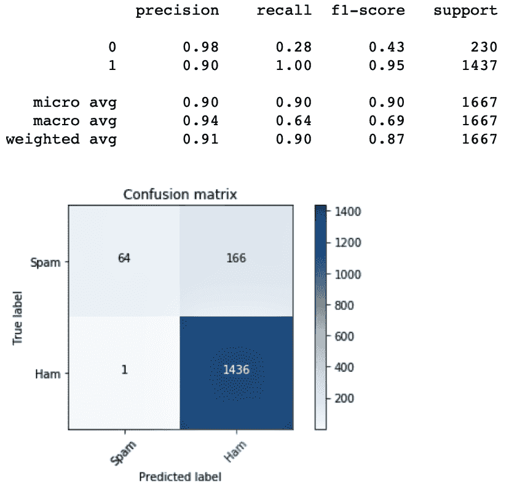

8.  将 SVM 与 TF-IDF 数据一起使用:

```py
svc = SVC(kernel='rbf',probability=True)
svc_params = {'C':[0.001, 0.01, 0.1, 1, 10]}

svc_gcv = GridSearchCV(svc,svc_params,cv=5)
svc_gcv.fit(tfidf_train, Y_train)

# We use the grid model to predict the class 
svc_tfidf_rbf_train_predicted_values = svc_gcv.predict(tfidf_train)
svc_tfidf_rbd_test_predicted_values = svc_gcv.predict(tfidf_test)

# We use the grid model to predict the class probabilities
svc_gcv_tfidf_train_proba_rbf = svc_gcv.predict_proba(tfidf_train)
svc_gcv_tfidf_test_proba_rbf = svc_gcv.predict_proba(tfidf_test)

print('The best parameters {}'.format(svc_gcv.best_params_))
print('The best score {}'.format(svc_gcv.best_score_))
```

以下输出显示了在 TF-IDF 数据上使用 SVM 和 RBF 核训练的模型的最佳得分:


9.  打印先前型号的分类报告和混淆矩阵:

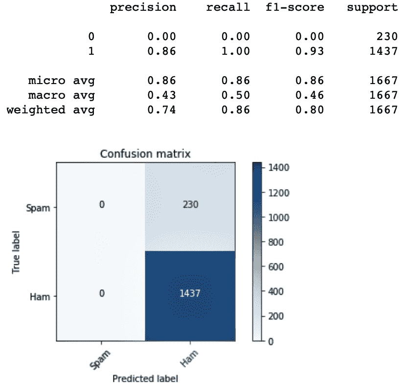

10.  使用网格搜索交叉验证将随机森林模型与计数数据相匹配，就像我们在 SVM 所做的那样:

```py
# Set the parameters for grid search
rf_params = {"criterion":["gini","entropy"],"min_samples_split":[2,3],"max_depth":[None,2,3],"min_samples_leaf":[1,5],"max_leaf_nodes":[None],"oob_score":[True]}

# Create an instance of the Random Forest Classifier()
rf = RandomForestClassifier()

# Use gridsearchCV(), pass the values you have set for grid search
rf_gcv = GridSearchCV(rf, rf_params, cv=5)

# Fit the model onto the train data
rf_gcv.fit(count_train, Y_train)

# We use the grid model to predict the class 
rf_train_predicted_values = rf_gcv.predict(count_train)
rf_test_predicted_values = rf_gcv.predict(count_test)

# We use the grid model to predict the class probabilities
rf_gcv_pred_train_proba = rf_gcv.predict_proba(count_train)
rf_gcv_pred_test_proba = rf_gcv.predict_proba(count_test)

print('The best parameters {}'.format(rf_gcv.best_params_))
print('The best score {}'.format(rf_gcv.best_score_))
```

使用网格参数对随机森林进行网格搜索会返回最佳参数和最佳得分，如下图所示:


11.  使用分类报告和混淆矩阵，看看随机森林模型的性能指标和我们测试数据中的计数数据:

```py
print(classification_report(Y_test, rf_test_predicted_values))

target_names = ['Spam','Ham']

# Pass actual & predicted values to the confusion matrix()
cm = confusion_matrix(Y_test, rf_test_predicted_values)
plt.figure()
plot_confusion_matrix(cm,classes=target_names)
plt.show() 
```

该报告如下面的屏幕截图所示:

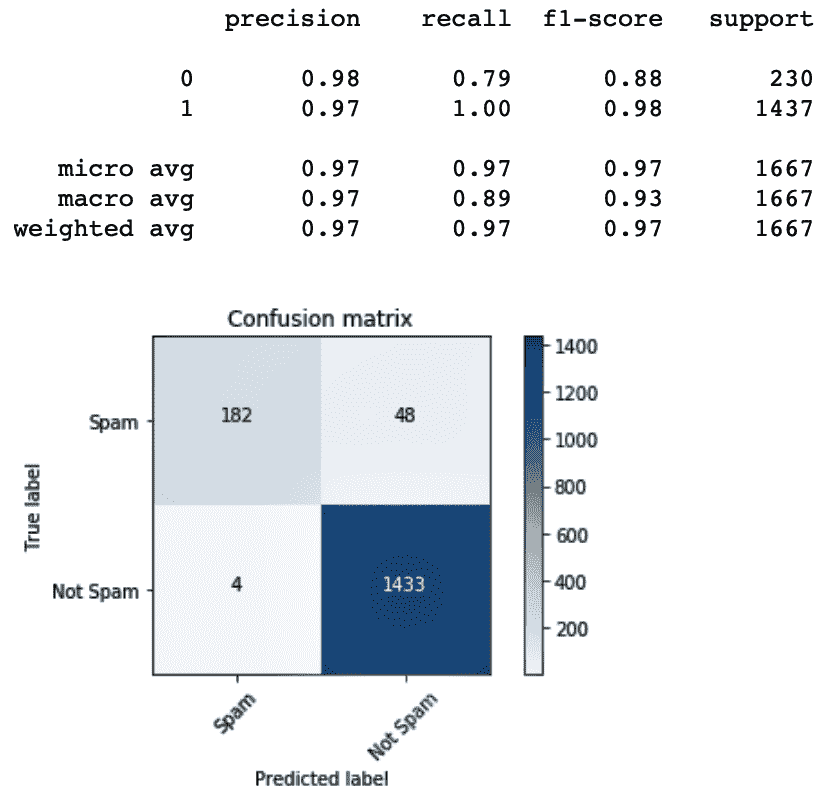

12.  通过对 TF-IDF 数据进行网格搜索，在随机森林上建立模型:

```py
# Set the parameters for grid search
rf_params = {"criterion":["gini","entropy"],"min_samples_split":[2,3],"max_depth":[None,2,3],"min_samples_leaf":[1,5],"max_leaf_nodes":[None],"oob_score":[True]}

# Create an instance of the Random Forest Classifier()
rf = RandomForestClassifier()

# Use gridsearchCV(), pass the values you have set for grid search
rf_gcv = GridSearchCV(rf, rf_params, cv=5)

rf_gcv.fit(tfidf_train, Y_train)

rf_tfidf_train_predicted_values = rf_gcv.predict(tfidf_train)
rf_tfidf_test_predicted_values = rf_gcv.predict(tfidf_test)

rf_gcv_tfidf_pred_train_proba = rf_gcv.predict_proba(tfidf_train)
rf_gcv_tfidf_pred_test_proba = rf_gcv.predict_proba(tfidf_test)

print('The best parameters {}'.format(rf_gcv.best_params_))
print('The best score {}'.format(rf_gcv.best_score_))

print(classification_report(Y_test, rf_tfidf_test_predicted_values))

target_names = ['Spam','Ham']
# Pass actual & predicted values to the confusion matrix()
cm = confusion_matrix(Y_test, rf_tfidf_test_predicted_values)
plt.figure()
plot_confusion_matrix(cm, classes=target_names)
plt.show()
```

13.  利用`predict_proba()`方法的输出来收集每个模型的预测概率，以绘制 ROC 曲线。代码包中提供了完整的代码。

下面是根据计数数据的朴素贝叶斯模型绘制 ROC 曲线的代码示例:

```py
fpr, tpr, thresholds = roc_curve(Y_test, nb_pred_test_proba[:,1])
roc_auc = auc(Y_test,nb_pred_test_proba[:,1])

plt.title('ROC Naive Bayes (Count)')
plt.plot(fpr, tpr, 'b',label='AUC = %0.3f'% roc_auc)
plt.legend(loc='lower right')
plt.plot([0,1],[0,1],'r--')
plt.xlim([-0.1,1.0])
plt.ylim([-0.1,1.01])
plt.ylabel('True Positive Rate')
plt.xlabel('False Positive Rate')
```

使用代码包中提供的完整代码，我们可以查看所有模型的 ROC 图，并对它们进行比较:

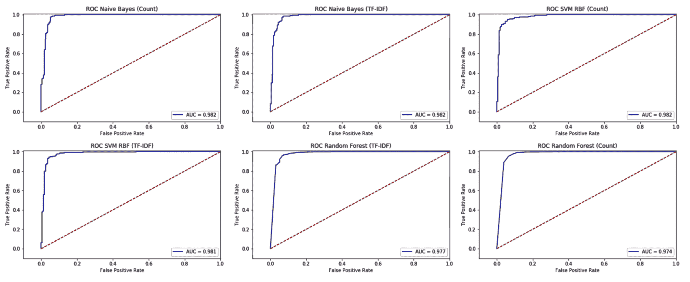

14.  平均所有模型的概率，并绘制 ROC 曲线:

```py
plt.subplot(4,3,7)

### Test Count Data
d = (nb_pred_test_proba + svc_gcv_test_proba_rbf + rf_gcv_pred_test_proba)/4

fpr, tpr, thresholds = roc_curve(Y_test,d[:,1])
roc_auc = auc(Y_test,d[:,1])

plt.title('ROC Ensemble (Count)')
plt.plot(fpr, tpr, 'b',label='AUC = %0.3f'% roc_auc)
plt.legend(loc='lower right')
plt.plot([0,1],[0,1],'r--')
plt.xlim([-0.1,1.0])
plt.ylim([-0.1,1.01])
plt.ylabel('True Positive Rate')
plt.xlabel('False Positive Rate')

plt.subplot(4,3,8)

### Test TF-IDF Data
d = (nb_tfidf_pred_test_proba + svc_gcv_tfidf_test_proba_rbf + rf_gcv_tfidf_pred_test_proba)/4

fpr, tpr, thresholds = roc_curve(Y_test,d[:,1])
roc_auc = auc(Y_test,d[:,1])

plt.title('ROC Ensemble (TF-IDF)')
plt.plot(fpr, tpr, 'b',label='AUC = %0.3f'% roc_auc)
plt.legend(loc='lower right')
plt.plot([0,1],[0,1],'r--')
plt.xlim([-0.1,1.0])
plt.ylim([-0.1,1.01])
plt.ylabel('True Positive Rate')
plt.xlabel('False Positive Rate')
#plt.show()

plt.tight_layout(pad=1,rect=(0, 0, 3.5, 4))
plt.show()
```

我们可以在下面的截图中看到 ROC 和 AUC 得分的平均结果:


15.  检查集合结果的准确性。创建预测结果的数组，如下所示:

```py
predicted_array = np.array([nb_pred_test_tfidf, svc_tfidf_rbd_test_predicted_values, rf_tfidf_test_predicted_values])

print("Each array is the prediction of the respective models")
print(predicted_array)
```

16.  计算各个观察值的预测值的模式，以执行最大投票，从而获得最终的预测结果:

```py
# Using mode on the array, we get the max vote for each observation
predicted_array = mode(predicted_array)

# Check the array
print(predicted_array)

print("The accuracy for test")
accuracy_score(Y_test, predicted_array[0][0])
```

17.  分别为根据计数数据和 TF-IDF 数据训练的模型绘制测试精度图:


# 它是如何工作的...

在*准备好*部分，我们导入了所有需要的库，并定义了绘制混淆矩阵的函数。我们使用 UTF8 编码读取数据集。我们检查了垃圾邮件和垃圾邮件在我们的数据集中的比例，并使用`CountVectorizer`和`TfidfVectorizer`模块将文本分别转换为向量和 TF-IDF 向量。

之后，我们使用各种算法建立了多个模型。我们还对计数数据和 TF-IDF 数据应用了每种算法。

模型需要按照以下顺序构建:

1.  计数数据的朴素贝叶斯
2.  TF-IDF 数据上的朴素贝叶斯
3.  基于计数数据的 RBF 核 SVM
4.  基于 TF-IDF 数据的 RBF 核 SVM
5.  随机森林计数数据
6.  TF-IDF 数据上的随机森林

朴素贝叶斯分类器广泛用于机器学习中的文本分类。朴素贝叶斯算法基于属于某个类的要素的条件概率。在*步骤 1* 中，我们使用朴素贝叶斯算法对计数数据构建了第一个模型。在*步骤 2* 中，我们使用`classification_report()`查看`precision`、`recall`、`f1-score`和`support`来检查性能指标。在*步骤 3* 中，我们调用`plot_confusion_matrix()`来绘制混淆矩阵。

然后，在*步骤 4* 中，我们在 TF-IDF 数据上建立朴素贝叶斯模型，并在*步骤 5* 中评估性能。在*步骤 6* 和*步骤 7* 中，我们使用支持向量机对计数数据训练我们的模型，使用`classification_report`的输出评估其性能，并绘制混淆矩阵。我们使用 RBF 核来训练我们的 SVM 模型。我们还展示了一个使用`GridSearchCV`寻找最佳参数的例子。在*步骤 8* 和*步骤 9* 中，我们重复了在*步骤* 6 和*步骤* 7 中所做的事情，但是这一次，我们对 SVM 进行了 TF-IDF 数据的训练。

在*步骤 10* 中，我们在计数数据上使用网格搜索训练了一个随机森林模型。我们为`criterion`超参数设置**基尼**和**熵**。我们还为参数设置了多个值，如`min_samples_split`、`max_depth`和`min_samples_leaf`。在*步骤 11* 中，我们评估了模型的性能。

然后，我们在*步骤 12* 中根据 TF-IDF 数据训练了另一个随机森林模型。使用`predic_proba()`函数，我们得到了测试数据的类概率。我们在*步骤 13* 中使用相同的方法绘制 ROC 曲线，并在图上标注每个模型的 AUC 分数。这有助于我们比较模型的性能。

在*步骤 14* 中，我们对概率进行了平均，这些概率是从计数和 TF-IDF 数据的模型中获得的。然后我们绘制总体结果的 ROC 曲线。从*步骤 15* 到*步骤 17* ，我们绘制了基于计数数据和 TF-IDF 数据的每个模型的测试精度。


# 基于集成模型的电影评论情感分析

情感分析是自然语言处理的另一个广泛研究的领域。这是对评论执行的一个流行任务，以确定评论者提供的评论的情绪。在这个例子中，我们将重点分析来自**互联网电影数据库** ( **IMDb** )的电影评论数据，并根据它是正面还是负面进行分类。

我们在`.txt`文件中有电影评论，它们被分成两个文件夹:负面的和正面的。正面评价 1000 个，负面评价 1000 个。这些文件可以从 GitHub 中检索到。

我们将此案例研究分为两个部分:

*   第一部分是准备数据集。我们将阅读以`.txt`格式提供的审查文件，附加它们，根据它们被放入的文件夹将它们标记为肯定或否定，并创建一个包含标签和文本的`.csv`文件。
*   在第二部分中，我们将在计数数据和 TF-IDF 数据上构建多个基础学习器。我们将评估基础学习者的表现，然后评估所有的预测。


# 做好准备

我们从导入所需的库开始:

```py
import os
import glob
import pandas as pd
```

我们将工作文件夹设置如下:

```py
os.chdir("/.../Chapter 11/CS - IMDB Classification")
os.getcwd()
```

我们设置 path 变量，并遍历文件夹中的`.txt`文件。

请注意，我们有一个子文件夹`/txt_sentoken/pos`，其中保存了正面评论的 TXT 文件。同样，我们有一个子文件夹，`/txt_sentoken/neg`，保存了负面评论的 TXT 文件。

读取正面评论的 TXT 文件，并将评论附加到数组中。我们使用数组创建一个数据帧，`df_pos`。

```py
path="/.../Chapter 11/CS - IMDB Classification/txt_sentoken/pos/*.txt"

files = glob.glob(path)
text_pos = []

for p in files:
 file_read = open(p, "r")
 to_append_pos = file_read.read()
 text_pos.append(to_append_pos)
 file_read.close()

df_pos = pd.DataFrame({'text':text_pos,'label':'positive'})
df_pos.head()
```

用`head()`方法，我们来看看正面的评论。

我们还遍历负面文件夹中的 TXT 文件来读取负面评论，并将它们附加到一个数组中。我们用数组创建一个数据帧，`df_neg`:

```py
path="/Users/Dippies/CODE PACKT - EML/Chapter 11/CS - IMDB Classification/txt_sentoken/neg/*.txt"

files = glob.glob(path)
text_neg = []

for n in files:
    file_read = open(n, "r")
    to_append_neg = file_read.read()
    text_neg.append(to_append_neg)
    file_read.close()

df_neg = pd.DataFrame({'text':text_neg,'label':'negative'})
df_neg.head()
```

最后，我们使用`concat()`方法将正负数据帧合并成一个数据帧:

```py
df_moviereviews=pd.concat([df_pos, df_neg])
```

我们可以用`head()`和`tail()`方法查看准备好的数据帧:

```py
print(df_moviereviews.head())
print(df_moviereviews.tail())
```

前面的代码给出了以下输出:

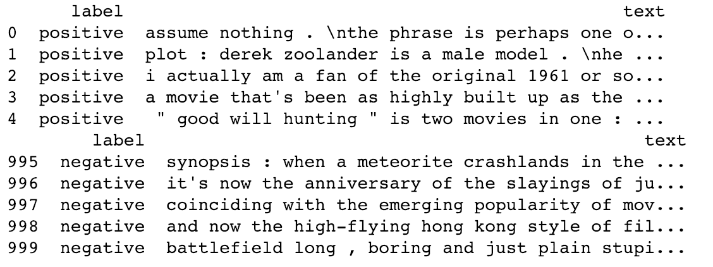

从上图中，我们注意到正面和负面的评论是按顺序添加的。数据帧的前半部分包含正面评价，后半部分包含负面评价。

让我们将数据打乱，使其不再按顺序排列:

```py
from sklearn.utils import shuffle

df_moviereviews=shuffle(df_moviereviews)
df_moviereviews.head(10)
```

我们现在可以看到数据帧中的数据被打乱了:

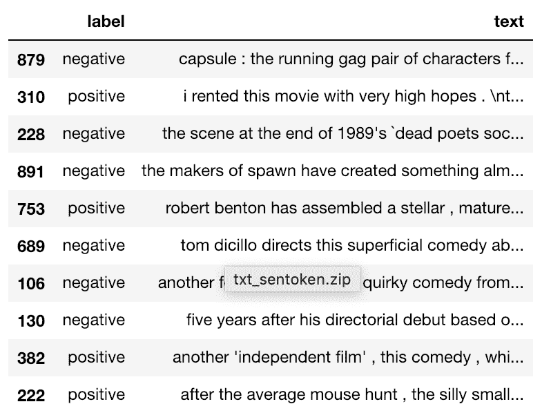

我们验证合并数据帧的维度，以查看它是否包含 2，000 个观察值，这将是合并 1，000 个负面和 1，000 个正面评论的结果:

```py
df_moviereviews.shape
```

从前面的代码中，我们注意到我们有 2，000 个观察值和 2 列。

我们也可以将生成的数据帧写入另一个`.csv`文件，以避免像前面步骤那样从 TXT 文件重新创建 CSV 文件:

```py
df_moviereviews.to_csv("/.../Chapter 11/CS - IMDB Classification/Data_IMDB.csv") 
```

接下来，我们将定义我们之前使用过的`plot_confusion_matrix()`方法。

我们现在可以看到数据中正面和负面评论的比例。在我们的例子中，比例正好是 50:50:

```py
df_moviereviews["label"].value_counts().plot(kind='pie')
plt.tight_layout(pad=1,rect=(0, 0, 0.7, 1))

plt.text(x=-0.9,y=0.1, \
         s=(np.round(((df_moviereviews["label"].\
                       value_counts()[0])/(df_moviereviews["label"].value_counts()[0] + \
                       df_moviereviews["label"].value_counts()[1])),2)))

plt.text(x=0.4,y=-0.3, \
         s=(np.round(((df_moviereviews["label"].\
                       value_counts()[1])/(df_moviereviews["label"].value_counts()[0] + \
                       df_moviereviews["label"].value_counts()[1])),2)))

plt.title("% Share of the Positive and Negative reviews in the dataset")
```

上述代码的输出可以在下面的屏幕截图中看到:

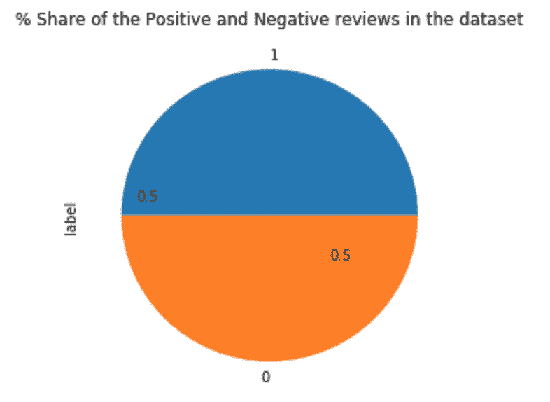

我们现在将“阳性”标签替换为“1”，将“阴性”标签替换为“0”:

```py
df_moviereviews.loc[df_moviereviews["label"]=='positive',"label",]=1
df_moviereviews.loc[df_moviereviews["label"]=='negative',"label",]=0
```

我们使用各种数据清理和准备机制来准备数据。我们将按照与上一个方法相同的顺序来预处理数据:

1.  将所有文本转换为小写
2.  删除标点符号
3.  删除停用词
4.  执行词干分析
5.  将数据符号化

接下来，我们将定义一个函数来执行前面的清理步骤:

```py
lemmatizer = WordNetLemmatizer()
def process_text(text):
    nopunc = [char for char in text if char not in string.punctuation]
    nopunc = ''.join(nopunc)

    clean_words = [word.lower() for word in nopunc.split() if word.lower() not in stopwords.words('english')]
    clean_words = [lemmatizer.lemmatize(lem) for lem in clean_words]
    clean_words = " ".join(clean_words)

    return clean_words
```

我们调用前面的函数来处理文本数据:

```py
df_moviereviews['text'] = df_moviereviews['text'].apply(process_text)
```

我们现在将构建我们的基础学习者并评估集合结果。


# 怎么做...

我们从导入我们需要的剩余库开始:

1.  导入所需的库:

```py
import os
import numpy as np
import pandas as pd
import itertools
import warnings
import string
import matplotlib.pyplot as plt
from nltk.corpus import stopwords
from nltk.stem import WordNetLemmatizer
from sklearn.feature_extraction.text import CountVectorizer
from sklearn.feature_extraction.text import TfidfVectorizer
from sklearn.model_selection import train_test_split
from sklearn.naive_bayes import MultinomialNB
from sklearn.metrics import confusion_matrix
from sklearn.model_selection import GridSearchCV
from sklearn.ensemble import RandomForestClassifier
from sklearn.metrics import classification_report
from sklearn.metrics import roc_auc_score as auc
from sklearn.metrics import roc_curve
from sklearn.metrics import accuracy_score
from scipy.stats import mode
```

2.  分离目标变量和预测变量:

```py
X = df_moviereviews.loc[:,'text']
Y = df_moviereviews.loc[:,'label']
Y = Y.astype('int')
```

3.  执行数据的列车测试分割:

```py
X_train,X_test,y_train,y_test = train_test_split(X, Y, test_size=.3, random_state=1)
```

4.  使用`CountVectorizer()`将文本转换成矢量:

```py
count_vectorizer = CountVectorizer()
count_train = count_vectorizer.fit_transform(X_train)
count_test = count_vectorizer.transform(X_test)
```

5.  使用`TfidfVectorizer()`将文本转换成 TF-IDF 向量:

```py
tfidf = TfidfVectorizer()
tfidf_train = tfidf.fit_transform(X_train)
tfidf_test = tfidf.transform(X_test)
```

我们通过在计数数据和 TF-IDF 数据上训练基础学习者来继续。我们用随机森林模型、朴素贝叶斯模型和支持向量分类器模型来训练基础学习器。

6.  对计数数据使用网格搜索来训练随机森林模型:

```py
# Set the parameters for grid search
rf_params = {"criterion":["gini","entropy"],\
             "min_samples_split":[2,3],\
             "max_depth":[None,2,3],\
             "min_samples_leaf":[1,5],\
             "max_leaf_nodes":[None],\
             "oob_score":[True]}

# Create an instance of the RandomForestClassifier()
rf = RandomForestClassifier()
warnings.filterwarnings("ignore")

# Use gridsearchCV(), pass the values you have set for grid search
rf_count = GridSearchCV(rf, rf_params, cv=5)

rf_count.fit(count_train, Y_train)

# Predict class predictions & class probabilities with test data
rf_count_predicted_values = rf_count.predict(count_test)
rf_count_probabilities = rf_count.predict_proba(count_test)

rf_count_train_accuracy = rf_count.score(count_train, Y_train)
rf_count_test_accuracy = rf_count.score(count_test, Y_test)

print('The accuracy for the training data is {}'.\
      format(rf_count_train_accuracy))

print('The accuracy for the testing data is {}'.\
      format(rf_count_test_accuracy))
```

7.  评估`precision`、`recall`、`f1-score`、`support`和`accuracy`:

```py
print(classification_report(Y_test, rf_count_predicted_values))

# Pass actual & predicted values to the confusion_matrix()
cm = confusion_matrix(Y_test, rf_count_predicted_values)
plt.figure()
plot_confusion_matrix(cm, classes=target_names,normalize=False)
plt.show()
```

在下面的屏幕截图中，我们可以看到前面代码的输出:


8.  使用网格搜索在 TF-IDF 数据上训练随机森林模型:

```py
# Set the parameters for grid search
rf_params = {"criterion":["gini","entropy"],"min_samples_split":[2,3],"max_depth":[None,2,3],"min_samples_leaf":[1,5],"max_leaf_nodes":[None],"oob_score":[True]}

# Create an instance of the RandomForestClassifier()
rf = RandomForestClassifier()
warnings.filterwarnings("ignore")

# Use gridsearchCV(), pass the values you have set for grid search
rf_tfidf = GridSearchCV(rf, rf_params, cv=5)

rf_tfidf.fit(tfidf_train, Y_train)
```

9.  评估模型的性能:

```py
rf_tfidf_predicted_values = rf_tfidf.predict(tfidf_test)
rf_tfidf_probabilities = rf_tfidf.predict_proba(tfidf_test)

rf_train_accuracy = rf_tfidf.score(tfidf_train, Y_train)
rf_test_accuracy = rf_tfidf.score(tfidf_test, Y_test)

print('The accuracy for the training data is {}'.format(rf_train_accuracy))
print('The accuracy for the testing data is {}'.format(rf_test_accuracy))

print(classification_report(Y_test, rf_tfidf_predicted_values))

# Pass actual & predicted values to the confusion_matrix()
cm = confusion_matrix(Y_test, rf_tfidf_predicted_values)
plt.figure()
plot_confusion_matrix(cm, classes=target_names,normalize=False)
plt.show()
```

10.  对计数数据训练朴素贝叶斯模型并检查测试数据的准确性:

```py
nb_count = MultinomialNB()
nb_count.fit(count_train, Y_train)

nb_count_predicted_values = nb_count.predict(count_test)
nb_count_probabilities = nb_count.predict_proba(count_test)

nb_train_accuracy = nb_count.score(count_train, Y_train)
nb_test_accuracy = nb_count.score(count_test, Y_test)

print('The accuracy for the training data is {}'.format(nb_train_accuracy))
print('The accuracy for the testing data is {}'.format(nb_test_accuracy))
```

11.  用`classification_report()`和混淆矩阵评估其他模型的性能参数:

```py
print(classification_report(Y_test, nb_predicted_values))

# Pass actual & predicted values to the confusion matrix()
cm = confusion_matrix(Y_test, nb_predicted_values)
plt.figure()
plot_confusion_matrix(cm, classes=target_names,normalize=False)
plt.show()
```

12.  根据 TF-IDF 数据训练朴素贝叶斯模型，并按照我们对早期模型所做的相同方式评估其性能:

```py
nb_tfidf = MultinomialNB()
nb_tfidf.fit(count_train, Y_train)

nb_tfidf_predicted_values = nb_tfidf.predict(tfidf_test)
nb_tfidf_probabilities = nb_tfidf.predict_proba(tfidf_test)

nb_train_accuracy = nb_tfidf.score(tfidf_train, Y_train)
nb_test_accuracy = nb_tfidf.score(tfidf_test, Y_test)

print('The accuracy for the training data is {}'.format(nb_train_accuracy))
print('The accuracy for the testing data is {}'.format(nb_test_accuracy))

print(classification_report(Y_test, nb_predicted_values))

#Pass actual & predicted values to the confusion matrix()
cm = confusion_matrix(Y_test, nb_predicted_values)
plt.figure()
plot_confusion_matrix(cm, classes=target_names,normalize=False)
plt.show()
```

13.  用支持向量分类器算法对计数数据训练具有线性核的模型。我们还对 SVC 的参数`C`进行网格搜索:

```py
svc_count = SVC(kernel='linear',probability=True)
svc_params = {'C':[0.001, 0.01, 0.1, 1, 10]}

svc_gcv_count = GridSearchCV(svc_count, svc_params, cv=5)
svc_gcv_count.fit(count_train, Y_train)

svc_count_predicted_values = svc_gcv_count.predict(count_test)
svc_count_probabilities = svc_gcv_count.predict_proba(count_test)

svc_count_train_accuracy = svc_gcv_count.score(count_train, Y_train)
svc_count_test_accuracy = svc_gcv_count.score(count_test, Y_test)

print('The accuracy for the training data is {}'.format(svc_gcv_count.score(count_train, Y_train)))
print('The accuracy for the testing data is {}'.format(svc_gcv_count.score(count_test, Y_test)))

print(classification_report(Y_test, svc_count_predicted_values))
# Pass actual & predicted values to the confusion_matrix()
cm = confusion_matrix(Y_test, svc_count_predicted_values)
plt.figure()
plot_confusion_matrix(cm, classes=target_names,normalize=False)
plt.show()
```

14.  在 TF-IDF 数据上用具有线性核的支持向量分类器算法训练模型。我们还对 SVC 的`C`参数进行网格搜索:

```py
svc_tfidf = SVC(kernel='linear',probability=True)
svc_params = {'C':[0.001, 0.01, 0.1, 1, 10]}

svc_gcv_tfidf = GridSearchCV(svc_tfidf, svc_params, cv=5)
svc_gcv_tfidf.fit(tfidf_train, Y_train)

svc_tfidf_predicted_values = svc_gcv_tfidf.predict(tfidf_test)
svc_tfidf_probabilities = svc_gcv_tfidf.predict_proba(tfidf_test)

svc_tfidf_train_accuracy = svc_gcv_count.score(tfidf_train, Y_train)
svc_tfidf_test_accuracy = svc_gcv_count.score(tfidf_test, Y_test)

print('The accuracy for the training data is {}'.format(svc_gcv_tfidf.score(count_train, Y_train)))
print('The accuracy for the testing data is {}'.format(svc_gcv_tfidf.score(count_test, Y_test)))

print(classification_report(Y_test, svc_tfidf_predicted_values))
# Pass actual & predicted values to the confusion_matrix()
cm = confusion_matrix(Y_test, svc_tfidf_predicted_values)
plt.figure()
plot_confusion_matrix(cm, classes=target_names)
plt.show()
```

15.  绘制每个模型的 ROC 曲线。这里显示了其中一个图的代码(本书的代码包中提供了完整的代码):

```py
fpr, tpr, thresholds = roc_curve(Y_test, rf_count_probabilities[:,1])
roc_auc = auc(Y_test, rf_count_probabilities[:,1])

plt.title('ROC Random Forest Count Data')
plt.plot(fpr, tpr, 'b',label='AUC = %0.3f'% roc_auc)
plt.legend(loc='lower right')
plt.plot([0,1],[0,1],'r--')
plt.xlim([-0.1,1.0])
plt.ylim([-0.1,1.01])
plt.ylabel('True Positive Rate')
plt.xlabel('False Positive Rate')
```

在下面的屏幕截图中，我们可以比较我们训练的所有模型的 ROC 曲线:

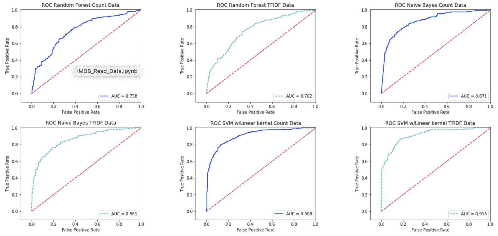

16.  绘制计数和 TF-IDF 数据总体结果的 ROC 曲线:


17.  使用最大投票计算集合的精确度:

```py
predicted_values_count = np.array([rf_count_predicted_values, \
                                   nb_count_predicted_values, \
                                   svc_count_predicted_values])

predicted_values_tfidf = np.array([rf_tfidf_predicted_values, \
                                   nb_tfidf_predicted_values, \
                                   svc_tfidf_predicted_values])

predicted_values_count = mode(predicted_values_count)
predicted_values_tfidf = mode(predicted_values_tfidf)
```

18.  绘制根据计数数据和 TF-IDF 数据训练的每个模型的测试精度图:

```py
count = np.array([rf_count_test_accuracy,\
                  nb_count_test_accuracy,\
                  svc_count_test_accuracy,\
                  accuracy_score(Y_test, predicted_values_count[0][0])])

tfidf = np.array([rf_tfidf_test_accuracy,\
                  nb_tfidf_test_accuracy,\
                  svc_tfidf_test_accuracy,\
                  accuracy_score(Y_test, predicted_values_tfidf[0][0])])

label_list = ["Random Forest", "Naive_Bayes", "SVM_Linear", "Ensemble"] 
plt.plot(count)
plt.plot(tfidf)
plt.xticks([0,1,2,3],label_list)

for i in range(4):
    plt.text(x=i,y=(count[i]+0.001), s=np.round(count[i],4))

for i in range(4):
    plt.text(x=i,y=tfidf[i]-0.003, s=np.round(tfidf[i],4))

plt.legend(["Count","TFIDF"])
plt.title("Test accuracy")

plt.tight_layout(pad=1,rect=(0, 0, 2.5, 2))
plt.show()
```

下图显示了所有模型的计数数据和 TF-IDF 数据之间的准确性比较以及集合结果:

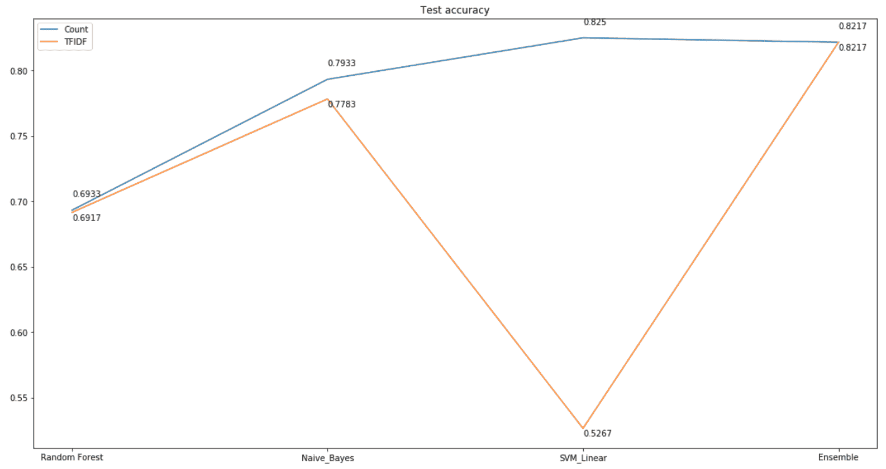


# 它是如何工作的...

我们从导入所需的库开始。在本章中，我们使用了一个叫做`glob`的模块。`glob`模块用于定义将指定模式与路径、目录和文件名匹配的技术。我们使用 glob 模块来查找指定路径中的所有文件。之后，我们使用`open()`方法以读取模式打开每个文件。我们读取每个文件，并将其附加到包含所有评论的数据集上。我们还创建了一个标签列，用正面或负面标签标记每个评论。

然而，在我们附加了所有正面和负面评价后，我们注意到它们是按顺序添加的，这意味着前半部分包含所有正面评价，后半部分包含负面评价。我们使用`shuffle()`方法打乱了数据。

我们通过将数据转换为小写、删除标点符号和停用词、执行词干分析和对文本进行标记来创建特征向量，从而清理了数据。

*怎么做...在*部分，我们从在*步骤 1* 中导入库开始。在*步骤 2* 中，我们将目标和特征变量分成 *X* 和 *Y* 。

在步骤 3 中，我们将数据分成训练和测试子集。我们使用`test_size=.3`将数据分成训练和测试子集。

在 S *第 4 步*和 S *第 5 步*中，我们分别使用`CountVectorizer()`和`TfidfVectorizer()`将文本转换为向量，将文本转换为 TF-IDF 向量。注意，使用`CountVectorizer()`，我们生成了`count_train`和`count_test`数据集。使用`TfidfVectorizer()`，我们生成了`tfidf_train`和`tfidf_test`数据集。

在*步骤 6* 中，我们设置网格搜索的超参数来训练随机森林模型。我们根据计数数据训练随机森林模型，并检查训练和测试的准确性。

我们对我们建立的所有模型的测试数据使用了`predict()`和`predict_proba()`方法来预测类别以及类别概率。

在*步骤 7* 中，我们生成了混淆矩阵来评估我们在上一步中构建的随机森林模型的性能。在*步骤 8* 和*步骤 9* 中，我们对 TF-IDF 数据上的另一个随机森林模型重复了训练，并评估了性能。我们在从*步骤 10* 到*步骤 12* 的计数数据和 TF-IDF 数据上训练朴素贝叶斯模型。

在*步骤 13* 和*步骤 14* 中，我们分别在计数数据和 TF-IDF 数据上训练具有线性核的支持向量分类器算法。在*步骤 15* 中，我们绘制了我们构建的每个基础学习者的 ROC 曲线和 AUC 分数。我们还在*步骤 16* 中绘制了集合的 RUC 曲线，以比较基础学习者的表现。最后，在*步骤 17* 中，我们绘制了每个模型对 count 和 TF-IDF 数据的测试精度。


# 还有更多...

在当今世界，文本信息的可用性和流动性是无限的。这意味着我们需要各种技术来处理这些文本问题，以提取有意义的信息。例如，**词性标注**是 NLP 空间中的基本任务之一。**词性标注**用于标注文本中单词各自的词性。然后，这些标签可以用于更复杂的任务，例如语法和语义解析、**机器翻译** ( **MT** )和问题回答。

有八个主要的词类:

*   名词
*   代词
*   形容词
*   动词
*   副词
*   介词
*   连词
*   感叹词:


NLTK 库具有获取 POS 标记的函数，这些标记可以在标记化之后应用于文本。让我们导入所需的库:

```py
import os
import pandas as pd
import nltk
from nltk.tag import pos_tag
from nltk.corpus import stopwords
```

我们采用之前创建的数据帧`df_moviereviews`。我们将文本转换成小写:

```py
df_moviereviews['text'] =df_moviereviews['text'].apply(lambda x: " ".join(x.lower() for x in x.split()))
df_moviereviews['text'].head()
```

我们通过删除停用词、标点符号、词条化和标记化对文本进行预处理:

```py
from nltk.stem.wordnet import WordNetLemmatizer
import string
stop = set(stopwords.words('english'))
exclude = set(string.punctuation) 
lemma = WordNetLemmatizer()
def clean(doc):
    stop_free = " ".join([i for i in doc.lower().split() if i not in stop])
    stop_free = ''.join(ch for ch in stop_free if ch not in exclude)
    normalized = " ".join(lemma.lemmatize(word) for word in stop_free.split())
    return normalized

tokenized_sent = [clean(doc).split() for doc in df_moviereviews["text"]]
```

我们来看看第一篇电影评论中的前 10 个标志:

```py
tokenized_sent[0][0:10]
```

这将生成以下输出:

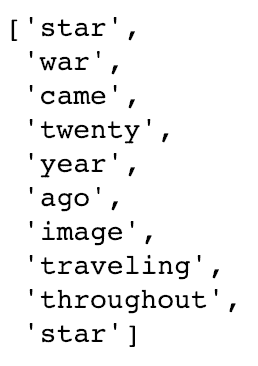

我们执行位置标记:

```py
postag=[nltk.pos_tag(token) for token in tokenized_sent]
```

我们打印第一篇电影评论的前 10 个位置标签:

```py
postag[0][0:10]
```

我们看到了词性标注词:

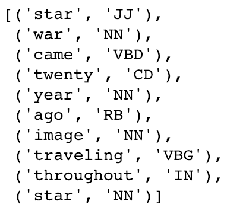

**组块**是另一个可以给词性标注增加更多结构的过程。分块用于实体检测；它标记多个令牌，将它们识别为有意义的实体。有各种可用的分块器；`NLTK`提供`ne_chunk`，识别人物(姓名)、地点、组织。其他常用的切块还有`OpenNLP`、`Yamcha`和`Lingpipe`。还可以使用分块器的组合并对结果应用最大投票来提高分类的性能。