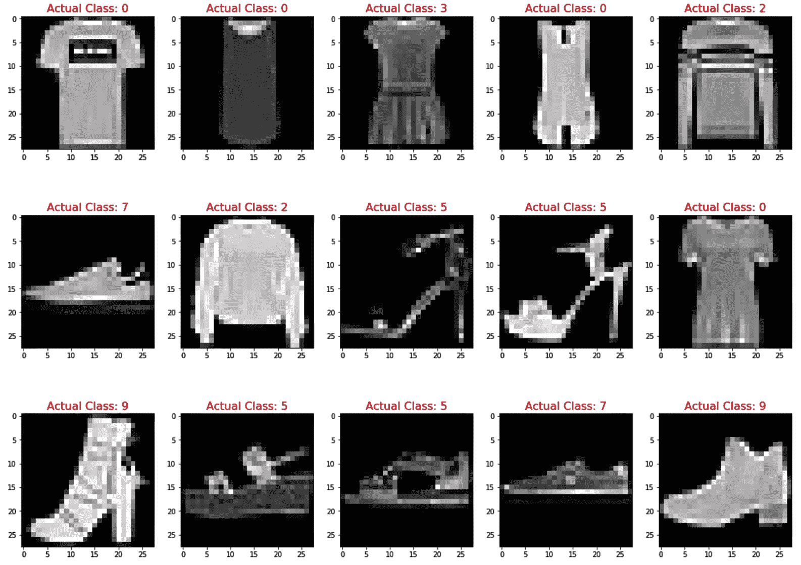
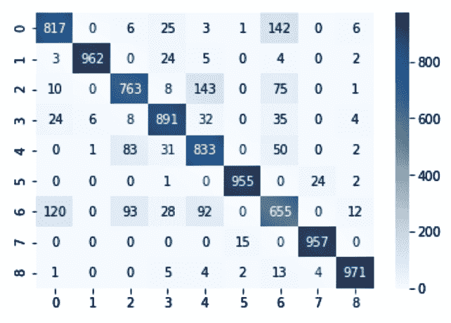
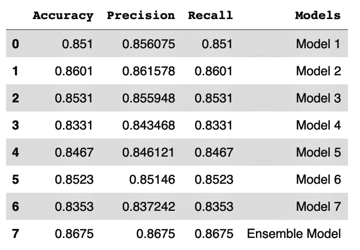

<title>Homogenous Ensemble for Multiclass Classification Using Keras</title>  

# 基于 Keras 的多类分类同质集成

在这一章中，我们将介绍以下食谱:

*   同类模型的集合来对时尚产品进行分类

<title>Introduction</title>  

# 介绍

在分类问题上已经进行了许多研究，以找出如何获得更好的分类精度。当要对大量的类进行预测时，这个问题会变得更加复杂。在多类分类的情况下，假设目标变量中的每个类都是相互独立的。多类分类技术包括训练一个或多个模型来对可以取两个以上类的目标变量进行分类。

<title>An ensemble of homogeneous models to classify fashion products</title>  

# 同类模型的集合来对时尚产品进行分类

在这个例子中，我们将使用时尚 MNIST 数据集。该数据集包含 10 个类别的 60，000 张时尚产品图片。目标变量可分为十类:

*   t 恤/上衣
*   裤子
*   套衫
*   连衣裙
*   外套
*   凉鞋
*   衬衫
*   运动鞋
*   包
*   踝靴

每个图像都是 28 x 28 灰度图像。我们将继续读取数据，通过几次迭代建立几个同质模型，看看集成是否能提供更高的精度。

<title>Getting ready</title>  

# 做好准备

我们将使用 Google Colab 来训练我们的模型。Google Colab 自带 TensorFlow 安装，我们不用在系统中单独安装。

我们导入所需的库，如下所示:

```
import numpy as np
import pandas as pd
import seaborn as sns
import matplotlib.pyplot as plt

import tensorflow as tf
from tensorflow import keras
from sklearn.utils import resample
from sklearn.metrics import accuracy_score
from sklearn.metrics import confusion_matrix
from sklearn.metrics import classification_report
from scipy import stats
```

我们从`tf.keras`提供的数据集中加载数据:

```
# Load the fashion-mnist pre-shuffled train data and test data
(x_train, y_train), (x_test, y_test) = tf.keras.datasets.fashion_mnist.load_data()
```

我们检查训练和测试子集的维度:

```
# Print training set shape 
print("x_train shape:", x_train.shape, "y_train shape:", y_train.shape)
```

这为我们提供了以下输出:


我们注意到目标变量中的唯一值:

```
np.unique(y_train)
```

我们可以看到，从 0 到 9 有 10 个类别:


我们可以快速浏览一下最初的一些观察结果，如下所示:

```
fig=plt.figure(figsize=(16,8))

# number of columns for images in plot
columns=5 

# number of rows for images in plot
rows=3

for i in range (1,columns*rows+1):
      fig.add_subplot(rows,columns,i)
      plt.title("Actual Class: {}".\
              format((y_train[i])),color='r',fontsize=16)
      plt.imshow(x_train[i])
plt.show()
```

使用前面的代码，我们绘制了前 15 幅图像，以及相关联的标签:



<title>How to do it...</title>  

# 怎么做...

我们现在将继续训练我们的模型:

1.  在下面的代码块中，我们将使用`tf.keras`通过几次迭代创建多个同质模型:

```
accuracy = pd.DataFrame( columns=["Accuracy","Precision","Recall"])
predictions = np.zeros(shape=(10000,7))
row_index = 0
for i in range(7):
        # bootstrap sampling 
        boot_train = resample(x_train,y_train,replace=True, n_samples=40000, random_state=None)
        model = tf.keras.Sequential([
            tf.keras.layers.Flatten(input_shape=(28, 28)),
            tf.keras.layers.Dense(256, activation=tf.nn.relu),
            tf.keras.layers.Dense(128, activation=tf.nn.relu),
            tf.keras.layers.Dense(128, activation=tf.nn.relu),
            tf.keras.layers.Dense(128, activation=tf.nn.relu),
            tf.keras.layers.Dense(128, activation=tf.nn.relu),
            tf.keras.layers.Dense(128, activation=tf.nn.relu),
            tf.keras.layers.Dense(128, activation=tf.nn.relu),
            tf.keras.layers.Dense(128, activation=tf.nn.relu),
            tf.keras.layers.Dense(128, activation=tf.nn.relu),
            tf.keras.layers.Dense(128, activation=tf.nn.relu),
            tf.keras.layers.Dense(10, activation=tf.nn.softmax)])

        # compile the model
        model.compile(loss='sparse_categorical_crossentropy', optimizer='adam', metrics=['accuracy'])

        # Train the model
        model.fit(x_train,y_train,epochs=10,batch_size=64)

        # Evaluate accuracy
        score = model.evaluate(x_test, y_test, batch_size=64)
        accuracy.loc[row_index,"Accuracy"]=score[1]

        # Make predictions
        model_pred= model.predict(x_test)
        pred_classes =model_pred.argmax(axis=-1)
        accuracy.loc[row_index, 'Precision'] = precision_score(y_test, pred_classes, average='weighted')
        accuracy.loc[row_index, 'Recall'] = recall_score(y_test, pred_classes,average='weighted')

        # Save predictions to predictions array
        predictions[:,i] = pred_classes

        print(score)
        row_index+=1

        print("Iteration " + str(i+1)+ " Accuracy : " + "{0}".format(score[1]))
```

我们提到了 7 次迭代和每次迭代中的 10 个时期。在下面的截图中，我们可以看到模型训练的进度:


2.  使用*步骤 1* 中的代码，我们对测试数据的每次迭代的准确度、精确度和召回率进行比较:

```
accuracy
```

在下面的屏幕截图中，我们可以看到前面的三个指标在每次迭代中是如何变化的:


3.  我们将形成一个数据框架，其中包含每次迭代中所有模型返回的预测:

```
# Create dataframe using prediction of each iteration
df_iteration = pd.DataFrame([predictions[:,0],\
                           predictions[:,1],\
                           predictions[:,2],\
                           predictions[:,3],\
                           predictions[:,4],\
                           predictions[:,5],\
                           predictions[:,6]])
```

4.  我们将类型转换为整数:

```
df_iteration = df_iteration.astype('int64')
```

5.  我们执行最大投票来识别每个观察的最预测的类。我们简单地使用`mode`来找出哪个类在一次观察中被预测的次数最多:

```
# find the mode for result
mode = stats.mode(df_iteration)
```

6.  我们计算测试数据的准确性:

```
# calculate the accuracy for test dataset
print(accuracy_score( y_test, mode[0].T))
```

7.  我们用所需的标签生成混淆矩阵:

```
# confusion matrix
cm = confusion_matrix(y_test, mode[0].T, labels=[0, 1, 2, 3, 4, 5, 6, 7, 8])
```

8.  我们绘制混淆矩阵:

```
ax= plt.subplot()

# annot=True to annotate cells
sns.heatmap(cm, annot=True, ax = ax, fmt='g', cmap='Blues')
```

混淆矩阵图如下所示:



9.  我们创建一个包含所有迭代编号的数据帧:

```
accuracy["Models"]=["Model 1",\
                   "Model 2",\
                   "Model 3",\
                   "Model 4",\
                   "Model 5",\
                   "Model 6",\
                   "Model 7"]
```

10.  然后，我们将准确度、精确度和召回率结合在一个表格中:

```
accuracy=accuracy.append(pd.DataFrame([[\
                                        accuracy_score(y_test,\
                                        mode[0].T),0,0,\
                                        "Ensemble Model"]], \
                                        columns=["Accuracy",\
                                        "Precision","Recall",\
                                        "Models"]))

accuracy.index=range(accuracy.shape[0])

accuracy.set_value(7, 'Precision', precision_score(y_test, mode[0].T, average='micro'))
accuracy.set_value(7, 'Recall', recall_score(y_test, mode[0].T, average='micro'))
```

在下面的屏幕截图中，我们可以看到保存每个模型和集合模型的指标的结构:



11.  我们绘制了每次迭代返回的精确度和最大投票的精确度:

```
plt.figure(figsize=(20,8))
plt.plot(accuracy.Models,accuracy.Accuracy)
plt.title("Accuracy across all Iterations and Ensemble")
plt.ylabel("Accuracy")
plt.show()
```

这给了我们以下情节。我们注意到，与单个模型相比，最大投票法返回的精确度最高:


12.  我们还绘制了每个模型和集合的精度和召回率:

```
plt.figure(figsize=(20,8))
plt.plot(accuracy.Models,accuracy.Accuracy,accuracy.Models,accuracy.Precision)
plt.title("Metrics across all Iterations and models")
plt.legend(["Accuracy","Precision"])
plt.show()
```

如下图所示:


从前面的截图中，我们注意到集成模型的精度和召回率都有所提高。

<title>How it works...</title>  

# 它是如何工作的...

在*准备好*部分，我们导入了我们需要的库。注意，我们已经导入了`TensorFlow`库。我们可以通过导入`tf.keras.datasets`模块直接访问数据集。该模块带有各种内置数据集，包括:

*   `boston_housing`:波斯顿房价回归数据集
*   `cifar10` : CIFAR10 小图像分类数据集
*   `fashion_mnist`:时尚-MNIST 数据集
*   `imdb` : IMDB 情感分类数据集
*   `mnist` : MNIST 手写数字数据集
*   `reuters`:路透社主题分类数据集

我们使用了本模块中的`fashion_mnist`数据集。我们加载了预混洗的训练和测试数据，并检查了训练和测试子集的形状。

我们注意到，在 G *设置* *就绪*部分，训练子集的形状是(60000，28，28)，这意味着我们有 60000 幅大小为 28 X 28 像素的图像。

我们用`unique()`方法检查了目标变量的不同水平。我们看到从 0 到 9 一共 10 节课。

我们还快速浏览了一些图片。我们定义了所需的列数和行数。运行一次迭代，我们用灰度绘制了带有`matplotlib.pyplot.imshow()`的图像。我们还使用`matplotlib.pyplot.title()`打印了每个图像的实际类别标签。

在*怎么做...*部分，在*步骤 1* 中，我们使用`tf.keras`模块创建了多个同质模型。在每次迭代中，我们使用`resample()`方法来创建引导样本。我们将`replace=True`传递给`resample()`方法，以确保我们有替换的样本。

在这一步中，我们还定义了模型架构。我们使用`tf.keras.layers`给模型添加了层。在每一层中，我们定义了单元的数量。

“模型架构”是指整个神经网络结构，包括称为层的单元组。这些层以链状结构排列。每一层都是前一层的功能。确定模型结构是神经网络的关键。

在我们的例子中，我们经历了几次迭代。我们设置迭代的次数。在每次迭代中，我们编译模型并使其适合我们的训练数据。我们对测试数据进行了预测，并在数据框架中获得了以下指标:

*   准确(性)
*   精确
*   回忆

我们使用`Rectified Linear Units (RELU)`作为隐藏层的激活函数。ReLU 由`f(x) = max{0, x}`表示。在神经网络中，ReLU 被推荐为默认的激活函数。

注意，在模型架构的最后一层，我们使用 softmax 作为激活函数。softmax 函数可视为 sigmoid 函数的推广。sigmoid 函数用于表示二分变量的概率分布，而 softmax 函数用于表示具有两个以上类别的目标变量的概率分布。当 softmax 函数用于多类分类时，它会为每个类返回一个介于 0 和 1 之间的概率值。所有概率之和将等于 1。

在*步骤 2* 中，我们检查了在*步骤 1* 中创建的精度数据帧的结构。我们注意到我们有三列，分别是准确度、精确度和召回率，并且每个迭代的度量都被捕获。在*步骤 3* 中，我们将数据帧中的数据类型转换为整数。

在*步骤 4* 中，我们使用`stats.mode()`对每个观察值进行了最大投票。因为我们运行了七次迭代，所以我们对每次观察都有七个预测。`stats.mode()`返回出现次数最多的预测。

在*步骤 5* 中，我们用最大投票预测检查了模型的准确性。在*步骤 6* 和*步骤 7* 中，我们生成了混淆矩阵来可视化正确的预测。图中的对角线元素是正确的预测，而非对角线元素是错误的分类。我们看到，与错误分类相比，正确分类的数量更多。

在*步骤 8* 和*步骤 9* 中，我们继续创建一个结构来保存性能指标(准确度、精确度和召回率)，以及每个迭代和集合的标签。我们使用这种结构来绘制性能指标的图表。

在*步骤 10* 中，我们绘制了每次迭代的精确度和最大投票预测。类似地，在*步骤 11* 中，我们绘制了每次迭代的精确度和召回率以及最大投票预测。

从我们在*步骤 10* 和*步骤 11* 中生成的图中，我们注意到了最大投票预测的准确度、精确度和召回率是如何提高的。

请参见

<title>See also</title>  

# `tf.keras`模块为我们提供了 TensorFlow 特有的功能，比如快速执行、数据管道和估算器。你可以看看`tf.keras`模块为我们提供的各种选项。

在我们的例子中，我们使用了由`tf.keras.optimizer`模块提供的内置优化器类。我们在示例中使用了 **Adam** **优化器**，但是也可以使用其他优化器，比如 Adadelta、Adagrad、Adamax、RMSprop 或 SGD。

In our example, we used the built-in optimizer classes provided by the `tf.keras.optimizer` module. We used the **Adam** **optimizer** in our example, but there are other optimizers you can use, such as Adadelta, Adagrad, Adamax, RMSprop, or SGD.

在今天，亚当优化器是最好的优化器之一。它是**随机梯度下降** ( **SGD** )的扩展。SGD 考虑所有权重更新的单一学习率，并且学习率在模型训练过程中保持不变。Adam 算法考虑自适应学习率方法来计算每个参数的个体学习率。

`tf.keras.losses`模块为我们提供了各种选项，以便我们选择损失函数。我们用了`sparse_categorical_crossentropy`。根据您的任务，您可能会选择其他选项，比如`binary_crossentropy`、`categorical_crossentropy`、`mean_squared_error`等等。

在多类分类的情况下，如果目标变量是 one-hot 编码的，使用`categorical_crossentropy`。如果目标变量中的类用整数表示，使用`sparse_categorical_crossentropy`。

您可以在[https://www.tensorflow.org/api_docs/python/tf/keras](https://www.tensorflow.org/api_docs/python/tf/keras)获得与`tf.keras`一起使用的其他超参数的更多详细信息。

You can get more detailed information about the other hyperparameters that can be used with `tf.keras` at [https://www.tensorflow.org/api_docs/python/tf/keras](https://www.tensorflow.org/api_docs/python/tf/keras).