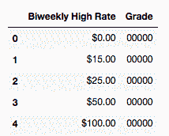
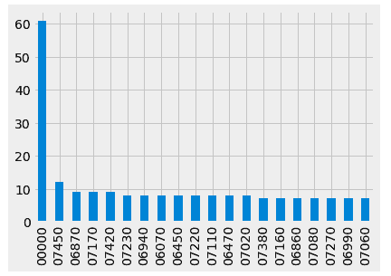
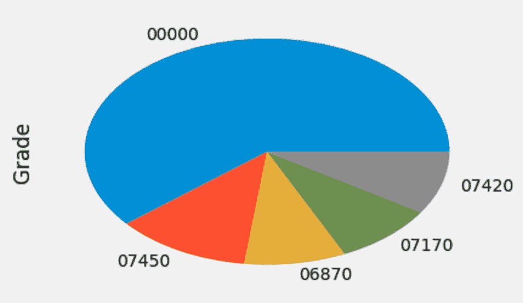
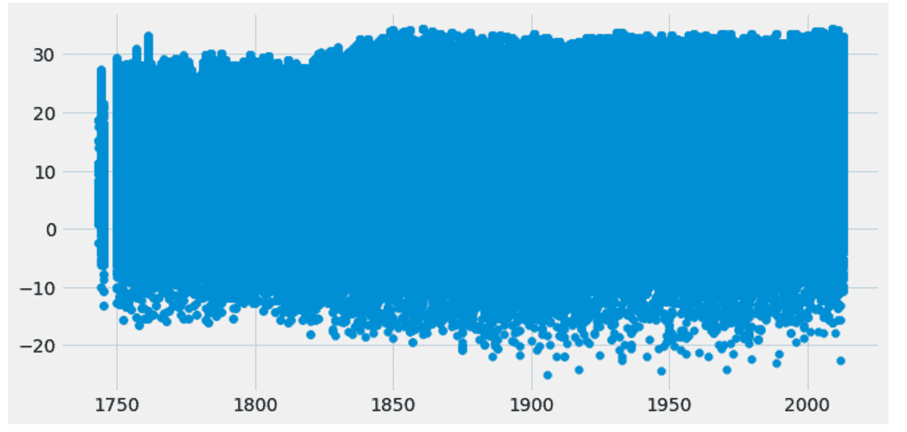
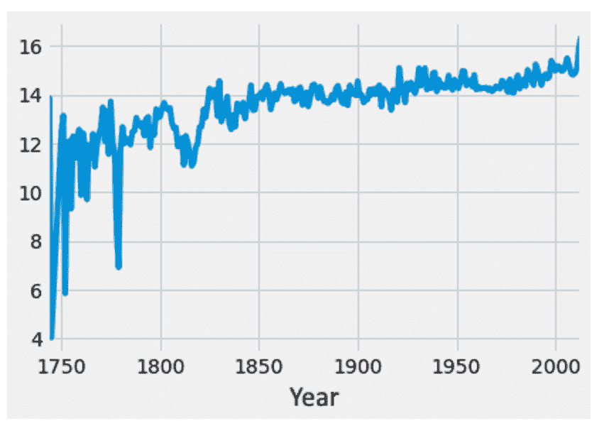
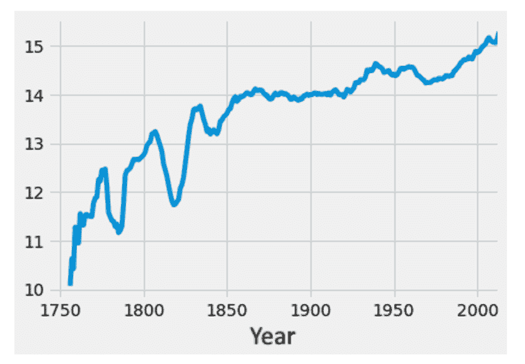
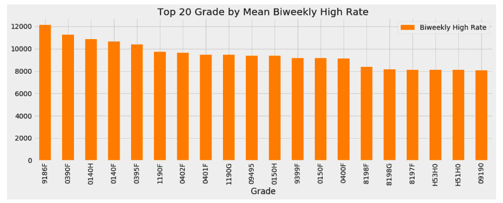
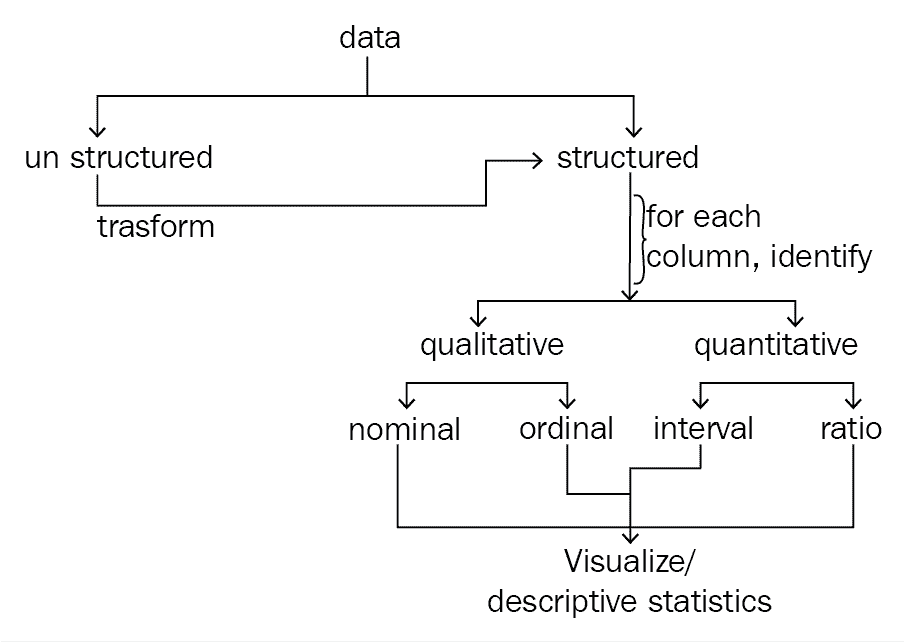

# 特征理解——我的数据集中有什么'?

终于！我们可以开始进入一些真实的数据，一些真实的代码，和一些真实的结果。具体来说，我们将深入探讨以下观点:

*   结构化与非结构化数据
*   定量与定性数据
*   数据的四个层次
*   探索性数据分析和数据可视化
*   描述统计学

这些主题中的每一个都将让我们更好地了解提供给我们的数据、数据集中存在的内容、数据集中不存在的内容，以及如何从这些内容开始的一些基本概念。

如果你熟悉数据科学的*原理*，这很大程度上呼应了那本书的*第 2 章，数据类型*。也就是说，在这一章中，我们将更少地从整体的角度，而更多地从机器学习的角度来看待我们的数据。


# 数据的结构或缺乏数据

当给定一个新数据集时，首先重要的是识别您的数据是结构化的还是非结构化的 *:*

*   **结构化(组织化)数据**:可以分解为观察和特征的数据。它们通常使用表格方法组织(其中行是观察值，列是特征)。

*   **非结构化(无组织)数据**:以自由流动的实体形式存在的数据，不遵循标准的组织层次结构，如 tabularity。通常，非结构化数据对我们来说是一个数据块，或者是一个特征(列)。

突出结构化数据和非结构化数据之间差异的几个示例如下:

*   以原始自由文本形式存在的数据，包括服务器日志和 tweets，是非结构化的

*   科学仪器在精确运动中报告的气象数据被认为是高度结构化的，因为它们存在于表格的行/列结构中


# 非结构化数据的一个例子—服务器日志

作为非结构化数据的一个例子，我们从公共资源中提取了一些示例服务器日志，并将它们包含在一个文本文档中。我们可以看一下这种非结构化数据的样子，以便在未来识别它:

```
# Import our data manipulation tool, Pandas
import pandas as pd
# Create a pandas DataFrame from some unstructured Server Logs
logs = pd.read_table('../data/server_logs.txt', header=None, names=['Info'])

# header=None, specifies that the first line of data is the first data point, not a column name
# names=['Info] is me setting the column name in our DataFrame for easier access
```

我们在 pandas 中创建了一个名为`logs`的数据帧来保存我们的服务器日志。为了看一看，让我们调用`.head()`方法来查看前几行:

```
# Look at the first 5 rows
logs.head()

```

这将向我们显示日志数据帧中前 5 行的表格，如下所示:

| **信息** |  |
| 0 | 64.242.88.10--[2004 年 3 月 7 日:16:05:49 -0800]... |
| 一 | 64.242.88.10--[2004 年 3 月 7 日:16:06:51 -0800]... |
| 2 | 64.242.88.10--[2004 年 3 月 7 日:16:10:02 -0800]... |
| 3 | 64.242.88.10--[2004 年 3 月 7 日:16:11:58 -0800]... |
| 四 | 64.242.88.10--[2004 年 3 月 7 日 16 时 20 分 55 秒 0800 秒]... |

我们可以在日志中看到，每行代表一个日志，只有一列，即日志本身的文本。不完全是一个特征或任何东西，只是原始日志是直接从服务器上获取的。这是非结构化数据的一个很好的例子。大多数情况下，文本形式的数据通常是非结构化的。

认识到大多数非结构化数据可以通过一些操作转换成结构化数据是很重要的，但这是我们将在下一章处理的事情。

我们将在书中使用的大部分数据都是结构化的。那就意味着会有行列感。鉴于此，我们可以开始查看表格数据单元格中的值的类型。


# 定量与定性数据

为了完成我们对各种类型数据的诊断，我们将从最高级的分离开始。当处理结构化的表格数据时(我们通常会这样做)，我们通常会问自己的第一个问题是这些值是数值型的还是分类型的。

**定量数据**是本质上是数字的数据。他们应该在测量什么东西的数量。

**定性数据**本质上是分类数据。他们应该是在描述某样东西的质量。

基本示例:

*   用华氏温度或摄氏温度来衡量的天气是定量的
*   测量为多云或晴天的天气将是定性的
*   参观白宫的人的名字是定性的
*   你在献血活动中捐献的血液量是定量的

前两个例子表明，我们可以使用定性和定量两方面的数据来描述类似的系统。事实上，在大多数数据集中，我们将同时处理定性和定量数据。

有时，数据可能是定量的，也可能是定性的。例如，你给一家餐馆的评级(一星到五星)可以是定量的，也可以是定性的。虽然它们是数字，但数字本身也可能代表类别。例如，如果餐厅评级应用程序要求您使用量化星级系统对餐厅进行评级，那么餐厅的平均排名可能是一个小数，如 4.71 颗星，从而使数据量化。同时，如果 app 问你*讨厌它*，*觉得还可以*，*喜欢它*，*喜欢它*，或者*真的喜欢它*，那么这些都是现在的分类。由于定量和定性数据之间的模糊性，我们采用了一种更深入的方法，称为四级数据。在此之前，让我们介绍一下本章的第一个数据集，并巩固一些定性和定量数据的例子。


# 按工作分类的工资范围

我们先来做一些导入语句:

```
# import packages we need for exploratory data analysis (EDA)
# to store tabular data
import pandas as pd
# to do some math
import numpy as np 
# a popular data visualization tool
import matplotlib.pyplot as plt 
# another popular data visualization tool
import seaborn as sns
# allows the notebook to render graphics
%matplotlib inline 
# a popular data visualization theme
plt.style.use('fivethirtyeight')
```

然后，让我们导入第一个数据集，它将探索旧金山不同职位的工资。这个数据集是公开的，所以我们鼓励你尽可能多地使用它:

```
# load in the data set
# https://data.sfgov.org/City-Management-and-Ethics/Salary-Ranges-by-Job-Classification/7h4w-reyq
salary_ranges = pd.read_csv('../data/Salary_Ranges_by_Job_Classification.csv')

# view the first few rows and the headers
salary_ranges.head()
```

让我们看一下下表，以便更好地理解:

|  | **集合 ID** | **工作代码** | **生效日期** | **Sal 结束日期** | **薪资集 ID** | **萨尔计划** | **等级** | **步骤** | **双周高利率** | **双周低利率** | **联盟代码** | **扩展步骤** | **薪酬类型** |
| 0 | COMMN | 0109 | 07/01/2009 上午 12 时 00 分 | 2010 年 6 月 30 日上午 12 时 00 分 | COMMN | SFM | 00000 | 一 | $0.00 | $0.00 | 330 | 0 | C |
| 一 | COMMN | 0110 | 07/01/2009 上午 12 时 00 分 | 2010 年 6 月 30 日上午 12 时 00 分 | COMMN | SFM | 00000 | 一 | $15.00 | $15.00 | 323 | 0 | D |
| 2 | COMMN | 0111 | 07/01/2009 上午 12 时 00 分 | 2010 年 6 月 30 日上午 12 时 00 分 | COMMN | SFM | 00000 | 一 | $25.00 | $25.00 | 323 | 0 | D |
| 3 | COMMN | 0112 | 07/01/2009 上午 12 时 00 分 | 2010 年 6 月 30 日上午 12 时 00 分 | COMMN | SFM | 00000 | 一 | $50.00 | $50.00 | 323 | 0 | D |
| 四 | COMMN | 0114 | 07/01/2009 上午 12 时 00 分 | 2010 年 6 月 30 日上午 12 时 00 分 | COMMN | SFM | 00000 | 一 | $100.00 | $100.00 | 323 | 0 | M |

我们可以看到，我们有一堆列，有些已经开始跳出我们的定量或定性。让我们使用`.info()`命令了解一下有多少行数据:

```
# get a sense of how many rows of data there are, if there are any missing values, and what data type each column has
salary_ranges.info()

<class 'pandas.core.frame.DataFrame'>

RangeIndex: 1356 entries, 0 to 1355

Data columns (total 13 columns):

SetID                 1356 non-null object

Job Code              1356 non-null object

Eff Date              1356 non-null object

Sal End Date          1356 non-null object

Salary SetID          1356 non-null object

Sal Plan              1356 non-null object

Grade                 1356 non-null object

Step                  1356 non-null int64

Biweekly High Rate    1356 non-null object

Biweekly Low Rate     1356 non-null object

Union Code            1356 non-null int64

Extended Step         1356 non-null int64

Pay Type              1356 non-null object

dtypes: int64(3), object(10)

memory usage: 137.8+ KB
```

所以，我们有`1356 entries`(行)和`13 columns`。`.info()`命令还告诉我们每一列中的`non-null`项目的数量。这很重要，因为缺失数据是特征工程中最常见的问题之一。有时，我们正在处理不完整的数据集。在熊猫中，我们有许多方法来判断我们是否正在处理丢失的数据，也有许多方法来处理它们。计算缺失值数量的一个非常快速且常用的方法是运行:

```
# another method to check for missing values
salary_ranges.isnull().sum()

SetID                 0

Job Code              0

Eff Date              0

Sal End Date          0

Salary SetID          0

Sal Plan              0

Grade                 0

Step                  0

Biweekly High Rate    0

Biweekly Low Rate     0

Union Code            0

Extended Step         0

Pay Type              0

dtype: int64
```

因此，我们看到我们在这一个中没有丢失任何数据，唷(目前)。继续，让我们运行`describe`方法来检查我们的量化列的一些描述性统计数据(我们应该有)。请注意，`describe`方法将默认描述定量列，但是如果没有定量列，将描述定性列:

```
# show descriptive stats:
salary_ranges.describe()
```

为了更好地理解，让我们看一下下表:

|  | **步骤** | **工会代码** | **扩展步骤** |
| **计数** | 1356.000000 | 1356.000000 | 1356.000000 |
| **的意思是** | 1.294985 | 392.676991 | 0.150442 |
| **标准** | 1.045816 | 338.100562 | 1.006734 |
| **最小值** | 1.000000 | 1.000000 | 0.000000 |
| **25%** | 1.000000 | 21.000000 | 0.000000 |
| **50%** | 1.000000 | 351.000000 | 0.000000 |
| **75%** | 1.000000 | 790.000000 | 0.000000 |
| **最大** | 5.000000 | 990.000000 | 11.000000 |

根据熊猫，我们只有三个定量栏:`Step`、`Union Code`、`Extended Step`。让我们暂时忽略`Step`和`Extended Step`，同时注意`Union Code`并不是真正的量化。虽然它是一个数字，但它并不真正代表某样东西的数量，它只是通过一个独特的编码来描述这种结合。因此，我们需要做一些工作来理解我们更感兴趣的特性。最值得注意的是，假设我们希望提取一个定量列`Biweekly High Rate`和一个定性列`Grade`(作业类型):

```
salary_ranges = salary_ranges[['Biweekly High Rate', 'Grade']]
salary_ranges.head()
```

以下是上述代码的结果:



为了清理这些列，让我们从工资率中删除那些美元符号(`$`)，并确保这些列的类型正确。当处理定量列时，我们通常希望它们是整数或浮点数(浮点数是首选)，而定性列通常是字符串或 Unicode 对象:

```
# Rate has dollar signs in a few of them, we need to clean that up..
salary_ranges['Biweekly High Rate'].describe()

count         1356

unique         593

top       $3460.00

freq            12

Name: Biweekly High Rate, dtype: object
```

为了清理这个列，让我们使用 pandas 中的映射特性来有效地将一个函数映射到整个系列的数据:

```
# need to clean our Biweekly High columns to remove the dollar sign in order to visualize
salary_ranges['Biweekly High Rate'] = salary_ranges['Biweekly High Rate'].map(lambda value: value.replace('$',''))

# Check to see the '$' has been removed
salary_ranges.head()
```

下表让我们对此有了更好的理解:

|  | **两周一次的高利率** | **等级** |
| **0** | 0.00 | 00000 |
| **1** | 15.00 | 00000 |
| **2** | 25.00 | 00000 |
| **3** | 50.00 | 00000 |
| **4** | 100.00 | 00000 |

为了完成对`Biweekly High Rate`列的转换，我们将把整个东西转换为`float`:

```
# Convert the Biweeky columns to float
salary_ranges['Biweekly High Rate'] = salary_ranges['Biweekly High Rate'].astype(float)
```

在我们进行造型的同时，让我们也将`Grade`列造型为一个字符串:

```
# Convert the Grade columns to str
salary_ranges['Grade'] = salary_ranges['Grade'].astype(str)

# check to see if converting the data types worked
salary_ranges.info()

<class 'pandas.core.frame.DataFrame'>

RangeIndex: 1356 entries, 0 to 1355

Data columns (total 2 columns):

Biweekly High Rate    1356 non-null float64

Grade                 1356 non-null object

dtypes: float64(1), object(1)

memory usage: 21.3+ KB
```

我们看到我们现在总共有:

*   1，356 行(与我们开始时一样)
*   两列(我们选择的):
    *   **双周高工资率**:一个量化列，表示特定部门的平均高周工资；
        *   这一栏是定量的，因为数值实际上是数字，描述的是这个人每周挣多少钱
        *   它的类型是 float，我们将它强制转换为 float
    *   **等级**:薪资参照的部门:

        *   这一栏肯定是定性的，因为代码指的是一个部门，而不是任何种类的数量
        *   它的类型是 object，如果它是一个字符串，pandas 将规定它的类型

为了进一步分解定量和定性数据，让我们深入到数据的四个层次。


# 数据的四个层次

我们已经知道，我们可以识别定性或定量的数据。但是，从那里，我们可以走得更远。四个级别的数据是:

*   名义水平
*   序数级别
*   间隔等级
*   比率水平

每一关都有不同程度的控制和数学可能性。知道数据存在于哪个级别是至关重要的，因为它将决定允许您执行的可视化和操作的类型。


# 名义水平

第一层数据，即名义层，结构最弱。它由纯粹通过名称描述的数据组成。基本的例子包括血型(A、O、AB)、动物种类或人名。这些类型的数据都是定性的。

其他一些例子包括:

*   在`SF Job Salary`数据集中，`Grade`列是名义列
*   给定一个公司的访问者日志，访问者的名字和姓氏将是名义上的
*   实验室实验中的动物物种是名义上的


# 允许的数学运算

在每一个层次，我们将简要描述允许的数学类型，更重要的是，不允许的数学类型。在这个层次上，我们不能进行任何定量的数学运算，如加法或除法。这些没有任何意义。由于缺少加法和除法，我们显然无法在名义水平上找到一个平均值。没有平均的名字，也没有平均的工作部门。

然而，我们可以使用熊猫的方法进行基本的计数:

```
# Basic Value Counts of the Grade column
salary_ranges['Grade'].value_counts().head()

00000    61

07450    12

06870     9

07170     9

07420     9

Name: Grade, dtype: int64
```

最常见的`Grade`是`00000`，这意味着那是我们的**模式**或最常见的类别。因为我们能够在名义水平上进行计数，所以我们可以使用像条形图一样的图表:

```
# Bar Chart of the Grade column salary_ranges['Grade'].value_counts().sort_values(ascending=False).head(20).plot(kind='bar')
```

以下是上述代码的结果:



在名义水平上，我们也可以利用饼图:

```
# Bar Chart of the Grade column as a pie chart (top 5 values only)
salary_ranges['Grade'].value_counts().sort_values(ascending=False).head(5).plot(kind='pie')
```

以下是上述代码的输出:



# 序数级别

名义水平为我们提供了进一步探索的能力。向上移动一级，我们现在在序数尺度上。序数标度继承了名义等级的所有属性，但具有重要的附加属性:

*   序数级的数据可以**自然排序**
*   这意味着列中的一些数据值可以被认为比其他数据值更好或更大

与名词级别一样，序数级别的数据本质上仍然是分类的，即使使用数字来表示类别。


# 允许的数学运算

与名义等级相比，我们在顺序等级上有了一些新的能力。在序数层次上，我们仍然可以像在名义层次上那样进行基本的计数，但是我们也可以在混合中引入比较和排序。出于这个原因，我们可以在这个层次上使用新的图表。我们可以像在名义水平上一样使用条形图和饼图，但是因为我们现在有了排序和比较，我们可以计算中位数和百分位数。有了中位数和百分位数，茎叶图和箱线图都是可能的。

序数级数据的一些例子包括:

*   使用李克特量表(例如，从 1 到 10 对某物进行评分)

*   考试成绩等级(F、D、C、B、A)

对于序数级别的真实数据示例，让我们引入一个新的数据集。该数据集包含了人们对旧金山国际机场(SFO)的喜爱程度的关键见解。该数据集也在 SF 的开放数据库上公开提供([https://data . SF gov . org/Transportation/2013-SFO-Customer-Survey/mjr 8-p6m 5](https://data.sfgov.org/Transportation/2013-SFO-Customer-Survey/mjr8-p6m5)):

```
# load in the data set
customer = pd.read_csv('../data/2013_SFO_Customer_survey.csv')
```

这个 CSV 有很多很多列:

```
customer.shape

(3535, 95)
```

`95`确切地说是柱子。有关此数据集可用的列的更多信息，请查看网站上的数据字典([https://data . SF gov . org/API/views/mjr 8-p6m 5/files/fhnautmcd 0 c 8 cyld 3 jqz 1-xd1 AAP 8 l 086 klwq 9 skz _ 8？下载= true&filename = AIR _ data dictionary _ 2013-SFO-Customer-survey . pdf](https://data.sfgov.org/api/views/mjr8-p6m5/files/FHnAUtMCD0C8CyLD3jqZ1-Xd1aap8L086KLWQ9SKZ_8?download=true&filename=AIR_DataDictionary_2013-SFO-Customer-Survey.pdf)

现在，让我们关注一个单独的专栏，`Q7A_ART`。正如公开的数据字典所描述的，`Q7A_ART`是关于艺术品和展览的。可能的选择有 0、1、2、3、4、5、6，每个数字都有一个含义:

*   **1** :不可接受
*   **2** :低于平均水平
*   3 :平均
*   **4** :好
*   **5** :未完成
*   **6** :从未使用或访问过
*   **0** :空白

我们可以表示如下:

```
art_ratings = customer['Q7A_ART']
art_ratings.describe()

count    3535.000000

mean        4.300707

std         1.341445

min         0.000000

25%         3.000000

50%         4.000000

75%         5.000000

max         6.000000

Name: Q7A_ART, dtype: float64
```

pandas 考虑使用数字列，因为它充满了数字，但是，我们必须记住，即使单元格的值是数字，这些数字也代表一个类别，因此这些数据属于定性数据，更具体地说，属于序数数据。如果我们去掉`0`和`6`类别，我们只剩下五个顺序类别，基本上类似于餐馆评级的星级:

```
# only consider ratings 1-5
art_ratings = art_ratings[(art_ratings >=1) & (art_ratings <=5)]
```

然后，我们将这些值转换为字符串:

```
# cast the values as strings
art_ratings = art_ratings.astype(str)

art_ratings.describe()

count     2656

unique       5

top          4

freq      1066

Name: Q7A_ART, dtype: object
```

现在我们已经有了正确格式的序数数据，让我们来看看一些可视化:

```
# Can use pie charts, just like in nominal level
art_ratings.value_counts().plot(kind='pie')
```

以下是上述代码的结果:


我们也可以把它想象成一个条形图，如下所示:

```
# Can use bar charts, just like in nominal level
art_ratings.value_counts().plot(kind='bar')
```

以下是上述代码的输出:


但是，现在我们也可以引入箱线图，因为我们处于序数级别:

```
# Boxplots are available at the ordinal level
art_ratings.value_counts().plot(kind='box')
```

以下是上述代码的输出:


对于薪金数据中的`Grade`列来说，这种箱形图是不可能的，因为不可能找到中间值。


# 间隔等级

我们现在开始用煤气做饭。在名词和序数层次上，我们处理的是定性的数据。有数据没有描述一个真实的数量。在区间水平上，我们从这个概念转移到定量数据。在区间数据级别，我们处理的数字数据不仅具有类似于序数级别的排序，还具有值之间有意义的差异。这意味着在区间级别，我们不仅可以排序和比较值，我们还可以**加上**和**减去**值。

示例:

间隔级别数据的一个经典示例是温度。如果德克萨斯州的温度是 90 度，阿拉斯加是 40 度，那么我们可以计算出这两个位置之间的温度差是 90-40 = 50 度。这似乎是一个非常简单的例子，但是回想一下上两个级别，我们以前从未对数据有过如此大的控制力。

非示例:

不在区间水平的数据的一个经典的非例子是李克特量表。我们已经确定了李克特在序数层次上的排序能力，但重要的是要注意到减法并没有真正一致的意义。如果我们用李克特量表减去 5-3，得到的 2 实际上并不意味着数字 2，也不代表类别 2。因此，李克特量表中的减法是困难的。


# 允许的数学运算

请记住，在音程水平，我们有加法和减法。这是一个真正的游戏改变者。有了将值相加的能力，我们可以引入两个熟悉的概念，即**算术平均值**(简称平均值)和**标准差**。在区间层面，这两个都是我们可以利用的。为了看一个很好的例子，让我们引入一个新的数据集，一个关于气候变化的数据集:

```
# load in the data set
climate = pd.read_csv('../data/GlobalLandTemperaturesByCity.csv')
climate.head()
```

让我们看一下下表，以便更好地理解:

| **dt** | **平均温度** | **平均温度不确定度** | **城市** | **国家** | **纬度** | **经度** |  |
| **0** | 1743-11-01 | 6.068 | 1.737 | 奥胡斯 | 丹麦 | 57.05 牛顿 | 10.33E |
| **1** | 1743-12-01 | 圆盘烤饼 | 圆盘烤饼 | 奥胡斯 | 丹麦 | 57.05 牛顿 | 10.33E |
| **2** | 1744-01-01 | 圆盘烤饼 | 圆盘烤饼 | 奥胡斯 | 丹麦 | 57.05 牛顿 | 10.33E |
| **3** | 1744-02-01 | 圆盘烤饼 | 圆盘烤饼 | 奥胡斯 | 丹麦 | 57.05 牛顿 | 10.33E |
| **4** | 1744-03-01 | 圆盘烤饼 | 圆盘烤饼 | 奥胡斯 | 丹麦 | 57.05 牛顿 | 10.33E |

该数据集有 860 万行，每行量化了从 18 世纪以来世界各地城市每月的平均温度。注意，只看前五行，我们已经有一些丢失的值。为了看得更清楚，我们现在把它们去掉:

```
# remove missing values
climate.dropna(axis=0, inplace=True)

climate.head() . # check to see that missing values are gone
```

下表让我们对此有了更好的理解:

| **dt** | **平均温度** | **平均温度不确定度** | **城市** | **国家** | **纬度** | **经度** |  |
| **0** | 1743-11-01 | 6.068 | 1.737 | 奥胡斯 | 丹麦 | 57.05 牛顿 | 10.33E |
| 5 | 1744-04-01 | 5.788 | 3.624 | 奥胡斯 | 丹麦 | 57.05 牛顿 | 10.33E |
| 6 | 1744-05-01 | 10.644 | 1.283 | 奥胡斯 | 丹麦 | 57.05 牛顿 | 10.33E |
| 七 | 1744-06-01 | 14.051 | 1.347 | 奥胡斯 | 丹麦 | 57.05 牛顿 | 10.33E |
| 8 | 1744-07-01 | 16.082 | 1.396 | 奥胡斯 | 丹麦 | 57.05 牛顿 | 10.33E |

让我们看看下面的代码行是否有任何缺失的值:

```
climate.isnull().sum()

dt                               0

AverageTemperature               0

AverageTemperatureUncertainty    0

City                             0

Country                          0

Latitude                         0

Longitude                        0

year                             0

dtype: int64

# All good
```

正在讨论的列名为`AverageTemperature`。间隔级别的数据(即温度)的一个特点是，我们不能在这里使用条形图/饼图，因为我们有太多的值:

```
# show us the number of unique items
climate['AverageTemperature'].nunique()

 111994
```

111，994 个值是荒谬的，因为我们知道这些数据是定量的。很可能，从这个级别开始使用的最常见的图形是**直方图**。该图是条形图的类似图，直观地显示了数量区间，并显示了这些区间的频率。

让我们来看看世界平均温度的直方图，从一个非常全面的角度来看温度的分布:

```
climate['AverageTemperature'].hist()
```

以下是上述代码的输出:


在这里，我们可以看到平均值为 20°c。让我们确认一下:

```
climate['AverageTemperature'].describe()

 count 8.235082e+06 mean 1.672743e+01 std 1.035344e+01 min -4.270400e+01 25% 1.029900e+01 50% 1.883100e+01 75% 2.521000e+01 max 3.965100e+01 Name: AverageTemperature, dtype: float64
```

我们很亲密。平均值似乎在 17 左右。让我们把它变得更有趣一点，添加名为`year`和`century`的新列，并将数据子集化为美国记录的温度:

```
# Convert the dt column to datetime and extract the year
 climate['dt'] = pd.to_datetime(climate['dt'])
 climate['year'] = climate['dt'].map(lambda value: value.year)

 climate_sub_us['century'] = climate_sub_us['year'].map(lambda x: x/100+1)
 # 1983 would become 20
 # 1750 would become 18

 # A subset the data to just the US
 climate_sub_us = climate.loc[climate['Country'] == 'United States']
```

使用新列`century`，让我们绘制四个温度直方图，每个世纪一个:

```
climate_sub_us['AverageTemperature'].hist(by=climate_sub_us['century'],
 sharex=True, sharey=True,
 figsize=(10, 10),
 bins=20)
```

以下是上述代码的输出:


这里，我们有四个直方图，显示出`AverageTemperature`在略微上升。让我们确认一下:

```
climate_sub_us.groupby('century')['AverageTemperature'].mean().plot(kind='line')
```

以下是上述代码的输出:


有意思！因为在这个水平上差异是显著的，我们可以回答美国自 18 世纪以来平均气温上升了多少的问题。让我们先把几个世纪以来的变化存储为它自己的熊猫系列对象:

```
century_changes = climate_sub_us.groupby('century')['AverageTemperature'].mean()

century_changes

century 18 12.073243 19 13.662870 20 14.386622 21 15.197692 Name: AverageTemperature, dtype: float64
```

现在，让我们用这个系列中的指数减去 21 世纪的值，再减去 18 世纪的值，得到温差:

```
# 21st century average temp in US minus 18th century average temp in US
 century_changes[21] - century_changes[18]

 # average difference in monthly recorded temperature in the US since the 18th century
 3.12444911546
```


# 在间隔级别绘制两列

在间隔级别或更高的级别拥有两列数据的一个很大的优势是，它使我们能够使用散点图，在散点图中，我们可以在我们的轴上绘制两列数据，并将数据点可视化为图上的文字点。我们的`climate change`数据集的`year`和`averageTemperature`列都处于区间水平，因为它们都有意义差异，所以让我们尝试将所有记录的美国月气温绘制成散点图，其中 *x* 轴将是年份， *y* 轴将是温度。我们希望注意到温度的趋势性上升，如之前的线形图所示:

```
x = climate_sub_us['year']
 y = climate_sub_us['AverageTemperature']
 fig, ax = plt.subplots(figsize=(10,5))
 ax.scatter(x, y)
 plt.show()
```

以下是上述代码的输出:



哦，那可不好看。似乎有很多噪音，这是可以预料的。每年都有多个城镇报告多个平均温度，所以我们每年看到许多垂直点是有道理的。

让我们使用一个`groupby`年份栏来消除这种干扰:

```
# Let's use a groupby to reduce the amount of noise in the US
 climate_sub_us.groupby('year').mean()['AverageTemperature'].plot() 
```

以下是上述代码的输出:



更好！我们肯定可以看到这些年来的增长，但让我们通过这些年的滚动平均值来稍微平滑一下:

```
# A moving average to smooth it all out:
 climate_sub_us.groupby('year').mean()['AverageTemperature'].rolling(10).mean().plot()

```

以下是上述代码的输出:



因此，我们在区间水平上绘制两列数据的能力再次证实了之前的线形图所暗示的内容；美国的平均气温确实有上升的趋势。

数据的区间水平提供了对数据的全新理解，但我们还没有完成。


# 比率水平

最后，我们上升到最高级别，比率级别。在这个水平上，我们可以说拥有最高程度的控制和数学。在比率层面，就像区间层面一样，我们仍然在处理定量数据。我们从区间层次继承了加法和减法，但是现在我们有了真零的概念，这给了我们乘和除数值的能力。


# 允许的数学运算

在比率级别，我们可以将值相乘并相除。这可能看起来没什么大不了的，但它确实允许我们对这个级别的数据进行独特的观察，这是我们在较低级别无法做到的。让我们来看几个例子，看看这到底是什么意思。

示例:

当处理财务数据时，我们几乎总是要处理一些货币值。钱之所以处于比率水平，是因为我们有一个拥有“零花钱”的概念。为此，我们可能会做出如下声明:

*   100 美元是 50 美元的两倍，因为 100/50 = 2

*   10 毫克青霉素是 20 毫克青霉素的一半，因为 10/20 = 0.5

正因为零的存在，比率在这个层次上才有意义。

非示例:

我们通常认为温度处于区间水平，而不是比率水平，因为说 100 度是 50 度的两倍是没有意义的。这不太合理。温度是相当主观的，这在客观上是不正确的。

可以说摄氏和华氏有一个起点，主要是因为我们可以把它们转换成开尔文，开尔文确实有一个真正的零度。现实中，因为摄氏和华氏允许负值，而开尔文不允许；摄氏和华氏都没有真正的*真零度*，而开尔文有。

回到旧金山的工资数据，我们现在看到每周工资率处于比率水平，在那里我们可以开始进行新的观察。让我们先来看看收入最高的薪水:

```
# Which Grade has the highest Biweekly high rate
# What is the average rate across all of the Grades
fig = plt.figure(figsize=(15,5))
ax = fig.gca()

salary_ranges.groupby('Grade')[['Biweekly High Rate']].mean().sort_values(
 'Biweekly High Rate', ascending=False).head(20).plot.bar(stacked=False, ax=ax, color='darkorange')
ax.set_title('Top 20 Grade by Mean Biweekly High Rate')
```

以下是上述代码的输出:



如果我们在旧金山的公共记录中查找最高工资，会发现:

[http://SF dhr . org/sites/default/files/documents/class ification % 20 and % 20 Compensation/Archives/Compensation-Manual-FY09-10 . pdf](http://sfdhr.org/sites/default/files/documents/Classification%20and%20Compensation/Archives/Compensation-Manual-FY09-10.pdf)

我们看到是**总经理**、**公交部**。让我们采用类似的策略来看看收入最低的工作:

```
# Which Grade has the lowest Biweekly high rate
 fig = plt.figure(figsize=(15,5))
 ax = fig.gca()

 salary_ranges.groupby('Grade')[['Biweekly High Rate']].mean().sort_values(
 'Biweekly High Rate', ascending=False).tail(20).plot.bar(stacked=False, ax=ax, color='darkorange')
 ax.set_title('Bottom 20 Grade by Mean Biweekly High Rate')
```

以下是上述代码的输出:


再一次，查找收入最低的工作，我们看到它是一个营地助理。

因为货币处于比率水平，所以我们还可以找到薪酬最高的员工与薪酬最低的员工的比率:

```
sorted_df = salary_ranges.groupby('Grade')[['Biweekly High Rate']].mean().sort_values(
 'Biweekly High Rate', ascending=False)
 sorted_df.iloc[0][0] / sorted_df.iloc[-1][0]

 13.931919540229886
```

收入最高的员工是收入最低的员工的 14 倍。感谢，比水平！


# 概述数据的级别

理解不同层次的数据是执行特征工程所必需的。当需要构建新特性或修复旧特性时，我们必须有办法确定如何处理每一列。

下面是一个快速表格，总结了每个级别的可能性和不可能性:

| **测量等级** | **属性** | **例题** | **描述性统计** | **图表** |
| 名义上的 | 分离的无序 | 二元回答(对或错)人名油漆的颜色 | 频率/百分比
模式 | 酒吧馅饼 |
| 序数 | 有序类别比较 | 李克特量表考试成绩 | 频率方式中位数百分位数 | 酒吧馅饼茎和叶 |
| 间隔 | 有序值之间的差异有意义 | 度 c 或 F一些李克特量表(必须具体) | 频率方式中位数平均标准偏差 | 棒
饼
茎和叶箱形图柱状图 |
| 比例 | 连续的True 0 允许比率语句
(例如，100 美元是 50 美元的两倍) | 金钱重量 | 平均标准偏差 | 柱状图箱形图 |

下表显示了每个级别允许的统计类型:

| **统计** | **名义上的** | **序数** | **区间** | **比率** |
| 方式 | √ | √ | √ | 有时 |
| 中位数 | X | √ | √ | √ |
| 最小范围。最大 | X | √ | √ | √ |
| 平均 | X | X | √ | √ |
| 南达科他州 | X | X | √ | √ |

最后，下表显示了在每个级别上可能和不可能出现的图表:

| **图形** | **名义上的** | **序数** | **区间** | **比率** |
| 条形/馅饼 | √ | √ | 有时 | X |
| 茎和叶 | X | √ | √ | √ |
| 箱线图 | X | √ | √ | √ |
| 柱状图 | X | X | 有时 | √ |

每当您面对一个新数据集时，都要遵循以下基本工作流程:

1.  数据是有组织的还是无组织的？我们的数据是以具有不同行和列的表格格式存在，还是以非结构化格式作为一堆文本存在？
2.  每列是定量的还是定性的？单元格中的值是代表数量的数字，还是不代表数量的字符串？
3.  每一列处于什么级别的数据？这些值是标称值、序数、区间值还是比率值？
4.  我可以利用什么图形来可视化我的数据—条形图、饼图、方框图、直方图等等？

以下是这一流程的可视化:




# 摘要

理解我们正在处理的特性是特性工程的第一步。如果我们不能理解给我们的数据，我们将永远不会希望修复、创建和利用功能来创建性能良好的机器学习管道。在这一章中，我们能够从数据集中识别和提取数据级别，并使用这些信息创建有用和有意义的视觉效果，为我们的数据带来新的亮点。

在下一章中，我们将使用所有这些新发现的数据级别知识来开始改进我们的功能，我们将开始使用机器学习来有效地衡量我们的功能工程管道的影响。