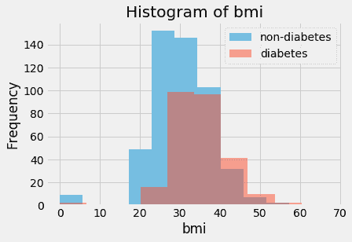
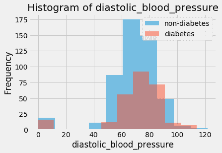
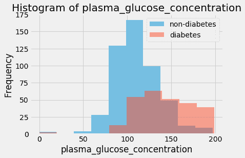
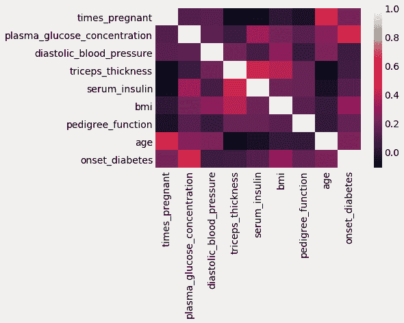
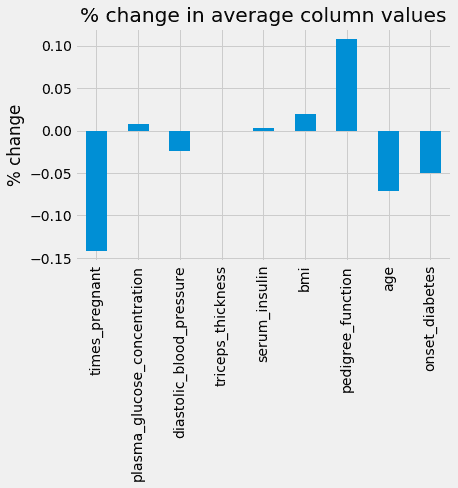
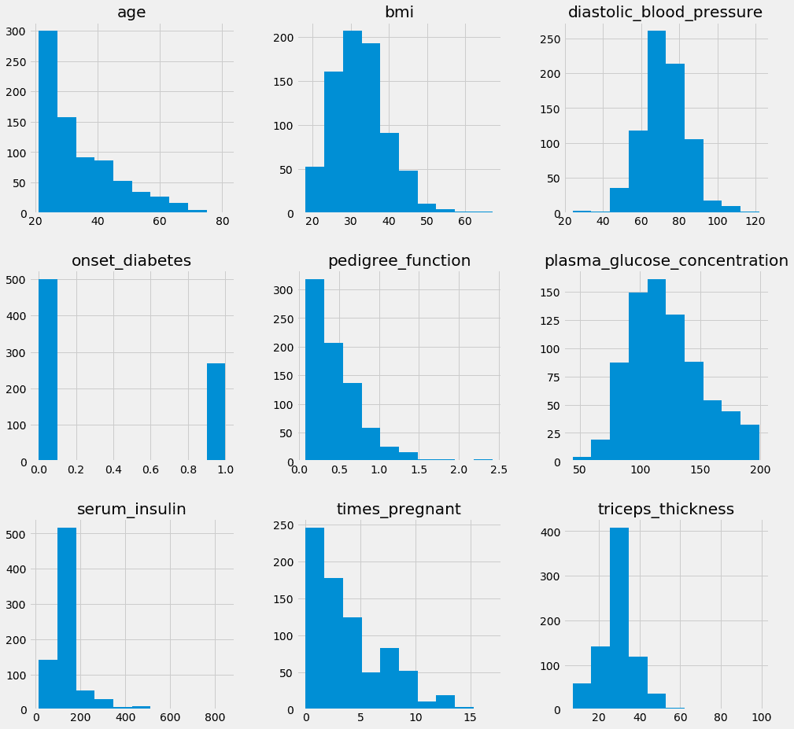
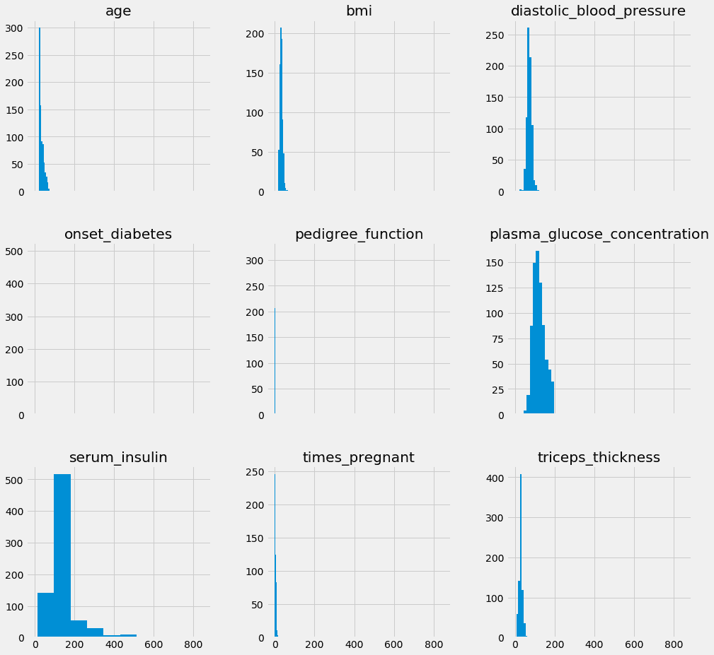
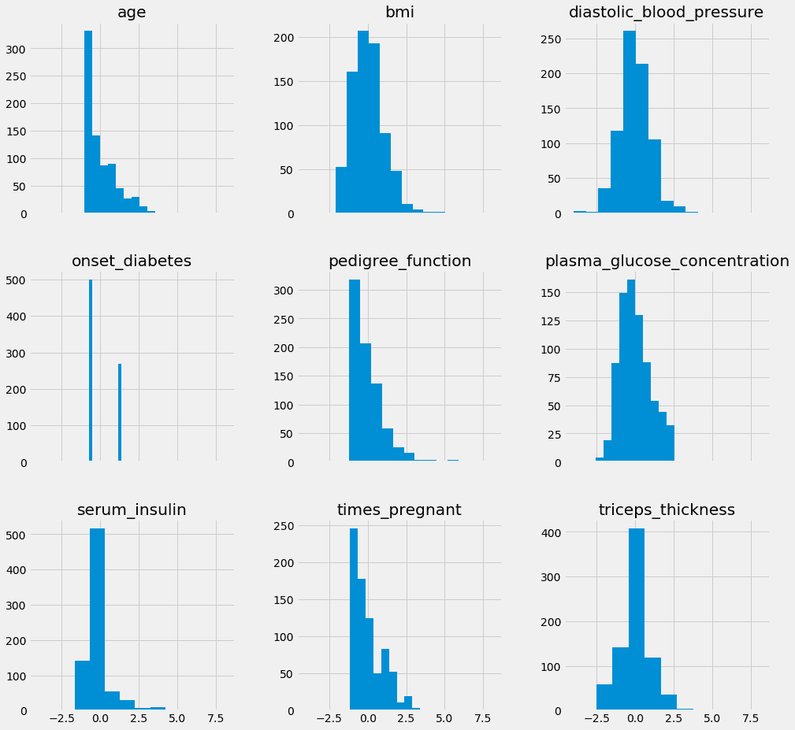

# 功能改进-清理数据集

在最后两章中，我们已经从谈论对特征工程的基本理解以及如何使用它来增强我们的机器学习管道，到接触数据集并评估和理解我们在野外可能遇到的不同类型的数据。

在这一章中，我们将运用我们所学的知识，更进一步，开始改变我们所使用的数据集。具体来说，我们将开始*清理*和*扩充*我们的数据集。通过清理，我们通常指的是改变已经给我们的列和行的过程。对于扩充，我们通常指的是删除列和向数据集添加列的过程。一如既往，我们在所有这些过程中的目标是增强我们的机器学习管道。

在接下来的章节中，我们将:

*   识别数据中缺失的值
*   删除有害数据
*   输入(填充)这些缺失值
*   规范化/标准化数据
*   构建全新的功能
*   手动和自动选择(移除)特征
*   使用数学矩阵计算将数据集转换到不同的维度

这些方法将帮助我们更好地理解数据中哪些特征是重要的。在这一章中，我们将更深入地研究前四种方法，其他三种方法留待以后的章节讨论。


# 识别数据中缺失的值

我们识别缺失值的第一种方法是让我们更好地理解如何处理真实世界的数据。通常，由于各种原因，数据可能会有缺失值，例如，对于调查数据，一些观察值可能没有被记录。对我们来说，分析我们的数据并了解缺失值是什么非常重要，这样我们就可以决定如何处理机器学习中的缺失值。首先，让我们深入一个我们在本章期间感兴趣的数据集，即`Pima Indian Diabetes Prediction`数据集。


# Pima 印度糖尿病预测数据集

该数据集可在 UCI 机器学习存储库中获得，网址为:

[https://archive . ics . UCI . edu/ml/datasets/pima+印第安人+糖尿病](https://archive.ics.uci.edu/ml/datasets/pima+indians+diabetes)。

从主网站上，我们可以了解到一些关于这个公开数据集的信息。我们有 9 列和 768 个实例(行)。该数据集主要用于预测 21 岁以上的皮马印第安血统女性在五年内的糖尿病发病情况，给定她们身体的医学细节。

数据集旨在对应于二元(2 类)分类机器学习问题。即问题的答案，*这个人会在五年内患上糖尿病吗？*列名提供如下(按顺序):

1.  怀孕次数
2.  口服葡萄糖耐量试验中 2 小时的血浆葡萄糖浓度
3.  舒张压(毫米汞柱)
4.  三头肌皮褶厚度(毫米)
5.  2 小时血清胰岛素测量值(μU/ml)
6.  身体质量指数(体重公斤/(身高米) ²

7.  糖尿病谱系功能
8.  年龄(岁)
9.  类别变量(零或一)

数据集的目标是能够预测`class`变量的最后一列，该列使用其他八个特征作为机器学习函数的输入来预测患者是否患有糖尿病。

我们将使用该数据集有两个非常重要的原因:

*   我们将不得不处理缺失的值
*   我们将使用的所有功能都是定量的

第一点现在更有意义，因为本章的重点是处理缺失值。至于只选择使用定量数据，这只是本章的情况。我们没有足够的工具来处理分类列中的缺失值。在下一章，当我们谈到特征构造时，我们将处理这个过程。


# 探索性数据分析

为了识别我们丢失的值，我们将从数据集的 EDA 开始。我们将使用一些有用的 python 包 pandas 和 numpy 来存储我们的数据，进行一些简单的计算，以及一些流行的可视化工具来查看我们的数据分布情况。让我们开始研究一些代码。首先，我们将进行一些进口:

```
# import packages we need for exploratory data analysis (EDA)
import pandas as pd # to store tabular data
import numpy as np # to do some math
import matplotlib.pyplot as plt # a popular data visualization tool
import seaborn as sns  # another popular data visualization tool
%matplotlib inline 
plt.style.use('fivethirtyeight') # a popular data visualization theme
```

我们将通过 CSV 导入表格数据，如下所示:

```
# load in our dataset using pandas
pima = pd.read_csv('../data/pima.data')

pima.head()

```

`head`方法允许我们看到数据集中的前几行。输出如下所示:

|  | **6** | **148** | **72** | **35** | **0** | **33.6** | **0.627** | **50** | **1** |
| **0** | 一 | 85 | 66 | 29 | 0 | 26.6 | 0.351 | 31 | 0 |
| **1** | 8 | 183 | 64 | 0 | 0 | 23.3 | 0.627 | 32 | 一 |
| **2** | 一 | 89 | 66 | 23 | 94 | 28.1 | 0.167 | 21 | 0 |
| **3** | 0 | 137 | 40 | 35 | 168 | 43.1 | 2.288 | 33 | 一 |
| **4** | 5 | 116 | 74 | 0 | 0 | 25.6 | 0.201 | 30 | 0 |

这里有些不对劲，没有列名。CSV 不能包含文件中内置的列的名称。没关系，我们可以使用数据源的网站来填充它，如下面的代码所示:

```
pima_column_names = ['times_pregnant', 'plasma_glucose_concentration', 'diastolic_blood_pressure', 'triceps_thickness', 'serum_insulin', 'bmi', 'pedigree_function', 'age', 'onset_diabetes']

pima = pd.read_csv('../data/pima.data', names=pima_column_names)

pima.head()

```

现在，再次使用`head`方法，我们可以看到带有适当标题的列。上述代码的输出如下:

|  | **倍 _ 孕** | **血浆葡萄糖浓度** | **舒张压血压** | **三头肌 _ 厚度** | **血清 _ 胰岛素** | **体重指数** | **血统 _ 功能** | **年龄** | **发病 _ 糖尿病** |
| **0** | 6 | 148 | 72 | 35 | 0 | 33.6 | 0.627 | 50 | 一 |
| **1** | 一 | 85 | 66 | 29 | 0 | 26.6 | 0.351 | 31 | 0 |
| **2** | 8 | 183 | 64 | 0 | 0 | 23.3 | 0.672 | 32 | 一 |
| **3** | 一 | 89 | 66 | 23 | 94 | 28.1 | 0.167 | 21 | 0 |
| **4** | 0 | 137 | 40 | 35 | 168 | 43.1 | 2.288 | 33 | 一 |

更好的是，现在我们可以使用列名进行一些基本的统计、选择和可视化。让我们首先获得零精度，如下所示:

```
pima['onset_diabetes'].value_counts(normalize=True) 
# get null accuracy, 65% did not develop diabetes

0    0.651042

1    0.348958

Name: onset_diabetes, dtype: float64
```

如果我们的最终目标是利用数据中的模式来预测糖尿病的发病，那么让我们试着想象那些患糖尿病的人和那些没有患糖尿病的人之间的一些差异。我们希望直方图能够揭示某种模式，或者不同预测类别之间的明显差异:

```
# get a histogram of the plasma_glucose_concentration column for
# both classes

col = 'plasma_glucose_concentration'
plt.hist(pima[pima['onset_diabetes']==0][col], 10, alpha=0.5, label='non-diabetes')
plt.hist(pima[pima['onset_diabetes']==1][col], 10, alpha=0.5, label='diabetes')
plt.legend(loc='upper right')
plt.xlabel(col)
plt.ylabel('Frequency')
plt.title('Histogram of {}'.format(col))
plt.show()
```

上述代码的输出如下:


这个直方图似乎向我们展示了两个预测类别之间`plasma_glucose_concentration`的巨大差异。让我们为多个列显示相同的直方图样式，如下所示:

```
for col in ['bmi', 'diastolic_blood_pressure', 'plasma_glucose_concentration']:
    plt.hist(pima[pima['onset_diabetes']==0][col], 10, alpha=0.5, label='non-diabetes')
    plt.hist(pima[pima['onset_diabetes']==1][col], 10, alpha=0.5, label='diabetes')
    plt.legend(loc='upper right')
    plt.xlabel(col)
    plt.ylabel('Frequency')
    plt.title('Histogram of {}'.format(col))
    plt.show()
```

上述代码的输出将为我们提供以下三个直方图。第一个是显示两类变量(非糖尿病和糖尿病)的 **bmi** 的分布:



下一个直方图将再次向我们展示两个类变量之间的不同分布。这次我们来看看**舒张压**:



最终的图表将显示我们两个类别变量之间的**血浆葡萄糖浓度**差异:



仅仅通过查看一些直方图，我们就可以明确地看到一些主要的差异。例如，在`plasma_glucose_concentration`那些最终将发展成糖尿病的人似乎有很大的增加。为了巩固这一点，也许我们可以设想一个线性相关矩阵，试图量化这些变量之间的关系。我们将使用可视化工具 seaborn，它是我们在本章开始时为关联矩阵导入的，如下所示:

```
# look at the heatmap of the correlation matrix of our dataset
sns.heatmap(pima.corr())
# plasma_glucose_concentration definitely seems to be an interesting feature here
```

下面是我们数据集的相关矩阵。这向我们展示了`Pima`数据集中不同列之间的相关性。输出如下所示:



该相关矩阵显示了`plasma_glucose_concentration`和`onset_diabetes`之间的强相关性。让我们用下面的代码进一步看看`onset_diabetes`列的数值相关性:

```
pima.corr()['onset_diabetes'] # numerical correlation matrix
# plasma_glucose_concentration definitely seems to be an interesting feature here

times_pregnant                  0.221898

plasma_glucose_concentration    0.466581 diastolic_blood_pressure        0.065068

triceps_thickness               0.074752

serum_insulin                   0.130548

bmi                             0.292695

pedigree_function               0.173844

age                             0.238356

onset_diabetes                  1.000000

Name: onset_diabetes, dtype: float64
```

我们将在后面的[第 4 章](430d621e-7ce6-48c0-9990-869e82a0d0c6.xhtml)、*特征构造*中探索相关性的功效，但是现在我们使用**探索性数据分析** ( **EDA** )来暗示这样一个事实，即`plasma_glucose_concentration`列将是我们预测糖尿病发病的一个重要因素。

继续讨论手头更重要的事情，让我们通过调用 pandas DataFrame 的内置`isnull()`方法来看看我们的数据集中是否遗漏了任何值:

```
pima.isnull().sum()
>>>>
times_pregnant                  0

plasma_glucose_concentration    0

diastolic_blood_pressure        0

triceps_thickness               0

serum_insulin                   0

bmi                             0

pedigree_function               0

age                             0

onset_diabetes                  0

dtype: int64
```

太好了！我们没有任何缺失值。让我们继续做一些 EDA，首先使用`shape`方法来查看我们正在处理的行数和列数:

```
pima.shape . # (# rows, # cols)
(768, 9)
```

确认我们有`9`列(包括我们的响应变量)和`768`数据观察(行)。现在，让我们用下面的代码来看看患糖尿病患者的百分比峰值:

```
pima['onset_diabetes'].value_counts(normalize=True) 
# get null accuracy, 65% did not develop diabetes

0    0.651042

1    0.348958

Name: onset_diabetes, dtype: float64
```

这向我们表明`65%`的患者没有发展成糖尿病，而大约 35%的患者发展成了。我们可以使用一个叫做`describe`的熊猫数据框架的内置方法来查看一些基本的描述性统计数据:

```
pima.describe()  # get some basic descriptive statistics

```

我们得到如下输出:

|  | **倍 _ 孕** | **血浆 _ 葡萄糖
_ 浓度** | **舒张压 _
血压 _ 血压** | **三头肌
_ 厚度** | **血清
_ 胰岛素** | **身体质量指数** | **血统
_ 功能** | **年龄** | **发病
_ 糖尿病** |
| **计数** | 768.000000 | 768.000000 | 768.000000 | 768.000000 | 768.000000 | 768.000000 | 768.000000 | 768.000000 | 768.000000 |
| **的意思是** | 3.845052 | 120.894531 | 69.105469 | 20.536458 | 79.799479 | 31.992578 | 0.471876 | 33.240885 | 0.348958 |
| **标准** | 3.369578 | 31.972618 | 19.355807 | 15.952218 | 115.244002 | 7.884160 | 0.331329 | 11.760232 | 0.476951 |
| **最小值** | 0.000000 | 0.000000 | 0.000000 | 0.000000 | 0.000000 | 0.000000 | 0.078000 | 21.000000 | 0.000000 |
| **25%** | 1.000000 | 99.000000 | 62.000000 | 0.000000 | 0.000000 | 27.300000 | 0.243750 | 24.000000 | 0.000000 |
| **50%** | 3.000000 | 117.000000 | 72.000000 | 23.000000 | 30.500000 | 32.000000 | 0.372500 | 29.000000 | 0.000000 |
| **75%** | 6.000000 | 140.250000 | 80.000000 | 32.000000 | 127.250000 | 36.600000 | 0.626250 | 41.000000 | 1.000000 |
| **最大值** | 17.000000 | 199.000000 | 122.000000 | 99.000000 | 846.000000 | 67.100000 | 2.420000 | 81.000000 | 1.000000 |

这很快向我们展示了一些基本的统计数据，如平均值、标准差和数据的一些不同的百分位数。但是，请注意，`BMI`列的最小值是`0`。这在医学上是不可能的；发生这种事一定有原因。也许数字零已被编码为缺失值，而不是 None 值或缺失单元。经过仔细观察，我们发现值 0 是以下各列的最小值:

*   `times_pregnant`
*   `plasma_glucose_concentration`
*   `diastolic_blood_pressure`
*   `triceps_thickness`
*   `serum_insulin`
*   `bmi`
*   `onset_diabetes`

因为零是`onset_diabetes`的一个类，而 0 实际上是`times_pregnant`的一个可行的数字，我们可以得出结论，数字 0 正在对以下各项的缺失值进行编码:

*   `plasma_glucose_concentration`
*   `diastolic_blood_pressure`
*   `triceps_thickness`
*   `serum_insulin`
*   `bmi`

所以，我们确实有缺失值！显然，我们碰巧发现零是缺失值并不是运气，我们事先就知道。作为一名数据科学家，您必须时刻保持警惕，确保尽可能多地了解数据集，以便找到编码为其他符号的缺失值。请务必阅读开放数据集附带的所有文档，以防它们提到任何缺失值。

如果没有可用的文档，则使用一些常用值代替缺失值:

*   **0** (用于数值)
*   **未知**或**未知**(用于分类变量)
*   **？**(用于分类变量)

因此，我们有五列存在缺失值，现在我们来深入讨论如何处理它们。


# 处理数据集中的缺失值

在处理数据时，数据科学家会遇到的最常见的问题之一是丢失数据的问题。最常见的是，这指的是空单元格(行/列交叉点),其中的数据由于某种原因没有被获取。这可能会成为一个问题，原因有很多；值得注意的是，当将学习算法应用于具有缺失值的数据时，大多数(不是所有)算法都不能处理缺失值。

由于这个原因，数据科学家和机器学习工程师有许多关于如何处理这个问题的技巧和提示。尽管有许多不同的方法，我们处理缺失数据的两种主要方式是:

*   删除缺少值的行
*   估算(填充)缺失值

每种方法都将**清理**我们的数据集，达到一种学习算法可以处理的程度，但每种方法都有其利弊。

首先，在我们走得太远之前，让我们去掉零，用 Python 中的值`None`来代替它们。这样，我们的`fillna`和`dropna`方法将正确工作。我们可以手动将所有零替换为零，每次一列，如下所示:

```
# Our number of missing values is (incorrectly) 0
pima['serum_insulin'].isnull().sum()

0

pima['serum_insulin'] = pima['serum_insulin'].map(lambda x:x if x != 0 else None)
# manually replace all 0's with a None value

pima['serum_insulin'].isnull().sum()
# check the number of missing values again

374
```

我们可以对每个带有不正确标签的缺失值的列重复这个过程，或者我们可以使用一个`for`循环和一个内置的`replace`方法来加速，如下面的代码所示:

```
# A little faster now for all columns

columns = ['serum_insulin', 'bmi', 'plasma_glucose_concentration', 'diastolic_blood_pressure', 'triceps_thickness']

for col in columns:
    pima[col].replace([0], [None], inplace=True)
```

因此，现在如果我们尝试使用`isnull`方法来计算缺失值的数量，我们应该开始看到缺失值被计算如下:

```
pima.isnull().sum()  # this makes more sense now!

times_pregnant                    0

plasma_glucose_concentration      5

diastolic_blood_pressure         35

triceps_thickness               227

serum_insulin                   374

bmi                              11

pedigree_function                 0

age                               0

onset_diabetes                    0

dtype: int64

pima.head()
```

现在，查看数据集的前几行，我们得到如下输出:

|  | **倍 _ 孕** | **血浆葡萄糖浓度** | **舒张压血压** | **三头肌 _ 厚度** | **血清 _ 胰岛素** | **体重指数** | **血统 _ 功能** | **年龄** | **发病 _ 糖尿病** |
| **0** | 6 | 148 | 72 | 35 | 圆盘烤饼 | 33.6 | 0.627 | 50 | 一 |
| **1** | 一 | 85 | 66 | 29 | 圆盘烤饼 | 26.6 | 0.351 | 31 | 0 |
| **2** | 8 | 183 | 64 | 没有人 | 圆盘烤饼 | 23.3 | 0.672 | 32 | 一 |
| **3** | 一 | 89 | 66 | 23 | 圆盘烤饼 | 28.1 | 0.167 | 21 | 0 |
| **4** | 0 | 137 | 40 | 35 | 圆盘烤饼 | 43.1 | 2.288 | 33 | 一 |

好吧，这开始变得更有意义了。我们现在可以看到有五列缺少值，数据缺少的程度是惊人的。有些列，比如`plasma_glucose_concentration`，只缺五个值，但是看看`serum_insulin`；该列丢失了几乎一半的值。

现在，我们已经将缺失值正确地注入到我们的数据集中，而不是数据集最初附带的`0`占位符，我们的探索性数据分析将更加准确:

```
pima.describe()  # grab some descriptive statistics
```

上述代码产生以下输出:

| **倍 _ 孕** | **血清 _ 胰岛素** | **谱系 _ 功能** | **年龄** | **发病 _ 糖尿病** | **计数** |
| 768.000000 | 394.000000 | 768.000000 | 768.000000 | 768.000000 | **的意思是** |
| 3.845052 | 155.548223 | 0.471876 | 33.240885 | 0.348958 | **性病** |
| 3.369578 | 118.775855 | 0.331329 | 11.760232 | 0.476951 | **最小值** |
| 0.000000 | 14.000000 | 0.078000 | 21.000000 | 0.000000 | **25%** |
| 1.000000 | 76.250000 | 0.243750 | 24.000000 | 0.000000 | **50%** |
| 3.000000 | 125.000000 | 0.372500 | 29.000000 | 0.000000 | **75%** |
| 6.000000 | 190.000000 | 0.626250 | 41.000000 | 1.000000 | **最大值** |
| 17.000000 | 846.000000 | 2.420000 | 81.000000 | 1.000000 | 1.000000 |

请注意，`describe`方法不包括缺少值的列，这虽然不理想，但并不意味着我们不能通过计算特定列的平均值和标准偏差来获得它们，如下所示:

让我们继续讨论处理缺失数据的两种方法。

```
pima['plasma_glucose_concentration'].mean(), pima['plasma_glucose_concentration'].std()

(121.68676277850589, 30.53564107280403)
```

删除有害的数据行


# 处理缺失数据的两种方法中，最常见也是最简单的方法可能就是简单地删除有任何缺失值的观测值。通过这样做，我们将只剩下填充了所有数据的**完整的**数据点。我们可以通过调用 pandas 中的`dropna`方法获得一个新的 DataFrame，如下面的代码所示:

现在，当然，这里明显的问题是我们丢失了几行。要检查具体数量，请使用以下代码:

```
# drop the rows with missing values
pima_dropped = pima.dropna()
```

哇！我们丢失了原始数据集中大约 51%的行，如果我们从机器学习的角度来考虑这个问题，即使现在我们有了填充了所有内容的干净数据，我们也没有通过忽略一半以上的数据观察值来真正学到尽可能多的东西。这就像医生试图了解心脏病是如何发生的，却忽略了一半以上来检查的病人。

```
num_rows_lost = round(100*(pima.shape[0] - pima_dropped.shape[0])/float(pima.shape[0]))

print "retained {}% of rows".format(num_rows_lost)
# lost over half of the rows!

retained 49.0% of rows
```

让我们对数据集执行更多的 EDA，并比较删除缺失值行前后的数据统计信息:

现在，让我们使用以下代码来查看删除行后的相同拆分:

```
# some EDA of the dataset before it was dropped and after

# split of trues and falses before rows dropped
pima['onset_diabetes'].value_counts(normalize=True)

0    0.651042
1    0.348958
Name: onset_diabetes, dtype: float64
```

在数据集的剧烈转换过程中，二进制响应似乎保持相对不变。让我们通过使用`pima.mean`函数比较转换前后列的平均值来看看数据的*形状*，如下所示:

```
pima_dropped['onset_diabetes'].value_counts(normalize=True)  

0    0.668367

1    0.331633

Name: onset_diabetes, dtype: float64

# the split of trues and falses stay relatively the same
```

现在，对于删除行后的相同平均值，使用`pima_dropped.mean()`函数，如下所示:

```
# the mean values of each column (excluding missing values)
pima.mean()

times_pregnant                    3.845052

plasma_glucose_concentration    121.686763

diastolic_blood_pressure         72.405184

triceps_thickness                29.153420

serum_insulin                   155.548223

bmi                              32.457464

pedigree_function                 0.471876

age                              33.240885

onset_diabetes                    0.348958

dtype: float64
```

为了更好地了解这些数字是如何变化的，让我们创建一个新的图表，直观显示每列的平均百分比变化。首先，让我们创建一个每列平均值的百分比变化表，如下面的代码所示:

```
# the mean values of each column (with missing values rows dropped)
pima_dropped.mean()

times_pregnant                    3.301020

plasma_glucose_concentration    122.627551

diastolic_blood_pressure         70.663265

triceps_thickness                29.145408

serum_insulin                   156.056122

bmi                              33.086224

pedigree_function                 0.523046

age                              30.864796

onset_diabetes                    0.331633

dtype: float64
```

现在让我们用下面的代码将这些变化可视化为一个条形图:

```
# % change in means
(pima_dropped.mean() - pima.mean()) / pima.mean()

times_pregnant                 -0.141489

plasma_glucose_concentration    0.007731

diastolic_blood_pressure       -0.024058

triceps_thickness              -0.000275

serum_insulin                   0.003265

bmi                             0.019372

pedigree_function               0.108439

age                            -0.071481

onset_diabetes                 -0.049650

dtype: float64
```

上述代码产生以下输出:

```
# % change in means as a bar chart
ax = ((pima_dropped.mean() - pima.mean()) / pima.mean()).plot(kind='bar', title='% change in average column values')
ax.set_ylabel('% change')
```

我们可以看到，`times_pregnant`变量的平均数在剔除缺失值后下降了 14%，这是一个很大的变化！而`pedigree_function`也上涨了 11%，又是一个大的飞跃。我们可以看到删除行(观察)是如何严重影响数据的形状的，我们应该尽量保留更多的数据。在进入下一个处理缺失值的方法之前，让我们引入一些实际的机器学习。



下面的代码块(我们一会儿会一行一行地看)将成为本书中非常熟悉的代码块。它描述并实现了机器学习模型在各种参数上的单次拟合，希望获得最佳可能的模型，给定手边的特征:

好了，让我们一行一行地过一遍。首先，我们有两个新的导入语句:

```
# now lets do some machine learning

# note we are using the dataset with the dropped rows

from sklearn.neighbors import KNeighborsClassifier
from sklearn.model_selection import GridSearchCV

X_dropped = pima_dropped.drop('onset_diabetes', axis=1)
# create our feature matrix by removing the response variable
print "learning from {} rows".format(X_dropped.shape[0])
y_dropped = pima_dropped['onset_diabetes']

# our grid search variables and instances

# KNN parameters to try
knn_params = {'n_neighbors':[1, 2, 3, 4, 5, 6, 7]}

knn = KNeighborsClassifier() . # instantiate a KNN model

grid = GridSearchCV(knn, knn_params)
grid.fit(X_dropped, y_dropped)

print grid.best_score_, grid.best_params_
# but we are learning from way fewer rows..
```

我们将利用 scikit-learn 的**K-最近邻** ( **KNN** )分类模型，以及一个网格搜索模块，该模块将自动为 KNN 模型找到最佳参数组合(使用暴力),该模型在交叉验证的准确性方面最符合我们的数据。接下来，让我们取出丢弃的数据集(删除了缺少值的行)并为我们的预测模型创建一个`X`和一个`y`变量。先说我们的`X`(我们的特征矩阵):

```
from sklearn.neighbors import KNeighborsClassifier
from sklearn.model_selection import GridSearchCV
```

哎哟，很明显这种方法存在一个主要问题。我们的机器学习算法将从比我们开始时少得多的数据观察中进行拟合和学习。现在让我们创建我们的`y`(响应系列):

```
X_dropped = pima_dropped.drop('onset_diabetes', axis=1) 
# create our feature matrix by removing the response variable
print "learning from {} rows".format(X_dropped.shape[0])

learning from 392 rows
```

现在我们有了`X`和`y`变量，我们可以引入成功运行**网格搜索**所需的变量和实例。我们将把`params`的数量设置为 7，以保持本章的简单。对于我们尝试的每一种数据清理和特征工程方法(删除行、填充数据)，我们将尝试将最佳 KNN 拟合为具有 1 到 7 个邻居复杂度的某个值。我们可以如下设置此模型:

```
y_dropped = pima_dropped['onset_diabetes']
```

接下来，我们将实例化一个网格搜索模块，如下面的代码所示，并使它适合我们的特征矩阵和响应变量。一旦我们这样做了，我们将打印出最佳精度以及用于学习的最佳参数:

```
# our grid search variables and instances

# KNN parameters to try

knn_params = {'n_neighbors':[1, 2, 3, 4, 5, 6, 7]}
```

因此，似乎使用七个邻居作为参数，我们的 KNN 模型能够实现`74.4%`精度(优于我们约 65%的零精度)，但请记住，它只从 49%的原始数据中学习，所以谁知道它会如何处理其余的数据。

```
grid = GridSearchCV(knn, knn_params)
grid.fit(X_dropped, y_dropped)

print grid.best_score_, grid.best_params_
# but we are learning from way fewer rows..

0.744897959184 {'n_neighbors': 7}
```

这是我们在本书中第一次真正研究使用机器学习。我们将假设读者对机器学习以及交叉验证等统计程序有基本的了解。

很明显，虽然删除*脏*行可能不完全是特征工程，但它仍然是一种数据清理技术，我们可以利用它来帮助净化我们的机器学习管道输入。我们试试稍微难一点的方法。

输入数据中缺失的值


# 估算是处理缺失值的更复杂的方法。通过*输入，*我们指的是用从现有知识/数据中以某种方式确定的数值来填充缺失数据值的行为。关于如何填充这些缺失值，我们有几个选项，其中最常见的是用列中其余部分的平均值来填充缺失值，如下面的代码所示:

让我们看看缺少`plasma_glucose_concentration`的五行:

```
pima.isnull().sum()  # let's fill in the plasma column

times_pregnant                    0

plasma_glucose_concentration      5 diastolic_blood_pressure         35

triceps_thickness               227

serum_insulin                   374

bmi                              11

pedigree_function                 0

age                               0

onset_diabetes                    0

dtype: int64
```

现在，让我们使用内置的`fillna`方法用剩余的`plasma_glucose_concentration`列的平均值替换所有的`None`值:

```
empty_plasma_index = pima[pima['plasma_glucose_concentration'].isnull()].index
pima.loc[empty_plasma_index]['plasma_glucose_concentration']

75     None

182    None

342    None

349    None

502    None

Name: plasma_glucose_concentration, dtype: object
```

如果我们检查该列，我们应该会看到`None`值已被`121.68`所取代，这是我们之前获得的该列的平均值:

```
pima['plasma_glucose_concentration'].fillna(pima['plasma_glucose_concentration'].mean(), inplace=True)
# fill the column's missing values with the mean of the rest of the column

pima.isnull().sum()  # the column should now have 0 missing values

times_pregnant                    0

plasma_glucose_concentration      0 diastolic_blood_pressure         35

triceps_thickness               227

serum_insulin                   374

bmi                              11

pedigree_function                 0

age                               0

onset_diabetes                    0

dtype: int64
```

太好了！但是这可能很麻烦。让我们使用 scikit-learn 预处理类中的一个模块(文档可以在[http://sci kit-learn . org/stable/modules/classes . html # module-sk learn . preprocessing](http://scikit-learn.org/stable/modules/classes.html#module-sklearn.preprocessing)找到)，称为`Imputer`(恰当地命名)。我们可以按如下方式导入它:

```
pima.loc[empty_plasma_index]['plasma_glucose_concentration']

75     121.686763

182    121.686763

342    121.686763

349    121.686763

502    121.686763

Name: plasma_glucose_concentration, dtype: float64
```

与大多数 scikit-learn 模块一样，我们有一些新的参数可以使用，但我将重点关注主要的参数，称为`strategy`。通过设置该参数，我们可以定义如何将值输入到我们的数据集中。对于定量值，我们可以使用内置的均值和中值策略来填充具有任一数量的值。要使用`Imputer`，我们必须首先实例化该对象，如下面的代码所示:

```
from sklearn.preprocessing import Imputer
```

然后，我们可以调用`fit_transform`方法来创建一个新的对象，如下面的代码所示:

```
imputer = Imputer(strategy='mean')
```

我们确实有个小问题要处理。估算器的输出不是 pandas 数据帧，而是类型为 **NumPy** 数组的输出:

```
pima_imputed = imputer.fit_transform(pima)
```

这很容易处理，因为我们可以将数组转换为数据帧，如下面的代码所示:

```
type(pima_imputed)  # comes out as an array

numpy.ndarray
```

让我们来看看我们的新数据框架:

```
pima_imputed = pd.DataFrame(pima_imputed, columns=pima_column_names)
# turn our numpy array back into a pandas DataFrame object
```

上述代码产生以下输出:

```
pima_imputed.head()  # notice for example the triceps_thickness missing values were replaced with 29.15342
```

The preceding code produces the following output:

| **次 _ 孕** | **血浆葡萄糖浓度** | **舒张压血压** | **三头肌 _ 厚度** | **血清 _ 胰岛素** | **身体质量指数** | **血统 _ 功能** | **年龄** | **发病 _ 糖尿病** | 0 |
| 6.0 | 148.0 | 72.0 | 35.00000 | 155.548223 | 33.6 | 0.627 | 50.0 | 1.0 | 一 |
| 1.0 | 85.0 | 66.0 | 29.00000 | 155.548223 | 26.6 | 0.351 | 31.0 | 0.0 | 2 |
| 8.0 | 183.0 | 64.0 | 29.15342 | 155.548223 | 23.3 | 0.672 | 32.0 | 1.0 | 3 |
| 1.0 | 89.0 | 66.0 | 23.00000 | 94.000000 | 28.1 | 0.167 | 21.0 | 0.0 | 四 |
| 0.0 | 137.0 | 40.0 | 35.00000 | 168.000000 | 43.1 | 2.288 | 33.0 | 1.0 | 让我们检查一下我们的`plasma_glucose_concentration`列，以确保这些值仍然填充了我们之前手动计算的平均值: |

作为最后的检查，我们的估算数据帧应该没有缺失值，如下面的代码所示:

```
pima_imputed.loc[empty_plasma_index]['plasma_glucose_concentration'] 
# same values as we obtained with fillna

75     121.686763

182    121.686763

342    121.686763

349    121.686763

502    121.686763

Name: plasma_glucose_concentration, dtype: float64
```

太好了！`Imputer`对于将数据值输入到缺失的槽中的琐碎任务有很大帮助。让我们尝试输入一些类型的值，看看它对我们的 KNN 分类模型的影响。让我们首先尝试一个更简单的输入方法。让我们用零重新填充空值:

```
pima_imputed.isnull().sum()  # no missing values

times_pregnant                  0

plasma_glucose_concentration    0

diastolic_blood_pressure        0

triceps_thickness               0

serum_insulin                   0

bmi                             0

pedigree_function               0

age                             0

onset_diabetes                  0

dtype: int64
```

如果我们将值保留为`0`，我们的准确性将会低于删除有缺失值的行。我们现在的目标是获得一个机器学习管道，它可以从所有的`768`行中学习，但性能要优于只从 392 行中学习的模型。这意味着 beat 的精度为 0.745，即 74.5%。

```
pima_zero = pima.fillna(0) # impute values with 0

X_zero = pima_zero.drop('onset_diabetes', axis=1)
print "learning from {} rows".format(X_zero.shape[0])
y_zero = pima_zero['onset_diabetes']

knn_params = {'n_neighbors':[1, 2, 3, 4, 5, 6, 7]}
grid = GridSearchCV(knn, knn_params)
grid.fit(X_zero, y_zero)

print grid.best_score_, grid.best_params_ 
# if the values stayed at 0, our accuracy goes down

learning from 768 rows

0.73046875 {'n_neighbors': 6}
```

在机器学习管道中输入值


# 如果我们希望将`Imputer`转移到生产就绪的机器学习流水线上，我们将需要简单谈谈流水线的话题。

机器学习中的流水线


# 当我们谈论机器学习中的*管道*时，我们通常是在谈论这样一个事实，即数据只是通过一个学习算法 raw，还要通过各种预处理步骤，甚至是多个学习算法，才能解释最终的输出。因为在一个机器学习管道中有几个步骤以及转换和预测是如此常见，所以 scikit-learn 有一个内置模块来构建这些管道。

管道尤其重要，因为在使用`Imputer`类输入值时，不使用管道实际上是不合适的。这是因为学习算法的目标是概括训练集中的模式，以便将这些模式应用于测试集。如果我们在分割数据集和应用学习算法之前估算整个数据集的值，那么我们就是在作弊，我们的模型实际上没有学习任何模式。为了形象化这个概念，让我们以一个单独的训练测试为例，这是交叉验证训练阶段中许多测试中的一个。

让我们复制一个`Pima`数据集的单个列，以便更彻底地强调我们的观点，并从 scikit-learn 导入一个单独的训练测试分割模块:

现在，让我们做一个简单的拆分。但在此之前，我们将使用以下代码估算整个数据集中`X`的平均值:

```
from sklearn.model_selection import train_test_split

X = pima[['serum_insulin']].copy()
y = pima['onset_diabetes'].copy()

X.isnull().sum()

serum_insulin    374
dtype: int64
```

现在，让我们为训练集和测试集拟合一个 KNN 模型:

```
# the improper way.. imputing values BEFORE splitting

entire_data_set_mean = X.mean()    # take the entire datasets mean
X = X.fillna(entire_data_set_mean) # and use it to fill in the missing spots
print entire_data_set_mean

serum_insulin    155.548223

dtype: float64

# Take the split using a random state so that we can examine the same split.
X_train, X_test, y_train, y_test = train_test_split(X, y, random_state=99)
```

注意，我们在这里没有实现任何网格搜索，只是一个普通的拟合。我们看到我们的模型拥有 66%的准确率(不是很好，但这不是重点)。这里需要注意的重要一点是,`X`的训练集和测试集都是使用整个`X`矩阵的平均值估算的。这直接违反了机器学习程序的核心原则。在预测测试集的响应值时，我们不能假设我们知道整个数据集的平均值。简而言之，我们的 KNN 模型使用从测试集中获得的信息来适应训练集。这是一面大红旗。

```
knn = KNeighborsClassifier()

knn.fit(X_train, y_train)

knn.score(X_test, y_test)

0.65625  # the accuracy of the improper split
```

有关管道以及我们为什么需要使用它们的更多信息，请查看*数据科学的原理*(可从 Packt Publishing 获得)https://www . packtpub . com/big-Data-and-business-intelligence/Principles-Data-Science

现在，让我们通过首先取训练集的平均值，然后使用训练集的平均值来填充测试集的值来正确地做这件事。同样，此过程测试模型使用训练数据的平均值来预测看不见的测试用例的能力:

现在，不是取整个`X`矩阵的平均值，我们将适当地仅对训练集这样做，并使用该值来填充训练集和测试集的**中的缺失单元:**

```
# the proper way.. imputing values AFTER splitting
from sklearn.model_selection import train_test_split

X = pima[['serum_insulin']].copy()
y = pima['onset_diabetes'].copy()

# using the same random state to obtain the same split
X_train, X_test, y_train, y_test = train_test_split(X, y, random_state=99)

X.isnull().sum()

serum_insulin    374

dtype: int64
```

最后，让我们在*相同的*数据集上对 KNN 模型进行评分，但要正确估算，如以下代码所示:

```
training_mean = X_train.mean()
X_train = X_train.fillna(training_mean)
X_test = X_test.fillna(training_mean)

print training_mean 

serum_insulin    158.546053

dtype: float64

# not the entire dataset's mean, it's much higher!!
```

这当然是一个低得多的准确性，但至少它是模型从训练集的特征中学习并将其所学应用于未知和保留的测试数据的能力的一个更诚实的表示。Scikit-learn 的管道通过为我们的机器学习管道的步骤提供结构和顺序，使整个过程变得更加容易。让我们来看一个如何使用 scikit-learn `Pipeline`和`Imputer`的代码块:

```
knn = KNeighborsClassifier()

knn.fit(X_train, y_train)

print knn.score(X_test, y_test)

0.4895

# lower accuracy, but much more honest in the mode's ability to generalize a pattern to outside data
```

需要注意一些新的事情。首先，我们的`Pipeline`有两个步骤:

```
from sklearn.pipeline import Pipeline

knn_params = {'classify__n_neighbors':[1, 2, 3, 4, 5, 6, 7]}
# must redefine params to fit the pipeline

knn = KNeighborsClassifier() . # instantiate a KNN model

mean_impute = Pipeline([('imputer', Imputer(strategy='mean')), ('classify', knn)])

X = pima.drop('onset_diabetes', axis=1)
y = pima['onset_diabetes']

grid = GridSearchCV(mean_impute, knn_params)
grid.fit(X, y)

print grid.best_score_, grid.best_params_

0.731770833333 {'classify__n_neighbors': 6}
mean_impute = Pipeline([('imputer', Imputer(strategy='mean')), ('classify', knn)])
```

一个带有`strategy= mean`的`Imputer`

*   KNN 类型的分类器
*   其次，我们必须为网格搜索重新定义我们的`param`字典，因为我们必须准确指定`n_neighbors`参数属于管道的哪一步:

除此之外，一切都很正常，很妥当。`Pipeline`类将为我们处理大部分过程。它将正确处理来自几个训练集的输入值，并使用它们来填充测试集中缺失的值，正确测试 KNN 在数据中归纳模式的能力，并最终输出性能最佳的模型，准确率为 73%，仅低于我们的目标 0.745。现在我们已经了解了这个语法，让我们再次尝试整个过程，但是要稍加修改，如下面的代码所示:

```
knn_params = {'classify__n_neighbors':[1, 2, 3, 4, 5, 6, 7]}
```

这里，唯一的区别是我们的管道将尝试不同的输入策略**中值**，其中缺失的值将被填充到剩余值的中值中。重要的是要重申，我们的精度可能低于模型对删除行的拟合，但它们是在两倍以上大小的数据集上用缺失值得到的！它们仍然比把它们都设为 0 要好，因为数据最初是呈现给我们的。

```
knn_params = {'classify__n_neighbors':[1, 2, 3, 4, 5, 6, 7]}

knn = KNeighborsClassifier() . # instantiate a KNN model

median_impute = Pipeline([('imputer', Imputer(strategy='median')), ('classify', knn)])
X = pima.drop('onset_diabetes', axis=1)
y = pima['onset_diabetes']

grid = GridSearchCV(median_impute, knn_params)
grid.fit(X, y)

print grid.best_score_, grid.best_params_

0.735677083333 {'classify__n_neighbors': 6}
```

让我们花一分钟时间来回顾一下我们使用适当的渠道到目前为止获得的分数:

**管道描述**

| **#行模型从**中学习到 | **交叉验证的准确度** | **删除缺少值的行** |
| **392** | **.74489** | 用 0 估算值 |
| 768 | .7304 | 用列平均值估算值 |
| 768 | .7318 | 用列的中值估算值 |
| 768 | .7357 | 如果我们只考虑准确性，似乎最好的方法是删除缺失值的行。也许在 scikit-learn 中单独使用`Pipeline`和`Imputer`特性是不够的。如果可能的话，我们仍然希望看到来自所有 768 行的可比较的(如果不是更好的)性能。为了实现这一点，让我们尝试引入一个全新的特征工程技巧，标准化和规范化。 |

标准化和规范化

到目前为止，我们已经处理了识别数据类型以及数据丢失的方式，最后，我们可以填充丢失数据的方式。现在，让我们来谈谈如何操作我们的数据(和我们的特性)来进一步增强我们的机器管道。到目前为止，我们已经尝试了四种不同的方法来操作我们的数据集，我们用 KNN 模型获得的最佳交叉验证精度是. 745。如果我们回顾以前做过的一些 EDA，我们会注意到我们的一些特性:


# 现在，让我们使用标准直方图来查看所有九列的分布，如下所示，指定图形大小:

上述代码产生以下输出:

```
impute = Imputer(strategy='mean')
# we will want to fill in missing values to see all 9 columns

pima_imputed_mean = pd.DataFrame(impute.fit_transform(pima), columns=pima_column_names)
```

很好，但是注意到什么了吗？每一列都有非常不同的平均值、最小值、最大值和标准偏差。通过使用以下代码的 describe 方法，这一点也很明显:

```
pima_imputed_mean.hist(figsize=(15, 15))
```

输出如下所示:



Nice, but notice anything off? Every single column has a vastly different mean, min, max, and standard deviation. This is also obvious through the describe method, using the following code:

```
pima_imputed_mean.describe()
```

**次
_ 怀孕**

| **血浆
_ 葡萄糖
_ 浓度** | **舒张压 _
血压** | **三头肌
_ 厚度** | **血清
_ 胰岛素** | **身体质量指数** | **血统
_ 功能** | **年龄** | **发病
_ 糖尿病** | **计数** | 768.000000 |
| 768.000000 | 768.000000 | 768.000000 | 768.000000 | 768.000000 | 768.000000 | 768.000000 | 768.000000 | **的意思是** | 3.845052 |
| 121.686763 | 72.405184 | 29.153420 | 155.548223 | 32.457464 | 0.471876 | 33.240885 | 0.348958 | **标准** | 3.369578 |
| 30.435949 | 12.096346 | 8.790942 | 85.021108 | 6.875151 | 0.331329 | 11.760232 | 0.476951 | **最小值** | 0.000000 |
| 44.000000 | 24.000000 | 7.000000 | 14.000000 | 18.200000 | 0.078000 | 21.000000 | 0.000000 | **25%** | 1.000000 |
| 99.750000 | 64.000000 | 25.000000 | 121.500000 | 27.500000 | 0.243750 | 24.000000 | 0.000000 | **50%** | 3.000000 |
| 117.000000 | 72.202592 | 29.153420 | 155.548223 | 32.400000 | 0.372500 | 29.000000 | 0.000000 | **75%** | 6.000000 |
| 140.250000 | 80.000000 | 32.000000 | 155.548223 | 36.600000 | 0.626250 | 41.000000 | 1.000000 | **最大值** | 17.000000 |
| 199.000000 | 122.000000 | 99.000000 | 846.000000 | 67.100000 | 2.420000 | 81.000000 | 1.000000 | 81.000000 | 但是这有什么关系呢？嗯，一些机器学习模型依赖于受数据的*规模*影响很大的学习方法，这意味着如果我们有一个像`diastolic_blood_pressure`这样生活在 24 到 122 之间的列，以及一个在 21 到 81 之间的年龄列，那么我们的学习算法将不会以最佳方式学习。为了真正看到比例上的差异，让我们调用直方图方法中的两个可选参数，`sharex`和`sharey`，这样我们就可以使用下面的代码在与其他图表相同的比例上看到每个图表: |

上述代码产生以下输出:

很明显，我们的数据都存在于非常不同的尺度上。数据工程师可以选择如何在我们的机器学习管道中处理这个问题，这些管道属于一个称为**规范化**的操作家族。规范化操作意味着将列和行对齐并转换为一组一致的规则。例如，标准化的一种常见形式是将所有定量列转换为一致的静态值范围(例如，所有值必须介于 0 和 1 之间)。我们还可以强加数学规则，例如，*所有列必须具有相同的平均值和标准偏差*，以便它们很好地出现在相同的直方图上(不像我们最近计算的 pima 直方图)。标准化技术意味着通过确保所有行和列在机器学习的注视下被平等对待来使数据的竞技场*变得公平。*

```
pima_imputed_mean.hist(figsize=(15, 15), sharex=True)
# with the same x axis (the y axis is not as important here)
```

我们将重点介绍三种数据标准化方法:



z 分数标准化

最小-最大缩放

*   行规范化
*   前两个选项专门处理就地改变要素，而第三个选项实际上操作数据行，但仍然与前两个选项一样相关。
*   z 分数标准化

最常见的标准化技术是 **z 得分标准化**，它利用了一个非常简单的 z 得分统计概念。z 值归一化的输出是经过重新缩放的要素，其均值为零，标准差为一。通过这样做，通过重新缩放我们的特征以具有统一的均值和方差(标准差的平方)，然后我们允许 KNN 等模型进行最优学习，而不会偏向更大比例的特征。公式很简单:对于每一列，我们用以下值替换单元格:


# *z = (x - μ) / σ*

其中:

*z* 是我们的新值(z 分数)

*x* 是单元格的前一个值

*   *μ* 是列的平均值
*   *σ* 是列的标准偏差
*   让我们通过缩放数据集中的`plasma_glucose_concentration`列来看一个例子:
*   现在，让我们使用以下代码手动计算列中每个值的 z 得分:

我们看到列中的每个值都将被替换，并且还注意到现在它们中的一些是负数。这是因为结果值代表距离平均值的*距离*。因此，如果某个值最初低于该列的平均值，则产生的 z 得分将为负。当然，在 scikit-learn 中，我们有内置的对象来帮助我们，如下面的代码所示:

```
print pima['plasma_glucose_concentration'].head()

0    148.0

1     85.0

2    183.0

3     89.0

4    137.0

Name: plasma_glucose_concentration, dtype: float64
```

我们来试试吧，如下图:

```
# get the mean of the column
mu = pima['plasma_glucose_concentration'].mean()

# get the standard deviation of the column
sigma = pima['plasma_glucose_concentration'].std()

# calculate z scores for every value in the column.
print ((pima['plasma_glucose_concentration'] - mu) / sigma).head()

0    0.864545

1   -1.205376

2    2.014501

3   -1.073952

4    0.503130

Name: plasma_glucose_concentration, dtype: float64
```

上述代码产生以下输出:

```
# built in z-score normalizer
from sklearn.preprocessing import StandardScaler
```

在这里，我们可以在做任何事情之前看到列的分布。现在，让我们应用 z 分数缩放，如以下代码所示:

```
# mean and std before z score standardizing
pima['plasma_glucose_concentration'].mean(), pima['plasma_glucose_concentration'].std()

(121.68676277850591, 30.435948867207657)

ax = pima['plasma_glucose_concentration'].hist()
ax.set_title('Distribution of plasma_glucose_concentration')
```

我们可以看到，将我们的定标器应用于该列后，or 均值下降到零，我们的标准差为 1。此外，如果我们看一下我们最近调整的数据中的值的分布:


输出如下所示:

```
scaler = StandardScaler()

glucose_z_score_standardized = scaler.fit_transform(pima[['plasma_glucose_concentration']])
# note we use the double bracket notation [[ ]] because the transformer requires a dataframe

# mean of 0 (floating point error) and standard deviation of 1
glucose_z_score_standardized.mean(), glucose_z_score_standardized.std()

(-3.5619655373390441e-16, 1.0)
```

我们会注意到我们的 *x* 轴现在受到了更多的约束，而我们的 *y* 轴没有变化。还要注意，数据的形状完全没有改变。在对每一列应用 z 分数变换后，让我们来看看数据帧的直方图。当我们这样做时，`StandardScaler`将分别计算每一列的平均值和标准差:

```
ax = pd.Series(glucose_z_score_standardized.reshape(-1,)).hist()
ax.set_title('Distribution of plasma_glucose_concentration after Z Score Scaling')
```

上述代码产生以下输出:


请注意，我们的 *x* 轴现在在整个数据集上受到了更多的约束。现在，让我们将一个`StandardScaler`插入到我们之前的机器学习管道中:

```
scale = StandardScaler() # instantiate a z-scaler object

pima_imputed_mean_scaled = pd.DataFrame(scale.fit_transform(pima_imputed_mean), columns=pima_column_names)
pima_imputed_mean_scaled.hist(figsize=(15, 15), sharex=True)
# now all share the same "space"
```

请注意以下几点。我们在网格搜索中加入了一组新的参数，即输入缺失值的策略。现在，我正在寻找策略的最佳组合和我们的 KNN 中与 z 分数标度相关的邻居数量，我们的结果是 0.742，这是迄今为止我们最接近击败 0.745 的目标的分数，并且该管道正在从所有 768 行中学习。现在让我们看看另一种列规范化的方法。



最小-最大缩放方法

```
knn_params = {'imputer__strategy':['mean', 'median'], 'classify__n_neighbors':[1, 2, 3, 4, 5, 6, 7]}

mean_impute_standardize = Pipeline([('imputer', Imputer()), ('standardize', StandardScaler()), ('classify', knn)])
X = pima.drop('onset_diabetes', axis=1)
y = pima['onset_diabetes']

grid = GridSearchCV(mean_impute_standardize, knn_params)
grid.fit(X, y)

print grid.best_score_, grid.best_params_

0.7421875 {'imputer__strategy': 'median', 'classify__n_neighbors': 7}
```

**最小-最大缩放**类似于 z 值归一化，它使用一个公式将一列中的每个值替换为一个新值。在这种情况下，公式为:


# *m = (x -x [最小] ) / (x [最大] -x [最小] )*

其中:

m 是我们的新值

*x* 是原始单元格值

*   *x[min]是该列的最小值*
*   *x[max]是该列的最大值*
*   使用这个公式，我们将看到每一列的值现在都在 0 和 1 之间。让我们来看一个使用内置 scikit-learn 模块的示例:
*   下面是我们的`describe`方法的输出:

Using this formula, we will see that the values of each column will now be between zero and one. Let's take a look at an example using a built-in scikit-learn module:

```
# import the sklearn module
from sklearn.preprocessing import MinMaxScaler

#instantiate the class
min_max = MinMaxScaler()

# apply the Min Max Scaling
pima_min_maxed = pd.DataFrame(min_max.fit_transform(pima_imputed), columns=pima_column_names)

# spit out some descriptive statistics
pima_min_maxed.describe()
```

**次
_ 怀孕**

| **血浆
_ 葡萄糖
_ 浓度** | **舒张压
_ 血压
_ 血压** | **三头肌
_ 厚度** | **血清
_ 胰岛素** | **身体质量指数** | **血统
_ 功能** | **年龄** | **发病
_ 糖尿病** | **计数** | 768.000000 |
| 768.000000 | 768.000000 | 768.000000 | 768.000000 | 768.000000 | 768.000000 | 768.000000 | 768.000000 | **的意思是** | 0.226180 |
| 0.501205 | 0.493930 | 0.240798 | 0.170130 | 0.291564 | 0.168179 | 0.204015 | 0.348958 | **标准** | 0.198210 |
| 0.196361 | 0.123432 | 0.095554 | 0.102189 | 0.140596 | 0.141473 | 0.196004 | 0.476951 | **最小值** | 0.000000 |
| 0.000000 | 0.000000 | 0.000000 | 0.000000 | 0.000000 | 0.000000 | 0.000000 | 0.000000 | **25%** | 0.058824 |
| 0.359677 | 0.408163 | 0.195652 | 0.129207 | 0.190184 | 0.070773 | 0.050000 | 0.000000 | **50%** | 0.176471 |
| 0.470968 | 0.491863 | 0.240798 | 0.170130 | 0.290389 | 0.125747 | 0.133333 | 0.000000 | **75%** | 0.352941 |
| 0.620968 | 0.571429 | 0.271739 | 0.170130 | 0.376278 | 0.234095 | 0.333333 | 1.000000 | **最大值** | 1.000000 |
| 1.000000 | 1.000000 | 1.000000 | 1.000000 | 1.000000 | 1.000000 | 1.000000 | 1.000000 | 注意`min`都是 0，而`max`的值都是 1。请进一步注意，标准偏差现在都非常非常小，这是这种缩放的副作用。这可能会损害一些模型，因为它从离群值中拿走了权重。让我们将新的标准化技术插入到我们的管道中: | 哇，这是我们目前为止处理缺失数据和使用数据集中所有 768 个原始行所获得的最佳精度。似乎最小-最大缩放对我们的 KNN 帮助很大！精彩；让我们尝试第三种类型的规范化，这一次让我们从规范化列转移到规范化行。 |

行规范化方法

```
knn_params = {'imputer__strategy': ['mean', 'median'], 'classify__n_neighbors':[1, 2, 3, 4, 5, 6, 7]}

mean_impute_standardize = Pipeline([('imputer', Imputer()), ('standardize', MinMaxScaler()), ('classify', knn)])
X = pima.drop('onset_diabetes', axis=1)
y = pima['onset_diabetes']

grid = GridSearchCV(mean_impute_standardize, knn_params)
grid.fit(X, y)

print grid.best_score_, grid.best_params_

0.74609375 {'imputer__strategy': 'mean', 'classify__n_neighbors': 4}
```

我们最后的规范化方法是按行而不是按列工作的。行规范化技术将确保每一行数据都有一个*单位定额*，这意味着每一行都将是相同的向量长度，而不是计算每一列的统计数据，即平均值、最小值、最大值等等。想象一下，如果每一行数据都属于一个 n 维空间；每一个都有一个向量范数或长度。另一种说法是，如果我们认为每一行都是空间中的一个向量:


# *x = (x [1] ，x [2] ，...，x [n] )*

其中 1，2，...在 Pima 的情况下，n 将是 8，每个特征 1(不包括响应)，范数将计算为:

*| | x | | = √( x[1]^(2+)x[2]^(2+)...+x[n]2)*

这就是所谓的 **L-2 范数**。还存在其他类型的规范，但我们不会在本文中深入探讨。相反，我们关心的是确保每一行都有相同的规范。这很方便，尤其是在处理文本数据或聚类算法时。

在做任何事情之前，让我们用下面的代码来看看均值估算矩阵的平均范数:

现在，让我们使用我们的行规范化器，如下面的代码所示:

规范化后，我们看到现在每一行都有一个范数。让我们看看这种方法在我们的管道中进展如何:

```
np.sqrt((pima_imputed**2).sum(axis=1)).mean() 
# average vector length of imputed matrix

223.36222025823744
```

哎哟，不太好，但值得一试。现在我们已经看到了三种不同的数据规范化方法，让我们把它们放在一起，看看我们在这个数据集上做得如何。

```
from sklearn.preprocessing import Normalizer # our row normalizer

normalize = Normalizer()

pima_normalized = pd.DataFrame(normalize.fit_transform(pima_imputed), columns=pima_column_names)

np.sqrt((pima_normalized**2).sum(axis=1)).mean()
# average vector length of row normalized imputed matrix

1.0
```

有许多学习算法会受到数据规模的影响。这里列出了一些受数据规模影响的流行学习算法:

```
knn_params = {'imputer__strategy': ['mean', 'median'], 'classify__n_neighbors':[1, 2, 3, 4, 5, 6, 7]}

mean_impute_normalize = Pipeline([('imputer', Imputer()), ('normalize', Normalizer()), ('classify', knn)])
X = pima.drop('onset_diabetes', axis=1)
y = pima['onset_diabetes']

grid = GridSearchCV(mean_impute_normalize, knn_params)
grid.fit(X, y)

print grid.best_score_, grid.best_params_

0.682291666667 {'imputer__strategy': 'mean', 'classify__n_neighbors': 6}
```

KNN——由于它依赖于欧几里得距离

k-均值聚类-与 KNN 推理相同

*   逻辑回归、SVM、神经网络——如果你使用梯度下降来学习权重
*   主成分分析—特征向量将偏向较大的列
*   把所有的放在一起
*   在处理了数据集的各种问题之后，从识别隐藏为零的缺失值、输入缺失值，以及在不同比例下对数据进行归一化，现在是时候将我们所有的分数放在一个表中，看看哪种特征工程组合做得最好:


# **管道描述**

**#行模式从**学来

| **交叉验证精度** | 删除缺少值的行 | 392 |
| .7449 | 用 0 估算值 | 768 |
| .7304 | 用列平均值估算值 | 768 |
| .7318 | 用列的中值估算值 | 768 |
| .7357 | 使用中值输入的 z 分数归一化 | 768 |
| .7422 | **均值输入的最小-最大归一化** | **768** |
| **.7461** | 均值输入的行归一化 | 768 |
| .6823 | 似乎我们最终能够通过对数据集应用均值估算和最小-最大归一化来获得更好的准确性，并且仍然使用所有可用的`768`行。太好了！ | 摘要 |

功能改进是指识别数据中的问题和改进区域，并找出最有效的清理方法。我们的主要收获应该是用数据科学家的眼光看待数据。我们不应该立即删除有问题的行/列，而是应该考虑修复这些问题的最佳方法。通常情况下，我们的机器学习性能最终会感谢我们。


# 本章包含几种处理定量柱问题的方法。下一章将讨论分类列的输入，以及如何从现有特性中引入全新的特性。我们将使用 scikit-learn 管道，混合使用数字和分类列，以真正扩展我们可以处理的数据类型。

Feature improvement is about recognizing areas of issue and improvement in our data and figuring out which cleaning methods will be the most effective. Our main takeaway should be to look at data with the eyes of a data scientist. Instead of immediately dropping rows/columns with problems, we should think about the best ways of fixing these problems. More often than not, our machine learning performance will thank us in the end.

This chapter contains several ways of dealing with issues with our quantitative columns. The next chapter will deal with the imputing of categorical columns, as well as how to introduce brand new features into the mix from existing features. We will be working with scikit-learn pipelines with a mix of numerical and categorical columns to really expand the types of data we can work with.