# 六、特征转换

到目前为止，在本文中，我们已经从所有可能的数据角度遇到了特征工程工具。从分析表格数据以确定数据级别，到使用统计方法构建和选择列以优化我们的机器学习管道，我们一直在处理数据中的特征。

值得一提的是，机器学习的增强有多种形式。我们通常认为我们的两个主要指标是准确性和预测/拟合时间。这意味着，如果我们能够利用特征工程工具，使我们的管道在交叉验证设置中具有更高的准确性，或者能够更快地拟合和/或预测数据，那么我们可以认为这是成功的。当然，我们最终的希望是优化准确性和时间，给我们一个更好的管道。

过去的五章讨论了被认为是经典的特征工程。到目前为止，我们已经了解了特征工程中的五个主要类别/步骤:

*   **探索性数据分析**:在我们使用机器学习管道的初期，甚至在接触机器学习算法或特征工程工具之前，我们鼓励对数据集执行一些基本的描述性统计，并创建可视化以更好地理解数据的本质
*   **特性理解**:一旦我们对数据的大小和形状有了一个概念，我们就应该更仔细地查看我们数据集中的每一列(如果可能的话)并概述特征，包括数据的级别，因为这将决定如何在必要时清理特定的列
*   **特性改进**:这个阶段是关于改变数据值和整个列，根据列的级别输入丢失的值，如果可能的话，执行虚拟变量转换和缩放操作
*   **特性构造**:一旦我们拥有了尽可能好的数据集，我们就可以考虑构造新的列来考虑特性交互
*   **特征选择**:在我们管道的选择阶段，我们采用所有原始和构建的列，并执行(通常是单变量)统计测试，以便隔离性能最佳的列，从而消除噪声并加快计算速度

下图总结了这一过程，并向我们展示了如何考虑这一过程中的每一步:

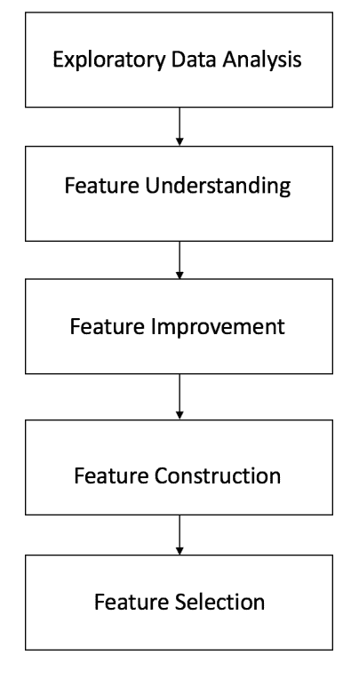

机器学习管道

这是一个机器学习管道的例子，使用了本文前面的方法。它由五个主要步骤组成:分析、理解、改进、构建和选择。在接下来的章节中，我们将关注一种新的数据转换方法，这种方法在一定程度上脱离了传统的概念。

在本书的这个阶段，读者已经准备好带着合理的信心和对性能的期望开始处理世界的数据集。接下来的两个[第 6 章](8dc49afd-2a3a-4063-9c38-ac6a049bbfe6.xhtml)、*特征转换*和[第 7 章](e1c6751c-a892-4cf3-9c54-53e9bb3e1431.xhtml)、*特征学习*、*、*将重点讲述编程和数学都相当繁重的特征工程的两个子集，具体来说就是线性代数。我们将一如既往地尽力解释本章中使用的所有代码行，并且只在必要的地方描述数学过程。

本章将讨论**特征转换**，这是一套算法，旨在改变数据的内部结构以产生数学上优越的*超级列、*，而下一章将关注使用非参数算法(不依赖于数据形状的算法)自动学习新特征的特征学习。本文的最后一章包含几个已完成的案例研究，以显示特征工程的端到端过程及其对机器学习管道的影响。

现在，让我们从讨论特征转换开始。正如我们之前提到的，特征转换是一组矩阵算法，它们将从结构上改变我们的数据，并产生本质上全新的数据矩阵。基本思想是数据集的原始特征是数据点的描述符/特征，我们应该能够创建一组新的特征，用更少的列来解释数据点。

想象一个简单的长方形房间。房间里空无一人，只有一个人体模型站在中间。人体模型从不移动，总是面向同一个方向。你的任务是全天候监控那个房间。当然，您想出了在房间中添加安全摄像头的主意，以确保所有活动都被捕捉和记录。你把一台摄像机放在房间的顶角，面朝下看着人体模特的脸，在这个过程中，摄像机捕捉到房间的大部分。用一台摄像机，你可以看到房间的几乎所有方面。问题是摄像头有盲点。例如，您将无法直接看到摄像机下方(由于其身体无法看到那里)和人体模型后面(因为假人本身挡住了摄像机的视野)。聪明的是，你在对面的顶角，人体模型的后面增加了第二个摄像头，以弥补第一个摄像头的盲点。使用两个摄像头，您现在可以从安全办公室看到超过 99%的房间。

在这个例子中，房间代表数据的原始特征空间，人体模型代表数据点，位于特征空间的某个部分。更正式地说，我要求你考虑一个具有单个数据点的三维特征空间:

*【X，Y，Z】*

试图用单个摄像机捕捉这个数据点就像压缩我们的数据集，使其只有一个新的维度，即摄像机 1 看到的数据:

*【X，Y，Z】≈【C1】*

然而，仅使用一个维度可能是不够的，因为我们能够为单个摄像头设想盲点，所以我们添加了第二个摄像头:

*【X，Y，Z】≈【C1，C2】*

这两个相机(由特征转换产生的新维度)以新的方式捕捉数据，但只用两列而不是三列就给了我们足够的信息。特征变换最困难的部分是我们对原始特征空间是最好的这一信念的怀疑。我们必须接受这样一个事实，即可能有其他数学轴和系统可以用更少的特征来描述我们的数据，甚至可能更好。


# 降维——特征转换、特征选择和特征构造

在上一节中，我提到了如何压缩数据集，使其包含更少的列来以新的方式描述数据。这听起来类似于特征选择的概念:通过去除噪声和增强信号列，从原始数据集中删除列，以创建不同的、可能更好的数据集视图。虽然特征选择和特征变换都是执行降维的方法，但值得一提的是，它们在方法上有天壤之别。

要素选择过程仅限于只能从原始列集中选择要素，而要素变换算法使用这些原始列，并以有用的方式对它们进行组合，以创建比原始数据集中的任何单个列更能描述数据的新列。因此，特征选择方法通过隔离信号列和忽略噪声列来降低维度。

特征变换方法使用原始数据集中的隐藏结构来创建新列，以产生全新的、结构上不同的数据集。这些算法创建了全新的列，这些列非常强大，我们只需要其中的几个就可以准确地解释我们的整个数据集。

我们还提到，特性转换通过生成新的列来捕获数据的本质(方差)来工作。这类似于特征构造的关键:创建新的特征以捕获数据中的潜在结构。再次，我们应该提到，这两个不同的过程使用非常不同的方法获得类似的结果。

特征构造也仅限于一次在几列之间使用简单的运算(加法、乘法等)来构造新列。这意味着任何使用传统要素构造法构造的要素都是一次仅使用原始数据集中的几列来构造的。如果我们的目标是创建足够多的特性来捕获所有可能的特性交互，那可能需要大量的额外列。例如，如果给定一个数据集有 1，000 个或更多的要素，我们将需要创建数万列来构建足够的要素，以捕获所有可能的要素交互的子集。

特征转换方法能够利用每个新超级列中所有列的少量信息，因此我们不需要创建过多的新列来捕获潜在的特征交互。由于特征变换算法的性质及其矩阵/线性代数的使用，特征变换方法从未创建比我们开始时更多的列，并且仍然能够提取特征构造列试图提取的潜在结构。

特征转换算法能够*通过*选择所有列中最好的*并将该潜在结构与一些全新的列相结合来构建*新特征。这样，我们可以认为特征变换是我们将在本文中讨论的最强大的算法集之一。话虽如此，是时候介绍一下我们书中的第一个算法和数据集:**主成分分析** ( **PCA** )和`iris`数据集了。


# 主成分分析

主成分分析是一种技术，它将具有多个相关要素的数据集投影到具有较少相关要素的坐标(轴)系统上。这些新的、不相关的特征(我之前称之为超级列)被称为**主成分** *。*主成分作为原始特征空间的替代坐标系，需要更少的特征并获取尽可能多的差异。如果我们回头参考我们的摄像机示例，主要组件由摄像机本身举例说明。

换句话说，PCA 的目标是识别数据集中的模式和潜在结构，以便创建新的列并使用这些列代替原始特征。就像在特征选择中一样，如果我们从一个大小为 *n x d* 的数据矩阵开始，其中 *n* 是观察值的数量， *d* 是原始特征的数量，我们将这个矩阵投影到一个大小为 *n x k* 的矩阵上(其中 *k < d* )。

我们的主成分产生新的列，最大化我们数据中的方差。这意味着每一列都试图解释我们数据的形状。主成分按解释的方差排序，因此第一主成分最能解释数据的方差，而第二主成分第二能解释数据的方差。目标是利用我们需要的尽可能多的组件来优化机器学习任务，无论是监督学习还是非监督学习:

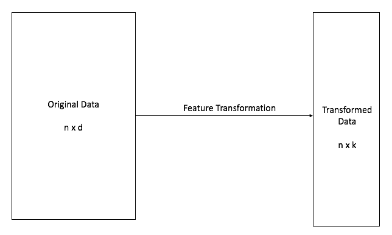

要素转换是指将数据集转换为具有相同行数但要素数量减少的矩阵。这类似于特性选择的要点，但是在这种情况下，我们关心的是全新特性的创建。

PCA 本身是一项无人监督的任务，这意味着它不利用响应列来进行投影/转换。这很重要，因为我们将使用的第二个特征变换算法将受到监督，并将利用响应变量以优化预测任务的不同方式创建超级列。


# PCA 是如何工作的

PCA 通过调用一个称为矩阵协方差的**特征值分解**的过程来工作。这背后的数学在 20 世纪 30 年代首次发表，涉及到一些多变量微积分和线性代数。为了本文的目的，我们将跳过这一部分，进入精彩的部分。

PCA 也可以对相关矩阵起作用。如果要素的比例相似，您可以选择使用相关矩阵，而使用不同比例时，协方差矩阵更有用。我们通常建议对缩放数据使用协方差矩阵。

这个过程分四步进行:

1.  创建数据集的协方差矩阵
2.  计算协方差矩阵的特征值
3.  保留前 *k* 个特征值(按特征值降序排序)
4.  使用保留的特征向量来变换新的数据点

让我们看一个使用数据集`iris`的例子。在这个相当小的数据集中，我们将逐步了解 PCA 的性能，然后是 scikit-learn 实现。


# 使用 Iris 数据集的 PCA–手动示例

`iris`数据集由 150 行和 4 列组成。每行/观察值代表一朵花，而列/特征代表该花的四种不同的数量特征。数据集的目标是拟合一个分类器，该分类器试图预测给定四个特征的三种类型的`iris`中的一种。这种花可以被认为是 setosa、virginica 或 versicolor。

这个数据集在机器学习教学领域非常常见，scikit-learn 有一个内置模块用于下载数据集:

1.  让我们首先导入模块，然后将数据集提取到一个名为`iris`的变量中:

```py
# import the Iris dataset from scikit-learn
from sklearn.datasets import load_iris
# import our plotting module
import matplotlib.pyplot as plt
%matplotlib inline

# load the Iris dataset
iris = load_iris()
```

2.  现在，让我们将提取的数据矩阵和响应变量分别存储到两个新变量`iris_X`和`iris_y`中:

```py
# create X and y variables to hold features and response column
iris_X, iris_y = iris.data, iris.target
```

3.  让我们来看看我们试图预测的花的名字:

```py
# the names of the flower we are trying to predict.
iris.target_names

array(['setosa', 'versicolor', 'virginica'], dtype='|S10')
```

4.  除了花的名称，我们还可以查看我们用来进行这些预测的特征的名称:

```py
# Names of the features
iris.feature_names

['sepal length (cm)',
 'sepal width (cm)',

 'petal length (cm)',

 'petal width (cm)']
```

5.  为了了解我们的数据看起来像什么，让我们编写一些代码来显示四个特征中的两个的数据点:

```py
# for labelling
label_dict = {i: k for i, k in enumerate(iris.target_names)}
# {0: 'setosa', 1: 'versicolor', 2: 'virginica'}

def plot(X, y, title, x_label, y_label):
 ax = plt.subplot(111)
 for label,marker,color in zip(
 range(3),('^', 's', 'o'),('blue', 'red', 'green')):

 plt.scatter(x=X[:,0].real[y == label],
 y=X[:,1].real[y == label],
 color=color,
 alpha=0.5,
 label=label_dict[label]
 )

 plt.xlabel(x_label)
 plt.ylabel(y_label)

 leg = plt.legend(loc='upper right', fancybox=True)
 leg.get_frame().set_alpha(0.5)
 plt.title(title)

plot(iris_X, iris_y, "Original Iris Data", "sepal length (cm)", "sepal width (cm)")
```

以下是上述代码的输出:

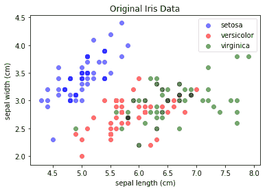

现在让我们对`iris`数据集进行 PCA，以获得我们的主成分。回想一下，这发生在四个步骤中。


# 创建数据集的协方差矩阵

为了计算`iris`的协方差矩阵，我们将首先计算基于特征的均值向量(供将来使用)，然后使用 NumPy 计算我们的协方差矩阵。

协方差矩阵是一个 *d x d* 矩阵(具有与行数和列数相同的特征数的方阵),表示每个特征之间的特征交互。它非常类似于相关矩阵:

```py
# Calculate a PCA manually

# import numpy
import numpy as np

# calculate the mean vector
mean_vector = iris_X.mean(axis=0)
print mean_vector
[ 5.84333333  3.054       3.75866667  1.19866667]

# calculate the covariance matrix
cov_mat = np.cov((iris_X-mean_vector).T)
print cov_mat.shape
(4, 4)
```

变量`cov_mat`存储我们的 4 x 4 协方差矩阵。


# 计算协方差矩阵的特征值

NumPy 是一个方便的函数，它计算我们可以使用的特征向量和特征值，以获得我们的`iris`数据集的主要成分:

```py
# calculate the eigenvectors and eigenvalues of our covariance matrix of the iris dataset
eig_val_cov, eig_vec_cov = np.linalg.eig(cov_mat)

# Print the eigen vectors and corresponding eigenvalues
# in order of descending eigenvalues
for i in range(len(eig_val_cov)):
 eigvec_cov = eig_vec_cov[:,i]
 print 'Eigenvector {}: \n{}'.format(i+1, eigvec_cov)
 print 'Eigenvalue {} from covariance matrix: {}'.format(i+1, eig_val_cov[i])
 print 30 * '-'

Eigenvector 1: 
[ 0.36158968 -0.08226889  0.85657211  0.35884393]

Eigenvalue 1 from covariance matrix: 4.22484076832

------------------------------

Eigenvector 2: 

[-0.65653988 -0.72971237  0.1757674   0.07470647]

Eigenvalue 2 from covariance matrix: 0.242243571628

------------------------------

Eigenvector 3: 

[-0.58099728  0.59641809  0.07252408  0.54906091]

Eigenvalue 3 from covariance matrix: 0.0785239080942

------------------------------

Eigenvector 4: 

[ 0.31725455 -0.32409435 -0.47971899  0.75112056]

Eigenvalue 4 from covariance matrix: 0.023683027126

------------------------------
```


# 保留前 k 个特征值(按降序排列)

现在我们有了四个特征值，我们将选择适当的数量来保留它们，以考虑它们是主成分。如果我们愿意，我们可以选择全部四个，但是我们通常希望选择一个比原始特征数量少的数量。但是什么是正确的数字呢？我们可以进行网格搜索并使用蛮力方法找到答案，但是，我们的武器库中还有另一个工具，叫做**scree plot** 。

scree 图是一个简单的线形图，显示了每个主成分在数据中解释的总方差的百分比。为了构建该图，我们将按照降序对特征值进行排序，并绘制由每个分量和之前所有分量解释的*累积*方差。在`iris`的情况下，我们在碎石图上有四个点，每个主成分一个点。每个成分本身解释了捕获的总方差的一个百分比，当百分比相加时，所有成分应占数据集中总方差的 100%。

让我们计算由每个特征向量(主成分)解释的方差的百分比，方法是取与该特征向量相关联的特征值，并将其除以所有特征值之和:

```py
# the percentages of the variance captured by each eigenvalue
# is equal to the eigenvalue of that components divided by
# the sum of all eigen values

explained_variance_ratio = eig_val_cov/eig_val_cov.sum()
explained_variance_ratio

array([ 0.92461621,  0.05301557,  0.01718514,  0.00518309])
```

这告诉我们，我们的四个主要成分在它们所占的方差数量上有很大的不同。第一主成分作为单个特征/列，能够解释数据中超过 92%的方差。这太惊人了！这意味着这个超级柱理论上可以完成四个原始柱的几乎所有工作。

为了可视化我们的 scree 图，让我们创建一个图，其中四个主要成分在 *x* 轴上，累积方差在 *y* 轴上。对于每个数据点， *y* 位置将代表使用所有主成分解释的方差的总百分比，直到该主成分:

```py
# Scree Plot

plt.plot(np.cumsum(explained_variance_ratio))
plt.title('Scree Plot')
plt.xlabel('Principal Component (k)')
plt.ylabel('% of Variance Explained <= k')
```

以下是上述代码的输出:


这告诉我们，前两个分量本身占原始数据集总方差的近 98%，这意味着如果我们只使用前两个特征向量，并将它们用作新的主分量，那么我们将处于良好状态。我们将能够将数据集的大小缩减一半(从四列缩减到两列)，同时保持性能的完整性并提高性能。在接下来的章节中，我们将仔细研究机器学习的例子来验证这些理论概念。

特征值分解总是会产生和我们拥有的特征一样多的特征向量。一旦所有主成分都被计算出来，就由我们来选择我们希望使用多少主成分。这突出了一个事实，即 PCA，像本文中的大多数其他算法一样，是半监督的，需要一些人工输入。


# 使用保留的特征向量来变换新的数据点

一旦我们决定保留两个主要成分(无论我们是使用网格搜索模块还是使用 scree 图分析来找到最佳数量都没有关系)，我们必须能够使用这些成分来转换来自样本数据点的输入。为此，让我们首先分离出顶部的两个特征向量，并将它们存储在一个名为`top_2_eigenvectors`的新变量中:

```py
# store the top two eigenvectors in a variable
top_2_eigenvectors = eig_vec_cov[:,:2].T

# show the transpose so that each row is a principal component, we have two rows == two components
top_2_eigenvectors

array([[ 0.36158968, -0.08226889,  0.85657211,  0.35884393],

       [-0.65653988, -0.72971237,  0.1757674 ,  0.07470647]])
```

该数组表示顶部的两个特征向量:

*   `[ 0.36158968, -0.08226889, 0.85657211, 0.35884393]`
*   `[-0.65653988, -0.72971237, 0.1757674 , 0.07470647]]`

有了这些向量，我们就可以通过将两个矩阵相乘来使用它们将我们的数据投影到新的和改进的超级数据集:`iris_X`和`top_2_eigenvectors`。下图向我们展示了如何确保这些数字是正确的:

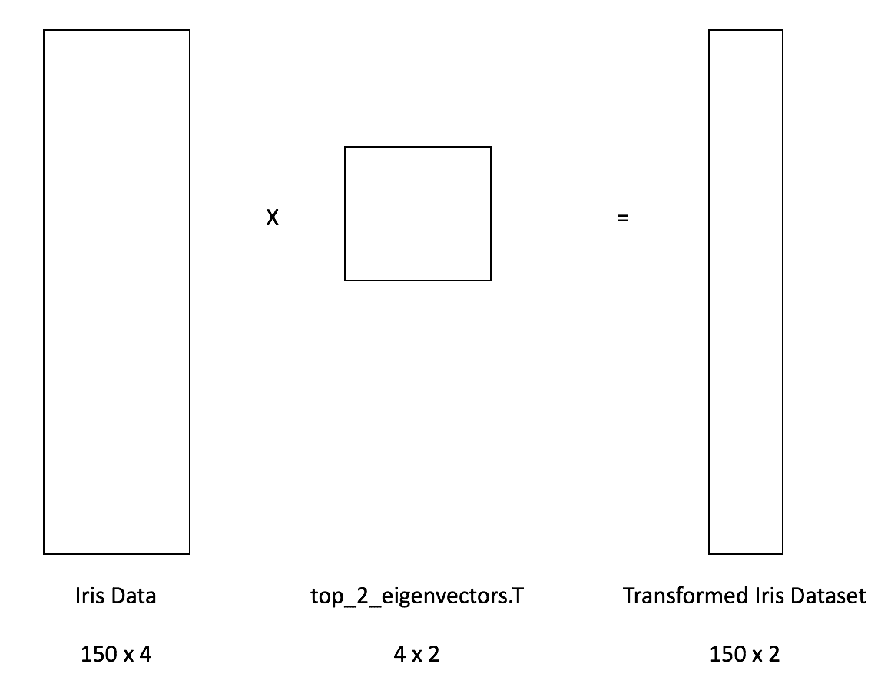

上图显示了如何利用主成分将数据集从其原始特征空间转换到新的坐标系。在`iris`的情况下，我们采用原始的 150 x 4 数据集，并将其乘以顶部两个特征向量的转置。我们利用转置来确保矩阵大小匹配。结果是一个行数相同但列数减少的矩阵。每行乘以两个主成分。

通过将这些矩阵相乘，我们将*原始数据集*投影到这个新的二维空间:

```py
# to transform our data from having shape (150, 4) to (150, 2)
# we will multiply the matrices of our data and our eigen vectors together

np.dot(iris_X, top_2_eigenvectors.T)[:5,]

array([[ 2.82713597, -5.64133105],

       [ 2.79595248, -5.14516688],

       [ 2.62152356, -5.17737812],

       [ 2.7649059 , -5.00359942],

       [ 2.78275012, -5.64864829]])
```

仅此而已。我们已经将四维虹膜数据转换为只有两列的新矩阵。这个新矩阵可以代替我们机器学习管道中的原始数据集。


# Scikit-learn 的 PCA

像往常一样，scikit-learn 通过在一个易于使用的转换器中实现这个过程来节省时间，这样我们就不必在每次希望使用这个强大的过程时都经历手动过程:

1.  我们可以从 scikit-learn 的分解模块中导入它:

```py
# scikit-learn's version of PCA
from sklearn.decomposition import PCA
```

2.  为了模拟我们用`iris`数据集执行的过程，让我们用两个组件实例化一个`PCA`对象:

```py
# Like any other sklearn module, we first instantiate the class
pca = PCA(n_components=2)
```

3.  现在，我们可以用 PCA 来拟合数据:

```py
# fit the PCA to our data
pca.fit(iris_X)
```

4.  让我们来看看 PCA 对象的一些属性，看看它们是否与我们在手工过程中实现的相匹配。让我们看一下我们对象的`components_ attribute`,看看在没有`top_2_eigenvectors`变量的情况下是否匹配:

```py
pca.components_

array([[ 0.36158968, -0.08226889,  0.85657211,  0.35884393],

       [ 0.65653988,  0.72971237, -0.1757674 , -0.07470647]])

# note that the second column is the negative of the manual process
# this is because eignevectors can be positive or negative
# It should have little to no effect on our machine learning pipelines
```

5.  我们的两个分量几乎完全匹配之前的变量`top_2_eigenvectors`。我们说几乎是因为第二个分量实际上是我们计算的特征向量的负值。这很好，因为从数学上讲，两个特征向量都是 100%有效的，并且仍然实现了创建不相关列的主要目标。
6.  到目前为止，这个过程比我们以前做的要痛苦得多。为了完成这个过程，我们需要使用 PCA 对象的 transform 方法将数据投影到新的二维平面上:

```py
pca.transform(iris_X)[:5,]

array([[-2.68420713,  0.32660731],

       [-2.71539062, -0.16955685],

       [-2.88981954, -0.13734561],

       [-2.7464372 , -0.31112432],

       [-2.72859298,  0.33392456]])

# sklearn PCA centers the data first while transforming, so these numbers won't match our manual process.
```

请注意，我们的预测数据与我们之前获得的预测数据完全不匹配。这是因为 scikit-learn 版本的 PCA 在预测阶段自动将数据居中，从而改变了结果。

7.  我们可以通过修改我们的版本中的一行来模拟这一点:

```py
# manually centering our data to match scikit-learn's implementation of PCA
np.dot(iris_X-mean_vector, top_2_eigenvectors.T)[:5,]

array([[-2.68420713, -0.32660731],

       [-2.71539062,  0.16955685],

       [-2.88981954,  0.13734561],

       [-2.7464372 ,  0.31112432],

       [-2.72859298, -0.33392456]])
```

8.  让我们快速绘制投影的`iris`数据，并比较数据集在投影到我们的新坐标系之前和之后的样子:

```py
# Plot the original and projected data
plot(iris_X, iris_y, "Original Iris Data", "sepal length (cm)", "sepal width (cm)")
plt.show()
plot(pca.transform(iris_X), iris_y, "Iris: Data projected onto first two PCA components", "PCA1", "PCA2")
```

以下是上述代码的输出:

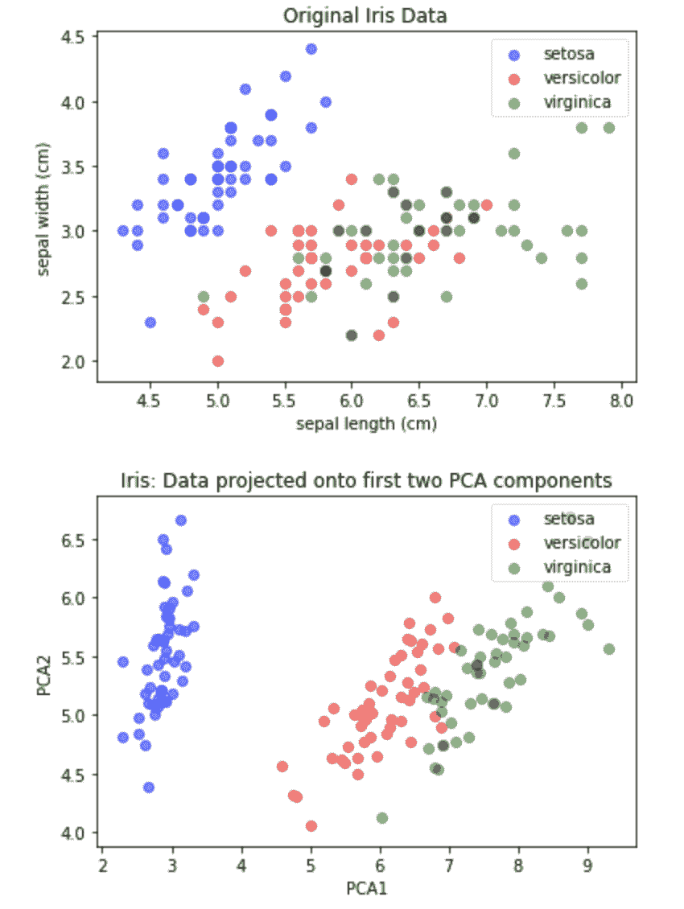

在我们的原始数据集中，我们可以沿着前两列看到原始特征空间中的虹膜。请注意，在我们的投影空间中，花彼此之间的距离更远，并且也绕着它们的轴旋转了一点。看起来数据簇是直立的。这种现象是因为我们的主要成分正在努力捕捉数据中的差异，这在我们的图表中有所体现。

我们可以提取每个组成部分解释的差异量，就像我们在手工示例中所做的那样:

```py
# percentage of variance in data explained by each component
# same as what we calculated earlier
pca.explained_variance_ratio_

array([ 0.92461621,  0.05301557])
```

现在，我们可以使用 scikit-learn 的 PCA 执行所有基本特征，让我们使用这些信息来展示 PCA 的主要优势之一:去相关特性。

本质上，在特征值分解过程中，得到的主分量彼此垂直，这意味着它们彼此线性独立。

这是一个主要的好处，因为许多机器学习模型和预处理技术假设输入的特征是独立的，而利用 PCA 为我们确保了这一点。

为了说明这一点，让我们创建原始`iris`数据集的相关矩阵，并找出每个要素之间的平均线性相关系数。然后，我们将对 PCA 投影数据集进行同样的操作，并比较这些值。我们预计投影数据集的平均相关性应该更接近于零，这意味着它们都是线性独立的。

让我们从计算原始`iris`数据集的相关矩阵开始:

1.  这将是一个 4 x 4 矩阵，其中的值表示每个特征之间的相关系数:

```py
# show how pca attempts to eliminate dependence between columns

# show the correlation matrix of the original dataset
np.corrcoef(iris_X.T)

array([[ 1\.        , -0.10936925,  0.87175416,  0.81795363],

       [-0.10936925,  1\.        , -0.4205161 , -0.35654409],

       [ 0.87175416, -0.4205161 ,  1\.        ,  0.9627571 ],

       [ 0.81795363, -0.35654409,  0.9627571 ,  1\.        ]])
```

2.  然后，我们将提取对角线 1 以上的所有值，用它们来找出所有特征之间的平均相关性:

```py
# correlation coefficients above the diagonal
 np.corrcoef(iris_X.T)[[0, 0, 0, 1, 1], [1, 2, 3, 2, 3]]

 array([-0.10936925, 0.87175416, 0.81795363, -0.4205161 , -0.35654409])
```

3.  最后，我们将取这个数组的平均值:

```py
# average correlation of original iris dataset.
 np.corrcoef(iris_X.T)[[0, 0, 0, 1, 1], [1, 2, 3, 2, 3]].mean()

 0.16065567094168495
```

4.  原始特征的平均相关系数是`.16`，很小，但绝对不为零。现在，让我们创建一个包含所有四个主要成分的完整 PCA:

```py
# capture all four principal components
 full_pca = PCA(n_components=4)

 # fit our PCA to the iris dataset
 full_pca.fit(iris_X)
```

5.  完成后，我们将使用与之前相同的方法，计算新的假设线性无关的列之间的平均相关系数:

```py
 pca_iris = full_pca.transform(iris_X)
 # average correlation of PCAed iris dataset.
 np.corrcoef(pca_iris.T)[[0, 0, 0, 1, 1], [1, 2, 3, 2, 3]].mean()
 # VERY close to 0 because columns are independent from one another
 # This is an important consequence of performing an eigenvalue decomposition

 7.2640855025557061e-17 # very close to 0
```

这显示了投影到主成分上的数据如何最终具有较少的相关特征，这通常在机器学习中是有帮助的。


# 居中和缩放数据如何影响 PCA

就像我们在本文前面讨论过的许多变换一样，要素的缩放对变换来说很重要。PCA 也不例外。之前我们提到 scikit-learn 版本的 PCA 在预测阶段会自动将数据居中，但是为什么在拟合的时候不这样做呢？如果 scikit-learn PCA 模块在 predict 方法中遇到了将数据居中的麻烦，为什么它在计算特征向量时没有这样做？这里的假设是中心数据不影响主成分。让我们来测试一下:

1.  让我们从 scikit 中导入`StandardScaler`模块，学习并居中`iris`数据集:

```py
# import our scaling module
 from sklearn.preprocessing import StandardScaler
 # center our data, not a full scaling
 X_centered = StandardScaler(with_std=False).fit_transform(iris_X)

 X_centered[:5,]

 array([[-0.74333333, 0.446 , -2.35866667, -0.99866667], [-0.94333333, -0.054 , -2.35866667, -0.99866667], [-1.14333333, 0.146 , -2.45866667, -0.99866667], [-1.24333333, 0.046 , -2.25866667, -0.99866667], [-0.84333333, 0.546 , -2.35866667, -0.99866667]])
```

2.  让我们来看看现在居中的数据集:

```py
# Plot our centered data
 plot(X_centered, iris_y, "Iris: Data Centered", "sepal length (cm)", "sepal width (cm)")
```

我们得到代码的如下输出:

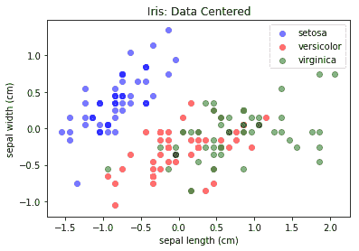

3.  然后，我们可以将之前实例化的 PCA 类(将`n_components`设置为`2`)与我们居中的`iris`数据集相匹配:

```py
# fit our PCA (with n_components still set to 2) on our centered data
 pca.fit(X_centered)
```

4.  完成后，我们可以调用 PCA 模块的`components_ attribute`,并将得到的主成分与原始`iris`数据集得到的主成分进行比较:

```py
# same components as before
 pca.components_

 array([[ 0.36158968, -0.08226889, 0.85657211, 0.35884393], [ 0.65653988, 0.72971237, -0.1757674 , -0.07470647]])
```

5.  看起来，由中心数据产生的电脑与我们之前看到的电脑完全相同。为了澄清这一点，让我们使用 PCA 模块转换居中的数据，并查看前五行，看它们是否与之前获得的投影匹配:

```py
# same projection when data are centered because PCA does this automatically
 pca.transform(X_centered)[:5,]

 array([[-2.68420713, 0.32660731], [-2.71539062, -0.16955685], [-2.88981954, -0.13734561], [-2.7464372 , -0.31112432], [-2.72859298, 0.33392456]])
```

6.  各行匹配！如果我们看一下预计的中心数据和解释的方差比率的图表，我们会发现它们也是匹配的:

```py
# Plot PCA projection of centered data, same as previous PCA projected data
 plot(pca.transform(X_centered), iris_y, "Iris: Data projected onto first two PCA components with centered data", "PCA1", "PCA2")

```

我们得到以下输出:

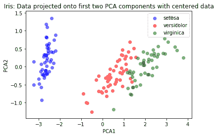

对于百分比差异，我们实现了以下内容:

```py
 # percentage of variance in data explained by each component
 pca.explained_variance_ratio_

 array([ 0.92461621, 0.05301557])
```

发生这种情况的原因是因为矩阵和它们居中的对应物具有相同的协方差矩阵。如果两个矩阵有相同的协方差矩阵，那么它们将有相同的特征值分解。这就是为什么 scikit-learn 版本的 PCA 在查找特征值和特征向量时不需要将数据居中，因为不管是否居中，它们都会找到相同的特征值和特征向量，所以为什么要添加额外的、不必要的步骤呢？

现在，让我们来看看当我们使用标准 z 分数缩放来缩放数据时，我们的主成分会发生什么变化:

```py
# doing a normal z score scaling
 X_scaled = StandardScaler().fit_transform(iris_X)

 # Plot scaled data
 plot(X_scaled, iris_y, "Iris: Data Scaled", "sepal length (cm)", "sepal width (cm)")
```

我们得到如下输出:


值得一提的是，在这一点上，我们已经绘制了虹膜数据的原始格式，居中，现在完全缩放。在每张图中，数据点完全相同，但轴不同。这是意料之中的。居中和缩放数据不会改变数据的形状，但它会影响我们的特征工程和机器学习管道的特征交互。

让我们根据新调整的数据安装 PCA 模块，看看我们的电脑是否有所不同:

```py
# fit our 2-dimensional PCA on our scaled data
 pca.fit(X_scaled)

 # different components as cenetered data
 pca.components_

 array([[ 0.52237162, -0.26335492, 0.58125401, 0.56561105], [ 0.37231836, 0.92555649, 0.02109478, 0.06541577]])
```

和以前一样，这些是不同的组件。PCA 是比例不变的，这意味着比例影响成分。注意，当我们说缩放时，我们指的是居中并除以标准偏差。让我们将数据集投影到新组件上，并确保新投影的数据确实不同:

```py
# different projection when data are scaled
 pca.transform(X_scaled)[:5,]

 array([[-2.26454173, 0.5057039 ], [-2.0864255 , -0.65540473], [-2.36795045, -0.31847731], [-2.30419716, -0.57536771], [-2.38877749, 0.6747674 ]])
```

最后，让我们来看看我们解释的方差比:

```py
# percentage of variance in data explained by each component
 pca.explained_variance_ratio_

 array([ 0.72770452, 0.23030523])
```

这很有意思。当执行特征工程/机器学习时，缩放我们的数据通常是一个好主意，并且通常我们向我们的读者推荐它，但是为什么我们的第一个组件具有比以前低得多的解释方差比？

这是因为一旦我们调整了数据，各列之间的协方差变得更加一致，每个主成分解释的方差分散开来，而不是固化在一台 PC 中。在实践和生产中，我们通常建议缩放，但是在缩放和未缩放的数据上测试管道的性能是一个好主意。

让我们来看看我们的缩放数据中的投影虹膜数据:

```py
# Plot PCA projection of scaled data
 plot(pca.transform(X_scaled), iris_y, "Iris: Data projected onto first two PCA components", "PCA1", "PCA2")
```

我们得到以下输出:


这很微妙，但是如果您查看此图表，并将其与原始数据和居中数据下的先前投影数据图进行比较，您会注意到它们之间的细微差异。


# 对主要成分的深入研究

在我们研究第二个特征变换算法之前，重要的是要了解主成分是如何解释的:

1.  我们的`iris`数据集是一个 150×4 的矩阵，当`n_components`被设置为`2`时，当我们计算我们的 PCA 分量时，我们获得了一个大小为`2 x 4`的分量矩阵:

```py
# how to interpret and use components
 pca.components_ # a 2 x 4 matrix

 array([[ 0.52237162, -0.26335492, 0.58125401, 0.56561105], [ 0.37231836, 0.92555649, 0.02109478, 0.06541577]])
```

2.  就像我们手动计算特征向量的例子一样，`components_`属性可以通过矩阵乘法来投影数据。我们通过将原始数据集与`components_ matrix`的转置相乘来实现:

```py
# Multiply original matrix (150 x 4) by components transposed (4 x 2) to get new columns (150 x 2)
 np.dot(X_scaled, pca.components_.T)[:5,]

 array([[-2.26454173, 0.5057039 ], [-2.0864255 , -0.65540473], [-2.36795045, -0.31847731], [-2.30419716, -0.57536771], [-2.38877749, 0.6747674 ]])
```

3.  我们在这里调用转置函数，以便矩阵维数匹配。底层发生的事情是，对于每一行，我们都在计算原始行和每个主成分之间的点积。点积的结果成为新行的元素:

```py
# extract the first row of our scaled data
 first_scaled_flower = X_scaled[0]

 # extract the two PC's
 first_Pc = pca.components_[0]
 second_Pc = pca.components_[1]

 first_scaled_flower.shape # (4,)
 print first_scaled_flower # array([-0.90068117, 1.03205722, -1.3412724 , -1.31297673])

 # same result as the first row of our matrix multiplication
 np.dot(first_scaled_flower, first_Pc), np.dot(first_scaled_flower, second_Pc)

 (-2.2645417283949003, 0.50570390277378274)
```

4.  幸运的是，我们可以依靠内置的转换方法来完成这项工作:

```py
# This is how the transform method works in pca
 pca.transform(X_scaled)[:5,]

 array([[-2.26454173, 0.5057039 ], [-2.0864255 , -0.65540473], [-2.36795045, -0.31847731], [-2.30419716, -0.57536771], [-2.38877749, 0.6747674 ]])
```

换句话说，我们可以将每个组件解释为原始列的组合。在这种情况下，我们的第一个主成分是:

```py
[ 0.52237162, -0.26335492, 0.58125401, 0.56561105]
```

第一朵有刻度的花是:

```py
[-0.90068117, 1.03205722, -1.3412724 , -1.31297673]
```

要获得投影数据第一行的第一个元素，我们可以使用以下公式:


事实上，一般来说，对于任何具有坐标(a，b，c，d)的花，其中 a 是虹膜的萼片长度，b 是萼片宽度，c 是花瓣长度，d 是花瓣宽度(这个顺序取自之前的`iris.feature_names`),新坐标系的第一个值可以通过以下公式计算:


让我们更进一步，将空间中的组件与我们的数据一起可视化。我们将截断我们的原始数据，只保留它的两个原始特征，萼片长度和萼片宽度。我们这样做的原因是，我们可以更容易地可视化数据，而不必担心四个维度:

```py
# cut out last two columns of the original iris dataset
 iris_2_dim = iris_X[:,2:4]

 # center the data
 iris_2_dim = iris_2_dim - iris_2_dim.mean(axis=0)

 plot(iris_2_dim, iris_y, "Iris: Only 2 dimensions", "sepal length", "sepal width")
```

我们得到如下输出:

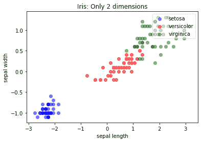

我们可以在左下角看到一簇花( **setosas** )，在右上角看到一大簇由**云芝**和**弗吉尼亚**组成的花。很明显，数据作为一个整体，沿着从左下方到右上方的对角线延伸。希望我们的主要成分也能注意到这一点，并相应地重新排列我们的数据。

让我们实例化一个包含两个主成分的 PCA 类，然后使用该类将截断的**虹膜数据**转换为新列:

```py
# instantiate a PCA of 2 components
 twodim_pca = PCA(n_components=2)

 # fit and transform our truncated iris data
 iris_2_dim_transformed = twodim_pca.fit_transform(iris_2_dim)

 plot(iris_2_dim_transformed, iris_y, "Iris: PCA performed on only 2 dimensions", "PCA1", "PCA2")
```

我们得到如下输出:

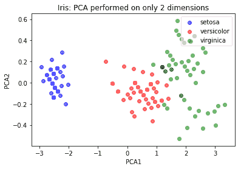

**PCA 1** ，我们的第一个主成分，应该携带其中的大部分方差，这就是为什么投影数据主要分布在新的 *x* 轴上。注意 *x* 轴的刻度在-3 和 3 之间，而 *y* 轴的刻度仅在-0.4 和 0.6 之间。为了进一步阐明这一点，下面的代码块将绘制原始和投影虹膜散点图，以及在原始坐标系和新坐标系中叠加主成分`twodim_pca`。

目标是将组件解释为导向矢量，显示数据移动的方式，并显示这些导向矢量如何变成垂直坐标系:

```py
# This code is graphing both the original iris data and the projected version of it using PCA.
 # Moreover, on each graph, the principal components are graphed as vectors on the data themselves
 # The longer of the arrows is meant to describe the first principal component and
 # the shorter of the arrows describes the second principal component
 def draw_vector(v0, v1, ax):
 arrowprops=dict(arrowstyle='->',linewidth=2,
 shrinkA=0, shrinkB=0)
 ax.annotate('', v1, v0, arrowprops=arrowprops)

 fig, ax = plt.subplots(2, 1, figsize=(10, 10))
 fig.subplots_adjust(left=0.0625, right=0.95, wspace=0.1)

 # plot data
 ax[0].scatter(iris_2_dim[:, 0], iris_2_dim[:, 1], alpha=0.2)
 for length, vector in zip(twodim_pca.explained_variance_, twodim_pca.components_):
 v = vector * np.sqrt(length) # elongdate vector to match up to explained_variance
 draw_vector(twodim_pca.mean_,
 twodim_pca.mean_ + v, ax=ax[0])
 ax[0].set(xlabel='x', ylabel='y', title='Original Iris Dataset',
 xlim=(-3, 3), ylim=(-2, 2))

 ax[1].scatter(iris_2_dim_transformed[:, 0], iris_2_dim_transformed[:, 1], alpha=0.2)
 for length, vector in zip(twodim_pca.explained_variance_, twodim_pca.components_):
 transformed_component = twodim_pca.transform([vector])[0] # transform components to new coordinate system
 v = transformed_component * np.sqrt(length) # elongdate vector to match up to explained_variance
 draw_vector(iris_2_dim_transformed.mean(axis=0),
 iris_2_dim_transformed.mean(axis=0) + v, ax=ax[1])
 ax[1].set(xlabel='component 1', ylabel='component 2',
 title='Projected Data',
 xlim=(-3, 3), ylim=(-1, 1))

```

这是使用 PCA 的**原始虹膜数据集**和**投影数据**:

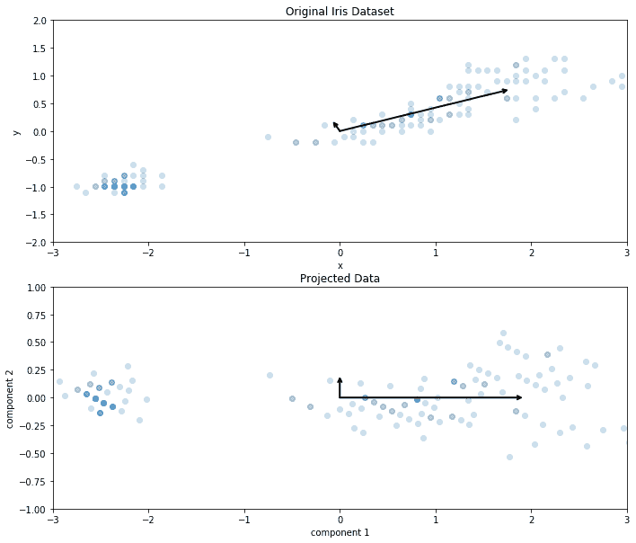

顶部的图表显示了原始数据的轴系统中存在的主要成分。它们不是垂直的，而是指向数据自然遵循的方向。我们可以看到，两个向量中较长的一个，即第一主成分，明显地沿着虹膜数据最遵循的对角线方向。

第二主成分指向一个方差方向，它解释了数据形状的一部分，但不是全部。下图显示了投射到这些新组件上的虹膜数据，这些新组件伴随有相同的组件，但是充当垂直坐标系。它们成为新的 *x* 和 *y* 轴。

PCA 是一种特征转换工具，它允许我们将全新的超特征构建为先前特征的线性组合。我们已经看到，这些分量包含了最大的变化量，并作为我们数据的新坐标系。我们的下一个特征变换算法是相似的，因为它也将从我们的数据中提取成分，但它是以机器学习类型的方式这样做的。


# 线性判别分析

**线性判别分析** ( **LDA** )是一种特征变换技术，也是一种监督分类器。它通常用作分类管道的预处理步骤。像 PCA 一样，LDA 的目标是提取新的坐标系并将数据集投影到低维空间。LDA 和 PCA 的主要区别在于，LDA 不是像 PCA 那样关注数据整体的方差，而是优化低维空间以获得最佳的类可分性。这意味着新的坐标系在为分类模型寻找决策边界时更有用，这对我们构建分类管道来说是完美的。

LDA 非常有用的原因是，基于类可分性的分离有助于我们避免机器学习管道中的过度拟合。这也被称为*防止维度诅咒*。LDA 还降低了计算成本。


# LDA 如何工作

LDA 是一种降维工具，就像 PCA 一样，但是 LDA 不是计算整体数据的协方差矩阵的特征值，而是计算类内和类间散布矩阵的特征值和特征向量。执行 LDA 可以分为五个步骤:

1.  计算每一类的平均向量

2.  计算类内和类间散布矩阵

3.  计算特征值和特征向量为

4.  保留前 k 个特征向量，按特征值降序排列

5.  使用顶部特征向量投影到新空间

让我们看一个例子。


# 计算每一类的平均向量

首先，我们需要为每个类计算一个列方向的均值向量。一个用于`setosa`，一个用于`versicolor`，另一个用于`virginica`:

```py
# calculate the mean for each class
 # to do this we will separate the iris dataset into three dataframes
 # one for each flower, then we will take one's mean columnwise
 mean_vectors = []
 for cl in [0, 1, 2]:
 class_mean_vector = np.mean(iris_X[iris_y==cl], axis=0)
 mean_vectors.append(class_mean_vector)
 print label_dict[cl], class_mean_vector

 setosa [ 5.006 3.418 1.464 0.244]
 versicolor [ 5.936 2.77 4.26 1.326]
 virginica [ 6.588 2.974 5.552 2.026]
```


# 计算类内和类间散布矩阵

我们现在将计算一个**类内**散布矩阵，定义如下:

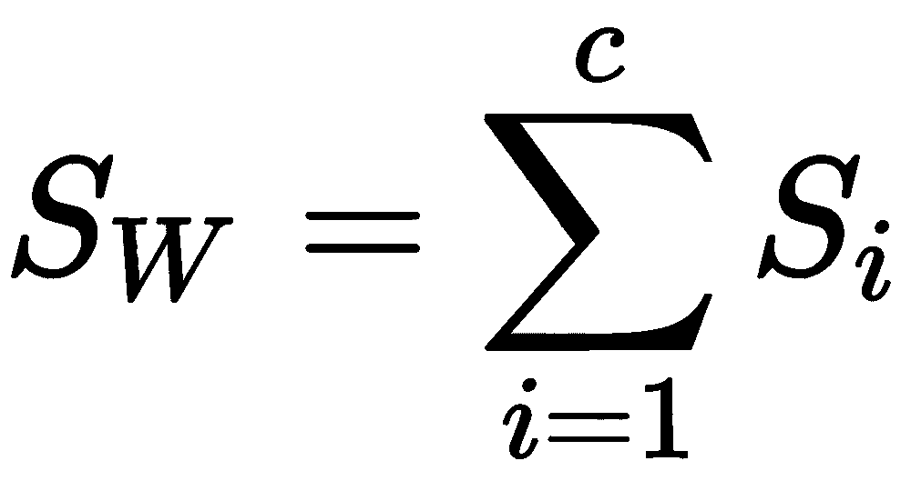

其中我们将*S[I]定义为:*


在这里， *m* [*i*] 表示第 *i* 类的平均向量，以及由以下定义的**类间散布**矩阵:


*m* 是数据集的总体均值，*m[I]是每一类的样本均值，*N[I]是每一类的样本量(每一类的观测值数量):**

```py
# Calculate within-class scatter matrix
 S_W = np.zeros((4,4))
 # for each flower
 for cl,mv in zip([0, 1, 2], mean_vectors):
 # scatter matrix for every class, starts with all 0's
 class_sc_mat = np.zeros((4,4))
 # for each row that describes the specific flower
 for row in iris_X[iris_y == cl]:
 # make column vectors
 row, mv = row.reshape(4,1), mv.reshape(4,1)
 # this is a 4x4 matrix
 class_sc_mat += (row-mv).dot((row-mv).T)
 # sum class scatter matrices
 S_W += class_sc_mat

 S_W

 array([[ 38.9562, 13.683 , 24.614 , 5.6556], [ 13.683 , 17.035 , 8.12 , 4.9132], [ 24.614 , 8.12 , 27.22 , 6.2536], [ 5.6556, 4.9132, 6.2536, 6.1756]])

 # calculate the between-class scatter matrix

 # mean of entire dataset
 overall_mean = np.mean(iris_X, axis=0).reshape(4,1)

 # will eventually become between class scatter matrix
 S_B = np.zeros((4,4))
 for i,mean_vec in enumerate(mean_vectors):
 # number of flowers in each species
 n = iris_X[iris_y==i,:].shape[0]
 # make column vector for each specied
 mean_vec = mean_vec.reshape(4,1)
 S_B += n * (mean_vec - overall_mean).dot((mean_vec - overall_mean).T)

 S_B

 array([[ 63.2121, -19.534 , 165.1647, 71.3631], [ -19.534 , 10.9776, -56.0552, -22.4924], [ 165.1647, -56.0552, 436.6437, 186.9081], [ 71.3631, -22.4924, 186.9081, 80.6041]])
```

类内和类间散布矩阵是 ANOVA 检验中一个步骤的扩展(在前一章中提到过)。这里的想法是将我们的虹膜数据集分解成两个不同的部分。

一旦我们计算了这些矩阵，我们就可以进入下一步，使用矩阵代数来提取线性判别式。


# 计算 SW-1SB 的特征值和特征向量

正如我们在 PCA 中所做的那样，我们依赖于特定矩阵的特征值分解。在 LDA 的情况下，我们将分解矩阵 **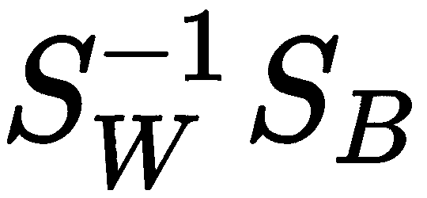** :

```py
# calculate eigenvalues and eigenvectors of S−1W x SB
 eig_vals, eig_vecs = np.linalg.eig(np.dot(np.linalg.inv(S_W), S_B))
 eig_vecs = eig_vecs.real
 eig_vals = eig_vals.real

 for i in range(len(eig_vals)):
 eigvec_sc = eig_vecs[:,i]
 print 'Eigenvector {}: {}'.format(i+1, eigvec_sc)
 print 'Eigenvalue {:}: {}'.format(i+1, eig_vals[i])
 print

 Eigenvector 1: [-0.2049 -0.3871 0.5465 0.7138]
 Eigenvalue 1: 32.2719577997 Eigenvector 2: [ 0.009 0.589 -0.2543 0.767 ] Eigenvalue 2: 0.27756686384 Eigenvector 3: [ 0.2771 -0.3863 -0.4388 0.6644] Eigenvalue 3: -6.73276389619e-16 . # basically 0 Eigenvector 4: [ 0.2771 -0.3863 -0.4388 0.6644] Eigenvalue 4: -6.73276389619e-16 . # basically 0
```

注意第三和第四特征值基本为零。这是因为 LDA 的工作方式是在我们的类之间划分决策界限。因为我们在 iris 中只有三个类，所以我们最多只能画出两个决策边界。一般来说，将 LDA 拟合到具有 n 个类的数据集只会产生 n-1 个分量。


# 通过按特征值降序排序来保留前 k 个特征向量

与 PCA 一样，我们只希望保留完成大部分工作的特征向量:

```py
# keep the top two linear discriminants
 linear_discriminants = eig_vecs.T[:2]

 linear_discriminants

 array([[-0.2049, -0.3871, 0.5465, 0.7138], [ 0.009 , 0.589 , -0.2543, 0.767 ]])
```

我们可以通过将每个特征值除以所有特征值的总和来查看每个分量/线性判别式中解释方差的比率:

```py
#explained variance ratios
 eig_vals / eig_vals.sum()

 array([ .99147, .0085275, -2.0685e-17, -2.0685e-17])
```

看起来第一个组件完成了绝大部分工作，并独自保存了超过 99%的信息。


# 使用顶部特征向量投影到新空间

现在我们有了组件，让我们绘制投影的虹膜数据，首先使用特征向量将原始数据投影到新空间，然后调用我们的绘图函数:

```py
# LDA projected data
 lda_iris_projection = np.dot(iris_X, linear_discriminants.T)
 lda_iris_projection[:5,]

 plot(lda_iris_projection, iris_y, "LDA Projection", "LDA1", "LDA2")
```

我们得到以下输出:

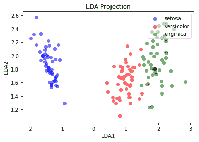

请注意，在该图中，数据*几乎完全直立*(甚至超过 PCA 投影数据)，好像 LDA 组件试图通过绘制这些决策边界并提供特征向量/线性判别式来帮助机器学习模型尽可能多地分离花朵。这有助于我们将数据投射到尽可能分隔类别的空间中。


# 如何在 scikit-learn 中使用 LDA

LDA 在 scikit 中有一个实现——学会避免这个非常费力的过程。它很容易导入:

```py
from sklearn.discriminant_analysis import LinearDiscriminantAnalysis
```

从那里，让我们使用它来拟合和转换我们的原始虹膜数据，并绘制生成的投影数据集，以便我们可以将其与使用 PCA 的投影进行比较。在下面的代码块中最值得注意的是 fit 函数需要两个输入。

回想一下我们提到过 LDA 实际上是一个伪装成特征转换算法的分类器。与 PCA 不同，PCA 以无监督的方式(没有响应变量)寻找成分，LDA 将试图寻找关于的最佳坐标系*，该响应变量优化了类别可分性。这意味着 LDA 只有在我们有一个响应变量时才起作用。如果我们这样做了，我们将响应作为第二个输入输入到我们的 fit 方法中，并让 LDA 完成它的工作:*

```py
# instantiate the LDA module
 lda = LinearDiscriminantAnalysis(n_components=2)

 # fit and transform our original iris data
 X_lda_iris = lda.fit_transform(iris_X, iris_y)

 # plot the projected data
 plot(X_lda_iris, iris_y, "LDA Projection", "LDA1", "LDA2")
```

我们得到以下输出:

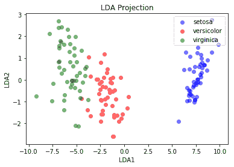

此图是我们执行的手动 LDA 的镜像。这是可以的。回想一下在 PCA 中，我们的手动版本包含了符号相反的特征向量(正对负)。这不会影响我们的机器学习管道。在 LDA 模块中，我们需要注意一些不同之处。我们有一个`.scalings_ attribute`，而不是一个`.components_ attribute`，其行为几乎相同:

```py
# essentially the same as pca.components_, but transposed (4x2 instead of 2x4)
 lda.scalings_

 array([[ 0.81926852, 0.03285975], [ 1.5478732 , 2.15471106], [-2.18494056, -0.93024679], [-2.85385002, 2.8060046 ]])

 # same as manual calculations
 lda.explained_variance_ratio_
 array([ 0.9915, 0.0085])
```

两个线性判别式的解释方差比与我们之前计算的完全相同，注意它们省略了第三和第四个特征值，因为它们实际上为零。

然而，这些组件，乍一看，一点也不像我们之前实现的手动特征向量。其原因是 scikit-learn 计算特征向量的方式产生了相同的特征向量，但按标量进行了缩放，如下所示:

```py
# show that the sklearn components are just a scalar multiplication from the manual components we calculateda
 for manual_component, sklearn_component in zip(eig_vecs.T[:2], lda.scalings_.T):
 print sklearn_component / manual_component

 [-3.9982 -3.9982 -3.9982 -3.9982] [ 3.6583 3.6583 3.6583 3.6583]
```

scikit-learn 线性判别式是手动特征向量的标量乘法，这意味着它们都是有效的特征向量。唯一的区别是投影数据的比例。

这些组件被组织为 4 x 2 矩阵，而不是 PCA 组件，PCA 组件被给定为 2 x 4 矩阵。这是开发模块时的一个选择，对我们来说一点也不影响数学。LDA 和 PCA 一样，缩放不变，所以缩放数据很重要。

让我们将 LDA 模块与缩放后的虹膜数据相匹配，并查看各个组件以了解差异:

```py
# fit our LDA to scaled data
 X_lda_iris = lda.fit_transform(X_scaled, iris_y)

 lda.scalings_ # different scalings when data are scaled

 array([[ 0.67614337, 0.0271192 ], [ 0.66890811, 0.93115101], [-3.84228173, -1.63586613], [-2.17067434, 2.13428251]])
```

`scalings_ attribute`(类似于 PCA 的`components_ attribute`)向我们展示了不同的阵列，这意味着投影也会不同。为了完成我们对 LDA 的(更简短的)描述，让我们应用与 PCA 相同的代码块，并像解释 PCA 的`components_ attribute`一样解释`scalings_ arrays`。

让我们首先在截断的虹膜数据集上拟合和变换 LDA，这里我们只保留了前两个特征:

```py
# fit our LDA to our truncated iris dataset
 iris_2_dim_transformed_lda = lda.fit_transform(iris_2_dim, iris_y)
```

让我们看看投影数据集的前五行:

```py
# project data
 iris_2_dim_transformed_lda[:5,]

 array([[-6.04248571, 0.07027756], [-6.04248571, 0.07027756], [-6.19690803, 0.28598813], [-5.88806338, -0.14543302], [-6.04248571, 0.07027756]])
```

我们的`scalings_ matrix`现在是一个 2 x 2 矩阵(2 行 2 列)，其中列是组件(而不是 PCA 中的行是组件)。为了对此进行调整，让我们创建一个名为 components 的新变量来保存`scalings_ attribute`的转置版本:

```py
# different notation
 components = lda.scalings_.T # transposing gives same style as PCA. We want rows to be components

 print components
 [[ 1.54422328 2.40338224] [-2.15710573 5.02431491]]

 np.dot(iris_2_dim, components.T)[:5,] # same as transform method

 array([[-6.04248571, 0.07027756], [-6.04248571, 0.07027756], [-6.19690803, 0.28598813], [-5.88806338, -0.14543302], [-6.04248571, 0.07027756]])
```

我们可以看到 se 使用 components 变量的方式与我们使用 PCA `components_ attribute`的方式相同。这意味着投影是原始列的另一种线性组合，就像它们在 PCA 中一样。同样值得注意的是，LDA 仍然去相关特征，就像 PCA 一样。为了说明这一点，让我们计算原始截断虹膜数据的相关系数矩阵和投影数据的相关矩阵:

```py
# original features are highly correlated
np.corrcoef(iris_2_dim.T)
 array([[ 1\. , 0.9627571],
 [ 0.9627571, 1\. ]])

 # new LDA features are highly uncorrelated, like in PCA
 np.corrcoef(iris_2_dim_transformed_lda.T)
 array([[ 1.00000000e+00, 1.03227536e-15], [ 1.03227536e-15, 1.00000000e+00]])
```

请注意，在每个矩阵的右上角值中，原始矩阵显示的是*高度*相关的特征，而使用 LDA 的投影数据具有高度独立的特征(假定相关系数接近于零)。在我们进入真正的乐趣(使用 PCA 和 LDA 进行机器学习)之前，总结一下我们对 LDA 的解释，让我们看看 LDA 的`scalings_ attribute`的可视化，就像我们对 PCA 所做的那样:

```py
# This code is graphing both the original iris data and the projected version of it using LDA.
 # Moreover, on each graph, the scalings of the LDA are graphed as vectors on the data themselves
 # The longer of the arrows is meant to describe the first scaling vector and
 # the shorter of the arrows describes the second scaling vector
 def draw_vector(v0, v1, ax):
 arrowprops=dict(arrowstyle='->',
 linewidth=2,
 shrinkA=0, shrinkB=0)
 ax.annotate('', v1, v0, arrowprops=arrowprops)

 fig, ax = plt.subplots(2, 1, figsize=(10, 10))
 fig.subplots_adjust(left=0.0625, right=0.95, wspace=0.1)

 # plot data
 ax[0].scatter(iris_2_dim[:, 0], iris_2_dim[:, 1], alpha=0.2)
 for length, vector in zip(lda.explained_variance_ratio_, components):
 v = vector * .5
 draw_vector(lda.xbar_, lda.xbar_ + v, ax=ax[0]) # lda.xbar_ is equivalent to pca.mean_
 ax[0].axis('equal')
 ax[0].set(xlabel='x', ylabel='y', title='Original Iris Dataset',
 xlim=(-3, 3), ylim=(-3, 3))

 ax[1].scatter(iris_2_dim_transformed_lda[:, 0], iris_2_dim_transformed_lda[:, 1], alpha=0.2)
 for length, vector in zip(lda.explained_variance_ratio_, components):
 transformed_component = lda.transform([vector])[0]
 v = transformed_component * .1
 draw_vector(iris_2_dim_transformed_lda.mean(axis=0), iris_2_dim_transformed_lda.mean(axis=0) + v, ax=ax[1])
 ax[1].axis('equal')
 ax[1].set(xlabel='lda component 1', ylabel='lda component 2',
 title='Linear Discriminant Analysis Projected Data',
 xlim=(-10, 10), ylim=(-3, 3))
```

我们得到以下输出:

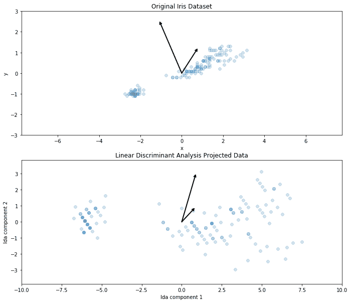

请注意，分量不是随着数据的变化而变化，而是几乎垂直于数据；而是遵循类的分离。另外，请注意它几乎与左右两侧的花之间的间隙平行。LDA 正试图捕捉阶级之间的分离

在上图中，我们可以看到原始虹膜数据集，其中`scalings_ vectors`覆盖在数据点的顶部。较长的向量几乎平行于左下方的布景和右上方的其余花之间的大间隙。这表明 LDA 正试图指出最佳的观察方向，以便在原始坐标系中分离花的种类。

这里需要注意的是，LDA 的`scalings_ attribute`并不像在 PCA 中那样与新坐标系 1:1 相关。这是因为`scalings_`的目标不是创建一个新的坐标系统，而是指向数据中优化类可分性的边界方向。我们不会像对 PCA 那样详细讨论这些新坐标系的计算。理解 PCA 和 LDA 之间的主要区别就足够了，PCA 是一种无监督的方法，它从整体上捕捉数据的方差，而 LDA 是一种有监督的方法，它使用响应变量来捕捉类的可分性。

有监督的特征变换(如 LDA)的局限性意味着它们无法帮助完成聚类等任务，而 PCA 可以提供帮助。这是因为聚类是一项无人监督的任务，没有可供 LDA 使用的响应变量。


# LDA 对比 PCA–iris 数据集

最后，我们到了可以尝试在机器学习管道中同时使用 PCA 和 LDA 的时刻。因为我们已经在本章中广泛地使用了`iris`数据集，所以我们将继续展示 LDA 和 PCA 作为有监督和无监督机器学习的特征转换预处理步骤的效用。

我们将从有监督的机器学习开始，并尝试建立一个分类器来识别给定的四个数量花卉性状的花卉种类:

1.  我们首先从 scikit-learn 导入三个模块:

```py
from sklearn.neighbors import KNeighborsClassifier
from sklearn.pipeline import Pipeline
from sklearn.model_selection import cross_val_score
```

我们将使用 KNN 作为我们的监督模型和管道模块，将我们的 KNN 模型与我们的特征转换工具相结合，以创建可以使用`cross_val_score`模块进行交叉验证的机器学习管道。我们将尝试几种不同的机器学习管道，并记录它们的性能:

2.  让我们首先创建三个新变量，一个保存我们的 LDA，一个保存我们的 PCA，另一个保存 KNN 模型:

```py
# Create a PCA module to keep a single component
 single_pca = PCA(n_components=1)

 # Create a LDA module to keep a single component
 single_lda = LinearDiscriminantAnalysis(n_components=1)

 # Instantiate a KNN model
 knn = KNeighborsClassifier(n_neighbors=3)
```

3.  让我们调用没有任何转换技术的 KNN 模型来获得基线精度。我们将用它来比较两种特征变换算法:

```py
# run a cross validation on the KNN without any feature transformation
 knn_average = cross_val_score(knn, iris_X, iris_y).mean()

 # This is a baseline accuracy. If we did nothing, KNN on its own achieves a 98% accuracy
 knn_average

 0.98039215686274517
```

4.  beat 的基线准确率为 98.04%。让我们使用我们的 LDA，它只保留最强大的组件:

```py
lda_pipeline = Pipeline([('lda', single_lda), ('knn', knn)])
 lda_average = cross_val_score(lda_pipeline, iris_X, iris_y).mean()

 # better prediction accuracy than PCA by a good amount, but not as good as original
 lda_average

 0.9673202614379085
```

5.  似乎仅使用单一线性判别式不足以击败我们的基线准确性。现在让我们试试 PCA。我们这里的假设是 PCA 不会优于 LDA，唯一的原因是 PCA 不像 LDA 那样试图优化类分离:

```py
# create a pipeline that performs PCA
 pca_pipeline = Pipeline([('pca', single_pca), ('knn', knn)])

 pca_average = cross_val_score(pca_pipeline, iris_X, iris_y).mean()

 pca_average

 0.8941993464052288
```

绝对是迄今为止最糟糕的。

添加另一个 LDA 组件是否有助于我们，这是值得探究的:

```py
# try LDA with 2 components
 lda_pipeline = Pipeline([('lda', LinearDiscriminantAnalysis(n_components=2)),
 ('knn', knn)])

 lda_average = cross_val_score(lda_pipeline, iris_X, iris_y).mean()

 # Just as good as using original data
 lda_average

 0.98039215686274517
```

有了两个组件，我们就能达到原来的精度！这很好，但我们希望比我们的基线做得更好。让我们看看上一章的特性选择模块是否能帮助我们。让我们导入并使用`SelectKBest`模块，看看统计特征选择是否最适合我们的 LDA 模块:

```py
# compare our feature transformation tools to a feature selection tool
 from sklearn.feature_selection import SelectKBest
 # try all possible values for k, excluding keeping all columns
 for k in [1, 2, 3]:
 # make the pipeline
 select_pipeline = Pipeline([('select', SelectKBest(k=k)), ('knn', knn)])
 # cross validate the pipeline
 select_average = cross_val_score(select_pipeline, iris_X, iris_y).mean()
 print k, "best feature has accuracy:", select_average

 # LDA is even better than the best selectkbest
 1 best feature has accuracy: 0.953839869281 2 best feature has accuracy: 0.960784313725 3 best feature has accuracy: 0.97385620915
```

到目前为止，我们的双组分 LDA 一直处于领先地位。在生产中，同时使用无监督和有监督的特征变换是很常见的。让我们设置一个`GridSearch`模块来寻找最佳组合:

*   缩放数据(有或没有平均值/标准值)
*   PCA 组件
*   LDA 组件
*   KNN 邻居

下面的代码块将建立一个名为`get_best_model_and_accuracy`的函数，它将接受一个模型(scikit-learn pipeline 或其他)、一个字典形式的参数网格、我们的`X`和`y`数据集，并输出网格搜索模块的结果。输出将是模型的最佳性能(就准确性而言)、导致最佳性能的最佳参数、拟合所需的平均时间以及预测所需的平均时间:

```py
def get_best_model_and_accuracy(model, params, X, y):
    grid = GridSearchCV(model, # the model to grid search
                        params, # the parameter set to try
                        error_score=0.) # if a parameter set raises an error, continue and set the performance as a big, fat 0

    grid.fit(X, y) # fit the model and parameters
    # our classical metric for performance
    print "Best Accuracy: {}".format(grid.best_score_)
    # the best parameters that caused the best accuracy
    print "Best Parameters: {}".format(grid.best_params_)
    # the average time it took a model to fit to the data (in seconds)
    avg_time_fit = round(grid.cv_results_['mean_fit_time'].mean(), 3)
    print "Average Time to Fit (s): {}".format(avg_time_fit)
    # the average time it took a model to predict out of sample data (in seconds)
    # this metric gives us insight into how this model will perform in real-time analysis
    print "Average Time to Score (s): {}".format(round(grid.cv_results_['mean_score_time'].mean(), 3))
```

一旦我们设置了接收模型和参数的函数，就让我们用它来测试我们的管道与缩放、PCA、LDA 和 KNN 的组合:

```py

from sklearn.model_selection import GridSearchCV
iris_params = {
     'preprocessing__scale__with_std': [True, False],
     'preprocessing__scale__with_mean': [True, False],
     'preprocessing__pca__n_components':[1, 2, 3, 4], # according to scikit-learn docs, max allowed n_components for LDA is number of classes - 1
     'preprocessing__lda__n_components':[1, 2],

     'clf__n_neighbors': range(1, 9)
}
# make a larger pipeline
preprocessing = Pipeline([('scale', StandardScaler()), ('pca', PCA()), ('lda', LinearDiscriminantAnalysis())])

iris_pipeline = Pipeline(steps=[('preprocessing', preprocessing),('clf', KNeighborsClassifier())])

get_best_model_and_accuracy(iris_pipeline, iris_params, iris_X, iris_y)

Best Accuracy: 0.986666666667 Best Parameters: {'preprocessing__scale__with_std': False, 'preprocessing__pca__n_components': 3, 'preprocessing__scale__with_mean': True, 'preprocessing__lda__n_components': 2, 'clf__n_neighbors': 3} Average Time to Fit (s): 0.002 Average Time to Score (s): 0.001
```

到目前为止，最好的准确度(接近 99%)使用缩放、PCA 和 LDA 的组合。通常在相同的管道中正确使用所有这三种算法，并执行超参数调整来微调该过程。这向我们表明，最好的生产就绪机器学习管道通常是多种特征工程方法的组合。


# 摘要

总结我们的发现，PCA 和 LDA 都是我们的武器库中的特征转换工具，用于找到最佳的新特征来使用。LDA 专门针对类分离进行优化，而 PCA 以无监督的方式工作，以捕获较少列中数据的差异。通常，这两者与监督管道一起使用，正如我们在 iris 管道中展示的那样。在最后一章，我们将通过两个较长的案例研究，利用主成分分析和线性判别分析的文本聚类和面部识别软件。

PCA 和 LDA 是非常强大的工具，但是有局限性。这两者都是线性变换，这意味着它们只能在我们的数据中创建线性边界并捕捉线性质量。它们也是静态转换。无论我们将什么数据输入 PCA 或 LDA，输出都是预期的和数学的。如果我们使用的数据不太适合 PCA 或 LDA(它们表现出非线性特征，例如，它们是圆形的)，那么无论我们进行多少网格搜索，这两种算法都不会帮助我们。

下一章将关注特征学习算法。这些可以说是最强大的特征工程算法。它们被构建来基于输入数据学习新的特征，而不假设诸如 PCA 和 LDA 之类的质量。在本章中，我们将使用包括神经网络在内的复杂结构来实现最高水平的特征工程。