# 特征学习

在我们的最后一章中，我们将探索特征工程技术，我们将看一看我们所能使用的最强大的特征工程工具。特征学习算法能够接受干净的数据(是的，你仍然需要做一些工作)，并通过利用数据中的潜在结构来创建全新的特征。如果这一切听起来很熟悉，那是因为这是我们在前一章中用于特性转换的描述。这两类算法的区别在于它们在尝试创建新特征时所做的*参数*假设。

我们将讨论以下主题:

*   数据的参数假设
*   受限玻尔兹曼机器
*   伯努利大厦
*   从 MNIST 提取 RBM 成分
*   在机器学习管道中使用 RBM
*   学习文本特征—单词矢量化


# 数据的参数假设

当我们说**参数假设**时，我们指的是算法对数据的*形状*做出的基本假设。在前一章中，在探索**主成分分析** ( **PCA** )时，我们发现算法的最终结果会产生一些成分，我们可以使用这些成分通过一次矩阵乘法来转换数据。我们所做的假设是，原始数据呈现出一种可以分解的形状，并且可以用一个线性变换(矩阵运算)来表示。但是如果这不是真的呢？如果 PCA 无法从原始数据集中提取出*有用的*特征怎么办？PCA、**线性判别分析** ( **LDA** )等算法总是能找到特征，但可能一点用都没有。此外，这些算法依赖于预先确定的等式，并且每次运行时都会输出相同的特征。这就是为什么我们认为 LDA 和 PCA 都是线性变换。

特征学习算法试图通过去除参数假设来解决这个问题。他们对输入数据的形状不做任何假设，依靠随机学习。这意味着，他们不会每次都将相同的等式扔向数据矩阵，而是会通过一遍又一遍地查看数据点(在各个时期)来试图找出要提取的最佳特征，并收敛到一个解决方案(在运行时可能不同)。

有关随机学习(和随机梯度下降)如何工作的更多信息，请参考 Sinan Ozdemir 在
[https://www . packtpub . com/big-Data-and-business-intelligence/Principles-Data-Science](https://www.packtpub.com/big-data-and-business-intelligence/principles-data-science)上撰写的*数据科学原理*

这使得特征学习算法能够绕过 PCA 和 LDA 等算法所做的参数假设，并使我们能够解决比我们之前在本文中所能解决的更困难的问题。如此复杂的想法(绕过参数假设)需要使用复杂的算法。*深度学习*算法是许多数据科学家和机器学习从原始数据中学习新特征的选择。

我们将假设读者对神经网络体系结构有基本的了解，以便关注这些体系结构在特征学习中的应用。下表总结了特征学习和转换之间的基本区别:

|  | **参数化？** | **简单好用？** | **创建新功能集？** | **深度学习？** |
| 特征变换算法 | 是 | 是 | 是 | 不 |
| 特征学习算法 | 不 | 不(通常) | 是 | 是(通常) |

特征学习和特征转换算法都创建新的特征集，这意味着我们认为它们都在*特征提取的保护伞下。*下图显示了这种关系:

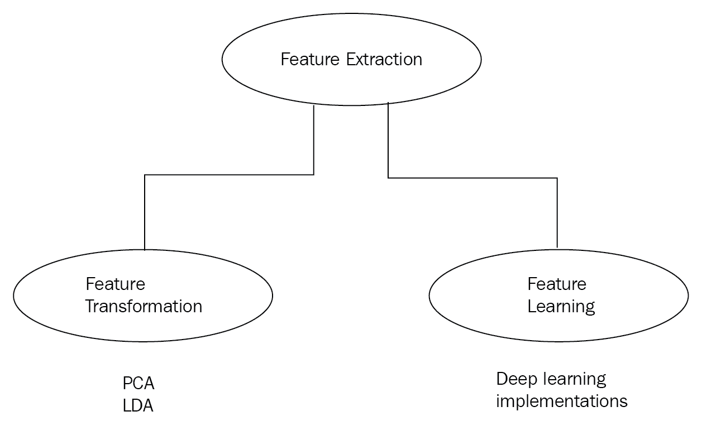

特征提取作为特征学习和特征转换的超集。这两个算法家族都致力于开发潜在结构，以便将原始数据转换成新的特征集

**特征学习**和**特征转换**都属于特征提取的范畴，因为它们都试图从原始数据的潜在结构中创建新的特征集。然而，允许它们工作的方法是主要的区别。


# 非参数谬误

值得一提的是，非参数模型并不意味着模型在训练过程中没有任何假设。

虽然我们将在本章中介绍的算法放弃了对数据形状的假设，但它们仍可能对数据的其他方面做出假设，例如，单元格的值。


# 本章的算法

在本章中，我们将重点关注两个功能学习领域:

*   **受限玻尔兹曼机器** ( **RBM** ):一个简单的深度学习架构，它是基于数据遵循的概率模型来学习一组新维度。这些机器实际上是一个算法家族，只有一个在 scikit-learn 中实现。 **BernoulliRBM** 可以是非参数特征学习器；然而，顾名思义，数据集的单元格的值设置了一些期望值。
*   **单词嵌入**:最近深度学习推动的自然语言处理/理解/生成进步的最大贡献者之一可能是将字符串(单词和短语)投影到 n 维特征集中的能力，以便掌握上下文和措辞中的微小细节。我们将使用`gensim` Python 包来准备我们自己的单词嵌入，然后使用预训练的单词嵌入来看看这些单词嵌入如何被用来增强我们与文本交互的方式。

所有这些例子都有一些共同点。它们都涉及到从原始数据中学习全新的特性。然后，他们使用这些新功能来增强他们与数据交互的方式。对于后两个例子，我们将不得不放弃 scikit-learn，因为这些更高级的技术在最新版本中还没有实现。相反，我们将看到在 TensorFlow 和 Keras 中实现的深度学习神经架构的例子。

对于所有这些技术，我们将较少关注模型的底层内部工作，而更多关注它们如何解释数据。我们将按顺序从唯一具有 scikit-learn 实现的算法开始，即受限玻尔兹曼机器算法家族。


# 受限玻尔兹曼机器

RBM 是一系列无监督的特征学习算法，使用概率模型来学习新特征。像 PCA 和 LDA 一样，我们可以使用 RBM 从原始数据中提取新的特征集，并使用它们来增强机器学习管道。RBM 提取的特征在使用线性模型(如线性回归、逻辑回归、感知器等)时效果最好。

RBM 的无监督性质很重要，因为它们更类似于 PCA 算法，而不是 LDA。它们不需要数据点的地面实况标签来提取新特征。这使得它们在更广泛的机器学习问题中有用。

从概念上讲，RBM 是浅层(两层)神经网络。他们被认为是一类叫做**深度信念网络** ( **DBN** )的算法的构建模块。按照标准术语，有一个可见层(第一层)，后面是一个隐藏层(第二层)。网络只有两层:

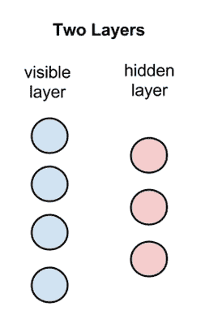

受限玻尔兹曼机的设置。圆圈代表图中的节点

像任何神经网络一样，我们在两层中都有节点。网络的第一个可见图层具有与输入要素维度一样多的图层。在我们即将到来的例子中，我们将处理 28 x 28 的图像，在我们的输入层中需要 784 (28 x 28)个节点。隐藏层中节点的数量是一个人选的数字，代表我们希望学习的特征的数量。


# 不一定要降维

在 PCA 和 LDA 中，我们对允许提取的成分数量有严格的限制。对于 PCA，我们被原始特征的数量所限制(我们只能使用少于或等于原始列的数量)，而 LDA 实施了更严格的限制，将提取的特征的数量限制为基本事实中类别的数量减一。

对 RBM 可以学习的特征数量的唯一限制是，它们受到运行网络的计算机的计算能力和人类解释的限制。与我们最初开始时相比，RBM 可以学习更少或更多的特征。要学习的特征的确切数量取决于问题，并且可以进行网格搜索。


# 受限玻尔兹曼机的图形

到目前为止，我们已经看到了 RBM 的可见层和隐藏层，但我们还没有看到它们如何学习特征。可见图层的每个结点都从数据集中获取一个要学习的要素。然后，这些数据通过权重和偏差从可见层传递到隐藏层:


RBM 的这种可视化显示了单个数据点通过单个隐藏节点在图中的移动

前面的 RBM 可视化显示了单个数据点在图形和单个隐藏节点中的移动。可见层有四个节点，代表原始数据的四列。每个箭头代表数据点在 RBM 第一层的四个可见结点中移动的单个要素。每个特征值乘以与该特征相关联的权重，并加在一起。该计算也可以通过数据的输入向量和权重向量之间的点积来总结。产生的数据加权和被添加到偏置变量，并通过激活函数发送(sigmoid IC 是流行的)。结果存储在一个名为`a`的变量中。

作为 Python 中的一个例子，这段代码展示了如何将单个数据点(`inputs`)乘以我们的`weights`向量，并与`bias`变量组合，以创建激活的变量`a`:

```
import numpy as np
import math

# sigmoidal function
def activation(x):
    return 1 / (1 + math.exp(-x))

inputs = np.array([1, 2, 3, 4])
weights = np.array([0.2, 0.324, 0.1, .001])
bias = 1.5

a = activation(np.dot(inputs.T, weights) + bias)

print a
0.9341341524806636
```

在真实的 RBM 中，每个可见节点都连接到每个隐藏节点，看起来像这样:

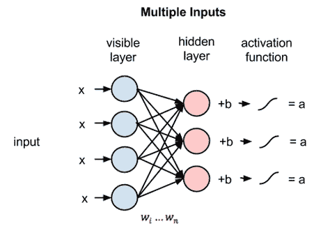

因为来自每个可见节点的输入被传递到每个隐藏节点，所以 RBM 可以被定义为一个**对称二分图**。对称部分来自于可见节点都与每个隐藏节点相连。二分意味着它有两个部分(层)。


# 玻尔兹曼机的限制

通过我们的两层可见和隐藏节点，我们已经看到了层之间的连接(层间连接)，但还没有看到同一层中的节点之间的任何连接(层内连接)。那是因为根本没有。RBM 的限制是我们不允许任何层内通信。这让节点独立地创建权重和偏差，最终(希望)成为我们数据的独立特征。


# 重建数据

在网络的这种向前传递中，我们可以看到数据如何通过网络向前传递(从可见层到隐藏层)，但这并不能解释 RBM 如何能够在没有地面真相的情况下从我们的数据中学习新特征。这是通过我们的可见层和隐藏层之间的网络的多次向前和向后传递来完成的。

在重建阶段，我们切换网络，让隐藏层成为输入层，并让它使用相同的权重，但使用一组新的偏差，将我们的激活变量(`a`)反馈到可见层。我们在正向传递期间计算的激活变量随后被用于重构原始输入向量。下面的可视化向我们展示了如何使用相同的权重和不同的偏差通过我们的图表反馈激活:

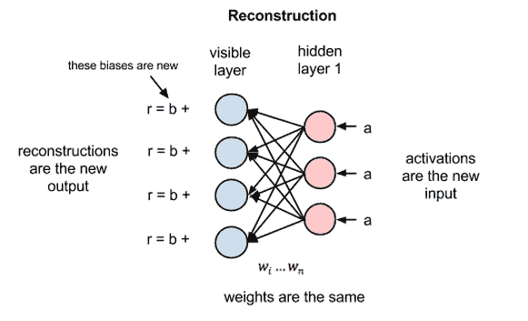

这成为网络自我评估的方式。通过网络反向传递激活并获得原始输入的近似值，网络可以调整权重，以便使近似值更接近原始输入。在训练开始时，因为权重是随机初始化的(这是标准做法)，所以近似值可能会非常远。通过网络的反向传播发生在与正向传递相同的方向上(我们知道这是令人困惑的)，然后调整权重以最小化原始输入和近似之间的距离。然后重复这个过程，直到近似值尽可能接近原始输入。这个来回过程发生的次数称为**迭代次数**。

这个过程的最终结果是一个网络，每个数据点都有一个*的另一个自我*。要转换数据，我们只需通过网络传递数据，然后检索激活变量，并将它们称为新特性。这个过程是一种*生成式学习*，它试图学习生成原始数据的概率分布，并利用知识为我们提供原始数据的新特征集。

例如，如果给我们一个数字的图像，并要求我们对图像的哪个数字(0-9)进行分类，网络的正向传递会问这样的问题，给定这些像素，我应该期望哪个数字？在向后传递时，网络会问给定一个数字，我应该期望什么像素？这被称为**联合概率**，它是给定 *x* 的 *y* 和给定 *y，*的 *x* 的同时概率，它被表示为我们网络的两层之间的共享权重。

让我们介绍我们的新数据集，让它阐明 RBM 在特征学习中的有用性。


# MNIST 数据集

`MNIST`数据集由 6000 张 0 到 9 之间的手写数字图像和一个可供学习的基本事实标签组成。这与我们一直在处理的大多数其他数据集没有什么不同，因为我们试图拟合一个机器学习模型，以便在给定一组数据点的情况下对响应变量进行分类。这里的主要区别在于，我们使用的是非常低级的功能，而不是更容易理解的功能。每个数据点将由 784 个特征(灰度图像中的像素值)组成。

1.  让我们从我们的进口开始:

```
# import numpy and matplotlib
import numpy as np
import matplotlib.pyplot as plt
%matplotlib inline

from sklearn import linear_model, datasets, metrics
# scikit-learn implementation of RBM
from sklearn.neural_network import BernoulliRBM
from sklearn.pipeline import Pipeline
```

2.  新引入的是 BernoulliRBM，这是到目前为止 scikit-learn 中唯一的 RBM 实现。顾名思义，我们将不得不做少量的预处理，以确保我们的数据符合所需的假设。让我们将数据集直接导入 NumPy 数组:

```
# create numpy array from csv
images = np.genfromtxt('../data/mnist_train.csv', delimiter=',')
```

3.  我们可以验证我们正在处理的行数和列数:

```
# 6000 images and 785 columns, 28X28 pixels + 1 response
images.shape

(6000, 785)
```

4.  785 由 784 个像素组成，开头有一个响应列(第一列)。除了响应列之外的每一列都包含一个介于 0 和 255 之间的值，表示像素强度，其中 0 表示白色背景，255 表示全黑像素。我们可以从数据中提取出`X`和`y`变量，方法是将第一列与其余数据分开:

```
# extract the X and y variable
images_X, images_y = images[:,1:], images[:,0]

# values are much larger than 0-1 but scikit-learn RBM version assumes 0-1 scaling
np.min(images_X), np.max(images_X)
(0.0, 255.0)
```

5.  如果我们看一下第一张图片，我们会看到我们正在处理的内容:

```
plt.imshow(images_X[0].reshape(28, 28), cmap=plt.cm.gray_r)

images_y[0]
```

剧情如下:


看起来不错。因为受限玻尔兹曼机器的 scikit-learn 实现不允许 0-1 范围之外的值，所以我们必须做一些预处理工作。


# 伯努利大厦

受限玻尔兹曼机器的唯一 scikit-learn 实现版本被称为 **BernoulliRBM** ，因为它对它可以学习的概率分布类型施加了约束。伯努利分布允许数据值在 0 和 1 之间。scikit-learn 文档指出，模型*假设输入为二进制值或介于零和一之间的值*。这样做是为了表示节点值代表节点被激活或未被激活的概率。它允许更快地学习特性集。考虑到这一点，我们将改变我们的数据集，只考虑硬编码的白/黑像素强度。通过这样做，每个单元格的值要么是 0，要么是 1(白色或黑色),以使学习更加健壮。我们将分两步完成这一任务:

1.  我们将把像素值缩放到 0 到 1 之间
2.  如果像素值超过了`0.5`，我们将改变像素值为真，否则为假

让我们从将像素值缩放到 0 和 1 之间开始:

```
# scale images_X to be between 0 and 1
 images_X = images_X / 255.

 # make pixels binary (either white or black)
 images_X = (images_X > 0.5).astype(float)

 np.min(images_X), np.max(images_X)
 (0.0, 1.0)
```

让我们来看看同样的数字五位数，就像我们以前做的那样，用我们新改变的像素:

```
plt.imshow(images_X[0].reshape(28, 28), cmap=plt.cm.gray_r)

 images_y[0]
```

剧情如下:


我们可以看到，图像的模糊性已经消失，我们只剩下一个非常清晰的数字来进行分类。现在让我们尝试从数字数据集中提取特征。


# 从 MNIST 中提取 PCA 成分

在我们进入 RBM 之前，让我们看一下当我们对数据集应用主成分分析时会发生什么。像我们在上一章中所做的那样，我们将获取我们的特征(784 个打开或关闭的像素)并将特征值分解应用于矩阵，以从数据集中提取*特征值*。

让我们从可能的 784 中选取 100 个组件，并绘制这些组件，看看提取的特征是什么样子的。为此，我们将导入 PCA 模块，使其符合我们的 100 个组件的数据，并创建一个 matplotlib 库来显示我们可用的前 100 个组件:

```
# import Principal Components Analysis module
 from sklearn.decomposition import PCA

 # extract 100 "eigen-digits"
 pca = PCA(n_components=100)
 pca.fit(images_X)

 # graph the 100 components
 plt.figure(figsize=(10, 10))
 for i, comp in enumerate(pca.components_):
 plt.subplot(10, 10, i + 1)
 plt.imshow(comp.reshape((28, 28)), cmap=plt.cm.gray_r)
 plt.xticks(())
 plt.yticks(())
 plt.suptitle('100 components extracted by PCA')

 plt.show()
```

以下是前面代码块的情节:

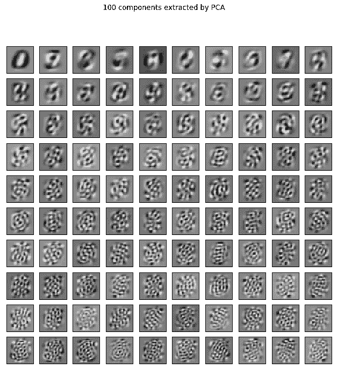

这组图片向我们展示了当协方差矩阵的特征值被调整到与原始图像相同的维度时的样子。这是当我们将算法集中在图像数据集上时，提取的组件看起来像什么的一个例子。偷偷看一眼 PCA 组件如何试图从数据集中抓取线性变换是非常有趣的。每个组件都试图理解图像的某个“方面”,这将转化为可解释的知识。例如，第一个(也是最重要的)本征图像很可能捕捉到 0 质量的图像，也就是说，数字看起来有多像 0。

同样显而易见的是，前十个组成部分似乎保留了一些数字的形状，之后，它们似乎开始演变成看起来无意义的图像。在画廊的尽头，我们似乎看到了随机排列的黑白像素。这可能是因为 PCA(以及 LDA)是参数变换，并且它们从图像等复杂数据集提取的信息量有限。

如果我们看一下前 30 个组件解释了多少差异，我们会发现它们能够捕捉大部分信息:

```
# first 30 components explain 64% of the variance

 pca.explained_variance_ratio_[:30].sum()
 .637414
```

这告诉我们，最初的几十个组件在捕捉数据的本质方面做得很好，但是在那之后，组件可能不会添加太多。

这可以在 scree 图中进一步看出，该图显示了我们的 PCA 成分的累积解释方差:

```
# Scree Plot

 # extract all "eigen-digits"
 full_pca = PCA(n_components=784)
 full_pca.fit(images_X)

 plt.plot(np.cumsum(full_pca.explained_variance_ratio_))

 # 100 components captures about 90% of the variance
```

以下是 scree 图，其中 PCA 成分的数量在 *x* 轴上，所解释的累积变化量在 *y* 轴上:

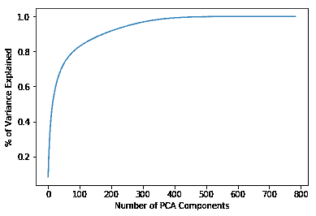

正如我们在前一章中看到的，PCA 进行的转换是通过将 PCA 模块的 components 属性与数据相乘的单一线性矩阵运算来完成的。我们将通过采用适合 100 个特征的 scikit-learn PCA 对象并使用它来变换单个 MNIST 图像来再次展示这一点。我们将获取转换后的图像，并将其与原始图像乘以 PCA 模块的`components_`属性的结果进行比较:

```
# Use the pca object, that we have already fitted, to transform the first image in order to pull out the 100 new features
pca.transform(images_X[:1])

array([[ 0.61090568, 1.36377972, 0.42170385, -2.19662828, -0.45181077, -1.320495 , 0.79434677, 0.30551126, 1.22978985, -0.72096767, ...

# reminder that transformation is a matrix multiplication away
np.dot(images_X[:1]-images_X.mean(axis=0), pca.components_.T)

array([[ 0.61090568, 1.36377972, 0.42170385, -2.19662828, -0.45181077, -1.320495 , 0.79434677, 0.30551126, 1.22978985, -0.72096767,
```


# 从 MNIST 提取 RBM 成分

现在让我们在 scikit-learn 中创建第一个 RBM。我们将从实例化一个模块开始，从我们的`MNIST`数据集中提取 100 个组件。

我们还将把 verbose 参数设置为`True`以允许我们查看训练过程，并将`random_state`参数设置为`0`。`random_state`参数是一个整数，允许代码中的再现性。它固定随机数发生器，并在同一时间随机设置权重和偏差*，每次。我们终于让`n_iter`成为`20`。这是我们希望进行的迭代次数，或网络的来回传递次数:*

```
# instantiate our BernoulliRBM
 # we set a random_state to initialize our weights and biases to the same starting point
 # verbose is set to True to see the fitting period
 # n_iter is the number of back and forth passes
 # n_components (like PCA and LDA) represent the number of features to create
 # n_components can be any integer, less than , equal to, or greater than the original number of features

 rbm = BernoulliRBM(random_state=0, verbose=True, n_iter=20, n_components=100)

 rbm.fit(images_X)

 [BernoulliRBM] Iteration 1, pseudo-likelihood = -138.59, time = 0.80s
 [BernoulliRBM] Iteration 2, pseudo-likelihood = -120.25, time = 0.85s [BernoulliRBM] Iteration 3, pseudo-likelihood = -116.46, time = 0.85s ... [BernoulliRBM] Iteration 18, pseudo-likelihood = -101.90, time = 0.96s [BernoulliRBM] Iteration 19, pseudo-likelihood = -109.99, time = 0.89s [BernoulliRBM] Iteration 20, pseudo-likelihood = -103.00, time = 0.89s
```

一旦训练完成；我们可以探索这个过程的最终结果。像 PCA 一样，RBM 也有一个`components`模块:

```
# RBM also has components_ attribute
 len(rbm.components_)

 100
```

我们还可以绘制模块学习到的 RBM 分量，以查看它们与我们的特征数字有何不同:

```
# plot the RBM components (representations of the new feature sets)
 plt.figure(figsize=(10, 10))
 for i, comp in enumerate(rbm.components_):
 plt.subplot(10, 10, i + 1)
 plt.imshow(comp.reshape((28, 28)), cmap=plt.cm.gray_r)
 plt.xticks(())
 plt.yticks(())
 plt.suptitle('100 components extracted by RBM', fontsize=16)

 plt.show()
```

以下是上述代码的结果:

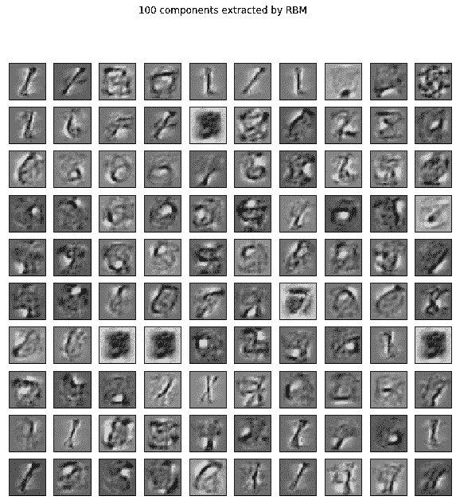

这些功能看起来很有趣。一段时间后，PCA 成分变成视觉失真，而 RBM 成分似乎用每个成分提取各种形状和笔画。乍一看，我们似乎有重复的特征(例如，特征 15、63、64 和 70)。我们可以做一个快速的数字检查，看看是否有任何组件实际上是重复的，或者他们只是非常相似。

这段代码将检查在`rbm.components_`中存在多少独特的元素。如果生成的形状中有 100 个元素，这意味着 RBM 的每个组件实际上都是不同的:

```
# It looks like many of these components are exactly the same but

 # this shows that all components are actually different (albiet some very slightly) from one another
 np.unique(rbm.components_.mean(axis=1)).shape

 (100,)
```

这验证了我们的组件彼此之间都是唯一的。通过在模块中使用`transform`方法，我们可以像使用 PCA 一样使用 RBM 来转换数据:

```
# Use our Boltzman Machine to transform a single image of a 5
 image_new_features = rbm.transform(images_X[:1]).reshape(100,)

 image_new_features

 array([ 2.50169424e-16, 7.19295737e-16, 2.45862898e-09, 4.48783657e-01, 1.64530318e-16, 5.96184335e-15, 4.60051698e-20, 1.78646959e-08, 2.78104276e-23, ...
```

我们还可以看到，这些组件的**而非**使用方式与 PCA 相同，这意味着简单的矩阵乘法不会产生与调用嵌入在模块中的`transform`方法相同的转换:

```
# not the same as a simple matrix multiplication anymore
 # uses neural architecture (several matrix operations) to transform features
 np.dot(images_X[:1]-images_X.mean(axis=0), rbm.components_.T)

 array([[ -3.60557365, -10.30403384, -6.94375031, 14.10772267, -6.68343281, -5.72754674, -7.26618457, -26.32300164, ...
```

现在我们知道我们有 100 个新的功能要处理，我们已经看到了它们，让我们看看它们如何与我们的数据交互。

让我们从获取数据集中第一幅图像的`20`最具代表性的特征开始，数字 5:

```
# get the most represented features
 top_features = image_new_features.argsort()[-20:][::-1]

 print top_features

 [56 63 62 14 69 83 82 49 92 29 21 45 15 34 28 94 18 3 79 58]

 print image_new_features[top_features]

 array([ 1\. , 1\. , 1\. , 1\. , 1\. , 1\. , 1\. , 0.99999999, 0.99999996, 0.99999981, 0.99996997, 0.99994894, 0.99990515, 0.9996504 , 0.91615702, 0.86480507, 0.80646422, 0.44878366, 0.02906352, 0.01457827])
```

在这种情况下，我们实际上有七个特征，其中 RBM 具有完整的 100%。在我们的图中，这意味着将这 784 个像素传递到我们的可见层中会以最大容量照亮节点 56、63、62、14、69、83 和 82。让我们分离出这些特征:

```
# plot the RBM components (representations of the new feature sets) for the most represented features
 plt.figure(figsize=(25, 25))
 for i, comp in enumerate(top_features):
 plt.subplot(5, 4, i + 1)
 plt.imshow(rbm.components_[comp].reshape((28, 28)), cmap=plt.cm.gray_r)
 plt.title("Component {}, feature value: {}".format(comp, round(image_new_features[comp], 2)), fontsize=20)
 plt.suptitle('Top 20 components extracted by RBM for first digit', fontsize=30)

 plt.show()
```

对于前面的代码，我们得到以下结果:

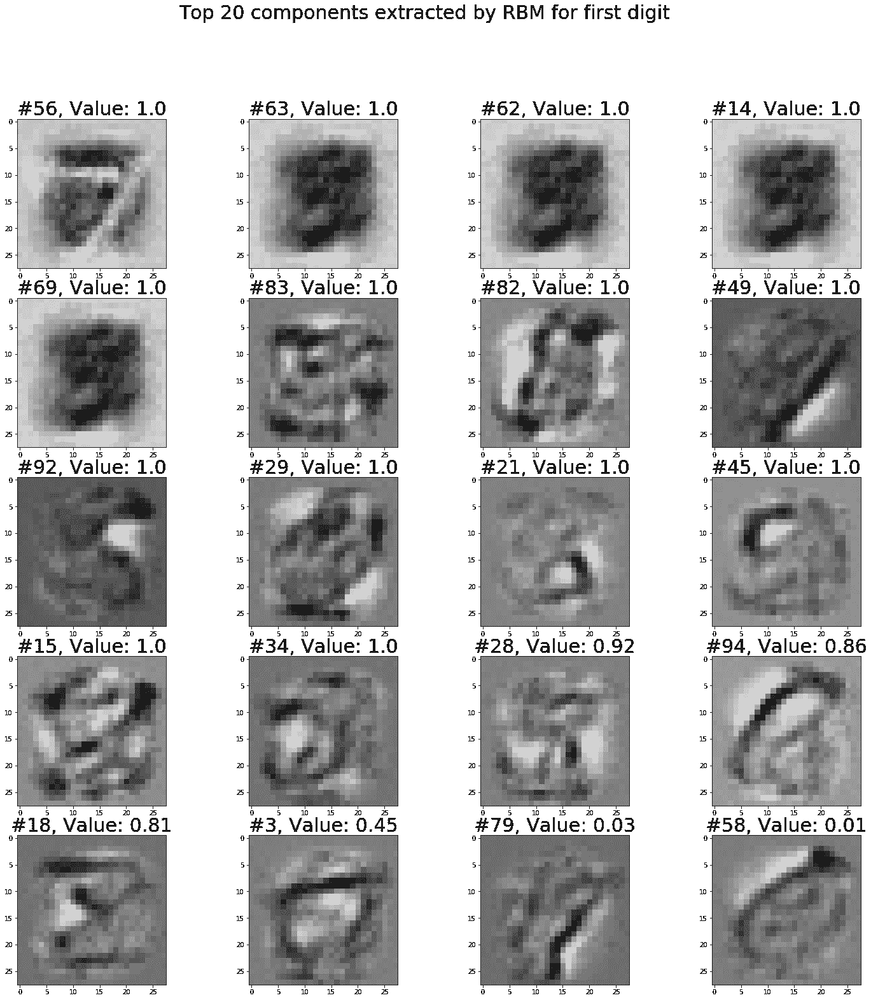

看看其中的一些，它们很有意义。**组件 45** 似乎隔离了数字 **5** 的左上角，而**组件 21** 似乎抓住了数字的底部循环。**组件 82** 和**组件 34** 似乎一口气抓了差不多整整 5 个。让我们来看看数字 5 的桶底是什么样子，当这些像素通过时，在 RBM 图中分离出底部 20 个点亮的特征:

```
# grab the least represented features
 bottom_features = image_new_features.argsort()[:20]

 plt.figure(figsize=(25, 25))
 for i, comp in enumerate(bottom_features):
 plt.subplot(5, 4, i + 1)
 plt.imshow(rbm.components_[comp].reshape((28, 28)), cmap=plt.cm.gray_r)
 plt.title("Component {}, feature value: {}".format(comp, round(image_new_features[comp], 2)), fontsize=20)
 plt.suptitle('Bottom 20 components extracted by RBM for first digit', fontsize=30)

 plt.show()
```

对于前面的代码，我们得到了下面的图:

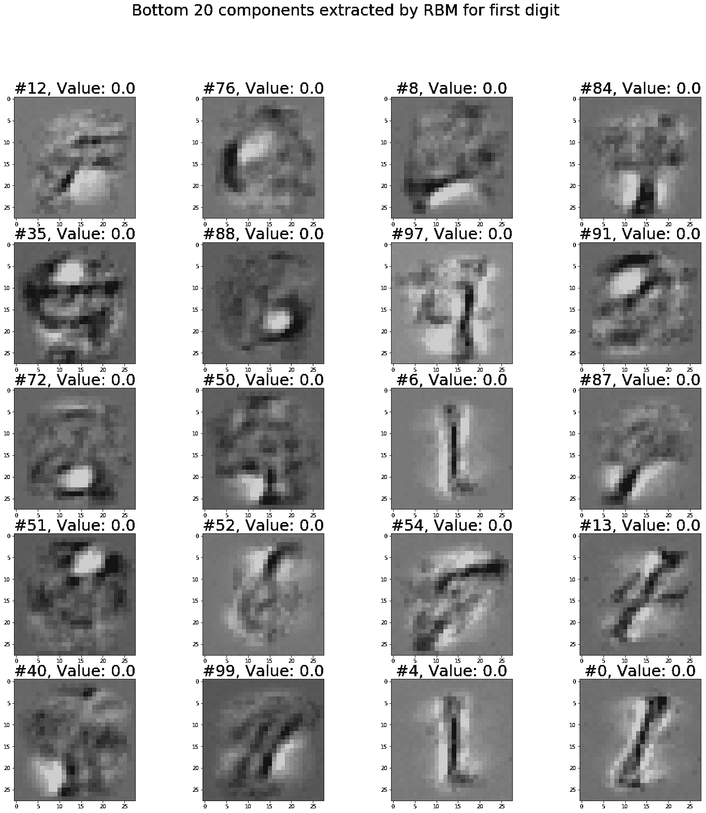

**组件 13** 、**组件 4** 、**组件 97** 以及其他组件似乎试图显示不同的数字而不是 5，因此这些组件没有被像素强度的组合照亮是有道理的。


# 在机器学习管道中使用 RBM

当然，我们希望看到 RBM 在我们的机器学习管道中的表现，不仅要可视化模型的工作，还要看到特征学习的具体结果。为此，我们将创建并运行三个管道:

*   在原始像素强度上运行的逻辑回归模型本身
*   对提取的 PCA 成分进行逻辑回归
*   对提取的 RBM 成分进行逻辑回归

这些管道中的每一条都将在多个组件(PCA 和 RBM)和逻辑回归的`C`参数中进行网格搜索。让我们从最简单的管道开始。我们将通过逻辑回归运行原始像素值，以查看线性模型是否足以分离出数字。


# 对原始像素值使用线性模型

首先，我们将通过逻辑回归模型运行原始像素值，以获得某种基线模型。我们想看看利用 PCA 或 RBM 组件是否会允许相同的线性分类器执行得更好或更差。如果我们可以发现提取的潜在特征表现得更好(就我们的线性模型的准确性而言)，那么我们可以确定是我们正在使用的特征工程增强了我们的管道，而不是其他。

首先，我们将创建实例化的模块:

```
# import logistic regression and gridsearch module for some machine learning

 from sklearn.linear_model import LogisticRegression
 from sklearn.model_selection import GridSearchCV

 # create our logistic regression
 lr = LogisticRegression()
 params = {'C':[1e-2, 1e-1, 1e0, 1e1, 1e2]}

 # instantiate a gridsearch class
 grid = GridSearchCV(lr, params)
```

一旦我们做到这一点，我们可以将我们的模块适应我们的原始图像数据。这将让我们大致了解原始像素数据在机器学习管道中的表现:

```
 # fit to our data
 grid.fit(images_X, images_y)

 # check the best params
 grid.best_params_, grid.best_score_

 ({'C': 0.1}, 0.88749999999999996)
```

逻辑回归本身在使用原始像素值来识别数字方面做得很好，给出了大约 88.75%的交叉验证准确度**。**


# 对提取的 PCA 成分使用线性模型

让我们看看能否在流水线中增加一个 PCA 元件来提高精度。我们将通过设置变量重新开始。这一次，我们需要创建一个 scikit-learn 管道对象来容纳 PCA 模块以及我们的线性模型。我们将保留用于线性分类器的相同参数，并为我们的 PCA 添加新参数。我们将尝试在 10、100 和 200 个组件之间找到最佳的组件数量。试着花点时间假设三个中哪一个最终会是最好的(提示，回想一下 scree 图和解释的方差):

```
# Use PCA to extract new features

lr = LogisticRegression()
pca = PCA()

# set the params for the pipeline
params = {'clf__C':[1e-1, 1e0, 1e1],
'pca__n_components': [10, 100, 200]}

# create our pipeline
pipeline = Pipeline([('pca', pca), ('clf', lr)])

# instantiate a gridsearh class
grid = GridSearchCV(pipeline, params)
```

我们现在可以让 gridsearch 对象适合我们的原始图像数据。请注意，管道会自动从原始像素数据中提取特征并进行转换:

```
 # fit to our data
grid.fit(images_X, images_y)

# check the best params
grid.best_params_, grid.best_score_

({'clf__C': 1.0, 'pca__n_components': 100}, 0.88949999999999996)
```

我们最终获得了 88.95%的交叉验证准确率(稍微好一点)。如果我们仔细想想，我们就不会对 100 是 10、100 和 200 中的最佳选项感到惊讶。根据我们对上一节中的碎石图的简要分析，我们发现 64%的数据仅由 30 个分量解释，因此 10 个分量肯定不足以很好地解释图像。scree 图也在大约 100 个分量时开始变平，这意味着在第 100 个分量之后，解释的方差实际上没有增加太多，所以 200 个分量太多了，可能会导致一些过度拟合。这样我们就有了 100 个 PCA 组件的最佳使用数量。应该注意的是，我们可以更进一步，尝试一些超参数调整，以找到更优化的组件数量，但现在我们将保持管道不变，转而使用 RBM 组件。


# 对提取的 RBM 分量使用线性模型

就准确性而言，即使是最佳数量的 PCA 成分也无法单独击败逻辑回归。让我们看看我们的 RBM 做得怎么样。要制作以下管道，我们将为逻辑回归模型保留相同的参数，并在 10、100 和 200 之间找到最佳组件数量(就像我们对 PCA 管道所做的那样)。请注意，我们可以尝试扩展特征的数量，使其超过原始像素的数量(784)，但我们不会尝试这样做。

我们以同样的方式开始设置变量:

```
# Use the RBM to learn new features

rbm = BernoulliRBM(random_state=0)

# set up the params for our pipeline.
params = {'clf__C':[1e-1, 1e0, 1e1],
'rbm__n_components': [10, 100, 200]
}

# create our pipeline
pipeline = Pipeline([('rbm', rbm), ('clf', lr)])

# instantiate a gridsearch class
grid = GridSearchCV(pipeline, params)
```

将这种网格搜索与我们的原始像素相匹配，将会揭示最佳的组件数量:

```
# fit to our data
grid.fit(images_X, images_y)

# check the best params
grid.best_params_, grid.best_score_

({'clf__C': 1.0, 'rbm__n_components': 200}, 0.91766666666666663)
```

我们的 RBM 模块具有 **91.75%的交叉验证准确性**，能够从我们的手指中提取 200 个新特征，并将准确性提高了 3%(这是一个很大的提升！)除了将 BernoulliRBM 模块添加到我们的管道中之外，不做任何其他事情。

200 是组件的最佳数量这一事实表明，我们甚至可以通过尝试提取 200 个以上的组件来获得更高的性能。我们将把这作为一个练习留给读者。

这证明了这样一个事实，即当处理非常复杂的任务，如图像识别、音频处理和自然语言处理时，特征学习算法工作得非常好。这些大而有趣的数据集具有隐藏的成分，这些成分很难被线性变换(如 PCA 或 LDA)提取，但非参数算法(如 RBM)可以。


# 学习文本特征——单词矢量化

我们的特征学习的第二个例子将从图像转向文本和自然语言处理。当机器学习读/写时，它们面临一个非常大的问题，即上下文。在前面的章节中，我们已经能够通过计算每个文档中出现的字数来对文档进行矢量化，并将这些矢量输入到机器学习管道中。通过构建新的基于计数的特征，我们能够在我们的监督机器学习管道中使用文本。在某种程度上，这是非常有效的。我们仅限于理解文本，就好像它们只是一袋单词。这意味着我们认为文档只不过是无序单词的集合。

更重要的是，每个单词本身都没有意义。只有在其他单词的集合中，当使用模块`CountVectorizer`和`TfidfVectorizer`时，文档才有意义。正是由于这个原因，我们将把注意力从 scikit-learn 转移到一个叫做`gensim`的模块上，用于计算单词嵌入。


# 单词嵌入

到目前为止，我们已经使用 scikit-learn 将文档(tweets、评论、URL 等)嵌入到矢量化格式中，将标记(单词、n 元语法)视为特征，并将文档视为具有一定数量的这些标记。例如，如果我们有 1，583 个文档，我们告诉我们的`CountVectorizer`从一到五学习`ngram_range`的前 1，000 个标记，我们将得到一个形状矩阵(1583，1000 ),其中每行代表一个文档，1，000 列代表语料库中找到的文字 n 元语法。但是我们如何达到更低层次的理解呢？我们如何开始教机器*在上下文中是什么意思*？

例如，如果我们问你以下问题，你可以给出以下答案:

*问:如果我们把一个国王去掉男性的一面，换成一个女人，你会得到什么？*

***答:一个女王***

问:伦敦之于英国，就像巴黎之于 ____。

***答:法国***

你，一个人类，可能会发现这些问题很简单，但是如果机器不知道单词本身在上下文中的意思，它是如何解决这个问题的呢？事实上，这是我们在自然语言处理任务中面临的最大挑战之一。

单词嵌入是帮助机器理解上下文的一种方法。一个**单词嵌入**是单个单词在 n 维特征空间的矢量化，其中 *n* 代表一个单词可以拥有的潜在特征的数量。这意味着我们词汇中的每个单词不再是一个字符串，而是一个向量。例如，如果我们对每个单词提取 n=5 个特征，那么我们词汇表中的每个单词将对应于一个 1×5 的向量。例如，我们可能有以下矢量化:

```
# set some fake word embeddings
king = np.array([.2, -.5, .7, .2, -.9])
man = np.array([-.5, .2, -.2, .3, 0.])
woman = np.array([.7, -.3, .3, .6, .1])

queen = np.array([ 1.4, -1\. , 1.2, 0.5, -0.8])
```

有了这些向量化，我们就可以解决这个问题*如果我们拿一个国王，去掉他的男人一面，换成一个女人，你会得到什么？*通过执行以下操作:

国王-男人+女人

在代码中，这将类似于:

```
np.array_equal((king - man + woman), queen)

True
```

这看起来很简单，但是有一些注意事项:

*   上下文(以单词嵌入的形式)随着语料库的不同而变化，单词含义也是如此。这意味着静态单词嵌入本身并不总是最有用的
*   单词嵌入依赖于学习它们的语料库

单词嵌入允许我们对单个单词进行非常精确的计算，以获得我们可能认为的上下文。


# 单词嵌入的两种方法——word 2 vec 和 GloVe

有两类算法主导了单词嵌入的空间。它们分别叫做 **Word2vec** 和 **GloVe** 。这两种方法都负责通过从非常大的语料库(文本文档的集合)中学习来产生单词嵌入。这两种算法的主要区别在于，斯坦福大学的 GloVe 算法通过一系列矩阵统计来学习单词嵌入，而谷歌的 Word2vec 则通过深度学习方法来学习。这两种算法都有优点，我们的文本将集中在使用 Word2vec 算法来学习单词嵌入。


# Word2Vec -另一种浅层神经网络

为了学习和提取单词嵌入，Word2vec 将实现另一个浅层神经网络。这一次，我们将故意放入正确的数据，给我们正确的单词嵌入，而不是一般地将新数据放入我们的可见层。不涉及太多细节，想象一个具有以下结构的神经架构:

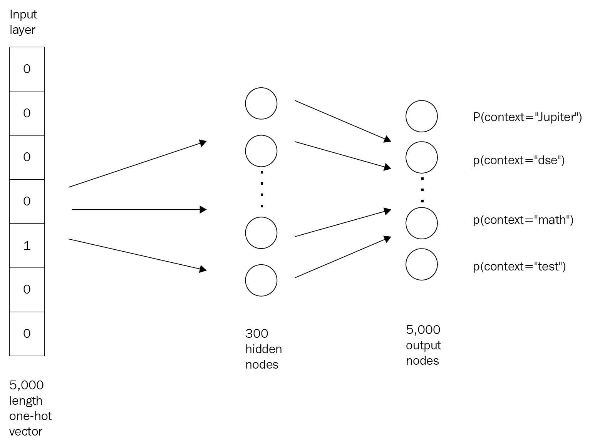

像 RBM 一样，我们有一个可见的输入层和一个隐藏层。在这种情况下，我们的输入层的节点数与我们希望学习的词汇长度一样多。如果我们有一个数百万单词的语料库，但我们希望只学习其中的一小部分，这就很方便了。在上图中，我们将学习 5000 个单词的上下文。图中的隐藏层代表了我们希望了解的每个单词的特征数量。在这种情况下，我们将把单词嵌入到 300 维的空间中。

这种神经网络和我们用于 RBM 的神经网络之间的主要区别在于输出层的存在。请注意，在我们的图表中，输出层的节点数与输入层一样多。这不是巧合。单词嵌入模型通过*基于参考单词的存在预测*附近的单词来工作。例如，如果我们要预测单词 *calculus* ，我们会希望最后的`math`节点最亮。这给出了监督机器学习算法的外观。

然后，我们在这种结构上训练图形，最终通过传入单词的一键向量并提取隐藏层的输出向量并将其用作我们的潜在结构来学习 300 维单词表示。在生产中，由于输出节点数量非常大，前面的图表效率非常低。为了使这个过程在计算上更加高效，利用不同的损失函数来利用文本的结构。


# 用于创建 Word2vec 嵌入的 gensim 包

我们不会实现一个完整的工作神经网络来执行单词嵌入过程，但是我们将使用一个名为`gensim`的 Python 包来为我们完成这项工作:

```
# import the gensim package
 import gensim
```

一个`gensim`可以接受一个文本语料库，并为我们运行前面的神经网络结构，只需几行代码就可以获得单词嵌入。为了看到这一点，让我们先导入一个标准语料库。让我们在笔记本中设置一个记录器，这样我们可以更详细地了解培训过程:

```
import logging

 logging.basicConfig(format='%(asctime)s : %(levelname)s : %(message)s', level=logging.INFO)
```

现在，让我们创建我们的语料库:

```
from gensim.models import word2vec, Word2Vec

sentences = word2vec.Text8Corpus('../data/text8')
```

注意术语`word2vec`。这是一种用于计算单词嵌入的特定算法，也是`gensim`使用的主要算法。它是单词嵌入的标准之一。

为了让 gensim 完成它的工作，句子需要是任何可迭代的(列表、生成器、元组等等),包含已经标记化的句子。一旦我们有了这样一个变量，我们就可以通过学习单词嵌入来使用`gensim`:

```
# instantiate a gensim module on the sentences from above
 # min_count allows us to ignore words that occur strictly less than this value
 # size is the dimension of words we wish to learn
 model = gensim.models.Word2Vec(sentences, min_count=1, size=20)

 2017-12-29 16:43:25,133 : INFO : collecting all words and their counts
 2017-12-29 16:43:25,136 : INFO : PROGRESS: at sentence #0, processed 0 words, keeping 0 word types
 2017-12-29 16:43:31,074 : INFO : collected 253854 word types from a corpus of 17005207 raw words and 1701 sentences
 2017-12-29 16:43:31,075 : INFO : Loading a fresh vocabulary
 2017-12-29 16:43:31,990 : INFO : min_count=1 retains 253854 unique words (100% of original 253854, drops 0)
 2017-12-29 16:43:31,991 : INFO : min_count=1 leaves 17005207 word corpus (100% of original 17005207, drops 0)
 2017-12-29 16:43:32,668 : INFO : deleting the raw counts dictionary of 253854 items
 2017-12-29 16:43:32,676 : INFO : sample=0.001 downsamples 36 most-common words
 2017-12-29 16:43:32,678 : INFO : downsampling leaves estimated 12819131 word corpus (75.4% of prior 17005207)
 2017-12-29 16:43:32,679 : INFO : estimated required memory for 253854 words and 20 dimensions: 167543640 bytes
 2017-12-29 16:43:33,431 : INFO : resetting layer weights
 2017-12-29 16:43:36,097 : INFO : training model with 3 workers on 253854 vocabulary and 20 features, using sg=0 hs=0 sample=0.001 negative=5 window=5
 2017-12-29 16:43:37,102 : INFO : PROGRESS: at 1.32% examples, 837067 words/s, in_qsize 5, out_qsize 0
 2017-12-29 16:43:38,107 : INFO : PROGRESS: at 2.61% examples, 828701 words/s,
 ... 2017-12-29 16:44:53,508 : INFO : PROGRESS: at 98.21% examples, 813353 words/s, in_qsize 6, out_qsize 0 2017-12-29 16:44:54,513 : INFO : PROGRESS: at 99.58% examples, 813962 words/s, in_qsize 4, out_qsize 0
 ... 2017-12-29 16:44:54,829 : INFO : training on 85026035 raw words (64096185 effective words) took 78.7s, 814121 effective words/s
```

这行代码将开始学习过程。如果你正在传递一个大的语料库，这可能需要一段时间。现在`gensim`模块已经安装完毕，我们可以使用它了。我们可以通过将字符串传递给`word2vec`对象来获取单个嵌入:

```
# get the vectorization of a word
 model.wv['king']

 array([-0.48768288, 0.66667134, 2.33743191, 2.71835423, 4.17330408, 2.30985498, 1.92848825, 1.43448424, 3.91518641, -0.01281452, 3.82612252, 0.60087812, 6.15167284, 4.70150518, -1.65476751, 4.85853577, 3.45778084, 5.02583361, -2.98040175, 2.37563372], dtype=float32)
```

`gensim`有内置的方法来充分利用我们的单词嵌入。例如，要回答关于`king`的问题，我们可以使用`most_similar`方法:

```
# woman + king - man = queen
 model.wv.most_similar(positive=['woman', 'king'], negative=['man'], topn=10)

 [(u'emperor', 0.8988120555877686), (u'prince', 0.87584388256073), (u'consul', 0.8575721979141235), (u'tsar', 0.8558996319770813), (u'constantine', 0.8515684604644775), (u'pope', 0.8496872782707214), (u'throne', 0.8495982885360718), (u'elector', 0.8379884362220764), (u'judah', 0.8376096487045288), (u'emperors', 0.8356839418411255)]
```

嗯，不幸的是，这并没有给出我们期望的答案:`queen`。让我们试试`Paris`单词联想:

```
# London is to England as Paris is to ____
 model.wv.most_similar(positive=['Paris', 'England'], negative=['London'], topn=1)

 KeyError: "word 'Paris' not in vocabulary"
```

似乎单词`Paris`从未被学习过，因为它没有出现在我们的语料库中。我们可以开始看到这一程序的局限性。我们的嵌入只能和我们选择的语料库以及我们用来计算这些嵌入的机器一样好。在我们的数据目录中，我们提供了一个预先训练好的词汇库，涵盖了从 Google 索引的网站上找到的 3，000，000 个单词，每个单词有 300 个学习维度。

让我们继续导入这些预先训练好的嵌入。我们可以通过使用`gensim`中的内置导入工具来实现这一点:

```
# use a pretrained vocabulary with 3,000,000 words
 import gensim

 model = gensim.models.KeyedVectors.load_word2vec_format('../data/GoogleNews-vectors-negative300.bin', binary=True)

 # 3,000,000 words in our vocab
 len(model.wv.vocab)

 3000000
```

这些嵌入已经使用比我们在家里拥有的任何东西都强大得多的机器训练了很长一段时间。现在让我们来试试我们的应用题:

```
# woman + king - man = queen
 model.wv.most_similar(positive=['woman', 'king'], negative=['man'], topn=1)

 [(u'queen', 0.7118192911148071)]

 # London is to England as Paris is to ____
 model.wv.most_similar(positive=['Paris', 'England'], negative=['London'], topn=1)

 [(u'France', 0.6676377654075623)]
```

太棒了。似乎这些单词嵌入被训练得足够让我们回答这些复杂的字谜。前面使用的`most_similar`方法将返回词汇表中与提供的单词最相似的标记。在`positive`列表中的单词是彼此相加的向量，而在`negative`列表中的单词是从产生的向量中减去的。下图直观地展示了我们如何使用词向量来提取意思:

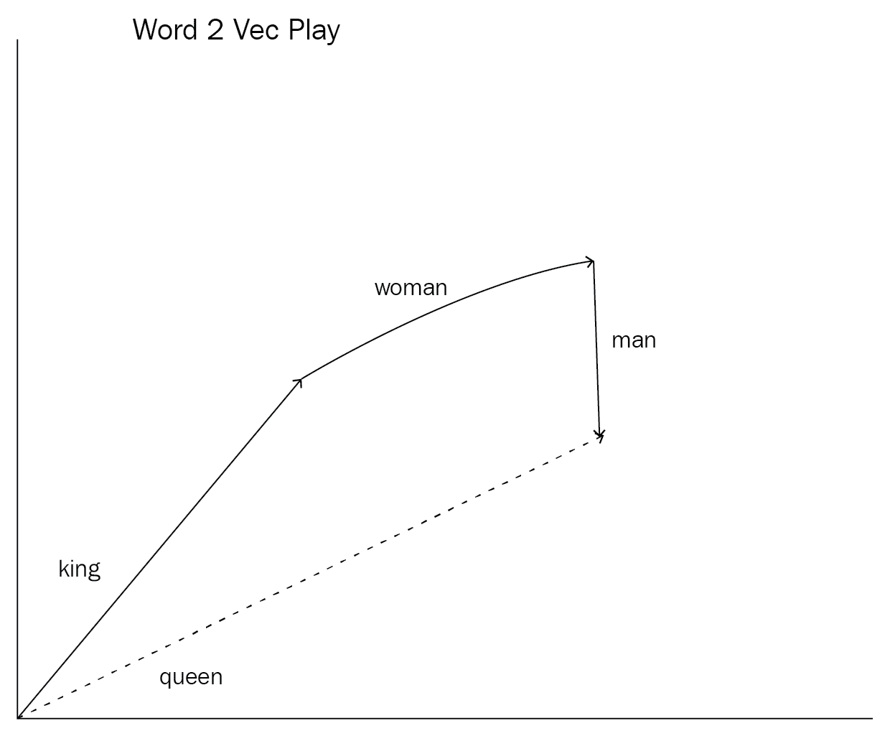

在这里，我们从国王的矢量表示开始，并添加女人的概念(矢量)。从那里，我们减去 **man** 向量(通过加上向量的负数)得到虚线向量。这个矢量与**皇后**的矢量表示最为相似。这是我们如何获得公式:

*国王+女人-男人=王后*

`gensim`有其他我们可以利用的方法，比如`doesnt_match`。该方法挑选出不属于单词列表的单词。它通过隔离平均来说与其余单词最不相似的单词来做到这一点。例如，如果我们给这个方法四个单词，其中三个是动物，另一个是植物，我们希望它能找出哪一个不属于:

```
# Pick out the oddball word in a sentence
model.wv.doesnt_match("duck bear cat tree".split())

'tree'
```

该软件包还包括计算单个单词之间 0-1 相似度的方法，可用于即时比较单词:

```
# grab a similarity score between 0 and 1

# the similarity between the words woman and man, pretty similar
model.wv.similarity('woman', 'man')
0.766401223

# similarity between the words tree and man, not very similar
model.wv.similarity('tree', 'man')
0.229374587
```

在这里，我们可以看到`man`更类似于`woman`，而不是`man`更类似于`tree`。我们可以使用这些有用的方法来实现单词嵌入的一些有用的应用，否则这是不可能的。


# 词嵌入的应用——信息检索

单词嵌入有无数的应用；其中之一是在信息检索领域。当人们在搜索引擎中输入关键词和关键短语时，搜索引擎能够回忆和呈现与这些关键词精确匹配的特定文章/故事。例如，如果我们搜索关于狗的文章，我们会得到提到狗这个词的文章。但是如果我们搜索犬科动物这个词呢？基于犬科动物就是狗这一事实，我们仍然应该期待看到关于狗的文章。让我们实现一个简单的信息检索系统来展示单词嵌入的威力。

让我们创建一个函数，尝试从我们的 gensim 包中获取单个单词的嵌入，如果查找失败，则返回 None:

```
# helper function to try to grab embeddings for a word and returns None if that word is not found
def get_embedding(string):
    try:
        return model.wv[string]
    except:
        return None
```

现在，让我们创建三个文章标题，一个关于一个`dog`，一个关于一个`cat`，还有一个关于绝对`nothing`作为干扰物:

```
# very original article titles
 sentences = [
 "this is about a dog",
 "this is about a cat",
 "this is about nothing"
]
```

目标是输入一个类似于`dog`或`cat`的参考词，并能够抓取更相关的标题。为此，我们将首先为每个句子创建一个 3 x 300 的矢量化矩阵。我们将通过取句子中每个单词的平均值，并使用得到的平均值向量作为整个句子矢量化的估计来实现这一点。一旦我们有了每个句子的矢量化，我们就可以通过在它们之间取点积来将它与参考单词的嵌入进行比较。最接近的向量是具有最大点积的向量:

```
# Zero matrix of shape (3,300)
vectorized_sentences = np.zeros((len(sentences),300))
# for every sentence
for i, sentence in enumerate(sentences):
    # tokenize sentence into words
    words = sentence.split(' ')
    # embed whichever words that we can
    embedded_words = [get_embedding(w) for w in words]
    embedded_words = filter(lambda x:x is not None, embedded_words)
    # Take a mean of the vectors to get an estimate vectorization of the sentence
    vectorized_sentence = reduce(lambda x,y:x+y, embedded_words)/len(embedded_words)
    # change the ith row (in place) to be the ith vectorization
    vectorized_sentences[i:] = vectorized_sentence

vectorized_sentences.shape
(3, 300)
```

这里需要注意的一点是，我们正在创建文档的矢量化(单词集合),而没有考虑单词的顺序。这比利用`CountVectorizer`或`TfidfVectorizer`获取基于计数的文本矢量化有何优势？gensim 方法试图将我们的文本投射到通过单个单词的上下文学习的潜在结构上，而 scikit-learn 矢量器只能使用 vocab 来创建我们的矢量。在这三句话中，只有七个独特的词:

`this`、`is`、`about`、`a`、`dog`、`cat`、`nothing`

所以，我们的`CountVectorizer`或者`TfidfVectorizer`能够投射的最大形状是(3，7)。让我们试着找出与单词`dog`最相关的句子:

```
# we want articles most similar to the reference word "dog"
reference_word = 'dog'

# take a dot product between the embedding of dof and our vectorized matrix
best_sentence_idx = np.dot(vectorized_sentences, get_embedding(reference_word)).argsort()[-1]

# output the most relevant sentence
sentences[best_sentence_idx]

'this is about a dog'
```

这个很简单。给定单词`dog`，我们应该能够检索到关于一个`dog`的句子。如果我们输入单词`cat`，这也应该成立:

```
reference_word = 'cat'
best_sentence_idx = np.dot(vectorized_sentences, get_embedding(reference_word)).argsort()[-1]

sentences[best_sentence_idx]

'this is about a cat'
```

现在，让我们试试更难的。让我们输入单词`canine`和`tiger`，看看我们是否分别得到`dog`和`cat`句子:

```
reference_word = 'canine'
best_sentence_idx = np.dot(vectorized_sentences, get_embedding(reference_word)).argsort()[-1]

print sentences[best_sentence_idx]

'this is about a dog'

reference_word = 'tiger'
best_sentence_idx = np.dot(vectorized_sentences, get_embedding(reference_word)).argsort()[-1]

print sentences[best_sentence_idx]

'this is about a cat'
```

让我们试试一个稍微有趣一点的例子。以下是 Sinan 第一本书*数据科学原理*的章节标题:

```
# Chapter titles from Sinan's first book, "The Principles of Data Science

 sentences = """How to Sound Like a Data Scientist
 Types of Data
 The Five Steps of Data Science
 Basic Mathematics
 A Gentle Introduction to Probability
 Advanced Probability
 Basic Statistics
 Advanced Statistics
 Communicating Data
 Machine Learning Essentials
 Beyond the Essentials
 Case Studies """.split('\n')
```

这将给我们一个 12 个不同章节标题的列表。我们的目标是使用一个参考词来排序和提供给定主题的前三个最相关的章节标题。例如，如果我们要求我们的算法给出与*数学*相关的章节，我们可能期望被推荐关于基础数学、统计学和概率的章节。

让我们试着看看哪些章节是最好读的，给定人类输入。在我们这样做之前，让我们计算一个矢量化文档的矩阵，就像我们对前面三个句子所做的那样:

```
# Zero matrix of shape (3,300)
vectorized_sentences = np.zeros((len(sentences),300))
# for every sentence
for i, sentence in enumerate(sentences):
    # tokenize sentence into words
    words = sentence.split(' ')
    # embed whichever words that we can
    embedded_words = [get_embedding(w) for w in words]
    embedded_words = filter(lambda x:x is not None, embedded_words)
    # Take a mean of the vectors to get an estimate vectorization of the sentence
    vectorized_sentence = reduce(lambda x,y:x+y, embedded_words)/len(embedded_words)
    # change the ith row (in place) to be the ith vectorization
    vectorized_sentences[i:] = vectorized_sentence

vectorized_sentences.shape
(12, 300)
```

现在，让我们找到与`math`最相关的章节:

```
# find chapters about math
reference_word = 'math'
best_sentence_idx = np.dot(vectorized_sentences, get_embedding(reference_word)).argsort()[-3:][::-1]

[sentences[b] for b in best_sentence_idx]

['Basic Mathematics', 'Basic Statistics', 'Advanced Probability ']
```

现在，假设我们正在做一个关于数据的演讲，并想知道哪些章节在该领域最有帮助:

```
# which chapters are about giving talks about data
reference_word = 'talk'
best_sentence_idx = np.dot(vectorized_sentences, get_embedding(reference_word)).argsort()[-3:][::-1]

[sentences[b] for b in best_sentence_idx]

['Communicating Data ', 'How to Sound Like a Data Scientist', 'Case Studies ']
```

最后，哪些章节是关于`AI`的:

```
# which chapters are about AI
reference_word = 'AI'
best_sentence_idx = np.dot(vectorized_sentences, get_embedding(reference_word)).argsort()[-3:][::-1]

[sentences[b] for b in best_sentence_idx]

['Advanced Probability ', 'Advanced Statistics', 'Machine Learning Essentials']
```

我们可以看到，在给定从文本世界中学习到的上下文的情况下，我们如何使用单词嵌入来检索文本形式的信息。


# 摘要

本章重点介绍了两个特征学习工具:RBM 和单词嵌入过程。

这两个过程都利用深度学习架构，以便基于原始数据学习新的特征集。这两种技术都利用浅层网络来优化训练时间，并使用在拟合阶段学习到的权重和偏差来提取数据的潜在结构。

我们的下一章将展示从开放互联网上获取的真实数据的四个特征工程示例，以及我们在本书中学习的工具如何帮助我们创建最佳的机器学习管道。*