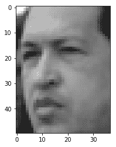
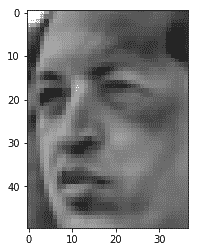
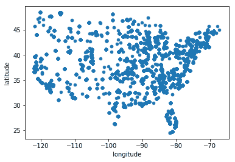
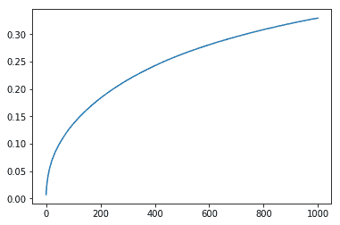

# 八、个案研究

这本书经历了几个不同的特征工程算法，我们已经与许多不同的数据集。在这一章中，我们将通过几个案例研究来帮助你加深对我们在书中涉及的主题的理解。我们将从头到尾完成两个完整的案例研究，以进一步了解特征工程任务如何帮助我们为现实生活中的应用程序创建机器学习管道。对于每个案例研究，我们将了解:

*   我们正在努力开发的应用程序
*   我们正在使用的数据
*   简短的探索性数据分析
*   建立我们的机器学习管道并收集指标

此外，我们将查看以下案例:

*   面部识别
*   预测酒店评论数据

我们开始吧！


# 案例研究 1 -面部识别

我们的第一个案例研究将使用 scikit-learn 库中的`Wild`数据集中一个名为**标签人脸**的流行数据集来预测图像数据的标签。该数据集被称为`Olivetti Face`数据集，它包括名人的脸部照片，并带有适当的标签。我们的任务是**面部识别**，这是一个受监督的机器学习模型，能够在给定一张人脸图像的情况下预测出这个人的名字。


# 面部识别的应用

图像处理和面部识别影响深远。从视频/图像中的人群中快速识别人脸的能力对于物理安全和大型社交媒体公司来说至关重要。谷歌等搜索引擎凭借其图像搜索特征，正在使用图像识别算法来匹配图像并量化相似性，以至于我们可以上传某人的照片来获取同一个人的所有其他图像。


# 数据

让我们从加载我们的数据集和其他几个我们将用来绘制数据的导入语句开始。在 Jupyter 笔记本(iPython)中开始记录您将使用的所有导入语句是一个很好的做法。显然，您可能会在工作进行到一半时意识到您需要导入一个新的包；此外，为了保持有组织性，在你工作的开始阶段使用它们是一个好主意。

下面的代码块包括我们将在这个案例研究中使用的`import`语句。我们将在示例中利用每一个导入，当我们完成示例时，您将会清楚每个导入的用途:

```
# the olivetti face dataset
from sklearn.datasets import fetch_lfw_people

# feature extraction modules

from sklearn.decomposition import PCA

from sklearn.discriminant_analysis import LinearDiscriminantAnalysis

# feature scaling module
from sklearn.preprocessing import StandardScaler 

# standard python modules
from time import time 
import numpy as np 
import matplotlib.pyplot as plt

%matplotlib inline # this ensures that your plotting will show directly in your jupyter notebook

# scikit-learn model selection modules from sklearn.model_selection import train_test_split, GridSearchCV, cross_val_score

# metrics
from sklearn.metrics import classification_report, confusion_matrix, accuracy_score 

# machine learning modules
from sklearn.linear_model import LogisticRegression
from sklearn.pipeline import Pipeline 

```

现在，我们可以开始了！我们进行如下操作:

1.  首先，让我们加载数据集，看看我们在处理什么。我们将使用 scikit-learn 内置的`fetch_flw_people`特征:

```
lfw_people = fetch_lfw_people(min_faces_per_person=70, resize=0.4)
```

如您所见，我们调用了几个可选参数，具体来说就是`min_faces_per_person`和`resize`。第一个参数将只保留我们指定的最少数量的不同图片中的人的图片。我们将此设置为每人最少拥有`70`张不同的照片。`resize`参数是用来调整每个人脸图片大小的比例。

2.  让我们检查图像数组，找到绘制图像的形状。我们可以用下面的代码做到这一点:

```
n_samples, h, w = lfw_people.images.shape

n_samples, h, w

(1288, 50, 37) 
```

我们看到有`1288`个样本(图像),每个图像的高度为`50`像素，宽度为`37`像素。

3.  现在，让我们为我们的机器学习管道设置`X`和`y`。我们将获取`lfw_people`对象的`data`属性:

```
# for machine learning we use the data directly (as relative pixel positions info is ignored by this model)

X = lfw_people.data

y = lfw_people.target

n_features = X.shape[1]

n_features
1850 
```

`n_features`最终拥有`1,850`列是因为:


我们现在可以看到数据的完整形态，如下所示:

```
X.shape

(1288, 1850)
```


# 一些数据探索

我们有 1288 行乘以 1850 列。为了进行一些简短的探索性分析，我们可以使用以下代码绘制其中一幅图像:

```
# plot one of the faces

plt.imshow(X[0].reshape((h, w)), cmap=plt.cm.gray)

lfw_people.target_names[y[0]]
```

这将为我们提供以下标签:

```
'Hugo Chavez'
```

图像如下:



现在，让我们在应用缩放模块后绘制相同的图像，如下所示:

```
plt.imshow(StandardScaler().fit_transform(X)[0].reshape((h, w)), cmap=plt.cm.gray)

lfw_people.target_names[y[0]]
```

这给了我们这样的输出:

```
'Hugo Chavez'
```

对于前面的代码，我们得到了以下图像:



在这里，你可以看到图像略有不同，脸部周围的像素更暗。现在，让我们设置标签来预测:

```
# the label to predict is the id of the person

target_names = lfw_people.target_names

n_classes = target_names.shape[0]

print "Total dataset size:"

print "n_samples: %d" % n_samples

print "n_features: %d" % n_features

print "n_classes: %d" % n_classes
```

这为我们提供了以下输出:

```
Total dataset size:

n_samples: 1288

n_features: 1850

n_classes: 7
```


# 应用面部识别

现在，我们可以继续讨论将用于创建面部识别模型的机器学习管道:

1.  我们可以从在数据集中创建`train`、`test`和`split`开始，如下面的代码块所示:

```
# let's split our dataset into training and testing

X_train, X_test, y_train, y_test = train_test_split(X, y, test_size=0.25, random_state=1)
```

2.  我们准备对数据集执行**主成分分析** ( **PCA** )。我们将希望首先实例化一个`PCA`,并确保在管道中应用 PCA 之前对数据进行`scale`。这可以通过以下方式完成:

```
# instantiate the PCA module

pca = PCA(n_components=200, whiten=True)

# create a pipeline called preprocessing that will scale data and then apply PCA

preprocessing = Pipeline([('scale', StandardScaler()), ('pca', pca)])
```

3.  现在，我们可以`fit`我们的管道:

```
print "Extracting the top %d eigenfaces from %d faces" % (200, X_train.shape[0])

# fit the pipeline to the training set

preprocessing.fit(X_train)

# grab the PCA from the pipeline

extracted_pca = preprocessing.steps[1][1]
```

4.  输出将是我们的打印声明:

```
Extracting the top 200 eigenfaces from 966 faces
```

5.  让我们看看碎石图:

```
# Scree Plot

plt.plot(np.cumsum(extracted_pca.explained_variance_ratio_))
```

我们可以看到，与 1，850 个原始特性相比，从 100 个组件开始可以捕获超过 90%的差异。

6.  我们可以创建一个函数来绘制 PCA 组件，如下所示:

```
comp = extracted_pca.components_

image_shape = (h, w)

def plot_gallery(title, images, n_col, n_row):

    plt.figure(figsize=(2\. * n_col, 2.26 * n_row))

    plt.suptitle(title, size=16)

    for i, comp in enumerate(images):

        plt.subplot(n_row, n_col, i + 1)

        vmax = max(comp.max(), -comp.min())

        plt.imshow(comp.reshape(image_shape), cmap=plt.cm.gray,            

                   vmin=-vmax, vmax=vmax)

        plt.xticks(())

        plt.yticks(())

    plt.subplots_adjust(0.01, 0.05, 0.99, 0.93, 0.04, 0.)

    plt.show()    
```

7.  我们现在可以调用我们的`plot_gallery`函数，就像这样:

```
plot_gallery('PCA components', comp[:16], 4,4)
```

输出给我们这些图像:


这让我们可以看到特定行和列的 PCA 组件！这些**特征脸**是 PCA 模块正在寻找的人类的提取特征。将此结果与我们在[第 7 章](e1c6751c-a892-4cf3-9c54-53e9bb3e1431.xhtml)、*特征学习*中的结果进行比较，其中我们使用 PCA 提取**特征数字**。这些组件中的每一个都意味着存储了关于面部的重要信息，可以用来区分不同的人。例如:

*   第三行第四列中的特征脸似乎突出了小胡子和胡须区域，以便量化多少面部毛发有助于区分我们的类别
*   第一行第四列中的特征脸似乎显示了背景和脸之间的对比，为图像的光照情况设定了一个数字

当然，这些是我们的解释，不同人脸数据集的不同特征脸将输出不同的图像/分量。我们将继续创建一个函数，它将允许我们清晰地打印一个可读性更好的混淆矩阵，其中包含热点标签和标准化选项:

```
import itertools

def plot_confusion_matrix(cm, classes,

                          normalize=False,

                          title='Confusion matrix',

                          cmap=plt.cm.Blues):

    plt.imshow(cm, interpolation='nearest', cmap=cmap)

    plt.title(title)

    plt.colorbar()

    tick_marks = np.arange(len(classes))

    plt.xticks(tick_marks, classes, rotation=45)

    plt.yticks(tick_marks, classes)

    thresh = cm.max() / 2.

    for i, j in itertools.product(range(cm.shape[0]), range(cm.shape[1])):

        plt.text(j, i, cm[i, j],

                 horizontalalignment="center",

                 color="white" if cm[i, j] > thresh else "black")

    plt.ylabel('True label')

    plt.xlabel('Predicted label')
```

现在，我们可以在不使用 PCA 的情况下进行拟合，以查看差异。我们将调用我们的`plot_confusion_matrix`函数，这样我们可以可视化我们模型的准确性:

```
# fit without using PCA to see what the difference will be

t0 = time()

param_grid = {'C': [1e-2, 1e-1,1e0,1e1, 1e2]}

clf = GridSearchCV(logreg, param_grid)

clf = clf.fit(X_train, y_train)

best_clf = clf.best_estimator_

# Predicting people's names on the test set

y_pred = best_clf.predict(X_test)

print accuracy_score(y_pred, y_test), "Accuracy score for best estimator"

print(classification_report(y_test, y_pred, target_names=target_names))

print plot_confusion_matrix(confusion_matrix(y_test, y_pred, labels=range(n_classes)), target_names)

print round((time() - t0), 1), "seconds to grid search and predict the test set"
```

输出如下所示:

```
0.813664596273 Accuracy score for best estimator

                   precision    recall  f1-score   support

     Ariel Sharon       0.72      0.68      0.70        19

     Colin Powell       0.85      0.71      0.77        55

  Donald Rumsfeld       0.62      0.72      0.67        25

    George W Bush       0.88      0.91      0.89       142

Gerhard Schroeder       0.79      0.84      0.81        31

      Hugo Chavez       0.87      0.81      0.84        16

       Tony Blair       0.71      0.71      0.71        34

      avg / total       0.82      0.81      0.81       322

None

39.9 seconds to grid search and predict the test set
```

我们得到如下图:


仅使用原始像素，我们的线性模型能够达到 81.3%的 T21 精确度。这次我们来应用 PCA，看看会有什么不同。现在，我们将提取的组件数量硬编码为 200:

```
t0 = time()

face_pipeline = Pipeline(steps=[('PCA', PCA(n_components=200)), ('logistic', logreg)])

pipe_param_grid = {'logistic__C': [1e-2, 1e-1,1e0,1e1, 1e2]}

clf = GridSearchCV(face_pipeline, pipe_param_grid)

clf = clf.fit(X_train, y_train)

best_clf = clf.best_estimator_

# Predicting people's names on the test set

y_pred = best_clf.predict(X_test)

print accuracy_score(y_pred, y_test), "Accuracy score for best estimator"

print(classification_report(y_test, y_pred, target_names=target_names))

print plot_confusion_matrix(confusion_matrix(y_test, y_pred, labels=range(n_classes)), target_names)

print round((time() - t0), 1), "seconds to grid search and predict the test set"
```

PCA 的输出如下所示:

```
0.739130434783 Accuracy score for best estimator

                   precision    recall  f1-score   support

     Ariel Sharon       0.67      0.63      0.65        19

     Colin Powell       0.69      0.60      0.64        55

  Donald Rumsfeld       0.74      0.68      0.71        25

    George W Bush       0.76      0.88      0.82       142

Gerhard Schroeder       0.77      0.77      0.77        31

      Hugo Chavez       0.62      0.62      0.62        16

       Tony Blair       0.77      0.50      0.61        34

      avg / total       0.74      0.74      0.73       322

None

74.5 seconds to grid search and predict the test set
```

我们得到如下图:


有意思！我们可以看到，通过应用 PCA，我们的准确率下降到了 **73.9%** ，预测时间增加了。然而，我们不应该气馁；这可能意味着我们还没有找到要使用的最佳组件数量。

让我们在测试集中绘制一些预测名称与真实名称的对比图，以查看我们的模型产生的一些错误/正确标签:


在处理图像时，这是一种很好的可视化结果的方式。

现在让我们实现一个网格搜索，为我们的数据找到最佳模型和精确度。首先，我们将创建一个函数，它将为我们执行网格搜索，并为我们打印精确度、参数、平均拟合时间和平均得分时间。这个函数是这样创建的:

```
def get_best_model_and_accuracy(model, params, X, y):

    grid = GridSearchCV(model,           # the model to grid search

                        params,          # the parameter set to try 

                        error_score=0.)  # if a parameter set raises an error, continue and set the performance as a big, fat 0

    grid.fit(X, y)           # fit the model and parameters

    # our classical metric for performance

    print "Best Accuracy: {}".format(grid.best_score_)

    # the best parameters that caused the best accuracy

    print "Best Parameters: {}".format(grid.best_params_)

    # the average time it took a model to fit to the data (in seconds)

    print "Average Time to Fit (s): {}".format(round(grid.cv_results_['mean_fit_time'].mean(), 3))

    # the average time it took a model to predict out of sample data (in seconds)

    # this metric gives us insight into how this model will perform in real-time analysis

    print "Average Time to Score (s): {}".format(round(grid.cv_results_['mean_score_time'].mean(), 3))
```

现在，我们可以创建一个更大的网格搜索管道，其中包括更多组件，即:

*   缩放模块
*   PCA 模块，用于提取捕捉数据差异的最佳特征
*   一个**线性鉴别分析** ( **LDA** )模块，用于创建能够最好地将人脸彼此分开的特征
*   我们的线性分类器，将获得我们的三个特征工程模块的好处，并试图区分我们的脸

创建大型网格搜索管道的代码如下:

```
# Create a larger pipeline to gridsearch

face_params = {'logistic__C':[1e-2, 1e-1, 1e0, 1e1, 1e2], 

               'preprocessing__pca__n_components':[100, 150, 200, 250, 300],

               'preprocessing__pca__whiten':[True, False],

               'preprocessing__lda__n_components':range(1, 7)  

               # [1, 2, 3, 4, 5, 6] recall the max allowed is n_classes-1

              }

pca = PCA()

lda = LinearDiscriminantAnalysis()

preprocessing = Pipeline([('scale', StandardScaler()), ('pca', pca), ('lda', lda)])

logreg = LogisticRegression()

face_pipeline = Pipeline(steps=[('preprocessing', preprocessing), ('logistic', logreg)])

get_best_model_and_accuracy(face_pipeline, face_params, X, y)
```

结果如下:

```
Best Accuracy: 0.840062111801

Best Parameters: {'logistic__C': 0.1, 'preprocessing__pca__n_components': 150, 'preprocessing__lda__n_components': 5, 'preprocessing__pca__whiten': False}

Average Time to Fit (s): 0.214

Average Time to Score (s): 0.009
```

我们可以看到，我们的模型精度提高了很多，我们的预测和训练时间也非常快！


# 案例研究 2 -预测酒店评论数据的主题

我们的第二个案例研究将查看酒店评论数据，并尝试将评论按主题分组。我们将使用**潜在语义分析** ( **LSA** )，这是对稀疏文本文档-术语矩阵应用 PCA 的过程的名称。这样做是为了找到文本中的潜在结构，以便进行分类和聚类。


# 文本聚类的应用

文本**聚类**是将不同的主题分配给文本片段的行为，目的是理解文档是关于什么的。想象一下，一家大型连锁酒店每周会收到来自世界各地的数千条评论。酒店的员工想知道人们在说什么，以便更好地了解他们做得好的地方和可以改进的地方。

当然，这里的限制因素是人类快速正确阅读所有这些文本的能力。我们可以训练机器识别人们正在谈论的事物的类型，然后预测新的和即将到来的评论的主题，以便自动化这一过程。


# 酒店评论数据

我们将用来实现这个结果的数据集来自 Kaggle，可以在这里找到:[https://www.kaggle.com/datafiniti/hotel-reviews](https://www.kaggle.com/datafiniti/hotel-reviews)。它包含超过 35，000 条对全球 1，000 家不同酒店的不同评论。我们的工作将是分离评论的文本，并识别*主题*(人们在谈论什么)。然后，我们将创建一个机器学习模型，它可以预测/识别即将到来的评论的主题:

首先，让我们组织我们的导入语句，如下所示:

```
# used for row normalization
from sklearn.preprocessing import Normalizer

# scikit-learn's KMeans clustering module

from sklearn.cluster import KMeans

# data manipulation tool
import pandas as pd

# import a sentence tokenizer from nltk

from nltk.tokenize import sent_tokenize

# feature extraction module (TruncatedSVD will be explained soon)
from sklearn.decomposition import PCA from sklearn.decomposition import TruncatedSVD
```

现在，让我们加载数据，如下面的代码片段所示:

```
hotel_reviews = pd.read_csv('../data/7282_1.csv')
```

一旦我们导入了数据，让我们来看看原始文本数据是什么样子的。


# 数据探索

让我们看看数据集的`shape`:

```
hotel_reviews.shape

(35912, 19)
```

这向我们展示了我们正在处理 35，912 行和 19 列。最终，我们将只关心包含文本数据的列，但是现在，让我们看看前几行是什么样子，以便更好地理解我们的数据中包含了什么:

```
hotel_reviews.head()
```

这为我们提供了下表:

|  | **地址** | **类别** | **城市** | **国家** | **纬度** | **经度** | **名称** | **邮政编码** | **省** | **评论。
日期** | **点评。
日期增加** | **点评。
多推荐** | **点评。
id** | **点评。
评级** | **点评。
正文** | **点评。****标题** | **点评。****用户城市** | **点评。****用户名** | **点评。****用户省份** |
| **0** | 里维埃拉圣尼科尔 11/a | 酒店 | 马布尔顿 | 美国 | 45.421611 | 12.376187 | 鲁索宫酒店 | 30126 | 通用航空 | 2013-09-22T00:00:00Z | 2016-10-24T00:00:25Z | 圆盘烤饼 | 圆盘烤饼 | 4.0 | 沿着海滨愉快的步行 10 分钟到 th... | 远离十字路口的好位置 | 圆盘烤饼 | 拉斯(肯特) | 圆盘烤饼 |
| **1** | 里维埃拉圣尼科尔 11/a | 酒店 | 马布尔顿 | 美国 | 45.421611 | 12.376187 | 鲁索宫酒店 | 30126 | 通用航空 | 2015-04-03T00:00:00Z | 2016-10-24T00:00:25Z | 圆盘烤饼 | 圆盘烤饼 | 5.0 | 非常可爱的酒店。停留在最顶端... | 带按摩浴缸的大酒店！ | 圆盘烤饼 | 一个旅行者 | 圆盘烤饼 |
| **2** | 里维埃拉圣尼科尔 11/a | 酒店 | 马布尔顿 | 美国 | 45.421611 | 12.376187 | 鲁索宫酒店 | 30126 | 通用航空 | 2014-05-13T00:00:00Z | 2016-10-24T00:00:25Z | 圆盘烤饼 | 圆盘烤饼 | 5.0 | Ett mycket bra 酒店。不要浪费时间... | 卢恩特·拉格 | 圆盘烤饼 | 孟珺 | 圆盘烤饼 |
| **3** | 里维埃拉圣尼科尔 11/a | 酒店 | 马布尔顿 | 美国 | 45.421611 | 12.376187 | 鲁索宫酒店 | 30126 | 通用航空 | 2013-10-27T00:00:00Z | 2016-10-24T00:00:25Z | 圆盘烤饼 | 圆盘烤饼 | 5.0 | 十月份我们在这里住了四个晚上。这... | 丽都的好位置。 | 圆盘烤饼 | 朱莉 | 圆盘烤饼 |
| **4** | 里维埃拉圣尼科尔 11/a | 酒店 | 马布尔顿 | 美国 | 45.421611 | 12.376187 | 鲁索宫酒店 | 30126 | 通用航空 | 2015-03-05T00:00:00Z | 2016-10-24T00:00:25Z | 圆盘烤饼 | 圆盘烤饼 | 5.0 | 十月份我们在这里住了四个晚上。这... | ������ ��������������� | 圆盘烤饼 | 成哲 | 圆盘烤饼 |

让我们只包括来自美国的评论，以便尝试只包括英文评论。首先，让我们绘制我们的数据，就像这样:

```
# plot the lats and longs of reviews

hotel_reviews.plot.scatter(x='longitude', y='latitude')
```

输出如下所示:


为了使我们的数据集更容易使用，让我们使用 pandas 来划分评论的子集，只包括来自美国的评论:

```
# Filter to only include reviews within the US

hotel_reviews = hotel_reviews[((hotel_reviews['latitude']<=50.0) & (hotel_reviews['latitude']>=24.0)) & ((hotel_reviews['longitude']<=-65.0) & (hotel_reviews['longitude']>=-122.0))]

# Plot the lats and longs again

hotel_reviews.plot.scatter(x='longitude', y='latitude')

# Only looking at reviews that are coming from the US
```

输出如下所示:



它看起来像美国地图！现在让我们`shape`一下过滤后的数据集:

```
hotel_reviews.shape
```

我们有 30，692 行和 19 列。当我们为酒店写评论时，我们通常在同一篇评论中写不同的事情。出于这个原因，我们将尝试给单句而不是整篇综述分配主题。

为此，让我们从数据中获取文本列，如下所示:

```
texts = hotel_reviews['reviews.text']
```


# 聚类模型

我们可以将文本标记成句子，以便扩展我们的数据集。我们从`nltk`包(自然语言工具包)中导入了一个名为`sent_tokenize`的函数。这个函数将接受一个字符串，并将句子输出为由标点符号分隔的有序句子列表。例如:

```
sent_tokenize("hello! I am Sinan. How are you??? I am fine")

['hello!', 'I am Sinan.', 'How are you???', 'I am fine']
```

我们将使用 Python 中的一些 reduce 逻辑将这个函数应用于我们的整个语料库。本质上，我们将`sent_tokenize`函数应用于每个评论，并创建一个名为`sentences`的列表来保存我们所有的句子:

```
sentences = reduce(lambda x, y:x+y, texts.apply(lambda x: sent_tokenize(str(x).decode('utf-8'))))
```

我们现在可以看到我们有多少个句子:

```
# the number of sentences

len(sentences)

118151
```

这给了我们 118，151 个句子——我们必须处理的句子数量。为了创建文档术语矩阵，让我们在句子中使用`TfidfVectorizer`:

```
from sklearn.feature_extraction.text import TfidfVectorizer

tfidf = TfidfVectorizer(ngram_range=(1, 2), stop_words='english')

tfidf_transformed = tfidf.fit_transform(sentences)

tfidf_transformed
```

我们得到以下结果:

```
<118151x280901 sparse matrix of type '<type 'numpy.float64'>'

        with 1180273 stored elements in Compressed Sparse Row format>
```

现在，让我们试着用主成分分析来拟合这些数据，就像这样:

```
# try to fit PCA

PCA(n_components=1000).fit(tfidf_transformed)
```

运行这段代码时，我们得到以下错误:

```
TypeError: PCA does not support sparse input. See TruncatedSVD for a possible alternative.
```

is 错误告诉我们，对于 PCA，我们不能有稀疏输入，它建议我们使用 **TruncatedSVD** 。**奇异值分解** ( **SVD** )是一个矩阵*技巧*用于计算相同的 PCA 分量(当数据居中时)，这允许我们处理稀疏矩阵。让我们采纳这个建议，使用`TruncatedSVD`模块。


# SVD 与 PCA 成分

在我们继续我们的酒店数据之前，让我们用我们的`iris`数据做一个快速实验，看看我们的 SVD 和 PCA 是否真的给了我们相同的成分:

1.  让我们从获取虹膜数据开始，创建居中和缩放版本:

```
# import the Iris dataset from scikit-learn
from sklearn.datasets import load_iris

# load the Iris dataset
iris = load_iris()

# seperate the features and response variable
iris_X, iris_y = iris.data, iris.target

X_centered = StandardScaler(with_std=False).fit_transform(iris_X)
X_scaled = StandardScaler().fit_transform(iris_X)
```

2.  让我们继续实例化一个`SVD`和一个`PCA`对象:

```
# test if we get the same components by using PCA and SVD
svd = TruncatedSVD(n_components=2)
pca = PCA(n_components=2)
```

3.  现在，让我们将`SVD`和`PCA`应用于我们的原始`iris`数据、居中版本和缩放版本，以进行比较:

```
# check if components of PCA and TruncatedSVD are same for a dataset
# by substracting the two matricies and seeing if, on average, the elements are very close to 0
print (pca.fit(iris_X).components_ - svd.fit(iris_X).components_).mean() 

0.130183123094  # not close to 0
# matrices are NOT the same

# check if components of PCA and TruncatedSVD are same for a centered dataset
print (pca.fit(X_centered).components_ - svd.fit(X_centered).components_).mean() 

1.73472347598e-18  # close to 0
# matrices ARE the same

# check if components of PCA and TruncatedSVD are same for a scaled dataset
print (pca.fit(X_scaled).components_ - svd.fit(X_scaled).components_).mean() 

-1.59160878921e-16  # close to 0
# matrices ARE the same
```

4.  这向我们表明，如果我们的数据被缩放，SVD 模块将返回与 PCA 相同的分量，但是当使用未缩放的原始数据时，返回不同的分量。让我们继续我们的酒店数据:

```
svd = TruncatedSVD(n_components=1000)

svd.fit(tfidf_transformed)
```

输出如下所示:

```
TruncatedSVD(algorithm='randomized', n_components=1000, n_iter=5,

       random_state=None, tol=0.0)
```

5.  让我们像使用 PCA 模块一样绘制一个 scree 图，以查看 SVD 组件的解释方差:

```
# Scree Plot

plt.plot(np.cumsum(svd.explained_variance_ratio_))
```

这给了我们以下的情节:



我们可以看到，1，000 个组件获得了大约 30%的方差。现在，让我们建立我们的 LSA 管道。


# 潜在语义分析

**潜在语义分析** ( **LSA** )是一个特征提取工具。这对于由这三个步骤组成的系列文本很有帮助，我们在本书中已经学过:

*   tfidf 矢量化
*   PCA(在这种情况下是 SVD，以说明文本的稀疏性)
*   行规范化

我们可以创建一个 scikit-learn 管道来执行 LSA:

```
tfidf = TfidfVectorizer(ngram_range=(1, 2), stop_words='english')

svd = TruncatedSVD(n_components=10)  # will extract 10 "topics"

normalizer = Normalizer() # will give each document a unit norm

lsa = Pipeline(steps=[('tfidf', tfidf), ('svd', svd), ('normalizer', normalizer)])
```

现在，我们可以拟合和转换我们的句子数据，就像这样:

```
lsa_sentences = lsa.fit_transform(sentences)

lsa_sentences.shape

(118151, 10)
```

我们有`118151`行和`10`列。这 10 列来自 10 个提取的 PCA/SVD 分量。我们现在可以对我们的`lsa_sentences`应用一个`KMeans`聚类，如下所示:

```
cluster = KMeans(n_clusters=10)

cluster.fit(lsa_sentences)
```

我们假设读者对集群有基本的了解。有关集群和集群如何工作的更多信息，请参考 Packt 的*数据科学原理*:[https://www . packtpub . com/big-Data-and-business-intelligence/Principles-Data-Science](https://www.packtpub.com/big-data-and-business-intelligence/principles-data-science)

需要注意的是，我们为`KMeans`和我们的 PCA 都选择了 10 个。这是不必要的。通常，您可以在 SVD 模块中提取更多的列。对于`10`集群，我们基本上是说，*我认为有 10 个主题是人们正在谈论的。请将每个句子指定为这些主题之一*。

输出如下所示:

```
KMeans(algorithm='auto', copy_x=True, init='k-means++', max_iter=300,

    n_clusters=10, n_init=10, n_jobs=1, precompute_distances='auto',

    random_state=None, tol=0.0001, verbose=0)
```

让我们对我们的原始文档术语形状矩阵(`118151, 280901`)进行时间拟合和预测，然后对我们的形状潜在语义分析(`118151, 10`)进行时间拟合和预测，以查看差异:

1.  首先，原始数据集:

```
%%timeit

# time it takes to cluster on the original document-term matrix of shape (118151, 280901)

cluster.fit(tfidf_transformed)
```

这给了我们:

```
1 loop, best of 3: 4min 15s per loop
```

2.  我们还将对`Kmeans`的预测进行计时:

```
%%timeit

# also time the prediction phase of the Kmeans clustering

cluster.predict(tfidf_transformed)
```

这给了我们:

```
10 loops, best of 3: 120 ms per loop
```

3.  现在，LSA:

```
%%timeit

# time the time to cluster after latent semantic analysis of shape (118151, 10)

cluster.fit(lsa_sentences)
```

这给了我们:

```
1 loop, best of 3: 3.6 s per loop
```

4.  我们可以看到，LSA 比拟合原始 tfidf 数据集快 80 多倍。假设我们用 LSA 来预测聚类的时间，就像这样:

```
%%timeit

# also time the prediction phase of the Kmeans clustering after LSA was performed

cluster.predict(lsa_sentences)
```

这给了我们:

```
10 loops, best of 3: 34 ms per loop
```

我们可以看到，LSA 数据集比在原始`tfidf`数据集上预测的速度快了四倍多。

5.  现在，让我们将文本转换到一个聚类距离空间，其中每行代表一个观察值，如下所示:

```
cluster.transform(lsa_sentences).shape
(118151, 10)
predicted_cluster = cluster.predict(lsa_sentences)
predicted_cluster
```

输出为我们提供了:

```
array([2, 2, 2, ..., 2, 2, 6], dtype=int32)
```

6.  我们现在可以得到主题的分布，如下:

```
# Distribution of "topics"

pd.Series(predicted_cluster).value_counts(normalize=True)# create DataFrame of texts and predicted topics

texts_df = pd.DataFrame({'text':sentences, 'topic':predicted_cluster})

texts_df.head()

print "Top terms per cluster:"

original_space_centroids = svd.inverse_transform(cluster.cluster_centers_)

order_centroids = original_space_centroids.argsort()[:, ::-1]

terms = lsa.steps[0][1].get_feature_names()

for i in range(10):

    print "Cluster %d:" % i

    print ', '.join([terms[ind] for ind in order_centroids[i, :5]])

    print 

lsa.steps[0][1]
```

7.  这给了我们每个主题最有趣的 T21 短语列表(根据我们的 T10):

```
Top terms per cluster:

Cluster 0:

good, breakfast, breakfast good, room, great

Cluster 1:

hotel, recommend, good, recommend hotel, nice hotel

Cluster 2:

clean, room clean, rooms, clean comfortable, comfortable

Cluster 3:

room, room clean, hotel, nice, good

Cluster 4:

great, location, breakfast, hotel, stay

Cluster 5:

stay, hotel, good, enjoyed stay, enjoyed

Cluster 6:

comfortable, bed, clean comfortable, bed comfortable, room

Cluster 7:

nice, room, hotel, staff, nice hotel

Cluster 8:

hotel, room, good, great, stay

Cluster 9:

staff, friendly, staff friendly, helpful, friendly helpful
```

我们可以按集群查看排名靠前的术语，其中一些非常有意义。例如，群组 1 似乎是关于人们如何向他们的家人和朋友推荐这家酒店，而群组 9 是关于员工以及他们如何友好和乐于助人。为了完成这个应用程序，我们希望能够预测带有主题的新评论。

现在，我们可以试着预测一个新复习的簇，像这样:

```
# topic prediction 

print cluster.predict(lsa.transform(['I definitely recommend this hotel']))

print cluster.predict(lsa.transform(['super friendly staff. Love it!']))
```

输出为我们提供了第一个预测的分类 1 和第二个预测的分类 9，如下所示:

```
[1]

[9]
```

酷！`Cluster 1`对应于以下内容:

```
Cluster 1:

hotel, recommend, good, recommend hotel, nice hotel
```

`Cluster 9`对应于以下内容:

```
Cluster 9:

staff, friendly, staff friendly, helpful, friendly helpful
```

看起来`Cluster 1`是在推荐酒店，而`Cluster 9`更以员工为中心。我们的预测似乎相当准确！


# 摘要

在这一章中，我们看到了两个不同的案例研究，它们来自两个完全不同的领域，使用了本书中学到的许多特性工程方法。

我们真诚地希望你已经发现这本书的内容很有趣，并希望你能继续学习！我们让您继续探索特征工程、机器学习和数据科学的世界。希望这本书已经成为一种催化剂，让你走出去，学习更多关于这个主题的知识。

为了进一步阅读这本书，我强烈推荐阅读著名的数据科学书籍和博客，例如:

*   *数据科学原理*作者 Sinan Ozdemir，可通过 Packt 获得:[https://www . packtpub . com/big-Data-and-business-intelligence/Principles-Data-Science](https://www.packtpub.com/big-data-and-business-intelligence/principles-data-science)

*   *机器学习*和 *AI* 博客，KD-掘金([https://www.kdnuggets.com/](https://www.kdnuggets.com/))